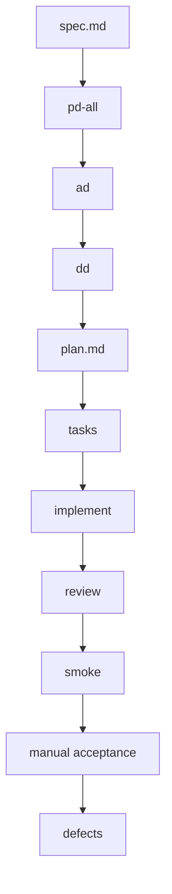
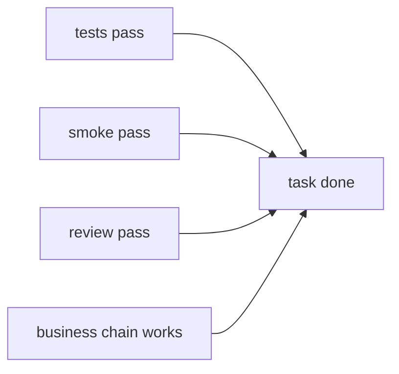
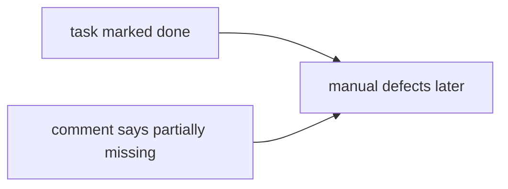

# Intent Library Quality Audit

## 结论摘要

以“指令库管理”为样本看，这次大量明显问题的主因不是单一的 `PD`、`AD` 或 `DD` 没写清楚，而是下面 4 类问题叠加：

1. **流程定义强，但执行约束弱**
   `speckit` 命令链已经把 `spec -> PD -> AD -> DD -> plan -> tasks -> implement -> review -> smoke -> defects` 定义得很完整，但多数门禁仍停留在“命令里要求”或“任务里勾选”，缺少硬校验。

2. **文档链路存在局部矛盾与遗漏**
   指令库相关设计并非一片空白，但存在跨阶段不一致，导致实现者、测试者、验收者可能各自依据不同版本的“正确答案”工作。

3. **`tasks` 完成信号失真**
   任务文件显示“100% 完成”，但正文同时保留“未实现”“UI only”“待确认”等备注，说明任务完成定义和真实可用性交付脱钩。

4. **实现与测试更像“接口/页面存在”，而不是“业务闭环可用”**
   很多缺陷不是复杂算法错误，而是契约字段不一致、异步事务时序错误、前端假成功提示、分页/响应解析错误、占位能力被当作完成能力。

结论上，这更像是一次**研发治理失效**，不是单个开发问题。核心症结是：

- 上游设计没有被强制收敛为唯一真相
- `tasks` 没有严格约束“什么叫完成”
- 自动化测试没有锚定真实业务闭环
- 冒烟与人工验收发生得太晚，而且没有反向阻塞前面的“已完成”

## 一、理论流程本来应该保证什么

根据 `.cursor/commands`、`.specify/templates` 和 `.cursor/rules/specify-rules.mdc`，`speckit` 的理论责任链如下：

### 1. `spec`

理论职责：

- 明确用户故事、验收场景、边界条件
- 给每条 `FR` 打上 `[UI:<module>] / [API] / [Infra]` 标签
- 建立“模块与交付物映射表”，为后续 `PD` 拆模块

实际观察：

- `spec.md` 在 `v1.4` 已补齐模块映射与 FR 标签，基础并不差
- “指令库管理”相关 `FR-039~054` 其实写得很细，尤其 D014/D016 后已经把很多规则补进去了

判断：

- **不是主要失效点**
- 但 `spec` 的细化成果没有被后续阶段持续机械校验

### 2. `PD`

理论职责：

- 把 UI 类 FR 变成模块化交互原型
- 对页面、流程、状态、异常处理给出可验收载体
- 每个模块 README 要有 FR 追溯矩阵

实际观察：

- `pd-intent-library` 覆盖面很大，已形成列表、详情、数据集、数据集详情、测试页五类主交互
- `README` 明确承认 `FR-050` 仅“部分覆盖”，说明 PD 本身并未假装完整

判断：

- **PD 不是“完全没讲清楚”**
- 但 PD 存在两类问题：
  - 局部未覆盖完整，却没有在 downstream 形成强制阻塞
  - PD 中定义的能力没有稳定落到 `tasks` 的完成定义里

### 3. `AD`

理论职责：

- 把 PD 交互翻译成 API 契约、模块关系、数据流
- 保证 PD 中的主要操作都有对应接口

实际观察：

- `ad-intent-library.md` 覆盖面大，但有局部不一致
- 最典型的是 `FR-047` 在 `ad-dialog-profile.md` 中同时出现：
  - “方案至少绑定 1 个指令库”
  - “若绑定才校验 published，不强制绑定”
- `ad-intent-library.md` 还引用了不存在的 `model-download.html`

判断：

- **AD 有质量问题，但不是主因**
- 它的问题在于：一旦出现矛盾，没有下游自动机制拦截并要求修正文档后再继续

### 4. `DD`

理论职责：

- 把实体、状态机、算法、错误码、实现映射写成可编码规格
- 成为代码与测试的“唯一技术真相”

实际观察：

- `dd-intent-library.md` 很完整，实体、状态机、算法、错误码、UI 组件清单都不算少
- 但缺少若干“对真实可用性至关重要”的实现约束，例如：
  - 外部服务依赖（API Key）调用前必须显式校验
  - LLM 生成接口何时同步、何时异步
  - prompt 占位符支持列表要明文化
  - 测试消息列表分页上限与全局分页口径如何处理

判断：

- **DD 整体强于 AD**
- 但它仍偏“结构正确”，对一些“最容易把系统做成假闭环”的行为约束不够硬

### 5. `plan`

理论职责：

- 做“实施规划桥梁”
- 同步项目结构、阶段规划、测试策略
- 显式要求路径一致性与 PD 模块到源码目录映射

实际观察：

- `plan.md` 明文要求“项目路径一致性”
- 但实际源码路径示例使用的是 `smartchef-platform/`，而缺陷与实现落点已经在 `smartchef-v2/`
- 它还给出了大量“设计后重新检查全部通过”的结论，但这些结论和实际缺陷密度明显不一致

判断：

- **plan 的问题不是内容缺失，而是校验过度乐观**
- 它更像“理想状态说明”，而不是基于真实实现证据的阶段门禁

### 6. `tasks`

理论职责：

- 以 `PD` 为首要驱动，把任务拆到页面、接口、模型、服务、测试
- 强制 TDD
- `[F-PAGE]` 必须带 PD UI Checklist
- 模块完成后要做 PD 覆盖率、占位页清零、业务链路闭环、Code Review、全量测试

实际观察：

- 这套规则本身已经非常先进
- 但 `tasks-intent-library.md` 出现了明显自相矛盾：
  - 顶部写 `41/41 完成`
  - 中间仍写 `Excel 导入导出尚未实现`
  - `LLM 合成` 一度是 `UI only`
  - `智能分析报告` 标注“需确认是否完整实现”
- `tasks/README.md` 也显示“指令库管理 100%”，但其他模块普遍是“待核查”

判断：

- **这是本次问题的核心失效点之一**
- `tasks` 已经不再是“真实完成状态”，而更像“宣称完成状态”

### 7. `implement / review / smoke / defects`

理论职责：

- `implement`: 指挥官调度子代理，按垂直切片交付，禁止 placeholder 和桩代码冒充完成
- `review`: 必须做 Code Review，包含 PD 覆盖率与业务链路完整性
- `smoke`: 要走真实浏览器 + 真实业务链路
- `defects`: 要把问题路由回代码、设计或需求

实际观察：

- 从 D031 之后的大量缺陷看，以上门禁并没有真正拦住问题
- 尤其是 D031、D046 这种“功能存在但本质是假实现/假闭环”的问题，本应在 `implement` 模块检查点或 `smoke` 被拦住

判断：

- **流程末端有“发现问题”的能力，但缺少“阻止前面宣称完成”的能力**

## 二、指令库管理文档链路的具体问题

### 1. 上游资产总体不差，但不是唯一真相

“指令库管理”在 `spec / PD / AD / DD / plan / tasks` 各层都已经有相当多内容，说明问题不是“没设计”。

真正的问题是：**文档多，但没有被强约束为单一可信源**。

### 2. 关键不一致点

#### 2.1 FR-047 口径冲突

同一业务规则在不同文档里存在两套答案：

- `spec.md`: 对话方案不强制绑定指令库
- `dd-dialog-profile.md`: 若绑定则必须有 published，不强制绑定
- `ad-dialog-profile.md` 的一段时序图：先校验“至少绑定 1 个指令库”
- 同文件后面的门禁表又回到“不强制绑定”

影响：

- 开发、测试、验收都可能拿到不同的“正确答案”
- 这类矛盾不是实现层能自己判断的，必须在设计阶段被消掉

#### 2.2 PD/AD 资产引用不一致

- `ad-intent-library.md` 提到 `model-download.html`
- 实际 `pd-intent-library` 没有该页面，下载被设计在 `detail.html`

影响：

- 后续任务拆分和实现边界容易漂移

#### 2.3 `plan` 路径与真实工程脱节

- `plan.md` 的工程结构写的是 `smartchef-platform/`
- 实际缺陷修复与当前实现落点主要在 `smartchef-v2/`

影响：

- 计划并未成为真实代码的可信导航

#### 2.4 `tasks` 的完成状态与正文说明冲突

这是最严重的不一致：

- 状态看起来“已经做完”
- 备注却持续承认“未实现”“占位”“待确认”

影响：

- 子代理、主代理、人工查看者都会被误导
- 这相当于把“任务完成”从证据改成了主观判断

## 三、D031 以后缺陷的模式

### 1. 缺陷不是随机散点，而是高度集中

`D031` 到 `D047` 大致集中在 5 类：

1. **PD/信息架构不一致**
2. **接口契约对不齐**
3. **异步任务/事务状态处理不正确**
4. **前端假成功、假进度、假完成**
5. **列表/详情字段映射与分页解析错误**

### 2. 典型缺陷说明了什么

#### D031: 不是简单 UI 缺口，而是“设计到实现的链路丢失”

暴露出：

- 数据集管理入口 IA 与 PD 不一致
- LLM 合成是文案上的“像有功能”，实际没有服务端闭环
- 训练接口在异步 ORM 场景下出现 500
- 集成测试没有覆盖关键写路径

这说明问题同时存在于：

- 任务拆解
- 实现纪律
- 测试覆盖

#### D046: 这是最典型的“假实现”

三层问题叠加：

- 前端一开始根本没调 API，只弹成功类提示
- 后端改成 `202` 后，错误又被藏到后台任务里
- 服务层还吞异常，最终表现为样本永远为 0

这说明：

- 团队没有建立“禁止假成功提示”的硬规则
- 也没有建立“异步任务必须可观测、可回传结果”的默认工程规范

#### D042 / D043 / D044 / D045

这些缺陷都不复杂，但极伤可用性：

- `text` / `content` 字段名不一致
- 前端错误解析数组与分页结构
- `page_size=200` 与后端 `le=100` 冲突
- 训练集名称没有序列化回前端

这类问题说明：

- 契约测试存在，但没有覆盖“前后端真实联调形态”
- 或者测试覆盖了接口存在，却没有覆盖页面真实消费方式

#### D037 / D047

这类缺陷属于“用户信任受损型”：

- 请求取消被展示为错误
- 0/500 的伪进度制造假数据错觉

它们不是系统崩溃级 bug，却会让用户形成“系统不靠谱”的整体判断。

## 四、为什么这些问题没有被更早发现

## 4.1 `tasks` 的“完成”不依赖证据

当前最致命的问题是：任务文件可在没有真实业务闭环的情况下显示完成。

应该成立的关系是：

但现在更接近：

### 4.2 测试更偏“部件存在”，不够“链路闭环”

从缺陷反推，测试体系至少有 4 个空洞：

- 契约测试没有覆盖前端实际使用的请求/响应形态
- 集成测试没有覆盖关键写路径、异步时序和事务提交顺序
- E2E/冒烟没有把“假成功提示”视为失败
- 缺少“核心业务链路”强制验证清单

### 4.3 Review 与 Smoke 没有成为硬阻塞

命令里已经定义了：

- Placeholder 页面不能通过
- 业务链路不闭环不能通过
- PD 覆盖率不足不能通过

但实际 D031、D046 这类问题说明这些规则并没有被当作“发布前一票否决项”。

### 4.4 人工验收承担了本该前置的工作

现在的人工验收更像在做两件本不该由人工兜底的事：

- 替系统发现“文档口径冲突”
- 替自动化测试发现“功能虽然有 UI，但链路不工作”

这导致：

- 验收阶段问题密度极高
- 人工验收成本异常大
- 缺陷回流时已经太晚

## 五、主因排序

综合判断，本次问题的主因排序如下：

1. **任务完成定义失真**
   这是第一主因。因为它直接允许“未闭环功能”被宣布完成。

2. **实现质量与契约执行不稳定**
   很多问题是字段名、分页、异步提交、异常传播、前端解析等基础工程问题。

3. **测试门禁没有锚定真实业务闭环**
   测试存在，但与真实用户链路脱节。

4. **设计链路的局部矛盾未被前置消解**
   它不是最大问题，但会放大后续实现和验收分歧。

5. **PD 局部未覆盖完整**
   这是次要因素。PD 有缺口，但不是造成“几乎不可用”的主要原因。

换句话说：

- **不是因为 PD 太差，所以系统不可用**
- **而是因为系统允许“不完全实现 + 不完全验证”的东西流到验收**

## 六、针对 Speckit 的优化建议

## 6.1 P0：先把“完成”变成证据驱动

### 建议 1：重写 `tasks` 完成定义

任何任务，尤其是 `[F-PAGE]`、`[B-SERVICE]`、`[B-API]`，只有同时满足以下条件才允许标记完成：

- 对应测试通过
- 对应 PD Checklist 全勾选，或明确标注“延期/不在范围”
- 无 placeholder / UI only / TODO / 待确认 残留
- 关键接口不是假成功

建议新增一条规则：

- **任务正文中出现“未实现 / UI only / 待确认 / placeholder”时，该任务禁止勾选完成**

### 建议 2：在 `tasks-template` 中加入“未完成声明区”

不要把未完成能力藏在备注里。应该有显式结构：

- `Deferred`
- `Stub`
- `Out of Scope`
- `Blocked By`

且这些项必须同步影响模块进度，不得仍显示 100%。

### 建议 3：模块进度必须从任务状态计算，而非人工填写

`tasks/README.md` 的模块进度不要手写。应从各任务文件自动汇总生成。

## 6.2 P0：建立“核心业务链路”强制验证

### 建议 4：每个 PD 模块必须定义 1-3 条核心链路

以指令库模块为例，至少强制验证：

1. 新建库 -> 新建数据集 -> 添加意图 -> 创建模型
2. 训练 -> 评估 -> 变为 `testable/published`
3. 模型测试页单条测试 -> 返回真实 assistant 消息

这些链路必须在 `tasks` 中拥有显式测试项，且不能只测第一步。

### 建议 5：把“假成功”列为严重失败

新增统一规范：

- 前端未真正调用 API，不得提示成功
- 后台任务若异步执行，必须有状态查询和失败原因回传
- 无真实结果时只能提示“已提交任务”，不能提示“已生成成功”
- 硬编码分母、硬编码统计、mock 值冒充真实结果，一律按严重问题处理

## 6.3 P1：加强设计一致性校验

### 建议 6：在 `speckit.tasks` 前增加“文档冲突扫描”

目标不是检查文档够不够长，而是检查以下几类冲突：

- 同一 FR 在 `spec / AD / DD` 是否有不同口径
- `PD` 页面文件是否真实存在且被 `AD` 引用
- `plan` 路径与 `tasks` 路径是否一致
- `PD README` 标记“部分覆盖”的项是否已被 downstream 标记风险

输出结果应分三级：

- `BLOCKER`: 必须修设计后再生成 tasks
- `WARNING`: 允许继续，但 tasks 中必须显式带风险提示
- `INFO`

### 建议 7：把 DD 中“易错实现约束”模板化

对容易失真的能力，在 DD 模板里新增专门小节：

- 外部依赖前置校验
- 同步 / 异步策略判定
- 真实成功信号定义
- 失败回传机制
- 前端消费契约示例

这些内容对“可用性”影响非常大，不能只靠实现者经验补。

## 6.4 P1：测试从“覆盖接口”升级为“覆盖消费方式”

### 建议 8：增加前后端消费契约测试

不仅测接口 schema，还要测真实消费形态，例如：

- 前端发的 body 字段名
- 分页结构 `items/page/page_size`
- 发送消息接口返回数组还是对象
- 下载接口返回文件还是 JSON

这能显著减少 D042-D045 这类问题。

### 建议 9：异步链路必须有状态机测试

对训练、评估、批量任务类接口，强制测试：

- 提交后立即状态
- 后台执行中的状态
- 完成后的状态
- 前端轮询感知
- 失败状态展示

不要只测“POST 成功返回 200/202”。

## 6.5 P1：把 Smoke 从“浏览页面”升级为“验业务”

### 建议 10：`smoke` 默认包含每模块一条真实链路

不要只检查：

- 页面能打开
- 控制台没报错
- 有列表和按钮

必须加上：

- 能创建
- 能执行
- 能看到真实结果
- 没有 placeholder / fake success / fake progress

否则 `smoke` 很容易通过，但产品不可用。

## 6.6 P2：让 defects 真正反向修正规范

### 建议 11：缺陷必须反向更新“哪个环节本该拦住它”

每个缺陷除了 `design_ref`，建议新增：

- `should_have_been_caught_by`: `spec | pd | ad | dd | tasks | tests | review | smoke`

这样一段时间后可以统计：

- 究竟是设计问题多
- 还是 tasks 问题多
- 还是测试门禁问题多

这会比单纯按 UI/API/需求分类更有治理价值。

### 建议 12：建立“缺陷模式 -> 模板规则”回灌机制

像 D031-D047 这批缺陷已经足够形成模板增强项：

- 假成功规范
- 真实二进制下载规范
- 分页上限一致性
- 前端消费契约示例
- 异步任务提交/轮询/失败回传

每类高频缺陷都应沉淀回模板，而不是只在具体模块里修一次。

## 七、建议的后续落地顺序

如果只抓最有效的动作，建议按这个顺序推进：

1. **先修 `tasks` 完成定义**
   这是最值钱的一步，因为它能立刻阻止“看似完成、实际没完成”继续扩散。

2. **补“核心业务链路”测试清单**
   先不用追求全量，只要把每模块 1-3 条关键链路固化，就能大幅减少验收期爆雷。

3. **加文档冲突扫描**
   把 `FR-047` 这类冲突在 `tasks` 之前就拦住。

4. **建立反假成功规范**
   这会显著提升产品真实可用性和用户信任。

5. **把 defects 反向沉淀回模板**
   形成持续改进闭环。

## 八、最终判断

“指令库管理”暴露出来的问题，本质上不是“文档写得不够多”，而是**文档、任务、实现、测试、验收之间缺少基于证据的闭环约束**。

如果只继续补文档，不改门禁，下一轮大概率还会出现：

- 文档越来越厚
- `tasks` 继续显示完成
- 实际系统仍有大量显性缺陷

真正能提升研发有效性与可用性的，是把 `speckit` 从“强流程描述”升级成“强证据门禁”：

- 文档冲突先拦截
- 任务完成看证据
- 测试看业务链路
- 冒烟查真实闭环
- 缺陷反向修模板

这样后续研发的产物，才更可能是**有效、可用、可验收**的，而不只是“文档齐全、任务勾完、代码也写了”。

## 九、建议落地完成报告

本轮已按“规则先行，模板承载，命令收口”的方案，把审计建议落实到 `speckit` 核心规范文件中；本报告所称“已落地”仅指规则/模板/命令/报告层，不把当前工作区中可能并存的 `specs/master` 独立改动计入本轮规范改造成果，也未扩展到 CI / 自动脚本层。

### 9.1 落地范围

- 规则层：`specify-rules.mdc`
- 模板层：`spec-template.md`、`plan-template.md`、`tasks-template.md`、`checklist-template.md`
- 命令层：`speckit.specify.md`、`speckit.plan.md`、`speckit.tasks.md`、`speckit.implement.md`、`speckit.review.md`、`speckit.smoke.md`、`speckit.defects.md`

### 9.2 逐条对照结果

| 建议 | 结论 | 本轮落地点 | 说明 |
|------|------|-----------|------|
| 建议 1：重写 `tasks` 完成定义 | 已落地 | 规则 + `tasks-template` + `speckit.tasks` + `speckit.implement` | 明确无证据不得完成，禁止 `未实现 / UI only / placeholder / TODO / mock / stub` 仍勾选完成 |
| 建议 2：加入“未完成声明区” | 已落地 | `spec-template`、`plan-template`、`tasks-template`、`speckit.tasks` | 新增 `Deferred / Stub / Out of Scope / Blocked By` 固定结构，禁止把未完成事实藏在备注里 |
| 建议 3：模块进度自动计算 | 部分落地 | `tasks-template`、`speckit.tasks`、规则层 | 已把“进度必须由勾选状态自动汇总”写成硬约束，但本轮未新增生成脚本或 CI 校验 |
| 建议 4：每个 PD 模块定义 1-3 条核心链路 | 已落地 | `spec-template`、`plan-template`、`tasks-template`、`speckit.specify`、`speckit.plan`、`speckit.tasks`、`speckit.smoke` | 核心链路与真实成功信号已成为上游必填项和下游必检项 |
| 建议 5：把“假成功”列为严重失败 | 已落地 | 规则层、`spec-template`、`tasks-template`、`speckit.implement`、`speckit.review`、`speckit.smoke` | 假成功提示、假进度、假统计、仅更新状态无真实逻辑，统一按失败处理 |
| 建议 6：`speckit.tasks` 前增加文档冲突扫描 | 已落地 | `plan-template`、`speckit.plan`、`speckit.tasks`、规则层 | 引入 pre-flight 扫描，要求对冲突输出 `OK / WARNING / BLOCKER` 并在 `BLOCKER` 时停止 |
| 建议 7：把 DD 中易错实现约束模板化 | 部分落地 | `spec-template`、`plan-template`、规则层、命令层 | 已把真实成功信号、异步策略、失败回传、消费契约等要求模板化到规范层；但未直接改 DD 模板文件 |
| 建议 8：增加前后端消费契约测试 | 已落地 | `plan-template`、`tasks-template`、`speckit.plan`、`speckit.tasks` | 已把字段名、分页、下载、数组/对象返回形态纳入固定测试要求 |
| 建议 9：异步链路必须有状态机测试 | 已落地 | `plan-template`、`tasks-template`、`speckit.plan`、`speckit.tasks`、`speckit.smoke` | 明确要求覆盖提交中/处理中/成功/失败及失败回传 |
| 建议 10：`smoke` 默认包含每模块一条真实链路 | 已落地 | `speckit.smoke`、规则层、`plan-template` | 冒烟前读取核心链路，若存在桩实现、假成功、假进度则一票否决 |
| 建议 11：缺陷反向记录“本应被谁拦住” | 部分落地 | 规则层、`speckit.defects` | 已新增 `should_have_been_caught_by` 字段规范与 Phase 7 回灌流程；但本轮未改缺陷模板和扫描脚本 |
| 建议 12：建立“缺陷模式 -> 模板规则”回灌机制 | 已落地 | 规则层、模板层、命令层 | 已把假成功、消费契约、异步状态机、路径一致性、冲突扫描沉淀为通用规范，而非停留在单模块经验 |

### 9.3 四大核心痛点覆盖情况

| 核心痛点 | 本轮覆盖情况 | 主要落地点 |
|----------|-------------|-----------|
| 完成定义失真 | 已覆盖 | 规则层 + `tasks-template` + `speckit.tasks` + `speckit.implement` |
| 核心链路缺失 | 已覆盖 | `spec-template` + `plan-template` + `tasks-template` + `speckit.smoke` |
| 反假成功不足 | 已覆盖 | 规则层 + `speckit.implement` + `speckit.review` + `speckit.smoke` |
| 文档冲突未前置扫描 | 已覆盖 | `plan-template` + `speckit.plan` + `speckit.tasks` |

### 9.4 本轮刻意未做的事项

- 本轮规范改造未要求回灌 `specs/master` 现有产物；若当前工作区存在该目录下的独立变更，应视为并行工作流，后续仍需按新规范重生成或逐份复核
- 未修改业务代码，因此尚未证明历史缺陷会自动消失；这里只是补强后续生成与实施门禁
- 未扩展到缺陷模板、扫描脚本、CI 自动校验，因此“自动汇总进度”“缺陷字段强校验”仍需下一轮补齐

### 9.5 结论

本轮改造已经把原先停留在“建议层”的治理要求，落成了可重复执行的规范骨架。后续若继续沿用这些规则生成 `spec / plan / tasks` 并执行 `implement / review / smoke / defects`，至少能更早暴露以下问题，而不是等到人工验收才集中爆雷：

- 文档口径冲突
- 任务完成定义失真
- 核心业务链路未闭环
- 假成功、假进度、假统计
- 前后端真实消费契约不一致
