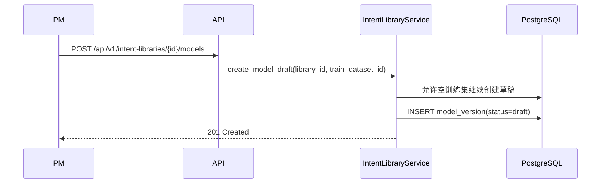

# 架构设计 (AD): 指令库管理冲突扫描示例

## 1. 模块概述

本示例故意保留两类冲突：

1. AD 引用不存在的 PD 页面 `model-download.html`
2. AD 允许空训练集创建模型草稿，与 spec / dd 约束冲突

**PD 页面**: `index.html`、`detail.html`、`model-download.html`

## 2. 核心数据流

### 2.1 模型草稿创建

## 3. 接口契约

| 方法 | 路径 | 说明 |
|------|------|------|
| POST | /api/v1/intent-libraries/{id}/models | 创建模型草稿，允许空训练集 |
