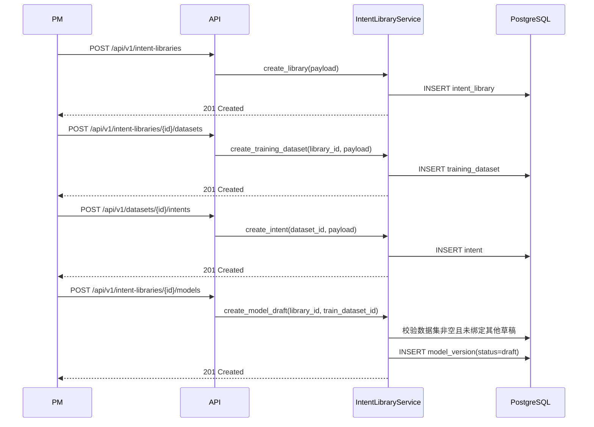

# 架构设计 (AD): 指令库管理最小闭环示例

## 1. 模块概述

本示例只覆盖“指令库最小闭环”：

- 指令库 CRUD（只要求创建和查看）
- 训练数据集创建
- 数据集内意图维护
- 模型草稿创建并绑定训练集

**PD 页面**: `index.html`、`detail.html`、`datasets.html`、`dataset-detail.html`

## 2. 核心数据流

### 2.1 最小闭环

**真实成功信号**:
- 库详情页能看到 draft 模型
- draft 模型上显示绑定的训练集名称
- 数据集详情页能看到至少一个意图

## 3. 接口契约

### 3.1 指令库

| 方法 | 路径 | 说明 |
|------|------|------|
| GET | /api/v1/intent-libraries | 指令库列表 |
| POST | /api/v1/intent-libraries | 创建指令库 |
| GET | /api/v1/intent-libraries/{id} | 指令库详情 |

### 3.2 数据集与意图

| 方法 | 路径 | 说明 |
|------|------|------|
| POST | /api/v1/intent-libraries/{id}/datasets | 创建训练数据集 |
| GET | /api/v1/intent-libraries/{id}/datasets | 训练数据集列表 |
| POST | /api/v1/datasets/{id}/intents | 创建意图 |
| GET | /api/v1/datasets/{id}/intents | 意图列表 |

### 3.3 模型草稿

| 方法 | 路径 | 说明 |
|------|------|------|
| POST | /api/v1/intent-libraries/{id}/models | 创建模型草稿并绑定训练集 |
| GET | /api/v1/intent-libraries/{id}/models | 模型列表 |

## 4. 风险与约束

- `library_key` 必须唯一，且创建后不可修改
- 训练数据集为空时禁止创建模型草稿
- 训练、评估、发布不在本示例范围，必须在下游显式登记为 `Deferred`
