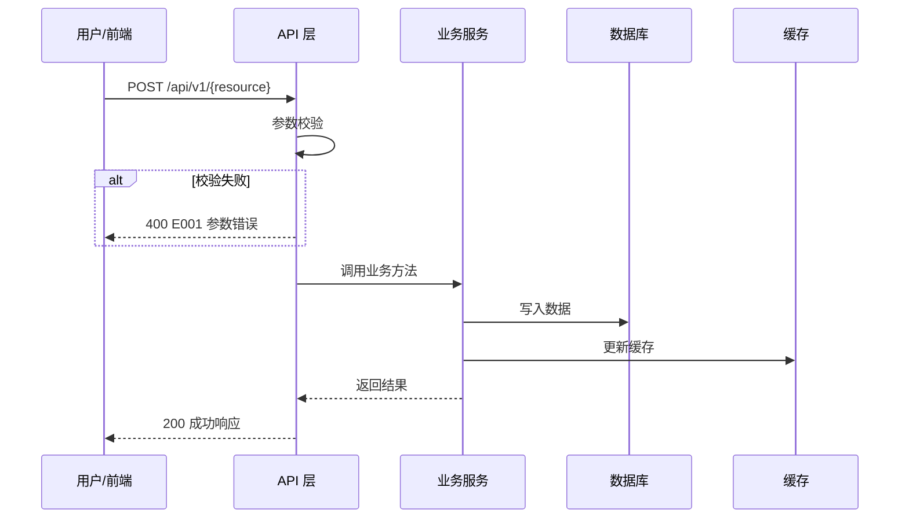

# 架构设计 (AD) 模板

## 1. AD 的定位

### 1.1 在研发流程中的位置

```
spec.md (业务需求) → pd-<module>/ (交互原型) → ad.md (架构设计) ← 本模板 → dd.md → plan.md → code
```

### 1.2 AD 与相邻文档的职责边界

| 维度 | spec.md | PD | **ad.md** | dd.md |
|------|---------|-----|----------|-------|
| 关注点 | 业务需求、功能范围 | 交互逻辑、页面状态 | **模块划分、数据流、接口契约** | 字段级定义、算法伪代码 |
| 回答 | "做什么" | "怎么操作" | **"系统怎么组织"** | "具体怎么实现" |
| 粒度 | FR 级别 | 页面/组件级 | **模块/服务级** | 字段/方法级 |
| 读者 | PM、业务方 | UI/UX、前端 | **架构师、技术负责人** | 开发工程师 |

### 1.3 AD 的核心目标

1. **模块边界清晰** [MUST]：系统拆分为职责单一、边界明确的模块
2. **数据流可追溯** [MUST]：每个业务流程的数据从入口到存储的完整链路
3. **接口契约完整** [MUST]：模块间/前后端 API 有明确的输入、输出、错误码
4. **技术选型有据** [MUST]：每项选型有理由，非功能约束有量化目标
5. **风险可控** [SHOULD]：关键风险已识别并有缓解策略
6. **可演进** [SHOULD]：架构支持功能扩展，不因新模块引入而大改

---

## 2. 设计原则

### 2.1 模块自治 [MUST]

- 每个模块有独立的数据存储（或明确共享的边界）
- 模块间通过 API / 事件通信，禁止跨模块直接访问数据库
- 模块可独立部署、独立测试（即使当前是单体部署）

### 2.2 契约先行 [MUST]

- **先定义接口契约，再实现模块内部逻辑**
- API 契约包含：路径、方法、输入结构、输出结构、错误码、版本
- 前后端、模块间可基于契约并行开发

### 2.3 数据流驱动 [MUST]

- 每个核心业务场景 MUST 有完整的数据流图
- 数据流图标注：触发点 → 处理节点(含模块名) → 存储操作 → 响应
- 异常分支 MUST 在数据流图中标注（不仅在文字中描述）

### 2.4 可观测性内置 [SHOULD]

- 关键操作的日志、指标、追踪在架构层面规划
- 不要把可观测性留到实现阶段才考虑

### 2.5 安全作为约束 [MUST]

- 认证、授权、数据加密在架构层面确定方案
- 安全不是功能特性，而是架构约束

---

## 3. 领域划分

### 3.1 核心域 [MUST]

```yaml
# 核心域: 业务差异化竞争力, 需要重点投入
{领域A}:
  职责: {核心业务逻辑}
  核心实体: [{实体1}, {实体2}]
  关键流程: [{流程1}, {流程2}]

{领域B}:
  职责: {核心业务逻辑}
  核心实体: [{实体3}]
  关键流程: [{流程3}]
```

### 3.2 支撑域 [MUST]

```yaml
# 支撑域: 支撑核心域运作的工具能力
{领域C}:
  职责: {支撑能力}
  服务的核心域: [{领域A}, {领域B}]
```

### 3.3 通用域 [SHOULD]

```yaml
# 通用域: 通用基础能力, 可复用或使用成熟方案
{领域D}:
  职责: {通用能力, 如认证、日志、配置}
  实现策略: {自研/开源方案/云服务}
```

---

## 4. 模块结构设计

### 4.1 模块关系图 [MUST]

```
                    ┌─────────────┐
                    │   前端 UI   │
                    └──────┬──────┘
                           │ REST API
                           ▼
┌─────────────┐      ┌─────────────┐      ┌─────────────┐
│   领域A模块  │◄────►│   API 层    │◄────►│   领域B模块  │
│  - 子模块A1  │      └──────┬──────┘      │  - 子模块B1  │
│  - 子模块A2  │             │              │  - 子模块B2  │
└──────┬──────┘             │              └──────┬──────┘
       │                     │                     │
       ▼                     ▼                     ▼
┌─────────────┐      ┌─────────────┐      ┌─────────────┐
│  数据存储A   │      │   缓存层    │      │  数据存储B   │
└─────────────┘      └─────────────┘      └─────────────┘
```

### 4.2 模块职责矩阵 [MUST]

| 模块 | 职责 | 核心实体 | 依赖模块 | 关键技术 | 对应 FR |
|-----|------|---------|---------|---------|---------|
| {模块A} | {职责} | {实体列表} | {依赖} | {技术} | FR-xxx |
| {模块B} | {职责} | {实体列表} | {依赖} | {技术} | FR-xxx |

### 4.3 模块间通信方式 [MUST]

| 调用方 | 被调方 | 通信方式 | 同步/异步 | 失败策略 |
|--------|--------|---------|----------|---------|
| {模块A} | {模块B} | REST API | 同步 | 超时重试 3 次 |
| {模块B} | {模块C} | 事件/消息 | 异步 | 死信队列 |

---

## 5. 核心数据流 [MUST]

### 5.1 数据流图规范

每个核心业务场景 MUST 绘制数据流图，SHOULD 使用 Mermaid：



### 5.2 流程: {业务流程A} [MUST]

**触发点**: {用户操作/定时任务/API 调用}
**涉及模块**: {模块列表}
**对应 FR**: FR-xxx

```mermaid
sequenceDiagram
    {根据实际流程绘制}
```

**异常处理**:

| 异常场景 | 检测方式 | 处理策略 | 错误码 | 用户提示 |
|---------|---------|---------|--------|---------|
| {场景A} | {检测} | {策略} | E001 | {提示} |
| {场景B} | {检测} | {策略} | E002 | {提示} |

---

## 6. 接口契约 [MUST]

### 6.1 API 设计规范

**响应信封 [MUST]**:

```json
{
  "code": "000000",
  "message": "success",
  "data": { },
  "timestamp": "2026-03-17T10:00:00Z",
  "request_id": "uuid"
}
```

**分页响应 [MUST]**:

```json
{
  "code": "000000",
  "data": {
    "items": [],
    "total": 100,
    "page": 1,
    "page_size": 20
  }
}
```

**版本策略**: URL 路径版本化 `/api/v1/`，破坏性变更递增版本号。

### 6.2 {资源A} API

#### 列表查询

- **路径**: `GET /api/v1/{resource_a}`
- **输入** (Query):

| 参数 | 类型 | 必填 | 默认值 | 说明 |
|------|------|------|--------|------|
| page | int | 否 | 1 | 页码 |
| page_size | int | 否 | 20 | 每页条数, 最大 100 |
| status | string | 否 | - | 状态筛选 |
| keyword | string | 否 | - | 名称模糊搜索 |

- **输出**: 分页响应，items 为 {资源A} 列表
- **错误码**: 无特殊错误码

#### 创建

- **路径**: `POST /api/v1/{resource_a}`
- **输入** (Body):

```json
{
  "name": "类型: string, 必填, 最大 100 字符",
  "description": "类型: string, 可选, 最大 500 字符",
  "config": "类型: object, 可选, 默认 {}"
}
```

- **输出**: 创建后的 {资源A} 对象
- **错误码**:

| 错误码 | 场景 | HTTP 状态 |
|--------|------|----------|
| E001 | name 为空 | 400 |
| E002 | name 重复 | 409 |

#### 更新 / 删除 / 详情

*(按相同格式补充)*

### 6.3 跨模块接口 [SHOULD]

模块间内部调用的接口也 SHOULD 有契约定义：

| 接口 | 调用方 → 被调方 | 方法签名 | 返回类型 | 异常 |
|------|---------------|---------|---------|------|
| {接口A} | {模块X} → {模块Y} | `method(param: Type)` | `Result<T>` | {异常类型} |

---

## 7. 从 spec.md + PD 到 AD 的转化方法

### 7.1 AD 的范围与拆分规则 [MUST]

AD 关注模块间的关系、通信、共享基础设施，因此**始终需要一份全局视角的核心文档**。
但当模块较多时，所有内容挤在单个文件中会导致文档过长、维护困难。

**拆分规则**:

| 模块数量 | 组织方式 | 说明 |
|---------|---------|------|
| ≤ 3 个 | 单文件 `ad.md` | 所有内容在一个文件中 |
| > 3 个 | 文件夹 `ad/` | 拆分为核心文档 + 模块文档 |

**> 3 个模块时的文件夹结构** [MUST]:

```
specs/<branch>/
  ad/
    README.md              # AD 全局索引 (类似 pd-index.md)
    ad-global.md           # 全局架构: 领域划分、模块关系图、通信方式、
                           #           技术选型、部署架构、安全约束、横切关注点
    ad-<module-a>.md       # 模块 A 详细架构: 数据流、接口契约、模块内设计
    ad-<module-b>.md       # 模块 B 详细架构
    ad-<module-c>.md       # ...
```

**拆分原则**:

- `ad-global.md` [MUST]: 包含跨模块的全局内容——领域划分(§3)、模块关系图(§4.1)、模块间通信(§4.3)、
  技术选型(§8)、部署架构(§8.4)、安全约束(§8.3)、横切关注点、需求追溯矩阵
- `ad-<module>.md` [MUST]: 包含模块内部的详细内容——该模块的核心数据流(§5)、接口契约(§6)、
  特定技术领域架构(§8.5, 如有)、模块级风险
- `README.md` [MUST]: AD 全局索引，列出所有模块文档、覆盖 FR、状态

**README.md 格式**:

```markdown
# 架构设计 (AD) 索引

| 文档 | 覆盖范围 | 覆盖 FR | 状态 |
|------|---------|---------|------|
| ad-global.md | 全局架构 (领域划分/技术选型/部署/安全) | 全部 | ✅ |
| ad-intent-library.md | 指令库域 (数据流+API+ML架构) | FR-039~054 | ✅ |
| ad-knowledge-base.md | 知识库域 | FR-004~006 | 🔲 待补充 |
| ad-dialog-profile.md | 对话方案域 | FR-007~011 | 🔲 待补充 |
```

**≤ 3 个模块时**仍使用单文件 `ad.md`，放在 `specs/<branch>/ad.md`。

### 7.2 转化步骤 [MUST]

**步骤 1: 提取模块清单**

从 spec.md 的模块映射表提取所有模块，标注类型：

```yaml
前端模块:
  - 名称来自 PD 模块（pd-<key>/ 的侧边栏菜单结构）
后端模块:
  - UI 模块对应的 API 服务（每个 PD 模块通常对应一个 API 模块）
  - 纯 API 模块（spec.md 中 [API] 标签的 FR）
基础设施模块:
  - 认证/授权、日志、配置、缓存等
```

**步骤 2: 绘制模块关系**

基于 PD 的跨模块引用 (pd-index.md) + spec.md 的 FR 依赖，绘制模块关系图。

**步骤 3: 为每个核心业务场景绘制数据流**

从 PD 的页面操作入手——每个 PD 页面上的关键操作（创建、编辑、删除、状态流转）都对应一条数据流。

**步骤 4: 定义接口契约**

从数据流中提取 API 节点，定义接口契约。优先级：
1. 前后端接口（PD 页面依赖的 API）
2. 跨模块接口（模块间的内部调用）
3. 外部集成接口（第三方服务）

**步骤 5: 确定技术选型**

基于 constitution.md 约束 + spec.md 非功能需求，确定技术选型。

**步骤 6: 识别横切关注点**

认证、授权、日志、监控、错误处理——这些跨所有模块的关注点在 AD 层面统一规划。

### 7.3 需求追溯矩阵 [MUST]

**ad.md MUST 包含 FR → AD 映射表**：

```markdown
| FR 编号 | 需求摘要 | AD 章节 | 涉及模块 | 覆盖状态 |
|---------|---------|---------|---------|---------|
| FR-001 | 角色权限管理 | §4.2 模块职责 + §6.2 API | 用户模块 | ✅ 完整 |
| FR-017 | 对话 API | §5.2 对话数据流 + §6.3 | 对话引擎 | ✅ 完整 |
```

覆盖状态：✅ 完整 / ⚠️ 部分（需补充） / 🔗 跨文档（DD 覆盖）

### 7.4 产出物合规检查表 [MUST]

```markdown
| 模板条款 | 状态 | 说明 |
|---------|------|------|
| §2.1 模块自治 | ✅ | 模块间无直接数据库访问 |
| §2.2 契约先行 | ✅ | 所有 API 有输入/输出/错误码 |
| §2.3 数据流驱动 | ✅ | 5 个核心流程有 Mermaid 图 |
| §5 数据流含异常分支 | ✅ | 每个流程有异常处理表 |
| §6.1 响应信封统一 | ✅ | code/message/data/request_id |
```

### 7.5 对上游文档的要求 [MUST]

| 上游文档 | AD 需要的信息 | 如果缺失 |
|---------|-------------|---------|
| spec.md | 模块映射表、FR 标签、非功能需求 | 先补充 spec.md |
| PD (pd-index.md) | 模块列表、跨模块引用、页面操作 | PD 可选，但推荐 |
| PD (pd-\<module\>/) | 页面操作 → API 映射、状态机 | 无 PD 时从 FR 推导 |
| constitution.md | 技术约束、安全原则 | 使用行业默认实践 |

---

## 8. 技术选型与约束

### 8.1 技术栈 [MUST]

| 层级 | 技术 | 版本 | 选型理由 |
|-----|------|------|---------|
| 前端 | {框架} | {版本} | {理由} |
| 后端 | {框架} | {版本} | {理由} |
| 数据库 | {数据库} | {版本} | {理由} |
| 缓存 | {缓存} | {版本} | {理由} |

### 8.2 性能目标 [MUST]

| 指标 | 目标值 | 测量方法 | 对应 SC |
|-----|--------|---------|---------|
| API 延迟 | P95 < {N}ms | APM 监控 | SC-xxx |
| 并发能力 | {N} QPS | 压测 | SC-xxx |
| 数据库连接 | < {N} | 连接池监控 | - |

### 8.3 安全约束 [MUST]

- **认证**: {方案, 如 JWT Bearer Token}
- **授权**: {方案, 如 RBAC}
- **传输**: {方案, 如 HTTPS}
- **存储**: {方案, 如 AES-256 加密敏感字段}

### 8.4 部署架构 [SHOULD]

```
┌─────────────────────────────────────────┐
│  {部署环境: Docker / K8s / 云服务}      │
│  ┌──────────┐  ┌──────────┐  ┌───────┐ │
│  │ 前端容器 │  │ 后端容器 │  │ 数据库│ │
│  │ (Nginx)  │  │ (Uvicorn)│  │(PG)   │ │
│  └──────────┘  └──────────┘  └───────┘ │
└─────────────────────────────────────────┘
```

### 8.5 特定技术领域架构 [SHOULD]

> 当项目包含 **ML/AI 流水线、实时流处理、IoT 设备交互、消息队列** 等专业技术领域时，
> 该领域的架构 SHOULD 单独成节深入设计，而不是仅在技术栈表格中一行带过。
> 如果项目无此类专业领域，本节可标注"不适用"后跳过。

**常见需要深入设计的技术领域**:

| 领域 | 典型场景 | 需要覆盖的内容 |
|------|---------|---------------|
| ML/AI Pipeline | 模型训练、推理、评估 | 训练框架、模型架构、训练流水线(数据预处理→训练→评估→导出)、推理引擎(服务端/设备端)、模型版本与产物管理、任务调度 |
| 实时流处理 | 日志流、事件流、指标聚合 | 流处理框架、窗口策略、反压机制、Exactly-once 语义 |
| IoT 设备交互 | 设备管理、OTA、遥测 | 协议选型(MQTT/CoAP)、设备注册、固件分发、边缘计算 |
| 搜索引擎 | 全文检索、向量检索 | 索引策略、分词器、排序算法、缓存层 |

**ML/AI Pipeline 参考结构** (最常见场景):

```markdown
### 8.5.x {领域名称}架构

#### 整体流水线
{文本/图示: 从数据输入到最终输出的完整链路}

#### 训练框架与模型架构
| 组件 | 技术选型 | 版本 | 选型理由 |
|------|---------|------|---------|

#### 训练流水线详细设计
{数据预处理 → 模型训练 → 评估 → 导出 的详细步骤}

#### 推理引擎架构
{服务端推理 vs 设备端推理 的对比和详细设计}

#### 模型版本与产物管理
{模型文件存储结构、元数据、打包分发方案}

#### 任务调度
{训练任务的异步执行、进度通知、资源管理、超时保护}
```

---

## 9. 风险与缓解策略

| 风险 | 影响 | 可能性 | 缓解策略 | 对应 FR |
|-----|------|--------|---------|---------|
| {风险A} | 高 | 中 | {策略} | FR-xxx |
| {风险B} | 中 | 低 | {策略} | FR-xxx |

---

## 10. 输出检查清单

### 10.1 模块设计检查 [MUST]

- [ ] 每个 FR 都映射到具体模块
- [ ] 模块关系图完整，无循环依赖
- [ ] 模块间通信方式已明确（同步/异步、失败策略）
- [ ] 核心域 vs 支撑域 vs 通用域划分合理

### 10.2 数据流检查 [MUST]

- [ ] 每个核心业务场景有 Mermaid 数据流图
- [ ] 数据流图包含异常分支
- [ ] 数据流图标注了涉及的模块和存储操作

### 10.3 接口契约检查 [MUST]

- [ ] 所有前后端 API 有完整契约（路径、输入、输出、错误码）
- [ ] 核心资源 CRUD 完整性: 列表 + 详情 + 创建 + 更新 + **删除** 均有契约
- [ ] 批量操作: 涉及大量数据的资源有 **批量导入/导出** 接口
- [ ] 子资源: 父子关系资源（如数据集→意图→词槽→实体）有完整的嵌套 CRUD
- [ ] 响应信封格式统一
- [ ] 分页、筛选、排序有标准化方案
- [ ] 错误码有分类体系

### 10.4 特定技术领域检查 [SHOULD]

- [ ] 如项目含 ML/AI、实时流处理等专业领域，已在 §8.5 单独深入设计
- [ ] ML 项目: 训练流水线（数据预处理→训练→评估→导出）有完整描述
- [ ] ML 项目: 推理引擎（服务端/设备端）有明确选型和性能目标
- [ ] ML 项目: 模型产物管理（存储结构、版本、打包分发）已定义
- [ ] ML 项目: 训练任务调度（异步执行、进度、超时、资源管理）已设计

### 10.5 追溯与合规检查 [MUST]

- [ ] FR → AD 追溯矩阵完整（§7.3）
- [ ] 产出物合规检查表已填写（§7.4）
- [ ] 技术选型有理由，非功能指标可量化
- [ ] 安全约束在架构层面已确定

---

## 11. 附录

### 11.1 常见架构模式参考

| 模式 | 适用场景 | 核心要素 |
|------|---------|---------|
| 分层架构 (Layered) | 大多数 CRUD 管理后台 | API 层 → 服务层 → 数据层，依赖单向 |
| 领域驱动 (DDD) | 复杂业务逻辑 | 聚合根、领域事件、仓储模式 |
| 事件驱动 (EDA) | 异步处理、解耦 | 事件总线、消费者、幂等处理 |
| CQRS | 读写分离场景 | 命令模型(写) + 查询模型(读) |
| 微前端 | 多团队并行开发前端 | 按模块拆分前端，独立部署 |

### 11.2 API 设计速查

| 操作 | HTTP 方法 | 路径模式 | 幂等 |
|------|----------|---------|------|
| 列表 | GET | /api/v1/{resource} | 是 |
| 详情 | GET | /api/v1/{resource}/{id} | 是 |
| 创建 | POST | /api/v1/{resource} | 否 |
| 全量更新 | PUT | /api/v1/{resource}/{id} | 是 |
| 部分更新 | PATCH | /api/v1/{resource}/{id} | 是 |
| 删除 | DELETE | /api/v1/{resource}/{id} | 是 |
| 操作 | POST | /api/v1/{resource}/{id}/{action} | 视情况 |
| 批量导入 | POST | /api/v1/{resource}/{id}/import | 否 |
| 批量导出 | GET | /api/v1/{resource}/{id}/export | 是 |
| 子资源列表 | GET | /api/v1/{parent}/{id}/{child} | 是 |
| 子资源创建 | POST | /api/v1/{parent}/{id}/{child} | 否 |
| 模板下载 | GET | /api/v1/{resource}/template | 是 |

### 11.3 版本历史

| 版本 | 日期 | 主要改进 |
|------|------|---------|
| 1.0 | 2026-03-10 | 初始版本（模块结构、数据流、接口契约、技术选型） |
| 2.0 | 2026-03-17 | 新增定位章节(§1)、设计原则(§2)、MUST/SHOULD 分级、转化方法(§7)、上游文档要求(§7.5)、合规检查(§7.4)、常见模式(§11) |
| 2.1 | 2026-03-17 | 新增§8.5特定技术领域架构(ML/AI/IoT)、API完整性增强(CRUD+批量+子资源)、§10.4特定领域检查、§11.2速查补充 |
| 2.2 | 2026-03-17 | §7.1 AD拆分规则: >3模块用文件夹(`ad/`), 明确 ad-global.md + ad-\<module\>.md + README.md 结构 |
