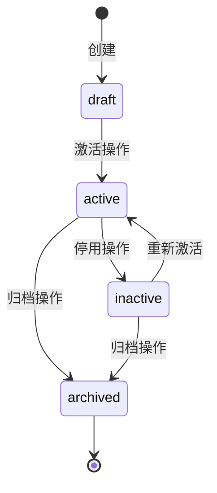

# 详细设计 (DD) 模板

## 1. DD 的定位

### 1.1 在研发流程中的位置

```
spec.md → pd-<module>/ → ad.md → dd.md (详细设计) ← 本模板 → plan.md → code
```

### 1.2 DD 与相邻文档的职责边界

| 维度 | ad.md | **dd.md** | plan.md / tasks.md |
|------|-------|----------|-------------------|
| 关注点 | 模块划分、数据流、接口契约 | **字段级定义、状态机、算法、错误码** | 任务拆解、执行顺序 |
| 回答 | "系统怎么组织" | **"每个模块内部怎么实现"** | "先做什么后做什么" |
| 粒度 | 模块/服务级 | **表/字段/方法级** | 任务/文件级 |
| 读者 | 架构师 | **开发工程师** | AI Agent / 执行者 |

### 1.3 DD 的范围与拆分规则 [MUST]

DD 与 AD 的拆分阈值保持一致。

**拆分规则**:

| 模块数量 | 组织方式 | 说明 |
|---------|---------|------|
| ≤ 3 个 | 单文件 `dd.md` | 所有内容在一个文件中 |
| > 3 个 | 文件夹 `dd/` | 拆分为全局文档 + 模块文档 |

**> 3 个模块时的文件夹结构** [MUST]:

```
specs/<branch>/
  dd/
    README.md              # DD 全局索引
    dd-global.md           # 全局详设: 错误码体系、权限模型、系统级配置、
                           #           公共实体(User/Role 等)、数据迁移规范
    dd-<module-a>.md       # 模块 A 详设: 数据模型、状态机、算法、模块级错误码
    dd-<module-b>.md       # 模块 B 详设
    dd-<module-c>.md       # ...
```

**拆分原则**:

- `dd-global.md` [MUST]: 包含跨模块共享的内容——公共实体(User, Role 等)、全局错误码体系(§6.1 分类)、
  权限模型(§7)、系统级配置(§8.1)、预置/种子数据(§8.3)、数据迁移规范(§3.4)
- `dd-<module>.md` [MUST]: 包含模块内部的详细内容——模块实体的字段级定义(§3)、状态机(§4)、
  核心算法(§5)、模块级错误码(§6.2)、模块配置项与常量(§8.2)、API 实现映射表(§9)
- `README.md` [MUST]: DD 全局索引，列出所有模块文档、覆盖 FR、状态
- 每个模块 DD 的 YAML 头部 MUST 声明 `scope` 字段

**README.md 格式**:

```markdown
# 详细设计 (DD) 索引

| 文档 | 覆盖范围 | 覆盖 FR | 实体数 | 状态 |
|------|---------|---------|--------|------|
| dd-global.md | 全局 (公共实体/错误码/权限/配置) | 全部 | 3 | ✅ |
| dd-intent-library.md | 指令库域 | FR-039~054 | 10 | ✅ |
| dd-knowledge-base.md | 知识库域 | FR-004~006 | 2 | 🔲 待补充 |
| dd-dialog-profile.md | 对话方案域 | FR-007~011 | 3 | 🔲 待补充 |
```

**≤ 3 个模块时**仍使用单文件 `dd.md`，放在 `specs/<branch>/dd.md`。

### 1.4 DD 的核心目标

1. **数据模型完整** [MUST]：每个实体有字段级定义（类型、约束、索引、关系）
2. **状态机严谨** [MUST]：所有状态转移有触发条件、前置校验、副作用
3. **算法可编码** [MUST]：核心逻辑有伪代码，边界条件有明确处理
4. **错误码体系化** [MUST]：分类清晰、场景明确、提示友好
5. **权限粒度适当** [MUST]：权限点对应 API 路径，角色映射清晰
6. **可迁移** [SHOULD]：数据模型变更有 migration 方案
7. **前端 UI 规格完整** [MUST]：PD 中定义的统计卡、表格列、筛选器、操作按钮有对应的 DD 规格（§9.5）

---

## 2. 设计原则

### 2.1 一对一可编码 [MUST]

- DD 中的每个定义 MUST 能直接转化为代码
- 数据模型 → ORM Model / SQL DDL
- 状态机 → 状态枚举 + 转移方法
- 错误码 → 异常类定义
- 权限点 → 装饰器/中间件配置

### 2.2 约束显式化 [MUST]

- 不用"适当"、"合理"等模糊词——给出具体值
- 字符串字段 MUST 有最大长度
- 数值字段 MUST 有范围约束
- 枚举字段 MUST 列出所有合法值

### 2.3 向后兼容 [SHOULD]

- 数据模型变更 SHOULD 有 migration 脚本模板
- 枚举值新增不删除（软删除/弃用标记）
- API 字段新增不移除（破坏性变更走版本递增）

### 2.4 测试可驱动 [SHOULD]

- DD 中的每个定义 SHOULD 能推导出对应的测试用例
- 状态机 → 状态转移测试矩阵
- 错误码 → 异常场景测试用例
- 权限点 → 权限校验测试用例

---

## 3. 数据模型详设 [MUST]

### 3.1 实体: {实体A}

**对应 FR**: FR-xxx
**对应 AD 模块**: {模块名}

| 字段 | 类型 | 约束 | 默认值 | 索引 | 说明 |
|-----|------|-----|--------|------|------|
| id | UUID | PK | gen_random_uuid() | 主键 | 唯一标识 |
| name | VARCHAR(100) | NOT NULL, UNIQUE | - | 唯一索引 | 名称 |
| status | VARCHAR(20) | NOT NULL | 'draft' | 普通索引 | 状态枚举, 见 §4 |
| config | JSONB | NULL | {} | GIN 索引 | 配置项, schema 见下方 |
| created_by | UUID | NOT NULL, FK(user.id) | - | - | 创建人 |
| created_at | TIMESTAMP | NOT NULL | now() | - | 创建时间 |
| updated_at | TIMESTAMP | NOT NULL | now() | - | 更新时间 |

**JSONB schema (config)** [SHOULD]:

```json
{
  "key1": { "type": "string", "required": true, "description": "..." },
  "key2": { "type": "number", "default": 0, "min": 0, "max": 100 }
}
```

#### 索引

| 索引名 | 字段 | 类型 | 用途 |
|--------|------|------|------|
| idx_{entity}_status | (status) | B-Tree | 按状态筛选 |
| idx_{entity}_created_at | (created_at DESC) | B-Tree | 时间排序 |
| idx_{entity}_name | (name) | B-Tree, UNIQUE | 名称唯一约束 |

#### 关系

| 关系 | 目标实体 | 类型 | 外键 | 级联策略 |
|------|---------|------|------|---------|
| {关系A} | {实体B} | 一对多 | {entity_b}.{entity_a_id} | CASCADE DELETE |
| {关系B} | {实体C} | 多对多 | 关联表 {entity_a_entity_c} | SET NULL |

### 3.2 实体: {实体B}

*(按相同格式)*

### 3.3 ER 关系总图 [MUST]

> 当实体 ≥ 3 个时，MUST 提供一张文本化的 ER 关系总图，帮助开发者快速理解实体间关系。
> 可使用 ASCII 图 或 Mermaid ERDiagram。

```
实体A (1) ──── (*) 实体B
  │                   │ (1:*)
  │ (1:*)             ▼
  ▼                 实体D
实体C (*) ── references ── 实体E (*)
```

### 3.4 数据迁移规范 [SHOULD]

**新增实体**:

```sql
-- migration: V{xxx}__create_{entity}.sql
CREATE TABLE {entity} (
    id UUID PRIMARY KEY DEFAULT gen_random_uuid(),
    -- 按 §3.1 字段列表
);
CREATE INDEX idx_{entity}_status ON {entity}(status);
```

**变更字段**:

| 变更类型 | 迁移策略 | 示例 |
|---------|---------|------|
| 新增列 | ALTER TABLE ADD COLUMN (有默认值) | 无停机 |
| 删除列 | 先弃用(标记 deprecated) → 下版本 DROP | 两步走 |
| 修改类型 | 新增列 → 数据迁移 → 删除旧列 | 三步走 |
| 新增索引 | CREATE INDEX CONCURRENTLY | 无停机 |

---

## 4. 状态机定义 [MUST]

### 4.1 {实体A} 状态机



#### 状态枚举

| 状态值 | 显示名 | 含义 | 允许的操作 |
|--------|-------|------|-----------|
| draft | 草稿 | 新建未完善 | 编辑、删除、激活 |
| active | 已激活 | 正常使用中 | 编辑、停用、归档 |
| inactive | 已停用 | 暂停使用 | 编辑、激活、归档 |
| archived | 已归档 | 终态 | 不可操作 |

#### 状态转移规则

| 从 | 到 | 触发条件 | 前置校验 | 副作用 | 对应 API |
|---|----|---------|---------|--------|---------|
| draft | active | 用户点击"激活" | 必填字段完整 | 记录操作日志 | POST /api/v1/{entity}/{id}/activate |
| active | inactive | 用户点击"停用" | - | 通知关联模块 | POST /api/v1/{entity}/{id}/deactivate |
| active | archived | 用户点击"归档" | 无活跃关联 | 清理缓存 | POST /api/v1/{entity}/{id}/archive |

#### 唯一性约束 [如有]

*(例如: 同一父实体下, 只能有一个 active 状态的子实体)*

---

## 5. 核心算法详设 [MUST]

### 5.1 算法: {算法名称}

**对应 FR**: FR-xxx
**对应 AD 数据流**: §5.x

#### 输入输出

| 方向 | 参数 | 类型 | 约束 | 说明 |
|------|------|------|------|------|
| 输入 | {param_a} | string | NOT NULL, max 100 | {说明} |
| 输入 | {param_b} | int | >= 0 | {说明} |
| 输出 | {result} | object | - | {说明} |

#### 伪代码

```python
def {algorithm_name}({param_a}: str, {param_b}: int) -> Result:
    # 步骤 1: 参数校验
    if not {param_a}:
        raise ValidationError("E001", "{param_a} 不能为空")

    # 步骤 2: 业务逻辑
    if {条件A}:
        result = compute_a({param_a})
    elif {条件B}:
        result = compute_b({param_a}, {param_b})
    else:
        result = default_result()

    # 步骤 3: 持久化
    db.save(result)
    cache.invalidate(key)

    return result
```

#### 边界条件

| 边界场景 | 处理方式 | 错误码 |
|---------|---------|--------|
| {param_a} 为空 | 返回 ValidationError | E001 |
| {param_a} 超长 (>100) | 截断至 100 字符 | - |
| 并发写入同一记录 | 乐观锁 (version 字段) | E102 |
| 计算超时 (>30s) | 中断 + 返回超时错误 | E201 |

#### 复杂度

- **时间**: O({复杂度})
- **空间**: O({复杂度})

---

## 6. 错误码体系 [MUST]

### 6.1 错误码格式与分类

**推荐格式**: `E{模块}{类别}{序号}` — 5 位编码

- **模块位** (1 位): 0=通用, 1~9=业务模块 (按 AD 模块编号)
- **类别位** (1 位): 0=参数校验, 1=业务规则, 2=系统错误, 3=认证授权
- **序号** (2 位): 01~99

> 小型项目（<3 个模块）可简化为 4 位 `E{类别}{序号}` 格式。

| 前缀 | 类别 | HTTP 状态 | 是否可重试 |
|------|------|----------|----------|
| E_0xx | 参数校验 | 400 | 否 (修正参数后重试) |
| E_1xx | 业务规则 | 409 / 422 | 否 (业务条件不满足) |
| E_2xx | 系统错误 | 500 / 502 / 504 | 是 (指数退避) |
| E_3xx | 认证授权 | 401 / 403 | 否 (重新登录或联系管理员) |

### 6.2 完整错误码表

| 错误码 | 含义 | 触发场景 | 用户提示 | 重试 |
|--------|------|---------|---------|------|
| E001 | 必填字段缺失 | 字段为空 | "{字段名}不能为空" | 否 |
| E002 | 格式错误 | 不符合规则 | "{字段名}格式错误" | 否 |
| E003 | 超出范围 | 数值越界 | "{字段名}必须在{范围}之间" | 否 |
| E101 | 数据不存在 | ID 查无 | "数据不存在或已删除" | 否 |
| E102 | 状态冲突 | 非法转移 | "当前状态不允许此操作" | 否 |
| E103 | 唯一约束 | 名称重复 | "{字段名}已存在" | 否 |
| E104 | 关联约束 | 有活跃引用 | "存在关联数据，无法操作" | 否 |
| E201 | 内部错误 | 未捕获异常 | "系统繁忙，请稍后重试" | 是 |
| E202 | 外部服务失败 | 下游超时 | "依赖服务异常，请稍后重试" | 是 |
| E301 | 认证失败 | Token 无效 | "登录已过期，请重新登录" | 否 |
| E302 | 权限不足 | 无权操作 | "您没有此操作的权限" | 否 |

---

## 7. 权限模型 [MUST]

### 7.1 权限点定义

| 权限点 ID | 权限名称 | 操作范围 | API 路径 | 默认角色 |
|---------|---------|---------|---------|---------|
| {entity}_create | 创建{实体} | POST | /api/v1/{entity} | admin |
| {entity}_read | 查看{实体} | GET | /api/v1/{entity}[/{id}] | admin, viewer |
| {entity}_update | 编辑{实体} | PUT/PATCH | /api/v1/{entity}/{id} | admin, editor |
| {entity}_delete | 删除{实体} | DELETE | /api/v1/{entity}/{id} | admin |
| {entity}_publish | 发布{实体} | POST | /api/v1/{entity}/{id}/publish | admin |

### 7.2 角色与权限映射

| 角色 | 权限点列表 | 数据范围 |
|------|-----------|---------|
| admin | {entity}_* (全部) | 全部数据 |
| editor | read, update | 仅自己创建的 |
| viewer | read | 全部数据(只读) |

### 7.3 权限校验机制 [SHOULD]

```python
# 伪代码: 权限校验装饰器
@require_permission("{entity}_update")
@require_data_scope(owner_field="created_by")
async def update_{entity}(id: UUID, data: UpdateSchema):
    ...
```

---

## 8. 配置项与常量 [MUST]

### 8.1 系统级配置

| 配置项 | 类型 | 默认值 | 范围 | 说明 | 对应 FR |
|--------|------|--------|------|------|---------|
| {module}.max_items | int | 100 | 1-1000 | 最大列表长度 | - |
| {module}.timeout_seconds | int | 30 | 5-300 | 请求超时 | SC-xxx |
| {module}.retry_times | int | 3 | 0-10 | 失败重试 | - |

### 8.2 业务常量

| 常量名 | 值 | 类型 | 说明 | 对应 FR |
|--------|----|------|------|---------|
| MAX_{ENTITY}_COUNT | 5 | int | 单{父实体}下{子实体}上限 | FR-xxx |
| DEFAULT_PAGE_SIZE | 20 | int | 默认分页大小 | - |
| SESSION_TIMEOUT_MIN | 10 | int | 会话超时(分钟) | SC-xxx |

### 8.3 预置 / 种子数据 [SHOULD]

> 系统初始化时需要写入数据库的预置数据（系统枚举、默认配置、领域词典等）SHOULD 在此列出。
> 如果项目有"系统级"实体（创建后不可删除、由系统维护而非用户创建），MUST 在此定义完整清单。

| 实体 | 标识 | 名称 | 属性 | 说明 |
|------|------|------|------|------|
| {系统类型A} | {key} | {名称} | {关键属性} | {说明} |

---

## 9. API 实现映射表 [SHOULD]

> 本节不重复 AD 中的 API 契约定义（路径、方法、请求/响应 JSON），而是提供一张
> **从 API 端点到 DD 内部实现的桥接映射**。
> 目的：开发者拿到这张表，即可知道"这个 API 对应哪段伪代码、用哪个 Schema 类、有哪些计算字段"。
>
> 如果项目无 REST API（纯 SDK / CLI），本节可标注"不适用"后跳过。

### 9.1 映射表格式

| API 端点 (→ AD §x) | 服务方法 | 入参 Schema | 出参 Schema | 核心逻辑 (→ DD §x) | 计算/派生字段 |
|---------------------|---------|-------------|-------------|---------------------|-------------|
| `POST /api/v1/{resource}` | {Service}.create_{resource} | {Resource}Create | {Resource}Info | §3.1 约束校验 | {派生字段说明} |
| `POST /api/v1/{resource}/{id}/{action}` | {Service}.{action} | {Action}Request | - (202 异步) | §5.1 算法伪代码 | progress 轮询 |

### 9.2 列说明

| 列 | 说明 |
|----|------|
| API 端点 | 路径 + 方法, 指向 AD 中的 API 契约章节 (不重复定义) |
| 服务方法 | 后端 Service 层的方法名（或模块.方法） |
| 入参 Schema | Pydantic / DTO 类名, 对应 AD 请求体的代码实现 |
| 出参 Schema | Pydantic / DTO 类名, 对应 AD 响应体的代码实现 |
| 核心逻辑 | 指向 DD 内部的算法章节、数据模型约束章节 |
| 计算/派生字段 | 响应中不直接来自数据库的字段（聚合计算、状态派生、关联查询等） |

### 9.5 前端 UI 组件清单 [MUST]

> **来源--历史经验**: PD 功能缺失根因分析（D031-D036）— AD/DD 采用 API-first 范式，系统性忽略前端 UI 规格，导致 6 个模块共 40+ 项 PD 定义的前端功能未被实现。
> 本节要求 DD 显式列出 PD 中定义的前端 UI 元素，建立「PD UI → DD 前端规格 → 后端数据源」的三方映射。

#### 9.5.1 统计卡片清单

| PD 页面 | 卡片标签 | 数据来源 (API / 字段) | 计算方式 | 备注 |
|---------|---------|---------------------|---------|------|
| {模块}/index | {标签名} | GET /api/v1/{resource}/stats → {field} | 直接取值 / 聚合计算 | |

#### 9.5.2 表格列映射

| PD 页面 | 列名 | dataIndex | 数据来源 | 渲染方式 | 备注 |
|---------|------|-----------|---------|---------|------|
| {模块}/index | {列名} | {field_name} | list API → items[].{field} | Tag / Text / Date / Number | |

#### 9.5.3 筛选器 / 搜索条件

| PD 页面 | 筛选维度 | 组件类型 | 后端参数 | 选项来源 | 备注 |
|---------|---------|---------|---------|---------|------|
| {模块}/index | {筛选名} | Select / Input / RangePicker | query.{param} | 枚举 / API | |

#### 9.5.4 操作按钮 / 交互入口

> **规则**：不能再默认排除「说明」按钮及其 Drawer。凡是承载真实产品能力的隐藏交互，都必须作为 `functional-hidden-ui` 进入 DD 清单；只有纯解释性内容才允许标为 `explanatory-only`。

| PD 页面 | 按钮/入口 | 触发行为 | 组件类型 | 对应 API | 备注 |
|---------|---------|---------|---------|---------|------|
| {模块}/index | {按钮名} | 弹窗 / 导航 / API 调用 | Button / Switch / Modal | POST /api/v1/... | |

#### 9.5.5 特殊交互组件

> 当 PD 明确定义了非标准交互方式时（如 Switch 代替 Button、倒计时弹窗、Timeline 代替 Table），MUST 在此列出。

| PD 页面 | PD 交互描述 | 推荐组件 | 说明 |
|---------|-----------|---------|------|
| {模块}/detail | 发布确认 5秒倒计时 | Modal + useState countdown | AD §x.x |

#### 9.5.6 隐藏交互容器与语义分类

| PD 页面 | 容器 | 分类 | 承载能力 | 对应 API / 数据源 | 备注 |
|---------|------|------|---------|-------------------|------|
| {模块}/detail | 说明 Drawer | explanatory-only / functional-hidden-ui | {能力清单} | {API / 无} | |
| {模块}/dataset-detail | 实体导入 Modal | functional-hidden-ui | 导入实体值 / 同义词 | POST /api/v1/... | |

---

## 10. 从 ad.md 到 DD 的转化方法

### 10.1 转化步骤 [MUST]

**步骤 1: 提取实体清单**

从 AD 的模块职责矩阵(§4.2)和数据流(§5)中提取所有实体。

**步骤 2: 细化数据模型**

将 spec.md 的"关键实体"和 AD 的"模块核心实体"细化为字段级定义(§3)。

**步骤 3: 定义状态机**

从 PD 的状态流转 + AD 的数据流异常分支中提取状态和转移规则(§4)。

**步骤 4: 编写核心算法**

将 AD 的数据流处理节点细化为伪代码(§5)。

**步骤 5: 构建错误码体系**

从 AD 的接口契约错误码汇总，补充边界条件产生的错误码(§6)。

**步骤 6: 定义权限点**

从 AD 的 API 路径 + PD 的权限矩阵提取权限点(§7)。

### 10.2 需求追溯矩阵 [MUST]

```markdown
| FR 编号 | 需求摘要 | DD 章节 | 覆盖状态 |
|---------|---------|---------|---------|
| FR-xxx | {摘要} | §3.1 + §4.1 | ✅ 完整 |
```

### 10.3 产出物合规检查表 [MUST]

```markdown
| 模板条款 | 状态 | 说明 |
|---------|------|------|
| §2.1 一对一可编码 | ✅ | 所有定义可直接映射到代码 |
| §2.2 约束显式化 | ✅ | 无模糊词, 所有约束有具体值 |
| §3 字段有类型+约束+索引 | ✅ | N 个实体, M 个字段 |
| §4 状态机有 Mermaid 图 | ✅ | 2 个状态机 |
| §6 错误码分类完整 | ✅ | 4 类, 共 N 个错误码 |
```

---

## 11. 输出检查清单

### 11.1 数据模型检查 [MUST]

- [ ] 每个实体有字段级定义（类型、约束、默认值、索引）
- [ ] 字符串字段有最大长度
- [ ] 枚举字段列出所有合法值
- [ ] 关系有外键、级联策略
- [ ] JSONB 字段有 schema 说明（嵌套字段列出类型、必填、范围）
- [ ] 实体 ≥ 3 个时有 ER 关系总图 (§3.3)
- [ ] 预置/种子数据已列出清单 (§8.3, 如有)

### 11.2 状态机检查 [MUST]

- [ ] 每个有状态的实体有 Mermaid 状态图
- [ ] 所有转移有触发条件和前置校验
- [ ] 副作用已标注（日志、通知、缓存清理）
- [ ] 唯一性约束已说明

### 11.3 算法与错误码检查 [MUST]

- [ ] 核心算法有伪代码和边界条件
- [ ] 错误码有分类前缀（E0xx/E1xx/E2xx/E3xx）
- [ ] 每个错误码有用户友好提示
- [ ] 重试策略已标注

### 11.4 追溯与测试映射检查 [MUST]

- [ ] FR → DD 追溯矩阵完整
- [ ] 产出物合规检查表已填写
- [ ] 每个状态转移可推导测试用例
- [ ] 每个错误码可推导异常测试
- [ ] 每个权限点可推导权限校验测试

### 11.5 前端 UI 组件检查 [MUST]

> 来源: PD 功能缺失根因分析 — 防止 AD/DD 遗漏前端 UI 规格

- [ ] 每个 PD 页面的统计卡片已列入 §9.5.1（标签、数据来源）
- [ ] 每个 PD 表格的列已列入 §9.5.2（列名、dataIndex、渲染方式）
- [ ] 每个 PD 筛选器已列入 §9.5.3（筛选维度、组件类型、后端参数）
- [ ] 每个 PD 操作按钮已列入 §9.5.4（按钮名称、触发行为、对应 API）
- [ ] PD 中的特殊交互（非标准组件）已列入 §9.5.5
- [ ] 所有 Drawer / Modal / Popover / Collapse 已按 §9.5.6 标记为 `explanatory-only` 或 `functional-hidden-ui`
- [ ] 所有 `functional-hidden-ui` 均有承载能力、数据源与 API 归属
- [ ] §9.5 清单与 PD 交互稿逐项比对，覆盖率 = 100%

---

## 12. 附录

### 12.1 常见 DD 模式参考

| 模式 | 适用场景 | 核心要素 |
|------|---------|---------|
| 多状态实体 | 有生命周期的业务对象 | 状态枚举 + 转移矩阵 + 唯一性约束 |
| 树形结构 | 分类、组织架构 | parent_id 自引用 + path 物化路径 |
| 审计日志 | 敏感操作追踪 | 独立审计表 + 触发器/应用层记录 |
| 软删除 | 数据可恢复 | deleted_at 字段 + 查询默认过滤 |
| 乐观锁 | 并发控制 | version 字段 + UPDATE WHERE version = ? |
| 多租户 | SaaS | tenant_id 字段 + 行级安全策略 |

### 12.2 字段命名规范

| 场景 | 命名模式 | 示例 |
|------|---------|------|
| 主键 | id | id |
| 外键 | {entity}_id | user_id, profile_id |
| 状态 | status | status |
| 创建时间 | created_at | created_at |
| 更新时间 | updated_at | updated_at |
| 创建人 | created_by | created_by |
| 软删除 | deleted_at | deleted_at |
| 版本号 | version | version |

### 12.3 版本历史

| 版本 | 日期 | 主要改进 |
|------|------|---------|
| 1.0 | 2026-03-10 | 初始版本（数据模型、状态机、算法、错误码、权限、配置、常量） |
| 2.0 | 2026-03-17 | 新增定位章节(§1)、设计原则(§2)、MUST/SHOULD 分级、转化方法(§9)、迁移规范(§3.3)、测试映射(§10.4)、常见模式(§11) |
| 2.1 | 2026-03-17 | 新增§1.3 DD范围声明、§3.3 ER总图[MUST]、§6.1模块化错误码、§8.3预置/种子数据、§10.1检查项增强 |
| 2.2 | 2026-03-17 | 新增§9 API实现映射表[SHOULD]（桥接AD契约与DD实现, 含Schema类名/服务方法/计算字段）; 章节重编号 |
| 2.3 | 2026-03-17 | §1.3 DD拆分规则: >3模块用文件夹(`dd/`), 明确 dd-global.md + dd-\<module\>.md + README.md 结构 |
| 2.4 | 2026-03-20 | 新增§9.5 前端UI组件清单[MUST]、§11.5 前端UI组件检查[MUST]（PD功能缺失根因修复: 覆盖统计卡/表格列/筛选器/操作按钮） |
| 2.5 | 2026-04-02 | 新增隐藏交互容器规格，要求区分 explanatory-only 与 functional-hidden-ui，并纳入 DD UI 检查 |
