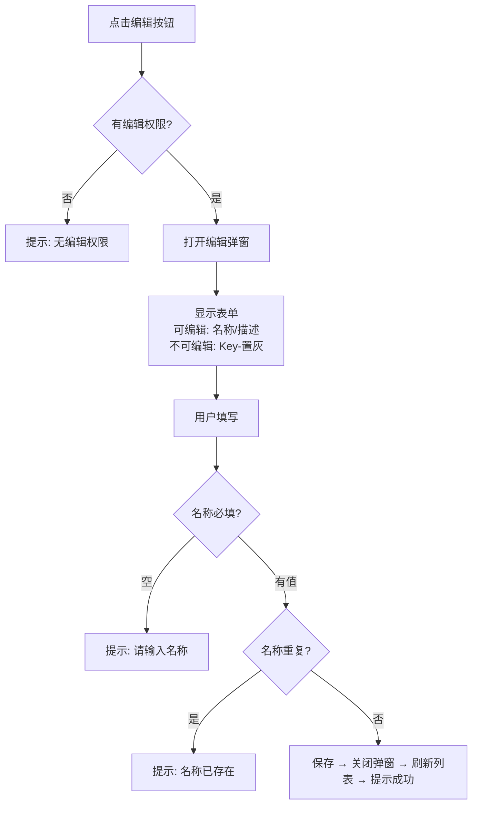

# 产品交互设计 (PD) 模板

## 1. PD 的定位

### 1.1 在研发流程中的位置

```
spec.md (业务需求) → pd.md (产品交互设计) ← 本模板 → ad.md → dd.md → plan.md → code
```

### 1.2 PD 与 spec.md 的职责边界

| 维度 | spec.md | pd.md |
|------|---------|-------|
| 关注点 | 业务需求、功能范围 | 交互逻辑、数据流向、状态流转 |
| 回答 | "做什么" "为什么做" | "怎么用" "数据怎么流" "状态怎么变" |
| 表达 | 文字描述、用户故事 | 交互原型、流程图、状态矩阵 |

### 1.3 PD 的核心目标

1. **消除歧义**：文字需求 → 可视化交互逻辑
2. **验证闭环**：数据输入 → 处理 → 输出的完整链路
3. **约束显性化**：业务规则、限制条件可视化
4. **需求追溯**：每个 FR 在 PD 中有对应的页面/组件/弹窗 **[MUST]**
5. **研发就绪**：开发可直接基于 PD 开始技术设计

---

## 2. 设计原则

### 2.1 清晰优先 [MUST]

- **列表用 Table**：标准表格，避免卡片网格信息密度不足
- **字段必有标签**：每个数据字段有明确标签和说明
- **操作必有反馈**：每个操作有明确的结果反馈（成功/失败/loading）
- **流向必可视化**：数据流向、状态流转图形化展示

### 2.2 约束显性化 [MUST]

- **业务规则用 Alert**：关键约束（数量限制、绑定关系）使用 Alert 置顶
- **状态规则用矩阵**：状态流转配规则说明（唯一性、触发条件）
- **数据关系用图示**：1:1、1:N 关系可视化标注

### 2.3 导航层次结构 [MUST]

**核心概念**：

| 类型 | 定义 | 侧边栏 | 返回按钮 |
|------|------|--------|---------|
| 主导航页面 | 功能模块入口 | 展示 | 无 |
| 下级页面 | 从主导航进入的详情/编辑/测试等 | **不展示** | **必须有** |

**层级示例**：
```
侧边栏菜单（仅主导航页面）
├── 指令库管理 → (点击行) → 指令库详情页（下级，有返回箭头）
│                              └── (点击测试) → 批量测试页（下级，有返回箭头）
├── 数据集管理
└── 对话方案
```

**返回按钮规范**：与标题同行、标题左侧、紧凑图标 `<ArrowLeftOutlined />` + "返回"文字。

**禁止**：
- ❌ 所有页面平铺在侧边栏
- ❌ 下级页面占用菜单项（如"意图管理"、"模型版本"、"训练任务"不应独立成菜单）
- ❌ 没有返回路径导致用户迷失
- ❌ 返回按钮单独占一行

### 2.4 页面逻辑说明抽屉与隐藏交互分类 [MUST]

**每个页面 MUST 包含"说明"按钮**，位于标题栏右侧，点击打开 Drawer。

```
[页面标题]              [? 说明] [操作按钮组]
```

**抽屉 MUST 包含以下 6 个标签页**：

| Tab | 内容 | 表达形式 |
|-----|------|----------|
| 数据流向 | 输入→处理→输出链路 | ASCII 流程图、Mermaid |
| 状态流转 | 状态机及规则 | G6 图、Tag 条、规则列表 |
| 字段说明 | 所有字段含义/格式/约束 | Table |
| 操作说明 | 每个操作（CRUD）的交互流程和字段 | Mermaid 流程图、步骤列表 |
| 业务逻辑 | 核心流程、计算逻辑 | 流程图、伪代码 |
| 易错点 | 常见错误、注意事项 | Alert 组件 |

**信息密度控制 [MUST]**：主页面只保留核心操作区（列表、筛选、按钮）。以下内容 MAY 放到抽屉中：
- 详细的业务约束列表
- 字段说明表格
- 复杂的数据流向图 / G6 状态机
- 操作交互流程说明

但是必须严格区分两类内容：

| 类型 | 标记 | 是否必须被实现/验收 | 说明 |
|------|------|--------------------|------|
| 解释性内容 | `explanatory-only` | 否 | 帮助理解数据流向、状态机、背景规则，不单独构成产品功能 |
| 功能性隐藏交互 | `functional-hidden-ui` | **是** | 虽然视觉上位于 Drawer / Modal / Popover / 折叠面板中，但承载真实 CRUD、导入导出、状态切换、规则配置、参数编辑等能力 |

**禁止**把承载真实产品能力的交互一律放进“说明”后，就在下游口径中视为“可不实现”。

**判定规则 [MUST]**：若容器中允许用户执行以下任一动作，则该容器属于 `functional-hidden-ui`：
- 新增 / 编辑 / 删除
- 导入 / 导出 / 下载模板
- 提交 / 发布 / 切换状态
- 配置实体、词槽、阈值、映射关系、相似问、排除问等业务规则
- 触发会改变真实业务状态的动作

**说明按钮 Tooltip [SHOULD]**：
```jsx
<Tooltip title="查看数据流向、状态流转规则、字段说明和业务约束">
    <Button icon={<QuestionCircleOutlined />} onClick={() => setDrawerVisible(true)}>说明</Button>
</Tooltip>
```

**抽屉宽度切换 [SHOULD]**：默认 `width={1200}`，标题栏提供按钮切换到 800px。

### 2.5 页面能力清单 [MUST]

每个 PD 页面除 HTML 原型外，还 MUST 在模块 README 或同目录旁路文档中补一份**页面能力清单**，供 AI、plan、tasks、DD、harness 直接消费。

这不是可选增强项，而是**下游准入前置条件**：若任一页面缺少 `page_goal` 或 `primary_user_flows`，则不得继续进入 `transform-pd / ad / dd / plan / tasks / implement / smoke`。

最少字段如下：

| 字段 | 必填 | 说明 |
|------|------|------|
| `page_goal` | 是 | 该页面自己的业务目标，不允许直接复用模块级成功标准 |
| `primary_user_flows` | 是 | 该页面自己的核心用户流，按“入口 -> 动作 -> 成功信号”描述 |
| `page_boundary` | 是 | 页面 / drawer / modal / popover / 内嵌块 |
| `user_visible_ui` | 是 | 主页面直接可见的表格、筛选器、统计卡、按钮 |
| `interactive_containers` | 是 | 页面中的 Drawer / Modal / Popover / Tabs / Collapse |
| `capability_checklist` | 是 | 必须落地的能力项（按 CRUD / 校验 / 状态 / 反馈 / 权限 / 跳转拆分） |
| `action_contracts` | 是 | 每个动作的前置条件、成功信号、失败反馈、状态变化 |
| `data_contracts` | 是 | 字段、表格列、导入导出项、编辑项 |
| `business_rules` | 是 | 绑定关系、阈值继承、唯一性、删除/发布门禁等 |
| `fr_mapping` | 是 | 能力级别映射到 FR，而不是只停留在页面级映射 |

建议格式：

```markdown
### 页面能力清单: dataset-detail

- `page_goal`: 维护意图、词槽、实体和问法数据，并确保保存/导入结果真实回读
- `primary_user_flows`:
  - 进入数据管理页 → 保存意图配置 → 列表回读最新值
  - 打开相似问/排除问 Drawer → 新增训练样本 → Drawer 列表回读新增项
  - 打开实体批量导入 Modal → 导入实体值/同义词 → 实体列表同步回读
- `page_boundary`: 下级页面
- `user_visible_ui`:
  - 意图 Table
  - 词槽卡片
  - 管理入口按钮
- `interactive_containers`:
  - `functional-hidden-ui`: 意图配置 Drawer
  - `functional-hidden-ui`: 相似问 / 排除问 Drawer
  - `functional-hidden-ui`: 实体批量导入 Modal
  - `explanatory-only`: 易错点说明 Drawer
- `capability_checklist`:
  - CRUD 意图定义
  - 维护词槽与实体值
  - 维护同义词、相似问、排除问
  - 配置命中话术 / 未命中话术
```

### 2.6 实用主义 [SHOULD]

- 企业级后台风格，白/灰背景 + 蓝色主色
- 使用成熟组件库（推荐 Ant Design）
- Mock 数据驱动，不依赖真实 API

---

## 3. 技术规范

### 3.1 技术栈 [MUST]

**方案：React 18 + Ant Design 6.x (CDN UMD，无脚手架)**

```html
<!-- MUST 按此顺序引入，MUST 使用 unpkg（jsdelivr 部分资源 404） -->
<script crossorigin src="https://unpkg.com/react@18/umd/react.production.min.js"></script>
<script crossorigin src="https://unpkg.com/react-dom@18/umd/react-dom.production.min.js"></script>
<script src="https://unpkg.com/@babel/standalone/babel.min.js"></script>
<script src="https://unpkg.com/dayjs@1.11.10/dayjs.min.js"></script>
<link rel="stylesheet" href="https://unpkg.com/antd@6.3.1/dist/reset.css">
<link rel="stylesheet" href="https://unpkg.com/antd@6.3.1/dist/antd.css">
<script src="https://unpkg.com/antd@6.3.1/dist/antd.min.js"></script>
<script src="https://unpkg.com/@ant-design/icons@5.3.7/dist/index.umd.min.js"></script>
```

### 3.2 代码规范 [MUST]

```javascript
<script type="text/babel" data-presets="react">
    const antd = window.antd;           // MUST 从 window 显式获取
    const icons = window.icons;
    const { Layout, Menu, Button, Table, Tag, Form, Modal, /* ... */ } = antd;
    const { PlusOutlined, EditOutlined, /* ... */ } = icons;
</script>
```

### 3.3 常见错误避免 [MUST]

| 错误 | 后果 | 正确做法 |
|------|------|----------|
| 忘记引入 dayjs | 页面空白 | dayjs MUST 在 antd 之前加载 |
| 直接使用全局 `antd` | ReferenceError | `const antd = window.antd;` |
| 遗漏组件或图标 | 报错或不渲染 | 检查所有使用的组件/图标都已解构 |
| JSX 属性中使用中文引号 `"..."` | Babel 编译错误 | 使用单引号或模板字符串包裹 |
| Menu `onOpenChange` 不稳定 | 菜单无法展开 | MUST 用 `useCallback` 包装 |
| CDN 使用 jsdelivr | 404 错误 | MUST 使用 unpkg |

---

## 4. 页面类型框架

> 所有页面的导航规则遵循 §2.3，说明抽屉规则遵循 §2.4，下文不再重复。

### 4.1 列表页（List）— 主导航页面

```
┌────────────────────────────────────────┐
│  页面标题栏                            │
│  [标题 + 描述]       [?说明] [新建按钮]│
├────────────────────────────────────────┤
│  统计卡片 [SHOULD]                     │
├────────────────────────────────────────┤
│  筛选栏：[搜索] [下拉筛选] [查询] [重置]│
├────────────────────────────────────────┤
│  数据表格（Table）                     │
│  | ID | 名称 | 状态 | ... | 操作 |    │
├────────────────────────────────────────┤
│  分页器                                │
└────────────────────────────────────────┘
```

**Table 字段规范**：
- **ID**：monospace，只读唯一标识
- **名称**：可点击跳转详情页（下级页面）
- **状态**：Badge / Tag，颜色区分
- **操作**：Button 组（查看→下级页、编辑→弹窗、删除→确认弹窗）

### 4.2 详情页（Detail）— 下级页面

```
┌────────────────────────────────────────┐
│  [←返回] [标题+Key]   [?说明] [操作组] │
├────────────────────────────────────────┤
│  操作区（左/右布局）                   │
├────────────────────────────────────────┤
│  关联数据表格 1                        │
├────────────────────────────────────────┤
│  关联数据表格 2                        │
└────────────────────────────────────────┘
```

### 4.3 流程执行页（Wizard）— 下级页面

```
┌────────────────────────────────────────┐
│  [←返回] [标题]          [?说明]       │
├────────────────────────────────────────┤
│  Steps 步骤条  [1]→[2]→[3]            │
├────────────────────────────────────────┤
│  当前步骤表单内容                      │
├────────────────────────────────────────┤
│  [上一步] [下一步/完成]               │
└────────────────────────────────────────┘
```

### 4.4 测试/验证页 — 下级页面

```
┌────────────────────────────────────────┐
│  [←返回] [标题]          [?说明]       │
├────────────────────────────────────────┤
│  测试任务列表 / 执行区域               │
├────────────────────────────────────────┤
│  结果展示区 [指标卡片] [对比视图]      │
├────────────────────────────────────────┤
│  详细分析（Tabs / 折叠面板）           │
└────────────────────────────────────────┘
```

---

## 5. 交互逻辑表达

### 5.1 数据流向 [MUST]

```
[数据来源] → [处理过程] → [输出结果] → [最终状态]
   ↓           ↓           ↓          ↓
训练数据    模型训练    评估结果    发布状态
(已就绪)    (67%)      (F1:0.95)  (testable)
```

要素：数据来源 → 处理过程 → 输出结果 → 最终状态，每步标注当前值。

### 5.2 状态流转 [MUST]

```
状态机：draft → training → trained → evaluating → testable → published → archived

约束规则：
1. 唯一性约束：testable 每个库只能一个，切换时自动取消旧的
2. 流转条件：draft → training（创建训练任务触发）
3. 特殊规则：可同时持有 testable + published（灰度场景）
```

可视化方式：AntV G6 状态图 / 横向 Tag 条 / 规则说明 Alert。

### 5.3 数据绑定关系 [MUST]

标注格式：`关系类型(1:1/1:N) + 主客体 + 约束 + 可视化`

```
关系类型：1:1
- 训练集 → 模型版本（一个训练集只绑定一个模型，绑定后锁定）
- 可视化：Tag 展示绑定状态，已绑定的删除按钮禁用

关系类型：1:N
- 评估集 → 模型版本（一个评估集可用于多个模型评估）
- 可视化：Tag 展示"已复用:N次"
```

### 5.4 危险操作 [MUST]

```
1. 红色警告区域 + 影响说明
2. 版本对比（旧 vs 新，关键指标对比）
3. 影响范围统计（设备数、会话数）
4. 确认机制：勾选框 "我已确认..." + 倒计时 N 秒
5. 操作按钮：danger 样式，倒计时前置灰
```

### 5.5 交互流程图 [MUST]

**每个涉及交互的操作（增删改查）MUST 绘制流程图**，SHOULD 使用 Mermaid 格式。

要求：
- 每个判断节点有"是/否"分支
- 每个异常分支有明确的错误提示
- 每个操作节点标注涉及的字段

示例（编辑操作）：


---

## 6. 弹窗设计规范

### 6.1 弹窗类型

| 类型 | 用途 | 关键要素 |
|------|------|---------|
| 创建弹窗 | 新建资源 | 表单字段 + 校验规则 |
| 确认弹窗 | 危险操作二次确认 | 影响说明 + 勾选 + 倒计时 |
| 详情弹窗 | 展示详细信息 | 只读数据展示 |
| 配置弹窗 | 复杂参数配置 | Tabs/Steps 分组 |

### 6.2 弹窗结构

**创建/配置类** [MUST]：
```
┌──────────────────────────────────┐
│  标题 + [?说明] + 关闭           │
├──────────────────────────────────┤
│  全局说明 Alert [SHOULD]         │
├──────────────────────────────────┤
│  表单内容 / Tabs 分组            │
├──────────────────────────────────┤
│  [取消]            [确认创建]    │
└──────────────────────────────────┘
```

**确认类（危险操作）** [MUST]：
```
┌──────────────────────────────────┐
│  ⚠️ 危险操作确认                  │
├──────────────────────────────────┤
│  影响说明 + 版本对比卡片          │
├──────────────────────────────────┤
│  [ ] 我已确认...  ⏱️ 倒计时 Ns  │
├──────────────────────────────────┤
│  [取消]    [确认]（倒计时后可用） │
└──────────────────────────────────┘
```

### 6.3 数据集导入弹窗 [MUST 区分类型]

- 主页面提供独立按钮："导入训练集"、"导入评估集"
- 弹窗内 Radio 可切换类型
- 训练集标注"1:1 绑定模型"约束
- 评估集标注"可复用"特性
- 字段格式 Tab 根据类型动态切换

---

## 7. 从 spec.md 到 PD 的转化方法

### 7.1 PD 模块拆分 [MUST]

一个 spec.md 通常包含多个功能模块，**不应生成单一巨型 PD 项目**，而应按模块拆分为多个独立的 PD 项目。

> **跨文档一致性**: PD **始终按模块拆分**（每个模块一个 `pd-<module>/` 文件夹），
> 所有模块文件夹及全局文件统一收纳在 `pd-all/` 目录下。
> AD 和 DD 采用统一阈值：≤ 3 个模块用单文件，> 3 个模块拆为文件夹（`ad/`, `dd/`）。
> 三类文档的拆分粒度保持对齐——同一个模块 Key（如 `intent-library`）贯穿 PD / AD / DD。

**7.1.1 拆分判定规则**

```
一个 PD 模块 = 一组共享侧边栏上下文的页面集合

判定条件（满足任意两条即为独立模块）：
  ✓ 有独立的侧边栏菜单入口
  ✓ 有完整的 CRUD 闭环
  ✓ 页面间有紧密的父子导航关系（列表→详情→子操作）
  ✓ 拥有独立的核心实体和状态机

不同 PD 模块之间只有"跳转引用"关系，不共享页面。
```

**7.1.2 命名与目录规范 [MUST]**

所有 PD 产出物统一收纳在 `pd-all/` 目录下：

```
specs/<branch>/pd-all/
  pd-hub.html               # 统一导航门户
  pd-index.md               # 全局索引
  pd-<module-key>/           # 模块文件夹
```

模块文件夹按功能模块命名，**禁止**按缺陷编号或任务编号命名。

| 规则 | 正确 | 错误 |
|------|------|------|
| 按模块命名 | `pd-intent-library/` | `pd-D016-react/` |
| 按模块命名 | `pd-knowledge-base/` | `pd-task-188/` |
| Key 风格 | 小写 + 短横线 | 驼峰、下划线、中文 |

**7.1.3 spec.md 模块映射前提 [MUST]**

PD 拆分的前提是 spec.md 中已包含**模块与交付物映射表**（参见 §7.7），明确标注：
- 哪些 FR 属于后台 UI（需要 PD）
- 哪些 FR 属于 API / 基础设施（不需要 PD）
- 每组 UI 类 FR 归属哪个 PD 模块

如果 spec.md 缺少此映射表，PD 设计者应在开始前先补充。

**7.1.4 跨模块引用 [SHOULD]**

当模块 A 的页面需要跳转到模块 B 时：

```jsx
{/* pd-intent-library/detail.html 中引用对话方案 */}
<Button onClick={() => alert('跳转至 pd-dialog-profile/detail.html')}>
    查看关联方案
</Button>
```

在 README 追溯矩阵中标注 `🔗 跨模块` 引用。

### 7.2 PD 全局索引 pd-index.md [MUST]

**specs/\<branch\>/pd-all/ 目录下 MUST 维护 `pd-index.md`**，汇总所有 PD 模块的覆盖状态。

```markdown
# PD 交互设计索引

| PD 模块 | 目录 | 覆盖 US | 覆盖 FR | 状态 | 页面数 | 版本 |
|---------|------|---------|---------|------|--------|------|
| 指令库管理 | pd-intent-library/ | US1 | FR-002,003,039-054 | ✅ 已完成 | 6 | v3.3 |
| 知识库管理 | pd-knowledge-base/ | US2 | FR-004-006 | 🔲 待设计 | - | - |
| 对话方案 | pd-dialog-profile/ | US3,US4 | FR-007-011,015-016 | 🔲 待设计 | - | - |
| 批量测试 | pd-batch-test/ | US8 | FR-012-014 | 🔲 待设计 | - | - |
| 监控仪表盘 | pd-monitoring/ | US9 | FR-030-035,038 | 🔲 待设计 | - | - |
| 用户管理 | pd-user-mgmt/ | US10 | FR-001 | 🔲 待设计 | - | - |

未覆盖 FR（非 UI 类，不需要 PD）：
- FR-017~029 [API] — 对话管理 API，由 ad.md / dd.md 覆盖
- FR-036~037 [Infra] — 安全与隐私，由 dd.md 覆盖
```

状态枚举：✅ 已完成 / 🚧 设计中 / 🔲 待设计 / ⏸️ 暂缓

### 7.3 PD 统一导航门户 pd-hub.html [MUST]

> **与 AD/DD 拆分规则的对齐说明**：
> AD 和 DD 在 > 3 个模块时拆分为文件夹，通过 `README.md` + `*-global.md` 提供全局视图。
> PD **始终按模块拆分**为独立 HTML 文件夹，因此需要一个**统一的 HTML 导航门户**充当"全局入口"，
> 让评审者和开发者能在一个页面内浏览所有模块的交互原型，而不必逐个打开文件夹。

**specs/\<branch\>/pd-all/ 目录下 MUST 维护 `pd-hub.html`**，作为所有 PD 模块的统一查看入口。

**7.3.1 定位与职责**

| 维度 | pd-index.md | pd-hub.html |
|------|-------------|-------------|
| 格式 | Markdown 文本 | HTML 可交互页面 |
| 用途 | 覆盖状态追踪、FR 映射 | 统一浏览、原型评审 |
| 受众 | 文档维护者、开发者 | PM 评审、团队演示 |
| 内容 | 模块列表、FR 覆盖、状态 | 嵌入式页面导航、iframe 浏览器 |

**7.3.2 pd-hub.html 必须包含的内容 [MUST]**

1. **模块概览区**：卡片展示所有 PD 模块的名称、覆盖 FR、页面数、完成状态
2. **树形导航区**：左侧树形菜单列出所有模块及其子页面（module → page.html）
3. **iframe 浏览区**：右侧 iframe 加载选中的页面，支持在门户内直接浏览原型
4. **跨模块关系**：可视化展示模块间的引用关系（来自 pd-index.md 跨模块引用关系）

**7.3.3 技术要求 [MUST]**

- 使用与 PD 模块相同的技术栈（React 18 + Ant Design 6.x CDN UMD）
- iframe `src` 使用相对路径（如 `pd-intent-library/index.html`），确保本地打开即可工作
- 不依赖后端服务，纯静态 HTML

**7.3.4 文件位置**

```
specs/<branch>/
  pd-all/                      # PD 统一收纳目录 [MUST]
    pd-hub.html                # PD 统一导航门户 [MUST]
    pd-index.md                # PD 全局索引 (Markdown) [MUST]
    pd-intent-library/         # 模块 A
    pd-knowledge-base/         # 模块 B
    pd-dialog-profile/         # ...
```

**7.3.5 与 pd-index.md 的关系**

两者互补、不替代：
- `pd-index.md`：面向文档管理——追踪覆盖状态、版本、FR 映射，开发者用 IDE 查看
- `pd-hub.html`：面向交互评审——统一浏览所有原型页面，PM/团队用浏览器查看

### 7.4 单模块转化步骤

确定模块边界后，按以下步骤为每个 PD 模块生成交互原型：

**步骤 1：需求层级拆分 [MUST]**

```
模块内 FR → 识别独立功能 vs 子功能/操作
  独立功能 → 主导航页面（侧边栏菜单项）
  子功能   → 页面内操作（按钮/弹窗/下级页面）
```

| 判定条件 | 结果 |
|---------|------|
| 有独立的 CRUD 闭环 | 主导航页面 |
| 需要独立 URL 路由，跨模块数据依赖 | 主导航页面 |
| 纯操作无独立数据 | 页面内按钮/弹窗 |
| 其他模块的子功能 | 下级页面/弹窗 |

**步骤 2：交互流程图绘制 [MUST]**

为每个增删改查操作绘制 Mermaid 流程图（参见 §5.5）。

**步骤 3：页面与操作映射**

```yaml
主导航页面（指令库列表）:
  页面操作: 新建（弹窗）、导入（弹窗）
  行内操作: 查看（下级页）、编辑（弹窗）、删除（确认弹窗）
  下级页面（指令库详情）:
    页面操作: 新建训练（弹窗）、发布（确认弹窗）、下载模型
    行内操作: 测试（弹窗/下级页）、归档（确认弹窗）
```

**步骤 4：数据流向设计** — 每个功能设计 输入→处理→输出

**步骤 5：状态机设计** — 定义所有状态和流转规则

**步骤 6：约束识别** — 识别业务规则（数量限制、绑定关系、权限等）

**步骤 7：交互原型实现** — 使用本模板技术栈实现页面

### 7.5 需求追溯矩阵 [MUST]

**每个 PD 模块的 README MUST 包含 FR → PD 映射表**：

```markdown
| FR 编号 | 需求摘要 | PD 页面 | 交互组件 | 覆盖状态 |
|---------|---------|---------|---------|---------|
| FR-043 | 单库模型上限 5 | index.html | Progress + Alert | ✅ 完整 |
| FR-044 | 模型状态机 | detail.html | G6 + Tag | ✅ 完整 |
| FR-054 | 模型产物下载 | detail.html | 下载按钮 | ✅ 完整 |
| FR-007 | 对话方案管理 | - | - | 🔗 跨模块: pd-dialog-profile |
```

覆盖状态：✅ 完整 / ⚠️ 部分覆盖 / ❌ 未覆盖 / 🔲 本次范围外 / 🔗 跨模块引用

### 7.6 产出物合规检查表 [MUST]

**README MUST 包含产出物与本模板规范的合规对照**：

```markdown
| 模板条款 | 状态 | 说明 |
|---------|------|------|
| §2.3 下级页面不在侧边栏 | ✅ | detail/test 不在菜单 |
| §2.4 每页有说明抽屉 | ✅ | 所有页均有说明 Drawer |
| §5.5 操作 Mermaid 流程图 | ✅ | 编辑/删除/新建/发布均有 |
| §7.1 模块命名规范 | ✅ | pd-intent-library/ |
```

### 7.7 对 spec.md 的结构要求 [MUST]

> 以下结构要求已内置于 spec 模板 (`.specify/templates/spec-template.md`) 中。
> 通过 `/speckit.specify` 命令生成的 spec.md 会自动包含这些结构。
> 如果 spec.md 是手动编写或从旧版本迁移的，需按本节要求补充。

为支撑 PD 模块拆分，spec.md **MUST** 包含以下结构化信息：

**7.7.1 模块与交付物映射表**

在 FR 章节之前（或 FR 章节开头）放置映射表：

```markdown
## 模块与交付物映射

| 模块 | 交付物类型 | 涉及 US | 涉及 FR | PD 模块 Key |
|------|-----------|---------|---------|------------|
| 指令库管理 | 后台 UI | US1 | FR-002,003,039-054 | intent-library |
| 知识库管理 | 后台 UI | US2 | FR-004-006 | knowledge-base |
| 对话方案 | 后台 UI | US3,US4 | FR-007-011,015-016 | dialog-profile |
| 对话引擎 | API | US5,6,7 | FR-017-029 | (无 PD) |
| 监控日志 | 后台 UI | US9 | FR-030-035,038 | monitoring |
| 用户管理 | 后台 UI | US10 | FR-001 | user-mgmt |
| 安全隐私 | 基础设施 | - | FR-036-037 | (无 PD) |
```

**7.7.2 FR 交付物类型标签 [MUST]**

每条 FR 编号后 MUST 标注交付物类型标签：

```markdown
- **FR-039** [UI:intent-library]: 系统必须支持指令库管理…
- **FR-017** [API]: API 必须接收文本输入…
- **FR-036** [Infra]: 敏感数据在持久化存储中…
```

标签含义：

| 标签 | 说明 | 是否需要 PD |
|------|------|------------|
| `[UI:<pd-module>]` | 后台 UI 功能，标注所属 PD 模块 | 是 |
| `[API]` | 纯 API/服务端需求 | 否，由 AD/DD 覆盖 |
| `[Infra]` | 基础设施/非功能性需求 | 否，由 DD 覆盖 |

**7.7.3 UI 类 FR 交互提示 [SHOULD]**

UI 类 FR SHOULD 在需求描述后附加交互提示，帮助 PD 设计者理解预期交互：

```markdown
- **FR-043** [UI:intent-library]: 每个指令库必须支持多个小模型版本管理，
  单库模型数量上限为 5；超过上限时禁止新建训练任务
  > 交互提示: 详情页模型列表上方 Alert 展示当前数量/上限，
  > 超限时"新建训练"按钮禁用 + Tooltip 说明原因
```

---

## 8. 权限模型规范 [SHOULD]

### 8.1 角色定义

```yaml
系统管理员: 所有 CRUD + 发布审批 + 用户管理
产品经理: 自己创建的 CRUD + 查看他人 + 训练测试 + 发布申请(需审批)
测试人员: 查看 + 测试（不可编辑/删除/发布）
```

### 8.2 权限矩阵

| 功能 | 系统管理员 | 产品经理 | 测试人员 |
|------|-----------|---------|---------|
| 查看指令库列表 | ✅ | ✅ | ✅ |
| 创建/编辑指令库 | ✅ | ✅(仅自己) | ❌ |
| 删除指令库 | ✅ | 仅自己+草稿 | ❌ |
| 创建训练任务 | ✅ | ✅ | ❌ |
| 发布模型 (`model_publish`) | ✅ | 需审批 | ❌ |
| 测试模型 (`model_test_manage`) | ✅ | ✅ | ✅ |

### 8.3 权限交互规范

- 无权限按钮：SHOULD 禁用 + Tooltip 提示原因
- 无权限页面：SHOULD 展示 403 Result 组件
- 前端校验为即时反馈，后端校验为安全兜底

---

## 9. 边界异常处理 [SHOULD]

### 9.1 网络异常

```yaml
检测: 请求超时(10s) / navigator.onLine === false
反馈: 按钮状态切换 + Alert "网络连接中断"
保护: 表单数据 localStorage 备份，恢复后提示"检测到未保存数据"
重试: 提供重试按钮，最多 3 次，间隔递增
```

### 9.2 并发冲突

```yaml
检测: version 字段乐观锁，保存时携带 version
反馈: 409 Conflict → "该资源已被他人修改"
解决: "强制覆盖" / "取消并刷新" 二选一
```

### 9.3 数据过期

```yaml
检测: 每 30s 轮询 version
反馈: Alert "数据已过期，建议刷新" + 刷新按钮
```

---

## 10. 输出检查清单

### 10.1 技术检查 [MUST]

- [ ] dayjs 在 antd 之前加载
- [ ] `const antd = window.antd` 显式获取
- [ ] 所有组件/图标已解构导入
- [ ] JSX 属性无中文引号
- [ ] Menu `onOpenChange` 用 `useCallback`
- [ ] CDN 全部使用 unpkg

### 10.2 导航检查 [MUST]

- [ ] 主导航页面在侧边栏展示
- [ ] **下级页面不在侧边栏**（不占菜单项）
- [ ] 下级页面有返回按钮（与标题同行、左侧）
- [ ] 面包屑清晰展示层级

### 10.3 抽屉检查 [MUST]

- [ ] 每个页面有"说明"按钮（标题栏右侧，带 Tooltip）
- [ ] 抽屉包含 6 个标签页（数据流向/状态流转/字段说明/操作说明/业务逻辑/易错点）
- [ ] 主页面信息密度合理（复杂内容在抽屉中）
- [ ] [SHOULD] 抽屉宽度可切换 1200/800

### 10.4 交互检查 [MUST]

- [ ] 列表使用 Table
- [ ] 所有字段有标签和说明
- [ ] 每个操作（CRUD）有 Mermaid 流程图（含异常分支）
- [ ] 数据流向可视化
- [ ] 状态流转含约束规则
- [ ] 数据绑定标注 1:1 / 1:N
- [ ] 危险操作有二次确认 + 倒计时
- [ ] 数据集导入区分训练集/评估集

### 10.5 模块与追溯检查 [MUST]

- [ ] PD 目录按模块命名（`pd-<module-key>/`，非缺陷编号）（§7.1）
- [ ] `pd-index.md` 已创建并列出所有 PD 模块（§7.2）
- [ ] README 包含 FR → PD 映射矩阵（§7.5）
- [ ] 每个 UI 类 FR 有对应页面/组件
- [ ] 范围外/跨模块的 FR 显式标注 🔲 / 🔗
- [ ] README 包含产出物合规检查表（§7.6）
- [ ] spec.md 包含模块映射表和 FR 标签（§7.7）
- [ ] pd-hub.html 已创建并包含所有模块导航（§7.3）

### 10.6 完整性检查

- [ ] 模块内 UI 类 FR 到 PD 转化完整（无遗漏）
- [ ] 数据流形成闭环（输入→处理→输出→状态）
- [ ] 所有状态有触发条件和规则
- [ ] Mock 数据驱动，无真实 API

---

## 11. 附录

### 11.1 快速启动模板

```html
<!DOCTYPE html>
<html lang="zh-CN">
<head>
    <meta charset="UTF-8">
    <meta name="viewport" content="width=device-width, initial-scale=1.0">
    <title>页面标题 | PD</title>
    <script crossorigin src="https://unpkg.com/react@18/umd/react.production.min.js"></script>
    <script crossorigin src="https://unpkg.com/react-dom@18/umd/react-dom.production.min.js"></script>
    <script src="https://unpkg.com/@babel/standalone/babel.min.js"></script>
    <script src="https://unpkg.com/dayjs@1.11.10/dayjs.min.js"></script>
    <link rel="stylesheet" href="https://unpkg.com/antd@6.3.1/dist/reset.css">
    <link rel="stylesheet" href="https://unpkg.com/antd@6.3.1/dist/antd.css">
    <script src="https://unpkg.com/antd@6.3.1/dist/antd.min.js"></script>
    <script src="https://unpkg.com/@ant-design/icons@5.3.7/dist/index.umd.min.js"></script>
</head>
<body>
    <div id="root"></div>
    <script type="text/babel" data-presets="react">
        const { useState, useCallback } = React;
        const antd = window.antd;
        const icons = window.icons;
        const { Layout, Menu, Button, Table, Drawer, Tabs, Tooltip } = antd;
        const { QuestionCircleOutlined, ArrowLeftOutlined, DatabaseOutlined } = icons;

        function App() {
            const [drawerVisible, setDrawerVisible] = useState(false);
            const [drawerWidth, setDrawerWidth] = useState(1200);

            return (
                <Layout style={{ minHeight: '100vh' }}>
                    <Layout.Sider theme="dark" width={260}>
                        {/* 仅放主导航页面菜单项 */}
                    </Layout.Sider>
                    <Layout.Content style={{ padding: 24, marginLeft: 260 }}>
                        <div style={{ display: 'flex', justifyContent: 'space-between', marginBottom: 24 }}>
                            <div style={{ display: 'flex', alignItems: 'center', gap: 16 }}>
                                {/* 下级页面才显示返回按钮 */}
                                <Button icon={<ArrowLeftOutlined />}>返回</Button>
                                <span style={{ fontSize: 20, fontWeight: 600 }}>页面标题</span>
                            </div>
                            <Tooltip title="查看数据流向、状态规则、字段说明">
                                <Button icon={<QuestionCircleOutlined />}
                                    onClick={() => setDrawerVisible(true)}>说明</Button>
                            </Tooltip>
                        </div>
                        {/* 页面内容区 */}
                        <Drawer
                            title={<div style={{ display: 'flex', justifyContent: 'space-between' }}>
                                <span>页面逻辑说明</span>
                                <Button type="text" size="small"
                                    onClick={() => setDrawerWidth(w => w === 1200 ? 800 : 1200)}>
                                    {drawerWidth === 1200 ? '800px' : '1200px'}
                                </Button>
                            </div>}
                            width={drawerWidth}
                            open={drawerVisible}
                            onClose={() => setDrawerVisible(false)}
                        >
                            <Tabs items={[
                                { key: 'flow', label: '数据流向', children: <div>数据流向图</div> },
                                { key: 'state', label: '状态流转', children: <div>状态机说明</div> },
                                { key: 'fields', label: '字段说明', children: <div>字段表格</div> },
                                { key: 'operations', label: '操作说明', children: <div>CRUD 流程图</div> },
                                { key: 'logic', label: '业务逻辑', children: <div>业务规则</div> },
                                { key: 'tips', label: '易错点', children: <div>注意事项</div> },
                            ]} />
                        </Drawer>
                    </Layout.Content>
                </Layout>
            );
        }

        ReactDOM.createRoot(document.getElementById('root')).render(<App />);
    </script>
</body>
</html>
```

### 11.2 Mermaid 流程图支持

```html
<!-- 在 head 中引入 -->
<script src="https://unpkg.com/mermaid@10/dist/mermaid.min.js"></script>
<script>mermaid.initialize({ startOnLoad: true, theme: 'default' });</script>
```

在抽屉"操作说明"标签页中使用：
```jsx
<div className="mermaid">
    graph TD
        A[操作入口] --> B{条件判断}
        B -->|是| C[执行操作]
        B -->|否| D[提示错误]
</div>
```

### 11.3 常见业务模式参考

| 模式 | 核心要素 | 参考示例 |
|------|---------|---------|
| AI/ML 模型生命周期 | 多状态机、1:1 训练集、阈值门禁 | `pd-intent-library/` |
| 审批流程 | 多级审批、会签/或签、驳回转办 | - |
| 数据管道 (ETL) | 多阶段处理、数据血缘、失败重试 | - |
| 配置管理 | 多级配置、继承/覆盖、灰度发布 | - |

### 11.4 业务价值说明模板 [SHOULD]

README 中 SHOULD 按以下格式描述功能业务价值：

```markdown
### 功能名称
- **解决什么问题**：...
- **用户是谁**：...
- **使用场景**：1. ... 2. ...
- **成功标准**：...
- **在范围内/不在范围内**：...
```

### 11.5 版本历史

| 版本 | 日期 | 主要改进 |
|------|------|---------|
| 1.0 | 2026-03-10 | 初始版本 |
| 2.0 | 2026-03-13 | 抽屉规范、宽度切换、信息密度控制 |
| 2.1 | 2026-03-16 | 正向案例、权限模型、异常处理、Mermaid |
| 3.0 | 2026-03-16 | 结构精简(1382→700行)、MUST/SHOULD 分级、需求追溯矩阵、合规检查表 |
| 4.0 | 2026-03-17 | 新增 PD 模块拆分规范(§7.1)、pd-index.md 全局索引(§7.2)、spec.md 结构要求(§7.7：模块映射表+FR标签+交互提示) |
| 4.1 | 2026-03-17 | §7.1补充跨文档一致性说明(PD/AD/DD模块Key对齐, AD/DD >3模块拆文件夹) |
| 4.2 | 2026-03-18 | 新增§7.3 PD统一导航门户pd-hub.html(iframe浏览/树形导航/模块概览)；§7.4~§7.7编号顺延 |
| 4.3 | 2026-03-18 | 所有PD产出物统一收纳至pd-all/目录(模块文件夹+pd-hub.html+pd-index.md) |
| 4.4 | 2026-04-02 | 新增 Drawer/Modal 语义分类与页面能力清单，要求区分 explanatory-only 与 functional-hidden-ui |
