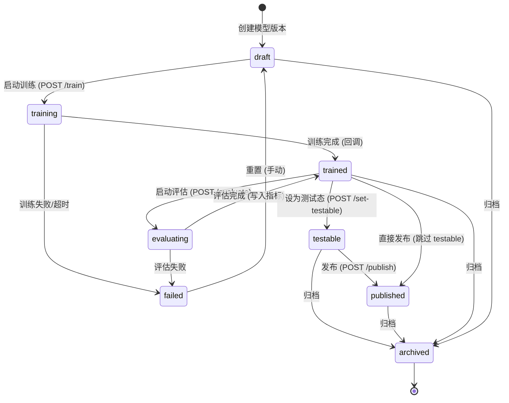
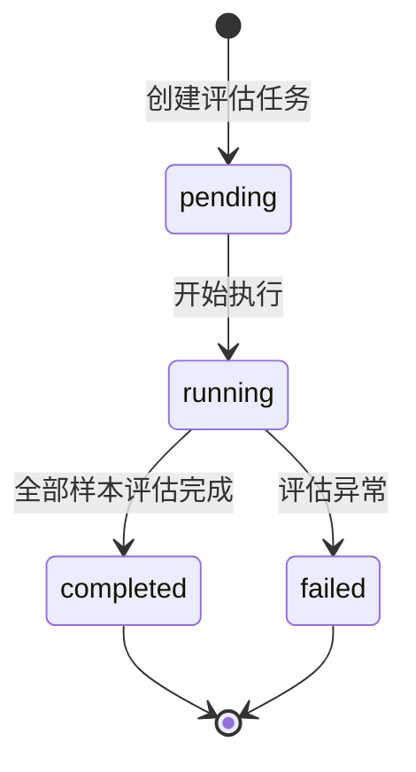

# 详细设计 (DD): SmartChef 智能对话管理平台

## 1. 文档说明

本 DD 聚焦 **指令库管理模块**，覆盖 AD §1.1 指令库域的全部实体、状态机、算法和接口。
其他模块（知识库、对话方案、监控等）在相应 PD 完成后以增量方式补充。

---

## 2. 数据模型详设

### 2.1 实体: IntentLibrary (指令库)

**对应 FR**: FR-039
**对应 AD 模块**: intent_service
**表名**: `intent_libraries`

| 字段 | 类型 | 约束 | 默认值 | 索引 | 说明 |
|------|------|------|--------|------|------|
| id | UUID | PK | gen_random_uuid() | 主键 | 唯一标识 |
| library_key | VARCHAR(64) | NOT NULL, UNIQUE | - | 唯一索引 | 全局唯一标识, 创建后不可修改 |
| display_name | VARCHAR(128) | NOT NULL | - | - | 显示名称 |
| language | VARCHAR(8) | NOT NULL | - | 普通索引 | 语言, 枚举: zh / en |
| description | TEXT | NULL | - | - | 描述, 无长度上限 |
| default_intent_f1_threshold | FLOAT | NOT NULL | 0.95 | - | 库级默认意图 F1 阈值, 范围 0.0~1.0 |
| default_slot_f1_threshold | FLOAT | NOT NULL | 0.90 | - | 库级默认槽位 F1 阈值, 范围 0.0~1.0 |
| created_by | UUID | NULL, FK(users.id) | - | - | 创建人 |
| created_at | TIMESTAMP(TZ) | NOT NULL | now() | - | 创建时间 |
| updated_at | TIMESTAMP(TZ) | NOT NULL | now() | - | 更新时间 (触发器自动更新) |

#### 索引

| 索引名 | 字段 | 类型 | 用途 |
|--------|------|------|------|
| uq_intent_libraries_library_key | (library_key) | B-Tree, UNIQUE | library_key 全局唯一 |
| idx_intent_libraries_language | (language) | B-Tree | 按语言筛选 |

#### 关系

| 关系 | 目标实体 | 类型 | 外键 | 级联策略 |
|------|---------|------|------|---------|
| 模型版本 | LibraryModelVersion | 一对多 | library_model_versions.library_key | RESTRICT (有模型时禁止删除库) |
| 训练数据集 | TrainingDataset | 一对多 | training_datasets.library_key | CASCADE DELETE |
| 评估数据集 | EvaluationDataset | 一对多 | evaluation_datasets.library_key | CASCADE DELETE |

#### 业务约束

- `library_key` 格式: `^[a-z][a-z0-9_-]{1,62}[a-z0-9]$` (小写字母开头, 允许下划线和连字符)
- `library_key` 创建后不可修改 (UPDATE 语句排除该字段)
- 删除指令库前 MUST 校验无活跃模型版本 (status != archived), 否则返回 E10401

---

### 2.2 实体: LibraryModelVersion (模型版本)

**对应 FR**: FR-043~054
**对应 AD 模块**: intent_libraries
**表名**: `library_model_versions`

| 字段 | 类型 | 约束 | 默认值 | 索引 | 说明 |
|------|------|------|--------|------|------|
| id | UUID | PK | gen_random_uuid() | 主键 | 唯一标识 |
| library_key | VARCHAR(64) | NOT NULL, FK(intent_libraries.library_key) | - | 普通索引 | 所属指令库 |
| version_name | VARCHAR(128) | NOT NULL | - | - | 版本名称 (用户可读) |
| status | VARCHAR(24) | NOT NULL | 'draft' | 普通索引 | 状态枚举, 见 §3 |
| train_dataset_id | UUID | NULL, FK(training_datasets.id) | - | - | 绑定训练集 (1:1, FR-048) |
| artifact_type | VARCHAR(32) | NULL | - | - | 产物类型: onnx / tensorrt / zip |
| artifact_uri | TEXT | NULL | - | - | 产物文件路径 |
| artifact_sha256 | VARCHAR(128) | NULL | - | - | 产物校验码 |
| metrics | JSONB | NOT NULL | {} | GIN 索引 | 训练/评估指标, schema 见下方 |
| train_config | JSONB | NOT NULL | {} | - | 训练超参配置, schema 见下方 |
| notes | TEXT | NULL | - | - | 版本备注 |
| is_testable | BOOLEAN | NOT NULL | false | 普通索引 | 是否为测试态 (同库唯一, FR-045) |
| is_published | BOOLEAN | NOT NULL | false | 普通索引 | 是否为发布态 (同库唯一, FR-045) |
| progress | INTEGER | NOT NULL | 0 | - | 训练进度百分比, 范围 0~100 |
| published_at | TIMESTAMP(TZ) | NULL | - | - | 发布时间 |
| published_by | UUID | NULL, FK(users.id) | - | - | 发布人 |
| created_by | UUID | NULL, FK(users.id) | - | - | 创建人 |
| created_at | TIMESTAMP(TZ) | NOT NULL | now() | - | 创建时间 |
| updated_at | TIMESTAMP(TZ) | NOT NULL | now() | - | 更新时间 |

**metrics JSONB schema**:

```json
{
  "intent_accuracy": { "type": "number", "description": "意图分类准确率" },
  "intent_f1": { "type": "number", "description": "意图 F1 (macro)" },
  "slot_f1": { "type": "number", "description": "槽位 F1 (严格匹配)" },
  "joint_accuracy": { "type": "number", "description": "Intent+Slot 联合准确率" },
  "precision": { "type": "number" },
  "recall": { "type": "number" },
  "confusion_matrix": { "type": "object", "description": "混淆矩阵 {intent_a: {intent_b: count}}" },
  "low_score_samples": { "type": "array", "description": "低置信度样本列表" },
  "loss_curve": { "type": "array", "description": "训练 loss 曲线 [{epoch, train_loss, val_loss}]" },
  "total_samples": { "type": "integer" },
  "training_duration_seconds": { "type": "integer" }
}
```

**train_config JSONB schema**:

```json
{
  "base_model": { "type": "string", "default": "bert-base-chinese", "enum": ["bert-base-chinese", "distilbert-base-chinese"] },
  "learning_rate": { "type": "number", "default": 2e-5, "min": 1e-6, "max": 1e-3 },
  "batch_size": { "type": "integer", "default": 32, "enum": [8, 16, 32, 64] },
  "max_epochs": { "type": "integer", "default": 20, "min": 5, "max": 50 },
  "early_stopping_patience": { "type": "integer", "default": 3, "min": 1, "max": 10 },
  "max_seq_length": { "type": "integer", "default": 128, "enum": [64, 128, 256] },
  "intent_loss_weight": { "type": "number", "default": 0.6, "description": "联合训练中意图 loss 权重 α" },
  "train_val_split": { "type": "number", "default": 0.8, "description": "训练集/验证集拆分比例" }
}
```

#### 索引

| 索引名 | 字段 | 类型 | 用途 |
|--------|------|------|------|
| idx_model_versions_library_key | (library_key) | B-Tree | 按库筛选 |
| idx_model_versions_status | (status) | B-Tree | 按状态筛选 |
| idx_model_versions_testable | (library_key, is_testable) WHERE is_testable=true | B-Tree, PARTIAL | 同库 testable 唯一约束辅助 |
| idx_model_versions_published | (library_key, is_published) WHERE is_published=true | B-Tree, PARTIAL | 同库 published 唯一约束辅助 |

#### 关系

| 关系 | 目标实体 | 类型 | 外键 | 级联策略 |
|------|---------|------|------|---------|
| 所属指令库 | IntentLibrary | 多对一 | library_key | RESTRICT |
| 绑定训练集 | TrainingDataset | 多对一 | train_dataset_id | SET NULL |
| 评估记录 | EvaluationRun | 一对多 | evaluation_runs.model_version_id | CASCADE DELETE |

#### 业务约束

- 同一指令库下非 archived 状态的模型 ≤ 5 (FR-043)
- 同一指令库下 is_testable=true 的模型至多 1 个 (FR-045)
- 同一指令库下 is_published=true 的模型至多 1 个 (FR-045)
- 允许同一模型同时 is_testable=true 且 is_published=true (FR-046)
- 设为 testable 时, 自动将同库旧 testable 模型的 is_testable 置为 false
- 发布时, 自动将同库旧 published 模型的 is_published 置为 false

---

### 2.3 实体: TrainingDataset (训练数据集)

**对应 FR**: FR-048, FR-049
**对应 AD 模块**: intent_service
**表名**: `training_datasets`

| 字段 | 类型 | 约束 | 默认值 | 索引 | 说明 |
|------|------|------|--------|------|------|
| id | UUID | PK | gen_random_uuid() | 主键 | 唯一标识 |
| library_key | VARCHAR(64) | NOT NULL, FK(intent_libraries.library_key) | - | 普通索引 | 所属指令库 |
| name | VARCHAR(128) | NOT NULL | - | - | 数据集名称 |
| source_type | VARCHAR(16) | NOT NULL | 'manual' | - | 来源: manual / llm / mixed |
| schema_version | VARCHAR(16) | NOT NULL | 'v1' | - | 数据格式版本 |
| sample_count | INTEGER | NOT NULL | 0 | - | 样本数量, ≥ 0 |
| config | JSONB | NOT NULL | {} | - | 数据集配置 (LLM prompt 模板等) |
| file_uri | TEXT | NULL | - | - | 原始导入文件路径 |
| is_active | BOOLEAN | NOT NULL | true | - | 是否激活 (软删除标记) |
| created_by | UUID | NULL, FK(users.id) | - | - | 创建人 |
| created_at | TIMESTAMP(TZ) | NOT NULL | now() | - | 创建时间 |
| updated_at | TIMESTAMP(TZ) | NOT NULL | now() | - | 更新时间 |

#### 业务约束

- 训练集与模型版本 1:1 绑定 (FR-048): 一个训练集只能绑定到一个模型版本
- 删除数据集前 MUST 校验无模型版本引用

---

### 2.4 实体: EvaluationDataset (评估数据集)

**对应 FR**: FR-048, FR-049
**表名**: `evaluation_datasets`

| 字段 | 类型 | 约束 | 默认值 | 索引 | 说明 |
|------|------|------|--------|------|------|
| id | UUID | PK | gen_random_uuid() | 主键 | 唯一标识 |
| library_key | VARCHAR(64) | NOT NULL, FK(intent_libraries.library_key) | - | 普通索引 | 所属指令库 |
| name | VARCHAR(128) | NOT NULL | - | - | 数据集名称 |
| source_type | VARCHAR(16) | NOT NULL | 'manual' | - | 来源: manual / llm / mixed |
| schema_version | VARCHAR(16) | NOT NULL | 'v1' | - | 数据格式版本 |
| sample_count | INTEGER | NOT NULL | 0 | - | 样本数量, ≥ 0 |
| config | JSONB | NOT NULL | {} | - | 数据集配置 |
| file_uri | TEXT | NULL | - | - | 原始导入文件路径 |
| has_full_fields | BOOLEAN | NOT NULL | true | - | 评估集需全字段 (FR-049) |
| is_active | BOOLEAN | NOT NULL | true | - | 是否激活 |
| created_by | UUID | NULL, FK(users.id) | - | - | 创建人 |
| created_at | TIMESTAMP(TZ) | NOT NULL | now() | - | 创建时间 |
| updated_at | TIMESTAMP(TZ) | NOT NULL | now() | - | 更新时间 |

#### 业务约束

- 评估集与模型版本非 1:1 (FR-048): 一个评估集可用于多个模型的评估
- 评估集样本 MUST 包含 expected_intent, expected_slots, threshold, actual_score 等全字段

---

### 2.5 实体: EvaluationRun (评估运行记录)

**对应 FR**: FR-051, FR-052
**对应 AD 模块**: testing/
**表名**: `evaluation_runs`

| 字段 | 类型 | 约束 | 默认值 | 索引 | 说明 |
|------|------|------|--------|------|------|
| id | UUID | PK | gen_random_uuid() | 主键 | 唯一标识 |
| library_key | VARCHAR(64) | NOT NULL, FK(intent_libraries.library_key) | - | 普通索引 | 所属指令库 |
| model_version_id | UUID | NOT NULL, FK(library_model_versions.id) | - | 普通索引 | 被评估的模型 |
| dataset_id | UUID | NOT NULL, FK(evaluation_datasets.id) | - | - | 使用的评估集 |
| status | VARCHAR(24) | NOT NULL | 'pending' | 普通索引 | 状态: pending / running / completed / failed |
| threshold_intent_f1 | FLOAT | NOT NULL | 0.95 | - | 意图 F1 通过阈值, 范围 0.0~1.0 |
| threshold_slot_f1 | FLOAT | NOT NULL | 0.90 | - | 槽位 F1 通过阈值, 范围 0.0~1.0 |
| snapshot | JSONB | NOT NULL | {} | - | 运行时配置快照 (评估集版本、模型版本) |
| result_summary | JSONB | NOT NULL | {} | - | 评估结果摘要, schema 见下方 |
| analysis | JSONB | NOT NULL | {} | - | LLM 智能分析结果, schema 见下方 |
| started_at | TIMESTAMP(TZ) | NULL | - | - | 开始时间 |
| completed_at | TIMESTAMP(TZ) | NULL | - | - | 完成时间 |
| created_by | UUID | NULL, FK(users.id) | - | - | 创建人 |
| created_at | TIMESTAMP(TZ) | NOT NULL | now() | - | 创建时间 |
| updated_at | TIMESTAMP(TZ) | NOT NULL | now() | - | 更新时间 |

**result_summary JSONB schema**:

```json
{
  "dataset_id": "uuid",
  "intent_f1": 0.96,
  "slot_f1": 0.91,
  "pass_intent_threshold": true,
  "pass_slot_threshold": true,
  "total_samples": 200,
  "hit_count": 185,
  "confusion_pairs": [{"from": "set_temp", "to": "set_timer", "count": 3}],
  "slot_errors": [{"slot": "temperature", "error_type": "boundary", "count": 5}],
  "low_score_samples": [{"text": "...", "expected": "...", "predicted": "...", "score": 0.45}]
}
```

**analysis JSONB schema**:

```json
{
  "conclusion": "string, 总体结论",
  "confusion_analysis": "string, 混淆对分析",
  "slot_error_analysis": "string, 槽位错误分析",
  "suggestions": ["string, 改进建议列表"],
  "generated_by": "string, 分析引擎 (zenmux/manual)",
  "generated_at": "datetime"
}
```

---

### 2.6 实体: DatasetIntent (数据集内意图)

**对应 FR**: FR-049
**对应 AD 数据流**: §4.2 意图管理 API
**表名**: `dataset_intents`

| 字段 | 类型 | 约束 | 默认值 | 索引 | 说明 |
|------|------|------|--------|------|------|
| id | UUID | PK | gen_random_uuid() | 主键 | 唯一标识 |
| dataset_id | UUID | NOT NULL, FK(training_datasets.id) | - | 普通索引 | 所属数据集 |
| intent_key | VARCHAR(128) | NOT NULL | - | - | 意图标识, 数据集内唯一 |
| display_name | VARCHAR(128) | NOT NULL | - | - | 中文名称 |
| category | VARCHAR(64) | NULL | - | - | 意图分类 |
| description | TEXT | NULL | - | - | 意图描述 |
| is_active | BOOLEAN | NOT NULL | true | - | 是否激活 |
| slot_keys | JSONB | NOT NULL | [] | - | 引用的词槽 key 列表, 如 ["temperature", "duration"] |
| follow_up_enabled | BOOLEAN | NOT NULL | false | - | 是否启用追问 |
| follow_up_prompt | VARCHAR(500) | NULL | - | - | 追问话术模板 |
| hit_responses | JSONB | NOT NULL | [] | - | 命中话术列表, 支持 {slot} 变量替换 |
| miss_response | VARCHAR(500) | NULL | - | - | 未命中话术 |
| sort_order | INTEGER | NOT NULL | 0 | - | 排序序号, ≥ 0 |
| created_at | TIMESTAMP(TZ) | NOT NULL | now() | - | 创建时间 |
| updated_at | TIMESTAMP(TZ) | NOT NULL | now() | - | 更新时间 |

#### 索引

| 索引名 | 字段 | 类型 | 用途 |
|--------|------|------|------|
| uq_dataset_intent_key | (dataset_id, intent_key) | B-Tree, UNIQUE | 数据集内意图唯一 |
| idx_dataset_intents_dataset | (dataset_id) | B-Tree | 按数据集筛选 |

#### 业务约束

- intent_key 格式: `^[a-z][a-z0-9_]{0,126}[a-z0-9]$`
- slot_keys 中的每个 key MUST 在同数据集的 DatasetSlot 中存在 (引用完整性由应用层校验)
- hit_responses 中的 `{slot_name}` 变量 MUST 对应 slot_keys 中已定义的词槽

---

### 2.7 实体: DatasetSlot (数据集内词槽)

**对应 FR**: FR-049
**表名**: `dataset_slots`

| 字段 | 类型 | 约束 | 默认值 | 索引 | 说明 |
|------|------|------|--------|------|------|
| id | UUID | PK | gen_random_uuid() | 主键 | 唯一标识 |
| dataset_id | UUID | NOT NULL, FK(training_datasets.id) | - | 普通索引 | 所属数据集 |
| slot_key | VARCHAR(64) | NOT NULL | - | - | 词槽标识, 数据集内唯一 |
| name_zh | VARCHAR(64) | NOT NULL | - | - | 中文名称 |
| description | TEXT | NULL | - | - | 描述 |
| slot_type | VARCHAR(16) | NOT NULL | 'custom' | - | 类型: system / custom |
| is_required | BOOLEAN | NOT NULL | false | - | 是否必填槽位 |
| prompt_text | VARCHAR(500) | NULL | - | - | 追问引导语 |
| sort_order | INTEGER | NOT NULL | 0 | - | 排序序号 |
| created_at | TIMESTAMP(TZ) | NOT NULL | now() | - | 创建时间 |
| updated_at | TIMESTAMP(TZ) | NOT NULL | now() | - | 更新时间 |

#### 索引

| 索引名 | 字段 | 类型 | 用途 |
|--------|------|------|------|
| uq_dataset_slot_key | (dataset_id, slot_key) | B-Tree, UNIQUE | 数据集内词槽唯一 |

#### 业务约束

- system 类型词槽不可删除、不可修改 slot_key
- 删除词槽前 MUST 校验无 DatasetIntent 引用 (slot_keys 中包含此 key)

---

### 2.8 实体: SlotEntity (词槽实体值)

**对应 FR**: FR-049
**表名**: `slot_entities`

| 字段 | 类型 | 约束 | 默认值 | 索引 | 说明 |
|------|------|------|--------|------|------|
| id | UUID | PK | gen_random_uuid() | 主键 | 唯一标识 |
| slot_id | UUID | NOT NULL, FK(dataset_slots.id) | - | 普通索引 | 所属词槽 |
| value | VARCHAR(256) | NOT NULL | - | - | 实体值 |
| synonyms | JSONB | NOT NULL | [] | - | 同义词列表, 如 ["一百八十度", "180°"] |
| created_at | TIMESTAMP(TZ) | NOT NULL | now() | - | 创建时间 |

#### 索引

| 索引名 | 字段 | 类型 | 用途 |
|--------|------|------|------|
| uq_slot_entity_value | (slot_id, value) | B-Tree, UNIQUE | 同词槽下实体值唯一 |
| idx_slot_entities_slot | (slot_id) | B-Tree | 按词槽筛选 |

#### 业务约束

- 实体数量无上限 (支持成百上千), 查询时分页 (page_size 默认 50, max 200)
- 批量导入: Excel 两列 `entity_value | synonyms`, 文本一行一个, 逗号分隔同义词
- 导入模式: append (追加, 重复跳过) / overwrite (覆盖全部)

---

### 2.9 实体: SimilarQuestion (相似问 / 正样本)

**对应 FR**: FR-049
**表名**: `similar_questions`

| 字段 | 类型 | 约束 | 默认值 | 索引 | 说明 |
|------|------|------|--------|------|------|
| id | UUID | PK | gen_random_uuid() | 主键 | 唯一标识 |
| dataset_id | UUID | NOT NULL, FK(training_datasets.id) | - | - | 所属数据集 |
| intent_key | VARCHAR(128) | NOT NULL | - | - | 所属意图 |
| text | VARCHAR(512) | NOT NULL | - | - | 用户表述文本 |
| language | VARCHAR(8) | NOT NULL | 'zh' | - | 语言: zh / en |
| source | VARCHAR(16) | NOT NULL | 'manual' | - | 来源: manual / llm |
| slot_annotations | JSONB | NULL | - | - | 槽位标注 [{slot_key, value, start, end}] |
| created_at | TIMESTAMP(TZ) | NOT NULL | now() | - | 创建时间 |

#### 索引

| 索引名 | 字段 | 类型 | 用途 |
|--------|------|------|------|
| idx_similar_q_dataset_intent | (dataset_id, intent_key) | B-Tree | 按数据集+意图筛选 |
| uq_similar_q_text | (dataset_id, intent_key, text) | B-Tree, UNIQUE | 同意图下文本去重 |

---

### 2.10 实体: NegativeExample (排除问 / 负样本)

**对应 FR**: FR-049
**表名**: `negative_examples`

| 字段 | 类型 | 约束 | 默认值 | 索引 | 说明 |
|------|------|------|--------|------|------|
| id | UUID | PK | gen_random_uuid() | 主键 | 唯一标识 |
| dataset_id | UUID | NOT NULL, FK(training_datasets.id) | - | - | 所属数据集 |
| intent_key | VARCHAR(128) | NOT NULL | - | - | 对应意图 (该文本不应匹配此意图) |
| text | VARCHAR(512) | NOT NULL | - | - | 用户表述文本 |
| language | VARCHAR(8) | NOT NULL | 'zh' | - | 语言: zh / en |
| source | VARCHAR(16) | NOT NULL | 'manual' | - | 来源: manual / llm |
| created_at | TIMESTAMP(TZ) | NOT NULL | now() | - | 创建时间 |

#### 索引

| 索引名 | 字段 | 类型 | 用途 |
|--------|------|------|------|
| idx_neg_example_dataset_intent | (dataset_id, intent_key) | B-Tree | 按数据集+意图筛选 |
| uq_neg_example_text | (dataset_id, intent_key, text) | B-Tree, UNIQUE | 同意图下文本去重 |

---

### 2.11 ER 关系总图

```
IntentLibrary (1) ──────────────── (*) LibraryModelVersion
      │                                      │
      │ (1:*)                                │ (1:*)
      ▼                                      ▼
TrainingDataset (1) ─── (1:1) ── LibraryModelVersion
      │                          EvaluationRun (*) ── (*:1) ── EvaluationDataset
      │ (1:*)
      ▼
DatasetIntent (*) ── references ── DatasetSlot (*)
      │                                │
      │ (1:*)                         │ (1:*)
      ▼                               ▼
SimilarQuestion                  SlotEntity
NegativeExample
```

---

### 2.12 数据迁移规范

**新增实体** (Alembic migration):

```python
# migrations/versions/{rev}_create_dataset_intents.py
def upgrade():
    op.create_table(
        'dataset_intents',
        sa.Column('id', sa.UUID(), primary_key=True, server_default=sa.text('gen_random_uuid()')),
        sa.Column('dataset_id', sa.UUID(), sa.ForeignKey('training_datasets.id'), nullable=False),
        sa.Column('intent_key', sa.String(128), nullable=False),
        sa.Column('display_name', sa.String(128), nullable=False),
        # ... 按 §2.6 字段列表
    )
    op.create_unique_constraint('uq_dataset_intent_key', 'dataset_intents', ['dataset_id', 'intent_key'])
    op.create_index('idx_dataset_intents_dataset', 'dataset_intents', ['dataset_id'])
```

**变更字段策略**:

| 变更类型 | 迁移策略 | 停机需求 |
|---------|---------|---------|
| 新增列 (有默认值) | ALTER TABLE ADD COLUMN DEFAULT | 无停机 |
| 新增列 (无默认值) | 先 NULL → 回填 → ALTER SET NOT NULL | 无停机 |
| 删除列 | 标记 deprecated → 下版本 DROP COLUMN | 两步走 |
| 修改类型 | 新增列 → 数据迁移脚本 → 删旧列 | 三步走 |
| 新增索引 | CREATE INDEX CONCURRENTLY | 无停机 |

---

## 3. 状态机定义

### 3.1 LibraryModelVersion 状态机



#### 状态枚举

| 状态值 | 显示名 | 含义 | 允许的操作 |
|--------|-------|------|-----------|
| draft | 草稿 | 新建, 尚未训练 | 编辑、删除、启动训练、归档 |
| training | 训练中 | 异步训练任务执行中 | 查看进度 (只读) |
| trained | 已训练 | 训练完成, 可评估/测试/发布 | 启动评估、设为 testable、发布、归档 |
| evaluating | 评估中 | 异步评估任务执行中 | 查看进度 (只读) |
| testable | 可测试 | 已设为测试态, 可进行单条/批量测试 | 发布、归档、单条测试、批量测试 |
| published | 已发布 | 线上生效版本 | 归档、单条测试、批量测试 |
| failed | 失败 | 训练/评估异常终止 | 重置为 draft、删除 |
| archived | 已归档 | 终态, 不再使用 | 不可操作 (不计入 5 个上限) |

#### 状态转移规则

| 从 | 到 | 触发条件 | 前置校验 | 副作用 | 对应 API |
|----|------|---------|---------|--------|---------|
| draft | training | 用户点击"训练" | train_dataset_id 非空; 训练集 sample_count > 0 | 提交异步训练任务; progress=0 | POST /models/{id}/train |
| training | trained | 训练回调成功 | - | 写入 metrics; progress=100 | 内部回调 |
| training | failed | 训练回调失败/超时(2h) | - | 写入错误信息到 notes | 内部回调 |
| failed | draft | 用户点击"重置" | - | 清空 metrics, progress=0 | POST /models/{id}/reset |
| trained | evaluating | 用户点击"评估" | eval_dataset_id 有效 | 创建 EvaluationRun(pending) | POST /models/{id}/evaluate |
| evaluating | trained | 评估回调完成 | - | 写入 result_summary 到 EvaluationRun | 内部回调 |
| trained | testable | 用户点击"设为测试" | 权限 model_test_manage | 同库旧 testable 置 false; is_testable=true | POST /models/{id}/set-testable |
| testable | published | 用户点击"发布" | 权限 model_publish; confirm_publish=true | 同库旧 published 置 false; is_published=true; published_at=now() | POST /models/{id}/publish |
| trained | published | 用户直接发布 | 同上 | 同上 (跳过 testable 阶段) | POST /models/{id}/publish |
| * (非 archived) | archived | 用户点击"归档" | 不是当前唯一 published 且对话方案引用中 | is_testable=false; is_published=false | POST /models/{id}/archive |

#### 唯一性约束 (FR-045, FR-046)

- **testable 唯一**: 同一 library_key 下, `is_testable=true` 的记录至多 1 条
- **published 唯一**: 同一 library_key 下, `is_published=true` 的记录至多 1 条
- **共存允许**: 同一模型可同时 `is_testable=true AND is_published=true`
- **实现**: 应用层互斥操作 (UPDATE SET is_testable=false WHERE library_key=? AND id!=?)

### 3.2 EvaluationRun 状态机



| 从 | 到 | 触发条件 | 副作用 |
|----|------|---------|--------|
| pending | running | 异步任务开始 | started_at = now() |
| running | completed | 全部样本跑完 | completed_at = now(); 写入 result_summary |
| running | failed | 异常/超时 | completed_at = now(); result_summary 记录错误 |

---

## 4. 核心算法详设

### 4.1 算法: 模型训练流水线 (train_model)

**对应 FR**: FR-043~044
**对应 AD 数据流**: §3.1, §5.5

#### 输入输出

| 方向 | 参数 | 类型 | 约束 | 说明 |
|------|------|------|------|------|
| 输入 | model_version_id | UUID | NOT NULL | 模型版本 ID |
| 输入 | train_config | dict | 见 §2.2 schema | 训练超参 |
| 输出 | metrics | dict | 见 §2.2 schema | 训练指标 |
| 输出 | artifact_uri | string | - | 模型产物路径 |

#### 伪代码

```python
async def train_model(model_version_id: UUID, train_config: dict) -> TrainResult:
    model = await db.get(LibraryModelVersion, model_version_id)
    if model.status != "draft":
        raise BusinessError("E10201", "当前状态不允许训练")

    dataset = await db.get(TrainingDataset, model.train_dataset_id)
    if dataset.sample_count == 0:
        raise BusinessError("E10202", "训练集为空")

    await db.update(model, status="training", progress=0)

    # 异步任务提交
    background_tasks.add_task(_execute_training, model.id, dataset, train_config)
    return TrainResult(model_id=model.id, status="training")


async def _execute_training(model_id: UUID, dataset: TrainingDataset, config: dict):
    try:
        # 步骤 1: 数据预处理
        raw_samples = await load_dataset_samples(dataset.id)
        intents = extract_unique_intents(raw_samples)
        label_map = {intent: idx for idx, intent in enumerate(intents)}
        slot_tags = extract_bio_tags(raw_samples)
        slot_map = {tag: idx for idx, tag in enumerate(slot_tags)}

        tokenized = tokenize_samples(raw_samples, max_length=config["max_seq_length"])
        train_set, val_set = stratified_split(tokenized, ratio=config["train_val_split"])

        # 步骤 2: 模型初始化
        base_model = load_pretrained(config["base_model"])
        classifier = IntentSlotModel(
            base_model, num_intents=len(label_map), num_slot_tags=len(slot_map)
        )
        optimizer = AdamW(classifier.parameters(), lr=config["learning_rate"])

        # 步骤 3: 训练循环
        best_val_f1 = 0.0
        patience_counter = 0
        for epoch in range(config["max_epochs"]):
            train_loss = train_one_epoch(classifier, train_set, optimizer, config)
            val_metrics = evaluate_on_set(classifier, val_set)

            progress = int((epoch + 1) / config["max_epochs"] * 90)
            await db.update_model_progress(model_id, progress)

            if val_metrics["intent_f1"] > best_val_f1:
                best_val_f1 = val_metrics["intent_f1"]
                save_checkpoint(classifier, f"models/{model_id}/best.pt")
                patience_counter = 0
            else:
                patience_counter += 1
                if patience_counter >= config["early_stopping_patience"]:
                    break  # early stopping

        # 步骤 4: 模型导出
        classifier.load_state_dict(load_checkpoint(f"models/{model_id}/best.pt"))
        onnx_path = export_to_onnx(classifier, f"models/{model_id}/model.onnx", opset=14)
        package_path = create_package(model_id, onnx_path, label_map, slot_map)

        # 步骤 5: 写入结果
        await db.update(model_id,
            status="trained", progress=100,
            metrics=val_metrics, artifact_uri=onnx_path,
            artifact_sha256=compute_sha256(onnx_path))

    except asyncio.TimeoutError:
        await db.update(model_id, status="failed", notes="训练超时 (>2h)")
    except Exception as e:
        await db.update(model_id, status="failed", notes=str(e)[:500])
```

#### 边界条件

| 边界场景 | 处理方式 | 错误码 |
|---------|---------|--------|
| 训练集为空 (sample_count=0) | 拒绝启动 | E10202 |
| 训练集样本不足 (<10) | 警告但允许继续 | - (日志) |
| 训练超时 (>2h) | 自动终止, status=failed | E20201 |
| GPU OOM | 捕获 RuntimeError, status=failed | E20202 |
| ONNX 导出失败 | status=failed, 保留 .pt 文件 | E20203 |
| 同库模型 >5 | 创建时拒绝 (非训练时) | E10301 |

#### 复杂度

- **时间**: O(epochs × samples × seq_length) — BERT 前向+反向
- **空间**: O(model_params + batch_size × seq_length × hidden_size)

---

### 4.2 算法: 批量评估执行 (execute_batch_evaluation)

**对应 FR**: FR-051~052
**对应 AD 数据流**: §3.4

#### 输入输出

| 方向 | 参数 | 类型 | 约束 | 说明 |
|------|------|------|------|------|
| 输入 | model_version_id | UUID | NOT NULL | 被测模型 |
| 输入 | eval_dataset_id | UUID | NOT NULL | 评估数据集 |
| 输入 | threshold_intent_f1 | float | 0.0~1.0 | 意图通过阈值 (覆盖库级默认) |
| 输入 | threshold_slot_f1 | float | 0.0~1.0 | 槽位通过阈值 |
| 输出 | run_id | UUID | - | 评估任务 ID |

#### 伪代码

```python
async def execute_batch_evaluation(
    model_version_id: UUID,
    eval_dataset_id: UUID,
    threshold_intent_f1: float,
    threshold_slot_f1: float,
) -> UUID:
    model = await db.get(LibraryModelVersion, model_version_id)
    if model.status not in ("trained", "testable", "published"):
        raise BusinessError("E10201", "当前模型状态不允许评估")

    dataset = await db.get(EvaluationDataset, eval_dataset_id)

    run = EvaluationRun(
        library_key=model.library_key,
        model_version_id=model.id,
        dataset_id=dataset.id,
        threshold_intent_f1=threshold_intent_f1,
        threshold_slot_f1=threshold_slot_f1,
        snapshot={"model_status": model.status, "dataset_samples": dataset.sample_count},
    )
    await db.insert(run)

    background_tasks.add_task(_run_evaluation, run.id)
    return run.id


async def _run_evaluation(run_id: UUID):
    run = await db.get(EvaluationRun, run_id)
    await db.update(run, status="running", started_at=utcnow())

    try:
        model = load_onnx_model(run.model_version_id)
        samples = await load_eval_samples(run.dataset_id)

        results = []
        for sample in samples:
            prediction = model.predict(sample.text)
            result = {
                "text": sample.text,
                "expected_intent": sample.expected_intent,
                "predicted_intent": prediction.intent,
                "intent_correct": prediction.intent == sample.expected_intent,
                "intent_confidence": prediction.confidence,
                "expected_slots": sample.expected_slots,
                "predicted_slots": prediction.slots,
                "slot_correct": compare_slots(sample.expected_slots, prediction.slots),
            }
            results.append(result)

        summary = compute_evaluation_summary(results, run.threshold_intent_f1, run.threshold_slot_f1)
        await db.update(run,
            status="completed", completed_at=utcnow(),
            result_summary=summary)

    except Exception as e:
        await db.update(run, status="failed", completed_at=utcnow(),
            result_summary={"error": str(e)[:500]})
```

---

### 4.3 算法: 单条测试推理 (single_test)

**对应 FR**: FR-051
**对应 AD 数据流**: §3.4

#### 输入输出

| 方向 | 参数 | 类型 | 约束 | 说明 |
|------|------|------|------|------|
| 输入 | model_version_id | UUID | NOT NULL | 被测模型 (status in testable, published) |
| 输入 | text | string | NOT NULL, max 500 | 用户输入文本 |
| 输入 | language | string | enum: zh/en | 语言 |
| 输出 | intent | string | - | 识别的意图 |
| 输出 | confidence | float | 0.0~1.0 | 置信度 |
| 输出 | slots | list[dict] | - | 提取的槽位 [{name, value}] |
| 输出 | latency_ms | int | ≥ 0 | 推理耗时 |
| 输出 | debug_info | dict | - | 调试信息 (全部意图分数排名) |

#### 伪代码

```python
async def single_test(model_version_id: UUID, text: str, language: str) -> TestResult:
    model = await db.get(LibraryModelVersion, model_version_id)
    if model.status not in ("testable", "published"):
        raise BusinessError("E10201", "仅 testable/published 模型可测试")

    onnx_session = get_or_load_model(model.artifact_uri)

    start = time.perf_counter()
    tokens = tokenize(text, max_length=128)
    intent_logits, slot_logits = onnx_session.run(tokens)
    intent, confidence = decode_intent(intent_logits, model.label_map)
    slots = decode_slots(slot_logits, tokens, model.slot_map)
    latency_ms = int((time.perf_counter() - start) * 1000)

    debug_info = {
        "all_intents": top_k_intents(intent_logits, model.label_map, k=5),
        "tokenized_length": len(tokens["input_ids"]),
        "model_version": str(model.id),
    }

    return TestResult(
        intent=intent, confidence=confidence, slots=slots,
        latency_ms=latency_ms, debug_info=debug_info)
```

#### 边界条件

| 边界场景 | 处理方式 | 错误码 |
|---------|---------|--------|
| 模型未加载 (首次/冷启动) | 同步加载, 耗时可达 2-5s | - (首次较慢) |
| 推理超时 (>500ms) | 中断返回降级响应 | E20201 |
| text 为空 | 400 参数校验 | E00101 |
| 模型产物缺失 (artifact_uri 无效) | 500 内部错误 | E20204 |

---

### 4.4 算法: NLU 推理管道 (nlu_pipeline)

**对应 FR**: FR-017~026
**对应 AD 数据流**: §3.2

#### 伪代码

```python
async def nlu_pipeline(text: str, session: DeviceSession, config: RuntimeConfig) -> NLUResult:
    # 步骤 1: 语言检测 (FR-024)
    language = detect_language(text)
    if language == "en" and not config.support_english:
        return NLUResult(domain="chitchat", reply=config.unsupported_lang_reply)

    # 步骤 2: 路由 (FR-017~019)
    route = router.route(text, config.command_threshold)

    if route.domain == "command":
        # 步骤 3a: 指令域 — 意图分类 + 槽位提取
        intent_result = classifier.classify(text, language, config.model_version)
        if intent_result.confidence < config.command_threshold:
            route.domain = "knowledge"  # 降级到知识域
        else:
            slots = slot_extractor.extract(text, intent_result.intent)
            dialog_result = dialog_manager.process(intent_result, slots, session)
            if dialog_result.need_clarification:  # FR-020 追问
                return NLUResult(domain="command", need_clarification=True,
                    reply=dialog_result.clarification_prompt)
            return NLUResult(domain="command", intent=intent_result.intent,
                slots=slots, reply=dialog_result.reply)

    if route.domain == "knowledge":
        # 步骤 3b: 知识域 (FR-021)
        knowledge_result = knowledge_retriever.retrieve(text)
        if knowledge_result.found:
            return NLUResult(domain="knowledge", reply=knowledge_result.answer)
        route.domain = "chitchat"  # 降级到闲聊

    # 步骤 3c: 闲聊域 (FR-022)
    chat_reply = await chitchat_adapter.generate(text, config.persona, session,
        timeout=8)  # 首字符 8s 超时
    return NLUResult(domain="chitchat", reply=chat_reply)
```

---

## 5. 错误码体系

### 5.1 错误码分类

| 前缀 | 类别 | HTTP 状态 | 是否可重试 |
|------|------|----------|----------|
| E0xx | 参数校验 | 400 | 否 (修正参数后重试) |
| E1xx | 业务规则 | 409 / 422 | 否 (业务条件不满足) |
| E2xx | 系统错误 | 500 / 502 / 504 | 是 (指数退避) |
| E3xx | 认证授权 | 401 / 403 | 否 (重新登录/联系管理员) |

错误码格式: `E{模块}{类别}{序号}` — 5 位, 如 E10201
- 模块: 0=通用, 1=指令库, 2=对话, 3=知识库, 4=方案, 5=测试, 6=监控, 7=认证
- 类别: 0=参数, 1=业务, 2=系统, 3=授权

### 5.2 指令库模块错误码表

| 错误码 | 含义 | 触发场景 | 用户提示 | HTTP | 重试 |
|--------|------|---------|---------|------|------|
| E00101 | 必填字段缺失 | 字段为空/null | "{field}不能为空" | 400 | 否 |
| E00102 | 字段格式错误 | 不符合正则/类型 | "{field}格式错误" | 400 | 否 |
| E00103 | 字段超出范围 | 数值越界/字符超长 | "{field}必须在{min}~{max}之间" | 400 | 否 |
| E10101 | 数据不存在 | ID/Key 查无 | "数据不存在或已删除" | 404 | 否 |
| E10102 | library_key 重复 | 创建时 key 已存在 | "指令库标识已存在" | 409 | 否 |
| E10103 | library_key 不可修改 | 更新时尝试改 key | "指令库标识创建后不可修改" | 422 | 否 |
| E10201 | 状态不允许操作 | 非法状态转移 | "当前状态不允许此操作" | 422 | 否 |
| E10202 | 训练集为空 | sample_count=0 | "训练集无数据, 请先导入" | 422 | 否 |
| E10301 | 模型数量超限 | 非 archived 模型≥5 | "模型数量已达上限(5), 请先归档" | 422 | 否 |
| E10302 | 发布确认缺失 | confirm_publish!=true | "请确认发布操作" | 422 | 否 |
| E10401 | 存在关联数据 | 删除库时有活跃模型 | "存在关联模型, 无法删除" | 409 | 否 |
| E10402 | 词槽被引用 | 删除词槽时有意图引用 | "词槽被意图引用, 无法删除" | 409 | 否 |
| E10403 | 训练集被引用 | 删除训练集时有模型绑定 | "训练集已绑定模型, 无法删除" | 409 | 否 |
| E10501 | 导入格式错误 | Excel/JSON 解析失败 | "文件格式错误, 请参考模板" | 400 | 否 |
| E10502 | 导入数据校验失败 | 必填字段缺失/类型错误 | "第{row}行数据校验失败: {detail}" | 422 | 否 |
| E20201 | 训练/评估超时 | 异步任务超过 2h | "任务超时, 请重试" | 504 | 是 |
| E20202 | GPU 资源不足 | OOM 或 GPU 占用 | "GPU 资源不足, 请稍后重试" | 503 | 是 |
| E20203 | 模型导出失败 | ONNX export 异常 | "模型导出失败, 请联系管理员" | 500 | 是 |
| E20204 | 模型产物缺失 | artifact_uri 文件不存在 | "模型文件丢失, 请重新训练" | 500 | 否 |
| E20205 | LLM 服务异常 | ZenMux 超时/错误 | "AI 服务暂不可用, 请稍后重试" | 502 | 是 |
| E30101 | Token 过期 | JWT 已过期 | "登录已过期, 请重新登录" | 401 | 否 |
| E30201 | 权限不足 | 无 model_publish 等权限 | "您没有此操作的权限" | 403 | 否 |

---

## 6. 权限模型

### 6.1 权限点定义

| 权限点 ID | 权限名称 | 操作范围 | API 路径 | 说明 |
|---------|---------|---------|---------|------|
| intent_management.read | 查看指令库 | GET | /api/v1/intent-libraries[/*] | 包含库、模型、数据集、意图、词槽所有查看 |
| intent_management.write | 编辑指令库 | POST/PUT/PATCH/DELETE | /api/v1/intent-libraries[/*] | 创建/编辑/删除库和数据 |
| intent_management.delete | 删除指令库 | DELETE | /api/v1/intent-libraries/{id} | 独立权限, 防止误删 |
| model_test_manage | 管理模型测试 | POST | /models/{id}/set-testable, /test/single, /test/batch | 设为测试态 + 执行测试 |
| model_publish | 发布模型 | POST | /models/{id}/publish | 发布到线上 (高危操作) |

### 6.2 角色与权限映射

| 角色 | 权限点列表 | 数据范围 | 典型人员 |
|------|-----------|---------|---------|
| admin | 全部 | 全部数据 | 系统管理员 |
| pm (产品经理) | intent_management.read/write, model_test_manage | 全部数据 | 产品经理 |
| algo (算法工程师) | intent_management.read/write, model_test_manage, model_publish | 全部数据 | 算法工程师 |
| tester (测试人员) | intent_management.read, model_test_manage | 全部数据 (只读+测试) | QA 人员 |
| viewer | intent_management.read | 全部数据 (只读) | 其他干系人 |

### 6.3 权限校验机制

```python
from functools import wraps

def require_permission(*permissions: str):
    def decorator(func):
        @wraps(func)
        async def wrapper(*args, current_user=Depends(get_current_user), **kwargs):
            user_perms = await get_user_permissions(current_user.id)
            for perm in permissions:
                if perm not in user_perms:
                    raise BusinessError("E30201", f"缺少权限: {perm}")
            return await func(*args, current_user=current_user, **kwargs)
        return wrapper
    return decorator

# 使用示例
@router.post("/models/{id}/publish")
@require_permission("model_publish")
async def publish_model(id: UUID, body: PublishModelRequest, current_user=Depends(get_current_user)):
    if not body.confirm_publish:
        raise BusinessError("E10302", "请确认发布操作")
    ...
```

---

## 7. 配置项与常量

### 7.1 系统级配置

| 配置项 | 类型 | 默认值 | 范围 | 说明 | 对应 FR |
|--------|------|--------|------|------|---------|
| SECRET_KEY | string | "change-me-in-production" | - | JWT 签名密钥 | - |
| ACCESS_TOKEN_EXPIRE_MINUTES | int | 480 | 10~1440 | Token 有效期 (分钟) | FR-001 |
| ALGORITHM | string | "HS256" | - | JWT 算法 | - |
| DATABASE_URL | string | postgresql+asyncpg://... | - | 数据库连接 | - |
| REDIS_URL | string | redis://127.0.0.1:6379/0 | - | Redis 连接 | - |
| RATE_LIMIT_ENABLED | bool | false | - | 速率限制开关 | SC-006 |
| RATE_LIMIT_QPS | int | 10 | 1~1000 | 设备端每 device_id QPS | SC-006 |
| INPUT_MAX_LENGTH | int | 2048 | 100~10000 | 输入文本最大长度 | - |
| INPUT_XSS_FILTER_ENABLED | bool | true | - | XSS 过滤开关 | FR-036 |
| ONNX_MODEL_PATH | string | "models/intent_model.onnx" | - | 默认模型路径 | FR-027 |
| ONNX_CACHE_SIZE | int | 512 | 1~4096 | 模型推理缓存条目 | SC-002 |
| PIPELINE_CHAT_TIMEOUT_SECONDS | int | 15 | 5~60 | 闲聊管道总超时 | SC-003 |
| LOG_LEVEL | string | "INFO" | DEBUG/INFO/WARN/ERROR | 日志级别 | FR-033 |
| LOG_RETENTION_DAYS | int | 30 | 1~365 | 日志保留天数 | FR-033 |

### 7.2 业务常量

| 常量名 | 值 | 类型 | 说明 | 对应 FR |
|--------|----|------|------|---------|
| MAX_MODELS_PER_LIBRARY | 5 | int | 单指令库非归档模型上限 | FR-043 |
| DEFAULT_INTENT_F1_THRESHOLD | 0.95 | float | 默认意图 F1 阈值 | FR-050 |
| DEFAULT_SLOT_F1_THRESHOLD | 0.90 | float | 默认槽位 F1 阈值 | FR-050 |
| DEFAULT_PAGE_SIZE | 20 | int | 默认分页大小 | - |
| MAX_PAGE_SIZE | 100 | int | 最大分页大小 | - |
| ENTITY_PAGE_SIZE | 50 | int | 实体列表默认分页 (实体量大) | - |
| MAX_ENTITY_PAGE_SIZE | 200 | int | 实体列表最大分页 | - |
| TRAINING_TIMEOUT_SECONDS | 7200 | int | 训练任务超时 (2h) | FR-044 |
| EVALUATION_TIMEOUT_SECONDS | 3600 | int | 评估任务超时 (1h) | FR-051 |
| SINGLE_INFERENCE_TIMEOUT_MS | 500 | int | 单次推理超时 (ms) | SC-002 |
| LLM_FIRST_TOKEN_TIMEOUT_S | 8 | int | LLM 首字符超时 (语音场景) | SC-003 |
| SESSION_TIMEOUT_MINUTES | 10 | int | 设备会话超时 | FR-019 |
| COMMAND_THRESHOLD_DEFAULT | 0.6 | float | 命令域路由阈值 | FR-017 |
| MAX_SEQ_LENGTH | 128 | int | BERT 最大序列长度 | FR-027 |
| ONNX_OPSET_VERSION | 14 | int | ONNX 导出 opset | FR-054 |
| MODEL_ARTIFACT_DIR | "models/" | string | 模型产物根目录 | FR-054 |

---

## 8. 系统词槽预置清单

系统词槽 (slot_type=system) 随数据集自动创建, 不可删除, 不可修改 slot_key。

| slot_key | name_zh | 实体来源 | 说明 |
|----------|---------|---------|------|
| sys.temperature | 温度 | 正则: `\d+(\.\d+)?\s*(°C|°|度)` | 烹饪温度 |
| sys.duration | 时长 | 正则: `\d+\s*(分钟|秒|小时|min|s|h)` | 烹饪时长 |
| sys.number | 数量 | 正则: `\d+` | 通用数字 |
| sys.datetime | 日期时间 | NER / Duckling | 时间表达 |
| sys.food_name | 食材名 | 领域词典 (预加载) | 食材/菜品 |
| sys.cooking_mode | 烹饪模式 | 枚举: [蒸, 烤, 煮, 炒, 炖, 微波, 解冻, 发酵, 保温] | 烹饪方式 |
| sys.device_part | 设备部件 | 枚举: [上管, 下管, 风扇, 转盘, 门, 灯, 屏幕] | 设备组件 |

---

## 9. API 实现映射表

> 不重复 AD §4.2 中的 API 契约定义，仅映射每个端点到 DD 内部的 Schema 类、服务方法和核心逻辑。

### 9.1 指令库 CRUD (→ AD §4.2)

| API 端点 | 服务方法 | 入参 Schema | 出参 Schema | 核心逻辑 (→ DD) | 计算/派生字段 |
|----------|---------|-------------|-------------|-----------------|-------------|
| `POST /intent-libraries` | IntentService.create_library | IntentLibraryCreate | IntentLibraryInfo | §2.1 业务约束 (key 唯一/不可改) | model_count=0 |
| `GET /intent-libraries` | IntentService.list_libraries | Query (page, keyword, language) | Page[IntentLibraryInfo] | - | model_count: 聚合 COUNT(非 archived 模型) |
| `GET /intent-libraries/{id}` | IntentService.get_library | - | IntentLibraryInfo | - | model_count 同上 |
| `PUT /intent-libraries/{id}` | IntentService.update_library | IntentLibraryUpdate | IntentLibraryInfo | §2.1 约束: library_key 排除 | - |
| `DELETE /intent-libraries/{id}` | IntentService.delete_library | - | - | §5.2 E10401: 有活跃模型时拒绝 | - |

### 9.2 模型版本管理 (→ AD §4.2)

| API 端点 | 服务方法 | 入参 Schema | 出参 Schema | 核心逻辑 (→ DD) | 计算/派生字段 |
|----------|---------|-------------|-------------|-----------------|-------------|
| `GET /intent-libraries/{lib_id}/models` | IntentService.list_models | Query (page, status) | Page[ModelVersionInfo] | - | eval_count: 聚合 COUNT(EvaluationRun) |
| `POST /intent-libraries/{lib_id}/models` | IntentService.create_model | TrainModelRequest | ModelVersionInfo | §2.2 约束: 非 archived ≤5; §3.1 status=draft | - |
| `POST /models/{id}/train` | IntentService.start_training | - | ModelVersionInfo | §4.1 训练流水线; §3.1 draft→training | progress 轮询 (0~100) |
| `POST /models/{id}/evaluate` | IntentService.start_evaluation | EvaluateModelRequest | EvaluationRunInfo | §4.2 批量评估; §3.2 pending→running | - |
| `POST /models/{id}/set-testable` | IntentService.set_testable | - | ModelVersionInfo | §3.1 同库旧 testable 置 false | - |
| `POST /models/{id}/publish` | IntentService.publish_model | PublishModelRequest | ModelVersionInfo | §3.1 需 confirm_publish=true; 同库旧 published 置 false | published_at=now() |
| `POST /models/{id}/archive` | IntentService.archive_model | - | ModelVersionInfo | §3.1 归档校验 | - |
| `GET /models/{id}/download` | IntentService.download_artifact | - | FileResponse (.zip) | §2.2 artifact_uri + package.zip | - |
| `POST /models/{id}/test/single` | TestingService.single_test | ModelSingleTestRequest | TestResult | §4.3 单条推理伪代码 | debug_info: top5 意图排名 |
| `POST /models/{id}/test/batch` | TestingService.create_batch_run | EvaluateModelRequest | EvaluationRunInfo | §4.2 批量评估 | run_id (异步, 202) |
| `GET /test-runs/{run_id}` | TestingService.get_run | - | EvaluationRunInfo | §2.5 + §3.2 状态 | pass/fail 由阈值比对派生 |
| `GET /test-runs/{run_id}/analysis` | TestingService.get_analysis | - | AnalysisResult | §2.5 analysis JSONB | LLM 异步生成 |

### 9.3 数据集管理 (→ AD §4.2)

| API 端点 | 服务方法 | 入参 Schema | 出参 Schema | 核心逻辑 (→ DD) | 计算/派生字段 |
|----------|---------|-------------|-------------|-----------------|-------------|
| `POST /intent-libraries/{lib_id}/datasets` | DatasetService.create_dataset | DatasetCreate | DatasetInfo | - | sample_count=0 |
| `GET /intent-libraries/{lib_id}/datasets` | DatasetService.list_datasets | Query (page, type) | Page[DatasetInfo] | - | bound_model_count |
| `DELETE /datasets/{id}` | DatasetService.delete_dataset | - | - | §5.2 E10403: 有模型绑定时拒绝 | - |
| `POST /datasets/{id}/import` | DatasetService.import_data | multipart (file, type, overwrite) | ImportResult | §5.2 E10501/E10502 格式校验 | imported_count, skipped_count |
| `GET /datasets/{id}/export` | DatasetService.export_data | Query (format, scope) | FileResponse | - | - |
| `POST /datasets/{id}/generate-training` | DatasetService.llm_generate | LLMGenerateRequest | GenerateResult | §5.2 E20205 LLM 超时 | generated_count |

### 9.4 意图/词槽/实体/相似问 (→ AD §4.2)

| API 端点 | 服务方法 | 入参 Schema | 出参 Schema | 核心逻辑 (→ DD) | 计算/派生字段 |
|----------|---------|-------------|-------------|-----------------|-------------|
| `POST /datasets/{id}/intents` | IntentDataService.create_intent | IntentCreate | IntentInfo | §2.6 约束: intent_key 唯一 | similar_q_count, neg_count |
| `PUT /datasets/{id}/intents/{key}` | IntentDataService.update_intent | IntentUpdate | IntentInfo | §2.6 slot_keys 引用校验 | - |
| `DELETE /datasets/{id}/intents/{key}` | IntentDataService.delete_intent | - | - | 级联删除相似问+排除问 | - |
| `POST /.../similar-questions` | IntentDataService.add_similar_questions | BatchTextRequest | BatchResult | §2.9 去重 (uq 约束) | added_count, dup_skipped |
| `POST /.../negative-examples` | IntentDataService.add_negative_examples | BatchTextRequest | BatchResult | §2.10 去重 | added_count, dup_skipped |
| `POST /datasets/{id}/slots` | SlotService.create_slot | SlotCreate | SlotInfo | §2.7 约束: slot_key 唯一 | entity_count=len(entities) |
| `DELETE /datasets/{id}/slots/{key}` | SlotService.delete_slot | - | - | §5.2 E10402: 被意图引用时拒绝 | - |
| `POST /.../entities/import` | SlotService.import_entities | multipart (file, mode) | ImportResult | §2.8 append/overwrite 模式 | imported_count |
| `GET /.../entities/template` | SlotService.get_template | - | FileResponse (.xlsx) | - | 两列: entity_value, synonyms |

### 9.5 NLU 对话 (→ AD §4.3)

| API 端点 | 服务方法 | 入参 Schema | 出参 Schema | 核心逻辑 (→ DD) | 计算/派生字段 |
|----------|---------|-------------|-------------|-----------------|-------------|
| `POST /api/v1/dialog` | NLUPipeline.process | DialogRequest | DialogResponse | §4.4 NLU 推理管道 | domain, confidence, latency_ms 全部运行时计算 |

---

## 10. 需求追溯矩阵

| FR 编号 | 需求摘要 | DD 章节 | 覆盖状态 |
|---------|---------|---------|---------|
| FR-039 | 指令库 CRUD, library_key 全局唯一 | §2.1 (IntentLibrary) + §5.2 (E10102/E10103) | ✅ 完整 |
| FR-043 | 单库模型上限 5 | §2.2 (业务约束) + §5.2 (E10301) + §7.2 (MAX_MODELS_PER_LIBRARY) | ✅ 完整 |
| FR-044 | 模型状态机 | §3.1 (状态机) + §4.1 (训练算法) | ✅ 完整 |
| FR-045 | testable/published 各库唯一 | §3.1 (唯一性约束) + §2.2 (部分唯一索引) | ✅ 完整 |
| FR-046 | 允许 testable + published 共存 | §3.1 (唯一性约束说明) | ✅ 完整 |
| FR-047 | 方案发布需 published 模型 | §3.1 (归档前置校验) | ✅ 完整 |
| FR-048 | 训练集 1:1, 评估集非 1:1 | §2.3, §2.4 (业务约束) | ✅ 完整 |
| FR-049 | 数据管理 (意图/词槽/实体/相似问/排除问) | §2.6~§2.10 (全部数据模型) | ✅ 完整 |
| FR-050 | 阈值继承逻辑 | §2.1 (default_*_threshold) + §2.5 (threshold_*) + §7.2 | ✅ 完整 |
| FR-051 | 单条+批量测试 | §4.3 (单条) + §4.2 (批量) + §3.2 (EvaluationRun 状态) | ✅ 完整 |
| FR-052 | 智能分析报告 | §2.5 (analysis JSONB) + §4.2 (分析逻辑) | ✅ 完整 |
| FR-053 | 权限控制 | §6 (权限模型完整) | ✅ 完整 |
| FR-054 | 模型产物下载 | §2.2 (artifact_*) + §4.1 (导出步骤) + §7.2 (MODEL_ARTIFACT_DIR) | ✅ 完整 |
| FR-017~026 | NLU 推理管道 | §4.4 (nlu_pipeline 伪代码) | ✅ 完整 |
| FR-027 | 小模型推理 | §4.1 + §4.3 (ONNX 推理) + §7 (配置项) | ✅ 完整 |

---

## 11. 产出物合规检查表 (vs dd-template.md v2.2)

| 模板条款 | 状态 | 说明 |
|---------|------|------|
| §2.1 一对一可编码 | ✅ | 所有实体可直接映射 SQLAlchemy Model; 状态机可映射枚举+转移方法; 错误码可映射异常类 |
| §2.2 约束显式化 | ✅ | 无模糊词; VARCHAR 全部有长度; 数值全部有范围; 枚举全部列出 |
| §2.3 向后兼容 | ✅ | §2.12 迁移规范; 枚举只增不删 |
| §2.4 测试可驱动 | ✅ | 状态转移矩阵 → 转移测试; 错误码 → 异常测试; 权限 → 校验测试 |
| §3 字段有类型+约束+索引 | ✅ | 10 个实体, 80+ 字段, 全部有类型、约束、索引定义 |
| §4 状态机有 Mermaid 图 | ✅ | 2 个状态机 (LibraryModelVersion 7 态, EvaluationRun 4 态) |
| §5 核心算法有伪代码 | ✅ | 4 个核心算法, 全部有伪代码和边界条件 |
| §6 错误码分类完整 | ✅ | 4 类, 共 22 个错误码, 全部有用户提示和重试标注 |
| §7 权限模型 | ✅ | 5 个权限点, 5 个角色, 含校验伪代码 |
| §8 配置项与常量 | ✅ | 14 个系统配置, 17 个业务常量, 7 个系统词槽 |
| §9 API 实现映射表 | ✅ | 5 组映射, 覆盖 40+ 端点, 含 Schema 类名/服务方法/计算字段 |

---

## 12. 验收检查清单

- [x] 每个实体有字段级定义（类型、约束、默认值、索引）(§2)
- [x] 字符串字段有最大长度 (VARCHAR 全标注)
- [x] 枚举字段列出所有合法值 (status, language, source_type, slot_type 等)
- [x] 关系有外键、级联策略 (§2.x 各实体关系表)
- [x] JSONB 字段有 schema 说明 (metrics, train_config, result_summary, analysis)
- [x] 有状态的实体有 Mermaid 状态图 (§3.1, §3.2)
- [x] 所有状态转移有触发条件和前置校验 (§3.1 转移规则表)
- [x] 副作用已标注 (异步任务、缓存清理、唯一性维护)
- [x] 唯一性约束已说明 (testable/published 各库唯一)
- [x] 核心算法有伪代码和边界条件 (§4.1~§4.4)
- [x] 错误码有分类前缀 (E{模块}{类别}{序号})
- [x] 每个错误码有用户友好提示 (§5.2)
- [x] 重试策略已标注 (E2xx 可重试, 其余不可)
- [x] 权限点对应 API 路径 (§6.1)
- [x] FR → DD 追溯矩阵完整 (§9)
- [x] 产出物合规检查表已填写 (§10)
- [ ] 知识库/对话方案/监控模块详设 (待 PD 完成后补充)
