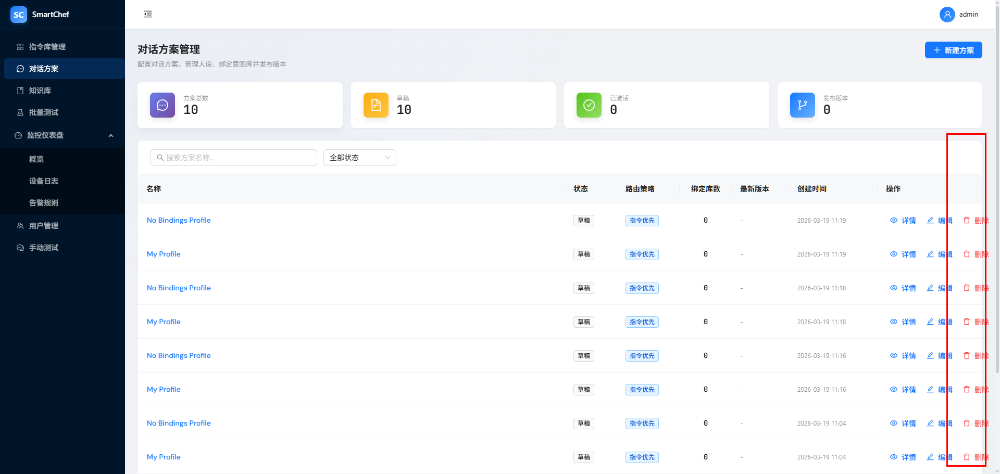
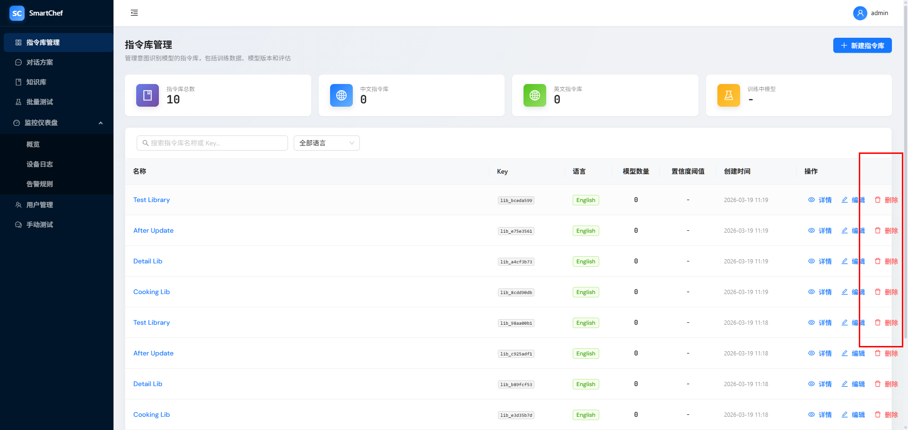

# 前端页面的Table 宽度溢出

## 现象

 、 ，列举几个例子，看看其他的列表是不是会出现同样的情况

对话方案管理、指令库管理等列表页面的 Table 在列较多或内容较宽时，表格宽度超出容器，导致页面出现横向滚动条或布局溢出，操作列（删除按钮等）被挤到页面边缘。

## 期望

表格在容器宽度不足时显示横向滚动条，内容在表格内部滚动，不撑破外层布局。

## 复现步骤

1. 打开对话方案管理或指令库管理页面
2. 缩小浏览器窗口或使用小屏设备
3. 观察表格区域，可见横向溢出

## 根因

1. **flex 子项默认 `min-width: auto`**：Card 作为 flex 子项不会收缩到比其内容（Table）更小。
2. **未按 Ant Design 官方用法**：需使用 `scroll.x`、`tableLayout="fixed"`、`ellipsis` 及留一列不设宽度。

## 修复方案

依据 [Ant Design Table 官方文档](https://ant-design.antgroup.com/components/table-cn)：

1. **Table 配置**：`scroll={{ x: true }}`、`tableLayout="fixed"`
2. **列配置**：留一列不设 `width`（如名称列）以适应弹性布局；对可能超长字段使用 `ellipsis: true`
3. **布局**：Card、MainLayout Content 设置 `minWidth: 0`，约束 flex 子项

## 修复说明

**第六次修复（按官方文档）**：

1. **移除 global.css 中 D018 相关覆盖**，避免与 Ant Design 内部布局冲突。

2. **所有列表页 Table 统一配置**（IntentLibrary、DialogProfile、BatchTest、KnowledgeBase、UserManager）：
   - `scroll={{ x: true }}`：启用横向滚动，溢出时在表格内部滚动
   - `tableLayout="fixed"`：内容不影响列宽，防止超长字段撑破布局
   - 名称列不设 `width`，作为弹性列
   - Key/名称等文本列设置 `ellipsis: true`，防止超长连续字段破坏布局（[#13825](https://github.com/ant-design/ant-design/issues/13825)）

3. **保留**：Card、MainLayout Content 的 `minWidth: 0`；Table 外包 div 的 `minWidth: 0`。

## 设计回溯

无。纯 UI 布局问题，AD/DD 设计文档无 Table 滚动相关约束，无需同步更新。
