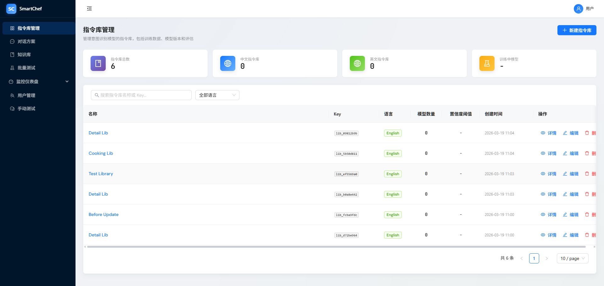

# 指令库列表中，指令库概览，中文指令库、英文指令库，数量都显示为0，与列表数据不符

## 现象
指令库管理页面的统计卡片（中文指令库、英文指令库）数量显示为0，与实际列表数据不符。

## 期望
统计卡片显示与列表一致的分类数量。

## 复现步骤
1. 打开指令库管理页面
2. 确认列表中有中文/英文指令库数据
3. 观察上方统计卡片，应正确显示数量

## 根因
1. **语言字段匹配**：后端可能返回 `zh-CN`/`en-US`，前端用 `l.language === 'zh'` 严格匹配导致过滤不到
2. **总数来源**：指令库总数卡片使用当前页 `libs.length` 而非接口返回的 `total`

## 修复方案
1. 使用 `l.language?.startsWith?.('zh')` / `startsWith('en')` 兼容 zh/zh-CN、en/en-US
2. 总数卡片使用 store 的 `total`，通过 `getValue(libraries, { total })` 传入
3. Store 拉取列表时对 `default_confidence_threshold` 做别名映射，保证表格/表单正确显示

## 修复说明
- **IntentLibrary/index.jsx**：STAT_CARDS 的 total 使用 opts.total，zh/en 使用 startsWith 过滤；渲染时传入 `getValue(libraries, { total })`
- **intentLibraryStore.js**：fetchLibraries 将 API 的 `default_confidence_threshold` 映射为 `confidence_threshold`，供表格和表单使用

## 设计回溯
无。纯前端展示逻辑，与设计文档一致。
