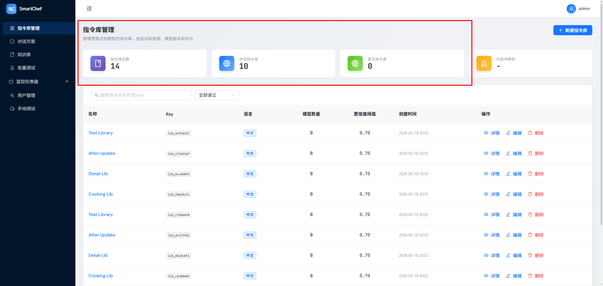

# 指令库列表中，指令库概览，中文指令库、英文指令库，数量之和，和指令库总数不符合

## 现象

指令库总数：14
中文指令库：10
英文指令库：0

## 期望

中文指令库 + 英文指令库 = 指令库总数（在无语言筛选时，三者统计口径一致）。

## 复现步骤

1. 存在 14 个指令库（如 10 个 zh + 4 个 en），分页为每页 10 条
2. 进入指令库列表页，查看概览卡片
3. 指令库总数显示 14，中文指令库仅统计当前页的 zh，显示 10，英文指令库 0（因当前页无 en）

## 根因

- **总数** 来自 API `data.total`（全局统计）
- **中文/英文** 来自前端对当前页 `libraries` 的过滤计数：`libs.filter(l => l.language === 'zh').length`
- 分页时当前页仅含部分数据，导致 zh+en 只统计当前页，与 total 口径不一致

## 修复方案

后端在 list 接口中返回与 total 同条件下的 `total_zh`、`total_en` 全局统计，前端使用 API 返回值替代对当前页的过滤计数。

## 修复说明

1. **后端**：`list_libraries` 增加同条件（search、language）下的 zh/en 全局 count；有 language 筛选时 total_zh/total_en 可直接由 total 推导
2. **API**：`paginated_response` 支持可选 `total_zh`、`total_en`，list 路由透传
3. **前端 store**：`fetchLibraries` 保存 `total_zh`、`total_en` 到 `totalZh`、`totalEn`
4. **前端页面**：STAT_CARDS 的 zh/en 卡片使用 `opts.totalZh`、`opts.totalEn` 替代对当前页 filter 计数

## 设计回溯

无设计文档不一致。DD §4.1 已定义语言仅为 zh/en，本次为实现层统计口径问题，设计无需更新。
