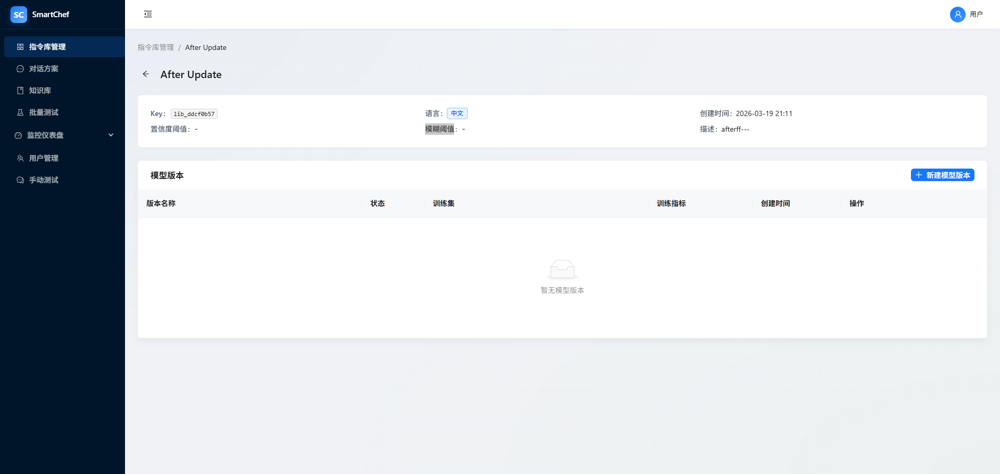

# 指令库详情，置信度阈值、模糊阈值这两个字段无法回显

## 现象
指令库列表，某条数据有详细内容，到了详情页缺少两个字段的回显

## 期望
详情页正确显示置信度阈值、模糊阈值（与列表页/API 数据一致）。

## 复现步骤
1. 进入指令库列表，点击某条数据进入详情页
2. 详情页 Descriptions 中「置信度阈值」「模糊阈值」显示为 `-`

## 根因
- API 返回字段为 `default_confidence_threshold`、`default_slot_f1_threshold`
- 详情页组件使用 `library.confidence_threshold`、`library.ambiguity_threshold` 展示
- 列表页在 `fetchLibraries` 中做了映射（`confidence_threshold ?? default_confidence_threshold`），详情页 `fetchLibraryDetail` 未做，导致字段不存在、回显为 `-`

## 修复方案
在 `fetchLibraryDetail` 中，设置 `currentLibrary` 时增加与列表页相同的字段映射。

## 修复说明
在 `intentLibraryStore.js` 的 `fetchLibraryDetail` 中，对 API 返回的 `res.data` 做字段映射：`confidence_threshold: lib.default_confidence_threshold`、`ambiguity_threshold: lib.default_slot_f1_threshold`，使详情页能正确读取并展示。

## 设计回溯
无设计文档不一致。DD §4.1 已定义阈值字段，本次为前端展示层与 API 字段命名不一致导致的回显问题。
