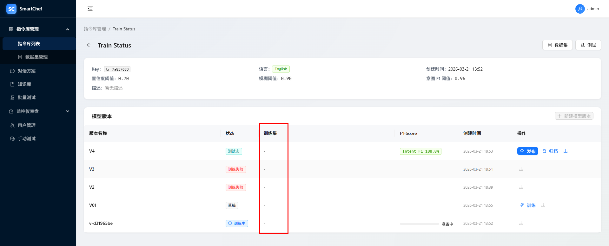

# 模型版本列表中，训练集字段为空

## 现象

模型版本表格中「训练集」列显示为 `-` 或空白，尽管创建版本时已绑定 `train_dataset_id`。

## 期望

列表与详情接口返回训练集展示名称，前端「训练集」列显示对应训练数据集名称（与 `Detail.jsx` 中 `dataset_name` / `train_dataset_name` 一致）。

## 复现步骤
1. 创建指令库与训练数据集，并创建带 `train_dataset_id` 的模型版本
2. 打开指令库详情 → 模型版本列表
3. 「训练集」列为空

## 根因
- 后端 `model_version_service._model_to_dict` 仅序列化 `train_dataset_id`，未附带训练集 `name`。
- 前端 `IntentLibrary/Detail.jsx` 列 `dataIndex` 为 `dataset_name`，`render` 回退 `record.train_dataset_name`，二者均未由 API 提供，故展示为空。

## 修复方案
- 列表查询与 `_get_model` 使用 `selectinload(LibraryModelVersion.train_dataset)` 预加载训练集。
- `_model_to_dict` 增加 `train_dataset_name` 与 `dataset_name`（同值，兼容列 `dataIndex`）。
- 各写操作返回前通过 `_get_model` 再取一次，保证关系已加载且字段一致。
- `ModelVersionResponse` 增加可选字段说明契约。
- 集成测试 `test_model_version_crud` 断言上述字段。

## 修复说明
- 见 `fix_ref`；无前端改动（数据到位后现有列即可显示）。

## 设计回溯
- 设计文档（dd-intent-library）已定义模型版本关联 `train_dataset_id`；补充响应中的展示名字段与 UI 一致，无需改业务规则，仅需实现层对齐。
