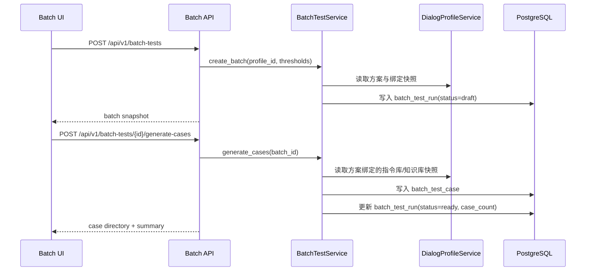
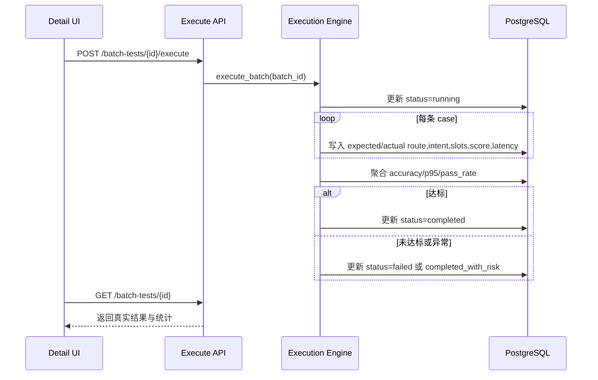
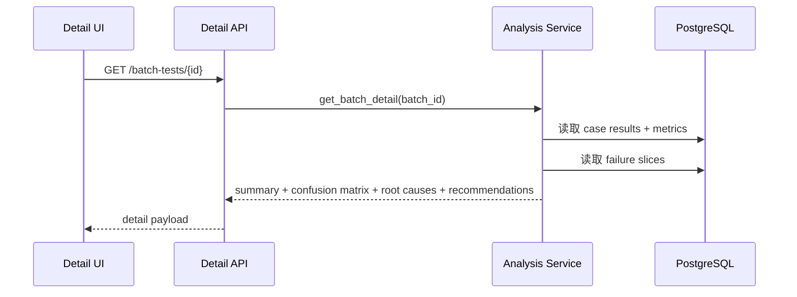

# 对话方案批量测试模块架构设计

## 1. 模块职责与边界

| 子模块 | 职责 | 不负责 |
|--------|------|--------|
| `batch directory` | 批次列表、创建批次、状态统计、入口导航 | 方案配置本身编辑 |
| `case management` | 自动生成/上传测试用例、微调保存、达标规则配置 | 指令库训练集维护 |
| `execution engine` | 执行测试批次、记录逐条结果、回写指标与状态 | 真实生产流量压测 |
| `analysis report` | 结果汇总、混淆矩阵、失败归因、优化建议 | 线上告警与监控归档 |

## 2. 模块关系与调用

| 调用方 | 被调方 | 通信方式 | 同步/异步 | 失败策略 |
|--------|--------|---------|----------|---------|
| `frontend/modules/batch-test` | `GET /api/v1/batch-tests` | REST | 同步 | 保留筛选条件并展示错误态 |
| `frontend/modules/batch-test` | `POST /api/v1/batch-tests` | REST | 同步 | 新建失败时保留表单输入 |
| `frontend/modules/batch-test` | `POST /api/v1/batch-tests/{id}/generate-cases` | REST | 同步 | 若方案无绑定能力则返回 blocker |
| `frontend/modules/batch-test` | `POST /api/v1/batch-tests/{id}/execute` | REST + background job | 异步 | 只展示真实 `running/completed/failed` 状态 |
| `frontend/modules/batch-test` | `GET /api/v1/batch-tests/{id}` | REST | 同步 | 详情页显示最近一次真实回读结果 |
| `batch test service` | `dialog profile service` | 领域读取 | 同步 | 方案不存在或未发布时阻断执行 |
| `batch test service` | `manual test evaluator` | 领域调用 | 同步 | 单条 case 失败时逐条记录，不得整批静默成功 |

## 3. 核心数据流

### 3.1 批次创建与用例生成闭环

**触发点**: PM 创建新的批量测试批次并生成默认用例  
**涉及模块**: 列表页、API 层、BatchTestService、DialogProfileService、PostgreSQL  
**对应 FR**: FR-012

### 3.2 批次执行闭环

**触发点**: PM 点击“执行测试”  
**涉及模块**: 详情页、API 层、ExecutionEngine、PostgreSQL  
**对应 FR**: FR-012, FR-013

### 3.3 智能分析闭环

**触发点**: 批次执行结束且指标未达标  
**涉及模块**: 详情页、AnalysisService、PostgreSQL  
**对应 FR**: FR-014

## 4. 接口契约

### 4.1 `GET /api/v1/batch-tests`

- **能力点**: `test_execute`
- **输入**: 可选 `status`, `profile_id`, `search`
- **输出**: 批次目录、状态统计、最近执行摘要

### 4.2 `POST /api/v1/batch-tests`

- **能力点**: `test_execute`
- **输入**: `name`, `profile_id`, `baseline_thresholds`
- **约束**:
  - 方案必须存在
  - 批次名称在同一方案下唯一

### 4.3 `POST /api/v1/batch-tests/{batch_id}/generate-cases`

- **能力点**: `test_execute`
- **输入**: 可选 `mode=auto|upload`, `cases`
- **输出**: 用例列表、数量、来源摘要

### 4.4 `GET /api/v1/batch-tests/{batch_id}`

- **能力点**: `test_execute`
- **输出**: 批次详情、测试结果、指标、混淆矩阵、分析建议

### 4.5 `POST /api/v1/batch-tests/{batch_id}/execute`

- **能力点**: `test_execute`
- **输出**: `running` 状态、执行摘要、最近任务时间

## 5. 浏览器阶段与验证重点

| probe | 页面动作 | 真实成功信号 |
|-------|---------|-------------|
| `case_count_consistency` | 生成或上传用例 | 列表数量、详情统计、结果表数量一致 |
| `latency_feedback` | 执行测试批次 | 结果页展示真实 latency/p95 指标 |
| `accuracy_feedback` | 查看报告与分析 | 准确率、失败 case、建议来自后端回读 |

## 6. FR 追溯

| FR | 需求 | 设计落实 |
|----|------|---------|
| FR-012 | 对话方案批量测试与用例生成/微调 | 批次创建、生成/上传用例、执行入口 |
| FR-013 | 完整结果字段与达标判断 | 逐条结果字段、指标汇总、结果表 |
| FR-014 | 未达标智能分析报告 | 混淆矩阵、失败归因、建议卡片 |

## 7. 风险与缓解

| 风险 | 影响 | 缓解 |
|------|------|------|
| 用例数量与结果数量不一致 | PM 无法信任报告 | 批次详情同时回读 case_count / executed_count / result_count |
| 指标被前端硬编码 | 报告假成功 | latency/accuracy 全部来自后端聚合 |
| 未达标仍显示通过 | 误导发布决策 | 以达标规则统一计算 `pass/fail` |
| 指令库内评估与方案批测口径混淆 | 结论失真 | 明确被测对象固定为 dialog profile |
