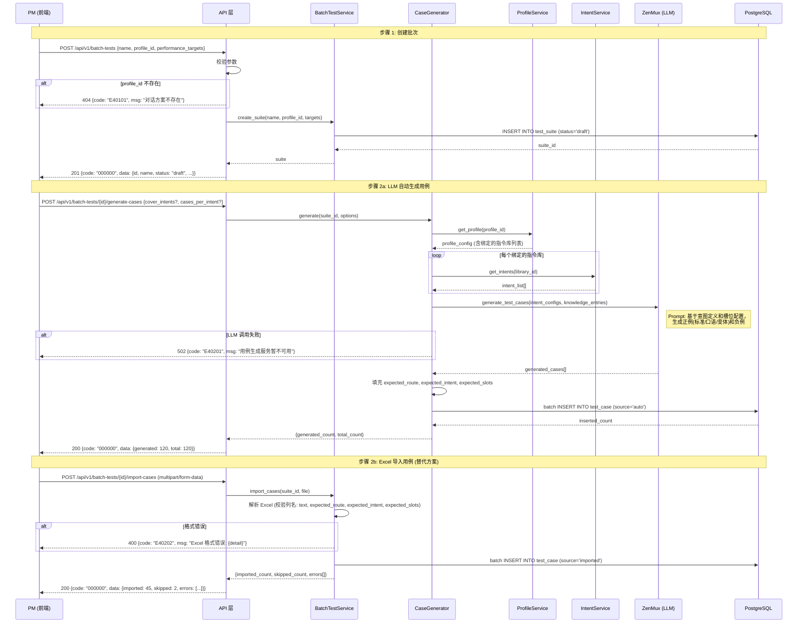
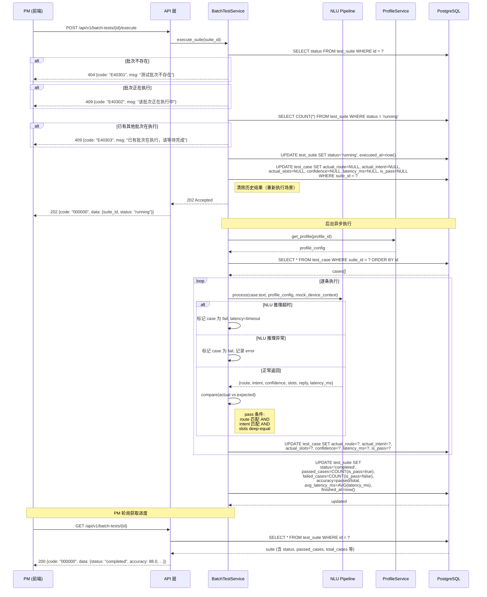
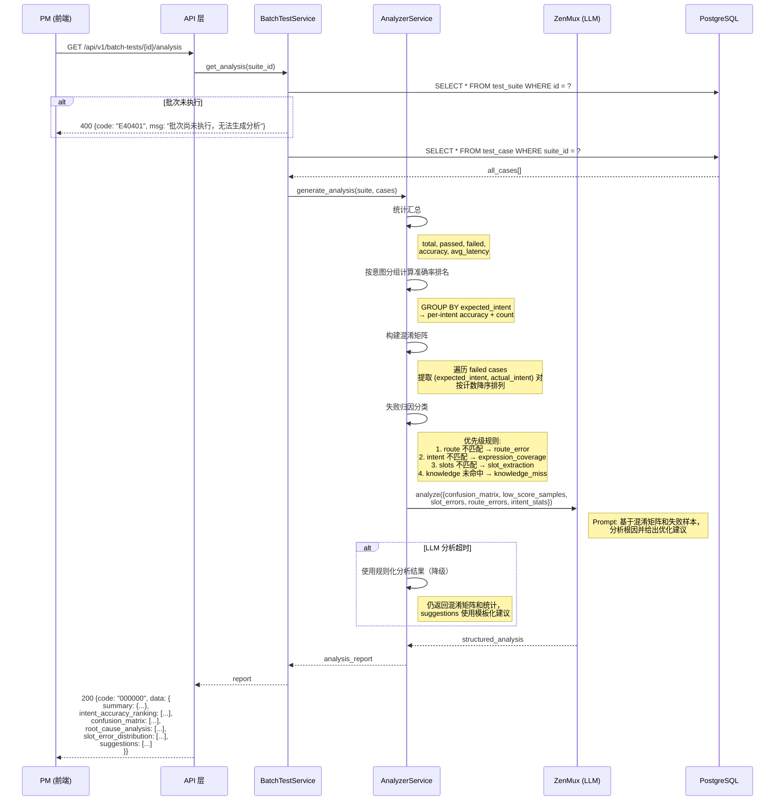

# 架构设计: 测试域 — 批量测试 (Batch Test)

## 1. 模块概述

### 1.1 职责范围

| 职责 | 说明 | 对应 FR |
|------|------|---------|
| 批次管理 | 创建、查看、删除批量测试批次，关联对话方案 | FR-012 |
| 用例管理 | 手动添加/编辑/删除用例、LLM 自动生成用例、Excel 导入/导出 | FR-012 |
| 批量执行 | 逐条调用 NLU Pipeline 执行测试，逐条比对 pass/fail | FR-013 |
| 智能分析 | 生成分析报告: 混淆矩阵、准确率排名、失败归因、优化建议 | FR-014 |
| 批次对比 | 对比两次测试结果的差异与变化趋势 | FR-014 |

### 1.2 与指令库域测试的区别

| 维度 | 本模块 (ad-batch-test) | 指令库域测试 (ad-intent-library) |
|------|----------------------|-------------------------------|
| 测试对象 | **完整对话方案** (路由+意图+槽位+知识+闲聊) | 单个指令库模型 |
| 入口 | 批量测试菜单 → 选择对话方案 | 指令库 → 模型 → 测试 Tab |
| 路由覆盖 | command + knowledge + chitchat 三域 | 仅 command 域 (意图分类+槽位) |
| 执行管道 | 完整 NLU Pipeline (含路由决策) | 单模型推理 (直接调用 classifier) |
| 分析维度 | 路由错误 + 意图混淆 + 槽位失败 + 知识未命中 | 意图混淆 + 槽位错误 |

### 1.3 核心实体

```yaml
TestSuite (批次):
  描述: 一次批量测试任务
  字段: id, name, profile_id, description, status(draft/running/completed/failed),
        performance_targets(json), total_cases, passed_cases, failed_cases,
        accuracy, avg_latency_ms, created_by, created_at, executed_at, finished_at
  状态机: draft → running → completed (可从 completed/failed 重新执行 → running)
  约束: 同时仅允许 1 个 running 批次

TestCase (用例):
  描述: 批次内单条测试用例
  字段: id, suite_id, text, expected_route, expected_intent, expected_slots(json),
        actual_route, actual_intent, actual_slots(json), confidence, latency_ms,
        is_pass, source(auto/manual/imported), created_at, executed_at
  状态: pending → passed / failed (执行后填充)
```

### 1.4 模块依赖

| 被依赖方 | 依赖方式 | 说明 |
|---------|---------|------|
| nlu/pipeline | 函数调用 (同步逐条) | 执行测试时调用完整推理管道 |
| profile_service | 函数调用 | 获取对话方案配置（指令库绑定、阈值等） |
| chitchat/llm_adapter | 函数调用 | LLM 自动生成测试用例 + 智能分析 |
| intent_service | 函数调用 | 获取方案绑定的意图列表（用于生成用例） |

---

## 2. 核心数据流

### 2.1 创建批量测试批次 + 自动生成用例 (FR-012)

**触发点**: PM 在批量测试列表页点击"新建测试批次"
**涉及模块**: 前端 → API → testing/batch_test → testing/case_generator → LLM → PostgreSQL



### 2.2 执行批量测试 (FR-013)

**触发点**: PM 点击"执行"或"重新执行"
**涉及模块**: API → testing/batch_test → nlu/pipeline → PostgreSQL



### 2.3 智能分析报告生成 (FR-014)

**触发点**: PM 在批次详情页查看智能分析报告
**涉及模块**: API → testing/batch_test → testing/analyzer → LLM → PostgreSQL



---

## 3. 接口契约

### 3.1 测试批次 CRUD API

| 方法 | 路径 | 说明 | 权限 | 对应 FR |
|------|------|------|------|---------|
| GET | /api/v1/batch-tests | 批次列表 (分页+筛选) | batch_test_read | FR-012 |
| POST | /api/v1/batch-tests | 创建批次 | batch_test_create | FR-012 |
| GET | /api/v1/batch-tests/{id} | 批次详情 (含进度) | batch_test_read | FR-012 |
| DELETE | /api/v1/batch-tests/{id} | 删除批次 | batch_test_delete | FR-012 |

#### 3.1.1 批次列表

**请求** (Query):

| 参数 | 类型 | 必填 | 默认值 | 说明 |
|------|------|------|--------|------|
| keyword | string | 否 | - | 批次名称模糊搜索 |
| profile_id | string | 否 | - | 按对话方案筛选 |
| status | string | 否 | - | draft/running/completed/failed |
| is_pass | boolean | 否 | - | 是否达标 |
| page | int | 否 | 1 | 页码 |
| page_size | int | 否 | 20 | 每页条数, max=100 |
| sort_by | string | 否 | created_at | 排序字段 |
| sort_order | string | 否 | desc | asc/desc |

**响应**:

```json
{
  "code": "000000",
  "data": {
    "items": [
      {
        "id": "batch_001",
        "name": "指令全量回归 v2.1",
        "profile_id": "prof_001",
        "profile_name": "生产方案-中英双语",
        "total_cases": 200,
        "passed_cases": 192,
        "failed_cases": 8,
        "status": "completed",
        "accuracy": 96.2,
        "avg_latency_ms": 145,
        "performance_targets": {
          "accuracy_threshold": 95.0,
          "latency_threshold_ms": 200
        },
        "is_pass": true,
        "created_at": "2026-03-17T14:00:00+08:00",
        "executed_at": "2026-03-17T14:05:00+08:00",
        "finished_at": "2026-03-17T14:08:30+08:00"
      }
    ],
    "total": 8,
    "page": 1,
    "page_size": 20
  },
  "msg": "success"
}
```

#### 3.1.2 创建批次

**请求** (Body):

```json
{
  "name": "string, 必填, max 100, 批次名称",
  "profile_id": "string, 必填, 关联对话方案 ID",
  "description": "string, 可选, max 500, 批次描述",
  "performance_targets": {
    "accuracy_threshold": "float, 可选, 默认 95.0, 准确率达标阈值(%)",
    "latency_threshold_ms": "int, 可选, 默认 200, 延迟达标阈值(ms)"
  }
}
```

**响应** (201):

```json
{
  "code": "000000",
  "data": {
    "id": "batch_009",
    "name": "新功能回归测试",
    "profile_id": "prof_001",
    "profile_name": "生产方案-中英双语",
    "status": "draft",
    "total_cases": 0,
    "performance_targets": {
      "accuracy_threshold": 95.0,
      "latency_threshold_ms": 200
    },
    "created_at": "2026-03-18T10:00:00+08:00"
  },
  "msg": "success"
}
```

#### 3.1.3 批次详情

**响应**:

```json
{
  "code": "000000",
  "data": {
    "id": "batch_002",
    "name": "新增意图验证",
    "profile_id": "prof_002",
    "profile_name": "测试方案-千问",
    "description": "验证新增的 5 个意图识别准确率",
    "status": "completed",
    "total_cases": 50,
    "passed_cases": 44,
    "failed_cases": 6,
    "accuracy": 88.0,
    "avg_latency_ms": 168,
    "performance_targets": {
      "accuracy_threshold": 95.0,
      "latency_threshold_ms": 200
    },
    "is_pass": false,
    "created_by": "admin",
    "created_at": "2026-03-16T10:00:00+08:00",
    "executed_at": "2026-03-17T15:30:00+08:00",
    "finished_at": "2026-03-17T15:32:18+08:00"
  },
  "msg": "success"
}
```

### 3.2 用例管理 API

| 方法 | 路径 | 说明 | 权限 | 对应 FR |
|------|------|------|------|---------|
| GET | /api/v1/batch-tests/{id}/cases | 用例列表 (分页) | batch_test_read | FR-013 |
| GET | /api/v1/batch-tests/{id}/cases/{cid} | 用例详情 | batch_test_read | FR-013 |
| POST | /api/v1/batch-tests/{id}/cases | 手动添加用例 | batch_test_create | FR-012 |
| PUT | /api/v1/batch-tests/{id}/cases/{cid} | 编辑用例 | batch_test_create | FR-012 |
| DELETE | /api/v1/batch-tests/{id}/cases/{cid} | 删除单个用例 | batch_test_delete | FR-012 |
| DELETE | /api/v1/batch-tests/{id}/cases | 批量删除用例 | batch_test_delete | FR-012 |
| POST | /api/v1/batch-tests/{id}/generate-cases | LLM 自动生成用例 | batch_test_create | FR-012 |
| POST | /api/v1/batch-tests/{id}/import-cases | Excel 导入用例 | batch_test_create | FR-012 |
| GET | /api/v1/batch-tests/{id}/export-cases | 导出用例+结果 | batch_test_read | FR-013 |

#### 3.2.1 用例列表

**请求** (Query):

| 参数 | 类型 | 必填 | 默认值 | 说明 |
|------|------|------|--------|------|
| is_pass | boolean | 否 | - | 筛选达标/未达标 |
| expected_route | string | 否 | - | 筛选预期路由 |
| intent | string | 否 | - | 按意图名称筛选 (模糊匹配) |
| source | string | 否 | - | auto/manual/imported |
| page | int | 否 | 1 | 页码 |
| page_size | int | 否 | 20 | 每页条数, max=100 |
| sort_by | string | 否 | id | 排序字段: id/confidence/latency_ms |
| sort_order | string | 否 | asc | asc/desc |

**响应**:

```json
{
  "code": "000000",
  "data": {
    "items": [
      {
        "id": "case_001",
        "text": "设置温度180度",
        "expected_route": "command",
        "expected_intent": "set_cooking_temp",
        "expected_slots": [{"name": "number", "value": "180"}],
        "actual_route": "command",
        "actual_intent": "set_cooking_temp",
        "actual_slots": [{"name": "number", "value": "180"}],
        "confidence": 0.96,
        "latency_ms": 128,
        "is_pass": true,
        "source": "auto",
        "created_at": "2026-03-17T14:00:00+08:00",
        "executed_at": "2026-03-17T14:05:12+08:00"
      }
    ],
    "total": 200,
    "page": 1,
    "page_size": 20
  },
  "msg": "success"
}
```

#### 3.2.2 用例详情

**路径**: `GET /api/v1/batch-tests/{id}/cases/{cid}`

**响应** (200):

```json
{
  "code": "000000",
  "data": {
    "id": "case_201",
    "text": "帮我调低一点温度",
    "expected_route": "command",
    "expected_intent": "decrease_temp",
    "expected_slots": [{"name": "direction", "value": "decrease"}],
    "actual_route": "command",
    "actual_intent": "decrease_temp",
    "actual_slots": [{"name": "direction", "value": "decrease"}],
    "confidence": 0.91,
    "latency_ms": 85,
    "is_pass": true,
    "source": "manual",
    "created_at": "2026-03-18T10:30:00+08:00",
    "executed_at": "2026-03-18T14:05:12+08:00"
  },
  "msg": "success"
}
```

#### 3.2.3 手动添加用例

**请求** (Body):

```json
{
  "text": "string, 必填, max 500, 用户输入语句",
  "expected_route": "string, 必填, enum: command/knowledge/chitchat",
  "expected_intent": "string, 条件必填, command 路由时必填, 预期意图名称",
  "expected_slots": [
    {
      "name": "string, 必填, 槽位名",
      "value": "string, 必填, 预期值"
    }
  ]
}
```

**响应** (201):

```json
{
  "code": "000000",
  "data": {
    "id": "case_201",
    "text": "帮我调低一点温度",
    "expected_route": "command",
    "expected_intent": "decrease_temp",
    "expected_slots": [],
    "source": "manual",
    "is_pass": null,
    "created_at": "2026-03-18T10:30:00+08:00"
  },
  "msg": "success"
}
```

#### 3.2.4 LLM 自动生成用例

**请求** (Body):

```json
{
  "cover_intents": ["string, 可选, 指定覆盖的意图列表, 留空则覆盖全部"],
  "cases_per_intent": "int, 可选, 默认 10, min=1, max=50, 每意图生成用例数",
  "include_knowledge": "boolean, 可选, 默认 true, 是否生成知识域用例",
  "include_chitchat": "boolean, 可选, 默认 true, 是否生成闲聊域用例"
}
```

**响应**:

```json
{
  "code": "000000",
  "data": {
    "generated_count": 120,
    "total_count": 120,
    "by_route": {
      "command": 80,
      "knowledge": 25,
      "chitchat": 15
    }
  },
  "msg": "success"
}
```

#### 3.2.5 Excel 导入用例

**请求** (multipart/form-data):

| 参数 | 类型 | 必填 | 说明 |
|------|------|------|------|
| file | file | 是 | .xlsx/.csv 文件, 必须包含列: text, expected_route, expected_intent |
| mode | string | 否 | append(追加, 默认) / overwrite(覆盖已有用例) |

**Excel 模板必须列**:

| 列名 | 类型 | 必填 | 说明 |
|------|------|------|------|
| text | string | 是 | 用例语句 |
| expected_route | string | 是 | command / knowledge / chitchat |
| expected_intent | string | 条件 | command 路由时必填 |
| expected_slots | string | 否 | JSON 字符串, 如 `[{"name":"number","value":"180"}]` |

**响应**:

```json
{
  "code": "000000",
  "data": {
    "imported_count": 45,
    "skipped_count": 2,
    "errors": [
      {"row": 12, "reason": "expected_route 字段值无效: 'cmd'"},
      {"row": 28, "reason": "text 字段为空"}
    ]
  },
  "msg": "success"
}
```

#### 3.2.6 导出用例+结果

**请求** (Query):

| 参数 | 类型 | 必填 | 默认值 | 说明 |
|------|------|------|--------|------|
| format | string | 否 | excel | excel / json |

**响应**: 文件下载 (Content-Disposition: attachment)

#### 3.2.7 批量删除用例

**路径**: `DELETE /api/v1/batch-tests/{id}/cases`

**请求** (Body):

```json
{
  "case_ids": ["string, 必填, 至少 1 个, 最多 500 个用例 ID"]
}
```

**响应** (200):

```json
{
  "code": "000000",
  "data": {
    "deleted_count": 15
  },
  "msg": "success"
}
```

**错误码**:

| 错误码 | HTTP 状态 | 场景 |
|--------|----------|------|
| E40301 | 400 | case_ids 为空或超过 500 |
| E40302 | 404 | 批量测试集不存在 |

### 3.3 执行与分析 API

| 方法 | 路径 | 说明 | 权限 | 对应 FR |
|------|------|------|------|---------|
| POST | /api/v1/batch-tests/{id}/execute | 执行批量测试 | batch_test_execute | FR-013 |
| GET | /api/v1/batch-tests/{id}/analysis | 智能分析报告 | batch_test_read | FR-014 |
| GET | /api/v1/batch-tests/{id}/compare/{other_id} | 对比两次测试 | batch_test_read | FR-014 |

#### 3.3.1 执行批量测试

**响应** (202 Accepted):

```json
{
  "code": "000000",
  "data": {
    "suite_id": "batch_002",
    "status": "running",
    "total_cases": 50,
    "message": "批量测试已提交执行"
  },
  "msg": "success"
}
```

#### 3.3.2 智能分析报告

**响应**:

```json
{
  "code": "000000",
  "data": {
    "suite_id": "batch_002",
    "summary": {
      "total": 50,
      "passed": 44,
      "failed": 6,
      "accuracy": 88.0,
      "avg_latency_ms": 168,
      "target_accuracy": 95.0,
      "target_latency_ms": 200,
      "is_pass": false
    },
    "intent_accuracy_ranking": [
      {
        "intent": "voice_cmd_start_cooking",
        "total": 5,
        "passed": 5,
        "accuracy": 100.0
      },
      {
        "intent": "set_cooking_temp",
        "total": 8,
        "passed": 7,
        "accuracy": 87.5
      },
      {
        "intent": "defrost_food",
        "total": 3,
        "passed": 1,
        "accuracy": 33.3
      }
    ],
    "confusion_matrix": [
      {
        "expected_intent": "decrease_temp",
        "actual_intent": "set_cooking_temp",
        "count": 3,
        "severity": "critical",
        "sample_texts": ["帮我调低一点", "小一点火", "温度低点"]
      },
      {
        "expected_intent": "defrost_food",
        "actual_intent": "set_cooking_time",
        "count": 2,
        "severity": "moderate",
        "sample_texts": ["解冻一下", "化冻"]
      }
    ],
    "root_cause_analysis": [
      {
        "category": "expression_coverage",
        "display_name": "表达覆盖不足",
        "count": 3,
        "percentage": 50.0,
        "examples": ["帮我调低一点", "解冻一下"],
        "description": "训练数据未覆盖口语化表达，导致意图被误分类"
      },
      {
        "category": "route_error",
        "display_name": "路由错误",
        "count": 1,
        "percentage": 16.7,
        "examples": ["红烧肉怎么做"],
        "description": "指令优先策略将知识问答误分为指令"
      },
      {
        "category": "slot_extraction",
        "display_name": "槽位提取失败",
        "count": 2,
        "percentage": 33.3,
        "examples": ["收藏这个菜谱"],
        "description": "指代消解在批量测试单轮上下文中不可用"
      }
    ],
    "slot_error_distribution": [
      {
        "slot_name": "recipe_ref",
        "error_type": "reference_unresolved",
        "count": 2,
        "description": "指代词未消解，值为 null"
      },
      {
        "slot_name": "number",
        "error_type": "value_missing",
        "count": 1,
        "description": "隐含数值未提取"
      }
    ],
    "suggestions": [
      "为 decrease_temp 意图补充口语化训练数据（\"调低一点\"、\"小点火\"等）",
      "为 defrost_food 意图补充简短表达（\"解冻一下\"、\"化冻\"等）",
      "考虑调整路由策略，对\"XX怎么做\"类问句提升知识域权重",
      "批量测试环境增加模拟上下文支持（解决指代消解问题）",
      "建议在指令库中补充同义词和变体表达后重新训练模型"
    ],
    "generated_at": "2026-03-17T15:32:30+08:00"
  },
  "msg": "success"
}
```

#### 3.3.3 对比两次测试

**请求**: `GET /api/v1/batch-tests/{id}/compare/{other_id}`

**响应**:

```json
{
  "code": "000000",
  "data": {
    "base": {
      "suite_id": "batch_002",
      "name": "新增意图验证",
      "accuracy": 88.0,
      "avg_latency_ms": 168,
      "executed_at": "2026-03-17T15:30:00+08:00"
    },
    "compare": {
      "suite_id": "batch_001",
      "name": "指令全量回归 v2.1",
      "accuracy": 96.2,
      "avg_latency_ms": 145,
      "executed_at": "2026-03-17T14:05:00+08:00"
    },
    "diff": {
      "accuracy_delta": -8.2,
      "latency_delta_ms": 23,
      "new_failures": [
        {
          "text": "帮我调低一点",
          "expected_intent": "decrease_temp",
          "actual_intent": "set_cooking_temp"
        }
      ],
      "fixed_failures": [],
      "intent_accuracy_changes": [
        {
          "intent": "decrease_temp",
          "base_accuracy": 0.0,
          "compare_accuracy": 85.0,
          "delta": -85.0
        }
      ]
    }
  },
  "msg": "success"
}
```

---

## 4. 异常处理汇总

| 错误码 | HTTP 状态 | 场景 | 用户提示 |
|--------|----------|------|---------|
| E40101 | 404 | 关联的对话方案不存在 | "对话方案 {profile_id} 不存在" |
| E40102 | 400 | 批次名称为空 | "批次名称不能为空" |
| E40103 | 409 | 批次名称重复 | "批次名称已存在" |
| E40104 | 400 | 性能阈值范围无效 | "准确率阈值必须在 0~100 之间" |
| E40201 | 502 | LLM 用例生成服务不可用 | "用例生成服务暂不可用，请稍后重试" |
| E40202 | 400 | Excel 格式错误 | "Excel 格式错误: {detail}" |
| E40203 | 400 | 手动添加用例参数无效 | "用例参数无效: {detail}" |
| E40204 | 400 | command 路由缺少 expected_intent | "command 路由的用例必须指定 expected_intent" |
| E40301 | 404 | 测试批次不存在 | "测试批次 {id} 不存在" |
| E40302 | 409 | 批次正在执行中 | "该批次正在执行中，请等待完成" |
| E40303 | 409 | 已有其他批次在执行 | "已有批次在执行中，请等待完成后再执行" |
| E40304 | 400 | 批次无用例，无法执行 | "批次中无测试用例，请先添加用例" |
| E40305 | 409 | running 状态不可删除 | "执行中的批次不可删除" |
| E40401 | 400 | 批次未执行，无法生成分析 | "批次尚未执行，无法生成分析报告" |
| E40402 | 502 | LLM 分析服务不可用 | "智能分析服务暂不可用，已返回基础统计报告" |
| E40501 | 404 | 对比目标批次不存在 | "对比目标批次 {other_id} 不存在" |
| E40502 | 400 | 对比目标批次未执行 | "对比目标批次尚未执行完成" |

---

## 5. 模块级风险

| 风险 | 影响 | 可能性 | 缓解策略 | 对应 FR |
|------|------|--------|---------|---------|
| LLM 生成的测试用例质量参差不齐 | 中 | 高 | PM 可在生成后手动修改/删除；生成 Prompt 持续优化；支持 Excel 导入替代 | FR-012 |
| 大批次执行耗时过长 (200+ 条) | 中 | 高 | 异步执行 + 前端轮询进度；单条超时 5s 自动跳过；并行度可配置 | FR-013 |
| 智能分析准确性依赖 LLM 质量 | 中 | 中 | LLM 分析失败时降级为规则化分析（混淆矩阵 + 统计仍可用）；分析结果仅供参考 | FR-014 |
| 批量测试无多轮上下文 | 低 | 高 | 明确标注为"单轮测试"；依赖指代的用例标记为"环境限制"而非模型问题 | FR-013 |
| 并发执行冲突 | 低 | 低 | 全局互斥锁：同时仅 1 个 running 批次；冲突时返回明确提示 | FR-013 |

---

## 6. 需求追溯

| FR 编号 | 需求摘要 | AD 章节 | 覆盖状态 |
|---------|---------|---------|---------|
| FR-012 | 批量测试: 自动生成用例, PM 可手动修改 | §2.1 数据流 + §3.1 批次 API + §3.2 用例 API | ✅ 完整 |
| FR-013 | 用例模板含完整字段, 逐条执行+结果记录 | §2.2 数据流 + §3.2.1 用例列表 + §3.3.1 执行 API | ✅ 完整 |
| FR-014 | 未达标时智能分析: 排名+混淆矩阵+归因+建议 | §2.3 数据流 + §3.3.2 分析 API + §3.3.3 对比 API | ✅ 完整 |

---

## 7. 产出物合规检查表

| 模板条款 | 状态 | 说明 |
|---------|------|------|
| §2.3 数据流驱动 | ✅ | 3 个核心流程有 Mermaid 序列图 |
| §5 数据流含异常分支 | ✅ | 方案不存在、并发冲突、LLM 超时降级、Excel 格式错误、批次未执行 |
| §6.1 响应信封统一 | ✅ | 所有 API 使用 code/data/msg 信封 |
| §6.2 API 契约完整 | ✅ | 14 个 API 端点有完整输入/输出/错误码 |
| §10.3 CRUD 完整性 | ✅ | 批次 CRUD + 用例 CRUD + 生成/导入/导出 |
| §10.3 批量操作 | ✅ | Excel 导入/导出、LLM 批量生成 |
| §7.3 追溯矩阵 | ✅ | 3 个 FR 全部映射 |
