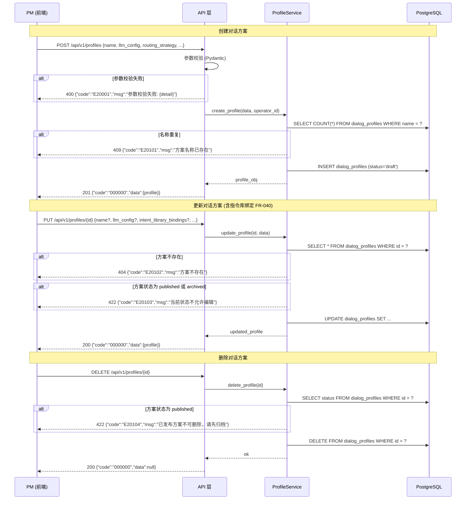
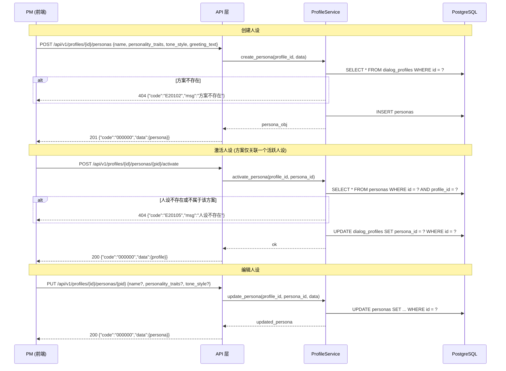
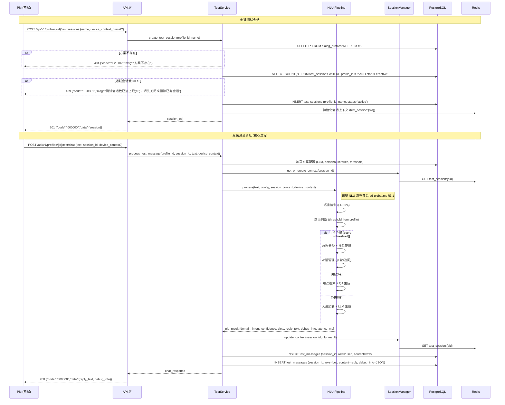
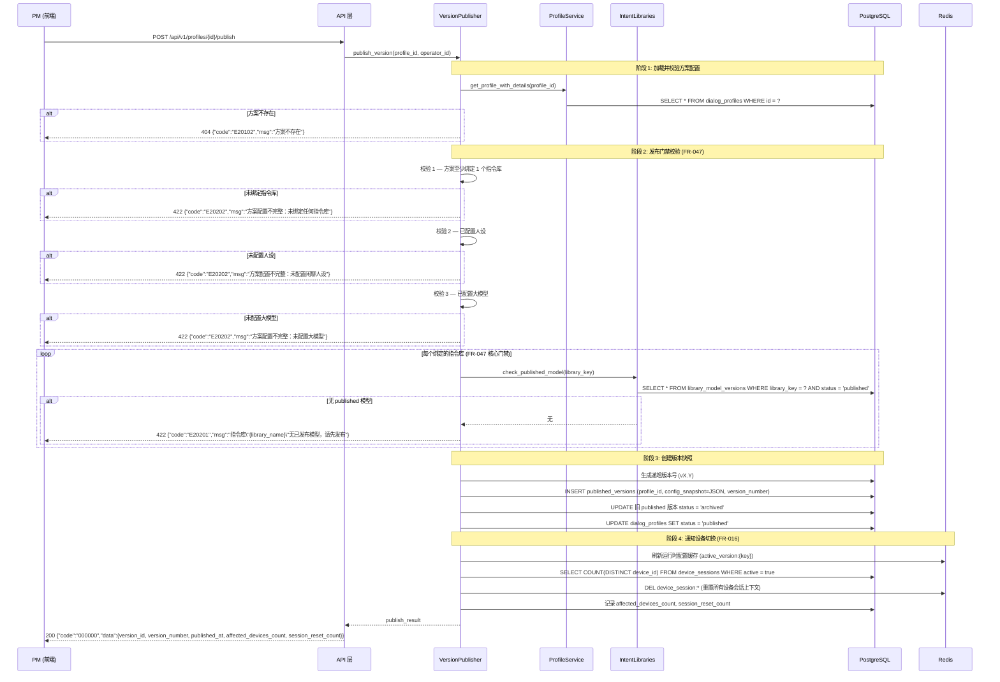

# 架构设计: 对话方案域 (Dialog Profile)

## 1. 模块概述

### 1.1 职责

对话方案域是 SmartChef 平台的**支撑域**，负责管理对话方案的完整生命周期——从创建、配置到发布上线。对话方案是连接后台配置与生产 API 的核心抽象，它将指令库、知识库、闲聊人设、大模型选型、路由策略等配置聚合为一个可发布的运行时配置单元。

### 1.2 核心实体

| 实体 | 说明 | 对应 FR |
|------|------|---------|
| DialogProfile | 对话方案：聚合 LLM 配置、指令库绑定、人设、路由策略、阈值等 | FR-007 |
| Persona | 闲聊人设：定义助手名称、性格特征、语气风格 | FR-008 |
| PublishedVersion | 发布版本：方案配置的不可变快照，同一时间仅一个生效 | FR-015 |

### 1.3 关键流程

| 流程 | 说明 | 对应章节 |
|------|------|---------|
| 方案 CRUD | 创建、查询、更新、删除对话方案 | §2.1 |
| 人设配置 | 创建/编辑/切换闲聊人设 | §2.2 |
| 手动单条测试 | PM 在聊天窗口逐条测试对话效果 | §2.3 |
| 版本发布 | 打包快照 + 发布门禁校验 + 设备切换 | §2.4 |

### 1.4 PD 页面映射

| PD 页面 | 文件 | 功能 | 涉及 API |
|---------|------|------|---------|
| 方案列表 | pd-dialog-profile/index.html | 方案列表、筛选、新建/编辑/删除 | §3.1 |
| 方案详情 | pd-dialog-profile/detail.html | 基本信息编辑、指令库绑定、人设配置、发布 | §3.1, §3.2, §3.4, §3.5 |
| 手动测试 | pd-dialog-profile/test-chat.html | 聊天窗口、调试面板、设备上下文模拟 | §3.3 |

### 1.5 跨模块依赖

| 依赖模块 | 依赖关系 | 触发场景 |
|---------|---------|---------|
| intent_libraries | 发布时校验 published 模型 (FR-047) | POST /profiles/{id}/publish |
| nlu/pipeline | 手动测试时调用 NLU 推理管道 (FR-009~011) | POST /profiles/{id}/test/chat |
| version/publisher | 发布时创建版本快照并通知设备 (FR-015~016) | POST /profiles/{id}/publish |
| chitchat/persona | 运行时加载人设配置 | 对话推理 |

---

## 2. 核心数据流

### 2.1 对话方案 CRUD 流程

**对应 FR**: FR-007, FR-040
**PD 页面**: index.html (列表+新建弹窗), detail.html (编辑基本信息)



**异常处理汇总**:

| 异常场景 | 错误码 | HTTP 状态 | 用户提示 |
|---------|--------|----------|---------|
| 请求参数不合法 | E20001 | 400 | 参数校验失败: {detail} |
| 方案名称重复 | E20101 | 409 | 方案名称已存在 |
| 方案不存在 | E20102 | 404 | 方案不存在 |
| 状态不允许编辑 | E20103 | 422 | 当前状态不允许编辑 |
| 已发布方案不可删除 | E20104 | 422 | 已发布方案不可删除，请先归档 |

### 2.2 人设配置流程 (FR-008)

**对应 FR**: FR-008
**PD 页面**: detail.html (人设卡片区域)



### 2.3 手动单条测试流程 (FR-009~011)

**对应 FR**: FR-009 (手动测试), FR-010 (调试信息), FR-011 (模拟设备上下文)
**PD 页面**: test-chat.html (三栏布局: 会话列表 + 聊天窗口 + 调试面板)



**调试信息结构 (FR-010)**:

调试面板展示的 `debug_info` 包含完整处理链路：

| 字段路径 | 类型 | 说明 | 数据来源 |
|---------|------|------|---------|
| route_result.domain | string | 路由域 (command/knowledge/chitchat) | Router |
| route_result.confidence | float | 路由置信度 | Router |
| intent.name | string | 意图名称 (仅 command 域) | IntentClassifier |
| intent.confidence | float | 意图置信度 | IntentClassifier |
| slots[] | array | 槽位列表 {name, value, type, resolved?} | SlotExtractor |
| reference_resolution | object | 指代消解 {pronoun, resolved, source} | DialogManager |
| knowledge_hit | object | 知识命中 {doc_name, category, score} (仅 knowledge 域) | KnowledgeRetriever |
| persona | object | 人设应用 {name, applied} (仅 chitchat 域) | PersonaService |
| dialog_state | object | 对话状态 {previous_domain, slots_filled} | DialogManager |
| latency_ms | int | 端到端响应耗时 (ms) | Pipeline |
| model_used | string | 使用的模型/版本信息 | Runtime |

**设备上下文 (FR-011)**:

| 字段 | 类型 | 说明 | 示例值 |
|------|------|------|--------|
| cooking_status | string | 烹饪状态 | idle / cooking / preheating / done |
| door_status | string | 炉门状态 | open / closed / unknown |
| current_temp | int | 当前温度 (°C) | 180 |
| current_page | string | 当前页面 | home / recipe_browser / cooking_progress |
| screen_info | object | 屏幕信息 | {"size": "15.6", "type": "main"} |

### 2.4 版本发布流程 (FR-015~016, FR-047)

**对应 FR**: FR-015 (版本发布), FR-016 (设备切换+会话重置), FR-047 (发布门禁)
**PD 页面**: detail.html (发布确认弹窗)
**跨模块引用**: ad-global.md §3.3 (版本发布流程提供全局视角，本节聚焦 profile-specific 细节)



**发布门禁清单 (PD detail.html 校验清单)**:

| 序号 | 校验项 | 通过条件 | 失败错误码 |
|------|--------|---------|-----------|
| 1 | 若绑定了指令库，每个库须有 published 模型 | 遍历所有 library_key，检查 published 状态 (FR-047: 不强制绑定) | E20201 |
| 2 | 已配置闲聊人设 | persona_id IS NOT NULL | E20202 |
| 3 | 已配置大模型 | llm_provider IS NOT NULL | E20202 |
| 4 | 指令阈值在有效范围内 | 0.0 ≤ command_threshold ≤ 1.0 (FR-040) | E20203 |

**方案状态机**:

```
draft ──→ testing ──→ published ──→ archived
  ↑                       │
  └───── 克隆恢复 ─────────┘

约束:
  - draft: 可自由编辑所有配置
  - testing: 配置可编辑，可进行手动测试
  - published: 生产生效，配置冻结为版本快照，全局唯一
  - archived: 归档后不可恢复发布
  - 发布新方案时，旧 published 自动归档
```

---

## 3. 接口契约

> 通用约定参见 ad-global.md §4.1：响应信封 `{code, data, msg}`、分页 `{page, page_size, sort_by, sort_order}`、错误码 6 位 `E{module}{sub}{seq}`。
> 本模块 module=20，子模块编码: 01=方案 CRUD, 02=发布, 03=测试, 04=人设, 05=指令库绑定。

### 3.1 对话方案 CRUD API

| 方法 | 路径 | 说明 | 权限 | 对应 FR |
|------|------|------|------|---------|
| GET | /api/v1/profiles | 方案列表 (分页+筛选) | profile_read | FR-007 |
| POST | /api/v1/profiles | 创建方案 | profile_create | FR-007 |
| GET | /api/v1/profiles/{id} | 方案详情 | profile_read | FR-007 |
| PUT | /api/v1/profiles/{id} | 更新方案 | profile_update | FR-007 |
| DELETE | /api/v1/profiles/{id} | 删除方案 | profile_delete | FR-007 |

#### 3.1.1 列表查询

- **路径**: `GET /api/v1/profiles`
- **输入** (Query):

| 参数 | 类型 | 必填 | 默认值 | 说明 |
|------|------|------|--------|------|
| page | int | 否 | 1 | 页码 |
| page_size | int | 否 | 20 | 每页条数, 最大 100 |
| sort_by | string | 否 | updated_at | 排序字段 (created_at / updated_at / name) |
| sort_order | string | 否 | desc | asc / desc |
| keyword | string | 否 | - | 按名称模糊搜索 |
| status | string | 否 | - | 状态筛选 (draft / testing / published / archived) |
| routing_strategy | string | 否 | - | 路由策略筛选 |

- **成功响应**:

```json
{
  "code": "000000",
  "data": {
    "items": [
      {
        "id": "uuid",
        "name": "生产方案-中英双语",
        "description": "string | null",
        "status": "published",
        "llm_provider": "GPT-4o",
        "llm_config": {
          "model": "gpt-4o",
          "temperature": 0.7,
          "max_tokens": 2048
        },
        "routing_strategy": "command_first",
        "command_threshold": 0.60,
        "session_timeout_minutes": 10,
        "persona_id": "uuid | null",
        "persona": {
          "id": "uuid",
          "name": "活泼厨房助手"
        },
        "intent_library_bindings": [
          {
            "library_key": "zh_intents_v1",
            "library_name": "中文指令库",
            "language": "zh",
            "has_published_model": true
          }
        ],
        "knowledge_base_ids": ["uuid"],
        "current_version": "v2.1",
        "created_at": "2026-03-17T10:00:00Z",
        "updated_at": "2026-03-17T14:30:00Z"
      }
    ],
    "total": 5,
    "page": 1,
    "page_size": 20
  },
  "msg": "success"
}
```

#### 3.1.2 创建方案

- **路径**: `POST /api/v1/profiles`
- **输入** (Body):

```json
{
  "name": "string, 必填, 1~128字符, 全局唯一",
  "description": "string, 可选, 最大 500 字符",
  "llm_provider": "string, 必填, 枚举: GPT-4o / GPT-4o-mini / Qwen-Max / Qwen-Plus / GLM-4 / GLM-4-Flash",
  "llm_config": {
    "model": "string, 可选, 默认与 llm_provider 一致",
    "temperature": "float, 可选, 0~2, 默认 0.7",
    "max_tokens": "int, 可选, 100~8192, 默认 2048"
  },
  "routing_strategy": "string, 可选, 枚举: command_first / knowledge_first / balanced, 默认 command_first",
  "command_threshold": "float, 可选, 0~1, 步长 0.05, 默认 0.60",
  "session_timeout_minutes": "int, 可选, 1~60, 默认 10",
  "persona_id": "uuid, 可选, 关联已有人设",
  "intent_library_bindings": [
    {
      "library_key": "string, 指令库 key"
    }
  ],
  "knowledge_base_ids": ["uuid, 可选, 关联的知识库 ID 列表"]
}
```

- **成功响应**: `201` — 返回完整的方案对象 (同列表中的单项结构)

- **错误码**:

| 错误码 | 场景 | HTTP 状态 |
|--------|------|----------|
| E20001 | 参数校验失败 (name 为空、threshold 越界等) | 400 |
| E20101 | 方案名称重复 | 409 |

#### 3.1.3 更新方案

- **路径**: `PUT /api/v1/profiles/{id}`
- **输入** (Body): 与创建相同，所有字段可选 (部分更新)
- **约束**: 状态为 `published` 或 `archived` 的方案不可编辑
- **错误码**:

| 错误码 | 场景 | HTTP 状态 |
|--------|------|----------|
| E20101 | 更新后名称与其他方案重复 | 409 |
| E20102 | 方案不存在 | 404 |
| E20103 | 当前状态不允许编辑 | 422 |

#### 3.1.4 删除方案

- **路径**: `DELETE /api/v1/profiles/{id}`
- **约束**: 状态为 `published` 的方案不可直接删除，需先归档
- **成功响应**: `200 {"code":"000000","data":null,"msg":"success"}`
- **错误码**:

| 错误码 | 场景 | HTTP 状态 |
|--------|------|----------|
| E20102 | 方案不存在 | 404 |
| E20104 | 已发布方案不可删除 | 422 |

### 3.2 人设管理 API (FR-008)

| 方法 | 路径 | 说明 | 权限 | 对应 FR |
|------|------|------|------|---------|
| GET | /api/v1/profiles/{id}/personas | 人设列表 | profile_read | FR-008 |
| POST | /api/v1/profiles/{id}/personas | 创建人设 | profile_update | FR-008 |
| PUT | /api/v1/profiles/{id}/personas/{pid} | 更新人设 | profile_update | FR-008 |
| DELETE | /api/v1/profiles/{id}/personas/{pid} | 删除人设 | profile_delete | FR-008 |
| POST | /api/v1/profiles/{id}/personas/{pid}/activate | 激活人设 | profile_update | FR-008 |

#### 3.2.1 创建人设

- **路径**: `POST /api/v1/profiles/{id}/personas`
- **输入** (Body):

```json
{
  "name": "string, 必填, 1~64字符, 方案内唯一",
  "personality_traits": "string, 必填, 性格特征描述, 最大 500 字符",
  "tone_style": "string, 必填, 语气风格描述, 最大 500 字符",
  "greeting_text": "string, 可选, 问候语, 最大 200 字符",
  "system_prompt": "string, 可选, 自定义系统提示词, 最大 2000 字符"
}
```

- **成功响应**:

```json
{
  "code": "000000",
  "data": {
    "id": "uuid",
    "profile_id": "uuid",
    "name": "活泼厨房助手",
    "personality_traits": "热情友好、幽默风趣、乐于助人",
    "tone_style": "亲切随和，偶尔使用emoji，称呼用户为小主",
    "greeting_text": "你好呀小主！今天想做什么好吃的？",
    "system_prompt": "...",
    "is_active": false,
    "created_at": "2026-03-18T10:00:00Z",
    "updated_at": "2026-03-18T10:00:00Z"
  },
  "msg": "success"
}
```

- **错误码**:

| 错误码 | 场景 | HTTP 状态 |
|--------|------|----------|
| E20401 | 人设名称在方案内重复 | 409 |
| E20102 | 方案不存在 | 404 |

#### 3.2.2 激活人设

- **路径**: `POST /api/v1/profiles/{id}/personas/{pid}/activate`
- **输入**: 无请求体
- **逻辑**: 将方案的 `persona_id` 切换为 `pid`，同时将该人设 `is_active` 设为 true，其他人设设为 false
- **成功响应**: `200` — 返回更新后的方案对象

- **错误码**:

| 错误码 | 场景 | HTTP 状态 |
|--------|------|----------|
| E20105 | 人设不存在 | 404 |
| E20102 | 方案不存在 | 404 |

### 3.3 手动测试 API (FR-009~011)

| 方法 | 路径 | 说明 | 权限 | 对应 FR |
|------|------|------|------|---------|
| POST | /api/v1/profiles/{id}/test/chat | 发送测试消息 | profile_test | FR-009 |
| POST | /api/v1/profiles/{id}/test/sessions | 创建测试会话 | profile_test | FR-009 |
| GET | /api/v1/profiles/{id}/test/sessions | 测试会话列表 | profile_test | FR-009 |
| PUT | /api/v1/profiles/{id}/test/sessions/{sid} | 重命名会话 | profile_test | FR-009 |
| DELETE | /api/v1/profiles/{id}/test/sessions/{sid} | 删除测试会话 (级联删除消息) | profile_test | FR-009 |
| GET | /api/v1/profiles/{id}/test/sessions/{sid}/messages | 会话消息历史 (游标分页, 默认最新 10 条) | profile_test | FR-009 |
| DELETE | /api/v1/profiles/{id}/test/sessions/{sid}/messages/{mid} | 删除单条消息 | profile_test | FR-009 |

#### 3.3.1 发送测试消息 (核心接口)

- **路径**: `POST /api/v1/profiles/{id}/test/chat`
- **输入** (Body):

```json
{
  "text": "string, 必填, 1~500字符, 用户发送的测试消息",
  "session_id": "uuid, 可选, 不传则自动创建新会话",
  "device_context": {
    "cooking_status": "string, 可选, 枚举: idle/cooking/preheating/done, 默认 idle",
    "door_status": "string, 可选, 枚举: open/closed/unknown, 默认 closed",
    "current_temp": "int, 可选, 0~300, 默认 25",
    "current_page": "string, 可选, 枚举: home/recipe_browser/cooking_progress/settings, 默认 home",
    "screen_info": "object, 可选, 默认 {\"size\": \"15.6\", \"type\": \"main\"}"
  }
}
```

- **成功响应**:

```json
{
  "code": "000000",
  "data": {
    "session_id": "uuid",
    "reply_text": "好的，已为您设置温度为180度。",
    "debug_info": {
      "route_result": {
        "domain": "command",
        "confidence": 0.96
      },
      "intent": {
        "name": "set_cooking_temp",
        "confidence": 0.94
      },
      "slots": [
        {
          "name": "number",
          "value": "180",
          "type": "temperature",
          "resolved": false
        }
      ],
      "reference_resolution": null,
      "knowledge_hit": null,
      "persona": null,
      "dialog_state": {
        "previous_domain": null,
        "slots_filled": true,
        "turn_count": 1
      },
      "latency_ms": 128,
      "model_used": "中文指令库 v2.0 (ONNX)"
    }
  },
  "msg": "success"
}
```

- **闲聊域响应示例** (含人设应用):

```json
{
  "code": "000000",
  "data": {
    "session_id": "uuid",
    "reply_text": "好嘞小主！给您来一个厨房笑话...",
    "debug_info": {
      "route_result": {
        "domain": "chitchat",
        "confidence": 0.95
      },
      "intent": null,
      "slots": [],
      "reference_resolution": null,
      "knowledge_hit": null,
      "persona": {
        "name": "活泼厨房助手",
        "applied": true
      },
      "dialog_state": {
        "previous_domain": "command",
        "slots_filled": false,
        "turn_count": 4
      },
      "latency_ms": 2340,
      "model_used": "GPT-4o (chitchat with persona)"
    }
  },
  "msg": "success"
}
```

- **知识域响应示例** (含指代消解):

```json
{
  "code": "000000",
  "data": {
    "session_id": "uuid",
    "reply_text": "已为您收藏\"柠香雪梨银耳汤\"菜谱。",
    "debug_info": {
      "route_result": {
        "domain": "command",
        "confidence": 0.91
      },
      "intent": {
        "name": "collect_recipe",
        "confidence": 0.89
      },
      "slots": [
        {
          "name": "recipe_ref",
          "value": "柠香雪梨银耳汤",
          "type": "reference",
          "resolved": true,
          "original_text": "它"
        }
      ],
      "reference_resolution": {
        "pronoun": "它",
        "resolved": "柠香雪梨银耳汤",
        "source": "previous_turn_knowledge_hit"
      },
      "knowledge_hit": null,
      "persona": null,
      "dialog_state": {
        "previous_domain": "knowledge",
        "slots_filled": true,
        "turn_count": 3
      },
      "latency_ms": 156,
      "model_used": "中文指令库 v2.0 (ONNX)"
    }
  },
  "msg": "success"
}
```

- **错误码**:

| 错误码 | 场景 | HTTP 状态 |
|--------|------|----------|
| E20301 | 测试会话数已达上限 (10) | 429 |
| E20302 | 测试会话不存在 | 404 |
| E20303 | 输入文本为空或超长 | 400 |
| E20102 | 方案不存在 | 404 |

#### 3.3.2 创建测试会话

- **路径**: `POST /api/v1/profiles/{id}/test/sessions`
- **输入** (Body):

```json
{
  "name": "string, 必填, 1~100字符, 会话名称",
  "device_context_preset": "string, 可选, 枚举: idle/cooking/recipe, 默认 idle",
  "remark": "string, 可选, 最大 200 字符"
}
```

- **成功响应**:

```json
{
  "code": "000000",
  "data": {
    "id": "uuid",
    "profile_id": "uuid",
    "name": "指令测试-烹饪控制",
    "status": "active",
    "device_context": {
      "cooking_status": "idle",
      "door_status": "closed",
      "current_temp": 25,
      "current_page": "home",
      "screen_info": "15.6寸主屏"
    },
    "message_count": 0,
    "created_at": "2026-03-18T09:30:00Z"
  },
  "msg": "success"
}
```

#### 3.3.3 会话消息历史

- **路径**: `GET /api/v1/profiles/{id}/test/sessions/{sid}/messages`
- **输入** (Query):

| 参数 | 类型 | 必填 | 默认值 | 说明 |
|------|------|------|--------|------|
| cursor | string | 否 | - | 游标 (上一页最后一条 message_id)，不传返回最新消息 |
| limit | int | 否 | 10 | 每次加载条数, max=50 |

- **成功响应**: 游标分页消息列表，按 `created_at desc` 排序（最新在前），支持向上滚动加载历史。每条消息含 `message_id`、`role` (user/bot)、`content`、`debug_info` (仅 bot)、`timestamp`。响应包含 `has_more` 和 `next_cursor` 字段。

#### 3.3.4 重命名会话

- **路径**: `PUT /api/v1/profiles/{id}/test/sessions/{sid}`
- **输入** (Body): `{"name": "string, 必填, max 100"}`
- **成功响应**: `200` — 返回更新后的会话对象

#### 3.3.5 删除单条消息

- **路径**: `DELETE /api/v1/profiles/{id}/test/sessions/{sid}/messages/{mid}`
- **成功响应**: `200` — `{"code": "000000", "data": null, "msg": "删除成功"}`
- **错误码**: E20305 (404, 消息不存在)

### 3.4 版本发布 API (FR-015~016, FR-047)

| 方法 | 路径 | 说明 | 权限 | 对应 FR |
|------|------|------|------|---------|
| POST | /api/v1/profiles/{id}/publish | 发布方案 | profile_publish | FR-015, FR-047 |
| GET | /api/v1/profiles/{id}/versions | 版本历史列表 | profile_read | FR-015 |
| GET | /api/v1/versions/{vid} | 版本详情 (含快照) | profile_read | FR-015 |

#### 3.4.1 发布方案

- **路径**: `POST /api/v1/profiles/{id}/publish`
- **输入**: 无请求体
- **前置校验**: 发布门禁清单 (§2.4)
- **成功响应**:

```json
{
  "code": "000000",
  "data": {
    "version_id": "uuid",
    "version_number": "v2.2",
    "profile_id": "uuid",
    "published_at": "2026-03-18T14:30:00Z",
    "published_by": "uuid",
    "config_snapshot": {
      "llm_provider": "GPT-4o",
      "llm_config": {"model": "gpt-4o", "temperature": 0.7, "max_tokens": 2048},
      "routing_strategy": "command_first",
      "command_threshold": 0.60,
      "session_timeout_minutes": 10,
      "persona": {"name": "活泼厨房助手", "personality_traits": "...", "tone_style": "..."},
      "intent_libraries": [
        {"library_key": "zh_intents_v1", "published_model_version": "v2.0"},
        {"library_key": "en_intents_v1", "published_model_version": "v1.1"}
      ],
      "knowledge_base_ids": ["uuid"]
    },
    "affected_devices_count": 15,
    "session_reset_count": 8
  },
  "msg": "success"
}
```

- **错误码**:

| 错误码 | 场景 | HTTP 状态 |
|--------|------|----------|
| E20201 | 绑定的指令库无 published 模型 | 422 |
| E20202 | 方案配置不完整 (未绑定库/未配置人设/未配置LLM) | 422 |
| E20203 | 无发布权限 | 403 |
| E20102 | 方案不存在 | 404 |

#### 3.4.2 版本历史列表

- **路径**: `GET /api/v1/profiles/{id}/versions`
- **输入** (Query):

| 参数 | 类型 | 必填 | 默认值 | 说明 |
|------|------|------|--------|------|
| page | int | 否 | 1 | 页码 |
| page_size | int | 否 | 20 | 每页条数 |

- **成功响应**:

```json
{
  "code": "000000",
  "data": {
    "items": [
      {
        "version_id": "uuid",
        "version_number": "v2.1",
        "published_at": "2026-03-17T14:30:00Z",
        "published_by_name": "PM张三",
        "description": "更新人设+英文库",
        "is_current": true
      },
      {
        "version_id": "uuid",
        "version_number": "v2.0",
        "published_at": "2026-03-10T09:00:00Z",
        "published_by_name": "PM张三",
        "description": "初次绑定英文库",
        "is_current": false
      }
    ],
    "total": 3,
    "page": 1,
    "page_size": 20
  },
  "msg": "success"
}
```

#### 3.4.3 版本详情

- **路径**: `GET /api/v1/versions/{vid}`
- **成功响应**: 返回完整的 `config_snapshot` (同发布响应中的快照结构)

### 3.5 指令库绑定 API (FR-040)

| 方法 | 路径 | 说明 | 权限 | 对应 FR |
|------|------|------|------|---------|
| PUT | /api/v1/profiles/{id}/intent-libraries | 更新绑定的指令库列表 | profile_update | FR-040 |
| GET | /api/v1/profiles/{id}/intent-libraries | 获取当前绑定的指令库 | profile_read | FR-040 |

#### 3.5.1 更新指令库绑定

- **路径**: `PUT /api/v1/profiles/{id}/intent-libraries`
- **输入** (Body):

```json
{
  "bindings": [
    {
      "library_key": "string, 必填, 指令库的全局唯一 key"
    },
    {
      "library_key": "en_intents_v1"
    }
  ]
}
```

- **逻辑**:
  - 全量替换当前绑定列表
  - 校验每个 `library_key` 存在
  - 绑定时**不**校验 published 模型（发布时才校验，参见 FR-047）
  - 建议同语种不重复绑定，但不做硬约束

- **成功响应**:

```json
{
  "code": "000000",
  "data": {
    "profile_id": "uuid",
    "bindings": [
      {
        "library_key": "zh_intents_v1",
        "library_name": "中文指令库",
        "language": "zh",
        "intent_count": 39,
        "has_published_model": true,
        "published_model_version": "v2.0"
      },
      {
        "library_key": "en_intents_v1",
        "library_name": "英文指令库",
        "language": "en",
        "intent_count": 12,
        "has_published_model": true,
        "published_model_version": "v1.1"
      }
    ]
  },
  "msg": "success"
}
```

- **错误码**:

| 错误码 | 场景 | HTTP 状态 |
|--------|------|----------|
| E20501 | library_key 不存在 | 404 |
| E20102 | 方案不存在 | 404 |
| E20103 | 当前状态不允许编辑 | 422 |

#### 3.5.2 获取当前绑定

- **路径**: `GET /api/v1/profiles/{id}/intent-libraries`
- **成功响应**: 同更新成功响应结构

---

## 4. 异常处理汇总

| 异常场景 | 错误码 | HTTP 状态 | 用户提示 | 对应 FR |
|---------|--------|----------|---------|---------|
| 请求参数不合法 | E20001 | 400 | 参数校验失败: {detail} | 通用 |
| 方案名称重复 | E20101 | 409 | 方案名称已存在 | FR-007 |
| 方案不存在 | E20102 | 404 | 方案不存在 | FR-007 |
| 状态不允许编辑 | E20103 | 422 | 当前状态不允许编辑 | FR-007 |
| 已发布方案不可删除 | E20104 | 422 | 已发布方案不可删除，请先归档 | FR-007 |
| 人设不存在 | E20105 | 404 | 人设不存在 | FR-008 |
| 绑定的指令库无 published 模型 | E20201 | 422 | 指令库"{name}"无已发布模型，请先发布 | FR-047 |
| 方案配置不完整 | E20202 | 422 | 方案配置不完整: {缺失项} | FR-015 |
| 无发布权限 | E20203 | 403 | 您没有 profile_publish 权限 | FR-015 |
| 测试会话数已达上限 | E20301 | 429 | 测试会话数已达上限(10)，请先关闭或删除已有会话 | FR-009 |
| 测试会话不存在 | E20302 | 404 | 测试会话不存在 | FR-009 |
| 输入文本不合法 | E20303 | 400 | 输入文本为空或超过500字符限制 | FR-009 |
| 人设名称重复 | E20401 | 409 | 人设名称在该方案内已存在 | FR-008 |
| 指令库不存在 | E20501 | 404 | 指令库 key "{key}" 不存在 | FR-040 |

---

## 5. 模块级风险

| 风险 | 影响 | 可能性 | 缓解策略 |
|-----|------|--------|---------|
| 发布时设备会话重置导致用户体验中断 | 高 — 所有在线设备的进行中会话被清空 | 高 (每次发布) | 前端发布弹窗展示影响范围 (设备数+会话数)，强制二次确认 + 5秒安全倒计时；建议低峰期发布 |
| 手动测试与生产推理行为不一致 | 中 — PM 测试通过但线上表现不同 | 中 | 测试复用 NLU Pipeline 完整链路 (同一代码路径)；测试加载方案快照配置与生产一致 |
| 多 PM 并发编辑同一方案导致数据覆盖 | 低 — 2-3人规模冲突概率极低 | 低 | last-write-wins 策略 (spec.md 边界情况已明确)；更新时返回 `updated_at` 供前端乐观并发检测 |

---

## 6. 需求追溯

| FR 编号 | 需求摘要 | 数据流 | API | 覆盖状态 |
|---------|---------|--------|-----|---------|
| FR-007 | 对话方案 CRUD (多方案管理, 独立配置 LLM/人设/路由) | §2.1 | §3.1 | ✅ |
| FR-008 | 闲聊人设自定义 (助手名称、性格、语气) | §2.2 | §3.2 | ✅ |
| FR-009 | 手动单条对话测试 (聊天界面, 会话隔离) | §2.3 | §3.3 | ✅ |
| FR-010 | 调试信息展示 (路由+意图+槽位+对话状态+耗时) | §2.3 | §3.3 (debug_info) | ✅ |
| FR-011 | 模拟设备上下文 (烹饪状态, 炉门, 温度, 页面) | §2.3 | §3.3 (device_context) | ✅ |
| FR-015 | 版本发布 (打包快照, 单版本生效) | §2.4 | §3.4 | ✅ |
| FR-016 | 设备立即切换 + 会话重置 | §2.4 | §3.4 (affected_devices_count) | ✅ |
| FR-040 | 并行指令库绑定 + 阈值配置 | §2.1 | §3.1, §3.5 | ✅ |
| FR-047 | 发布门禁校验 (绑定库需有 published 模型) | §2.4 | §3.4 (E20201) | ✅ |

---

## 7. 产出物合规检查表

| 模板条款 (ad-template.md v2.2) | 状态 | 说明 |
|-------------------------------|------|------|
| §2.1 模块自治 | ✅ | 模块间通过函数调用通信，发布门禁通过 IntentLibraries 服务查询 |
| §2.2 契约先行 | ✅ | 5 组 API 契约完整 (CRUD + 人设 + 测试 + 发布 + 绑定) |
| §2.3 数据流驱动 | ✅ | 4 个核心流程有 Mermaid 序列图 |
| §5 数据流含异常分支 | ✅ | 每个流程含 alt 分支 + 异常处理表 |
| §6.1 响应信封统一 | ✅ | code/data/msg 统一格式 |
| §7.3 追溯矩阵 | ✅ | 9 个 FR 全部映射到数据流 + API |
| §10.3 API 完整性 | ✅ | CRUD + 子资源 (persona, test/sessions, versions, intent-libraries) |
