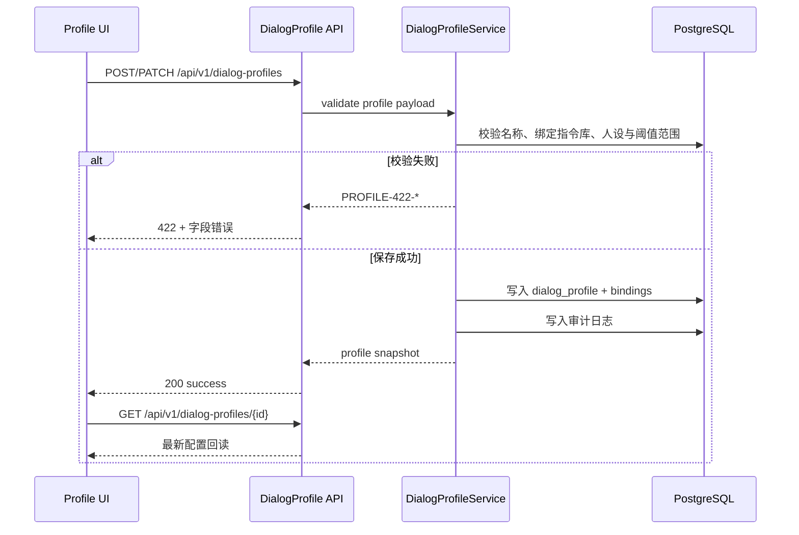
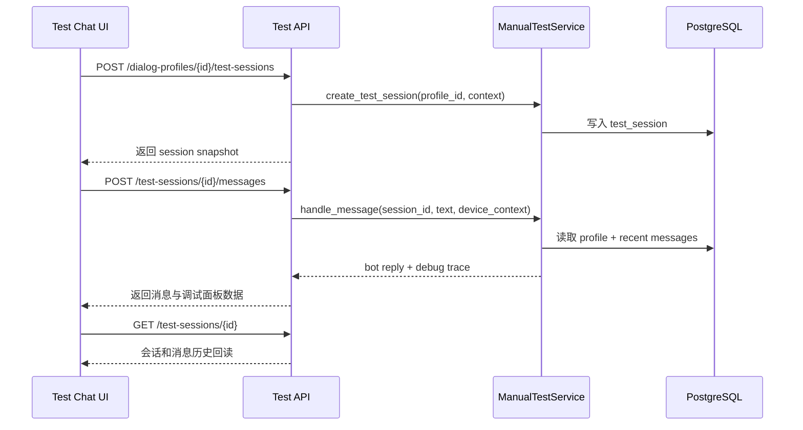
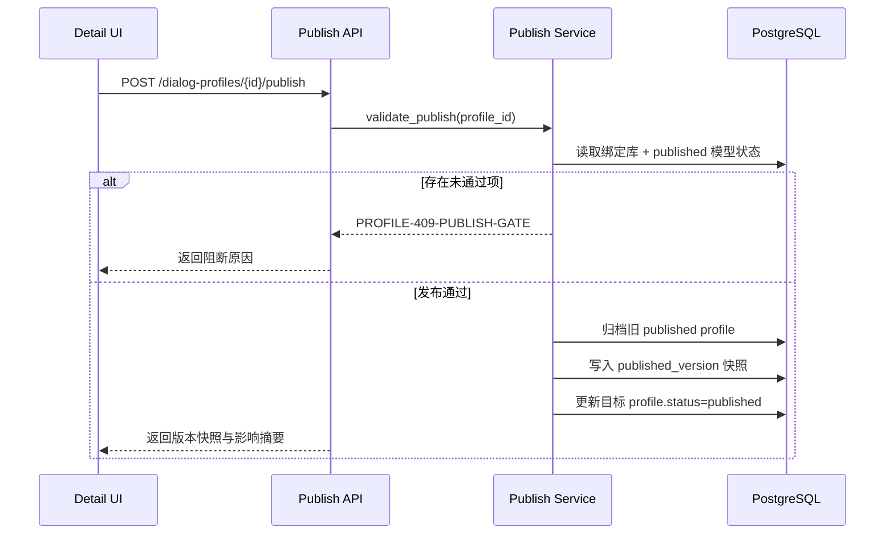

# 对话方案模块架构设计

## 1. 模块职责与边界

| 子模块 | 职责 | 不负责 |
|--------|------|--------|
| `profile directory` | 方案列表、创建、编辑、状态可见性、发布入口 | 批量测试报告生成 |
| `profile detail` | 大模型选型、人设配置、指令库绑定、阈值配置、发布门禁 | 指令库模型训练本身 |
| `manual test chat` | 单条对话测试、会话隔离、设备上下文模拟、调试面板 | 真正的生产对话 API 网关 |
| `publish guard` | 发布前校验、版本快照、唯一 published 方案切换 | 设备端实际热更新实现 |

## 2. 模块关系与调用

| 调用方 | 被调方 | 通信方式 | 同步/异步 | 失败策略 |
|--------|--------|---------|----------|---------|
| `frontend/modules/dialog-profile` | `GET /api/v1/dialog-profiles` | REST | 同步 | 保留当前筛选和列表状态，显示错误提示 |
| `frontend/modules/dialog-profile` | `POST /api/v1/dialog-profiles` | REST | 同步 | 弹窗保留输入并回显字段错误 |
| `frontend/modules/dialog-profile` | `PATCH /api/v1/dialog-profiles/{id}` | REST | 同步 | 保存失败时保持详情表单脏状态 |
| `frontend/modules/dialog-profile` | `POST /api/v1/dialog-profiles/{id}/publish` | REST | 同步 | 返回门禁失败项并阻断发布 |
| `frontend/modules/dialog-profile` | `POST /api/v1/dialog-profiles/{id}/test-sessions` | REST | 同步 | 会话创建失败时不落假会话 |
| `frontend/modules/dialog-profile` | `POST /api/v1/test-sessions/{id}/messages` | REST | 同步 | 消息失败时返回真实错误，不插入假机器人回复 |
| `dialog profile service` | `intent library service` | 领域读取 | 同步 | 若绑定库无 published 模型则发布门禁失败 |
| `dialog profile service` | `knowledge base service` | 领域读取 | 同步 | 仅校验绑定对象存在，不生成知识答案 |

## 3. 核心数据流

### 3.1 方案创建与编辑闭环

**触发点**: PM 提交“新建方案”或“编辑基本信息”  
**涉及模块**: 方案列表页、详情页、API 层、DialogProfileService、PostgreSQL  
**对应 FR**: FR-007, FR-008, FR-040

### 3.2 手动测试闭环

**触发点**: PM 创建测试会话并发送消息  
**涉及模块**: 手动测试页、API 层、ManualTestService、PostgreSQL  
**对应 FR**: FR-009, FR-010, FR-011

### 3.3 发布闭环

**触发点**: PM 在详情页点击“发布”  
**涉及模块**: 详情页、API 层、PublishGuard、PostgreSQL  
**对应 FR**: FR-015, FR-016, FR-047

## 4. 接口契约

### 4.1 `GET /api/v1/dialog-profiles`

- **能力点**: `profile_read`
- **输入**: 可选 `status`, `search`
- **输出**: 方案列表、状态统计、当前 published 方案摘要

### 4.2 `POST /api/v1/dialog-profiles`

- **能力点**: `profile_write`
- **输入**: `name/llm_model/routing_strategy/persona_name/session_timeout/intent_threshold/library_ids`
- **约束**:
  - `intent_threshold` 必须在 `0~1`
  - `session_timeout` 必须在 `1~60`
  - 指令库可为空，但空方案不可发布

### 4.3 `GET /api/v1/dialog-profiles/{profile_id}`

- **能力点**: `profile_read`
- **输出**: 详情配置、绑定库信息、人设信息、发布历史

### 4.4 `PATCH /api/v1/dialog-profiles/{profile_id}`

- **能力点**: `profile_write`
- **输入**: 同创建接口
- **输出**: 最新方案快照

### 4.5 `POST /api/v1/dialog-profiles/{profile_id}/publish`

- **能力点**: `profile_publish`
- **输出**: 发布结果、版本号、影响设备/会话摘要、门禁检查项

### 4.6 `POST /api/v1/dialog-profiles/{profile_id}/test-sessions`

- **能力点**: `profile_read`
- **输入**: `name`, `device_context`
- **输出**: 测试会话快照与初始上下文

### 4.7 `GET /api/v1/test-sessions/{session_id}`

- **能力点**: `profile_read`
- **输出**: 会话信息、消息历史、当前设备上下文

### 4.8 `POST /api/v1/test-sessions/{session_id}/messages`

- **能力点**: `profile_read`
- **输入**: `text`, `device_context`
- **输出**: 用户消息、机器人回复、debug trace、response_time_ms

## 5. 浏览器阶段与验证重点

| probe | 页面动作 | 真实成功信号 |
|-------|---------|-------------|
| `profile_publish_gate` | 尝试发布绑定未发布库的方案 | 明确返回门禁失败项并阻断 |
| `manual_test_trace` | 测试页发送消息 | 返回路由、意图、槽位、响应耗时与模型来源 |
| `session_isolation` | 创建两个测试会话并分别发送消息 | 消息历史彼此隔离 |

## 6. FR 追溯

| FR | 需求 | 设计落实 |
|----|------|---------|
| FR-007 | 方案创建与管理 | 列表/详情接口与配置闭环 |
| FR-008 | 人设自定义 | 人设字段与详情配置 |
| FR-009 | 手动测试与会话隔离 | `test_session` 与消息接口 |
| FR-010 | 调试信息展示 | debug trace 契约 |
| FR-011 | 模拟设备上下文 | `device_context` 输入与回读 |
| FR-015 | 版本发布 | 发布接口与 `published_version` 快照 |
| FR-016 | 发布后切换生效 | 发布影响摘要与会话重置提示 |
| FR-040 | 并行绑定指令库与阈值 | 配置字段与绑定关系 |
| FR-047 | 发布前校验指令库 published 模型 | publish guard |

## 7. 风险与缓解

| 风险 | 影响 | 缓解 |
|------|------|------|
| 手动测试假成功 | 前端自造回复或调试面板 | 所有消息与 debug trace 必须以后端回读为准 |
| 发布门禁漂移 | 前端允许发布但后端未拦截 | 后端统一执行 `publish guard` |
| 会话隔离失效 | 多会话互相污染上下文 | 以 `session_id` 隔离消息历史 |
| 绑定库状态过期 | 详情页显示与实际 published 状态不一致 | 详情页读取真实库状态快照 |
