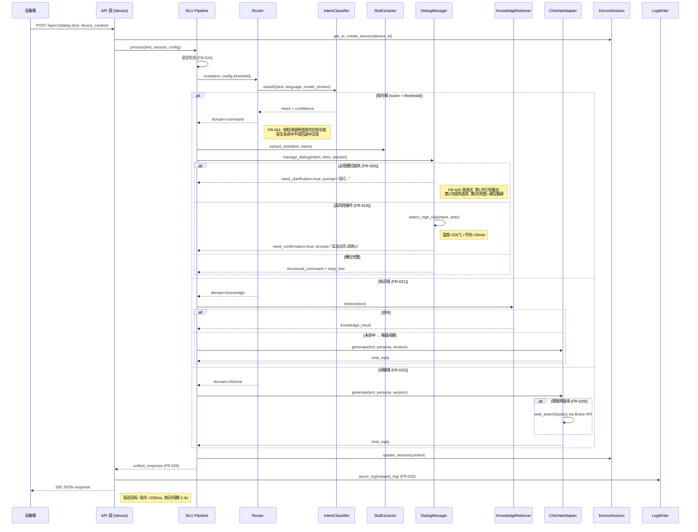
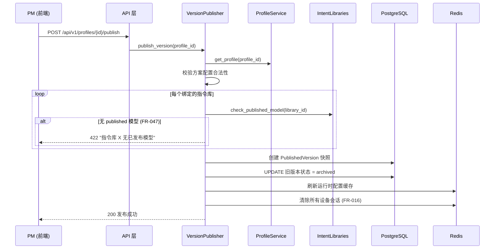

# 架构设计 (AD): SmartChef 智能对话管理平台 — 全局架构

## 1. 领域划分

### 1.1 核心域

```yaml
指令库域 (Intent Library):
  职责: 指令库 CRUD、意图/词槽管理、训练数据集、模型版本生命周期（训练→评估→测试→发布）
  核心实体: [CommandLibrary, LibraryModelVersion, Intent, Slot, TrainingDataset, EvaluationDataset]
  关键流程: [指令库创建, 数据集管理, 模型训练, 模型评估, 单条测试, 批量测试, 模型发布, 模型下载]
  状态机: LibraryModelVersion (draft→training→trained→evaluating→testable→published→archived)
  说明: 单条测试/批量测试是模型质量验证的核心环节，由测试域(支撑域)提供基础设施，但业务入口和流程归属指令库域

对话引擎域 (Conversation Engine):
  职责: NLU 推理管道、对话路由、意图分类、槽位提取、多轮对话管理、指代消解
  核心实体: [DeviceSession]
  关键流程: [文本推理, 多轮对话, 跨域切换, 设备会话管理]
  约束: 指令类延迟 < 200ms (P95), 支持 10 QPS 并发
```

### 1.2 支撑域

```yaml
知识库域 (Knowledge Base):
  职责: 文档上传、解析、向量索引、语义检索
  核心实体: [KnowledgeBase, KnowledgeDocument]
  服务的核心域: [对话引擎域 — 知识路由链路]

对话方案域 (Dialog Profile):
  职责: 方案配置（指令库绑定、阈值、人设、LLM 选型）、版本发布
  核心实体: [DialogProfile, Persona, PublishedVersion]
  服务的核心域: [对话引擎域 — 运行时配置加载]

测试域 (Testing):
  职责: 手动单条测试、批量测试、用例自动生成、智能分析
  核心实体: [TestSuite, TestCase, EvaluationRun]
  服务的核心域: [指令库域 — 模型质量验证]
```

### 1.3 通用域

```yaml
用户认证域 (Auth):
  职责: 登录、JWT Token 管理、角色权限 (RBAC)
  核心实体: [User, Role]
  实现策略: 自研（2-3 人规模，不对接外部账号体系）

监控域 (Monitoring):
  职责: 请求日志、实时指标、告警规则
  核心实体: [RequestLog, AlertRule]
  实现策略: 自研（基于 PostgreSQL + 轮询查询）

基础设施 (Infrastructure):
  职责: 数据库连接池、Redis 缓存、配置管理、日志框架、速率限制
  实现策略: FastAPI 生态组件
```

---

## 2. 模块结构设计

### 2.1 模块关系图

```
                        ┌──────────────────┐
                        │   前端 (React)    │
                        │  Vite + AntD 5    │
                        └────────┬─────────┘
                                 │ REST API (/api/v1/)
                                 ▼
┌────────────────────────────────────────────────────────────┐
│                      API 层 (FastAPI)                      │
│  ┌──────────┐ ┌──────────┐ ┌──────────┐ ┌──────────────┐ │
│  │ auth.py  │ │intents.py│ │profiles  │ │intent_libs   │ │
│  │ users.py │ │knowledge │ │versions  │ │testing/batch │ │
│  │          │ │device.py │ │test.py   │ │monitoring    │ │
│  └────┬─────┘ └────┬─────┘ └────┬─────┘ └──────┬───────┘ │
│       │             │            │               │         │
└───────┼─────────────┼────────────┼───────────────┼─────────┘
        │             │            │               │
        ▼             ▼            ▼               ▼
┌──────────────────────────────────────────────────────────┐
│                    服务层 (Services)                      │
│                                                          │
│  ┌─────────────────┐  ┌──────────────────────────────┐  │
│  │  auth_service    │  │  intent_service              │  │
│  │  profile_service │  │  (CRUD + 训练数据 + 模型)    │  │
│  └─────────────────┘  └──────────────────────────────┘  │
│                                                          │
│  ┌─────────────────┐  ┌──────────────────────────────┐  │
│  │  nlu/            │  │  knowledge/                  │  │
│  │  - pipeline      │  │  - service (上传/解析)       │  │
│  │  - router        │  │  - indexer (向量索引)        │  │
│  │  - classifier    │  │  - retriever (语义检索)      │  │
│  │  - slot_extractor│  └──────────────────────────────┘  │
│  │  - dialog_manager│                                    │
│  │  - response_builder                                   │
│  └─────────────────┘                                     │
│                                                          │
│  ┌─────────────────┐  ┌──────────────────────────────┐  │
│  │  testing/        │  │  monitoring/                 │  │
│  │  - batch_test    │  │  - log_writer (写日志)       │  │
│  │  - manual_test   │  │  - log_query  (查日志)       │  │
│  │  - analyzer      │  │  - metrics    (实时指标)     │  │
│  │  - case_generator│  │  - alerting   (告警)         │  │
│  └─────────────────┘  └──────────────────────────────┘  │
│                                                          │
│  ┌─────────────────┐  ┌──────────────────────────────┐  │
│  │  version/        │  │  chitchat/                   │  │
│  │  - publisher     │  │  - persona                   │  │
│  │  - loader        │  │  - llm_adapter               │  │
│  └─────────────────┘  │  - web_search                │  │
│                        └──────────────────────────────┘  │
└──────────────────────────────────────────────────────────┘
        │              │              │
        ▼              ▼              ▼
┌──────────────┐ ┌──────────┐ ┌──────────────┐
│  PostgreSQL  │ │  Redis   │ │ 外部服务      │
│  16 + pgvector│ │  7.x    │ │ - ZenMux LLM │
│              │ │          │ │ - Brave Search│
└──────────────┘ └──────────┘ └──────────────┘
```

### 2.2 模块职责矩阵

| 模块 | 职责 | 核心实体 | 依赖模块 | 关键技术 | 对应 FR |
|-----|------|---------|---------|---------|---------|
| auth | 登录、Token 管理、RBAC | User, Role | - | JWT, bcrypt | FR-001 |
| intent_service | 指令库 CRUD、意图管理、词槽管理 | CommandLibrary, Intent, Slot | auth (权限) | SQLAlchemy | FR-002,003,039 |
| intent_libraries | 模型版本生命周期、训练、评估 | LibraryModelVersion, Dataset | intent_service | 异步任务 | FR-043~054 |
| profile_service | 对话方案 CRUD、发布门禁 | DialogProfile, Persona | intent_libraries (published 校验) | - | FR-007~011,015~016,040,047 |
| nlu/ | 推理管道：路由→分类→槽位→对话管理 | DeviceSession | version/loader | 小模型推理, Redis 会话 | FR-017~029,041 |
| knowledge/ | 文档上传、解析、索引、检索 | KnowledgeBase | - | pgvector, 向量化 | FR-004~006 |
| testing/ | 批量测试基础设施、智能分析 | TestSuite, EvaluationRun | nlu/, intent_service | LLM 分析 | FR-012~014,051~052 |
| version/ | 版本加载、发布打包 | PublishedVersion | profile, intent_libs | 缓存刷新 | FR-015~016 |
| monitoring/ | 请求日志、指标聚合、告警 | RequestLog, AlertRule | - | 结构化日志 | FR-030~035,038 |
| chitchat/ | 人设管理、LLM 调用、联网搜索 | Persona | - | OpenAI API, Brave | FR-008,022,029 |

### 2.3 模块间通信方式

| 调用方 | 被调方 | 通信方式 | 同步/异步 | 失败策略 |
|--------|--------|---------|----------|---------|
| API 层 | 服务层 | 函数调用 | 同步 | 异常冒泡 + 统一错误处理 |
| nlu/pipeline | nlu/router, classifier, slot_extractor | 函数调用 (管道) | 同步 | 管道中断 + 降级响应 |
| nlu/pipeline | version/loader | 函数调用 | 同步 | 缓存兜底 (旧版本) |
| testing/batch_test | nlu/pipeline | 循环调用 | 同步 (逐条) | 单条失败标记 skip |
| version/publisher | intent_libraries | 函数调用 | 同步 | 事务回滚 |
| chitchat/llm_adapter | ZenMux API | HTTP | 同步 (streaming) | 首字符超时 8s + 降级回复（语音对话场景不可超 8s） |
| chitchat/web_search | Brave Search API | HTTP | 同步 | 超时 5s + "暂无结果" |
| monitoring/log_writer | PostgreSQL | 异步写入 | 异步 (后台任务) | 批量缓冲 + 重试 |

---

## 3. 核心跨模块数据流

### 3.1 对话推理流程（对话引擎域核心流程）

**对应 FR**: FR-017~026
**涉及模块**: nlu/, chitchat/, knowledge/, session/



**FR-020 渐进式多轮澄清策略** (DialogManager 实现):

| 轮次 | 策略 | 示例 |
|------|------|------|
| 第 1 次 | 引导重述 — 针对缺失槽位提出开放式问题 | "请问您想设置多少度？" |
| 第 2 次 | 提供选项 — 列出 top-3 常见值供快速选择 | "请选择: 180°C / 200°C / 230°C" |
| 第 3 次 | 兜底 + 建议触屏 — 话术兜底并提示用户通过屏幕操作 | "抱歉没听清，请在屏幕上选择温度" |

> 超过 3 轮仍未获取到必填槽位，DialogManager 终止当前意图并 reset 会话状态。详细实现参见 DD 层。

### 3.2 版本发布流程

**对应 FR**: FR-015~016, FR-047



---

## 4. 接口契约

### 4.1 API 设计规范

**响应信封** (FR 反馈 P0):

```json
{
  "code": "000000",
  "data": {},
  "msg": "success"
}
```

**错误响应**:

```json
{
  "code": "E10201",
  "data": null,
  "msg": "当前状态不允许此操作"
}
```

**分页请求** (Query):

| 参数 | 类型 | 默认值 | 说明 |
|------|------|--------|------|
| page | int | 1 | 页码 |
| page_size | int | 20 | 每页条数, max=100 |
| sort_by | string | created_at | 排序字段 (各模块默认为实体主时间字段，如 updated_at / timestamp) |
| sort_order | string | desc | asc/desc |

**分页响应**:

```json
{
  "code": "000000",
  "data": {
    "items": [],
    "total": 100,
    "page": 1,
    "page_size": 20
  }
}
```

### 4.2 对话 API (设备端)

| 方法 | 路径 | 说明 | 对应 FR |
|------|------|------|---------|
| POST | /api/v1/dialog | 对话推理 | FR-017~026 |

**请求**:

```json
{
  "text": "string, 必填, max 500",
  "device_id": "string, 必填",
  "session_id": "string, 可选 (自动创建)",
  "device_context": {
    "cooking_status": "string, 可选",
    "door_status": "string, 可选",
    "current_temp": "number, 可选",
    "current_page": "string, 可选",
    "screen_info": "object, 可选"
  }
}
```

**响应** (统一格式, FR-026):

```json
{
  "code": "000000",
  "data": {
    "domain": "command|knowledge|chitchat",
    "intent": "string, 仅 command 域",
    "slots": [{"name": "string", "value": "string"}],
    "reply_text": "string",
    "confidence": 0.95,
    "session_id": "string",
    "need_clarification": false,
    "latency_ms": 150
  }
}
```

### 4.3 其他模块 API (概要)

> 各模块完整 API 契约详见对应的 `ad-<module>.md` 文档。

| 模块 | 路径前缀 | 核心操作 | 对应 FR | 详细文档 |
|------|---------|---------|---------|---------|
| 指令库 | /api/v1/intent-libraries | CRUD + 模型版本 + 数据集 + 训练 + 测试 | FR-002,003,039~054 | ad-intent-library.md |
| 知识库 | /api/v1/knowledge | CRUD + 上传文档 + 搜索 | FR-004~006 | ad-knowledge-base.md |
| 对话方案 | /api/v1/profiles | CRUD + 发布 + 手动测试 | FR-007~011,015~016,040,047 | ad-dialog-profile.md |
| 用户管理 | /api/v1/users | CRUD + 角色分配 | FR-001 | ad-user-mgmt.md |
| 监控 | /api/v1/monitoring | 指标查询 + 设备日志 + 告警规则 | FR-030~035,038 | ad-monitoring.md |
| 批量测试 | /api/v1/batch-tests | 创建任务 + 上传用例 + 查看报告 | FR-012~014 | ad-batch-test.md |
| 版本 | /api/v1/versions | 发布 + 历史 + 回滚 | FR-015~016 | ad-dialog-profile.md |

---

## 5. 技术选型与约束

### 5.1 技术栈

| 层级 | 技术 | 版本 | 选型理由 |
|-----|------|------|---------|
| 前端 | React + Vite + Ant Design 5 + Zustand | React 18 | 生态成熟，团队熟悉，JS 无 TS |
| 后端 | FastAPI + Pydantic v2 + SQLAlchemy async | FastAPI 0.10x | 高性能异步，自动 OpenAPI 文档 |
| 数据库 | PostgreSQL + pgvector | 16.x | JSON 支持 + 向量检索 (知识库) |
| 缓存 | Redis | 7.x | 设备会话存储 + 运行时配置缓存 |
| 大模型 | ZenMux API (OpenAI 兼容) | - | 统一网关，支持多模型切换 |
| 搜索 | Brave Search API | - | 联网内容查询 (天气/新闻) |
| 小模型训练 | PyTorch + HuggingFace Transformers | 2.x / 4.x | BERT 生态成熟，ONNX 导出原生支持 |
| 小模型推理 (服务端) | ONNX Runtime (Python) | 1.17+ | CPU 推理，免 GPU 依赖，用于在线对话和测试 |
| 小模型推理 (设备端) | TensorRT (C++) / ONNX Runtime (C++) | 8.x / 1.17+ | FP16 加速，Jetson Nano GPU 推理 < 50ms |
| 模型格式 | ONNX (通用) + TensorRT .engine (设备专用) | opset 14 | 平台无关分发，设备端性能优化 |
| 测试 | pytest + httpx / Vitest + Playwright | - | 章程 TDD 要求 |
| 迁移 | Alembic | - | SQLAlchemy 配套 |

### 5.2 性能目标

| 指标 | 目标值 | 测量方法 | 对应 SC |
|-----|--------|---------|---------|
| 指令推理延迟 | P95 < 200ms | APM + 请求日志 | SC-002 |
| 知识/闲聊延迟 | P95 < 4s | APM + 请求日志 | SC-003 |
| API 并发 | 10 QPS | 压测 | SC-006 |
| 数据库连接 | < 50 | 连接池监控 | - |
| 小模型内存 | < 1.5GB | Jetson Nano 实测 | SC-010 |

### 5.3 安全约束

- **认证**: JWT Bearer Token (self-signed, 无外部 IdP)
- **授权**: RBAC — 能力点(permission)为粒度，不绑定角色名 (FR-053)
- **传输**: HTTPS (Nginx 终止 TLS)
- **存储**: AES-256 加密对话历史 + 知识库文档 (FR-036)
- **数据管理**: GDPR 合规导出/删除 API (FR-037)

### 5.4 部署架构

```
┌─────────────────────────────────────────────────────┐
│  Docker Compose (开发/生产统一)                      │
│                                                     │
│  ┌───────────────┐  ┌────────────────┐             │
│  │  Nginx        │  │  FastAPI       │             │
│  │  (前端静态 +  │──│  (Uvicorn      │             │
│  │   API 反代)   │  │   workers=4)   │             │
│  └───────────────┘  └───────┬────────┘             │
│                              │                      │
│  ┌───────────────┐  ┌───────┴────────┐             │
│  │  PostgreSQL   │  │  Redis         │             │
│  │  16 + pgvector│  │  7.x           │             │
│  └───────────────┘  └────────────────┘             │
└─────────────────────────────────────────────────────┘
         │
         ▼ (模型下载)
┌────────────────────────────┐
│  Jetson Nano (设备端)      │
│  C++ 推理引擎 + ONNX 模型  │
└────────────────────────────┘
```

---

## 6. 横切关注点

### 6.1 统一错误处理

```python
@app.exception_handler(BusinessException)
async def business_exception_handler(request, exc):
    return JSONResponse({"code": exc.code, "data": None, "msg": exc.message})
```

### 6.2 请求日志 (FR-033)

每次 /api/v1/dialog 请求异步写入 request_log 表:
- request_id, device_id, session_id, input_text
- route_result, route_confidence, intent, intent_confidence, slots
- knowledge_hit (doc_name, category, score), reference_resolution (pronoun, resolved)
- response_text, latency_ms, timestamp, status, device_context_snapshot

### 6.3 速率限制

- /api/v1/dialog: 10 QPS per device_id (Redis 滑动窗口)
- 后台管理 API: 100 req/min per user (Token Bucket)

---

## 7. 需求追溯矩阵

| FR 编号 | 需求摘要 | AD 文档 | 涉及模块 | 覆盖状态 |
|---------|---------|---------|---------|---------|
| FR-001 | 角色权限管理 | ad-user-mgmt.md | auth | ✅ 完整 |
| FR-002,003 | 指令 CRUD + 训练数据 | ad-intent-library.md | intent_service | ✅ 完整 |
| FR-004~006 | 知识库管理 | ad-knowledge-base.md | knowledge/ | ✅ 完整 |
| FR-007~011 | 对话方案配置+手动测试 | ad-dialog-profile.md | profile_service | ✅ 完整 |
| FR-012~014 | 批量测试+智能分析 | ad-batch-test.md | testing/ | ✅ 完整 |
| FR-015~016 | 版本发布 | ad-global.md §3.2 + ad-dialog-profile.md | version/ | ✅ 完整 |
| FR-017~024,026 | 对话推理 API | ad-global.md §3.1 + §4.2 | nlu/ | ✅ 完整 |
| FR-025 | 英文训练数据基于中文翻译 | ad-intent-library.md §4 | intent_service | ✅ 完整 |
| FR-027 | 小模型推理 | ad-intent-library.md §4 | nlu/, intent_libraries | ✅ 完整 |
| FR-028~029 | 大模型 + 联网搜索 | ad-global.md §3.1 + §5.1 | chitchat/ | ✅ 完整 |
| FR-030~035,038 | 监控与日志 | ad-monitoring.md | monitoring/ | ✅ 完整 |
| FR-036~037 | 安全与隐私 | ad-global.md §5.3 | 全局 | ✅ 完整 |
| FR-039 | 指令库基础 CRUD | ad-intent-library.md | intent_service | ✅ 完整 |
| FR-040 | 方案并行绑定指令库+阈值 | ad-dialog-profile.md §3.5 | profile_service | ✅ 完整 |
| FR-041 | 运行时语言检测+不回退 | ad-global.md §3.1 | nlu/router | ✅ 完整 |
| FR-042 | 存量迁移策略 | ad-intent-library.md | intent_service | ✅ 完整 |
| FR-043~046 | 模型生命周期 | ad-intent-library.md | intent_libraries | ✅ 完整 |
| FR-047 | 发布门禁校验 | ad-dialog-profile.md §2.4 + §3.4 | profile_service | ✅ 完整 |
| FR-048~049 | 数据集 + 意图/词槽/实体管理 | ad-intent-library.md | intent_service | ✅ 完整 |
| FR-050~052 | 模型测试 + 智能分析 | ad-intent-library.md | testing/ | ✅ 完整 |
| FR-053 | 权限控制 | ad-intent-library.md + ad-user-mgmt.md | auth, intent_libraries | ✅ 完整 |
| FR-054 | 模型产物下载 | ad-intent-library.md | intent_libraries | ✅ 完整 |

---

## 8. 风险与缓解策略

| 风险 | 影响 | 可能性 | 缓解策略 | 对应 |
|-----|------|--------|---------|------|
| 小模型推理延迟超标 | 高 | 中 | 模型量化 (FP16/INT8) + ONNX Runtime 优化 + 推理预加载 | SC-002 |
| LLM 外部服务不稳定 | 中 | 中 | ZenMux 多模型 fallback + 首字符超时 8s + 降级回复 | FR-022 |
| pgvector 检索性能 | 中 | 低 | HNSW 索引 + 限制返回 top_k=5 | FR-004 |
| 并发会话状态冲突 | 中 | 低 | Redis 原子操作 + device_id 隔离 | SC-006 |
| 模型训练耗时长 | 低 | 高 | 异步任务 + 进度轮询 + 2h 超时保护 + checkpoint 断点续训 | FR-044 |
| 训练 GPU 资源不足 | 中 | 中 | 串行训练队列 + 互斥锁 + 未来扩展至 Celery + GPU 池 | FR-043 |
| 设备端模型热加载失败 | 中 | 低 | 新模型校验通过后替换，失败保留旧模型运行 | FR-054 |
| ONNX→TensorRT 转换兼容性 | 中 | 中 | 限定 opset 14, 持续集成中做转换验证 | FR-054 |

---

## 9. 产出物合规检查表 (vs ad-template.md v2.0)

| 模板条款 | 状态 | 说明 |
|---------|------|------|
| §2.1 模块自治 | ✅ | 模块间通过 API/函数调用通信，无直接跨库查询 |
| §2.2 契约先行 | ✅ | 所有模块 API 完整契约已在各 `ad-<module>.md` 中定义 |
| §2.3 数据流驱动 | ✅ | 核心流程有 Mermaid 序列图 (对话推理、版本发布 in ad-global; 模型生命周期、模型测试 in ad-intent-library) |
| §2.5 安全作为约束 | ✅ | §5.3 认证/授权/加密/GDPR |
| §5 数据流含异常分支 | ✅ | 模型超限、权限校验、发布门禁均含异常分支 |
| §6.1 响应信封统一 | ✅ | code/data/msg 统一格式 |
| §7.3 追溯矩阵 | ✅ | 54 个 FR 全部映射至具体 `ad-<module>.md`，全量覆盖 |
| §8.5 特定技术领域 | ✅ | ad-intent-library.md §4 小模型训练/推理架构完整 |
| §10.3 API 完整性 | ✅ | 各模块 API 契约在独立文档中完整定义 |

---

## 10. 验收检查清单

- [x] 每个 FR 都映射到具体模块和 `ad-<module>.md` 文档 (§7)
- [x] 模块关系图完整，无循环依赖 (§2.1)
- [x] 模块间通信方式已明确 (§2.3)
- [x] 核心跨模块流程有 Mermaid 数据流图 (§3.1 对话推理, §3.2 版本发布)
- [x] 数据流图包含异常分支
- [x] 对话 API 有完整契约 (§4.2)
- [x] 响应信封格式统一 (§4.1)
- [x] 技术选型有理由 (§5.1)
- [x] 性能目标可量化 (§5.2)
- [x] 安全约束在架构层面已确定 (§5.3)
- [x] 知识库/对话方案/监控/批量测试/用户管理模块详细数据流已在各 `ad-<module>.md`完成
- [x] 指令库模块详细数据流 + API 契约 + 训练架构已在 ad-intent-library.md 完成
