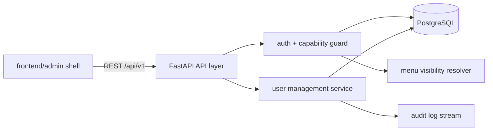
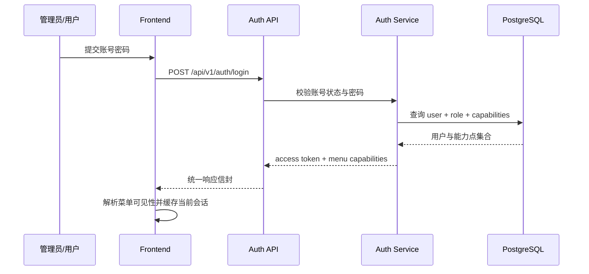

# 全局架构设计

## 1. 目标与边界

- 采用仓库根目录单体工程：`backend/` 承载 API 与领域服务，`frontend/` 承载后台管理 UI
- 本地开发数据库固定接入 PostgreSQL，默认口径为 `smartchef:smartchef@127.0.0.1:5432/smartchef`
- 所有业务模块共享一套认证、能力点校验、响应信封、审计日志与菜单配置模型
- `pd-user-mgmt` 作为首发模块，负责给后续模块提供账号、角色与能力点基线

## 2. 模块关系图



## 3. 全局职责矩阵

| 模块 | 职责 | 核心实体/对象 | 依赖 | 对应 FR |
|------|------|--------------|------|---------|
| `frontend/app` | 提供后台菜单壳、路由与模块入口 | menu item, route state | `frontend/modules/*` | FR-001 及后续 UI FR |
| `backend/app/api` | 暴露 `/api/v1` 契约，统一参数校验与响应信封 | request/response envelope | `backend/app/services/*` | FR-001 |
| `backend/app/services/auth` | 登录、Token 解析、能力点校验 | session principal | PostgreSQL | FR-001 |
| `backend/app/services/user_mgmt` | 用户、角色、权限矩阵、重置密码、启停用 | user, role, capability | PostgreSQL | FR-001 |
| `backend/app/services/audit` | 记录账号创建、角色变更、密码重置、账号禁用 | audit record | PostgreSQL / stdout | FR-001 |

## 4. 共享技术约束

| 维度 | 决策 |
|------|------|
| 后端框架 | FastAPI + Pydantic Settings + SQLAlchemy 2.x |
| 前端框架 | React 18 + Vite 7 + Ant Design 5 |
| 数据库 | PostgreSQL，后续环境仅替换连接地址，不改抽象层 |
| 授权模型 | Capability-based RBAC，禁止直接 `if role == admin` |
| 响应信封 | `code/message/data/request_id/timestamp` 统一返回 |
| 菜单控制 | 前端根据 capability 计算可见性，后端再次校验 API 能力点 |

## 5. 共享数据流

### 5.1 登录后菜单解析

**触发点**: 用户登录后台  
**涉及模块**: `frontend/app`、`backend/app/services/auth`、`backend/app/services/user_mgmt`  
**对应 FR**: FR-001



## 6. 全局接口约定

### 6.1 响应信封

```json
{
  "code": "000000",
  "message": "success",
  "data": {},
  "request_id": "uuid",
  "timestamp": "2026-03-30T00:00:00Z"
}
```

### 6.2 错误语义

| 错误码 | 场景 | HTTP 状态 |
|--------|------|-----------|
| `AUTH-401` | 未登录或 Token 失效 | 401 |
| `AUTH-403` | 缺少目标 capability | 403 |
| `USER-409` | 用户名重复、最后一个管理员保护失败 | 409 |
| `USER-422` | 参数不合法、角色不合法 | 422 |
| `USER-404` | 目标用户不存在 | 404 |

## 7. 共享安全与可观测性

- 所有用户管理写操作必须写入审计日志：操作者、目标用户、变更前后摘要、request_id
- 禁用账号与角色变更会使旧 Token 失效，强制重新登录后拿到新 capability 集合
- 默认管理员账号始终存在，系统强制至少保留一个启用中的管理员

## 8. 风险与缓解

| 风险 | 说明 | 缓解策略 |
|------|------|---------|
| Token 与角色漂移 | 角色变更后旧会话仍带旧权限 | 角色变更/禁用后提升 token version，并在认证中间件校验 |
| 固定默认密码风险 | 重置密码初期仍沿用固定口令 | 首版保留固定默认值以贴合 PD，同时强制返回“需立即修改密码”提示并写审计日志 |
| 菜单与 API 不一致 | 前端隐藏了菜单但后端未校验 | 所有写接口都绑定 capability guard，浏览器 smoke 校验菜单可见性 |
