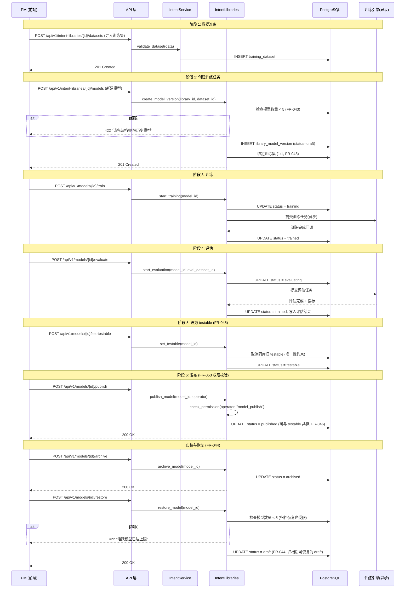
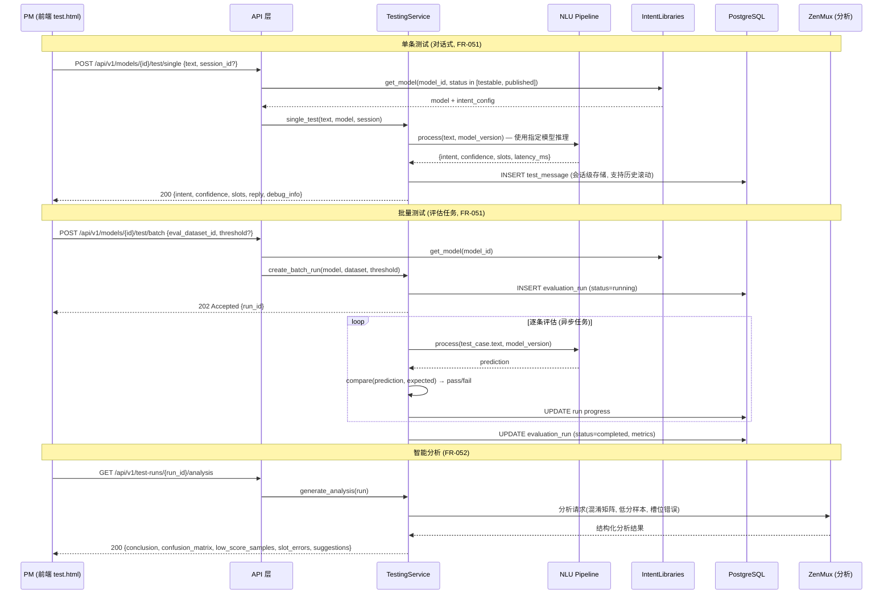

# 架构设计 (AD): 指令库管理模块

## 1. 模块概述

指令库管理模块是 SmartChef 平台的核心域之一，负责从指令库创建、数据管理到模型训练推理的完整生命周期。

**核心职责**:
- 指令库 CRUD 与基础配置管理
- 意图、词槽、实体的结构化数据管理
- 训练数据集与评估数据集管理（创建、导入/导出、LLM 生成）
- 模型版本全生命周期：draft → training → trained ⇄ evaluating → testable → published → archived → (可恢复至 draft)
- 模型质量验证：单条测试（对话式）、批量测试（评估任务）、智能分析
- 模型产物打包与下载（ONNX / TensorRT，平台无关分发）

**核心实体**: CommandLibrary, LibraryModelVersion, Intent, Slot, TrainingDataset, EvaluationDataset

**关键约束**:
- 每个指令库最多 5 个模型版本（FR-043）
- 同一指令库内 testable 状态唯一（FR-045），published 可与 testable 共存（FR-046）
- 模型发布需 `model_publish` 权限（FR-053）
- 发布门禁：对话方案发布时校验绑定的指令库必须有 published 模型（FR-047）
- 归档后可恢复为 draft（FR-044），恢复时也受 5 个版本上限约束
- 评估可多轮执行：evaluating → trained（回写评估结果），再可进入下一轮评估或晋升为 testable

**PD 页面**: detail.html, datasets.html, dataset-detail.html, test.html, index.html, model-download.html

---

## 2. 核心数据流

### 2.1 指令库模型生命周期

**对应 FR**: FR-043~054
**PD 页面**: detail.html, datasets.html, dataset-detail.html, test.html



### 2.2 模型测试流程（质量验证环节）

**对应 FR**: FR-050~052
**PD 页面**: test.html（单条测试 Tab + 批量测试 Tab）



**阈值策略** (FR-050):
- 每个指令库有「库级默认阈值」，批量测试时可在任务级覆盖
- 单条测试使用库级阈值，前端 Debug 面板展示置信度颜色编码

---

## 3. 接口契约

### 3.1 指令库 CRUD

| 方法 | 路径 | 说明 | 权限 | 对应 FR |
|------|------|------|------|---------|
| GET | /api/v1/intent-libraries | 指令库列表 (分页+筛选) | intent_library_read | FR-039 |
| POST | /api/v1/intent-libraries | 创建指令库 | intent_library_create | FR-039 |
| GET | /api/v1/intent-libraries/{id} | 指令库详情 | intent_library_read | FR-039 |
| PUT | /api/v1/intent-libraries/{id} | 更新指令库 | intent_library_update | FR-039 |
| DELETE | /api/v1/intent-libraries/{id} | 删除指令库 | intent_library_delete | FR-039 |

**创建指令库请求**:

```json
{
  "name": "string, 必填, max 100",
  "library_key": "string, 必填, 全局唯一, 创建后不可修改 (FR-039)",
  "language": "string, 必填, enum: zh/en",
  "description": "string, 可选, max 500"
}
```

### 3.2 模型版本管理

| 方法 | 路径 | 说明 | 权限 | 对应 FR |
|------|------|------|------|---------|
| GET | /api/v1/intent-libraries/{lib_id}/models | 模型版本列表 | intent_library_read | FR-043 |
| POST | /api/v1/intent-libraries/{lib_id}/models | 新建模型(绑定训练集) | model_train | FR-043,048 |
| POST | /api/v1/models/{id}/train | 启动训练 | model_train | FR-044 |
| POST | /api/v1/models/{id}/evaluate | 启动评估 | model_train | FR-044 |
| POST | /api/v1/models/{id}/set-testable | 设为测试态 | model_test_manage | FR-045,053 |
| POST | /api/v1/models/{id}/publish | 发布模型 | model_publish | FR-044,053 |
| POST | /api/v1/models/{id}/archive | 归档模型 | model_publish | FR-044 |
| POST | /api/v1/models/{id}/restore | 恢复归档模型为 draft | model_train | FR-044 |
| GET | /api/v1/models/{id}/download | 下载模型产物 | model_train | FR-054 |

**状态机约束** (API 层校验):
- 新建: 检查 `count < 5` (FR-043)
- set-testable: 自动取消同库旧 testable (FR-045)
- publish: 需要 `model_publish` 权限 (FR-053)
- 允许同时 testable + published (FR-046)

### 3.3 数据集管理

| 方法 | 路径 | 说明 | 对应 FR |
|------|------|------|---------|
| GET | /api/v1/intent-libraries/{lib_id}/datasets | 数据集列表 (分页+筛选) | FR-048 |
| POST | /api/v1/intent-libraries/{lib_id}/datasets | 创建数据集 | FR-048 |
| GET | /api/v1/datasets/{id} | 数据集详情 | FR-048 |
| PUT | /api/v1/datasets/{id} | 更新数据集元信息 | FR-048 |
| DELETE | /api/v1/datasets/{id} | 删除数据集 | FR-048 |
| POST | /api/v1/datasets/{id}/import | 批量导入训练/评估数据 (Excel/JSON) | FR-049 |
| GET | /api/v1/datasets/{id}/export | 导出数据集 (Excel/JSON) | FR-049 |
| POST | /api/v1/datasets/{id}/generate-training | LLM 生成训练集 (自定义 prompt) | FR-048 |
| POST | /api/v1/datasets/{id}/generate-evaluation | LLM 生成评估集 (自定义 prompt) | FR-048 |

**批量导入请求**:

```json
{
  "file": "multipart/form-data, 必填, .xlsx/.json",
  "type": "string, 必填, enum: training/evaluation",
  "overwrite": "boolean, 可选, 默认 false (追加模式)"
}
```

**导出请求** (Query):

| 参数 | 类型 | 必填 | 说明 |
|------|------|------|------|
| format | string | 否 | 导出格式: excel/json, 默认 excel |
| scope | string | 否 | 导出范围: all/intents_only/slots_only, 默认 all |

### 3.4 意图管理 (数据集内)

| 方法 | 路径 | 说明 | 对应 FR |
|------|------|------|---------|
| GET | /api/v1/datasets/{id}/intents | 意图列表 (分页+搜索) | FR-049 |
| POST | /api/v1/datasets/{id}/intents | 创建意图 | FR-049 |
| GET | /api/v1/datasets/{id}/intents/{intent_key} | 意图详情 | FR-049 |
| PUT | /api/v1/datasets/{id}/intents/{intent_key} | 更新意图配置 | FR-049 |
| DELETE | /api/v1/datasets/{id}/intents/{intent_key} | 删除意图 | FR-049 |

**创建/更新意图请求**:

```json
{
  "intent_key": "string, 必填, 数据集内唯一",
  "name_zh": "string, 必填, 中文名",
  "description": "string, 可选, 最大 500 字符",
  "slots": ["string, 可选, 引用的词槽 key 列表"],
  "follow_up_enabled": "boolean, 可选, 是否启用追问",
  "follow_up_prompt": "string, 条件必填, follow_up_enabled=true 时的追问话术",
  "hit_responses": ["string, 可选, 命中时返回给用户的话术列表, 支持 {slot} 变量"],
  "miss_response": "string, 可选, 未命中时返回给用户的话术"
}
```

### 3.5 相似问与排除问 (训练数据)

| 方法 | 路径 | 说明 | 对应 FR |
|------|------|------|---------|
| GET | /api/v1/datasets/{ds_id}/intents/{intent_key}/similar-questions | 相似问列表 (正样本) | FR-049 |
| POST | /api/v1/datasets/{ds_id}/intents/{intent_key}/similar-questions | 批量添加相似问 | FR-049 |
| DELETE | /api/v1/datasets/{ds_id}/intents/{intent_key}/similar-questions | 批量删除相似问 | FR-049 |
| GET | /api/v1/datasets/{ds_id}/intents/{intent_key}/negative-examples | 排除问列表 (负样本) | FR-049 |
| POST | /api/v1/datasets/{ds_id}/intents/{intent_key}/negative-examples | 批量添加排除问 | FR-049 |
| DELETE | /api/v1/datasets/{ds_id}/intents/{intent_key}/negative-examples | 批量删除排除问 | FR-049 |

**批量添加相似问/排除问请求**:

```json
{
  "items": [
    "你好，帮我设置温度",
    "温度调到 180 度",
    "..."
  ]
}
```

### 3.6 词槽与实体管理

| 方法 | 路径 | 说明 | 对应 FR |
|------|------|------|---------|
| GET | /api/v1/datasets/{id}/slots | 词槽列表 (含系统词槽 + 自定义词槽) | FR-049 |
| POST | /api/v1/datasets/{id}/slots | 创建自定义词槽 | FR-049 |
| PUT | /api/v1/datasets/{id}/slots/{slot_key} | 更新自定义词槽 | FR-049 |
| DELETE | /api/v1/datasets/{id}/slots/{slot_key} | 删除自定义词槽 | FR-049 |
| GET | /api/v1/datasets/{id}/slots/{slot_key}/entities | 实体值列表 (分页) | FR-049 |
| POST | /api/v1/datasets/{id}/slots/{slot_key}/entities | 批量添加实体值 | FR-049 |
| PUT | /api/v1/datasets/{id}/slots/{slot_key}/entities/{entity_id} | 更新实体值 | FR-049 |
| DELETE | /api/v1/datasets/{id}/slots/{slot_key}/entities | 批量删除实体值 | FR-049 |
| POST | /api/v1/datasets/{id}/slots/{slot_key}/entities/import | 批量导入实体 (Excel/文本) | FR-049 |
| GET | /api/v1/datasets/{id}/slots/{slot_key}/entities/export | 导出实体列表 | FR-049 |
| GET | /api/v1/datasets/{id}/slots/{slot_key}/entities/template | 下载实体导入 Excel 模板 | FR-049 |

**创建自定义词槽请求**:

```json
{
  "slot_key": "string, 必填, 数据集内唯一",
  "name_zh": "string, 必填, 中文名",
  "description": "string, 可选",
  "slot_type": "string, 必填, enum: custom (系统词槽不可创建)",
  "entities": [
    {
      "value": "string, 必填, 实体值",
      "synonyms": ["string, 可选, 同义词列表"]
    }
  ]
}
```

**批量导入实体请求**:

```json
{
  "file": "multipart/form-data, .xlsx/.txt/.csv",
  "mode": "string, 可选, enum: append/overwrite, 默认 append"
}
```

Excel 模板格式: 两列 `entity_value | synonyms`，synonyms 以逗号分隔。
文本导入格式: 一行一个实体值，逗号分隔同义词。

### 3.7 测试 API

#### 3.7.1 测试会话管理

| 方法 | 路径 | 说明 | 对应 FR |
|------|------|------|---------|
| POST | /api/v1/models/{id}/test/sessions | 创建测试会话 | FR-051 |
| GET | /api/v1/models/{id}/test/sessions | 测试会话列表 | FR-051 |
| PUT | /api/v1/models/{id}/test/sessions/{sid} | 重命名会话 | FR-051 |
| DELETE | /api/v1/models/{id}/test/sessions/{sid} | 删除会话 (级联删除消息) | FR-051 |

**创建会话请求**:

```json
{
  "name": "string, 可选, max 100, 默认自动生成 '测试会话 N'"
}
```

**创建会话响应** (201):

```json
{
  "code": "000000",
  "data": {
    "session_id": "uuid",
    "name": "测试会话 3",
    "model_id": "uuid",
    "created_at": "2026-03-18T10:00:00+08:00",
    "message_count": 0
  },
  "msg": "success"
}
```

**会话列表响应**: 按 `updated_at desc` 排序，分页。

**重命名请求**:

```json
{
  "name": "string, 必填, max 100"
}
```

#### 3.7.2 单条测试 (对话式)

| 方法 | 路径 | 说明 | 对应 FR |
|------|------|------|---------|
| POST | /api/v1/models/{id}/test/single | 发送测试消息 | FR-051 |

**请求**:

```json
{
  "text": "string, 必填, 1~500 字符",
  "session_id": "uuid, 可选, 不传则自动创建新会话"
}
```

**响应** (200):

```json
{
  "code": "000000",
  "data": {
    "session_id": "uuid",
    "message_id": "uuid",
    "intent": "set_cooking_temp",
    "confidence": 0.94,
    "slots": [{"name": "number", "value": "180", "type": "temperature"}],
    "reply": "好的，已识别为设置烹饪温度 180°C。",
    "debug_info": {
      "latency_ms": 45,
      "model_version": "v1.2",
      "threshold": 0.7,
      "above_threshold": true
    }
  },
  "msg": "success"
}
```

#### 3.7.3 会话消息历史

| 方法 | 路径 | 说明 | 对应 FR |
|------|------|------|---------|
| GET | /api/v1/models/{id}/test/sessions/{sid}/messages | 消息列表 (游标分页) | FR-051 |
| DELETE | /api/v1/models/{id}/test/sessions/{sid}/messages/{mid} | 删除单条消息 | FR-051 |

**消息列表请求** (Query):

| 参数 | 类型 | 必填 | 默认值 | 说明 |
|------|------|------|--------|------|
| cursor | string | 否 | - | 游标 (上一页最后一条 message_id)，不传返回最新消息 |
| limit | int | 否 | 10 | 每次加载条数, max=50 |

**消息列表响应**: 按 `created_at desc` 排序（最新在前），游标分页支持向上滚动加载历史。

```json
{
  "code": "000000",
  "data": {
    "items": [
      {
        "message_id": "uuid",
        "role": "user",
        "text": "设置温度180度",
        "created_at": "2026-03-18T10:05:00+08:00"
      },
      {
        "message_id": "uuid",
        "role": "assistant",
        "text": "好的，已识别为设置烹饪温度 180°C。",
        "intent": "set_cooking_temp",
        "confidence": 0.94,
        "slots": [{"name": "number", "value": "180"}],
        "latency_ms": 45,
        "created_at": "2026-03-18T10:05:00+08:00"
      }
    ],
    "has_more": true,
    "next_cursor": "msg_xxx"
  },
  "msg": "success"
}
```

#### 3.7.4 批量测试 (评估任务)

| 方法 | 路径 | 说明 | 对应 FR |
|------|------|------|---------|
| POST | /api/v1/models/{id}/test/batch | 创建批量测试任务 | FR-051 |
| GET | /api/v1/test-runs/{run_id} | 测试任务结果 | FR-052 |
| GET | /api/v1/test-runs/{run_id}/analysis | 智能分析报告 | FR-052 |

---

## 4. 小模型训练与推理架构

本节是指令库域的核心技术支撑，覆盖从训练数据到设备端推理的完整链路。

**对应 FR**: FR-027, FR-043~054

### 4.1 整体流水线

```
训练数据 (dataset) → 数据预处理 → 模型训练 → 模型评估 → 模型导出 → 平台部署
                                                                  ├── ONNX (服务端测试/通用设备)
                                                                  └── TensorRT (Jetson Nano)
```

### 4.2 训练框架与模型架构

| 组件 | 技术选型 | 版本 | 选型理由 |
|------|---------|------|---------|
| 训练框架 | PyTorch | 2.x | 生态成熟，动态图调试友好，ONNX 导出原生支持 |
| 意图分类模型 | BERT-base-chinese / DistilBERT | - | 中文语义理解能力强，DistilBERT 用于设备端轻量推理 |
| 槽位提取模型 | BERT + CRF (序列标注) | - | BIO 标注 + CRF 层提升边界识别准确率 |
| 分词 / Tokenizer | HuggingFace Transformers | 4.x | 与模型配套，支持中文 WordPiece |
| 数据增强 | NLPAug / LLM 合成 | - | 小样本场景下扩充训练集 |
| 英文数据生成 | LLM 翻译 (中→英) | - | FR-025: 英文训练数据基于中文数据翻译生成，通过 LLM 合成流程的 translate 模式实现 |
| 实验管理 | MLflow (可选) | - | 训练超参、指标、模型版本追踪 |

### 4.3 训练流水线详细设计

```
┌──────────────────────────────────────────────────────────────────────────┐
│  训练流水线 (异步任务, 后台 Worker)                                       │
│                                                                         │
│  1. 数据预处理                                                           │
│  ┌───────────────────────────────────────────────────────────────────┐   │
│  │  训练集 JSON/Excel                                                │   │
│  │    → 意图标签编码 (intent_key → label_id)                         │   │
│  │    → Tokenize (WordPiece, max_length=128)                         │   │
│  │    → 槽位 BIO 标注转换                                            │   │
│  │    → Train/Val 拆分 (8:2, 按意图分层抽样)                          │   │
│  │    → (英文库) LLM 翻译中文训练数据为英文 (FR-025)                   │   │
│  └───────────────────────────────────────────────────────────────────┘   │
│                                                                         │
│  2. 模型训练                                                            │
│  ┌───────────────────────────────────────────────────────────────────┐   │
│  │  意图分类:                                                        │   │
│  │    BERT → Linear(hidden_size, num_intents) → CrossEntropyLoss     │   │
│  │    学习率: 2e-5, batch_size: 32, epochs: 10~30 (early stopping)   │   │
│  │                                                                    │   │
│  │  槽位提取:                                                         │   │
│  │    BERT → Linear(hidden_size, num_slot_tags) → CRF                │   │
│  │    联合训练: loss = intent_loss * α + slot_loss * (1-α), α=0.6     │   │
│  └───────────────────────────────────────────────────────────────────┘   │
│                                                                         │
│  3. 模型评估                                                            │
│  ┌───────────────────────────────────────────────────────────────────┐   │
│  │  评估指标:                                                         │   │
│  │    - 意图分类: Accuracy, Precision, Recall, F1 (macro/micro)      │   │
│  │    - 槽位提取: Slot F1 (严格匹配)                                  │   │
│  │    - 综合: Intent+Slot 联合准确率                                  │   │
│  │  输出: 混淆矩阵, 低置信度样本列表, 槽位错误分布                      │   │
│  └───────────────────────────────────────────────────────────────────┘   │
│                                                                         │
│  4. 模型导出                                                            │
│  ┌───────────────────────────────────────────────────────────────────┐   │
│  │  PyTorch (.pt)                                                     │   │
│  │    → torch.onnx.export (opset_version=14, dynamic_axes)            │   │
│  │    → ONNX 模型 (.onnx) — 服务端推理 / 通用设备                     │   │
│  │    → (可选) TensorRT 转换: trtexec --onnx=model.onnx --fp16        │   │
│  │       → TensorRT 引擎 (.engine) — Jetson Nano 专用                 │   │
│  │                                                                    │   │
│  │  导出产物打包:                                                      │   │
│  │    model.onnx / model.engine                                       │   │
│  │    + label_map.json (intent_key ↔ label_id)                        │   │
│  │    + slot_map.json (slot_tag ↔ tag_id)                             │   │
│  │    + tokenizer_config (vocab.txt + config)                         │   │
│  │    + metadata.json (训练时间, 数据集版本, 指标快照)                  │   │
│  │    → 打包为 .zip 供下载 (FR-054, 平台无关)                          │   │
│  └───────────────────────────────────────────────────────────────────┘   │
└──────────────────────────────────────────────────────────────────────────┘
```

### 4.4 推理引擎架构

**服务端推理** (用于单条测试、批量评估、在线对话):

| 组件 | 说明 |
|------|------|
| 推理引擎 | ONNX Runtime (Python, CPU) |
| 加载方式 | 模型发布/设为 testable 时预加载到内存 |
| 缓存策略 | Redis 缓存已加载的模型版本 ID → 内存模型对象映射 |
| 并发处理 | 模型推理使用线程池 (max_workers=4, 因 GIL 限制 CPU 推理为串行) |
| 超时保护 | 单次推理超时 500ms，超时返回降级响应 |

**设备端推理** (Jetson Nano / 嵌入式设备):

| 组件 | 说明 |
|------|------|
| 推理引擎 | TensorRT (C++, GPU) / ONNX Runtime (C++, CPU fallback) |
| 模型格式 | .engine (TensorRT FP16) / .onnx (通用 fallback) |
| 内存限制 | 模型 + 运行时 < 1.5GB (Jetson Nano 4GB RAM 共享) |
| 推理延迟 | 意图分类 < 50ms, 槽位提取 < 80ms (TensorRT FP16) |
| 模型更新 | 通过 HTTP 下载 .zip → 本地解压 → 热加载 (无需重启) |
| 多模型管理 | 按指令库隔离, 同时加载 ≤ 3 个模型 (内存受限) |

### 4.5 模型版本与产物管理

```
PostgreSQL:
  library_model_version:
    - model_id, library_id, status, dataset_id
    - train_config (JSON): {lr, batch_size, epochs, base_model}
    - train_metrics (JSON): {accuracy, f1, slot_f1, loss_curve}
    - onnx_path: "models/{library_key}/{model_id}/model.onnx"
    - package_path: "models/{library_key}/{model_id}/package.zip"
    - created_at, trained_at, published_at

文件存储 (本地 / 对象存储):
  models/
    {library_key}/
      {model_id}/
        model.pt            # PyTorch 原始模型
        model.onnx          # ONNX 导出
        model.engine         # TensorRT (训练机器生成)
        label_map.json
        slot_map.json
        tokenizer/
        metadata.json
        package.zip          # 下载用打包文件 (FR-054)
```

### 4.6 训练任务调度

| 场景 | 实现方式 | 说明 |
|------|---------|------|
| 训练任务提交 | FastAPI BackgroundTasks / Celery (按规模选择) | 初期用 BackgroundTasks，任务量大时切 Celery |
| 训练进度通知 | 前端轮询 `GET /api/v1/models/{id}` (status + progress) | 每 5s 轮询，训练中返回 progress 百分比 |
| GPU 资源 | 单 GPU 串行训练（初期），队列化等待 | 训练任务互斥锁，避免 OOM |
| 训练中断恢复 | Checkpoint 保存 (每 epoch) + 恢复训练 | 中断后可从最近 checkpoint 继续 |
| 超时保护 | 单次训练最长 2h，超时自动终止标记 failed | 防止资源泄露 |

---

## 5. 模块级风险

| 风险 | 影响 | 可能性 | 缓解策略 | 对应 |
|-----|------|--------|---------|------|
| 小模型推理延迟超标 | 高 | 中 | 模型量化 (FP16/INT8) + ONNX Runtime 优化 + 推理预加载 | SC-002 |
| 模型训练耗时长 | 低 | 高 | 异步任务 + 进度轮询 + 2h 超时保护 + checkpoint 断点续训 | FR-044 |
| 训练 GPU 资源不足 | 中 | 中 | 串行训练队列 + 互斥锁 + 未来扩展至 Celery + GPU 池 | FR-043 |
| 设备端模型热加载失败 | 中 | 低 | 新模型校验通过后替换，失败保留旧模型运行 | FR-054 |
| ONNX→TensorRT 转换兼容性 | 中 | 中 | 限定 opset 14, 持续集成中做转换验证 | FR-054 |
