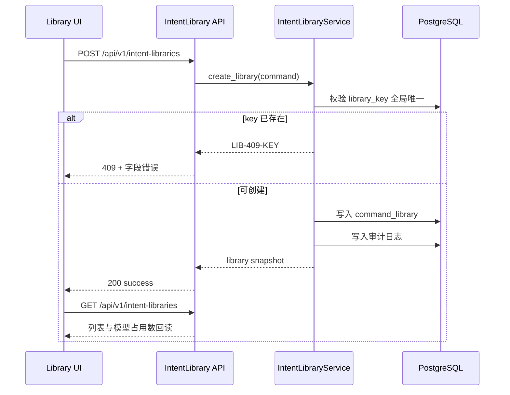
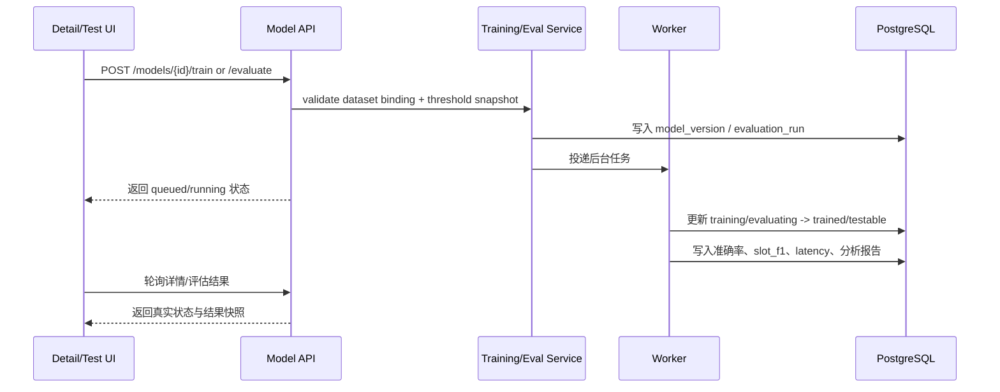
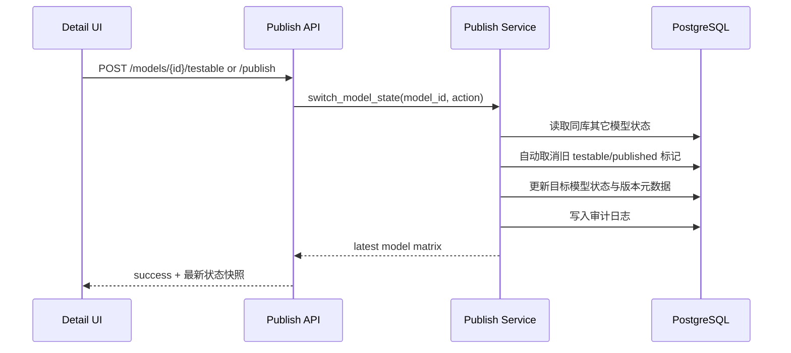

# 指令库管理模块架构设计

## 1. 模块职责与边界

| 子模块 | 职责 | 不负责 |
|--------|------|--------|
| `library directory` | 指令库列表、语种、唯一 `library_key`、模型数量上限提示 | 对话方案绑定逻辑本身 |
| `library detail` | 模型版本列表、状态流转、发布/testable 切换、模型下载 | 设备端实际推理加载 |
| `dataset management` | 训练集/评估集列表、绑定关系、导入方式与样本量可见性 | Excel 解析引擎实现细节 |
| `dataset content` | 意图、槽位、追问、相似问/排除问、实体值维护 | 运行时语言检测 |
| `model testing` | 单条测试、批量评估、阈值快照、智能分析回读 | 对话方案级跨方案横向测试 |

## 2. 条件准入口径

- 本模块允许进入 `AD / DD / plan / tasks`，但仍属于**条件准入**
- 唯一显式例外是 `FR-050`：当前只确认存在“库级默认阈值 + 任务级覆盖入口”，尚未完成“继承/覆盖链路”的完整 UI 呈现
- 因此下游文档必须持续保留 `FR-050 Partial`，不得把阈值继承逻辑误判为已闭环

## 3. 模块关系与调用

| 调用方 | 被调方 | 通信方式 | 同步/异步 | 失败策略 |
|--------|--------|---------|----------|---------|
| `frontend/modules/intent-library` | `GET /api/v1/intent-libraries` | REST | 同步 | 保留当前筛选与分页，显示错误态 |
| `frontend/modules/intent-library` | `POST /api/v1/intent-libraries` | REST | 同步 | 表单保留输入，回显字段错误 |
| `frontend/modules/intent-library` | `POST /api/v1/intent-libraries/{id}/models/train` | REST + background job | 异步 | 明确展示真实排队/失败状态，禁止演示文案假成功 |
| `frontend/modules/intent-library` | `POST /api/v1/models/{id}/evaluate` | REST + background job | 异步 | 任务失败时保留结果快照与错误原因 |
| `frontend/modules/intent-library` | `POST /api/v1/models/{id}/publish` | REST | 同步 | 失败时维持原 published/testable 关系 |
| `intent library service` | `dataset service` | 领域调用 | 同步 | 数据集绑定失败即训练/评估任务创建失败 |
| `intent library service` | `training/evaluation worker` | 后台任务 | 异步 | 状态机与审计日志必须真实回写 |

## 4. 核心数据流

### 4.1 指令库创建闭环

**触发点**: PM 提交“新建指令库”弹窗  
**涉及模块**: 前端列表页、API 层、IntentLibraryService、PostgreSQL  
**对应 FR**: FR-039, FR-043

### 4.2 模型训练与评估闭环

**触发点**: PM 在详情页点击“新建训练”或“批量评估”  
**涉及模块**: 前端详情页/测试页、API 层、TrainingJobService、EvaluationService、PostgreSQL  
**对应 FR**: FR-043, FR-044, FR-048, FR-049, FR-050, FR-052

### 4.3 发布与 testable 唯一性闭环

**触发点**: PM 在模型版本列表执行 `设为 testable` 或 `发布`  
**涉及模块**: 详情页、API 层、PublishGuard、PostgreSQL  
**对应 FR**: FR-045, FR-046, FR-047, FR-053, FR-054

## 5. 接口契约

### 5.1 `GET /api/v1/intent-libraries`

- **能力点**: `intent_library_read`
- **输入**: `language/status/page/page_size`
- **输出**: 指令库列表、模型数量、published/testable 摘要

### 5.2 `POST /api/v1/intent-libraries`

- **能力点**: `intent_library_write`
- **输入**: `library_key/name/language/description/default_thresholds`
- **约束**:
  - `library_key` 全局唯一且创建后不可修改
  - 语言固定 `zh/en`
  - `default_thresholds` 只定义库级默认值，不等价于任务级覆盖快照

### 5.3 `GET /api/v1/intent-libraries/{library_id}`

- **能力点**: `intent_library_read`
- **输出**: 指令库详情、模型版本列表、状态机说明、数据集绑定摘要、阈值默认值

### 5.4 `POST /api/v1/intent-libraries/{library_id}/datasets`

- **能力点**: `intent_library_write`
- **输入**: `dataset_type(training/evaluation)`、来源(`manual/llm/import`)与字段映射
- **输出**: 数据集记录与绑定状态

### 5.5 `POST /api/v1/models/{model_id}/train`

- **能力点**: `model_train`
- **输入**: `training_dataset_id`、可选超参与说明
- **输出**: `draft -> training` 真实任务状态
- **失败语义**: 模型数量超限、训练集 1:1 绑定冲突、数据集为空、任务投递失败

### 5.6 `POST /api/v1/models/{model_id}/evaluate`

- **能力点**: `model_test_manage`
- **输入**:
  - `evaluation_dataset_id`
  - `threshold_override`
- **输出**:
  - 任务状态
  - `threshold_snapshot`
  - 评估结果引用
- **FR-050 约束**:
  - 允许任务级单次覆盖
  - 覆盖结果必须快照化保存
  - 库级默认值与任务级覆盖的继承展示仍属 `Partial`

### 5.7 `POST /api/v1/models/{model_id}/publish`

- **能力点**: `model_publish`
- **输入**: 发布说明、产物格式确认
- **输出**: 最新 published/testable 关系、下载元数据

### 5.8 `GET /api/v1/models/{model_id}/download`

- **能力点**: `intent_library_read`
- **输出**: 产物地址、格式、版本摘要、兼容环境说明

## 6. 浏览器阶段与性能门槛

| 项目 | 冻结值 | 来源 |
|------|--------|------|
| `response_p95_ms` | `2000` | `.specify/harness/module-rollout.json` |
| `command_intent_accuracy_min` | `0.95` | `spec.md` SC-001 |
| `slot_f1_min` | `0.90` | 本轮 critical 模块冻结门槛 |
| `validation_set_path` | `.specify/harness/core-validation-set.json` | 由 `temp_data/config.json` 生成 |
| `validation_case_count_min` | `39` | `temp_data/config.json` |
| `required_slot_case_count_min` | `21` | `temp_data/config.json` |

## 7. FR 追溯

| FR | 需求 | 设计落实 |
|----|------|---------|
| FR-039 | 指令库管理、唯一 key | 列表 + 创建契约 + 不可修改约束 |
| FR-043 | 单库模型上限 5 | 详情页/训练入口容量检查 |
| FR-044 | 模型状态机 | 训练/评估/发布数据流 |
| FR-045/046 | testable/published 唯一性 | 发布与切换服务 |
| FR-048/049 | 训练/评估数据集口径 | 数据集管理与导入契约 |
| FR-050 | 阈值默认值 + 任务覆盖 | `threshold_snapshot`，但保持 `Partial` 声明 |
| FR-051/052 | 单条测试 + 批量评估 + 分析 | `test.html` 与评估任务返回 |
| FR-053 | 能力点控制发布/测试管理 | API capability guard |
| FR-054 | 模型下载 | 下载接口与版本元数据 |

## 8. 风险与缓解

| 风险 | 影响 | 缓解 |
|------|------|------|
| `FR-050` 部分覆盖 | 任务级阈值继承可能被误解为已闭环 | 在 DD/plan/tasks 持续标记 `Partial`，禁止宣称 100% 完成 |
| 异步训练假成功 | UI 看似成功但后台未真实执行 | 所有训练/评估入口必须返回真实 job id 与状态，browser stage 检查状态回读 |
| 数据集样本统计失真 | PM 误判覆盖度与质量 | 样本量、必填槽位覆盖和阈值快照均以后端回读为准 |
| 产物下载与发布解耦不清 | published 模型无法在 Python/C++ 双端验证 | 在任务阶段补充元数据和下载验证链路 |
