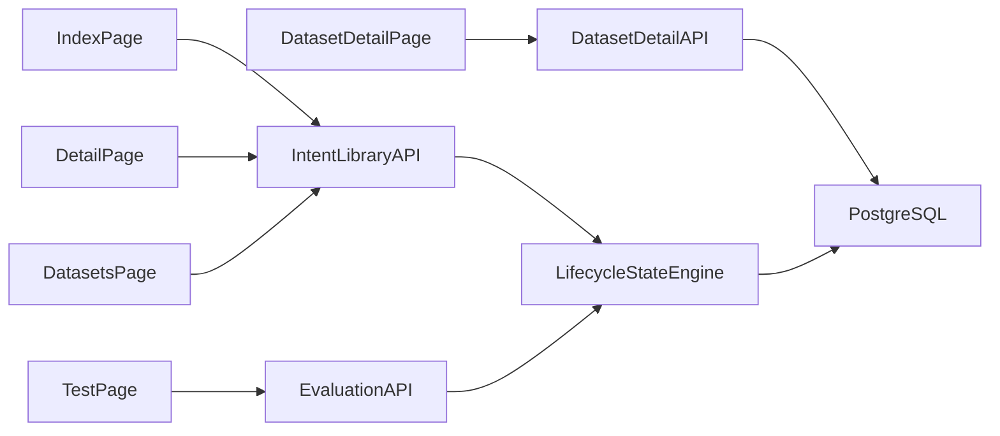
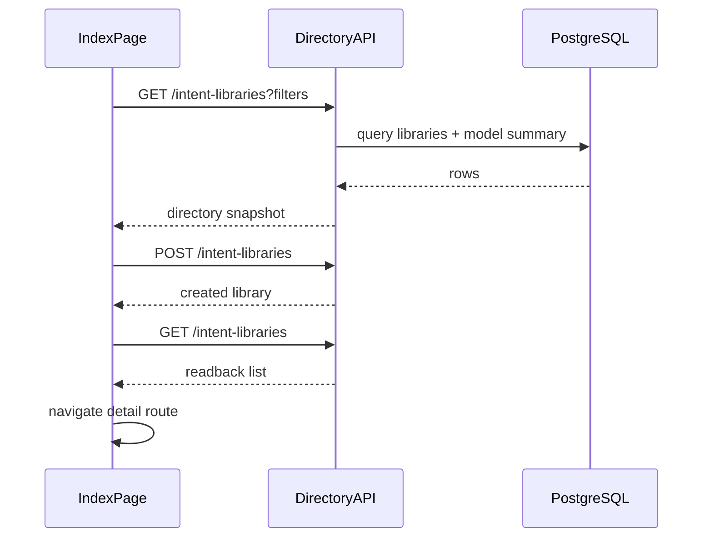
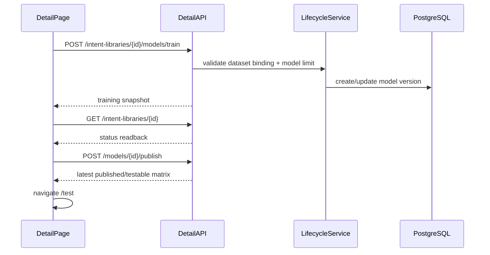
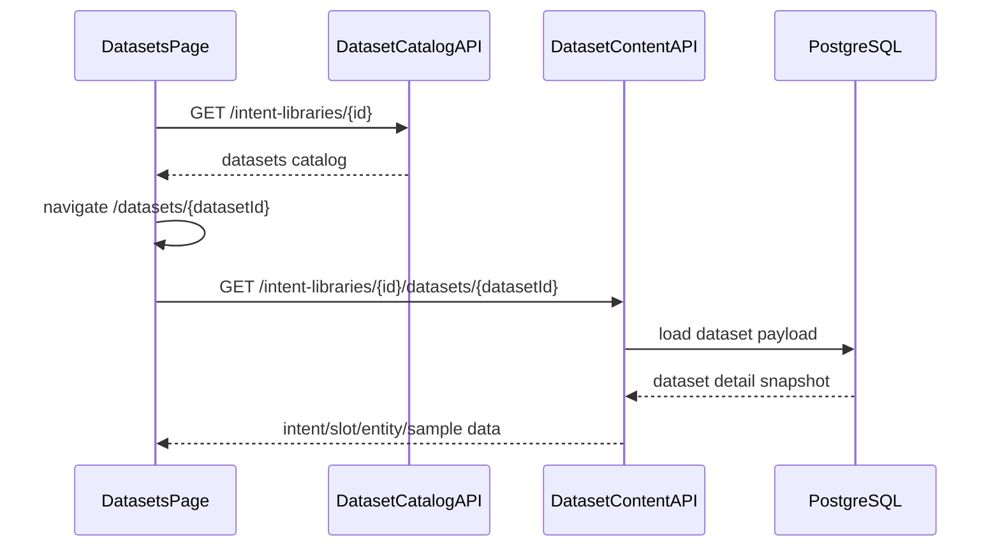

# 指令库管理模块架构设计

## 1. 设计前提

- 本版 AD 以 `ai-pd/ai-intent-library.md` 为唯一主输入，重新建立 `intent-library` 的后续研发链。
- `pd-all/pd-intent-library/` 只负责页面边界、导航链和视觉语义，不再直接替代 AI-PD 的能力与契约定义。
- 已存在代码和旧 `AD / DD / plan / tasks` 仅作为只读参考，不代表当前有效基线。
- `FR-050` 继续按 `Partial` 管理：允许库级默认阈值和任务级覆盖快照，但不宣称继承链路展示已闭环。

## 2. 模块拆分

| 子域 | 页面/入口 | 核心职责 | 明确不负责 |
|------|-----------|----------|------------|
| `library-directory` | `intent-library.index` | 指令库检索、筛选、创建、删除与进入详情 | 模型生命周期操作 |
| `model-lifecycle` | `intent-library.detail` | 模型版本列表、训练、发布、归档、下载、导航到数据集/测试 | 训练数据内容编辑 |
| `dataset-catalog` | `intent-library.datasets` | 训练集/评估集目录、导入、LLM 合成、跳转数据详情 | 单条 intent/slot/entity 编辑 |
| `dataset-content` | `intent-library.dataset-detail` | intent/slot/entity/synonym/sample 深交互维护 | 训练任务调度、跨库绑定 |
| `model-testing` | `intent-library.test` | 单条测试、批量评估、分析摘要、返回详情 | 对话方案级横向批量测试 |

## 3. 架构总览

## 4. 页面边界与所有权

| page_id | route | 页面所有者 | 页面必须承接 | 不允许再做的事 |
|---------|-------|------------|--------------|----------------|
| `intent-library.index` | `/intent-library` | `IntentLibraryPage` | 筛选、创建、删除、进入详情 | 把详情/测试内容塞回列表页 |
| `intent-library.detail` | `/intent-library/:libraryId` | `IntentLibraryDetailPage` | 模型生命周期、数据集/测试导航、发布门禁反馈 | 直接承接数据集内容编辑 |
| `intent-library.datasets` | `/intent-library/:libraryId/datasets` | `IntentLibraryDatasetsPage` | 数据集目录、导入、LLM 合成、进入数据详情 | 直接承接模型训练/发布 |
| `intent-library.dataset-detail` | `/intent-library/:libraryId/datasets/:datasetId` | `IntentLibraryDatasetDetailPage` | intent/slot/entity/sample 深交互与导入 | 降级为只读样本列表页 |
| `intent-library.test` | `/intent-library/:libraryId/test` | `IntentLibraryTestPage` | 单条测试和库内批量评估同页闭环 | 跳转到其它模块完成评估 |

## 5. 服务边界

| 服务/层 | 主要输入 | 主要输出 | 说明 |
|---------|----------|----------|------|
| `IntentLibraryDirectoryService` | 筛选条件、创建请求、删除请求 | 指令库目录、创建结果 | 对应 `index` 页 |
| `IntentLibraryDetailService` | `library_id`、训练/发布/归档动作 | 详情快照、模型状态矩阵 | 对应 `detail` 页 |
| `IntentDatasetCatalogService` | `library_id`、数据集创建/导入/LLM 合成动作 | 数据集目录、绑定状态 | 对应 `datasets` 页 |
| `IntentDatasetContentService` | `library_id + dataset_id`、intent/slot/entity/sample 编辑动作 | 数据内容快照 | 对应 `dataset-detail` 页 |
| `IntentModelTestService` | `model_id`、单条 utterance、评估请求 | 单条测试结果、评估记录、分析摘要 | 对应 `test` 页 |

## 6. 核心交互链

### 6.1 列表到详情

### 6.2 详情到训练/发布/测试

### 6.3 数据集目录到数据内容

## 7. 关键架构决策

### 7.1 五页边界不可再压扁

- `index/detail/datasets/dataset-detail/test` 五页必须持续存在独立路由和独立成功信号。
- 任何“为了省实现而把 detail/test 合并回 index”的做法都视为架构退化。

### 7.2 `dataset-detail` 是本轮最高风险页

- 该页的 `ui-capability` 明确包含 `intent 配置 Drawer`、`相似问/排除问 Drawer`、`词槽 Drawer`、`实体导入 Modal`。
- 架构上必须把它视为独立能力域，而不是 `datasets` 页的附属只读视图。
- 若本轮无法全部闭环，必须在 `DD / plan / tasks` 中继续显式登记 `Deferred`，但不可省略接口和页面边界设计。

### 7.3 真实回读优先于提示文案

- 创建、删除、训练、发布、评估、导入都必须依赖真实回读或明确错误，不允许只用 toast 表示成功。
- critical probe `result_readback`、`training_state_transition`、`batch_eval_feedback` 必须能从架构上被证明。

## 8. 下游接口面

| 页面 | 主要 API | 用途 |
|------|----------|------|
| `index` | `GET /api/v1/intent-libraries` | 列表、筛选、状态摘要 |
| `index` | `POST /api/v1/intent-libraries` | 创建指令库 |
| `index` | `DELETE /api/v1/intent-libraries/{library_id}` | 删除未发布指令库 |
| `detail` | `GET /api/v1/intent-libraries/{library_id}` | 详情与模型状态 |
| `detail` | `POST /api/v1/intent-libraries/{library_id}/models/train` | 发起训练 |
| `detail` | `POST /api/v1/models/{model_id}/publish` | 发布模型 |
| `detail` | `GET /api/v1/models/{model_id}/download` | 下载元数据 |
| `datasets` | `POST /api/v1/intent-libraries/{library_id}/datasets` | 新建/导入数据集 |
| `dataset-detail` | `GET /api/v1/intent-libraries/{library_id}/datasets/{dataset_id}` | 数据详情读取 |
| `test` | `POST /api/v1/models/{model_id}/single-test` | 单条测试 |
| `test` | `POST /api/v1/models/{model_id}/evaluate` | 批量评估 |

## 9. Browser / Harness 对齐

| probe | 架构承接点 | 必须证明 |
|------|------------|---------|
| `page_boundary_parity` | 五条独立路由和独立页面组件 | 无聚合占位页 |
| `route_navigation_chain` | `index -> detail -> datasets -> dataset-detail -> test` | 返回链和菜单高亮正确 |
| `capability_parity` | `dataset-detail` 的 hidden_interactions 与页面能力清单 | 不遗漏 Drawer / Modal 真能力 |
| `training_state_transition` | `detail` + lifecycle service | `draft -> training -> trained` 真实变化 |
| `batch_eval_feedback` | `test` + evaluation service | 评估指标和分析摘要来自真实接口 |
| `result_readback` | 全页 | 创建/导入/状态切换后可回读 |

## 10. 风险与约束

| 风险 | 影响 | 架构缓解 |
|------|------|----------|
| `FR-050 Partial` 被误判为闭环 | 下游宣称完成度失真 | 在 DD/plan/tasks 持续保留 `Partial` |
| `dataset-detail` 继续只读化 | AI-PD 页面能力无法承接 | 把深交互列为独立能力域和任务域 |
| 发布/训练只有 toast | browser 无法证明真实成功 | 统一要求详情页与测试页读取真实状态快照 |
| 旧实现叙事残留 | 误把历史结论当当前真相 | 所有下游文件头显式引用 AI-PD，新证据重建 |
