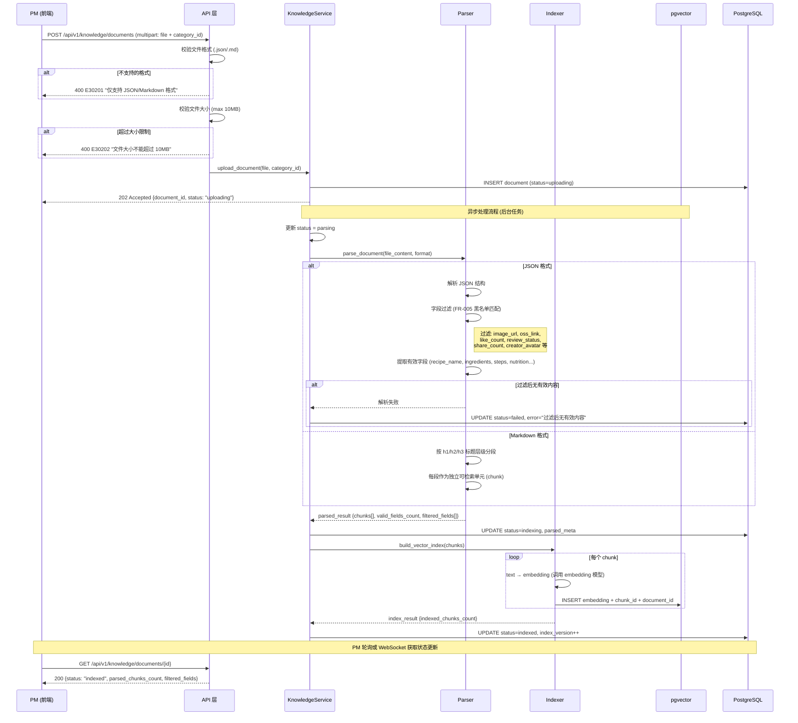
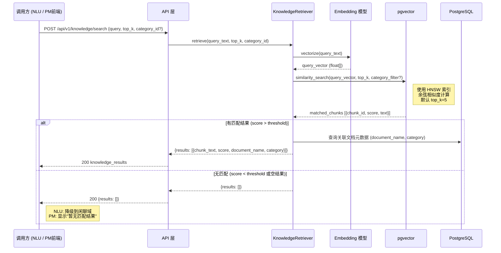
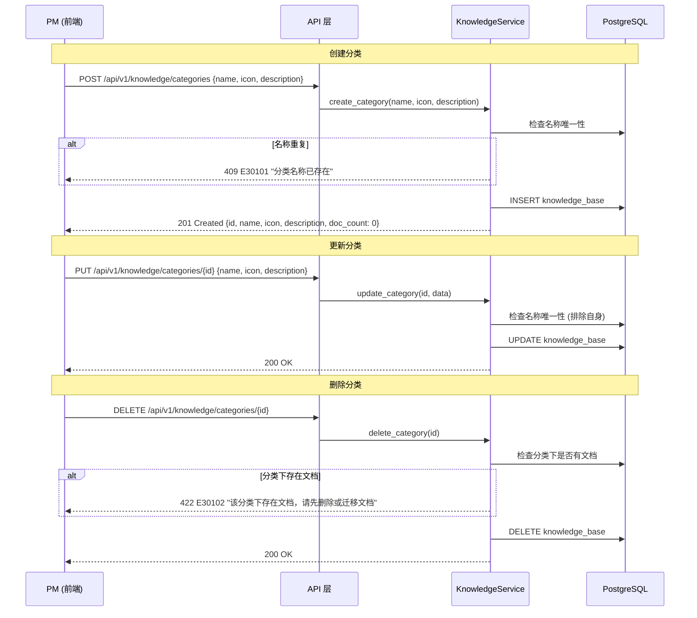
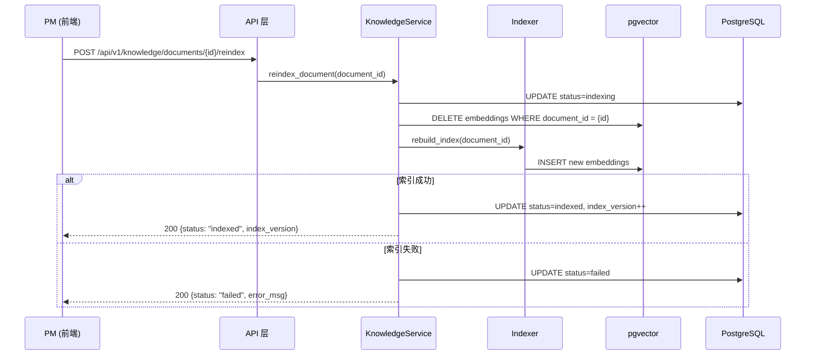

# 架构设计: 知识库域 (Knowledge Base)

## 1. 模块概述

**职责**: 文档上传与解析、无效字段自动过滤、向量索引构建与管理、语义检索、知识库分类管理

**核心实体**:

| 实体 | 说明 |
|------|------|
| KnowledgeBase (分类) | 知识库分类，如菜谱、公司信息、产品指南；包含名称、图标、描述、文档统计 |
| KnowledgeDocument (文档) | 上传的文档实体，包含元数据、解析结果、索引状态、过滤字段记录 |

**关键流程**:

1. **文档上传→解析→索引** (FR-004, FR-005): PM 上传 JSON/Markdown 文档，系统自动检测格式、提取有效字段、过滤无效字段、构建向量索引
2. **语义检索** (FR-004): 对话引擎或 PM 手动发起检索，系统将查询文本向量化后在 pgvector 中执行相似度搜索
3. **分类 CRUD** (FR-006): PM 创建/编辑/删除知识库分类，文档按分类组织管理

**跨模块依赖**:

| 方向 | 模块 | 交互方式 | 说明 |
|------|------|---------|------|
| 被调用 | 对话引擎 (NLU Pipeline) | 函数调用 `KnowledgeRetriever.retrieve()` | 知识域路由链路调用检索 |
| 被调用 | 对话方案 (ProfileService) | 引用 | 方案配置中引用知识库分类 |

---

## 2. 核心数据流

### 2.1 文档上传与索引流程 (FR-004, FR-005)

**触发点**: PM 在知识库管理页面上传文档（`pd-knowledge-base/index.html` → 上传文档按钮）
**涉及模块**: API 层、KnowledgeService、Parser、Indexer、pgvector
**对应 FR**: FR-004 (文档上传与索引), FR-005 (字段自动过滤)



**异常处理**:

| 异常场景 | 检测方式 | 处理策略 | 错误码 | 用户提示 |
|---------|---------|---------|--------|---------|
| 不支持的文件格式 | 文件扩展名 + MIME type | 拒绝上传 | E30201 | 仅支持 JSON/Markdown 格式 |
| 文件超过大小限制 | 文件大小检查 | 拒绝上传 | E30202 | 文件大小不能超过 10MB |
| JSON 格式非法 | JSON.parse 异常 | 标记 failed | E30203 | JSON 格式错误，请检查文件内容 |
| 过滤后无有效内容 | valid_fields_count == 0 | 标记 failed | E30204 | 文档过滤后无有效内容 |
| embedding 模型调用失败 | HTTP 超时/异常 | 重试 3 次后 failed | E30205 | 索引构建失败，请重试 |
| 分类不存在 | DB 查询 | 拒绝上传 | E30103 | 指定的分类不存在 |

### 2.2 知识库检索流程 (FR-004)

**触发点**: (1) 对话引擎 NLU Pipeline 知识域路由 (跨模块调用); (2) PM 在文档详情页检索测试 (`pd-knowledge-base/detail.html`)
**涉及模块**: KnowledgeRetriever、Embedding 模型、pgvector
**对应 FR**: FR-004 (语义检索), FR-021 (知识域路由链路)



**NLU 跨模块调用接口** (内部函数签名):

| 接口 | 调用方 → 被调方 | 方法签名 | 返回类型 |
|------|---------------|---------|---------|
| 知识检索 | NLU Pipeline → KnowledgeRetriever | `retrieve(query: str, top_k: int = 5, category_id: str = None)` | `list[KnowledgeResult]` |

### 2.3 分类管理流程 (FR-006)

**触发点**: PM 在知识库列表页创建/编辑/删除分类 (`pd-knowledge-base/index.html`)
**涉及模块**: API 层、KnowledgeService、PostgreSQL
**对应 FR**: FR-006



### 2.4 重新索引流程

**触发点**: PM 在文档详情页点击"重新索引" (`pd-knowledge-base/detail.html`)



---

## 3. 接口契约

### 3.1 知识库分类 API

| 方法 | 路径 | 说明 | 权限 | 对应 FR |
|------|------|------|------|---------|
| GET | /api/v1/knowledge/categories | 分类列表 | knowledge_read | FR-006 |
| POST | /api/v1/knowledge/categories | 创建分类 | knowledge_manage | FR-006 |
| GET | /api/v1/knowledge/categories/{id} | 分类详情 | knowledge_read | FR-006 |
| PUT | /api/v1/knowledge/categories/{id} | 更新分类 | knowledge_manage | FR-006 |
| DELETE | /api/v1/knowledge/categories/{id} | 删除分类 (需无文档) | knowledge_manage | FR-006 |

#### 创建分类

**请求** (Body):

```json
{
  "name": "类型: string, 必填, 最大 30 字符, 全局唯一",
  "icon": "类型: string, 必填, emoji 字符 (从预设列表选择)",
  "description": "类型: string, 可选, 最大 200 字符"
}
```

**响应** (201):

```json
{
  "code": "000000",
  "data": {
    "id": "kb_004",
    "name": "常见问题",
    "icon": "💡",
    "description": "产品常见问题与解答",
    "doc_count": 0,
    "indexed_count": 0,
    "status": "ready",
    "created_at": "2026-03-18T10:00:00Z",
    "updated_at": "2026-03-18T10:00:00Z"
  },
  "msg": "success"
}
```

#### 分类列表

**请求** (Query): 无分页（分类数量有限，预计 < 20）

**响应** (200):

```json
{
  "code": "000000",
  "data": {
    "items": [
      {
        "id": "kb_001",
        "name": "菜谱知识",
        "icon": "🍳",
        "description": "菜谱数据（菜名、食材、步骤、营养成分等）",
        "doc_count": 1000,
        "indexed_count": 998,
        "status": "ready",
        "created_at": "2026-03-01T09:00:00Z",
        "updated_at": "2026-03-10T09:00:00Z"
      }
    ],
    "total": 3
  },
  "msg": "success"
}
```

#### 错误码

| 错误码 | HTTP 状态 | 场景 | 用户提示 |
|--------|----------|------|---------|
| E30101 | 409 | 分类名称重复 | 分类名称已存在 |
| E30102 | 422 | 删除分类时存在关联文档 | 该分类下存在文档，请先删除或迁移文档 |
| E30103 | 404 | 分类不存在 | 指定的分类不存在 |

### 3.2 知识库文档 API

| 方法 | 路径 | 说明 | 权限 | 对应 FR |
|------|------|------|------|---------|
| GET | /api/v1/knowledge/documents | 文档列表 (分页+分类筛选) | knowledge_read | FR-004 |
| POST | /api/v1/knowledge/documents | 上传文档 (multipart) | knowledge_manage | FR-004 |
| GET | /api/v1/knowledge/documents/{id} | 文档详情 (含解析结果) | knowledge_read | FR-004 |
| PUT | /api/v1/knowledge/documents/{id} | 更新文档元数据 (名称/分类) | knowledge_manage | FR-004 |
| DELETE | /api/v1/knowledge/documents/{id} | 删除文档 (同步删除索引) | knowledge_manage | FR-004 |
| POST | /api/v1/knowledge/documents/{id}/reindex | 重新索引文档 | knowledge_manage | FR-004 |

#### 更新文档元数据

**路径**: `PUT /api/v1/knowledge/documents/{id}`

**请求** (Body):

```json
{
  "name": "string, 可选, max 200, 新文档名称",
  "category_id": "string, 可选, 移动到目标分类"
}
```

**响应** (200):

```json
{
  "code": "000000",
  "data": {
    "id": "doc_010",
    "name": "水煮鱼（更新版）.json",
    "category_id": "kb_002",
    "format": "json",
    "size": "5.6 KB",
    "status": "ready",
    "updated_at": "2026-03-18T11:00:00Z"
  },
  "msg": "success"
}
```

**错误码**:

| 错误码 | HTTP 状态 | 场景 |
|--------|----------|------|
| E30204 | 404 | 文档不存在 |
| E30205 | 404 | 目标分类不存在 |

#### 上传文档

**请求** (multipart/form-data):

| 字段 | 类型 | 必填 | 说明 |
|------|------|------|------|
| file | file | 是 | 文档文件，支持 .json / .md / .markdown，最大 10MB |
| category_id | string | 是 | 所属分类 ID |

**响应** (202 Accepted):

```json
{
  "code": "000000",
  "data": {
    "id": "doc_010",
    "name": "水煮鱼.json",
    "category_id": "kb_001",
    "format": "json",
    "size": "5.6 KB",
    "status": "uploading",
    "created_at": "2026-03-18T10:00:00Z"
  },
  "msg": "文档上传成功，正在解析索引"
}
```

#### 文档详情

**响应** (200):

```json
{
  "code": "000000",
  "data": {
    "id": "doc_001",
    "name": "柠香雪梨银耳汤.json",
    "category_id": "kb_001",
    "category_name": "菜谱知识",
    "format": "json",
    "size": "3.2 KB",
    "status": "indexed",
    "index_version": 1,
    "uploaded_at": "2026-03-10T09:00:00Z",
    "indexed_at": "2026-03-10T09:01:00Z",
    "parsed_result": {
      "total_fields": 15,
      "valid_fields_count": 8,
      "filtered_fields_count": 7,
      "valid_fields": [
        {"field": "recipe_name", "value": "柠香雪梨银耳汤", "type": "string"},
        {"field": "description", "value": "一道清甜滋润的甜品", "type": "string"},
        {"field": "main_ingredients", "value": "银耳 1朵, 雪梨 1个", "type": "array"},
        {"field": "sub_ingredients", "value": "枸杞适量, 红枣3-5颗, 冰糖适量, 柠檬2片", "type": "array"},
        {"field": "steps", "value": ["银耳提前泡发...", "雪梨去皮切块..."], "type": "array"},
        {"field": "nutrition", "value": {"calories": "120kcal", "protein": "2g"}, "type": "object"},
        {"field": "cooking_tools", "value": "炖锅", "type": "string"},
        {"field": "tags", "value": ["甜品", "养生", "秋冬"], "type": "array"}
      ],
      "filtered_fields": [
        {"field": "image_url", "reason": "图片URL"},
        {"field": "oss_link", "reason": "OSS存储链接"},
        {"field": "like_count", "reason": "社交互动数据"},
        {"field": "review_status", "reason": "审核状态"},
        {"field": "creator_avatar", "reason": "用户隐私"},
        {"field": "share_count", "reason": "社交互动数据"},
        {"field": "comment_count", "reason": "社交互动数据"}
      ]
    },
    "chunks_count": 3
  },
  "msg": "success"
}
```

#### 文档列表

**请求** (Query):

| 参数 | 类型 | 必填 | 默认值 | 说明 |
|------|------|------|--------|------|
| page | int | 否 | 1 | 页码 |
| page_size | int | 否 | 20 | 每页条数, max=100 |
| sort_by | string | 否 | created_at | 排序字段 |
| sort_order | string | 否 | desc | asc/desc |
| category_id | string | 否 | - | 按分类筛选 |
| format | string | 否 | - | 按格式筛选 (json/markdown) |
| status | string | 否 | - | 按状态筛选 (indexed/indexing/failed) |
| keyword | string | 否 | - | 文档名称模糊搜索 |

**响应** (200):

```json
{
  "code": "000000",
  "data": {
    "items": [
      {
        "id": "doc_001",
        "name": "柠香雪梨银耳汤.json",
        "category_id": "kb_001",
        "category_name": "菜谱知识",
        "format": "json",
        "size": "3.2 KB",
        "valid_fields_count": 8,
        "total_fields_count": 15,
        "filtered_fields_count": 7,
        "status": "indexed",
        "uploaded_at": "2026-03-10T09:00:00Z"
      }
    ],
    "total": 1024,
    "page": 1,
    "page_size": 20
  },
  "msg": "success"
}
```

#### 删除文档

**响应** (200):

```json
{
  "code": "000000",
  "data": null,
  "msg": "文档及索引已删除"
}
```

级联操作: 同步删除 pgvector 中该文档的所有 embedding 数据。

#### 错误码

| 错误码 | HTTP 状态 | 场景 | 用户提示 |
|--------|----------|------|---------|
| E30201 | 400 | 不支持的文件格式 | 仅支持 JSON/Markdown 格式 |
| E30202 | 400 | 文件大小超限 | 文件大小不能超过 10MB |
| E30203 | 422 | JSON 格式非法 | JSON 格式错误，请检查文件内容 |
| E30204 | 422 | 过滤后无有效内容 | 文档过滤后无有效内容，请检查文档结构 |
| E30205 | 500 | 索引构建失败 | 索引构建失败，请重试 |
| E30206 | 404 | 文档不存在 | 指定的文档不存在 |

### 3.3 知识检索 API

| 方法 | 路径 | 说明 | 权限 | 对应 FR |
|------|------|------|------|---------|
| POST | /api/v1/knowledge/search | 知识检索测试 | knowledge_read | FR-004 |

#### 检索请求

**请求** (Body):

```json
{
  "query": "类型: string, 必填, 最大 200 字符, 检索查询文本",
  "top_k": "类型: int, 可选, 默认 5, 范围 1-20, 返回结果数量",
  "category_id": "类型: string, 可选, 限定在指定分类内检索",
  "score_threshold": "类型: float, 可选, 默认 0.3, 范围 0-1, 最低匹配分数"
}
```

**响应** (200):

```json
{
  "code": "000000",
  "data": {
    "query": "银耳汤食材",
    "results": [
      {
        "chunk_text": "柠香雪梨银耳汤需要以下食材：主料有银耳1朵、雪梨1个；辅料有枸杞适量、红枣3-5颗、冰糖适量、柠檬2片",
        "score": 0.92,
        "document_id": "doc_001",
        "document_name": "柠香雪梨银耳汤.json",
        "category_id": "kb_001",
        "category_name": "菜谱知识"
      },
      {
        "chunk_text": "冰糖银耳莲子汤，食材包括银耳30g、莲子20g、冰糖适量、红枣5颗",
        "score": 0.72,
        "document_id": "doc_005",
        "document_name": "菜谱批量导入_001-100.json",
        "category_id": "kb_001",
        "category_name": "菜谱知识"
      }
    ],
    "total_results": 2,
    "latency_ms": 85
  },
  "msg": "success"
}
```

### 3.4 过滤规则 (FR-005)

系统在解析 JSON 文档时，自动识别并过滤以下类型的无效字段：

| 过滤类别 | 匹配模式 | 示例字段 |
|---------|---------|---------|
| 图片 URL | 字段名含 `image`, `photo`, `avatar`, `thumbnail`, `pic`, `cover`; 或值匹配 `http(s)://*.jpg/png/gif/webp` | image_url, pic_url, cover_url, creator_avatar |
| OSS 链接 | 值匹配 `oss://`, `s3://`, `cos://`; 或字段名含 `oss_link`, `file_url` | oss_link, file_url |
| 社交互动数据 | 字段名含 `like_count`, `view_count`, `share_count`, `comment_count`, `favorite_count` | likes_count, share_count, comment_count |
| 审核状态 | 字段名含 `review_status`, `audit_status`, `approval` | audit_status, review_status |
| 操作人信息 | 字段名含 `created_by`, `updated_by`, `creator_id` | created_by, updated_by |
| 广告字段 | 字段名含 `ad_banner`, `promotion`, `sponsored` | ad_banner |

**保留字段** (知识问答有效信息):

| 字段类型 | 示例 |
|---------|------|
| 名称/标题 | recipe_name, title, name |
| 描述文本 | description, content, summary |
| 食材配料 | ingredients, main_ingredients, sub_ingredients |
| 操作步骤 | steps, instructions, procedure |
| 营养信息 | nutrition, calories, protein |
| 工具器具 | cooking_tools, equipment |
| 分类标签 | tags, categories, labels |
| 时间信息 | cooking_time, prep_time, total_time |

---

## 4. 异常处理汇总

| 错误码 | 模块 | HTTP 状态 | 场景 | 用户提示 |
|--------|------|----------|------|---------|
| E30101 | 分类 | 409 | 分类名称重复 | 分类名称已存在 |
| E30102 | 分类 | 422 | 删除分类时存在文档 | 该分类下存在文档，请先删除或迁移文档 |
| E30103 | 分类 | 404 | 分类不存在 | 指定的分类不存在 |
| E30201 | 文档 | 400 | 不支持的文件格式 | 仅支持 JSON/Markdown 格式 |
| E30202 | 文档 | 400 | 文件大小超限 (>10MB) | 文件大小不能超过 10MB |
| E30203 | 文档 | 422 | JSON 格式非法 | JSON 格式错误，请检查文件内容 |
| E30204 | 文档 | 422 | 过滤后无有效内容 | 文档过滤后无有效内容，请检查文档结构 |
| E30205 | 索引 | 500 | embedding 或索引构建失败 | 索引构建失败，请重试 |
| E30206 | 文档 | 404 | 文档不存在 | 指定的文档不存在 |
| E30301 | 检索 | 400 | 检索文本为空 | 请输入检索内容 |
| E30302 | 检索 | 500 | embedding 模型不可用 | 检索服务暂时不可用，请稍后重试 |

**错误码编码规则**: `E3XXYY`
- `3` = 知识库模块
- `XX` = 子模块 (01=分类, 02=文档, 03=检索)
- `YY` = 序号

---

## 5. 模块级风险

| 风险 | 影响 | 可能性 | 缓解策略 |
|-----|------|--------|---------|
| pgvector 检索性能随数据量增长下降 | 中 | 低 | 使用 HNSW 索引 (ef_construction=128, m=16)；限制 top_k ≤ 20；当文档数超过 10 万时考虑分区索引 |
| 文档解析边缘情况 (嵌套 JSON、非标准 Markdown) | 低 | 中 | JSON 采用递归字段提取；Markdown 使用成熟解析库 (markdown-it)；异常文档标记 failed 并记录日志 |
| embedding 模型质量影响检索准确率 | 高 | 中 | 初期使用 text-embedding-ada-002 或 m3e-base；上线后根据检索测试反馈评估更换；提供检索测试入口 (detail.html) 供 PM 验证 |
| 字段过滤误伤有效内容 | 低 | 中 | 黑名单模式匹配优先（减少误伤）；文档详情页展示过滤结果供 PM 检查；后续可增加白名单自定义 |
| 重新索引期间文档不可检索 | 低 | 高 | 前端提示"重新索引期间检索结果可能不稳定"；建议低峰期操作；后续可实现蓝绿索引切换 |

---

## 6. 需求追溯

| FR 编号 | 需求摘要 | AD 章节 | 覆盖状态 |
|---------|---------|---------|---------|
| FR-004 | 知识库文档上传、解析、索引 | §2.1 上传索引流程, §2.2 检索流程, §3.2 文档 API, §3.3 检索 API | ✅ 完整 |
| FR-005 | 自动过滤无效字段 | §2.1 解析分支, §3.4 过滤规则 | ✅ 完整 |
| FR-006 | 分类管理 | §2.3 分类管理流程, §3.1 分类 API | ✅ 完整 |

---

## 7. 产出物合规检查表 (vs ad-template.md v2.2)

| 模板条款 | 状态 | 说明 |
|---------|------|------|
| §2.3 数据流驱动 | ✅ | 4 个流程有 Mermaid 序列图 (上传索引、检索、分类管理、重新索引) |
| §5 数据流含异常分支 | ✅ | 上传流程含格式校验/大小限制/解析失败/索引失败异常 |
| §6.1 响应信封统一 | ✅ | 所有 API 使用 code/data/msg 信封 |
| §10.3 CRUD 完整性 | ✅ | 分类 5 接口 + 文档 5 接口 + 检索 1 接口 |
| §7.3 追溯矩阵 | ✅ | FR-004~006 全部映射 |
