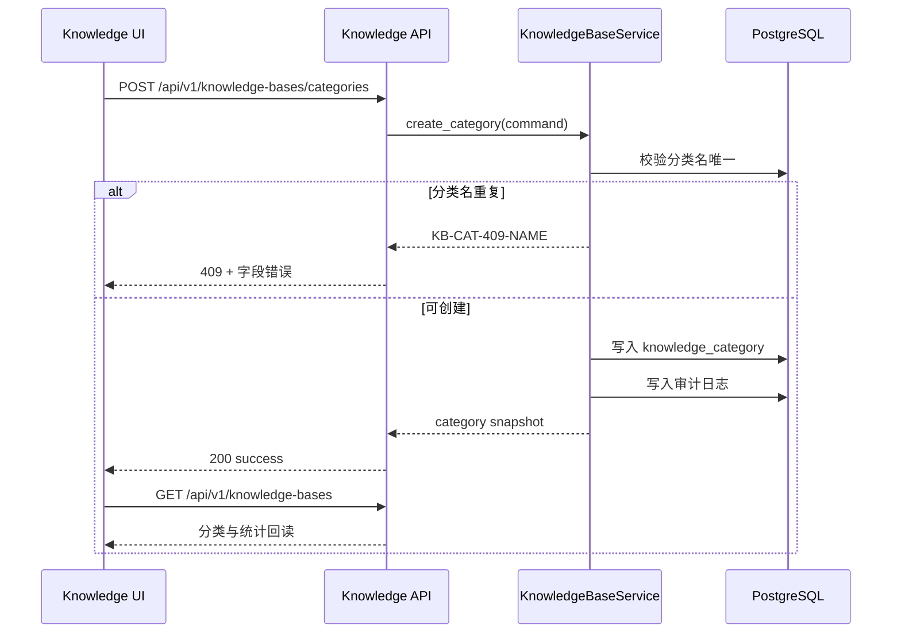
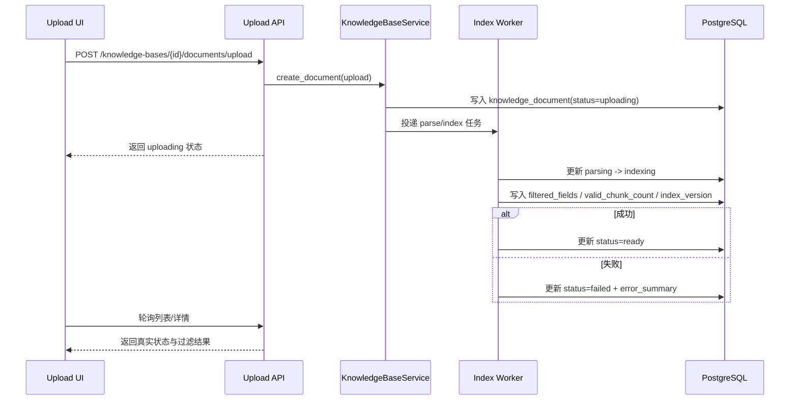
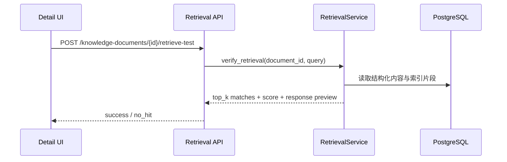

# 知识库管理模块架构设计

## 1. 模块职责与边界

| 子模块 | 职责 | 不负责 |
|--------|------|--------|
| `knowledge category directory` | 分类列表、新建/编辑/删除分类、分类统计 | 对话方案中的知识库绑定 |
| `document directory` | 文档上传、列表筛选、状态回读、重新索引、删除 | 指令模型训练与评估 |
| `document detail` | 文档字段过滤结果、结构化预览、检索测试 | 运行时对话路由决策 |
| `retrieval verification` | 文档级检索验证、命中片段与得分展示 | 开放闲聊兜底生成 |

## 2. 模块关系与调用

| 调用方 | 被调方 | 通信方式 | 同步/异步 | 失败策略 |
|--------|--------|---------|----------|---------|
| `frontend/modules/knowledge-base` | `GET /api/v1/knowledge-bases` | REST | 同步 | 保持当前筛选条件并展示错误态 |
| `frontend/modules/knowledge-base` | `POST /api/v1/knowledge-bases/categories` | REST | 同步 | 弹窗保留输入，显示字段错误 |
| `frontend/modules/knowledge-base` | `POST /api/v1/knowledge-bases/{id}/documents/upload` | REST + background job | 异步 | 只回读真实 `uploading/parsing/indexing/ready/failed` 状态 |
| `frontend/modules/knowledge-base` | `POST /api/v1/knowledge-documents/{id}/reindex` | REST + background job | 异步 | 任务失败时保留错误原因与旧索引版本 |
| `frontend/modules/knowledge-base` | `POST /api/v1/knowledge-documents/{id}/retrieve-test` | REST | 同步 | 展示明确的未命中结果，不做假命中 |
| `knowledge base service` | `parser/filter service` | 领域调用 | 同步 | 解析失败即文档状态 `failed` |
| `knowledge base service` | `index worker` | 后台任务 | 异步 | 必须回写索引状态、过滤字段和错误摘要 |

## 3. 核心数据流

### 3.1 分类创建闭环

**触发点**: PM 点击“新建分类”并提交  
**涉及模块**: 前端分类列表、API 层、KnowledgeBaseService、PostgreSQL  
**对应 FR**: FR-006

### 3.2 文档上传、过滤与索引闭环

**触发点**: PM 选择分类并上传 JSON/Markdown 文档  
**涉及模块**: 前端上传弹窗、API 层、Parser/Filter、IndexWorker、PostgreSQL  
**对应 FR**: FR-004, FR-005

### 3.3 检索验证闭环

**触发点**: PM 在详情页执行检索测试  
**涉及模块**: 前端详情页、API 层、RetrievalService、PostgreSQL  
**对应 FR**: FR-004, FR-005

## 4. 接口契约

### 4.1 `GET /api/v1/knowledge-bases`

- **能力点**: `knowledge_write`
- **输入**: 可选 `category_id`、`document_status`、`format`、`search`
- **输出**: 分类列表、分类统计、当前分类下文档目录

### 4.2 `POST /api/v1/knowledge-bases/categories`

- **能力点**: `knowledge_write`
- **输入**: `name/icon/description`
- **约束**:
  - 分类名在同一租户范围唯一
  - 删除分类时若存在文档，需显式确认级联删除

### 4.3 `PATCH /api/v1/knowledge-bases/categories/{category_id}`

- **能力点**: `knowledge_write`
- **输入**: `name/icon/description`
- **输出**: 最新分类快照

### 4.4 `POST /api/v1/knowledge-bases/{category_id}/documents/upload`

- **能力点**: `knowledge_write`
- **输入**: 文件、格式、原始文件名
- **输出**: 文档记录、任务状态、初始过滤摘要
- **支持格式**: `json`, `markdown`

### 4.5 `GET /api/v1/knowledge-documents/{document_id}`

- **能力点**: `knowledge_write`
- **输出**: 文档详情、有效字段、过滤字段、状态、索引版本、检索验证历史

### 4.6 `POST /api/v1/knowledge-documents/{document_id}/reindex`

- **能力点**: `knowledge_write`
- **输入**: 可选 `reason`
- **输出**: `indexing` 状态与新任务摘要

### 4.7 `POST /api/v1/knowledge-documents/{document_id}/retrieve-test`

- **能力点**: `knowledge_write`
- **输入**: `query`
- **输出**: 命中片段、得分、生成用响应预览、是否命中

### 4.8 `DELETE /api/v1/knowledge-documents/{document_id}`

- **能力点**: `knowledge_write`
- **输出**: 删除成功摘要与受影响分类统计

## 5. 浏览器阶段与验证重点

| probe | 页面动作 | 真实成功信号 |
|-------|---------|-------------|
| `upload_feedback` | 上传 JSON/Markdown 文档 | 列表真实出现新文档，状态经历 `uploading/parsing/indexing/ready` |
| `indexing_result_readback` | 打开详情并查看过滤结果/索引版本 | 有效字段、过滤字段、索引版本来自后端回读 |
| `empty_state` | 进入无文档分类 | 页面明确展示空态而不是假数据 |

## 6. FR 追溯

| FR | 需求 | 设计落实 |
|----|------|---------|
| FR-004 | 上传文档并建立索引 | 上传接口、异步状态流转、详情回读 |
| FR-005 | 自动过滤无效字段 | 过滤规则、字段结果展示、详情接口 |
| FR-006 | 分类管理 | 分类 CRUD、左栏分类导航与统计 |

## 7. 风险与缓解

| 风险 | 影响 | 缓解 |
|------|------|------|
| 文档上传假成功 | 前端提示成功但后台未索引 | 上传后只展示真实状态回读，browser 验证状态链路 |
| 字段过滤误伤 | 有价值字段被错误过滤 | 详情页同时展示有效字段与过滤字段，支持重新索引复核 |
| 详情页与列表页口径不一致 | PM 无法确认索引结果 | 详情与列表统一来自 `knowledge_document` 快照 |
| 无文档分类展示假数据 | 误判系统已有内容 | 明确空态探针并在 smoke 中验证 |
