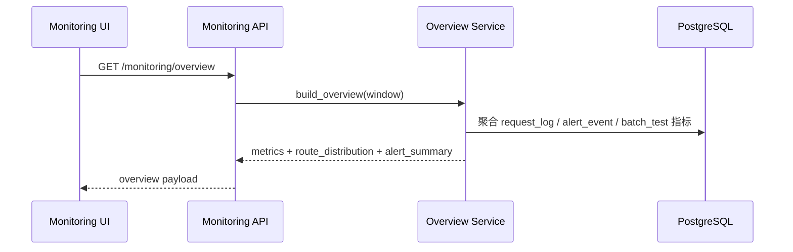
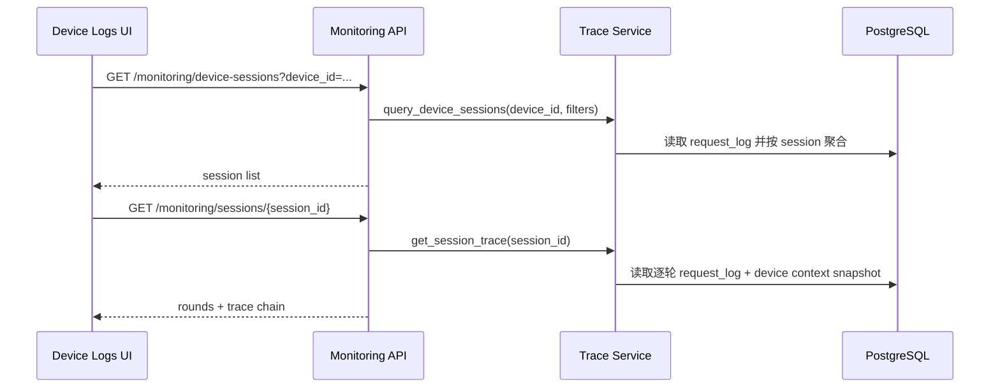
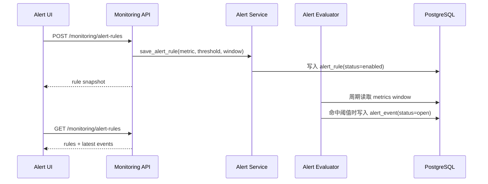

# 监控仪表盘模块架构设计

## 1. 模块职责与边界

| 子模块 | 职责 | 不负责 |
|--------|------|--------|
| `dashboard overview` | 聚合实时指标、展示核心趋势、支持 30 秒轮询与手动刷新 | 真实在线告警通知投递 |
| `request log explorer` | 按时间/设备/路由/意图/耗时/异常筛选请求日志 | 业务配置编辑 |
| `session trace drilldown` | 查看设备会话列表与单会话逐轮链路 | 对话内容脱敏策略定义 |
| `alert rule management` | 维护告警规则、查看最近触发记录 | 外部短信/邮件通道配置 |

## 2. 模块关系与调用

| 调用方 | 被调方 | 通信方式 | 同步/异步 | 失败策略 |
|--------|--------|---------|----------|---------|
| `frontend/modules/monitoring` | `GET /api/v1/monitoring/overview` | REST | 同步 | 保留当前筛选与最近一次成功快照 |
| `frontend/modules/monitoring` | `GET /api/v1/monitoring/request-logs` | REST | 同步 | 展示空态或错误态，不得伪造统计 |
| `frontend/modules/monitoring` | `GET /api/v1/monitoring/device-sessions` | REST | 同步 | 设备不存在时返回空列表 |
| `frontend/modules/monitoring` | `GET /api/v1/monitoring/sessions/{session_id}` | REST | 同步 | 会话不存在时显示明确 blocker |
| `frontend/modules/monitoring` | `GET /api/v1/monitoring/alert-rules` | REST | 同步 | 只展示真实规则与最近触发记录 |
| `frontend/modules/monitoring` | `POST/PATCH /api/v1/monitoring/alert-rules` | REST | 同步 | 校验失败时保留表单输入 |
| `monitoring service` | `request_log`/`dialog_profile`/`batch_test` domain data | 领域读取 | 同步 | 任一来源缺失时降级为部分指标，不得整体假成功 |
| `alert evaluator` | `request_log` + `alert_rule` | 领域计算 | 异步收敛 | 只回写真实 `open/resolved` 告警事件 |

## 3. 核心数据流

### 3.1 仪表盘总览回读闭环

**触发点**: PM 打开监控仪表盘或点击手动刷新  
**涉及模块**: Dashboard UI、Monitoring API、OverviewService、PostgreSQL  
**对应 FR**: FR-030, FR-038

### 3.2 设备会话与单轮链路回读闭环

**触发点**: PM 输入设备 ID 并查看某个会话详情  
**涉及模块**: DeviceLogs UI、Monitoring API、TraceService、PostgreSQL  
**对应 FR**: FR-031, FR-032, FR-034

### 3.3 告警规则与触发记录闭环

**触发点**: PM 新建/调整告警规则，或仪表盘回读最近告警  
**涉及模块**: AlertRules UI、Monitoring API、AlertEvaluator、PostgreSQL  
**对应 FR**: FR-035

## 4. 接口契约

### 4.1 `GET /api/v1/monitoring/overview`

- **能力点**: `monitoring_read`
- **输入**: 可选 `window=5m|15m|60m`
- **输出**: `metrics`、`route_distribution`、`error_summary`、`latest_alerts`

### 4.2 `GET /api/v1/monitoring/request-logs`

- **能力点**: `monitoring_read`
- **输入**: `time_range`, `device_id`, `route`, `intent`, `latency_band`, `is_error`, `page`, `page_size`
- **输出**: `items` + `pagination`

### 4.3 `GET /api/v1/monitoring/device-sessions`

- **能力点**: `monitoring_read`
- **输入**: `device_id`, 可选时间范围
- **输出**: session list、轮次与版本摘要

### 4.4 `GET /api/v1/monitoring/sessions/{session_id}`

- **能力点**: `monitoring_read`
- **输出**: 单会话逐轮 trace、设备上下文快照、异常标记

### 4.5 `GET /api/v1/monitoring/alert-rules`

- **能力点**: `monitoring_read`
- **输出**: rules + latest events

### 4.6 `POST /api/v1/monitoring/alert-rules`

- **能力点**: `alert_manage`
- **输入**: `name`, `metric_key`, `comparator`, `threshold`, `window_minutes`, `severity`
- **约束**:
  - 指标必须属于 `accuracy_drop` / `latency_p99_ms` / `error_rate_spike`
  - 规则名全局唯一

### 4.7 `PATCH /api/v1/monitoring/alert-rules/{rule_id}`

- **能力点**: `alert_manage`
- **输入**: `enabled`, `threshold`, `window_minutes`, `severity`
- **输出**: 真实更新后的规则快照

## 5. 浏览器阶段与验证重点

| probe | 页面动作 | 真实成功信号 |
|-------|---------|-------------|
| `overview_real_metrics` | 打开仪表盘并刷新 | 总请求量、QPS、延迟、准确率、路由分布来自后端回读 |
| `device_trace_drilldown` | 按设备筛选并展开会话 | 能看到真实 session list 与逐轮链路详情 |
| `alert_rule_feedback` | 新建或调整规则 | 规则列表与最近触发记录来自后端回读 |

## 6. FR 追溯

| FR | 需求 | 设计落实 |
|----|------|---------|
| FR-030 | 实时监控总览 | `overview` 指标聚合与路由分布 |
| FR-031 | 按设备查看历史会话 | `device-sessions` |
| FR-032 | 查看完整处理链路 | `session detail` trace |
| FR-034 | 请求日志多维筛选 | `request-logs` 筛选与分页 |
| FR-035 | 告警规则配置与自动告警 | `alert-rules` + `alert-event` |
| FR-038 | 30 秒自动轮询 + 手动刷新 | 前端 polling + 后端 overview |

## 7. 风险与缓解

| 风险 | 影响 | 缓解 |
|------|------|------|
| 指标由前端临时聚合 | 仪表盘假成功 | overview 统一由后端聚合返回 |
| 请求日志量增长导致查询变慢 | PM 无法排障 | 先限制窗口与分页，并为时间/设备建立索引 |
| 告警规则只存不算 | 规则成为摆设 | 引入 `alert_event` 与读取时收敛 evaluator |
| 会话链路字段缺失 | 无法满足 FR-032 | trace 详情强制包含输入、路由、意图、槽位、响应、耗时、上下文快照 |
