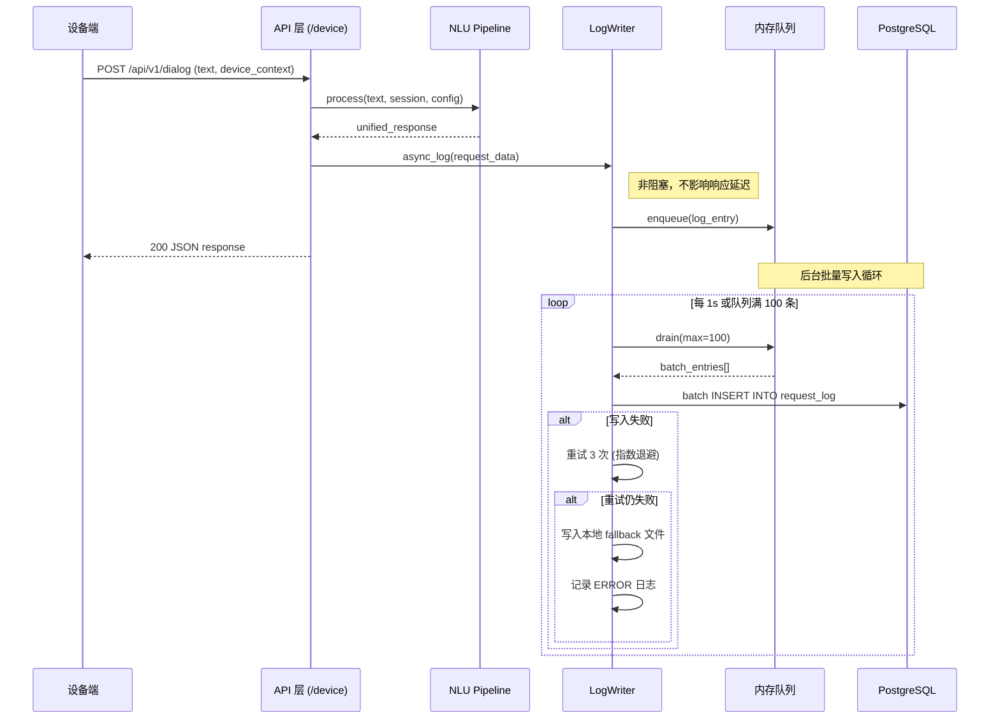
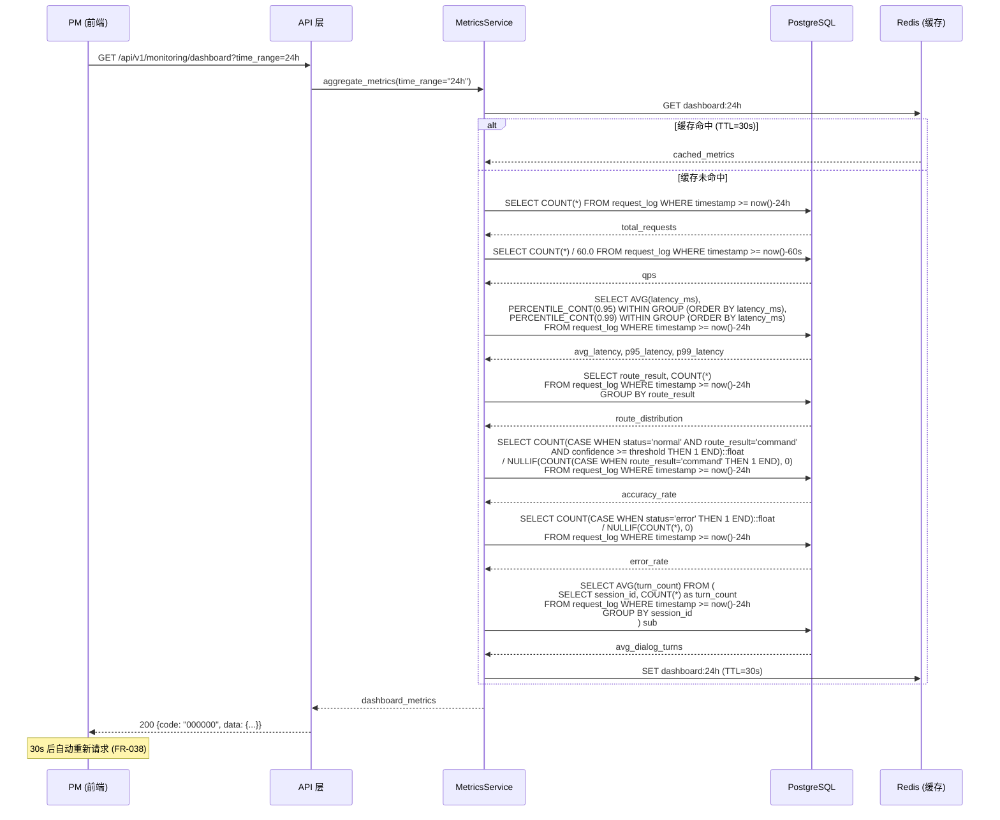
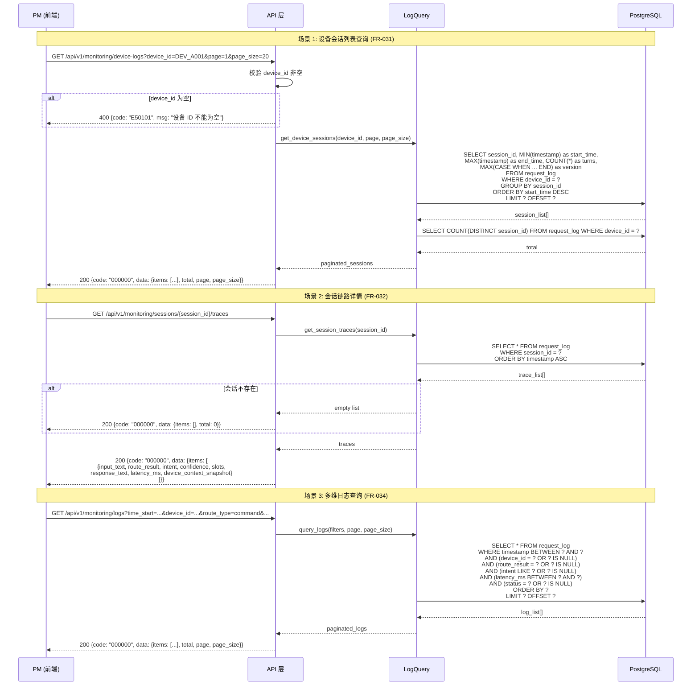
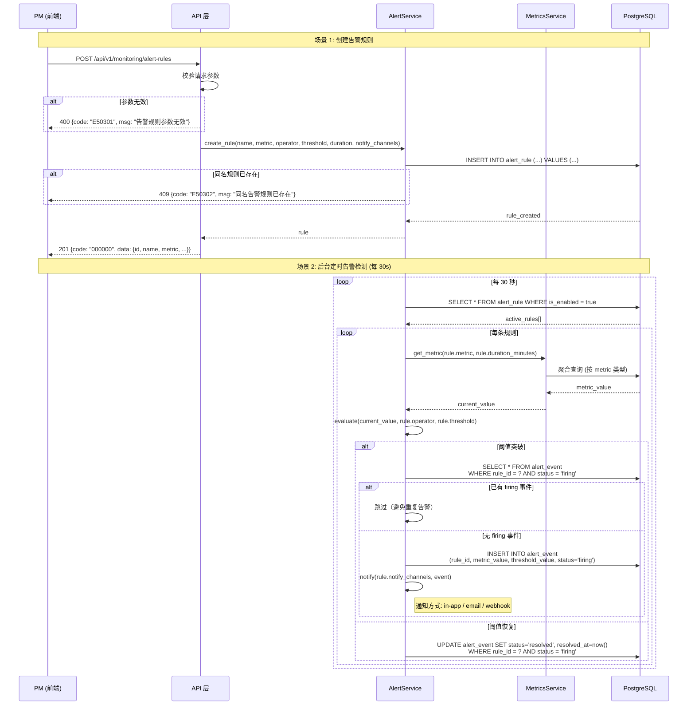

# 架构设计: 监控域 (Monitoring)

## 1. 模块概述

### 1.1 职责范围

| 职责 | 说明 | 对应 FR |
|------|------|---------|
| 请求日志写入 | 每次 `/api/v1/dialog` 请求异步写入结构化日志 | FR-033 |
| 实时指标聚合 | 聚合 QPS、延迟分位、准确率、路由分布等仪表盘指标 | FR-030, FR-038 |
| 设备日志查询 | 按设备 ID 查看历史会话列表 | FR-031 |
| 会话链路追踪 | 查看单个会话内每轮请求的完整处理链路 | FR-032 |
| 多维日志查询 | 按时间、设备、路由、意图、耗时、异常等维度筛选日志 | FR-034 |
| 告警规则管理 | 配置指标阈值告警，自动检测并触发告警事件 | FR-035 |

### 1.2 核心实体

```yaml
RequestLog:
  描述: 每次 /api/v1/dialog 请求的完整处理记录
  字段: request_id, device_id, session_id, input_text, route_result,
        route_confidence(float), intent, intent_confidence(float),
        slots(json), response_text, latency_ms,
        knowledge_hit(json: {doc_name, category, score}),
        reference_resolution(json: {pronoun, resolved}),
        timestamp, device_context_snapshot(json), status(normal/timeout/error)
  存储: PostgreSQL, 异步批量写入
  索引: device_id, session_id, timestamp, route_result, intent

AlertRule:
  描述: 监控告警规则配置
  字段: id, name, metric(enum), operator(lt/gt), threshold(float),
        duration_minutes(int), is_enabled(bool), notify_channels(json),
        created_at, updated_at
  状态: enabled / disabled

AlertEvent:
  描述: 告警触发事件记录
  字段: id, rule_id, triggered_at, metric_value, threshold_value,
        status(firing/resolved), resolved_at
```

### 1.3 服务划分

| 服务 | 职责 | 关键技术 |
|------|------|---------|
| LogWriter | 异步写入请求日志（内存队列 + 批量 INSERT） | asyncio Queue, batch INSERT |
| LogQuery | 设备日志、会话链路、多维查询 | PostgreSQL 索引查询 |
| MetricsService | 仪表盘指标聚合计算 | SQL 聚合函数, PERCENTILE |
| AlertService | 告警规则评估、事件创建与通知 | 30s 定时任务 |

---

## 2. 核心数据流

### 2.1 请求日志写入流程 (FR-033)

**触发点**: 每次 `/api/v1/dialog` 请求完成后（横切关注点）
**涉及模块**: API 层 (device.py) → monitoring/log_writer → PostgreSQL



**日志字段结构**:

```json
{
  "request_id": "string, UUID, 全局唯一",
  "device_id": "string, 必填, 设备标识",
  "session_id": "string, 必填, 会话标识",
  "input_text": "string, 用户原始输入",
  "route_result": "string, enum: command/knowledge/chitchat/error",
  "intent": "string, nullable, 仅 command 路由有值",
  "confidence": "float, 0~1, NLU 置信度",
  "slots": "json, [{name, value, type}], 槽位提取结果",
  "response_text": "string, 系统响应文本",
  "latency_ms": "int, 端到端响应时间(毫秒)",
  "timestamp": "datetime, UTC+8, 请求到达时间",
  "device_context_snapshot": "json, 请求时刻设备上下文",
  "status": "string, enum: normal/timeout/error"
}
```

**异常处理**:

| 异常场景 | 检测方式 | 处理策略 | 错误码 | 用户影响 |
|---------|---------|---------|--------|---------|
| 内存队列满 | queue.full() | 丢弃最旧的日志条目，记录 WARN | - | 无（异步写入不阻塞响应） |
| 数据库写入失败 | INSERT 抛异常 | 指数退避重试 3 次 → fallback 文件 | - | 无（仪表盘数据短暂延迟） |
| 日志字段格式异常 | Pydantic 校验 | 跳过该条，记录 ERROR | - | 无 |

### 2.2 监控仪表盘查询流程 (FR-030, FR-038)

**触发点**: PM 进入监控仪表盘页面 / 30s 自动刷新
**涉及模块**: 前端 → API → monitoring/metrics → PostgreSQL



### 2.3 设备日志与会话链路查询流程 (FR-031, FR-032, FR-034)

**触发点**: PM 在设备日志页面输入设备 ID 查询
**涉及模块**: 前端 → API → monitoring/log_query → PostgreSQL



### 2.4 告警规则管理流程 (FR-035)

**触发点**: PM 配置告警规则 / 后台定时检测
**涉及模块**: 前端 → API → monitoring/alerting → monitoring/metrics → PostgreSQL



---

## 3. 接口契约

### 3.1 仪表盘 API (FR-030, FR-038)

| 方法 | 路径 | 说明 | 权限 | 对应 FR |
|------|------|------|------|---------|
| GET | /api/v1/monitoring/dashboard | 仪表盘核心指标 | monitoring_read | FR-030, FR-038 |

**请求** (Query):

| 参数 | 类型 | 必填 | 默认值 | 说明 |
|------|------|------|--------|------|
| time_range | string | 否 | 24h | 时间范围: 1h / 6h / 24h / 7d |

**响应**:

```json
{
  "code": "000000",
  "data": {
    "time_range": "24h",
    "total_requests": 15682,
    "qps": 8.5,
    "avg_latency_ms": 156,
    "p95_latency_ms": 189,
    "p99_latency_ms": 342,
    "accuracy_rate": 0.962,
    "error_rate": 0.003,
    "avg_dialog_turns": 2.4,
    "route_distribution": {
      "command": { "count": 9723, "percentage": 0.62 },
      "knowledge": { "count": 3607, "percentage": 0.23 },
      "chitchat": { "count": 2352, "percentage": 0.15 }
    },
    "updated_at": "2026-03-18T09:30:00+08:00"
  },
  "msg": "success"
}
```

### 3.2 设备日志 API (FR-031, FR-032, FR-034)

| 方法 | 路径 | 说明 | 权限 | 对应 FR |
|------|------|------|------|---------|
| GET | /api/v1/monitoring/device-logs | 设备会话列表 | monitoring_read | FR-031 |
| GET | /api/v1/monitoring/sessions/{session_id}/traces | 会话链路详情 | monitoring_read | FR-032 |
| GET | /api/v1/monitoring/logs | 请求日志多维查询 | monitoring_read | FR-034 |

#### 3.2.1 设备会话列表

**请求** (Query):

| 参数 | 类型 | 必填 | 默认值 | 说明 |
|------|------|------|--------|------|
| device_id | string | 是 | - | 设备 ID，精确匹配 |
| page | int | 否 | 1 | 页码 |
| page_size | int | 否 | 20 | 每页条数, max=100 |

**响应**:

```json
{
  "code": "000000",
  "data": {
    "items": [
      {
        "session_id": "string, 会话唯一标识",
        "start_time": "datetime, 首次请求时间",
        "end_time": "datetime, nullable, 末次请求时间",
        "turns": "int, 对话轮次数",
        "version": "string, 关联的发布版本号",
        "route_distribution": {
          "command": "int, 指令域请求数",
          "knowledge": "int, 知识域请求数",
          "chitchat": "int, 闲聊域请求数"
        }
      }
    ],
    "total": 42,
    "page": 1,
    "page_size": 20
  },
  "msg": "success"
}
```

#### 3.2.2 会话链路详情

**请求**: `GET /api/v1/monitoring/sessions/{session_id}/traces`

**响应**:

```json
{
  "code": "000000",
  "data": {
    "session_id": "sess_2026031809",
    "device_id": "DEV_A001",
    "start_time": "2026-03-18T09:30:00+08:00",
    "end_time": "2026-03-18T09:35:00+08:00",
    "version": "v2.1",
    "traces": [
      {
        "request_id": "string, 请求唯一标识",
        "input_text": "string, 用户输入",
        "route_result": "string, command/knowledge/chitchat",
        "route_confidence": "float, 路由置信度",
        "intent": "string, nullable, 意图名称",
        "intent_confidence": "float, nullable, 意图置信度",
        "slots": [
          {
            "name": "string, 槽位名",
            "value": "string, 槽位值",
            "type": "string, 槽位类型",
            "required": "boolean, 是否必填",
            "filled": "boolean, 是否已填充"
          }
        ],
        "knowledge_hit": {
          "doc_name": "string, nullable, 命中文档名",
          "category": "string, nullable, 文档分类",
          "score": "float, nullable, 匹配得分"
        },
        "reference_resolution": {
          "pronoun": "string, nullable, 指代词",
          "resolved": "string, nullable, 消解结果"
        },
        "response_text": "string, 系统响应",
        "latency_ms": "int, 处理耗时",
        "device_context_snapshot": {
          "cooking_status": "string, idle/cooking/paused/done",
          "door_status": "string, open/closed/unknown",
          "current_temp": "int, 当前温度(℃)",
          "current_page": "string, 设备当前页面"
        },
        "timestamp": "datetime"
      }
    ]
  },
  "msg": "success"
}
```

#### 3.2.3 请求日志多维查询

**请求** (Query):

| 参数 | 类型 | 必填 | 默认值 | 说明 |
|------|------|------|--------|------|
| time_start | datetime | 否 | now()-24h | 起始时间 |
| time_end | datetime | 否 | now() | 结束时间 |
| device_id | string | 否 | - | 设备 ID, 模糊匹配 |
| route_type | string | 否 | - | 路由类型: command/knowledge/chitchat |
| intent_name | string | 否 | - | 意图名称, 模糊匹配 |
| latency_min | int | 否 | - | 最低耗时(ms) |
| latency_max | int | 否 | - | 最高耗时(ms) |
| is_error | boolean | 否 | - | 是否异常 (status=error) |
| page | int | 否 | 1 | 页码 |
| page_size | int | 否 | 20 | 每页条数, max=100 |
| sort_by | string | 否 | timestamp | 排序字段: timestamp/latency_ms |
| sort_order | string | 否 | desc | asc/desc |

**响应**:

```json
{
  "code": "000000",
  "data": {
    "items": [
      {
        "request_id": "req_001",
        "timestamp": "2026-03-18T09:30:15+08:00",
        "device_id": "DEV_A001",
        "input_text": "设置温度180度",
        "route_result": "command",
        "intent": "set_cooking_temp",
        "confidence": 0.96,
        "latency_ms": 128,
        "status": "normal"
      }
    ],
    "total": 15682,
    "page": 1,
    "page_size": 20
  },
  "msg": "success"
}
```

### 3.3 告警规则 API (FR-035)

| 方法 | 路径 | 说明 | 权限 | 对应 FR |
|------|------|------|------|---------|
| GET | /api/v1/monitoring/alert-rules | 告警规则列表 | monitoring_read | FR-035 |
| POST | /api/v1/monitoring/alert-rules | 创建告警规则 | monitoring_alert_manage | FR-035 |
| PUT | /api/v1/monitoring/alert-rules/{id} | 更新告警规则 | monitoring_alert_manage | FR-035 |
| DELETE | /api/v1/monitoring/alert-rules/{id} | 删除告警规则 | monitoring_alert_manage | FR-035 |
| PUT | /api/v1/monitoring/alert-rules/{id}/toggle | 启用/禁用规则 | monitoring_alert_manage | FR-035 |
| GET | /api/v1/monitoring/alert-events | 告警事件列表 | monitoring_read | FR-035 |

#### 3.3.1 创建告警规则

**请求** (Body):

```json
{
  "name": "string, 必填, max 100, 规则名称",
  "metric": "string, 必填, enum: accuracy_rate/p95_latency/p99_latency/avg_latency/error_rate/qps",
  "operator": "string, 必填, enum: lt/gt (lt=小于, gt=大于)",
  "threshold": "float, 必填, 告警阈值",
  "duration_minutes": "int, 必填, min=1, max=60, 持续时间(分钟)",
  "is_enabled": "boolean, 可选, 默认 true",
  "notify_channels": ["string, 可选, enum: in_app/email/webhook, 默认 [in_app]"]
}
```

**响应** (201):

```json
{
  "code": "000000",
  "data": {
    "id": "rule_005",
    "name": "意图准确率下降告警",
    "metric": "accuracy_rate",
    "operator": "lt",
    "threshold": 0.90,
    "duration_minutes": 5,
    "is_enabled": true,
    "notify_channels": ["in_app", "email"],
    "created_at": "2026-03-18T10:00:00+08:00",
    "updated_at": "2026-03-18T10:00:00+08:00"
  },
  "msg": "success"
}
```

#### 3.3.2 启用/禁用规则

**请求** (Body):

```json
{
  "is_enabled": "boolean, 必填"
}
```

**响应**:

```json
{
  "code": "000000",
  "data": {
    "id": "rule_001",
    "is_enabled": false,
    "updated_at": "2026-03-18T10:05:00+08:00"
  },
  "msg": "success"
}
```

#### 3.3.3 告警事件列表

**请求** (Query):

| 参数 | 类型 | 必填 | 默认值 | 说明 |
|------|------|------|--------|------|
| rule_id | string | 否 | - | 按规则筛选 |
| status | string | 否 | - | firing / resolved |
| page | int | 否 | 1 | 页码 |
| page_size | int | 否 | 20 | 每页条数 |

**响应**:

```json
{
  "code": "000000",
  "data": {
    "items": [
      {
        "id": "evt_001",
        "rule_id": "rule_001",
        "rule_name": "意图准确率下降告警",
        "metric": "accuracy_rate",
        "metric_value": 0.841,
        "threshold_value": 0.90,
        "operator": "lt",
        "triggered_at": "2026-03-18T10:15:33+08:00",
        "resolved_at": null,
        "status": "firing",
        "duration_minutes": 5
      }
    ],
    "total": 2,
    "page": 1,
    "page_size": 20
  },
  "msg": "success"
}
```

---

## 4. 异常处理汇总

| 错误码 | HTTP 状态 | 场景 | 用户提示 |
|--------|----------|------|---------|
| E50101 | 400 | 设备 ID 为空 | "设备 ID 不能为空" |
| E50102 | 400 | 时间范围参数无效 | "时间范围参数无效，支持: 1h/6h/24h/7d" |
| E50103 | 400 | 日志查询参数无效 | "查询参数格式错误: {detail}" |
| E50201 | 404 | 会话不存在 | "会话 {session_id} 不存在" |
| E50301 | 400 | 告警规则参数无效 | "告警规则参数无效: {detail}" |
| E50302 | 409 | 同名告警规则已存在 | "同名告警规则已存在" |
| E50303 | 404 | 告警规则不存在 | "告警规则 {id} 不存在" |
| E50304 | 400 | 告警指标不支持 | "不支持的监控指标: {metric}" |
| E50305 | 400 | 阈值与操作符不匹配 | "准确率指标应使用 lt 操作符" |
| E50901 | 500 | 指标聚合查询超时 | "指标查询超时，请稍后重试" |
| E50902 | 500 | 日志写入失败（降级通知） | 无用户可见影响 |

---

## 5. 模块级风险

| 风险 | 影响 | 可能性 | 缓解策略 | 对应 FR |
|------|------|--------|---------|---------|
| 日志写入影响请求延迟 | 高 | 低 | 异步内存队列 + 批量写入，写入失败不阻塞响应 | FR-033 |
| 仪表盘查询随数据量增长变慢 | 中 | 中 | 分区表(按月) + 索引优化 + 聚合结果缓存(Redis, TTL=30s) | FR-030 |
| 告警误报/漏报 | 中 | 中 | 持续时间窗口去抖 + 已 firing 事件去重 + resolved 自动恢复 | FR-035 |
| 大量设备并发日志写入 OOM | 中 | 低 | 内存队列设上限(10000条) + 溢出丢弃最旧条目 + 监控队列深度 | FR-033 |
| 多维查询全表扫描 | 中 | 中 | 复合索引 (timestamp, device_id, route_result) + 查询超时 5s | FR-034 |

---

## 6. 需求追溯

| FR 编号 | 需求摘要 | AD 章节 | 覆盖状态 |
|---------|---------|---------|---------|
| FR-030 | 实时监控仪表盘核心指标 | §2.2 数据流 + §3.1 API | ✅ 完整 (V2 扩展指标 — 用户满意度/意图覆盖率等 — 预留在 DD 层设计) |
| FR-031 | 按设备 ID 查看历史会话列表 | §2.3 数据流 + §3.2.1 API | ✅ 完整 |
| FR-032 | 会话内每轮请求完整处理链路 | §2.3 数据流 + §3.2.2 API | ✅ 完整 |
| FR-033 | 每次 API 请求记录结构化日志 | §2.1 数据流 | ✅ 完整 |
| FR-034 | 请求日志多维筛选 | §2.3 数据流 + §3.2.3 API | ✅ 完整 |
| FR-035 | 告警规则配置与自动告警 | §2.4 数据流 + §3.3 API | ✅ 完整 |
| FR-038 | 仪表盘 30s 自动刷新 | §2.2 数据流 (前端轮询) | ✅ 完整 |

---

## 7. 产出物合规检查表

| 模板条款 | 状态 | 说明 |
|---------|------|------|
| §2.3 数据流驱动 | ✅ | 4 个核心流程有 Mermaid 序列图 |
| §5 数据流含异常分支 | ✅ | 日志写入失败重试/降级、参数校验、会话不存在、告警去重 |
| §6.1 响应信封统一 | ✅ | 所有 API 使用 code/data/msg 信封 |
| §6.2 API 契约完整 | ✅ | 7 个 API 端点有完整输入/输出/错误码 |
| §7.3 追溯矩阵 | ✅ | 7 个 FR 全部映射 |
