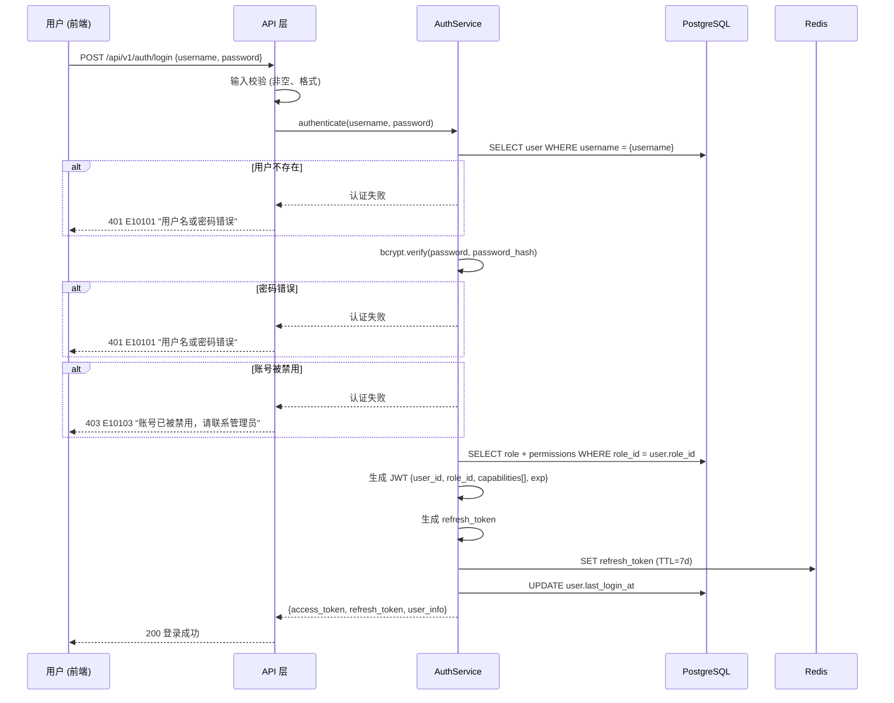
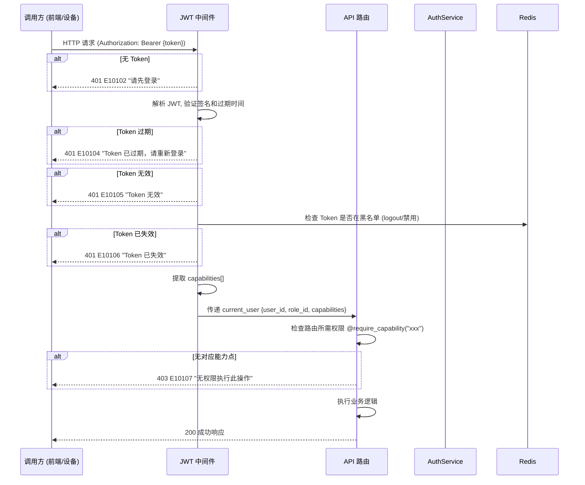
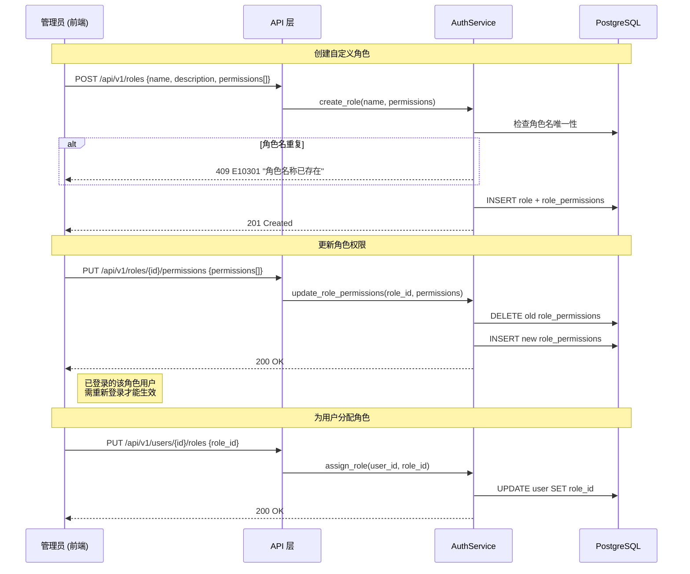
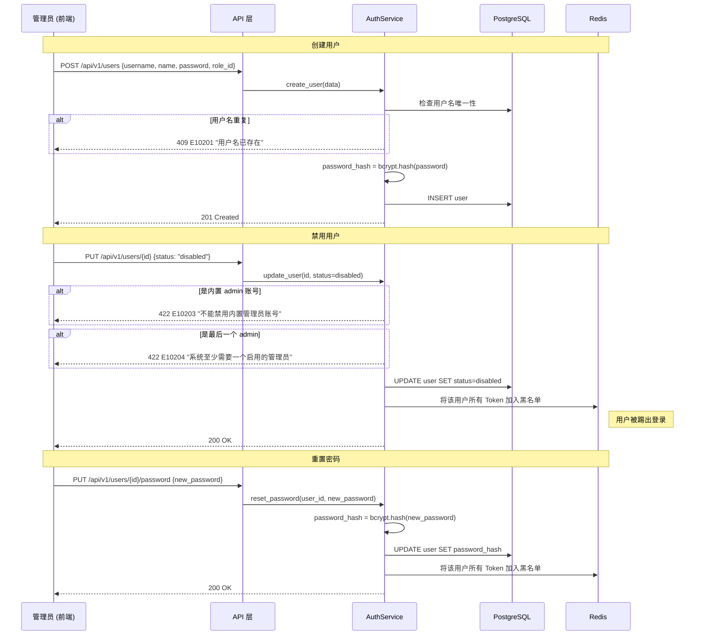

# 架构设计: 用户认证域 (User Management)

## 1. 模块概述

**职责**: 用户账号 CRUD、角色定义与管理、权限能力点分配、JWT 认证与 Token 管理、RBAC 中间件权限校验

**规模与约束**:
- 预计 2-3 名 PM 使用，用户总数不超过 10 人
- 不对接公司现有账号体系，不使用外部 IdP
- 系统初始化时内置一个超级管理员账号
- 角色支持自定义（不绑定角色名硬编码），权限校验以能力点为准 (FR-053)

**核心实体**:

| 实体 | 说明 |
|------|------|
| User | 系统用户，包含用户名、姓名、密码哈希、角色引用、状态 |
| Role | 角色定义，包含角色标识、名称、能力点集合；预设 admin / pm / tester |
| Permission | 能力点定义，每个能力点代表一项原子操作权限 |

**RBAC 模型**:

```
User  ──(N:1)──  Role  ──(1:N)──  Permission (能力点)
  │                                    │
  └── JWT Token 携带 role_id ──────────┘ 中间件按 capability_key 校验
```

权限校验以能力点 (capability) 为准，不直接检查角色名。角色是能力点的预设组合，方便批量分配。

**跨模块依赖**:

| 方向 | 模块 | 交互方式 | 说明 |
|------|------|---------|------|
| 被调用 | 全部 API 模块 | 中间件拦截 | JWT 认证 + 能力点校验 |
| 被调用 | 前端 | Token 解析 | 菜单可见性 + 按钮级权限控制 |

---

## 2. 核心数据流

### 2.1 用户登录流程

**触发点**: 用户在登录页输入凭证
**涉及模块**: API 层、AuthService、PostgreSQL、Redis
**对应 FR**: FR-001



**JWT Payload 结构**:

```json
{
  "sub": "user_001",
  "role_id": "role_admin",
  "capabilities": ["intent_library_read", "intent_library_create", "..."],
  "exp": 1711036800,
  "iat": 1711033200
}
```

**Token 配置**:

| 参数 | 值 | 说明 |
|------|-----|------|
| access_token 有效期 | 1 小时 | 短期令牌，频繁校验 |
| refresh_token 有效期 | 7 天 | 长期令牌，用于刷新 access_token |
| 签名算法 | HS256 | 自签名，无外部 IdP |

### 2.2 权限校验流程

**触发点**: 任意 API 请求
**涉及模块**: JWT 中间件、AuthService
**对应 FR**: FR-001, FR-053



### 2.3 角色与权限管理流程 (FR-001)

**触发点**: 管理员在用户管理页面操作 (`pd-user-mgmt/index.html` → 角色与权限 Tab)
**涉及模块**: API 层、AuthService、PostgreSQL



### 2.4 用户账号管理流程

**触发点**: 管理员在用户管理页面操作 (`pd-user-mgmt/index.html` → 账号管理 Tab)



---

## 3. 接口契约

### 3.1 认证 API

| 方法 | 路径 | 说明 | 权限 | 对应 FR |
|------|------|------|------|---------|
| POST | /api/v1/auth/login | 登录 | 无需认证 | FR-001 |
| POST | /api/v1/auth/logout | 登出 | 已认证 | FR-001 |
| GET | /api/v1/auth/me | 当前用户信息+权限 | 已认证 | FR-001 |
| POST | /api/v1/auth/refresh | 刷新 Token | 已认证 (refresh_token) | FR-001 |

#### 登录

**请求** (Body):

```json
{
  "username": "类型: string, 必填, 3-20 位字母数字下划线",
  "password": "类型: string, 必填, 至少 8 位"
}
```

**响应** (200):

```json
{
  "code": "000000",
  "data": {
    "access_token": "eyJhbGciOiJIUzI1NiIs...",
    "refresh_token": "eyJhbGciOiJIUzI1NiIs...",
    "token_type": "Bearer",
    "expires_in": 3600,
    "user": {
      "id": "user_001",
      "username": "admin",
      "name": "管理员",
      "role": {
        "id": "role_admin",
        "name": "系统管理员"
      },
      "capabilities": [
        "intent_library_read",
        "intent_library_create",
        "intent_library_update",
        "intent_library_delete",
        "model_train",
        "model_test_manage",
        "model_publish",
        "profile_read",
        "profile_create",
        "profile_update",
        "profile_delete",
        "profile_publish",
        "profile_test",
        "knowledge_read",
        "knowledge_manage",
        "monitoring_read",
        "monitoring_alert_manage",
        "batch_test_read",
        "batch_test_manage",
        "user_manage",
        "role_manage"
      ]
    }
  },
  "msg": "success"
}
```

#### 获取当前用户

**响应** (200):

```json
{
  "code": "000000",
  "data": {
    "id": "user_001",
    "username": "admin",
    "name": "管理员",
    "role": {
      "id": "role_admin",
      "name": "系统管理员"
    },
    "capabilities": ["intent_library_read", "..."],
    "status": "active",
    "last_login_at": "2026-03-18T08:30:00Z"
  },
  "msg": "success"
}
```

#### 刷新 Token

**请求** (Body):

```json
{
  "refresh_token": "类型: string, 必填"
}
```

**响应** (200):

```json
{
  "code": "000000",
  "data": {
    "access_token": "eyJhbGciOiJIUzI1NiIs...",
    "expires_in": 3600
  },
  "msg": "success"
}
```

#### 登出

**请求**: 无 Body (通过 Authorization header 识别用户)

**响应** (200):

```json
{
  "code": "000000",
  "data": null,
  "msg": "登出成功"
}
```

后端操作: 将 access_token 和 refresh_token 加入 Redis 黑名单。

### 3.2 用户管理 API

| 方法 | 路径 | 说明 | 权限 | 对应 FR |
|------|------|------|------|---------|
| GET | /api/v1/users | 用户列表 | user_manage | FR-001 |
| POST | /api/v1/users | 创建用户 | user_manage | FR-001 |
| GET | /api/v1/users/{id} | 用户详情 | user_manage | FR-001 |
| PUT | /api/v1/users/{id} | 更新用户 | user_manage | FR-001 |
| DELETE | /api/v1/users/{id} | 删除用户 (软删除/禁用) | user_manage | FR-001 |
| PUT | /api/v1/users/{id}/roles | 分配角色 | user_manage | FR-001 |
| PUT | /api/v1/users/{id}/password | 重置密码 | user_manage | FR-001 |

#### 创建用户

**请求** (Body):

```json
{
  "username": "类型: string, 必填, 3-20 位字母数字下划线, 全局唯一",
  "name": "类型: string, 必填, 最大 50 字符, 显示名称",
  "password": "类型: string, 必填, 最少 8 位",
  "role_id": "类型: string, 必填, 角色 ID (role_admin / role_pm / role_tester 或自定义角色)"
}
```

**响应** (201):

```json
{
  "code": "000000",
  "data": {
    "id": "user_005",
    "username": "new_pm",
    "name": "新 PM",
    "role": {
      "id": "role_pm",
      "name": "产品经理"
    },
    "status": "active",
    "created_at": "2026-03-18T10:00:00Z",
    "last_login_at": null
  },
  "msg": "success"
}
```

#### 用户列表

**请求** (Query): 无分页（用户数量 < 10）

**响应** (200):

```json
{
  "code": "000000",
  "data": {
    "items": [
      {
        "id": "user_001",
        "username": "admin",
        "name": "管理员",
        "role": {
          "id": "role_admin",
          "name": "系统管理员"
        },
        "status": "active",
        "created_at": "2026-02-01T00:00:00Z",
        "last_login_at": "2026-03-18T08:30:00Z"
      }
    ],
    "total": 4
  },
  "msg": "success"
}
```

#### 更新用户

**请求** (Body):

```json
{
  "name": "类型: string, 可选, 最大 50 字符",
  "status": "类型: string, 可选, enum: active/disabled"
}
```

#### 分配角色

**请求** (Body):

```json
{
  "role_id": "类型: string, 必填, 角色 ID"
}
```

#### 重置密码

**请求** (Body):

```json
{
  "new_password": "类型: string, 必填, 最少 8 位"
}
```

**响应** (200):

```json
{
  "code": "000000",
  "data": null,
  "msg": "密码已重置，用户需重新登录"
}
```

### 3.3 角色管理 API

| 方法 | 路径 | 说明 | 权限 | 对应 FR |
|------|------|------|------|---------|
| GET | /api/v1/roles | 角色列表 | role_manage | FR-001 |
| POST | /api/v1/roles | 创建角色 | role_manage | FR-001 |
| GET | /api/v1/roles/{id} | 角色详情 | role_manage | FR-001 |
| PUT | /api/v1/roles/{id} | 更新角色 | role_manage | FR-001 |
| DELETE | /api/v1/roles/{id} | 删除角色 | role_manage | FR-001 |
| GET | /api/v1/roles/{id}/permissions | 角色权限列表 | role_manage | FR-001 |
| PUT | /api/v1/roles/{id}/permissions | 更新角色权限 | role_manage | FR-001 |
| GET | /api/v1/permissions | 全部能力点列表 | role_manage | FR-001 |

#### 创建角色

**请求** (Body):

```json
{
  "name": "类型: string, 必填, 最大 30 字符, 全局唯一",
  "description": "类型: string, 可选, 最大 200 字符",
  "permissions": "类型: string[], 必填, 能力点 key 数组"
}
```

**响应** (201):

```json
{
  "code": "000000",
  "data": {
    "id": "role_custom_001",
    "name": "高级编辑",
    "description": "可管理指令库和知识库，但不能发布",
    "permissions": ["intent_library_read", "intent_library_create", "intent_library_update", "knowledge_read", "knowledge_manage"],
    "user_count": 0,
    "is_builtin": false,
    "created_at": "2026-03-18T10:00:00Z"
  },
  "msg": "success"
}
```

#### 角色列表

**响应** (200):

```json
{
  "code": "000000",
  "data": {
    "items": [
      {
        "id": "role_admin",
        "name": "系统管理员",
        "description": "拥有所有权限",
        "permissions_count": 21,
        "user_count": 1,
        "is_builtin": true
      },
      {
        "id": "role_pm",
        "name": "产品经理",
        "description": "管理指令库、方案、知识库，可申请发布",
        "permissions_count": 15,
        "user_count": 2,
        "is_builtin": true
      },
      {
        "id": "role_tester",
        "name": "测试人员",
        "description": "只读访问 + 执行测试",
        "permissions_count": 8,
        "user_count": 1,
        "is_builtin": true
      }
    ],
    "total": 3
  },
  "msg": "success"
}
```

#### 更新角色权限

**请求** (Body):

```json
{
  "permissions": "类型: string[], 必填, 完整的能力点 key 列表 (全量替换)"
}
```

#### 全部能力点列表

**响应** (200):

```json
{
  "code": "000000",
  "data": {
    "items": [
      {"key": "intent_library_read", "label": "查看指令库", "module": "指令库"},
      {"key": "intent_library_create", "label": "创建指令库", "module": "指令库"},
      "..."
    ],
    "total": 21
  },
  "msg": "success"
}
```

### 3.4 权限能力点清单

以下是系统中所有能力点的完整定义，供角色配置和 API 权限校验使用：

| 能力点 Key | 说明 | 所属模块 | 备注 |
|-----------|------|---------|------|
| intent_library_read | 查看指令库列表和详情 | 指令库 | |
| intent_library_create | 创建指令库 | 指令库 | |
| intent_library_update | 编辑指令库 | 指令库 | |
| intent_library_delete | 删除指令库 | 指令库 | |
| model_train | 创建训练/评估任务 | 指令库 | |
| model_test_manage | 管理 testable 状态 | 指令库 | FR-053 |
| model_publish | 发布模型 | 指令库 | FR-053 |
| profile_read | 查看对话方案 | 对话方案 | |
| profile_create | 创建对话方案 | 对话方案 | |
| profile_update | 编辑对话方案 | 对话方案 | |
| profile_delete | 删除对话方案 | 对话方案 | |
| profile_publish | 发布对话方案版本 | 对话方案 | |
| profile_test | 手动测试对话 | 对话方案 | |
| knowledge_read | 查看知识库分类和文档 | 知识库 | |
| knowledge_manage | 上传/编辑/删除知识库 | 知识库 | |
| monitoring_read | 查看监控仪表盘和日志 | 监控 | |
| monitoring_alert_manage | 管理告警规则 | 监控 | |
| batch_test_read | 查看批量测试任务和报告 | 批量测试 | |
| batch_test_manage | 创建/执行批量测试 | 批量测试 | |
| user_manage | 管理用户账号 | 系统 | |
| role_manage | 管理角色和权限分配 | 系统 | |

**预设角色与能力点映射**:

| 能力点 | admin | pm | tester |
|--------|-------|----|--------|
| intent_library_read | ✅ | ✅ | ✅ |
| intent_library_create | ✅ | ✅ | ❌ |
| intent_library_update | ✅ | ✅* | ❌ |
| intent_library_delete | ✅ | ✅* | ❌ |
| model_train | ✅ | ✅ | ❌ |
| model_test_manage | ✅ | ✅ | ✅ |
| model_publish | ✅ | ❌ | ❌ |
| profile_read | ✅ | ✅ | ✅ |
| profile_create | ✅ | ✅ | ❌ |
| profile_update | ✅ | ✅ | ❌ |
| profile_delete | ✅ | ✅ | ❌ |
| profile_publish | ✅ | ❌ | ❌ |
| profile_test | ✅ | ✅ | ✅ |
| knowledge_read | ✅ | ✅ | ✅ |
| knowledge_manage | ✅ | ✅ | ❌ |
| monitoring_read | ✅ | ✅ | ✅ |
| monitoring_alert_manage | ✅ | ❌ | ❌ |
| batch_test_read | ✅ | ✅ | ✅ |
| batch_test_manage | ✅ | ✅ | ✅ |
| user_manage | ✅ | ❌ | ❌ |
| role_manage | ✅ | ❌ | ❌ |

> `*` PM 的 intent_library_update/delete 仅限自己创建的指令库 (由业务层二次校验 owner)

---

## 4. 异常处理汇总

| 错误码 | 模块 | HTTP 状态 | 场景 | 用户提示 |
|--------|------|----------|------|---------|
| E10101 | 认证 | 401 | 用户名或密码错误 | 用户名或密码错误 |
| E10102 | 认证 | 401 | 未携带 Token | 请先登录 |
| E10103 | 认证 | 403 | 账号已被禁用 | 账号已被禁用，请联系管理员 |
| E10104 | 认证 | 401 | Token 已过期 | Token 已过期，请重新登录 |
| E10105 | 认证 | 401 | Token 签名无效 | Token 无效 |
| E10106 | 认证 | 401 | Token 已在黑名单 (登出/禁用) | Token 已失效 |
| E10107 | 授权 | 403 | 无对应能力点 | 无权限执行此操作 |
| E10201 | 用户 | 409 | 用户名重复 | 用户名已存在 |
| E10202 | 用户 | 404 | 用户不存在 | 用户不存在 |
| E10203 | 用户 | 422 | 禁用内置 admin | 不能禁用内置管理员账号 |
| E10204 | 用户 | 422 | 禁用最后一个 admin | 系统至少需要一个启用的管理员 |
| E10205 | 用户 | 422 | 密码强度不足 | 密码至少 8 位，需包含字母和数字 |
| E10301 | 角色 | 409 | 角色名称重复 | 角色名称已存在 |
| E10302 | 角色 | 422 | 删除角色时有关联用户 | 该角色下有用户，请先迁移用户角色 |
| E10303 | 角色 | 422 | 删除内置角色 | 内置角色不可删除 |
| E10304 | 角色 | 404 | 角色不存在 | 角色不存在 |

**错误码编码规则**: `E1XXYY`
- `1` = 用户认证模块
- `XX` = 子模块 (01=认证, 02=用户, 03=角色)
- `YY` = 序号

---

## 5. 模块级风险

| 风险 | 影响 | 可能性 | 缓解策略 |
|-----|------|--------|---------|
| JWT 密钥泄露导致伪造 Token | 高 | 低 | 密钥存储在环境变量，不入代码仓库；定期轮换密钥；增加 Token 黑名单机制 |
| 权限传播延迟（角色修改后已登录用户仍使用旧权限） | 中 | 高 | access_token 有效期设为 1h 限制影响窗口；关键操作（如发布）后端实时查库校验 |
| 内置 admin 密码使用默认值未修改 | 高 | 中 | 系统首次登录强制修改默认密码；默认密码为随机生成并写入初始化日志 |
| 暴力破解登录 | 中 | 中 | 登录接口限速 (5次/分钟 per IP)；连续失败 5 次锁定 15 分钟 |

---

## 6. 需求追溯

| FR 编号 | 需求摘要 | AD 章节 | 覆盖状态 |
|---------|---------|---------|---------|
| FR-001 | 角色权限管理、内置管理员、创建账号、分配角色和菜单权限 | §2.1 登录流程, §2.2 权限校验, §2.3 角色管理, §2.4 用户管理, §3.1~3.4 全部 API | ✅ 完整 |
| FR-053 | 权限校验以能力点为准不绑定角色名 | §1 RBAC 模型, §2.2 权限校验流程, §3.4 能力点清单 | ✅ 完整 |

---

## 7. 产出物合规检查表 (vs ad-template.md v2.2)

| 模板条款 | 状态 | 说明 |
|---------|------|------|
| §2.3 数据流驱动 | ✅ | 4 个流程有 Mermaid 序列图 (登录、权限校验、角色管理、用户管理) |
| §5 数据流含异常分支 | ✅ | 登录含凭证错误/禁用/Token 异常；管理含唯一性冲突/保护规则 |
| §6.1 响应信封统一 | ✅ | 所有 API 使用 code/data/msg 信封 |
| §10.3 CRUD 完整性 | ✅ | 认证 4 接口 + 用户 7 接口 + 角色 8 接口 + 能力点列表 |
| §2.5 安全作为约束 | ✅ | JWT + bcrypt + Token 黑名单 + 登录限速 |
| §7.3 追溯矩阵 | ✅ | FR-001, FR-053 全部映射 |
