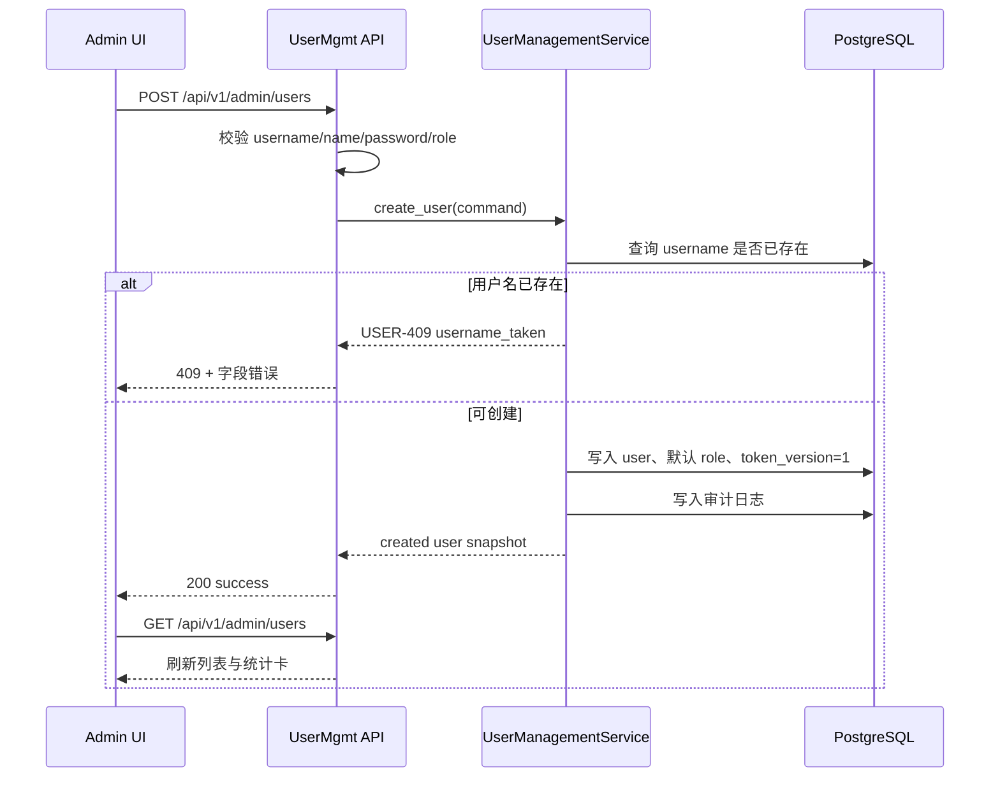
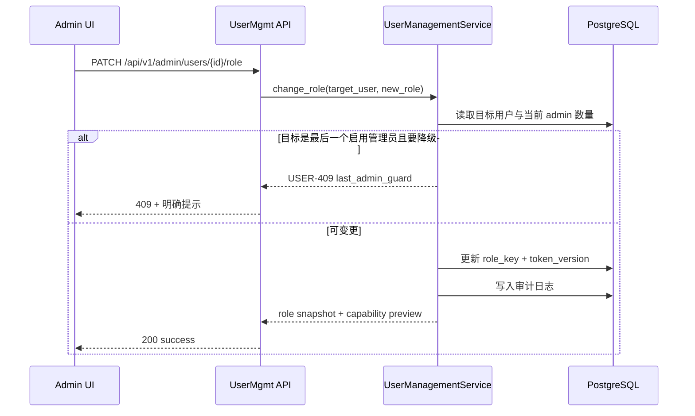
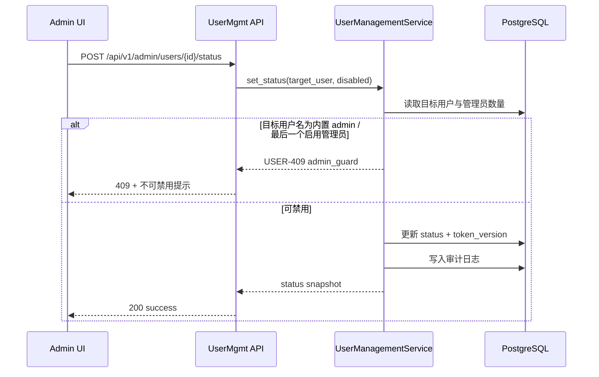

# 用户管理模块架构设计

## 1. 模块职责与边界

| 子模块 | 职责 | 不负责 |
|--------|------|--------|
| `user directory` | 账号列表、创建账号、启停用、最后登录信息 | 公司统一账号体系、批量导入 |
| `role assignment` | 给用户分配内置角色 `admin/pm/tester` | 自定义角色设计器 |
| `capability matrix` | 展示角色与能力点映射，用于菜单与按钮可见性解释 | 业务模块内部细粒度策略执行 |
| `credential ops` | 管理员触发重置密码 | 用户自主改密流程 |

## 2. 模块关系与调用

| 调用方 | 被调方 | 通信方式 | 同步/异步 | 失败策略 |
|--------|--------|---------|----------|---------|
| `frontend/modules/user-mgmt` | `GET /api/v1/admin/users` | REST | 同步 | 展示错误态并保持当前列表 |
| `frontend/modules/user-mgmt` | `POST /api/v1/admin/users` | REST | 同步 | 表单保留输入并显示字段错误 |
| `frontend/modules/user-mgmt` | `PATCH /api/v1/admin/users/{id}/role` | REST | 同步 | 回滚弹窗状态，不刷新列表 |
| `frontend/modules/user-mgmt` | `POST /api/v1/admin/users/{id}/reset-password` | REST | 同步 | 明确提示重置失败 |
| `frontend/modules/user-mgmt` | `POST /api/v1/admin/users/{id}/status` | REST | 同步 | 保持开关原值并显示原因 |
| `backend/app/services/user_mgmt` | `audit log` | 领域事件/同步写库 | 同步 | 审计失败即整单失败，避免假成功 |

## 3. 核心数据流

### 3.1 创建账号闭环

**触发点**: 管理员点击“新建账号”并提交表单  
**涉及模块**: 前端用户管理页、API 层、UserManagementService、PostgreSQL  
**对应 FR**: FR-001



### 3.2 角色调整与菜单可见性闭环

**触发点**: 管理员在“编辑角色”弹窗中保存  
**涉及模块**: 前端用户管理页、API 层、RoleResolver、PostgreSQL  
**对应 FR**: FR-001



### 3.3 禁用账号闭环

**触发点**: 管理员切换启停用开关  
**涉及模块**: 前端用户管理页、API 层、SessionGuard、PostgreSQL  
**对应 FR**: FR-001



## 4. 接口契约

### 4.1 `GET /api/v1/admin/users`

- **能力点**: `user_manage`
- **输入**: 无分页；可选 `status`、`role`
- **输出**:

```json
{
  "code": "000000",
  "message": "success",
  "data": {
    "items": [
      {
        "id": "user_001",
        "username": "admin",
        "name": "管理员",
        "role": "admin",
        "status": "active",
        "created_at": "2026-03-18",
        "last_login_at": "2026-03-30T09:00:00Z"
      }
    ],
    "summary": {
      "total": 4,
      "admin_count": 1,
      "pm_count": 2,
      "tester_count": 1
    }
  }
}
```

### 4.2 `POST /api/v1/admin/users`

- **能力点**: `user_manage`
- **输入**:

```json
{
  "username": "wang_pm",
  "name": "小王",
  "password": "Abc12345",
  "role": "pm"
}
```

- **错误码**:

| 错误码 | 场景 | HTTP |
|--------|------|------|
| `USER-409-USERNAME` | 用户名已存在 | 409 |
| `USER-422-USERNAME` | 用户名不是 3-20 位字母数字下划线 | 422 |
| `USER-422-PASSWORD` | 密码长度 < 8 | 422 |

### 4.3 `PATCH /api/v1/admin/users/{id}/role`

- **能力点**: `user_manage`
- **输入**:

```json
{
  "role": "tester"
}
```

- **输出**: 返回目标用户最新角色与能力点快照
- **错误码**:

| 错误码 | 场景 | HTTP |
|--------|------|------|
| `USER-404-NOT-FOUND` | 用户不存在 | 404 |
| `USER-409-LAST-ADMIN` | 尝试降级最后一个启用管理员 | 409 |

### 4.4 `POST /api/v1/admin/users/{id}/reset-password`

- **能力点**: `user_manage`
- **输入**: 无 body
- **输出**:

```json
{
  "code": "000000",
  "message": "success",
  "data": {
    "temporary_password": "Abc12345",
    "require_password_change": true
  }
}
```

### 4.5 `POST /api/v1/admin/users/{id}/status`

- **能力点**: `user_manage`
- **输入**:

```json
{
  "status": "disabled"
}
```

- **错误码**:

| 错误码 | 场景 | HTTP |
|--------|------|------|
| `USER-409-BUILTIN-ADMIN` | 尝试禁用内置 admin | 409 |
| `USER-409-LAST-ADMIN` | 尝试禁用最后一个启用管理员 | 409 |

### 4.6 `GET /api/v1/admin/permission-matrix`

- **能力点**: `user_manage`
- **输入**: 无
- **输出**: 角色、能力点、条件说明三元组，用于页面“权限矩阵”与角色弹窗预览

## 5. FR 追溯

| FR | 需求 | 设计落实 |
|----|------|---------|
| FR-001 | 创建账号、分配角色和菜单权限 | `GET/POST/PATCH/POST/GET` 五组接口 + capability-based RBAC + 前后端菜单联动 |

## 6. 风险与缓解

| 风险 | 影响 | 缓解 |
|------|------|------|
| 固定角色集 | 短期无法自定义角色 | 在 `permission-matrix` 契约中保留角色与能力点解耦结构，后续可平滑扩展 |
| 菜单权限刷新滞后 | 用户刚改角色但旧菜单仍显示 | 更新角色时提升 `token_version`，要求重新登录后刷新菜单 |
| 统计卡假成功 | 前端只本地累加不回读 | 所有写操作成功后统一回读 `GET /admin/users`，以接口返回 `summary` 为准 |
