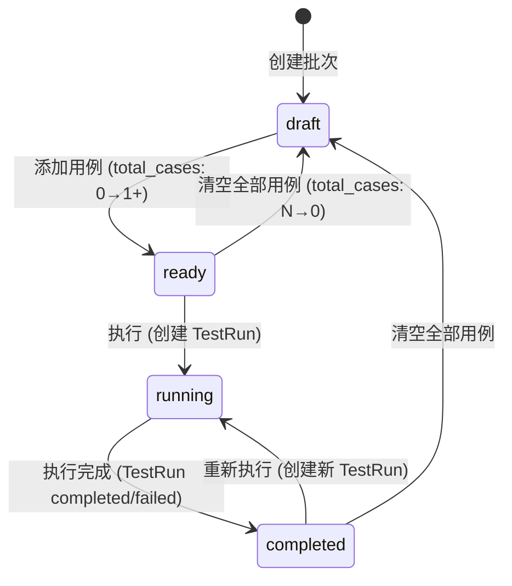
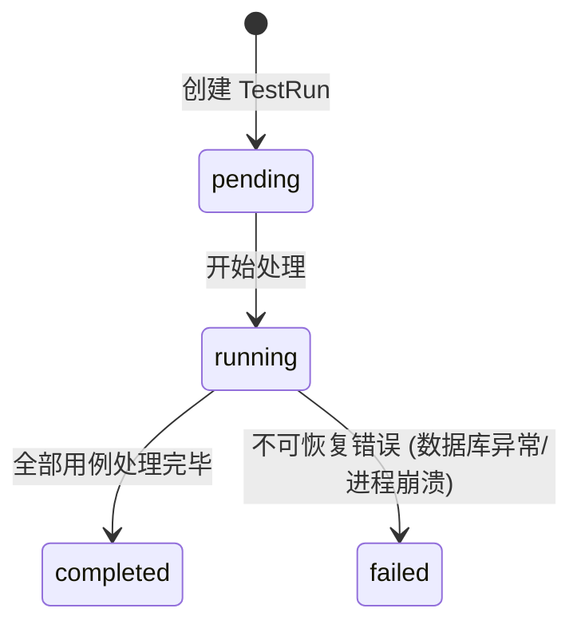

# 详细设计 (DD): 批量测试域 (Batch Test)

## 1. 文档说明

本文档定义批量测试域的字段级数据模型、状态机、核心算法、错误码、配置项及 API 实现映射。

**前置依赖**: `dd-global.md` 中已定义 `User`、错误码体系 (§4, 模块 40)、权限模型 (§5)、全局配置 (§6)。本文档不重复定义这些公共实体。

**模块实体清单** (4 个 PostgreSQL 实体):

| # | 实体 | 表名 | 对应 FR | 说明 |
|---|------|------|---------|------|
| 1 | BatchTest | `batch_tests` | FR-012 | 批量测试集主表 |
| 2 | TestCase | `test_cases` | FR-012, FR-013 | 测试用例 |
| 3 | TestRun | `test_runs` | FR-013 | 测试执行记录 |
| 4 | TestRunAnalysis | `test_run_analyses` | FR-014, FR-052 | 智能分析报告 |

---

## 2. 设计原则

遵循 dd-template.md §2:

- **一对一可编码**: 每个实体直接映射 SQLAlchemy Model；每个状态转移映射 Service 方法
- **约束显式化**: 字符串有 max_length, 数值有 range, 枚举列出所有值, 无模糊词
- **向后兼容**: 字段新增不移除, 枚举新增不删除

---

## 3. 数据模型

### 3.1 实体: BatchTest (批量测试集)

**对应 FR**: FR-012
**对应 AD**: ad-batch-test.md §1.3, §2.1, §3.1
**表名**: `batch_tests`

| 字段 | 类型 | 约束 | 默认值 | 索引 | 说明 |
|------|------|------|--------|------|------|
| id | UUID | PK | gen_random_uuid() | 主键 | 唯一标识 |
| name | VARCHAR(100) | NOT NULL | - | 联合唯一索引 | 批次名称, 1~100 字符, 同 profile 内唯一 |
| profile_id | UUID | NOT NULL, FK(dialog_profiles.id) | - | 普通索引 | 关联对话方案 ID |
| description | VARCHAR(500) | NULL | NULL | - | 批次描述 |
| status | VARCHAR(16) | NOT NULL | 'draft' | 普通索引 | 状态枚举, 见 §4.1 |
| total_cases | INTEGER | NOT NULL | 0 | - | 用例总数 (应用层维护, 增删用例时同步) |
| performance_targets | JSONB | NOT NULL | 见下方 | - | 性能达标阈值, schema 见下方 |
| created_by | UUID | NOT NULL, FK(users.id) | - | 普通索引 | 创建人 |
| created_at | TIMESTAMP(TZ) | NOT NULL | now() | - | 创建时间 |
| updated_at | TIMESTAMP(TZ) | NOT NULL | now() | - | 更新时间 |

**字段校验规则**:

| 字段 | 规则 | 说明 |
|------|------|------|
| name | `^.{1,100}$`, UNIQUE per (profile_id, name) | 同方案内唯一, 重复返回 E40103 |
| profile_id | 存在于 dialog_profiles | 不存在返回 E40101 |
| performance_targets.accuracy_threshold | `0.0 <= val <= 100.0` | 百分比, 超范围返回 E40104 |
| performance_targets.latency_threshold_ms | `1 <= val <= 10000` | 毫秒, 超范围返回 E40104 |

**performance_targets JSONB Schema**:

```json
{
  "accuracy_threshold": { "type": "float", "required": false, "default": 95.0, "min": 0.0, "max": 100.0, "description": "准确率达标阈值 (%)" },
  "latency_threshold_ms": { "type": "int", "required": false, "default": 200, "min": 1, "max": 10000, "description": "平均延迟达标阈值 (ms)" }
}
```

**performance_targets 默认值**: `'{"accuracy_threshold": 95.0, "latency_threshold_ms": 200}'`

#### 索引

| 索引名 | 字段 | 类型 | 用途 |
|--------|------|------|------|
| uq_bt_profile_name | (profile_id, name) | B-Tree, UNIQUE | 同方案批次名称唯一 |
| idx_bt_profile_id | (profile_id) | B-Tree | 按方案筛选 |
| idx_bt_status | (status) | B-Tree | 按状态筛选 |
| idx_bt_created_by | (created_by) | B-Tree | 按创建人筛选 |
| idx_bt_created_at | (created_at DESC) | B-Tree | 默认排序 |

#### 关系

| 关系 | 目标实体 | 类型 | 外键 | 级联策略 |
|------|---------|------|------|---------|
| 关联方案 | DialogProfile (dd-dialog-profile §3.1) | 多对一 | batch_tests.profile_id | RESTRICT (方案存在批次时不可删) |
| 用例列表 | TestCase | 一对多 | test_cases.batch_test_id | CASCADE DELETE |
| 执行记录 | TestRun | 一对多 | test_runs.batch_test_id | CASCADE DELETE |
| 创建人 | User (dd-global §3.1) | 多对一 | batch_tests.created_by | RESTRICT |

---

### 3.2 实体: TestCase (测试用例)

**对应 FR**: FR-012, FR-013
**对应 AD**: ad-batch-test.md §1.3, §3.2
**表名**: `test_cases`

| 字段 | 类型 | 约束 | 默认值 | 索引 | 说明 |
|------|------|------|--------|------|------|
| id | UUID | PK | gen_random_uuid() | 主键 | 唯一标识 |
| batch_test_id | UUID | NOT NULL, FK(batch_tests.id) | - | 普通索引 | 所属批次 ID |
| text | VARCHAR(500) | NOT NULL | - | - | 用户输入语句, 1~500 字符 |
| expected_route | VARCHAR(20) | NOT NULL | - | - | 预期路由, 枚举: `command` / `knowledge` / `chitchat` |
| expected_intent | VARCHAR(128) | NULL | NULL | - | 预期意图名称, command 路由时必填 |
| expected_slots | JSONB | NOT NULL | '[]' | - | 预期槽位列表, schema 见下方 |
| actual_route | VARCHAR(20) | NULL | NULL | - | 实际路由 (执行后填充) |
| actual_intent | VARCHAR(128) | NULL | NULL | - | 实际意图 (执行后填充) |
| actual_slots | JSONB | NULL | NULL | - | 实际槽位 (执行后填充) |
| confidence | DECIMAL(5,4) | NULL | NULL | - | 推理置信度, 范围 0.0000~1.0000 |
| latency_ms | INTEGER | NULL | NULL | - | 推理耗时 (ms) |
| is_pass | BOOLEAN | NULL | NULL | - | 是否通过, NULL=未执行 |
| source | VARCHAR(16) | NOT NULL | 'manual' | 普通索引 | 来源, 枚举: `manual` / `auto` / `imported` |
| created_at | TIMESTAMP(TZ) | NOT NULL | now() | - | 创建时间 |
| executed_at | TIMESTAMP(TZ) | NULL | NULL | - | 最后执行时间 |

**字段校验规则**:

| 字段 | 规则 | 说明 |
|------|------|------|
| text | `1 <= len <= 500`, NOT NULL | 空文本返回 E40203 |
| expected_route | IN ('command', 'knowledge', 'chitchat') | 无效值返回 E40203 |
| expected_intent | required IF expected_route='command' | command 路由缺少意图返回 E40204 |
| source | IN ('manual', 'auto', 'imported') | 仅三种来源 |
| confidence | `0.0000 <= val <= 1.0000` | 由 NLU Pipeline 写入 |

**expected_slots / actual_slots JSONB Schema**:

```json
[
  {
    "name": { "type": "string", "required": true, "description": "槽位名称" },
    "value": { "type": "string", "required": true, "description": "槽位值" }
  }
]
```

#### 索引

| 索引名 | 字段 | 类型 | 用途 |
|--------|------|------|------|
| idx_tc_batch_test_id | (batch_test_id) | B-Tree | 按批次查用例列表 |
| idx_tc_batch_is_pass | (batch_test_id, is_pass) | B-Tree | 按通过状态筛选 |
| idx_tc_batch_route | (batch_test_id, expected_route) | B-Tree | 按路由筛选 |
| idx_tc_batch_source | (batch_test_id, source) | B-Tree | 按来源筛选 |

#### 关系

| 关系 | 目标实体 | 类型 | 外键 | 级联策略 |
|------|---------|------|------|---------|
| 所属批次 | BatchTest | 多对一 | test_cases.batch_test_id | CASCADE (随批次删除) |

---

### 3.3 实体: TestRun (测试执行)

**对应 FR**: FR-013
**对应 AD**: ad-batch-test.md §2.2
**表名**: `test_runs`

| 字段 | 类型 | 约束 | 默认值 | 索引 | 说明 |
|------|------|------|--------|------|------|
| id | UUID | PK | gen_random_uuid() | 主键 | 唯一标识 |
| batch_test_id | UUID | NOT NULL, FK(batch_tests.id) | - | 普通索引 | 所属批次 ID |
| status | VARCHAR(16) | NOT NULL | 'pending' | 普通索引 | 状态枚举, 见 §4.2 |
| total_cases | INTEGER | NOT NULL | 0 | - | 执行时的用例总数快照 |
| passed_cases | INTEGER | NOT NULL | 0 | - | 通过用例数 |
| failed_cases | INTEGER | NOT NULL | 0 | - | 失败用例数 |
| accuracy | DECIMAL(5,2) | NULL | NULL | - | 准确率 (%), 范围 0.00~100.00 |
| avg_latency_ms | INTEGER | NULL | NULL | - | 平均延迟 (ms) |
| started_at | TIMESTAMP(TZ) | NULL | NULL | - | 开始执行时间 |
| finished_at | TIMESTAMP(TZ) | NULL | NULL | - | 完成时间 |
| error_message | TEXT | NULL | NULL | - | 系统级错误信息 (仅 failed 状态) |

**业务规则**:
- 每个 BatchTest 可有多个 TestRun (每次执行创建一条)
- 全局同一时刻仅允许 **1 个** `status='running'` 的 TestRun (互斥锁)
- `accuracy = (passed_cases / total_cases) * 100`, 执行完成时计算

#### 索引

| 索引名 | 字段 | 类型 | 用途 |
|--------|------|------|------|
| idx_tr_batch_test_id | (batch_test_id) | B-Tree | 按批次查执行记录 |
| idx_tr_status | (status) | B-Tree | 查找 running 状态做互斥 |
| idx_tr_batch_finished | (batch_test_id, finished_at DESC) | B-Tree | 获取最新完成的 run |
| uq_tr_running | (status) WHERE status='running' | B-Tree, UNIQUE partial | 全局最多 1 个 running |

#### 关系

| 关系 | 目标实体 | 类型 | 外键 | 级联策略 |
|------|---------|------|------|---------|
| 所属批次 | BatchTest | 多对一 | test_runs.batch_test_id | CASCADE (随批次删除) |
| 分析报告 | TestRunAnalysis | 一对一 (0..1) | test_run_analyses.run_id | CASCADE DELETE |

---

### 3.4 实体: TestRunAnalysis (智能分析)

**对应 FR**: FR-014, FR-052
**对应 AD**: ad-batch-test.md §2.3
**表名**: `test_run_analyses`

| 字段 | 类型 | 约束 | 默认值 | 索引 | 说明 |
|------|------|------|--------|------|------|
| id | UUID | PK | gen_random_uuid() | 主键 | 唯一标识 |
| run_id | UUID | NOT NULL, FK(test_runs.id), UNIQUE | - | 唯一索引 | 关联执行记录, 1:1 |
| overall_conclusion | TEXT | NOT NULL | - | - | 总体结论 (1~2 句话) |
| confused_intents | JSONB | NOT NULL | '[]' | - | 混淆意图对列表, schema 见下方 |
| slot_error_distribution | JSONB | NOT NULL | '[]' | - | 槽位错误分布, schema 见下方 |
| low_score_samples | JSONB | NOT NULL | '[]' | - | 低分样本清单, schema 见下方 |
| improvement_suggestions | JSONB | NOT NULL | '[]' | - | 改进建议, schema 见下方 |
| created_at | TIMESTAMP(TZ) | NOT NULL | now() | - | 生成时间 |

**confused_intents JSONB Schema**:

```json
[
  {
    "expected_intent": "string — 预期意图",
    "actual_intent": "string — 实际被误分类的意图",
    "count": "int — 混淆次数",
    "severity": "string — 严重程度, 枚举: critical (>=3次) / moderate (2次) / low (1次)",
    "sample_texts": ["string — 代表性样本文本, 最多 5 条"]
  }
]
```

**slot_error_distribution JSONB Schema**:

```json
[
  {
    "slot_name": "string — 槽位名称",
    "error_type": "string — 错误类型, 枚举: value_missing / value_wrong / reference_unresolved / type_mismatch",
    "count": "int — 错误次数",
    "description": "string — 错误描述"
  }
]
```

**low_score_samples JSONB Schema**:

```json
[
  {
    "case_id": "uuid — 用例 ID",
    "text": "string — 用户输入",
    "expected_intent": "string|null — 预期意图",
    "actual_intent": "string|null — 实际意图",
    "confidence": "float — 置信度",
    "root_cause_category": "string — 根因分类, 枚举: expression_coverage / route_error / slot_extraction / knowledge_miss"
  }
]
```

**improvement_suggestions JSONB Schema**:

```json
[
  {
    "priority": "int — 优先级, 1=最高",
    "category": "string — 建议分类, 枚举: training_data / routing_strategy / slot_config / knowledge_index / test_env",
    "suggestion": "string — 具体建议文本",
    "affected_intents": ["string — 受影响的意图列表"]
  }
]
```

#### 索引

| 索引名 | 字段 | 类型 | 用途 |
|--------|------|------|------|
| uq_tra_run_id | (run_id) | B-Tree, UNIQUE | 每 run 最多一份分析 |

#### 关系

| 关系 | 目标实体 | 类型 | 外键 | 级联策略 |
|------|---------|------|------|---------|
| 关联执行 | TestRun | 一对一 | test_run_analyses.run_id | CASCADE (随 run 删除) |

---

### 3.5 ER 关系图 (模块范围)

```
DialogProfile (1)                    [跨模块, dd-dialog-profile]
  │
  └──(1:N)──── BatchTest (*)
                  │
                  │──(1:N)──── TestCase (*)
                  │
                  │──(1:N)──── TestRun (*)
                  │                │
                  │                └──(1:1)──── TestRunAnalysis (0..1)
                  │
                  └── created_by ──(N:1)──── User (1)
                                               [dd-global §3.1]

唯一性约束:
  - BatchTest (profile_id, name): 同方案内批次名唯一
  - TestRun (status) WHERE status='running': 全局最多 1 个执行中
  - TestRunAnalysis (run_id): 每次执行最多 1 份分析
```

### 3.6 数据迁移

**Alembic 迁移脚本要点**:

| 操作 | 迁移策略 | 停机 |
|------|---------|------|
| 创建 batch_tests | `op.create_table(...)` 含所有索引 | 无 |
| 创建 test_cases | `op.create_table(...)` 含联合索引 | 无 |
| 创建 test_runs | `op.create_table(...)` 含 partial unique index | 无 |
| 创建 test_run_analyses | `op.create_table(...)` 含 UNIQUE on run_id | 无 |
| 后续新增列 | ALTER ADD COLUMN + server_default | 无 |

```sql
-- migration: create_batch_test_tables
CREATE TABLE batch_tests (
    id UUID PRIMARY KEY DEFAULT gen_random_uuid(),
    name VARCHAR(100) NOT NULL,
    profile_id UUID NOT NULL REFERENCES dialog_profiles(id) ON DELETE RESTRICT,
    description VARCHAR(500),
    status VARCHAR(16) NOT NULL DEFAULT 'draft'
        CHECK (status IN ('draft', 'ready', 'running', 'completed')),
    total_cases INTEGER NOT NULL DEFAULT 0
        CHECK (total_cases >= 0),
    performance_targets JSONB NOT NULL
        DEFAULT '{"accuracy_threshold": 95.0, "latency_threshold_ms": 200}',
    created_by UUID NOT NULL REFERENCES users(id),
    created_at TIMESTAMPTZ NOT NULL DEFAULT now(),
    updated_at TIMESTAMPTZ NOT NULL DEFAULT now(),
    CONSTRAINT uq_bt_profile_name UNIQUE (profile_id, name)
);
CREATE INDEX idx_bt_profile_id ON batch_tests (profile_id);
CREATE INDEX idx_bt_status ON batch_tests (status);
CREATE INDEX idx_bt_created_by ON batch_tests (created_by);
CREATE INDEX idx_bt_created_at ON batch_tests (created_at DESC);

CREATE TABLE test_cases (
    id UUID PRIMARY KEY DEFAULT gen_random_uuid(),
    batch_test_id UUID NOT NULL REFERENCES batch_tests(id) ON DELETE CASCADE,
    text VARCHAR(500) NOT NULL,
    expected_route VARCHAR(20) NOT NULL
        CHECK (expected_route IN ('command', 'knowledge', 'chitchat')),
    expected_intent VARCHAR(128),
    expected_slots JSONB NOT NULL DEFAULT '[]',
    actual_route VARCHAR(20),
    actual_intent VARCHAR(128),
    actual_slots JSONB,
    confidence DECIMAL(5,4)
        CHECK (confidence IS NULL OR (confidence >= 0.0 AND confidence <= 1.0)),
    latency_ms INTEGER
        CHECK (latency_ms IS NULL OR latency_ms >= 0),
    is_pass BOOLEAN,
    source VARCHAR(16) NOT NULL DEFAULT 'manual'
        CHECK (source IN ('manual', 'auto', 'imported')),
    created_at TIMESTAMPTZ NOT NULL DEFAULT now(),
    executed_at TIMESTAMPTZ
);
CREATE INDEX idx_tc_batch_test_id ON test_cases (batch_test_id);
CREATE INDEX idx_tc_batch_is_pass ON test_cases (batch_test_id, is_pass);
CREATE INDEX idx_tc_batch_route ON test_cases (batch_test_id, expected_route);
CREATE INDEX idx_tc_batch_source ON test_cases (batch_test_id, source);

CREATE TABLE test_runs (
    id UUID PRIMARY KEY DEFAULT gen_random_uuid(),
    batch_test_id UUID NOT NULL REFERENCES batch_tests(id) ON DELETE CASCADE,
    status VARCHAR(16) NOT NULL DEFAULT 'pending'
        CHECK (status IN ('pending', 'running', 'completed', 'failed')),
    total_cases INTEGER NOT NULL DEFAULT 0,
    passed_cases INTEGER NOT NULL DEFAULT 0,
    failed_cases INTEGER NOT NULL DEFAULT 0,
    accuracy DECIMAL(5,2)
        CHECK (accuracy IS NULL OR (accuracy >= 0.00 AND accuracy <= 100.00)),
    avg_latency_ms INTEGER,
    started_at TIMESTAMPTZ,
    finished_at TIMESTAMPTZ,
    error_message TEXT
);
CREATE INDEX idx_tr_batch_test_id ON test_runs (batch_test_id);
CREATE INDEX idx_tr_status ON test_runs (status);
CREATE INDEX idx_tr_batch_finished ON test_runs (batch_test_id, finished_at DESC);
CREATE UNIQUE INDEX uq_tr_running ON test_runs (status) WHERE status = 'running';

CREATE TABLE test_run_analyses (
    id UUID PRIMARY KEY DEFAULT gen_random_uuid(),
    run_id UUID NOT NULL REFERENCES test_runs(id) ON DELETE CASCADE,
    overall_conclusion TEXT NOT NULL,
    confused_intents JSONB NOT NULL DEFAULT '[]',
    slot_error_distribution JSONB NOT NULL DEFAULT '[]',
    low_score_samples JSONB NOT NULL DEFAULT '[]',
    improvement_suggestions JSONB NOT NULL DEFAULT '[]',
    created_at TIMESTAMPTZ NOT NULL DEFAULT now(),
    CONSTRAINT uq_tra_run_id UNIQUE (run_id)
);
```

---

## 4. 状态机

### 4.1 BatchTest 状态机

**对应 AD**: ad-batch-test.md §1.3



#### 状态枚举

| 状态值 | 显示名 | 含义 | 允许的操作 |
|--------|-------|------|-----------|
| draft | 草稿 | 刚创建, 无用例 | 添加用例 (手动/LLM/导入)、编辑批次信息、删除批次 |
| ready | 就绪 | 有用例, 可执行 | 管理用例 (增删改)、执行、编辑批次信息、删除批次 |
| running | 执行中 | 后台异步执行测试 | 仅查看 (不可增删改用例、不可删除批次) |
| completed | 已完成 | 最近一次执行结束 | 管理用例、重新执行、查看分析、删除批次 |

#### 状态转移规则

| 从 | 到 | 触发条件 | 前置校验 | 副作用 | 对应 API |
|---|------|---------|---------|--------|---------|
| [*] | draft | 用户创建批次 | 名称同方案内唯一 (E40103), profile_id 存在 (E40101) | total_cases=0 | POST /api/v1/batch-tests |
| draft | ready | 用例添加 (手动/LLM 生成/导入) 使 total_cases 从 0 变为 1+ | - | 更新 total_cases, updated_at | POST .../cases, .../generate-cases, .../import-cases |
| ready | draft | 用例全部删除使 total_cases 降为 0 | - | 更新 total_cases=0, updated_at | DELETE .../cases/{cid}, DELETE .../cases (bulk) |
| ready | running | 用户点击"执行" | 无其他 running 的 TestRun (E40303), total_cases > 0 (E40304) | 创建 TestRun(status=pending), 清除历史执行结果 | POST .../execute |
| running | completed | TestRun 完成/失败 | - | 计算 accuracy, avg_latency; 更新 TestRun 统计 | 后台异步 |
| completed | running | 用户点击"重新执行" | 同 ready→running | 创建新 TestRun, 清除 test_case 上的旧 actual_* 字段 | POST .../execute |
| completed | draft | 用例全部删除 | 同 ready→draft | - | DELETE .../cases (bulk) |

#### 状态守卫伪代码

```python
class BatchTestStatus(str, Enum):
    DRAFT = "draft"
    READY = "ready"
    RUNNING = "running"
    COMPLETED = "completed"


def assert_not_running(batch: BatchTest) -> None:
    """执行中不允许修改用例或删除批次"""
    if batch.status == BatchTestStatus.RUNNING:
        raise BusinessException("E40305", "执行中的批次不可操作，请等待完成", http_status=409)


def assert_deletable(batch: BatchTest) -> None:
    """删除前校验状态"""
    if batch.status == BatchTestStatus.RUNNING:
        raise BusinessException("E40305", "执行中的批次不可删除", http_status=409)


def auto_transition_on_case_change(batch: BatchTest, new_total: int) -> None:
    """用例增删后自动转换状态"""
    if new_total > 0 and batch.status == BatchTestStatus.DRAFT:
        batch.status = BatchTestStatus.READY
    elif new_total == 0 and batch.status in (BatchTestStatus.READY, BatchTestStatus.COMPLETED):
        batch.status = BatchTestStatus.DRAFT
    batch.total_cases = new_total
    batch.updated_at = datetime.utcnow()
```

---

### 4.2 TestRun 状态机



#### 状态枚举

| 状态值 | 显示名 | 含义 |
|--------|-------|------|
| pending | 待执行 | TestRun 已创建, 等待开始 |
| running | 执行中 | 正在逐条执行用例 |
| completed | 已完成 | 全部用例执行完毕, 统计已计算 |
| failed | 失败 | 执行过程中遇到不可恢复的系统错误 |

#### 状态转移规则

| 从 | 到 | 触发条件 | 副作用 |
|---|------|---------|--------|
| [*] | pending | execute API 调用 | 记录 total_cases 快照 |
| pending | running | 后台任务启动 | started_at = now() |
| running | completed | 最后一条用例处理完毕 | 计算 accuracy, avg_latency_ms; finished_at = now() |
| running | failed | 数据库异常 / Pipeline 不可用 / 进程中断 | error_message 记录错误; finished_at = now() |

---

## 5. 核心算法

### 5.1 算法: LLM 用例自动生成 (Case Auto-Generation)

**对应 FR**: FR-012
**对应 AD**: ad-batch-test.md §2.1 步骤 2a

#### 输入输出

| 方向 | 参数 | 类型 | 约束 | 说明 |
|------|------|------|------|------|
| 输入 | batch_test_id | UUID | NOT NULL | 目标批次 ID |
| 输入 | cover_intents | list[str] | 可选 | 指定覆盖的意图列表, 空=全部 |
| 输入 | cases_per_intent | int | 1~50, default 10 | 每意图生成用例数 |
| 输入 | include_knowledge | bool | default true | 是否生成知识域用例 |
| 输入 | include_chitchat | bool | default true | 是否生成闲聊域用例 |
| 输出 | result | object | - | {generated_count, total_count, by_route} |

#### Prompt 模板

```text
你是一个专业的 NLU 测试用例设计师。根据以下对话方案的意图定义，生成高质量的批量测试用例。

## 对话方案信息
方案名称: {profile_name}
绑定指令库: {library_names}

## 意图列表 (共 {intent_count} 个)
{intent_definitions_yaml}

## 生成要求
1. 每个意图生成 {cases_per_intent} 条用例，类型分布:
   - 标准表达 (40%): 规范、完整的指令语句
   - 口语化变体 (30%): 省略主语、简短表达、方言化
   - 边界表达 (20%): 模糊表达、多意图混合、同音词
   - 否定/反例 (10%): 容易与该意图混淆的其他意图用例
2. 每条用例必须包含: text, expected_route, expected_intent, expected_slots
3. command 路由的 expected_intent 必须填写; knowledge/chitchat 路由的 expected_intent 留空
4. expected_slots 按 [{{"name": "slot_name", "value": "expected_value"}}] 格式
{knowledge_section}
{chitchat_section}

## 输出格式
严格按以下 JSON 数组输出，不要包含任何其他文本:
[{{"text": "...", "expected_route": "command|knowledge|chitchat", "expected_intent": "...|null", "expected_slots": [...]}}]
```

**知识域 Section** (include_knowledge=true 时追加):
```text
## 知识域用例
额外生成 {knowledge_case_count} 条知识域测试用例:
- 覆盖常见知识问答 (菜谱做法、产品参数等)
- expected_route="knowledge", expected_intent=null, expected_slots=[]
```

**闲聊域 Section** (include_chitchat=true 时追加):
```text
## 闲聊域用例
额外生成 {chitchat_case_count} 条闲聊域测试用例:
- 覆盖日常寒暄、天气、笑话等
- expected_route="chitchat", expected_intent=null, expected_slots=[]
```

#### 伪代码

```python
async def generate_cases(
    batch_test_id: UUID,
    options: CaseGenerateOptions,
    db: AsyncSession,
    llm: LLMAdapter,
) -> CaseGenerateResult:
    """
    LLM 自动生成测试用例:
    1. 加载方案配置 → 2. 收集意图定义 → 3. 构建 Prompt → 4. 调用 LLM → 5. 解析验证 → 6. 批量入库
    """
    # 1. 加载批次和方案
    batch = await db.get(BatchTest, batch_test_id)
    if not batch:
        raise BusinessException("E40301", "测试批次不存在", http_status=404)
    assert_not_running(batch)

    profile = await db.get(DialogProfile, batch.profile_id)
    if not profile:
        raise BusinessException("E40101", f"对话方案 {batch.profile_id} 不存在", http_status=404)

    # 2. 收集意图定义 (遍历方案绑定的指令库)
    bindings = await get_profile_bindings(db, profile.id)
    intent_definitions = []
    for binding in bindings:
        intents = await get_library_intents(db, binding.library_id)
        for intent in intents:
            if options.cover_intents and intent.name not in options.cover_intents:
                continue
            intent_definitions.append({
                "name": intent.name,
                "description": intent.description,
                "slots": [{"name": s.name, "type": s.type, "required": s.required}
                          for s in intent.slots],
                "training_samples": intent.training_data[:3],  # 示例 (最多 3 条)
            })

    if not intent_definitions and not options.include_knowledge and not options.include_chitchat:
        raise BusinessException("E40304", "无可用的意图定义，无法生成用例", http_status=400)

    # 3. 构建 Prompt
    prompt = build_generation_prompt(
        profile_name=profile.name,
        intent_definitions=intent_definitions,
        cases_per_intent=options.cases_per_intent,
        include_knowledge=options.include_knowledge,
        include_chitchat=options.include_chitchat,
    )

    # 4. 调用 LLM
    try:
        raw_response = await llm.generate(
            prompt=prompt,
            temperature=0.8,  # 鼓励多样性
            max_tokens=4096 * len(intent_definitions) // 10 + 2048,
            timeout=LLM_CASE_GEN_TIMEOUT,
        )
    except LLMTimeoutError:
        raise BusinessException("E40201", "用例生成服务暂不可用，请稍后重试", http_status=502)
    except LLMError as e:
        raise BusinessException("E40201", f"用例生成服务异常: {str(e)}", http_status=502)

    # 5. 解析 + 验证
    cases = parse_llm_cases(raw_response)
    valid_cases = []
    for case in cases:
        if not case.get("text") or not case.get("expected_route"):
            continue  # 跳过格式不完整的
        if case["expected_route"] not in ("command", "knowledge", "chitchat"):
            continue
        if case["expected_route"] == "command" and not case.get("expected_intent"):
            continue
        valid_cases.append(case)

    # 6. 批量入库
    db_cases = []
    for case in valid_cases:
        db_cases.append(TestCase(
            batch_test_id=batch_test_id,
            text=case["text"][:500],
            expected_route=case["expected_route"],
            expected_intent=case.get("expected_intent"),
            expected_slots=case.get("expected_slots", []),
            source="auto",
        ))

    db.add_all(db_cases)

    # 7. 更新批次状态
    new_total = batch.total_cases + len(db_cases)
    auto_transition_on_case_change(batch, new_total)
    await db.commit()

    by_route = {"command": 0, "knowledge": 0, "chitchat": 0}
    for c in db_cases:
        by_route[c.expected_route] += 1

    return CaseGenerateResult(
        generated_count=len(db_cases),
        total_count=new_total,
        by_route=by_route,
    )
```

#### 边界条件

| 边界场景 | 处理方式 | 错误码 |
|---------|---------|--------|
| 批次不存在 | 404 | E40301 |
| 批次正在执行 | 409, 阻止生成 | E40305 |
| 方案不存在 | 404 | E40101 |
| 方案无绑定指令库且不含知识/闲聊 | 400 | E40304 |
| LLM 调用超时 (>30s) | 502 | E40201 |
| LLM 返回非 JSON | 尝试修复提取 JSON; 失败则 502 | E40201 |
| LLM 生成用例字段缺失 | 静默跳过不完整条目, 仅入库有效用例 | - |
| cases_per_intent 超范围 | 400, 参数校验 | E00003 |
| 生成 0 条有效用例 | 返回 generated_count=0, 不报错 | - |

---

### 5.2 算法: Excel 导入用例 (Excel Import)

**对应 FR**: FR-012
**对应 AD**: ad-batch-test.md §2.1 步骤 2b, §3.2.5

#### 输入输出

| 方向 | 参数 | 类型 | 约束 | 说明 |
|------|------|------|------|------|
| 输入 | batch_test_id | UUID | NOT NULL | 目标批次 ID |
| 输入 | file | UploadFile | .xlsx / .csv | 导入文件 |
| 输入 | mode | string | append / overwrite, default append | 导入模式 |
| 输出 | result | object | - | {imported_count, skipped_count, errors[]} |

#### Excel 校验规则

**必须列** (大小写不敏感):

| 列名 | 类型 | 必填 | 校验规则 | 说明 |
|------|------|------|---------|------|
| text | string | 是 | 非空, max 500 字符 | 用例语句 |
| expected_route | string | 是 | IN ('command', 'knowledge', 'chitchat') | 预期路由 |
| expected_intent | string | 条件必填 | 当 expected_route='command' 时必填, max 128 字符 | 预期意图 |
| expected_slots | string | 否 | 合法 JSON 数组字符串, 如 `[{"name":"number","value":"180"}]` | 预期槽位 |

**行级校验**:
1. 跳过全空行
2. text 为空 → 记录错误 `{row, reason: "text 字段为空"}`
3. expected_route 值无效 → 记录错误 `{row, reason: "expected_route 字段值无效: '{value}'"}`
4. command 路由但 expected_intent 为空 → 记录错误 `{row, reason: "command 路由的 expected_intent 不能为空"}`
5. expected_slots 非合法 JSON → 记录错误 `{row, reason: "expected_slots 格式错误: {detail}"}`

#### 伪代码

```python
async def import_cases(
    batch_test_id: UUID,
    file: UploadFile,
    mode: str,
    db: AsyncSession,
) -> ImportResult:
    """
    Excel 导入: 解析文件 → 逐行校验 → 批量入库。
    支持 .xlsx 和 .csv 两种格式。
    """
    # 1. 加载批次
    batch = await db.get(BatchTest, batch_test_id)
    if not batch:
        raise BusinessException("E40301", "测试批次不存在", http_status=404)
    assert_not_running(batch)

    # 2. 解析文件
    try:
        if file.filename.endswith(".csv"):
            rows = parse_csv(file)
        elif file.filename.endswith(".xlsx"):
            rows = parse_xlsx(file)
        else:
            raise BusinessException("E40202", "仅支持 .xlsx 和 .csv 格式", http_status=400)
    except FileParseError as e:
        raise BusinessException("E40202", f"Excel 格式错误: {str(e)}", http_status=400)

    # 3. 校验表头
    required_columns = {"text", "expected_route"}
    header = {col.lower().strip() for col in rows[0].keys()}
    missing = required_columns - header
    if missing:
        raise BusinessException("E40202", f"缺少必须列: {', '.join(missing)}", http_status=400)

    # 4. 逐行校验 + 收集
    valid_cases: list[TestCase] = []
    errors: list[dict] = []
    skipped = 0

    for row_num, row in enumerate(rows, start=2):  # 第 1 行是表头
        text = str(row.get("text", "")).strip()
        route = str(row.get("expected_route", "")).strip().lower()
        intent = str(row.get("expected_intent", "")).strip() or None
        slots_raw = str(row.get("expected_slots", "")).strip() or "[]"

        # 全空行跳过
        if not text and not route:
            skipped += 1
            continue

        # text 校验
        if not text:
            errors.append({"row": row_num, "reason": "text 字段为空"})
            continue
        if len(text) > MAX_CASE_TEXT_LENGTH:
            errors.append({"row": row_num, "reason": f"text 超过 {MAX_CASE_TEXT_LENGTH} 字符"})
            continue

        # route 校验
        if route not in VALID_ROUTES:
            errors.append({"row": row_num, "reason": f"expected_route 字段值无效: '{route}'"})
            continue

        # intent 校验
        if route == "command" and not intent:
            errors.append({"row": row_num, "reason": "command 路由的 expected_intent 不能为空"})
            continue

        # slots 校验
        try:
            slots = json.loads(slots_raw) if slots_raw != "[]" else []
            if not isinstance(slots, list):
                raise ValueError("非数组")
        except (json.JSONDecodeError, ValueError) as e:
            errors.append({"row": row_num, "reason": f"expected_slots 格式错误: {str(e)}"})
            continue

        valid_cases.append(TestCase(
            batch_test_id=batch_test_id,
            text=text,
            expected_route=route,
            expected_intent=intent,
            expected_slots=slots,
            source="imported",
        ))

    # 5. overwrite 模式: 先清除已有用例
    if mode == "overwrite" and valid_cases:
        await db.execute(
            delete(TestCase).where(TestCase.batch_test_id == batch_test_id)
        )

    # 6. 批量入库
    if valid_cases:
        db.add_all(valid_cases)

    # 7. 更新批次状态
    if mode == "overwrite":
        new_total = len(valid_cases)
    else:
        new_total = batch.total_cases + len(valid_cases)
    auto_transition_on_case_change(batch, new_total)
    await db.commit()

    return ImportResult(
        imported_count=len(valid_cases),
        skipped_count=skipped,
        errors=errors,
    )
```

#### 边界条件

| 边界场景 | 处理方式 | 错误码 |
|---------|---------|--------|
| 批次不存在 | 404 | E40301 |
| 批次正在执行 | 409, 阻止导入 | E40305 |
| 非 xlsx/csv 文件 | 400 | E40202 |
| 文件解析失败 (损坏/编码) | 400 | E40202 |
| 缺少必须列 (text, expected_route) | 400, 报出缺少的列名 | E40202 |
| 全部行校验失败 | 返回 imported_count=0, errors 列出所有行错误 | - |
| 文件超过 10MB | 400 | E40202 |
| 超过 MAX_IMPORT_CASES (5000 行) | 400, 截断提示 | E40202 |
| overwrite 模式 + 空有效行 | 不执行删除, 返回 imported_count=0 | - |

---

### 5.3 算法: 批量执行 (Batch Execution)

**对应 FR**: FR-013
**对应 AD**: ad-batch-test.md §2.2

#### 输入输出

| 方向 | 参数 | 类型 | 约束 | 说明 |
|------|------|------|------|------|
| 输入 | batch_test_id | UUID | NOT NULL | 目标批次 ID |
| 输出 | run_id | UUID | - | 创建的 TestRun ID |

#### 伪代码

```python
async def execute_batch_test(
    batch_test_id: UUID,
    db: AsyncSession,
) -> ExecuteResult:
    """
    同步启动 + 异步执行:
    1. 校验前置条件 → 2. 创建 TestRun → 3. 后台任务逐条执行
    """
    # 1. 加载批次 + 校验
    batch = await db.get(BatchTest, batch_test_id)
    if not batch:
        raise BusinessException("E40301", f"测试批次 {batch_test_id} 不存在", http_status=404)

    if batch.status == BatchTestStatus.RUNNING:
        raise BusinessException("E40302", "该批次正在执行中", http_status=409)

    if batch.total_cases == 0:
        raise BusinessException("E40304", "批次中无测试用例，请先添加用例", http_status=400)

    # 2. 全局互斥: 同一时刻仅 1 个 running
    existing_running = await db.execute(
        select(TestRun).where(TestRun.status == "running")
    )
    if existing_running.scalar_one_or_none():
        raise BusinessException("E40303", "已有批次在执行中，请等待完成后再执行", http_status=409)

    # 3. 创建 TestRun
    run = TestRun(
        batch_test_id=batch_test_id,
        status="pending",
        total_cases=batch.total_cases,
    )
    db.add(run)

    # 4. 更新批次状态
    batch.status = BatchTestStatus.RUNNING
    batch.updated_at = datetime.utcnow()
    await db.commit()

    # 5. 提交后台任务
    background_tasks.add_task(_execute_run, run.id)

    return ExecuteResult(
        suite_id=batch_test_id,
        run_id=run.id,
        status="running",
        total_cases=batch.total_cases,
    )


async def _execute_run(run_id: UUID) -> None:
    """
    后台任务: 逐条执行所有用例, 记录结果, 更新统计。
    """
    async with get_db_session() as db:
        run = await db.get(TestRun, run_id)
        batch = await db.get(BatchTest, run.batch_test_id)

        # 标记为 running
        run.status = "running"
        run.started_at = datetime.utcnow()
        await db.commit()

        try:
            # 加载方案配置
            profile = await db.get(DialogProfile, batch.profile_id)
            profile_config = await build_nlu_config(profile, db)

            # 清除历史执行结果 (重新执行场景)
            await db.execute(
                update(TestCase)
                .where(TestCase.batch_test_id == batch.batch_test_id)
                .values(
                    actual_route=None, actual_intent=None, actual_slots=None,
                    confidence=None, latency_ms=None, is_pass=None, executed_at=None,
                )
            )

            # 加载全部用例
            cases = await db.execute(
                select(TestCase)
                .where(TestCase.batch_test_id == batch.batch_test_id)
                .order_by(TestCase.id)
            )
            case_list = cases.scalars().all()

            passed = 0
            failed = 0
            total_latency = 0

            # 逐条执行
            for case in case_list:
                try:
                    start_time = time.monotonic()
                    nlu_result = await asyncio.wait_for(
                        nlu_pipeline.process(
                            text=case.text,
                            config=profile_config,
                            device_context=MOCK_DEVICE_CONTEXT,
                        ),
                        timeout=CASE_EXECUTION_TIMEOUT,
                    )
                    elapsed_ms = int((time.monotonic() - start_time) * 1000)

                    # 比对结果
                    case.actual_route = nlu_result.route
                    case.actual_intent = nlu_result.intent
                    case.actual_slots = nlu_result.slots
                    case.confidence = nlu_result.confidence
                    case.latency_ms = elapsed_ms
                    case.is_pass = _compare_result(case, nlu_result)
                    case.executed_at = datetime.utcnow()

                except asyncio.TimeoutError:
                    case.latency_ms = CASE_EXECUTION_TIMEOUT * 1000
                    case.is_pass = False
                    case.executed_at = datetime.utcnow()

                except Exception as e:
                    case.is_pass = False
                    case.executed_at = datetime.utcnow()
                    logger.warning(f"Case {case.id} execution error: {e}")

                if case.is_pass:
                    passed += 1
                else:
                    failed += 1
                total_latency += (case.latency_ms or 0)

            # 更新 TestRun 统计
            run.passed_cases = passed
            run.failed_cases = failed
            run.accuracy = round((passed / len(case_list)) * 100, 2) if case_list else 0
            run.avg_latency_ms = total_latency // len(case_list) if case_list else 0
            run.status = "completed"
            run.finished_at = datetime.utcnow()

            # 更新批次状态
            batch.status = BatchTestStatus.COMPLETED
            batch.updated_at = datetime.utcnow()

            await db.commit()

        except Exception as e:
            run.status = "failed"
            run.error_message = str(e)[:2000]
            run.finished_at = datetime.utcnow()
            batch.status = BatchTestStatus.COMPLETED
            batch.updated_at = datetime.utcnow()
            await db.commit()
            logger.error(f"TestRun {run_id} failed: {e}", exc_info=True)


def _compare_result(case: TestCase, result: NLUResult) -> bool:
    """
    通过条件 (全部满足):
    1. route 完全匹配
    2. intent 完全匹配 (knowledge/chitchat 路由时跳过)
    3. slots deep-equal (忽略顺序)
    """
    if case.expected_route != result.route:
        return False

    if case.expected_route == "command":
        if case.expected_intent != result.intent:
            return False
        expected_set = {(s["name"], s["value"]) for s in (case.expected_slots or [])}
        actual_set = {(s["name"], s["value"]) for s in (result.slots or [])}
        if expected_set != actual_set:
            return False

    return True
```

#### 边界条件

| 边界场景 | 处理方式 | 错误码 |
|---------|---------|--------|
| 批次不存在 | 404 | E40301 |
| 批次正在执行 | 409 | E40302 |
| 已有其他批次在执行 | 409 | E40303 |
| 批次无用例 | 400 | E40304 |
| 单条用例 NLU 超时 (5s) | 标记为 fail, latency=超时值, 继续下一条 | - |
| 单条用例 NLU 异常 | 标记为 fail, 记录 warning 日志, 继续下一条 | - |
| 批量执行中数据库连接断开 | TestRun status→failed, error_message 记录异常 | - |
| 重新执行 | 清除所有 test_case 的 actual_* 字段, 创建新 TestRun | - |
| 并发执行请求 | uq_tr_running partial unique index 保证互斥; 后到者 409 | E40303 |
| 用例数为 0 (比对时) | accuracy=0, avg_latency=0 | - |

#### 复杂度

- **时间**: O(N × T_nlu), N=用例数, T_nlu=单条推理耗时 (~100ms~2s)
- **空间**: O(N), 加载全部用例到内存

---

### 5.4 算法: 智能分析 (Smart Analysis)

**对应 FR**: FR-014, FR-052
**对应 AD**: ad-batch-test.md §2.3

#### 输入输出

| 方向 | 参数 | 类型 | 约束 | 说明 |
|------|------|------|------|------|
| 输入 | batch_test_id | UUID | NOT NULL | 批次 ID |
| 输出 | analysis | AnalysisReport | - | 完整分析报告 |

#### 分析输出 Schema

```json
{
  "suite_id": "uuid",
  "summary": {
    "total": "int",
    "passed": "int",
    "failed": "int",
    "accuracy": "float (%)",
    "avg_latency_ms": "int",
    "target_accuracy": "float",
    "target_latency_ms": "int",
    "is_pass": "bool — accuracy >= target AND avg_latency <= target"
  },
  "intent_accuracy_ranking": [
    { "intent": "string", "total": "int", "passed": "int", "accuracy": "float" }
  ],
  "confusion_matrix": "→ TestRunAnalysis.confused_intents schema",
  "root_cause_analysis": [
    {
      "category": "string — expression_coverage / route_error / slot_extraction / knowledge_miss",
      "display_name": "string — 中文显示名",
      "count": "int",
      "percentage": "float (%)",
      "examples": ["string — 代表文本, max 5"],
      "description": "string — LLM 生成的原因描述"
    }
  ],
  "slot_error_distribution": "→ TestRunAnalysis.slot_error_distribution schema",
  "suggestions": "→ TestRunAnalysis.improvement_suggestions schema",
  "generated_at": "ISO 8601 timestamp"
}
```

#### 伪代码

```python
async def get_analysis(
    batch_test_id: UUID,
    db: AsyncSession,
    llm: LLMAdapter,
) -> AnalysisReport:
    """
    智能分析: 优先返回缓存 → 无缓存时实时生成。
    1. 统计汇总 → 2. 按意图分组 → 3. 构建混淆矩阵 → 4. 失败归因 → 5. LLM 分析 → 6. 持久化
    """
    # 0. 加载批次 + 校验
    batch = await db.get(BatchTest, batch_test_id)
    if not batch:
        raise BusinessException("E40301", "测试批次不存在", http_status=404)

    # 查找最近完成的 TestRun
    latest_run = await db.execute(
        select(TestRun)
        .where(TestRun.batch_test_id == batch_test_id)
        .where(TestRun.status.in_(["completed", "failed"]))
        .order_by(TestRun.finished_at.desc())
        .limit(1)
    )
    run = latest_run.scalar_one_or_none()
    if not run:
        raise BusinessException("E40401", "批次尚未执行，无法生成分析报告", http_status=400)

    # 优先返回已缓存的分析
    cached = await db.execute(
        select(TestRunAnalysis).where(TestRunAnalysis.run_id == run.id)
    )
    existing_analysis = cached.scalar_one_or_none()
    if existing_analysis:
        return _build_report_from_cache(batch, run, existing_analysis)

    # 1. 加载所有用例
    cases = await db.execute(
        select(TestCase).where(TestCase.batch_test_id == batch_test_id)
    )
    all_cases = cases.scalars().all()
    failed_cases = [c for c in all_cases if c.is_pass is False]

    # 2. 按意图分组计算准确率排名
    intent_stats: dict[str, dict] = {}
    for case in all_cases:
        key = case.expected_intent or f"[{case.expected_route}]"
        if key not in intent_stats:
            intent_stats[key] = {"intent": key, "total": 0, "passed": 0}
        intent_stats[key]["total"] += 1
        if case.is_pass:
            intent_stats[key]["passed"] += 1
    intent_ranking = sorted(intent_stats.values(), key=lambda x: x["passed"] / max(x["total"], 1))
    for item in intent_ranking:
        item["accuracy"] = round((item["passed"] / item["total"]) * 100, 1) if item["total"] else 0

    # 3. 构建混淆矩阵
    confusion: dict[tuple, list] = {}
    for case in failed_cases:
        if case.expected_intent and case.actual_intent and case.expected_intent != case.actual_intent:
            pair = (case.expected_intent, case.actual_intent)
            confusion.setdefault(pair, []).append(case.text)

    confused_intents = []
    for (expected, actual), texts in sorted(confusion.items(), key=lambda x: -len(x[1])):
        count = len(texts)
        confused_intents.append({
            "expected_intent": expected,
            "actual_intent": actual,
            "count": count,
            "severity": "critical" if count >= 3 else ("moderate" if count == 2 else "low"),
            "sample_texts": texts[:5],
        })

    # 4. 失败归因分类 (规则优先)
    root_causes: dict[str, list] = {
        "route_error": [],
        "expression_coverage": [],
        "slot_extraction": [],
        "knowledge_miss": [],
    }
    for case in failed_cases:
        if case.expected_route != case.actual_route:
            root_causes["route_error"].append(case)
        elif case.expected_route == "command" and case.expected_intent != case.actual_intent:
            root_causes["expression_coverage"].append(case)
        elif case.expected_route == "command" and case.expected_intent == case.actual_intent:
            root_causes["slot_extraction"].append(case)
        elif case.expected_route == "knowledge":
            root_causes["knowledge_miss"].append(case)
        else:
            root_causes["expression_coverage"].append(case)  # fallback

    # 5. 槽位错误分布
    slot_errors = _analyze_slot_errors(failed_cases)

    # 6. 低分样本清单
    low_score = sorted(
        [c for c in all_cases if c.confidence is not None],
        key=lambda c: c.confidence,
    )[:LOW_SCORE_SAMPLE_LIMIT]
    low_score_samples = [{
        "case_id": str(c.id),
        "text": c.text,
        "expected_intent": c.expected_intent,
        "actual_intent": c.actual_intent,
        "confidence": float(c.confidence) if c.confidence else None,
        "root_cause_category": _classify_root_cause(c),
    } for c in low_score]

    # 7. LLM 增强分析 (可降级)
    try:
        llm_analysis = await asyncio.wait_for(
            llm.generate(
                prompt=_build_analysis_prompt(
                    summary={"total": run.total_cases, "passed": run.passed_cases,
                             "failed": run.failed_cases, "accuracy": float(run.accuracy)},
                    confused_intents=confused_intents[:CONFUSED_INTENTS_TOP_N],
                    slot_errors=slot_errors,
                    low_score_samples=low_score_samples[:10],
                    root_causes={k: len(v) for k, v in root_causes.items()},
                ),
                temperature=0.3,
                max_tokens=2048,
            ),
            timeout=LLM_ANALYSIS_TIMEOUT,
        )
        parsed = json.loads(llm_analysis)
        overall_conclusion = parsed.get("conclusion", "分析完成")
        suggestions = parsed.get("suggestions", [])
    except (asyncio.TimeoutError, LLMError, json.JSONDecodeError):
        # 降级: 规则化分析结果
        overall_conclusion = _generate_rule_conclusion(run, confused_intents)
        suggestions = _generate_rule_suggestions(root_causes, confused_intents, slot_errors)
        logger.warning(f"LLM analysis fallback for run {run.id}")

    # 8. 持久化到 TestRunAnalysis
    analysis = TestRunAnalysis(
        run_id=run.id,
        overall_conclusion=overall_conclusion,
        confused_intents=confused_intents,
        slot_error_distribution=slot_errors,
        low_score_samples=low_score_samples,
        improvement_suggestions=suggestions,
    )
    db.add(analysis)
    await db.commit()

    return _build_report(batch, run, analysis, intent_ranking, root_causes, failed_cases)


def _analyze_slot_errors(failed_cases: list[TestCase]) -> list[dict]:
    """分析槽位提取错误分布"""
    errors: dict[tuple, int] = {}
    for case in failed_cases:
        if case.expected_route != "command":
            continue
        expected_map = {s["name"]: s["value"] for s in (case.expected_slots or [])}
        actual_map = {s["name"]: s["value"] for s in (case.actual_slots or [])}

        for slot_name, expected_val in expected_map.items():
            if slot_name not in actual_map:
                key = (slot_name, "value_missing")
            elif actual_map[slot_name] != expected_val:
                key = (slot_name, "value_wrong")
            else:
                continue
            errors[key] = errors.get(key, 0) + 1

        for slot_name in actual_map:
            if slot_name not in expected_map:
                key = (slot_name, "extra_slot")
                errors[key] = errors.get(key, 0) + 1

    result = []
    for (slot_name, error_type), count in sorted(errors.items(), key=lambda x: -x[1]):
        descriptions = {
            "value_missing": "预期槽位值未提取",
            "value_wrong": "槽位值提取错误",
            "extra_slot": "提取了不在预期中的槽位",
            "reference_unresolved": "指代词未消解，值为 null",
        }
        result.append({
            "slot_name": slot_name,
            "error_type": error_type,
            "count": count,
            "description": descriptions.get(error_type, error_type),
        })
    return result
```

#### 分析 Prompt 模板

```text
你是一个 NLU 系统诊断专家。基于以下批量测试执行结果，生成结构化的智能分析报告。

## 测试摘要
- 总用例数: {total}, 通过: {passed}, 失败: {failed}, 准确率: {accuracy}%

## 混淆意图对 (按频率降序, Top {top_n})
{confused_intents_yaml}

## 槽位错误分布
{slot_errors_yaml}

## 低分样本 (置信度最低的 {sample_count} 条)
{low_score_samples_yaml}

## 失败归因统计
- 路由错误: {route_error_count} 条
- 表达覆盖不足: {expression_count} 条
- 槽位提取失败: {slot_count} 条
- 知识未命中: {knowledge_count} 条

## 请输出 JSON:
{{
  "conclusion": "1-2 句话总体结论",
  "suggestions": [
    {{
      "priority": 1,
      "category": "training_data|routing_strategy|slot_config|knowledge_index|test_env",
      "suggestion": "具体建议文本",
      "affected_intents": ["意图名称列表"]
    }}
  ]
}}
```

#### 边界条件

| 边界场景 | 处理方式 | 错误码 |
|---------|---------|--------|
| 批次未执行 | 400 | E40401 |
| 已有缓存分析 | 直接返回缓存, 不重新生成 | - |
| LLM 分析超时 (>15s) | 降级为规则化分析 (混淆矩阵 + 统计仍可用); 返回基础报告 | - |
| LLM 返回非 JSON | 降级, 使用模板化结论和建议 | - |
| 全部用例通过 (0 失败) | conclusion="全部通过", confused_intents=[], suggestions=[] | - |
| 失败用例全部为 route_error | 仅路由错误归因, 无混淆矩阵 | - |
| 分析请求并发 | 第一个请求生成并持久化, 后续请求命中缓存 | - |

#### 降级策略

| 降级触发 | 影响范围 | 降级结果 |
|---------|---------|---------|
| LLM 超时/异常 | overall_conclusion + suggestions | 使用规则模板: `"总体准确率 {accuracy}%, 主要问题集中在 {top_cause}"` |
| LLM 返回格式错误 | suggestions | 使用固定建议模板 (基于 root_cause 统计) |
| 全部正常 | - | LLM 生成的 conclusion + suggestions |

**规则化建议模板** (降级时使用):

| root_cause 分类 | 模板建议 |
|----------------|---------|
| expression_coverage > 30% | "为 {intents} 补充口语化/变体训练数据" |
| route_error > 20% | "调整路由策略权重，或为易混淆域补充区分特征" |
| slot_extraction > 20% | "检查 {slots} 的正则/类型配置，补充提取规则" |
| knowledge_miss > 20% | "检查知识库索引完整性，补充相关文档" |

---

## 6. 错误码

**模块编号**: 40
**子模块编码**: 1=测试集, 2=用例, 3=执行, 4=分析, 5=对比
**格式**: `E40{sub}{seq}`

### 6.1 完整错误码表

| 错误码 | 子模块 | HTTP | 触发场景 | 用户提示 | 重试 | 对应 FR |
|--------|--------|------|---------|---------|------|---------|
| E40101 | 1-测试集 | 404 | 关联的对话方案不存在 | 对话方案 {profile_id} 不存在 | 否 | FR-012 |
| E40102 | 1-测试集 | 400 | 批次名称为空或超过 100 字符 | 批次名称不能为空且不超过 100 字符 | 否 | FR-012 |
| E40103 | 1-测试集 | 409 | 同一方案下批次名称重复 | 该方案下批次名称已存在 | 否 | FR-012 |
| E40104 | 1-测试集 | 400 | performance_targets 阈值超范围 | 准确率阈值必须在 0~100 之间，延迟阈值必须在 1~10000ms 之间 | 否 | FR-012 |
| E40105 | 1-测试集 | 404 | 批次 ID 不存在 (CRUD 场景) | 测试批次 {id} 不存在 | 否 | FR-012 |
| E40201 | 2-用例 | 502 | LLM 用例生成服务不可用 / 超时 | 用例生成服务暂不可用，请稍后重试 | 是 | FR-012 |
| E40202 | 2-用例 | 400 | Excel 文件格式错误 / 缺列 / 解析失败 | Excel 格式错误: {detail} | 否 | FR-012 |
| E40203 | 2-用例 | 400 | 手动添加/编辑用例参数无效 | 用例参数无效: {detail} | 否 | FR-012 |
| E40204 | 2-用例 | 400 | command 路由用例缺少 expected_intent | command 路由的用例必须指定 expected_intent | 否 | FR-012 |
| E40205 | 2-用例 | 400 | 批量删除 case_ids 为空或超过 500 个 | case_ids 不能为空且不超过 500 个 | 否 | FR-012 |
| E40206 | 2-用例 | 404 | 用例 ID 不存在 (详情/编辑/删除) | 测试用例 {cid} 不存在 | 否 | FR-013 |
| E40301 | 3-执行 | 404 | 执行时批次不存在 | 测试批次 {id} 不存在 | 否 | FR-013 |
| E40302 | 3-执行 | 409 | 该批次正在执行中 | 该批次正在执行中，请等待完成 | 否 | FR-013 |
| E40303 | 3-执行 | 409 | 已有其他批次在执行 (全局互斥) | 已有批次在执行中，请等待完成后再执行 | 否 | FR-013 |
| E40304 | 3-执行 | 400 | 批次无用例, 无法执行 | 批次中无测试用例，请先添加用例 | 否 | FR-013 |
| E40305 | 3-执行 | 409 | 执行中不可修改/删除 | 执行中的批次不可操作，请等待完成 | 否 | FR-013 |
| E40401 | 4-分析 | 400 | 批次未执行, 无法生成分析 | 批次尚未执行，无法生成分析报告 | 否 | FR-014 |
| E40402 | 4-分析 | 502 | LLM 分析服务不可用 (已降级) | 智能分析服务暂不可用，已返回基础统计报告 | 是 | FR-014 |
| E40501 | 5-对比 | 404 | 对比目标批次不存在 | 对比目标批次 {other_id} 不存在 | 否 | FR-014 |
| E40502 | 5-对比 | 400 | 对比目标批次未执行完成 | 对比目标批次尚未执行完成 | 否 | FR-014 |

---

## 7. 权限模型

本模块权限点已在 dd-global.md §5 中定义。模块涉及的能力点:

| 能力点 Key | 说明 | 守护 API |
|-----------|------|---------|
| batch_test_read | 查看批量测试 | GET /api/v1/batch-tests[/{id}], GET .../cases[/{cid}], GET .../export-cases, GET .../analysis, GET .../compare/{other_id} |
| batch_test_manage | 管理批量测试 | POST/DELETE /api/v1/batch-tests/*, POST .../cases, PUT .../cases/{cid}, DELETE .../cases/*, POST .../generate-cases, POST .../import-cases, POST .../execute |

---

## 8. 配置项与常量

### 8.1 模块级配置

| 配置项 | 类型 | 默认值 | 范围 | 说明 | 对应 FR |
|--------|------|--------|------|------|---------|
| BATCH_TEST_NAME_MAX_LENGTH | int | 100 | - | 批次名称最大长度 | FR-012 |
| BATCH_TEST_DESC_MAX_LENGTH | int | 500 | - | 批次描述最大长度 | FR-012 |
| MAX_CASE_TEXT_LENGTH | int | 500 | - | 用例文本最大长度 | FR-013 |
| MAX_IMPORT_CASES | int | 5000 | 100~10000 | 单次 Excel 导入最大行数 | FR-012 |
| MAX_IMPORT_FILE_SIZE_MB | int | 10 | 1~50 | 导入文件最大体积 (MB) | FR-012 |
| LLM_CASE_GEN_TIMEOUT | int | 30 | 10~60 | LLM 用例生成超时 (秒) | FR-012 |
| LLM_ANALYSIS_TIMEOUT | int | 15 | 5~30 | LLM 智能分析超时 (秒) | FR-014 |
| CASE_EXECUTION_TIMEOUT | int | 5 | 2~30 | 单条用例 NLU 推理超时 (秒) | FR-013 |

### 8.2 业务常量

| 常量名 | 值 | 类型 | 说明 | 对应 FR |
|--------|----|------|------|---------|
| DEFAULT_ACCURACY_THRESHOLD | 95.0 | float | 默认准确率达标阈值 (%) | FR-012 |
| DEFAULT_LATENCY_THRESHOLD_MS | 200 | int | 默认延迟达标阈值 (ms) | FR-012 |
| DEFAULT_CASES_PER_INTENT | 10 | int | 默认每意图生成用例数 | FR-012 |
| MAX_CASES_PER_INTENT | 50 | int | 每意图最大生成用例数 | FR-012 |
| MAX_BULK_DELETE_CASES | 500 | int | 批量删除最大用例数 | FR-012 |
| CONFUSED_INTENTS_TOP_N | 5 | int | 混淆意图展示前 N 对 (FR-052) | FR-052 |
| LOW_SCORE_SAMPLE_LIMIT | 20 | int | 低分样本最大条数 | FR-014 |
| MOCK_DEVICE_CONTEXT | object | 见下方 | 批量测试默认设备上下文 | FR-013 |
| VALID_ROUTES | set | {"command","knowledge","chitchat"} | 合法路由值集合 | FR-013 |

**MOCK_DEVICE_CONTEXT** (批量测试默认设备上下文):

```json
{
  "cooking_status": "idle",
  "door_status": "closed",
  "current_temp": 25,
  "current_page": "home",
  "screen_info": {"size": "15.6", "type": "main"}
}
```

### 8.3 枚举定义

```python
class BatchTestStatus(str, Enum):
    DRAFT = "draft"
    READY = "ready"
    RUNNING = "running"
    COMPLETED = "completed"

class TestRunStatus(str, Enum):
    PENDING = "pending"
    RUNNING = "running"
    COMPLETED = "completed"
    FAILED = "failed"

class CaseSource(str, Enum):
    MANUAL = "manual"
    AUTO = "auto"
    IMPORTED = "imported"

class ExpectedRoute(str, Enum):
    COMMAND = "command"
    KNOWLEDGE = "knowledge"
    CHITCHAT = "chitchat"

class ImportMode(str, Enum):
    APPEND = "append"
    OVERWRITE = "overwrite"

class ExportFormat(str, Enum):
    EXCEL = "excel"
    JSON = "json"

class RootCauseCategory(str, Enum):
    EXPRESSION_COVERAGE = "expression_coverage"
    ROUTE_ERROR = "route_error"
    SLOT_EXTRACTION = "slot_extraction"
    KNOWLEDGE_MISS = "knowledge_miss"

class ConfusionSeverity(str, Enum):
    CRITICAL = "critical"    # >= 3 次
    MODERATE = "moderate"    # 2 次
    LOW = "low"              # 1 次

class SlotErrorType(str, Enum):
    VALUE_MISSING = "value_missing"
    VALUE_WRONG = "value_wrong"
    REFERENCE_UNRESOLVED = "reference_unresolved"
    TYPE_MISMATCH = "type_mismatch"
    EXTRA_SLOT = "extra_slot"

class SuggestionCategory(str, Enum):
    TRAINING_DATA = "training_data"
    ROUTING_STRATEGY = "routing_strategy"
    SLOT_CONFIG = "slot_config"
    KNOWLEDGE_INDEX = "knowledge_index"
    TEST_ENV = "test_env"
```

---

## 9. API 实现映射

> API 契约 (路径/方法/请求体/响应体) 在 AD ad-batch-test.md §3 中定义, 此处不重复。
> 本节提供 API 端点到 DD 内部实现的桥接映射。

### 9.1 批次 CRUD API (AD §3.1) — 4 个端点

| API 端点 (→ AD §3.1) | 服务方法 | 入参 Schema | 出参 Schema | 核心逻辑 (→ DD §x) | 计算/派生字段 |
|----------------------|---------|-------------|-------------|---------------------|-------------|
| `GET /api/v1/batch-tests` | BatchTestService.list_batch_tests | BatchTestListQuery (keyword, profile_id, status, is_pass, page, page_size, sort_by, sort_order) | BatchTestListResponse | §3.1 字段 + 分页 + 最新 TestRun JOIN | profile_name (JOIN dialog_profiles), is_pass (accuracy >= target AND latency <= target), passed_cases / failed_cases / accuracy / avg_latency_ms (JOIN 最新 completed TestRun) |
| `POST /api/v1/batch-tests` | BatchTestService.create_batch_test | BatchTestCreate (name, profile_id, description?, performance_targets?) | BatchTestInfo | §3.1 约束校验: 名称同方案唯一 (E40103), profile 存在 (E40101), 阈值范围 (E40104) | status='draft' (固定), total_cases=0 |
| `GET /api/v1/batch-tests/{id}` | BatchTestService.get_batch_test | - | BatchTestDetail | §3.1 + JOIN 最新 TestRun 统计 | 同列表, 额外含 description, created_by, 最新 TestRun 的 passed_cases / failed_cases / accuracy / avg_latency / executed_at / finished_at |
| `DELETE /api/v1/batch-tests/{id}` | BatchTestService.delete_batch_test | - | None | §4.1 删除守卫: running 不可删 (E40305), CASCADE 删除用例 + TestRun + 分析 | - |

### 9.2 用例管理 API (AD §3.2) — 9 个端点

| API 端点 (→ AD §3.2) | 服务方法 | 入参 Schema | 出参 Schema | 核心逻辑 (→ DD §x) | 计算/派生字段 |
|----------------------|---------|-------------|-------------|---------------------|-------------|
| `GET /api/v1/batch-tests/{id}/cases` | CaseService.list_cases | CaseListQuery (is_pass, expected_route, intent, source, page, page_size, sort_by, sort_order) | CaseListResponse | §3.2 按 batch_test_id 查询 + 多条件筛选 | - |
| `GET /api/v1/batch-tests/{id}/cases/{cid}` | CaseService.get_case | - | CaseDetail | §3.2 字段全量返回, 校验 case 属于该 batch (E40206) | - |
| `POST /api/v1/batch-tests/{id}/cases` | CaseService.add_case | CaseCreate (text, expected_route, expected_intent?, expected_slots?) | CaseInfo | §3.2 约束: text 非空 (E40203), route 合法, command 需 intent (E40204); §4.1 状态守卫 (E40305); 自动转移 draft→ready | source='manual' (固定) |
| `PUT /api/v1/batch-tests/{id}/cases/{cid}` | CaseService.update_case | CaseUpdate (text?, expected_route?, expected_intent?, expected_slots?) | CaseInfo | §3.2 约束同添加; §4.1 状态守卫 (E40305); 清除 actual_* 字段 (编辑后需重新执行) | 更新 updated_at (batch 级) |
| `DELETE /api/v1/batch-tests/{id}/cases/{cid}` | CaseService.delete_case | - | None | §4.1 状态守卫 (E40305); 自动转移 ready/completed→draft (若 total→0) | total_cases -= 1 |
| `DELETE /api/v1/batch-tests/{id}/cases` | CaseService.bulk_delete_cases | BulkDeleteRequest (case_ids: list[UUID], min=1, max=500) | BulkDeleteResponse {deleted_count} | §4.1 状态守卫 (E40305); case_ids 校验 (E40205: 空/超 500); 过滤仅属于该 batch 的有效 id; 自动状态转移 | total_cases -= deleted_count |
| `POST /api/v1/batch-tests/{id}/generate-cases` | CaseGeneratorService.generate_cases | CaseGenerateOptions (cover_intents?, cases_per_intent?, include_knowledge?, include_chitchat?) | CaseGenerateResult | **§5.1** 完整算法 | generated_count, total_count, by_route |
| `POST /api/v1/batch-tests/{id}/import-cases` | CaseService.import_cases | multipart (file, mode?) | ImportResult | **§5.2** 完整算法 | imported_count, skipped_count, errors[] |
| `GET /api/v1/batch-tests/{id}/export-cases` | CaseService.export_cases | ExportQuery (format?) | FileResponse (attachment) | §3.2 查询全部用例, 序列化为 Excel/JSON 下载; Content-Disposition: attachment | 文件名: `{batch_name}_cases_{date}.xlsx` |

### 9.3 执行与分析 API (AD §3.3) — 4 个端点

| API 端点 (→ AD §3.3) | 服务方法 | 入参 Schema | 出参 Schema | 核心逻辑 (→ DD §x) | 计算/派生字段 |
|----------------------|---------|-------------|-------------|---------------------|-------------|
| `POST /api/v1/batch-tests/{id}/execute` | BatchTestService.execute_batch_test | - | ExecuteResult (202 Accepted) | **§5.3** 完整算法: 校验 → 创建 TestRun → 后台异步执行 | suite_id, run_id, status='running', total_cases |
| `GET /api/v1/batch-tests/{id}/runs/{run_id}` | BatchTestService.get_run_result | - | RunResultDetail | §3.3 TestRun 全量字段 | is_pass (accuracy >= target AND avg_latency <= target), progress (running 状态时: 已执行数/总数) |
| `GET /api/v1/batch-tests/{id}/analysis` | AnalysisService.get_analysis | - | AnalysisReport | **§5.4** 完整算法: 获取最新 completed TestRun → 缓存命中返回 / 实时生成 | summary, intent_accuracy_ranking, confusion_matrix, root_cause_analysis, slot_error_distribution, suggestions |
| `GET /api/v1/batch-tests/{id}/compare/{other_id}` | AnalysisService.compare_batches | - | CompareResult | 加载两个 batch 最新 completed TestRun; 计算 accuracy_delta, latency_delta; diff 失败用例 (new_failures, fixed_failures); 按意图对比 accuracy | base/compare 摘要, diff.accuracy_delta, diff.latency_delta_ms, diff.new_failures[], diff.fixed_failures[], diff.intent_accuracy_changes[] |

### 9.4 端点汇总

| 分类 | 端点数 | 明细 |
|------|--------|------|
| 批次 CRUD | 4 | list, create, detail, delete |
| 用例管理 | 9 | list, detail, add, edit, single-delete, bulk-delete, LLM-generate, import, export |
| 执行与分析 | 4 | execute, run-result, analysis, compare |
| **合计** | **17** | |

---

## 10. 前端 UI 组件清单

> 本节依据 PD 交互原型 (pd-all/pd-batch-test/ 及 pd-dialog-profile/test-chat.html) 提取，涵盖批量测试列表页、批次详情页、手动测试 (Test Chat) 页三个页面的全量 UI 元素。

> **排除项**：「说明」按钮及其 Drawer 属于 AD/DD 逻辑参考文档，不纳入 PD 覆盖率。

### 10.1 统计卡片清单

#### 批量测试列表页 (index.html)

| # | 卡片名称 | 数据来源字段 | 值类型 | 颜色规则 | 备注 |
|---|---------|-------------|--------|---------|------|
| 1 | 测试批次总数 | `count(batch_tests)` | int | 默认 | Statistic 组件 |
| 2 | 已完成 | `count(status='completed')` | int | #52c41a (green) | — |
| 3 | 执行中 | `count(status='running')` | int | #1890ff (blue); running>0 时右侧显示 SyncOutlined spin 图标 | 动态图标 |
| 4 | 未达标 | `count(is_pass=false)` | int | #ff4d4f (red) | — |

#### 批次详情页 (detail.html) — 批次概览

| # | 卡片名称 | 数据来源字段 | 值类型 | 颜色规则 | 备注 |
|---|---------|-------------|--------|---------|------|
| 5 | 关联方案 | `profile_name` | string | #1890ff (blue) 文字 | Row 1, Col 1 |
| 6 | 用例总数 | `total_cases` | int | #262626 (默认黑) | Row 1, Col 2 |
| 7 | 通过数 | `passed_cases` | int | #52c41a (green) | Row 1, Col 3 |
| 8 | 失败数 | `failed_cases` | int | #ff4d4f (red) | Row 1, Col 4 |
| 9 | 准确率 | `accuracy` + `target_accuracy` | float (%) | ≥target → #52c41a, <target → #ff4d4f; 附 Tag "目标 ≥N%" | Row 2, Col 1 |
| 10 | 平均耗时 | `avg_latency_ms` + `target_latency` | int (ms) | ≤target → #52c41a, >target → #ff4d4f; 附 Tag "目标 ≤Nms" | Row 2, Col 2 |
| 11 | 执行时间 | `executed_at` | datetime | 默认 | Row 2, Col 3 |
| 12 | 达标状态 | `is_pass` | bool Tag | 达标 → green Tag, 未达标 → red Tag + CloseCircleOutlined | Row 2, Col 4 |

#### 手动测试页 (test-chat.html)

| # | 卡片名称 | 数据来源字段 | 值类型 | 颜色规则 | 备注 |
|---|---------|-------------|--------|---------|------|
| 13 | 测试会话数 | `count(sessions)` | int (Badge) | #1890ff | 会话面板标题 Badge |
| 14 | 响应耗时 | `response_time` | int (ms, Statistic) | <200ms #52c41a, <2000ms #1890ff, <4000ms #fa8c16, ≥4000ms #ff4d4f | 调试面板 Statistic |

---

### 10.2 表格列映射

#### 10.2.1 批量测试列表页 — 批次列表 (index.html)

| # | 列标题 | 数据字段 | 宽度 | 对齐 | 渲染规则 | 排序 | 固定 |
|---|--------|---------|------|------|---------|------|------|
| 1 | 批次名称 | `name`, `id` | 200 | left | name 为超链接跳转 detail; id 显示为 12px monospace 灰色小字 | — | — |
| 2 | 关联方案 | `profile_name` | 160 | left | 纯文本 | — | — |
| 3 | 用例数 | `total_cases` | 80 | center | 纯数字 | — | — |
| 4 | 执行状态 | `status` | 100 | left | Tag: pending=default, running=processing+SyncOutlined(spin), completed=success, failed=error | — | — |
| 5 | 达标 | `is_pass` | 90 | center | Tag: true→"达标" success, false→"未达标" error, null→"待执行" default | — | — |
| 6 | 准确率 | `accuracy` | 90 | center | null→"-" 灰; ≥95→#52c41a, ≥90→#faad14, <90→#ff4d4f; format: `N.N%` monospace 粗体 | — | — |
| 7 | 平均耗时 | `avg_latency_ms` | 100 | center | null→"-" 灰; ≤200→#52c41a, ≤500→#faad14, >500→#ff4d4f; format: `Nms` monospace | — | — |
| 8 | 创建时间 | `created_at` | 160 | left | 格式 `YYYY-MM-DD HH:mm` | — | — |
| 9 | 操作 | — | 220 | left | 3 个 link Button: 查看详情 / 重新执行 / 删除 | — | right |

**分页**: showSizeChanger=true, showQuickJumper=true, showTotal="共 N 条", scroll.x=1400

#### 10.2.2 批次详情页 — 测试结果明细 (detail.html)

| # | 列标题 | 数据字段 | 宽度 | 对齐 | 渲染规则 | 排序 | 固定 |
|---|--------|---------|------|------|---------|------|------|
| 1 | 用例编号 | `id` | 100 | left | Typography.Text code, monospace | — | left |
| 2 | 用例语句 | `text` | 160 | left | ellipsis + Tooltip 全文 | — | left |
| 3 | 预期路由 | `expected_route` | 100 | left | Tag: command=blue, knowledge=purple, chitchat=cyan | — | — |
| 4 | 实际路由 | `actual_route` | 100 | left | Tag: 匹配→green, 不匹配→red | — | — |
| 5 | 预期意图 | `expected_intent` | 170 | left | code 样式 12px; null→"-" secondary | — | — |
| 6 | 实际意图 | `actual_intent` | 170 | left | code 样式; 匹配→#52c41a 绿底 #f6ffed, 不匹配→#ff4d4f 红底 #fff1f0 | — | — |
| 7 | 预期槽位 | `expected_slots` | 120 | left | JSON monospace 12px; 超 30 字符截断 + Tooltip 展示完整 JSON | — | — |
| 8 | 实际槽位 | `actual_slots` | 120 | left | 同预期槽位; 不匹配时文字 #ff4d4f | — | — |
| 9 | 匹配得分 | `confidence` | 130 | left | Progress bar small; ≥90→#52c41a, ≥70→#faad14, <70→#ff4d4f; format: `N%` | ✓ | — |
| 10 | 响应耗时 | `latency_ms` | 100 | left | Tag: ≤200→green, ≤500→orange, >500→red; format: `Nms` | ✓ | — |
| 11 | 达标 | `is_pass` | 70 | left | Tag: true→✓ success, false→✗ error | — | — |
| 12 | 标记 | `source` | 110 | left | Tag: auto→"auto-generated" default, manual→"manually-adjusted" orange | — | — |

**分页**: pageSize=10, showSizeChanger=true, showTotal="共 N 条", scroll.x=1600
**行样式**: is_pass=false 行添加 `ant-table-row-error` 类名 (红色背景)

#### 10.2.3 批次详情页 — 意图准确率排名 (detail.html / 智能分析 Tab)

| # | 列标题 | 数据字段 | 宽度 | 渲染规则 | 排序 |
|---|--------|---------|------|---------|------|
| 1 | 意图 | `intent` | auto | Typography.Text code | — |
| 2 | 测试数 | `total` | 80 | 纯数字 | — |
| 3 | 通过 | `passed` | 80 | 纯数字 | — |
| 4 | 准确率 | `accuracy` | 140 | Progress bar small; ≥90→#52c41a, ≥70→#faad14, <70→#ff4d4f; format `N%` | ✓ 默认降序 |
| 5 | 趋势 | `trend` | 80 | Tag: good→✓ success, warn→⚠ warning, bad→✗ error | — |

**分页**: false (全量展示)

#### 10.2.4 批次详情页 — 混淆矩阵 (detail.html / 智能分析 Tab)

| # | 列标题 | 数据字段 | 宽度 | 渲染规则 |
|---|--------|---------|------|---------|
| 1 | 实际意图 (预期) | `expected_intent` | 200 | code 样式, #ff4d4f 红色 |
| 2 | → | — | 50 | 居中箭头 `→` |
| 3 | 被误识别为 | `actual_intent` | 240 | code 样式 |
| 4 | 混淆次数 | `count` | 100 | 红色 Tag, fontSize=14, fontWeight=600 |
| 5 | 严重度 | `severity` | 100 | ≥3→"严重" red, ≥2→"中等" orange, 1→"轻微" gold |

**补充**: 表格下方附 "混淆关系图" (pre 文本, 展示混淆对+严重度+原因)

#### 10.2.5 手动测试页 — 槽位提取表 (test-chat.html / 调试面板)

| # | 列标题 | 数据字段 | 宽度 | 渲染规则 |
|---|--------|---------|------|---------|
| 1 | 槽位 | `name` | 90 | 纯文本 |
| 2 | 值 | `value` | 120 | 文本; resolved=true 时追加 orange Tag "已消解" |
| 3 | 类型 | `type` | 80 | Tag |

---

### 10.3 筛选器 / 搜索条件

#### 10.3.1 批量测试列表页 (index.html)

| # | 筛选项 | 组件类型 | 请求参数 | 选项 / 范围 | 布局 |
|---|--------|---------|---------|------------|------|
| 1 | 搜索批次名称 | Input + SearchOutlined prefix, allowClear | `keyword` | 文本, 模糊匹配 name / id | Col span=6 |
| 2 | 关联方案 | Select, allowClear | `profile_id` | 下拉: 方案列表 (动态加载) | Col span=5 |
| 3 | 执行状态 | Select, allowClear | `status` | 待执行 (pending) / 执行中 (running) / 已完成 (completed) / 失败 (failed) | Col span=4 |
| 4 | 达标状态 | Select, allowClear | `pass_status` | 达标 (passed) / 未达标 (failed) | Col span=4 |
| 5 | 查询 | Button primary | — | 触发筛选请求 | Col span=5, 左 |
| 6 | 重置 | Button default | — | 清空所有筛选条件, 恢复默认 | Col span=5, 右 |

#### 10.3.2 批次详情页 — 测试结果明细 (detail.html)

| # | 筛选项 | 组件类型 | 请求参数 | 选项 / 范围 | 宽度 |
|---|--------|---------|---------|------------|------|
| 1 | 达标状态 | Select, allowClear | `is_pass` | 达标 (true) / 未达标 (false) | 120px |
| 2 | 路由类型 | Select, allowClear | `expected_route` | command / knowledge / chitchat | 120px |
| 3 | 意图名称 | Select, allowClear, showSearch | `intent` | 动态: 从当前批次用例的 expected_intent + actual_intent 去重 | 200px |

**位置**: Card extra (表格卡片标题右侧)

---

### 10.4 操作按钮 / 交互入口

#### 10.4.1 批量测试列表页 (index.html)

| # | 按钮文本 | 图标 | 类型 | 位置 | 触发动作 | 权限 | 禁用条件 |
|---|---------|------|------|------|---------|------|---------|
| 1 | 新建测试批次 | PlusOutlined | primary | 页头右侧 | 打开新建两步弹窗 (§10.5 #1) | batch_test_manage | — |
| 3 | 查看详情 | EyeOutlined | link | 表格操作列 | 跳转 `detail.html?id={id}` | batch_test_read | — |
| 4 | 重新执行 | ReloadOutlined | link | 表格操作列 | 确认弹窗 → POST .../execute | batch_test_manage | status='running' |
| 5 | 删除 | DeleteOutlined | link danger | 表格操作列 | 确认弹窗 → DELETE /batch-tests/{id} | batch_test_manage | status='running' |

#### 10.4.2 批次详情页 (detail.html)

| # | 按钮文本 | 图标 | 类型 | 位置 | 触发动作 | 权限 | 禁用条件 |
|---|---------|------|------|------|---------|------|---------|
| 1 | 返回 | ArrowLeftOutlined | default | 页头左侧 | 跳转 index.html (批次列表) | — | — |
| 2 | 重新执行 | ReloadOutlined | default | 页头右侧 | 确认弹窗 → POST .../execute | batch_test_manage | status='running' |
| 4 | 导出报告 | DownloadOutlined | primary | 页头右侧 | GET .../export-cases → 浏览器下载 | batch_test_read | — |

#### 10.4.3 手动测试页 (test-chat.html)

| # | 按钮文本 | 图标 | 类型 | 位置 | 触发动作 |
|---|---------|------|------|------|---------|
| 1 | 返回 | ArrowLeftOutlined | default | 页头左侧 | 跳转上级页面 (对话方案详情) |
| 2 | 设备上下文 | DesktopOutlined | default / primary toggle | 页头右侧 | 切换设备上下文配置面板显隐 |
| 4 | 新建会话 | PlusOutlined | primary | 页头右侧 | 打开新建会话弹窗 (§10.5 #16) |
| 5 | 新建会话 | PlusOutlined | dashed, block | 会话面板顶部 | 打开新建会话弹窗 (§10.5 #16) |
| 6 | 删除会话 | DeleteOutlined | text danger | 会话卡片 (hover 显示) | 删除会话 (至少保留 1 个) |
| 7 | 发送 | SendOutlined | primary | 聊天输入区右下 | 发送消息 (Enter 快捷键) |
| 8 | 快捷预设 ×3 | — | default small ×3 | 设备上下文面板 | 应用预设: 空闲-主页 / 正在烹饪 / 菜谱浏览 |
| 9 | 应用 | — | primary small | 设备上下文面板 extra | 应用自定义上下文配置到当前会话 |

---

### 10.5 特殊交互组件

| # | 组件名称 | 页面 | 组件类型 | 交互描述 |
|---|---------|------|---------|---------|
| 1 | 新建批次两步弹窗 | 列表页 | Modal (640px) + Steps | **Step 1 基本信息**: 批次名称 (Input, max 100), 关联方案 (Select), 准确率阈值 (InputNumber 0~100, suffix=%), 延迟阈值 (InputNumber 0~10000, suffix=ms); **Step 2 用例来源**: Radio.Group (自动生成 / 上传 Excel / 手动添加) — 自动生成: 覆盖意图 (Select multiple), 每意图用例数 (InputNumber 1~50, default=10), 生成按钮; 上传 Excel: Upload.Dragger (.xlsx/.csv, maxCount=1) + 下载模板链接; 手动添加: Alert 提示稍后详情页添加 |
| 2 | 删除确认弹窗 | 列表页 | Modal.confirm (danger) | icon=ExclamationCircleOutlined; 内容显示批次名称加粗; okText="确认删除" okType=danger; maskClosable=false |
| 3 | 重新执行确认弹窗 | 列表页 / 详情页 | Modal.confirm | icon=ReloadOutlined; 提示"历史结果将被覆盖"; okText="确认执行" |
| 4 | 智能分析报告 Tabs | 详情页 | Tabs (5 tabs) | **Tab 1 总体结论**: Alert (warning) 总结 + 多个 Alert (error/warning) 分点发现; **Tab 2 意图准确率排名**: Table (§10.2.3); **Tab 3 混淆矩阵**: Alert 说明 + Table (§10.2.4) + 混淆关系图 (pre 文本); **Tab 4 失败归因分析**: Card.inner 列表 (每类别一张, 标题含计数 Tag, 内容含涉及用例 Tags + 原因 Alert) + 归因统计 Alert; **Tab 5 优化建议**: Steps (vertical, current=-1), icon 按优先级着色 (高=red, 中=yellow, 低=blue) + 预期效果 Alert (success) |
| 6 | 失败行高亮 | 详情页 | Table rowClassName | is_pass=false 的行自动添加 `ant-table-row-error` 样式 (红色淡底) |
| 7 | 三栏布局 | 手动测试 | Flex 布局 | 左: 会话列表 (280px, 固定) / 中: 聊天面板 (flex:1) / 右: 调试面板 (360px, 固定); 高度=`calc(100vh - 180px)` |
| 8 | 设备上下文配置面板 | 手动测试 | 可折叠 Card | 快捷预设按钮 ×3 (空闲-主页 / 正在烹饪 / 菜谱浏览) + Divider + 5 个配置字段: cooking_status (Select: idle/cooking/preheating/done), door_closed (Switch: 关闭/打开), current_temp (InputNumber 0~300, suffix=°C), current_page (Select: home/recipe_browser/cooking_progress/settings), screen_info (Input, placeholder=15.6寸主屏) |
| 9 | 会话卡片列表 | 手动测试 | 自定义 session-card | 点击切换活跃会话; active 时蓝色左边框 (#1890ff) + 蓝色淡底 (#e6f7ff); hover 时显示删除按钮; 展示: 会话名称 / profileName Tag / 创建时间 / 消息条数 |
| 10 | 设备上下文状态栏 | 手动测试 | 固定顶部 bar (黄色底 #fffbe6) | 持续显示当前上下文摘要: 烹饪状态 / 炉门 / 温度 / 当前页面 |
| 11 | 聊天气泡 | 手动测试 | 自定义 message-bubble | user=蓝色 (#1890ff) 右对齐, bot=灰色 (#f0f0f0) 左对齐; 圆形头像 (user=蓝, bot=紫); 时间戳 11px; bot 气泡下方内联 debug-info (可点击选中, 显示域 Tag + 意图 Tag + 耗时) |
| 12 | Typing 指示器 | 手动测试 | 动画组件 | 发送消息后显示 3 个弹跳圆点 (6px, #8c8c8c, 1.2s 动画延迟交错); 收到回复后消失 |
| 13 | 调试面板 | 手动测试 | 右侧固定面板 (360px), 9 sections | 按域条件显示: **路由判断** (domain Tag + confidence Progress); **意图识别** (intent Tag + confidence, 仅 command); **槽位提取** (Table §10.2.5, 仅 command); **指代消解** (pronoun → resolved, 条件显示); **知识库命中** (docName + category + score, 仅 knowledge); **人设应用** (persona name + applied Tag, 仅 chitchat); **对话状态** (prev domain → current domain + slot fill 状态); **响应耗时** (Statistic ms); **使用模型** (geekblue Tag) |
| 14 | 新建会话弹窗 | 手动测试 | Modal + Form | 会话名称 (Input, required) / 关联方案 (Select) / 设备上下文预设 (Select: 空闲-主页/正在烹饪/菜谱浏览/自定义) / 备注 (TextArea, 可选) |

---

## 11. 需求追溯与合规

### 11.1 需求追溯矩阵

| FR 编号 | 需求摘要 | DD 章节 | 覆盖状态 |
|---------|---------|---------|---------|
| FR-012 | 批量测试: 自动生成用例, PM 可手动修改 | §3.1 BatchTest + §3.2 TestCase + §5.1 LLM 生成算法 + §5.2 Excel 导入 + §6 E401xx/E402xx + §9.1~9.2 API 映射 (13 端点) | ✅ 完整 |
| FR-013 | 用例模板含完整字段, 逐条执行+结果记录 | §3.2 TestCase (13 个字段) + §3.3 TestRun + §5.3 执行算法 + §9.3 execute/run-result | ✅ 完整 |
| FR-014 | 未达标时智能分析: 排名+混淆矩阵+归因+建议 | §3.4 TestRunAnalysis (5 JSONB) + §5.4 分析算法 (含降级) + §9.3 analysis/compare | ✅ 完整 |
| FR-051 | 指令库测试入口: 单条+批量两种模式 | §5.3 执行算法可复用于指令库域批量评估 (跨模块) | ✅ 接口复用 |
| FR-052 | 批量评估智能分析: 总体结论+混淆 TopN+槽位分布+低分+建议 | §3.4 TestRunAnalysis schema (confused_intents + slot_error_distribution + low_score_samples + improvement_suggestions) + §5.4 | ✅ 完整 |

### 11.2 产出物合规检查表

| 模板条款 (dd-template.md v2.3) | 状态 | 说明 |
|-------------------------------|------|------|
| §2.1 一对一可编码 | ✅ | 4 个实体→SQLAlchemy Model; 10 个枚举→Python Enum; 4 个算法→Service 方法 |
| §2.2 约束显式化 | ✅ | 所有字段有类型/约束/默认值, 无模糊词; 10 个 VARCHAR 有 max_length; 6 个数值有 range/CHECK |
| §3 字段有类型+约束+索引 | ✅ | 4 个实体共 42 个字段, 14 个索引 (含 2 个 UNIQUE partial index) |
| §3.3 ER 关系总图 | ✅ | §3.5 覆盖 4 个模块实体 + 2 个跨模块引用 (DialogProfile, User) |
| §3.4 数据迁移 | ✅ | §3.6 完整建表 SQL + 迁移策略表 |
| §4 状态机有 Mermaid 图 | ✅ | 2 个状态机 (BatchTest 4 状态 + TestRun 4 状态), 含转移规则表 + 守卫伪代码 |
| §5 核心算法有伪代码 | ✅ | 4 个算法: LLM 生成 + Excel 导入 + 批量执行 + 智能分析, 含 Prompt 模板 + 边界条件表 |
| §6 错误码分类完整 | ✅ | 5 个子模块, 共 20 个错误码, 含 HTTP 状态+重试策略 |
| §7 权限点对应 API | ✅ | 2 个能力点 (batch_test_read, batch_test_manage) 映射到全部 17 个端点 |
| §8 配置项+常量 | ✅ | 8 个配置项 + 9 个常量 + 10 个枚举类 |
| §9 API 实现映射 | ✅ | 17 个 API 端点全部映射 (4+9+4), 含 Schema 类名+核心逻辑引用+计算字段 |
| §11.1 追溯矩阵完整 | ✅ | 5 个 FR (012~014, 051~052) 全部映射到 DD 章节 |
