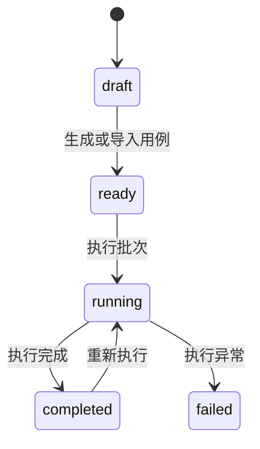

# 对话方案批量测试模块详细设计

## 1. 模块实体详设

### 1.1 实体: `batch_test_run`

| 字段 | 类型 | 约束 | 说明 |
|------|------|------|------|
| `id` | `VARCHAR(32)` | PK | 批次主键 |
| `name` | `VARCHAR(80)` | NOT NULL | 批次名称 |
| `profile_id` | `VARCHAR(32)` | NOT NULL | 被测对话方案 |
| `profile_name` | `VARCHAR(80)` | NOT NULL | 方案快照名称 |
| `status` | `ENUM('draft','ready','running','completed','failed')` | NOT NULL | 批次状态 |
| `case_count` | `INT` | NOT NULL, default `0` | 用例总数 |
| `executed_count` | `INT` | NOT NULL, default `0` | 已执行数量 |
| `pass_count` | `INT` | NOT NULL, default `0` | 达标用例数 |
| `accuracy` | `DECIMAL(5,4)` | NULL | 准确率 |
| `response_p95_ms` | `INT` | NULL | p95 响应耗时 |
| `threshold_snapshot_json` | `TEXT` | NOT NULL | 规则快照 |
| `analysis_status` | `ENUM('not_needed','pending','ready')` | NOT NULL | 分析状态 |
| `created_at` | `TIMESTAMP` | NOT NULL | 创建时间 |
| `updated_at` | `TIMESTAMP` | NOT NULL | 更新时间 |

### 1.2 实体: `batch_test_case`

| 字段 | 类型 | 约束 | 说明 |
|------|------|------|------|
| `id` | `VARCHAR(32)` | PK | 用例主键 |
| `batch_id` | `VARCHAR(32)` | FK `batch_test_run.id` | 所属批次 |
| `case_no` | `VARCHAR(20)` | NOT NULL | 用例编号 |
| `utterance` | `VARCHAR(300)` | NOT NULL | 测试语句 |
| `expected_route` | `VARCHAR(30)` | NOT NULL | 预期路由 |
| `expected_intent` | `VARCHAR(80)` | NULL | 预期意图 |
| `expected_slots_json` | `TEXT` | NULL | 预期槽位 |
| `source` | `ENUM('auto','upload','manual')` | NOT NULL | 来源 |
| `tuned` | `BOOLEAN` | NOT NULL | 是否手动微调 |
| `created_at` | `TIMESTAMP` | NOT NULL | 创建时间 |

### 1.3 实体: `batch_test_result`

| 字段 | 类型 | 约束 | 说明 |
|------|------|------|------|
| `id` | `VARCHAR(32)` | PK | 结果主键 |
| `batch_id` | `VARCHAR(32)` | FK `batch_test_run.id` | 批次 |
| `case_id` | `VARCHAR(32)` | FK `batch_test_case.id` | 用例 |
| `actual_route` | `VARCHAR(30)` | NOT NULL | 实际路由 |
| `actual_intent` | `VARCHAR(80)` | NULL | 实际意图 |
| `actual_slots_json` | `TEXT` | NULL | 实际槽位 |
| `score` | `DECIMAL(5,4)` | NULL | 综合得分 |
| `latency_ms` | `INT` | NULL | 响应耗时 |
| `passed` | `BOOLEAN` | NOT NULL | 是否达标 |
| `failure_reason` | `VARCHAR(120)` | NULL | 失败原因 |
| `created_at` | `TIMESTAMP` | NOT NULL | 创建时间 |

### 1.4 实体: `batch_test_analysis`

| 字段 | 类型 | 约束 | 说明 |
|------|------|------|------|
| `id` | `VARCHAR(32)` | PK | 分析主键 |
| `batch_id` | `VARCHAR(32)` | FK `batch_test_run.id` | 所属批次 |
| `summary_json` | `TEXT` | NOT NULL | 总结与排名 |
| `confusion_matrix_json` | `TEXT` | NOT NULL | 混淆矩阵 |
| `root_causes_json` | `TEXT` | NOT NULL | 失败归因 |
| `recommendations_json` | `TEXT` | NOT NULL | 建议列表 |
| `created_at` | `TIMESTAMP` | NOT NULL | 创建时间 |

## 2. 状态机

### 2.1 `batch_test_run.status`



| 从 | 到 | 触发条件 | 前置校验 | 副作用 |
|---|----|---------|---------|--------|
| `draft` | `ready` | 生成/上传用例 | 至少 1 条用例 | 回写 case_count |
| `ready` | `running` | PM 点击执行 | 方案存在且用例非空 | 清理旧结果并开始执行 |
| `running` | `completed` | 全部用例执行完 | 无 | 聚合 accuracy/p95/pass_rate，并生成分析 |
| `running` | `failed` | 执行引擎异常 | 无 | 写入 failure_reason |

## 3. 核心算法

### 3.1 算法: `generate_default_cases`

```text
load dialog profile bindings
seed core utterances from:
  - intent-oriented commands
  - knowledge queries
  - fallback chat prompts

for each seed:
    create case_no
    infer expected_route
    infer expected_intent
    mark source = auto

return cases
```

### 3.2 算法: `execute_batch_cases`

```text
load batch + cases + dialog profile snapshot
for each case:
    simulate response using dialog profile evaluator
    compare actual_route/intention/slots against expected
    calculate score and passed
    persist batch_test_result

aggregate accuracy = pass_count / case_count
aggregate response_p95_ms from latency list
set analysis_status = pending if accuracy below threshold or latency above threshold
```

### 3.3 算法: `build_batch_analysis`

```text
group failed results by route/intention/failure_reason
rank intents by pass rate ascending
build confusion matrix using expected_intent -> actual_intent
generate recommendations from top failure slices
persist summary/confusion/root_causes/recommendations
```

## 4. 模块级错误码

| 错误码 | 触发条件 | 用户提示 |
|--------|---------|---------|
| `BATCH-404-NOT-FOUND` | 批次不存在 | 目标测试批次不存在 |
| `BATCH-404-PROFILE` | 对话方案不存在 | 被测对话方案不存在 |
| `BATCH-409-NAME` | 同方案下批次重名 | 批次名称已存在 |
| `BATCH-409-STATE` | 状态不允许执行/生成 | 当前批次状态不允许执行该操作 |
| `BATCH-422-EMPTY` | 用例为空 | 请先生成或导入至少一条用例 |
| `BATCH-422-PROFILE` | 方案无可测试配置 | 当前方案缺少可测试配置，请先补齐 |

## 5. API 实现映射表

| AD 契约 | 处理器 | 服务方法 | 读写实体 |
|---------|-------|---------|---------|
| `GET /batch-tests` | `list_batch_tests()` | `query_batch_directory()` | `batch_test_run` |
| `POST /batch-tests` | `create_batch_test()` | `create_batch_run()` | `batch_test_run`, `audit_log` |
| `POST /batch-tests/{id}/generate-cases` | `generate_batch_cases()` | `generate_default_cases()` | `batch_test_case`, `batch_test_run` |
| `GET /batch-tests/{id}` | `get_batch_detail()` | `get_batch_detail()` | `batch_test_run`, `batch_test_case`, `batch_test_result`, `batch_test_analysis` |
| `POST /batch-tests/{id}/execute` | `execute_batch_test()` | `execute_batch_cases()` / `build_batch_analysis()` | `batch_test_result`, `batch_test_analysis`, `batch_test_run` |

## 6. 前端 UI 规格

### 6.1 页面结构

| 页面 | 核心区域 | 真实成功信号 |
|------|---------|-------------|
| `BatchTestPage` | 批次列表、状态统计、新建批次弹窗 | 新批次与状态统计来自后端回读 |
| `BatchTestDetailPage` | 用例表、执行结果、分析报告 Tabs | 数量、指标、分析卡片来自后端 |

### 6.2 交互约束

| 交互 | 约束 |
|------|------|
| 执行批次 | 只能展示真实 `running/completed/failed` 状态 |
| 结果表 | 字段必须包含预期/实际路由、意图、槽位、得分、耗时 |
| 智能分析 | 未达标时必须显示真实 failure slices，不允许前端自造结论 |

### 6.3 浏览器探针映射

| harness probe | 页面动作 | 真实成功信号 |
|---------------|---------|-------------|
| `case_count_consistency` | 生成/查看用例 | 总量与结果表一致 |
| `latency_feedback` | 执行批次 | 报告显示真实 latency/p95 |
| `accuracy_feedback` | 查看分析报告 | 准确率、混淆矩阵、建议来自后端 |

## 7. 测试映射

| 设计对象 | 建议测试 |
|---------|---------|
| 批次创建与重名保护 | 契约测试 |
| 用例生成与数量回读 | 契约测试 + 集成测试 |
| 批次执行状态机 | 集成测试 |
| 结果字段与指标聚合 | 契约测试 + 前端页面测试 |
| 分析报告展示 | 契约测试 + browser smoke |
