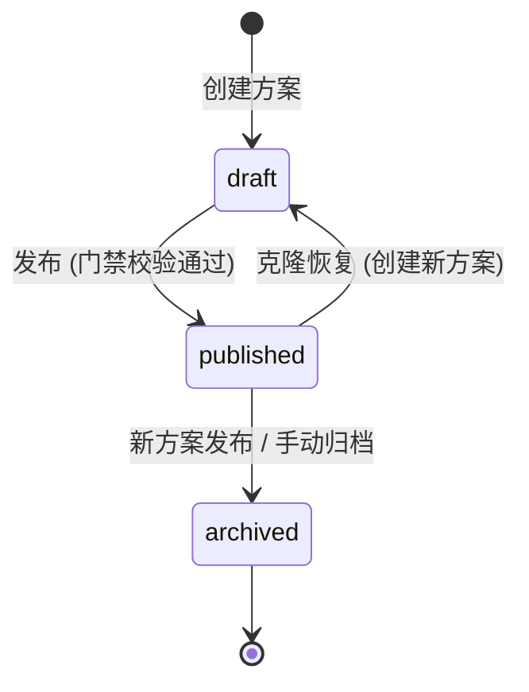

# 详细设计 (DD): 对话方案域 (Dialog Profile)

## 1. 文档说明

本文档定义对话方案域的字段级数据模型、状态机、核心算法、错误码、配置项及 API 实现映射。

**前置依赖**: `dd-global.md` 中已定义 `PublishedVersion`、`User`、错误码体系 (§4)、权限模型 (§5)、全局配置 (§6)。本文档不重复定义这些公共实体。

**模块实体清单** (5 个 PostgreSQL 实体):

| # | 实体 | 表名 | 对应 FR | 说明 |
|---|------|------|---------|------|
| 1 | DialogProfile | `dialog_profiles` | FR-007, FR-040 | 对话方案主表 |
| 2 | Persona | `personas` | FR-008 | 闲聊人设 |
| 3 | ProfileLibraryBinding | `profile_library_bindings` | FR-040 | 方案-指令库绑定 |
| 4 | ProfileTestSession | `profile_test_sessions` | FR-009~011 | 手动测试会话 |
| 5 | ProfileTestMessage | `profile_test_messages` | FR-009~011 | 手动测试消息 |

---

## 2. 设计原则

遵循 dd-template.md §2:

- **一对一可编码**: 每个实体直接映射 SQLAlchemy Model；每个状态转移映射 Service 方法
- **约束显式化**: 字符串有 max_length, 数值有 range, 枚举列出所有值, 无模糊词
- **向后兼容**: 字段新增不移除, 枚举新增不删除

---

## 3. 数据模型

### 3.1 实体: DialogProfile (对话方案)

**对应 FR**: FR-007, FR-040
**对应 AD**: ad-dialog-profile.md §2.1, §3.1
**表名**: `dialog_profiles`

| 字段 | 类型 | 约束 | 默认值 | 索引 | 说明 |
|------|------|------|--------|------|------|
| id | UUID | PK | gen_random_uuid() | 主键 | 唯一标识 |
| name | VARCHAR(128) | NOT NULL, UNIQUE | - | 唯一索引 | 方案名称, 1~128 字符, 全局唯一 |
| description | VARCHAR(500) | NULL | NULL | - | 方案描述 |
| llm_provider | VARCHAR(30) | NOT NULL | - | - | 大模型供应商, 枚举: `GPT-4o` / `GPT-4o-mini` / `Qwen-Max` / `Qwen-Plus` / `GLM-4` / `GLM-4-Flash` |
| llm_config | JSONB | NOT NULL | '{}' | - | 大模型配置, schema 见下方 |
| routing_strategy | VARCHAR(20) | NOT NULL | 'command_first' | - | 路由策略, 枚举: `command_first` / `knowledge_first` / `balanced` |
| command_threshold | DECIMAL(3,2) | NOT NULL | 0.60 | - | 指令阈值, 范围 0.00~1.00, 步长 0.05 (FR-040) |
| session_timeout_minutes | SMALLINT | NOT NULL | 10 | - | 会话超时 (分钟), 范围 1~60 |
| persona_id | UUID | NULL, FK(personas.id) | NULL | 普通索引 | 当前激活的人设 ID |
| knowledge_base_ids | UUID[] | NOT NULL | '{}' | - | 关联的知识库 ID 列表 |
| status | VARCHAR(16) | NOT NULL | 'draft' | 普通索引 | 状态枚举, 见 §4.1 |
| current_version_number | VARCHAR(20) | NULL | NULL | - | 当前已发布版本号 (冗余, 加速列表查询) |
| created_by | UUID | NOT NULL, FK(users.id) | - | 普通索引 | 创建人 |
| created_at | TIMESTAMP(TZ) | NOT NULL | now() | - | 创建时间 |
| updated_at | TIMESTAMP(TZ) | NOT NULL | now() | - | 更新时间 |

**字段校验规则**:

| 字段 | 规则 | 说明 |
|------|------|------|
| name | `^.{1,128}$`, UNIQUE 校验 | 1~128 字符, 全局唯一 |
| command_threshold | `0.00 <= val <= 1.00`, step 0.05 | 超范围返回 E20001 |
| session_timeout_minutes | `1 <= val <= 60` | 整数, 超范围返回 E20001 |
| llm_provider | IN ('GPT-4o','GPT-4o-mini','Qwen-Max','Qwen-Plus','GLM-4','GLM-4-Flash') | 不在枚举内返回 E20001 |
| routing_strategy | IN ('command_first','knowledge_first','balanced') | 不在枚举内返回 E20001 |

**llm_config JSONB Schema**:

```json
{
  "model": { "type": "string", "required": false, "default": "与 llm_provider 一致", "description": "具体模型标识" },
  "temperature": { "type": "float", "required": false, "default": 0.7, "min": 0.0, "max": 2.0, "description": "生成温度" },
  "max_tokens": { "type": "int", "required": false, "default": 2048, "min": 100, "max": 8192, "description": "最大 token 数" }
}
```

#### 索引

| 索引名 | 字段 | 类型 | 用途 |
|--------|------|------|------|
| uq_dp_name | (name) | B-Tree, UNIQUE | 方案名称唯一 |
| idx_dp_status | (status) | B-Tree | 按状态筛选 |
| idx_dp_created_by | (created_by) | B-Tree | 按创建人筛选 |
| idx_dp_updated_at | (updated_at DESC) | B-Tree | 默认排序 |
| idx_dp_persona_id | (persona_id) | B-Tree | 人设关联查询 |

#### 关系

| 关系 | 目标实体 | 类型 | 外键 | 级联策略 |
|------|---------|------|------|---------|
| 人设列表 | Persona | 一对多 | personas.profile_id | CASCADE DELETE |
| 指令库绑定 | ProfileLibraryBinding | 一对多 | profile_library_bindings.profile_id | CASCADE DELETE |
| 测试会话 | ProfileTestSession | 一对多 | profile_test_sessions.profile_id | CASCADE DELETE |
| 发布版本 | PublishedVersion (dd-global §3.5) | 一对多 | published_versions.profile_id | CASCADE DELETE |
| 创建人 | User (dd-global §3.1) | 多对一 | dialog_profiles.created_by | RESTRICT |
| 激活人设 | Persona | 多对一 | dialog_profiles.persona_id | SET NULL |

---

### 3.2 实体: Persona (闲聊人设)

**对应 FR**: FR-008
**对应 AD**: ad-dialog-profile.md §2.2, §3.2
**表名**: `personas`

| 字段 | 类型 | 约束 | 默认值 | 索引 | 说明 |
|------|------|------|--------|------|------|
| id | UUID | PK | gen_random_uuid() | 主键 | 唯一标识 |
| profile_id | UUID | NOT NULL, FK(dialog_profiles.id) | - | 普通索引 | 所属方案 ID |
| name | VARCHAR(64) | NOT NULL | - | - | 人设名称, 1~64 字符, 方案内唯一 |
| personality_traits | VARCHAR(500) | NOT NULL | - | - | 性格特征描述 |
| tone_style | VARCHAR(500) | NOT NULL | - | - | 语气风格描述 |
| greeting_text | VARCHAR(200) | NULL | NULL | - | 问候语 |
| system_prompt | VARCHAR(2000) | NULL | NULL | - | 自定义系统提示词 |
| is_active | BOOLEAN | NOT NULL | false | - | 是否为方案当前激活人设 |
| created_at | TIMESTAMP(TZ) | NOT NULL | now() | - | 创建时间 |
| updated_at | TIMESTAMP(TZ) | NOT NULL | now() | - | 更新时间 |

**字段校验规则**:

| 字段 | 规则 | 说明 |
|------|------|------|
| name | `^.{1,64}$`, UNIQUE per profile_id | 方案内唯一, 重复返回 E20401 |
| personality_traits | `len <= 500`, NOT NULL | 必填 |
| tone_style | `len <= 500`, NOT NULL | 必填 |

#### 索引

| 索引名 | 字段 | 类型 | 用途 |
|--------|------|------|------|
| idx_persona_profile_id | (profile_id) | B-Tree | 按方案查人设列表 |
| uq_persona_name_per_profile | (profile_id, name) | B-Tree, UNIQUE | 方案内名称唯一 |
| idx_persona_is_active | (profile_id, is_active) WHERE is_active=true | B-Tree, UNIQUE partial | 每方案最多一个激活人设 |

#### 关系

| 关系 | 目标实体 | 类型 | 外键 | 级联策略 |
|------|---------|------|------|---------|
| 所属方案 | DialogProfile | 多对一 | personas.profile_id | CASCADE (随方案删除) |

---

### 3.3 实体: ProfileLibraryBinding (方案-指令库绑定)

**对应 FR**: FR-040
**对应 AD**: ad-dialog-profile.md §3.5
**表名**: `profile_library_bindings`

| 字段 | 类型 | 约束 | 默认值 | 索引 | 说明 |
|------|------|------|--------|------|------|
| id | UUID | PK | gen_random_uuid() | 主键 | 唯一标识 |
| profile_id | UUID | NOT NULL, FK(dialog_profiles.id) | - | 普通索引 | 所属方案 ID |
| library_id | UUID | NOT NULL, FK(intent_libraries.id) | - | 普通索引 | 指令库 ID (跨模块外键) |
| library_key | VARCHAR(64) | NOT NULL | - | - | 指令库全局唯一 key (冗余, 加速查询) |
| created_at | TIMESTAMP(TZ) | NOT NULL | now() | - | 绑定时间 |

**业务规则**:
- 绑定采用**全量替换**语义: PUT 请求传入新列表 → 先 DELETE 旧绑定 → 再 INSERT 新绑定
- 绑定时**不**校验 library 是否有 published 模型 (发布时才校验, FR-047)
- 同 profile 下 library_id 不可重复

#### 索引

| 索引名 | 字段 | 类型 | 用途 |
|--------|------|------|------|
| idx_plb_profile_id | (profile_id) | B-Tree | 按方案查绑定列表 |
| idx_plb_library_id | (library_id) | B-Tree | 反查哪些方案绑定了某库 |
| uq_plb_profile_library | (profile_id, library_id) | B-Tree, UNIQUE | 同方案不可重复绑定同一库 |

#### 关系

| 关系 | 目标实体 | 类型 | 外键 | 级联策略 |
|------|---------|------|------|---------|
| 所属方案 | DialogProfile | 多对一 | profile_library_bindings.profile_id | CASCADE (随方案删除) |
| 关联指令库 | IntentLibrary (dd-intent-library) | 多对一 | profile_library_bindings.library_id | RESTRICT (库存在绑定时不可删) |

---

### 3.4 实体: ProfileTestSession (测试会话)

**对应 FR**: FR-009, FR-011
**对应 AD**: ad-dialog-profile.md §2.3, §3.3
**表名**: `profile_test_sessions`

| 字段 | 类型 | 约束 | 默认值 | 索引 | 说明 |
|------|------|------|--------|------|------|
| id | UUID | PK | gen_random_uuid() | 主键 | 唯一标识 |
| profile_id | UUID | NOT NULL, FK(dialog_profiles.id) | - | 普通索引 | 所属方案 ID |
| name | VARCHAR(100) | NOT NULL | - | - | 会话名称, 1~100 字符 |
| status | VARCHAR(16) | NOT NULL | 'active' | 普通索引 | 枚举: `active` / `closed` |
| device_context_preset | VARCHAR(20) | NOT NULL | 'idle' | - | 设备上下文预设, 枚举: `idle` / `cooking` / `recipe` |
| device_context | JSONB | NOT NULL | 见下方 | - | 设备上下文完整快照, schema 见下方 |
| remark | VARCHAR(200) | NULL | NULL | - | 备注 |
| message_count | INTEGER | NOT NULL | 0 | - | 消息计数 (冗余, 触发器或应用层维护) |
| created_by | UUID | NOT NULL, FK(users.id) | - | - | 创建人 |
| created_at | TIMESTAMP(TZ) | NOT NULL | now() | - | 创建时间 |
| updated_at | TIMESTAMP(TZ) | NOT NULL | now() | - | 更新时间 |

**device_context JSONB Schema** (FR-011):

```json
{
  "cooking_status": { "type": "string", "enum": ["idle","cooking","preheating","done"], "default": "idle" },
  "door_status": { "type": "string", "enum": ["open","closed","unknown"], "default": "closed" },
  "current_temp": { "type": "int", "min": 0, "max": 300, "default": 25, "unit": "℃" },
  "current_page": { "type": "string", "enum": ["home","recipe_browser","cooking_progress","settings"], "default": "home" },
  "screen_info": { "type": "object", "default": {"size": "15.6", "type": "main"}, "description": "屏幕信息" }
}
```

**device_context_preset 映射**:

| 预设值 | cooking_status | door_status | current_temp | current_page |
|--------|---------------|-------------|--------------|--------------|
| idle | idle | closed | 25 | home |
| cooking | cooking | closed | 180 | cooking_progress |
| recipe | idle | closed | 25 | recipe_browser |

**业务规则**:
- 同一方案下活跃会话 (`status='active'`) 上限 10 个, 超出返回 E20301
- 删除会话时级联删除所有关联消息

#### 索引

| 索引名 | 字段 | 类型 | 用途 |
|--------|------|------|------|
| idx_pts_profile_id | (profile_id) | B-Tree | 按方案查会话列表 |
| idx_pts_profile_status | (profile_id, status) | B-Tree | 计算活跃会话数 |
| idx_pts_created_at | (created_at DESC) | B-Tree | 时间排序 |

#### 关系

| 关系 | 目标实体 | 类型 | 外键 | 级联策略 |
|------|---------|------|------|---------|
| 所属方案 | DialogProfile | 多对一 | profile_test_sessions.profile_id | CASCADE (随方案删除) |
| 消息列表 | ProfileTestMessage | 一对多 | profile_test_messages.session_id | CASCADE DELETE |
| 创建人 | User (dd-global §3.1) | 多对一 | profile_test_sessions.created_by | RESTRICT |

---

### 3.5 实体: ProfileTestMessage (测试消息)

**对应 FR**: FR-009, FR-010
**对应 AD**: ad-dialog-profile.md §2.3, §3.3
**表名**: `profile_test_messages`

| 字段 | 类型 | 约束 | 默认值 | 索引 | 说明 |
|------|------|------|--------|------|------|
| id | UUID | PK | gen_random_uuid() | 主键 | 唯一标识 |
| session_id | UUID | NOT NULL, FK(profile_test_sessions.id) | - | 普通索引 | 所属测试会话 ID |
| role | VARCHAR(10) | NOT NULL | - | - | 消息角色, 枚举: `user` / `bot` |
| content | TEXT | NOT NULL | - | - | 消息文本内容 |
| debug_info | JSONB | NULL | NULL | - | 调试信息 (仅 role='bot'), schema 见下方 |
| created_at | TIMESTAMP(TZ) | NOT NULL | now() | 普通索引 | 创建时间 (游标分页依赖) |

**字段校验规则**:

| 字段 | 规则 | 说明 |
|------|------|------|
| content (user) | `1 <= len <= 500` | 用户消息长度限制, 超出返回 E20303 |
| content (bot) | 无长度上限 | 由 NLU 管道生成 |
| role | IN ('user', 'bot') | 仅两种角色 |
| debug_info | 仅 role='bot' 时非 NULL | user 消息无调试信息 |

**debug_info JSONB Schema** (FR-010):

```json
{
  "route_result": {
    "type": "object",
    "properties": {
      "domain": { "type": "string", "enum": ["command","knowledge","chitchat"], "description": "路由域" },
      "confidence": { "type": "float", "min": 0.0, "max": 1.0, "description": "路由置信度" }
    }
  },
  "intent": {
    "type": "object|null",
    "description": "仅 command 域",
    "properties": {
      "name": { "type": "string", "description": "意图名称" },
      "confidence": { "type": "float", "min": 0.0, "max": 1.0, "description": "意图置信度" }
    }
  },
  "slots": {
    "type": "array",
    "items": {
      "name": { "type": "string" },
      "value": { "type": "string" },
      "type": { "type": "string" },
      "resolved": { "type": "boolean", "description": "是否经指代消解" },
      "original_text": { "type": "string|null", "description": "消解前原始文本" }
    }
  },
  "reference_resolution": {
    "type": "object|null",
    "properties": {
      "pronoun": { "type": "string" },
      "resolved": { "type": "string" },
      "source": { "type": "string" }
    }
  },
  "knowledge_hit": {
    "type": "object|null",
    "description": "仅 knowledge 域",
    "properties": {
      "doc_name": { "type": "string" },
      "category": { "type": "string" },
      "score": { "type": "float" }
    }
  },
  "persona": {
    "type": "object|null",
    "description": "仅 chitchat 域",
    "properties": {
      "name": { "type": "string" },
      "applied": { "type": "boolean" }
    }
  },
  "dialog_state": {
    "type": "object",
    "properties": {
      "previous_domain": { "type": "string|null" },
      "slots_filled": { "type": "boolean" },
      "turn_count": { "type": "int", "min": 1 }
    }
  },
  "latency_ms": { "type": "int", "min": 0, "description": "端到端响应耗时 (ms)" },
  "model_used": { "type": "string", "description": "使用的模型/版本信息" }
}
```

#### 索引

| 索引名 | 字段 | 类型 | 用途 |
|--------|------|------|------|
| idx_ptm_session_id | (session_id) | B-Tree | 按会话查消息 |
| idx_ptm_created_at | (session_id, created_at DESC) | B-Tree | 游标分页 (最新消息在前) |

#### 关系

| 关系 | 目标实体 | 类型 | 外键 | 级联策略 |
|------|---------|------|------|---------|
| 所属会话 | ProfileTestSession | 多对一 | profile_test_messages.session_id | CASCADE (随会话删除) |

---

### 3.6 ER 关系图 (模块范围)

```
DialogProfile (1) ────(1:N)──── Persona (*)
  │                                │
  │ persona_id (0..1)              │ is_active (最多1个true)
  ├── FK ──────────────────────────┘
  │
  │──(1:N)──── ProfileLibraryBinding (*) ──(N:1)──── IntentLibrary (1)
  │                                                    [跨模块, dd-intent-library]
  │
  │──(1:N)──── ProfileTestSession (*)
  │                │
  │                └──(1:N)──── ProfileTestMessage (*)
  │
  │──(1:N)──── PublishedVersion (*)
  │              [dd-global §3.5]
  │
  └── created_by ──(N:1)──── User (1)
                               [dd-global §3.1]

唯一性约束:
  - DialogProfile.name: 全局唯一
  - Persona (profile_id, name): 方案内唯一
  - Persona (profile_id) WHERE is_active=true: 每方案最多1个激活
  - ProfileLibraryBinding (profile_id, library_id): 同方案不可重复绑定
  - PublishedVersion (status) WHERE status='active': 全局最多1个活跃版本
```

### 3.7 数据迁移

**Alembic 迁移脚本要点**:

| 操作 | 迁移策略 | 停机 |
|------|---------|------|
| 创建 dialog_profiles | `op.create_table(...)` 含所有索引 | 无 |
| 创建 personas | `op.create_table(...)`, 含联合唯一索引 | 无 |
| 创建 profile_library_bindings | `op.create_table(...)`, 含跨模块 FK | 无 |
| 创建 profile_test_sessions | `op.create_table(...)` | 无 |
| 创建 profile_test_messages | `op.create_table(...)` | 无 |
| 后续新增 dialog_profiles 列 | ALTER ADD COLUMN + server_default | 无 |

```sql
-- migration: create_dialog_profile_tables
CREATE TABLE dialog_profiles (
    id UUID PRIMARY KEY DEFAULT gen_random_uuid(),
    name VARCHAR(128) NOT NULL,
    description VARCHAR(500),
    llm_provider VARCHAR(30) NOT NULL,
    llm_config JSONB NOT NULL DEFAULT '{}',
    routing_strategy VARCHAR(20) NOT NULL DEFAULT 'command_first',
    command_threshold DECIMAL(3,2) NOT NULL DEFAULT 0.60
        CHECK (command_threshold >= 0.00 AND command_threshold <= 1.00),
    session_timeout_minutes SMALLINT NOT NULL DEFAULT 10
        CHECK (session_timeout_minutes >= 1 AND session_timeout_minutes <= 60),
    persona_id UUID,
    knowledge_base_ids UUID[] NOT NULL DEFAULT '{}',
    status VARCHAR(16) NOT NULL DEFAULT 'draft',
    current_version_number VARCHAR(20),
    created_by UUID NOT NULL REFERENCES users(id),
    created_at TIMESTAMPTZ NOT NULL DEFAULT now(),
    updated_at TIMESTAMPTZ NOT NULL DEFAULT now(),
    CONSTRAINT uq_dp_name UNIQUE (name)
);

CREATE TABLE personas (
    id UUID PRIMARY KEY DEFAULT gen_random_uuid(),
    profile_id UUID NOT NULL REFERENCES dialog_profiles(id) ON DELETE CASCADE,
    name VARCHAR(64) NOT NULL,
    personality_traits VARCHAR(500) NOT NULL,
    tone_style VARCHAR(500) NOT NULL,
    greeting_text VARCHAR(200),
    system_prompt VARCHAR(2000),
    is_active BOOLEAN NOT NULL DEFAULT false,
    created_at TIMESTAMPTZ NOT NULL DEFAULT now(),
    updated_at TIMESTAMPTZ NOT NULL DEFAULT now(),
    CONSTRAINT uq_persona_name_per_profile UNIQUE (profile_id, name)
);
CREATE UNIQUE INDEX idx_persona_is_active
    ON personas (profile_id) WHERE is_active = true;

ALTER TABLE dialog_profiles
    ADD CONSTRAINT fk_dp_persona FOREIGN KEY (persona_id)
    REFERENCES personas(id) ON DELETE SET NULL;

CREATE TABLE profile_library_bindings (
    id UUID PRIMARY KEY DEFAULT gen_random_uuid(),
    profile_id UUID NOT NULL REFERENCES dialog_profiles(id) ON DELETE CASCADE,
    library_id UUID NOT NULL REFERENCES intent_libraries(id) ON DELETE RESTRICT,
    library_key VARCHAR(64) NOT NULL,
    created_at TIMESTAMPTZ NOT NULL DEFAULT now(),
    CONSTRAINT uq_plb_profile_library UNIQUE (profile_id, library_id)
);

CREATE TABLE profile_test_sessions (
    id UUID PRIMARY KEY DEFAULT gen_random_uuid(),
    profile_id UUID NOT NULL REFERENCES dialog_profiles(id) ON DELETE CASCADE,
    name VARCHAR(100) NOT NULL,
    status VARCHAR(16) NOT NULL DEFAULT 'active',
    device_context_preset VARCHAR(20) NOT NULL DEFAULT 'idle',
    device_context JSONB NOT NULL DEFAULT '{"cooking_status":"idle","door_status":"closed","current_temp":25,"current_page":"home","screen_info":{"size":"15.6","type":"main"}}',
    remark VARCHAR(200),
    message_count INTEGER NOT NULL DEFAULT 0,
    created_by UUID NOT NULL REFERENCES users(id),
    created_at TIMESTAMPTZ NOT NULL DEFAULT now(),
    updated_at TIMESTAMPTZ NOT NULL DEFAULT now()
);

CREATE TABLE profile_test_messages (
    id UUID PRIMARY KEY DEFAULT gen_random_uuid(),
    session_id UUID NOT NULL REFERENCES profile_test_sessions(id) ON DELETE CASCADE,
    role VARCHAR(10) NOT NULL CHECK (role IN ('user', 'bot')),
    content TEXT NOT NULL,
    debug_info JSONB,
    created_at TIMESTAMPTZ NOT NULL DEFAULT now()
);
CREATE INDEX idx_ptm_created_at ON profile_test_messages (session_id, created_at DESC);
```

---

## 4. 状态机

### 4.1 DialogProfile 状态机

**对应 AD**: ad-dialog-profile.md §2.4



#### 状态枚举

| 状态值 | 显示名 | 含义 | 允许的操作 |
|--------|-------|------|-----------|
| draft | 草稿 | 新建或编辑中 | 编辑所有配置、删除、手动测试、发布 |
| published | 已发布 | 生产生效, 配置冻结为版本快照 | 查看、归档; 编辑/删除被阻止 (E20103/E20104) |
| archived | 已归档 | 历史版本, 终态 | 仅查看; 不可恢复发布 |

#### 状态转移规则

| 从 | 到 | 触发条件 | 前置校验 | 副作用 | 对应 API |
|---|----|---------|---------|--------|---------|
| [*] | draft | 用户创建方案 | 名称唯一 (E20101) | - | POST /api/v1/profiles |
| draft | published | 用户点击"发布" | **发布门禁** (§5.1): ①绑定库有 published 模型 (E20201) ②人设已配置 (E20202) ③LLM 已配置 (E20202) ④阈值在范围内 (E20203) | 创建 PublishedVersion 快照 (§5.2); 旧 published 版本归档; 刷新 Redis 缓存; 重置设备会话 (FR-016) | POST /api/v1/profiles/{id}/publish |
| published | archived | 新方案发布 (自动) 或手动归档 | - | 旧 PublishedVersion.status → 'archived'; archived_at = now() | 自动触发 (publish 流程) |
| published | draft | 克隆恢复 | - | 创建新 DialogProfile (status='draft'), 复制配置但不复制版本历史 | POST /api/v1/profiles (body 从旧方案复制) |

#### 唯一性约束

全局同一时间最多 **1 个** `published` 状态的方案对应 **1 个** `active` 状态的 PublishedVersion (由 `uq_pv_active` partial index 保证, 见 dd-global.md §3.5)。

#### 状态守卫伪代码

```python
def assert_editable(profile: DialogProfile) -> None:
    """编辑/删除前校验状态"""
    if profile.status == "published":
        raise BusinessException("E20103", "当前状态不允许编辑", http_status=422)
    if profile.status == "archived":
        raise BusinessException("E20103", "当前状态不允许编辑", http_status=422)

def assert_deletable(profile: DialogProfile) -> None:
    """删除前校验状态"""
    if profile.status == "published":
        raise BusinessException("E20104", "已发布方案不可删除，请先归档", http_status=422)
```

---

## 5. 核心算法

### 5.1 算法: 发布门禁校验 (Publish Gate Validation)

**对应 FR**: FR-047, FR-015
**对应 AD**: ad-dialog-profile.md §2.4

#### 输入输出

| 方向 | 参数 | 类型 | 约束 | 说明 |
|------|------|------|------|------|
| 输入 | profile_id | UUID | NOT NULL | 待发布的方案 ID |
| 输入 | operator_id | UUID | NOT NULL | 操作人 ID |
| 输出 | validation_result | object | - | {passed: bool, errors: list[str]} |

#### 伪代码

```python
async def validate_publish_gate(
    profile_id: UUID,
    operator_id: UUID,
    db: AsyncSession
) -> PublishGateResult:
    """
    发布门禁校验: 按序检查所有前置条件。
    任一条件不满足则立即抛出异常 (fail-fast)。
    """
    # 1. 加载方案
    profile = await db.get(DialogProfile, profile_id)
    if not profile:
        raise BusinessException("E20102", "方案不存在", http_status=404)

    # 2. 状态校验: 仅 draft 可发布
    if profile.status not in ("draft",):
        raise BusinessException("E20103", "当前状态不允许发布", http_status=422)

    errors: list[str] = []

    # 3. 校验 LLM 配置
    if not profile.llm_provider:
        errors.append("未配置大模型")

    # 4. 校验人设
    if not profile.persona_id:
        errors.append("未配置闲聊人设")
    else:
        persona = await db.get(Persona, profile.persona_id)
        if not persona or persona.profile_id != profile_id:
            errors.append("激活的人设不存在或不属于当前方案")

    # 5. 校验阈值范围
    if not (0.0 <= profile.command_threshold <= 1.0):
        errors.append(f"指令阈值 {profile.command_threshold} 不在有效范围 [0.0, 1.0]")

    # 6. 若有配置不完整, 合并返回
    if errors:
        detail = "、".join(errors)
        raise BusinessException("E20202", f"方案配置不完整：{detail}", http_status=422)

    # 7. 校验绑定的指令库 (FR-047 核心门禁)
    bindings = await db.execute(
        select(ProfileLibraryBinding)
        .where(ProfileLibraryBinding.profile_id == profile_id)
    )
    binding_list = bindings.scalars().all()

    # 不强制绑定指令库, 但若绑定了则必须有 published 模型
    for binding in binding_list:
        published_model = await db.execute(
            select(LibraryModelVersion)
            .where(LibraryModelVersion.library_id == binding.library_id)
            .where(LibraryModelVersion.status == "published")
        )
        if not published_model.scalar_one_or_none():
            library = await db.get(IntentLibrary, binding.library_id)
            raise BusinessException(
                "E20201",
                f'指令库"{library.name}"无已发布模型，请先发布',
                http_status=422
            )

    return PublishGateResult(passed=True, profile=profile, bindings=binding_list)
```

#### 边界条件

| 边界场景 | 处理方式 | 错误码 |
|---------|---------|--------|
| 方案不存在 | 404 | E20102 |
| 方案状态非 draft | 422 阻止发布 | E20103 |
| 未配置 LLM 或人设 | 422, 合并多个缺失项 | E20202 |
| 阈值超范围 | 422 | E20203 |
| 绑定的库无 published 模型 | 422, 报出首个失败库名 | E20201 |
| 未绑定任何指令库 | 允许通过 (FR-047: 不强制绑定) | - |
| 并发发布同一方案 | 数据库行锁 (SELECT FOR UPDATE) | E20103 |

---

### 5.2 算法: 版本快照创建 (Version Snapshot Creation)

**对应 FR**: FR-015, FR-016
**对应 AD**: ad-dialog-profile.md §2.4 阶段 3~4

#### 输入输出

| 方向 | 参数 | 类型 | 约束 | 说明 |
|------|------|------|------|------|
| 输入 | gate_result | PublishGateResult | NOT NULL | 门禁校验通过的结果 |
| 输入 | operator_id | UUID | NOT NULL | 操作人 |
| 输出 | publish_result | PublishResult | - | {version_id, version_number, affected_devices_count, session_reset_count} |

#### 伪代码

```python
async def create_version_snapshot(
    gate_result: PublishGateResult,
    operator_id: UUID,
    db: AsyncSession,
    redis: Redis
) -> PublishResult:
    """
    创建版本快照 + 归档旧版本 + 刷新缓存 + 重置设备会话。
    整个流程在一个事务中完成。
    """
    profile = gate_result.profile
    bindings = gate_result.bindings

    async with db.begin():
        # 1. 归档当前 active 版本 (如果存在)
        old_active = await db.execute(
            select(PublishedVersion)
            .where(PublishedVersion.profile_id == profile.id)
            .where(PublishedVersion.status == "active")
            .with_for_update()
        )
        old_version = old_active.scalar_one_or_none()
        if old_version:
            old_version.status = "archived"
            old_version.archived_at = datetime.utcnow()

        # 2. 生成递增版本号
        last_version = await db.execute(
            select(func.max(PublishedVersion.version_number))
            .where(PublishedVersion.profile_id == profile.id)
        )
        last_num = last_version.scalar()  # e.g. "v2.1" or None
        new_version_number = _increment_version(last_num)  # → "v2.2" or "v1.0"

        # 3. 构建 config_snapshot
        persona = await db.get(Persona, profile.persona_id)
        library_snapshots = []
        for binding in bindings:
            library = await db.get(IntentLibrary, binding.library_id)
            published_model = await db.execute(
                select(LibraryModelVersion)
                .where(LibraryModelVersion.library_id == binding.library_id)
                .where(LibraryModelVersion.status == "published")
            )
            model = published_model.scalar_one()
            library_snapshots.append({
                "library_id": str(binding.library_id),
                "library_key": binding.library_key,
                "language": library.language,
                "published_model_id": str(model.id),
                "model_version": model.version_number,
            })

        config_snapshot = {
            "profile_name": profile.name,
            "llm_provider": profile.llm_provider,
            "llm_config": profile.llm_config,
            "routing_strategy": profile.routing_strategy,
            "command_threshold": float(profile.command_threshold),
            "session_timeout_minutes": profile.session_timeout_minutes,
            "persona": {
                "name": persona.name,
                "personality_traits": persona.personality_traits,
                "tone_style": persona.tone_style,
                "greeting_text": persona.greeting_text,
                "system_prompt": persona.system_prompt,
            },
            "bound_libraries": library_snapshots,
            "knowledge_base_ids": [str(kid) for kid in profile.knowledge_base_ids],
        }

        # 4. 创建 PublishedVersion 记录
        new_version = PublishedVersion(
            profile_id=profile.id,
            version_number=new_version_number,
            config_snapshot=config_snapshot,
            status="active",
            published_by=operator_id,
        )
        db.add(new_version)

        # 5. 更新方案状态
        profile.status = "published"
        profile.current_version_number = new_version_number
        profile.updated_at = datetime.utcnow()

    # 6. 刷新 Redis 运行时缓存 (事务外)
    await redis.set(
        f"active_version:{profile.id}",
        json.dumps(config_snapshot),
        ex=86400
    )

    # 7. 重置设备会话 (FR-016)
    session_keys = await redis.keys("session:*")
    session_reset_count = len(session_keys)
    if session_keys:
        await redis.delete(*session_keys)

    affected_devices = await db.execute(
        select(func.count(func.distinct(text("device_id"))))
        .select_from(text("device_sessions"))
        .where(text("active = true"))
    )
    affected_devices_count = affected_devices.scalar() or 0

    return PublishResult(
        version_id=new_version.id,
        version_number=new_version_number,
        published_at=new_version.published_at,
        affected_devices_count=affected_devices_count,
        session_reset_count=session_reset_count,
    )


def _increment_version(last: str | None) -> str:
    """递增版本号: None→'v1.0', 'v1.0'→'v1.1', 'v1.9'→'v2.0'"""
    if not last:
        return "v1.0"
    major, minor = last.lstrip("v").split(".")
    minor_int = int(minor) + 1
    if minor_int > 9:
        return f"v{int(major)+1}.0"
    return f"v{major}.{minor_int}"
```

#### 边界条件

| 边界场景 | 处理方式 | 错误码 |
|---------|---------|--------|
| 首次发布 (无历史版本) | version_number = 'v1.0' | - |
| 版本号溢出 (v9.9) | 递增至 v10.0 (不设上限) | - |
| Redis 刷新失败 | 记录错误日志, 不回滚 DB 事务; 下次请求时缓存 miss 自动回源 | - |
| 无在线设备 | affected_devices_count=0, session_reset_count=0 | - |
| 并发发布 | SELECT FOR UPDATE 串行化 | E20103 (后到者方案已变为 published) |

---

### 5.3 算法: 手动测试消息处理 (Manual Test Processing)

**对应 FR**: FR-009, FR-010, FR-011
**对应 AD**: ad-dialog-profile.md §2.3

#### 输入输出

| 方向 | 参数 | 类型 | 约束 | 说明 |
|------|------|------|------|------|
| 输入 | profile_id | UUID | NOT NULL | 方案 ID |
| 输入 | session_id | UUID | 可选 | 会话 ID, 不传自动创建 |
| 输入 | text | string | 1~500 字符 | 用户消息 |
| 输入 | device_context | object | 可选 | 模拟设备上下文 |
| 输出 | chat_response | object | - | {session_id, reply_text, debug_info} |

#### 伪代码

```python
async def process_test_message(
    profile_id: UUID,
    text: str,
    session_id: UUID | None,
    device_context: dict | None,
    db: AsyncSession,
    redis: Redis,
    nlu_pipeline: NLUPipeline,
) -> ChatResponse:
    """
    手动测试消息处理: 加载方案配置 → 获取/创建会话 → NLU 推理 → 持久化消息对。
    复用生产 NLU Pipeline 完整链路, 确保测试与生产行为一致。
    """
    # 1. 输入校验
    if not text or len(text) > 500:
        raise BusinessException("E20303", "输入文本为空或超过500字符限制", http_status=400)

    # 2. 加载方案
    profile = await db.get(DialogProfile, profile_id)
    if not profile:
        raise BusinessException("E20102", "方案不存在", http_status=404)

    # 3. 获取或创建测试会话
    if session_id:
        session = await db.get(ProfileTestSession, session_id)
        if not session or session.profile_id != profile_id:
            raise BusinessException("E20302", "测试会话不存在", http_status=404)
    else:
        # 检查活跃会话上限
        active_count = await db.execute(
            select(func.count())
            .where(ProfileTestSession.profile_id == profile_id)
            .where(ProfileTestSession.status == "active")
        )
        if active_count.scalar() >= MAX_TEST_SESSIONS_PER_PROFILE:
            raise BusinessException(
                "E20301",
                f"测试会话数已达上限({MAX_TEST_SESSIONS_PER_PROFILE})，请先关闭或删除已有会话",
                http_status=429,
            )
        session = ProfileTestSession(
            profile_id=profile_id,
            name=f"自动会话-{datetime.now().strftime('%H:%M')}",
            status="active",
            device_context=device_context or DEFAULT_DEVICE_CONTEXT,
        )
        db.add(session)
        await db.flush()

    # 4. 加载会话上下文 (Redis)
    cache_key = f"test_session:{session.id}"
    session_context = await redis.get(cache_key)
    if session_context:
        session_context = json.loads(session_context)
    else:
        session_context = {"dialog_history": [], "active_entity_stack": []}

    # 5. 合并设备上下文 (请求级覆盖会话级)
    merged_device_ctx = {**session.device_context}
    if device_context:
        merged_device_ctx.update(device_context)

    # 6. 构建 NLU 配置
    persona = await db.get(Persona, profile.persona_id) if profile.persona_id else None
    bindings = await db.execute(
        select(ProfileLibraryBinding)
        .where(ProfileLibraryBinding.profile_id == profile_id)
    )

    nlu_config = NLUConfig(
        llm_provider=profile.llm_provider,
        llm_config=profile.llm_config,
        routing_strategy=profile.routing_strategy,
        command_threshold=float(profile.command_threshold),
        persona=persona,
        library_keys=[b.library_key for b in bindings.scalars()],
        session_timeout_min=profile.session_timeout_minutes,
    )

    # 7. 调用 NLU Pipeline (完整链路)
    nlu_result = await nlu_pipeline.process(
        text=text,
        config=nlu_config,
        session_context=session_context,
        device_context=merged_device_ctx,
    )

    # 8. 更新会话上下文 (Redis)
    updated_context = nlu_result.updated_context
    await redis.set(
        cache_key,
        json.dumps(updated_context),
        ex=profile.session_timeout_minutes * 60,
    )

    # 9. 持久化消息对
    user_msg = ProfileTestMessage(
        session_id=session.id,
        role="user",
        content=text,
        debug_info=None,
    )
    bot_msg = ProfileTestMessage(
        session_id=session.id,
        role="bot",
        content=nlu_result.reply_text,
        debug_info=nlu_result.debug_info,
    )
    db.add_all([user_msg, bot_msg])

    # 10. 更新会话消息计数
    session.message_count += 2
    session.updated_at = datetime.utcnow()

    await db.commit()

    return ChatResponse(
        session_id=session.id,
        reply_text=nlu_result.reply_text,
        debug_info=nlu_result.debug_info,
    )
```

#### 边界条件

| 边界场景 | 处理方式 | 错误码 |
|---------|---------|--------|
| 输入文本为空 | 400 | E20303 |
| 输入文本超 500 字符 | 400 | E20303 |
| 方案不存在 | 404 | E20102 |
| 会话不存在或不属于该方案 | 404 | E20302 |
| 活跃会话达上限 (10) | 429 | E20301 |
| NLU Pipeline 超时 | 502, 记录 latency_ms=-1 在 debug_info | E00081 |
| Redis 上下文缓存 miss | 创建空上下文继续处理, 等价于新对话 | - |
| persona_id 为空 (未配置人设) | 闲聊域降级为无人设的通用回复 | - |

#### 复杂度

- **时间**: O(1) 数据库查询 + O(NLU) 推理耗时 (取决于域, 指令域~100ms, 闲聊域~2000ms)
- **空间**: O(N) 对话历史窗口 (N = DIALOG_HISTORY_WINDOW, 默认 10)

---

## 6. 错误码

**模块编号**: 20
**子模块编码**: 0=通用校验, 1=方案CRUD, 2=发布, 3=测试, 4=人设, 5=指令库绑定
**格式**: `E20{sub}{seq}`

### 6.1 完整错误码表

| 错误码 | 子模块 | HTTP | 触发场景 | 用户提示 | 重试 | 对应 FR |
|--------|--------|------|---------|---------|------|---------|
| E20001 | 0-通用 | 400 | 请求参数校验失败 (字段缺失/格式/范围) | 参数校验失败: {detail} | 否 | 通用 |
| E20101 | 1-方案 | 409 | 方案名称与已有方案重复 | 方案名称已存在 | 否 | FR-007 |
| E20102 | 1-方案 | 404 | 方案 ID 不存在 | 方案不存在 | 否 | FR-007 |
| E20103 | 1-方案 | 422 | 方案状态为 published/archived, 不允许编辑 | 当前状态不允许编辑 | 否 | FR-007 |
| E20104 | 1-方案 | 422 | 尝试删除 published 状态的方案 | 已发布方案不可删除，请先归档 | 否 | FR-007 |
| E20105 | 1-方案 | 404 | 人设 ID 不存在或不属于当前方案 | 人设不存在 | 否 | FR-008 |
| E20201 | 2-发布 | 422 | 绑定的指令库无 published 模型 (FR-047) | 指令库"{name}"无已发布模型，请先发布 | 否 | FR-047 |
| E20202 | 2-发布 | 422 | 方案缺少必要配置 (LLM/人设等) | 方案配置不完整：{缺失项} | 否 | FR-015 |
| E20203 | 2-发布 | 422 | 指令阈值超出有效范围 [0.0, 1.0] | 指令阈值不在有效范围内 | 否 | FR-040 |
| E20204 | 2-发布 | 403 | 用户无 profile_publish 权限 | 您没有 profile_publish 权限 | 否 | FR-015 |
| E20301 | 3-测试 | 429 | 方案活跃测试会话数 >= 10 | 测试会话数已达上限(10)，请先关闭或删除已有会话 | 否 | FR-009 |
| E20302 | 3-测试 | 404 | 测试会话 ID 不存在或不属于当前方案 | 测试会话不存在 | 否 | FR-009 |
| E20303 | 3-测试 | 400 | 输入文本为空或超过 500 字符 | 输入文本为空或超过500字符限制 | 否 | FR-009 |
| E20304 | 3-测试 | 404 | 测试消息 ID 不存在 | 消息不存在 | 否 | FR-009 |
| E20305 | 3-测试 | 422 | 测试会话已关闭, 不可发送消息 | 会话已关闭，请创建新会话 | 否 | FR-009 |
| E20401 | 4-人设 | 409 | 人设名称在方案内重复 | 人设名称在该方案内已存在 | 否 | FR-008 |
| E20402 | 4-人设 | 422 | 尝试删除当前激活的人设 | 不可删除当前激活的人设，请先切换 | 否 | FR-008 |
| E20403 | 4-人设 | 422 | 方案内人设数量达到上限 | 人设数量已达上限({MAX_PERSONAS_PER_PROFILE}) | 否 | FR-008 |
| E20501 | 5-绑定 | 404 | library_key 在 intent_libraries 中不存在 | 指令库 key "{key}" 不存在 | 否 | FR-040 |
| E20502 | 5-绑定 | 422 | 方案状态不允许修改绑定 | 当前状态不允许编辑绑定 | 否 | FR-040 |

---

## 7. 权限模型

本模块权限点已在 dd-global.md §5 中定义。模块涉及的能力点:

| 能力点 Key | 说明 | 守护 API |
|-----------|------|---------|
| profile_read | 查看对话方案 | GET /api/v1/profiles[/{id}], GET .../personas, GET .../versions |
| profile_create | 创建对话方案 | POST /api/v1/profiles |
| profile_update | 编辑对话方案 | PUT /api/v1/profiles/{id}, POST/PUT/DELETE .../personas/*, PUT .../intent-libraries |
| profile_delete | 删除对话方案 | DELETE /api/v1/profiles/{id} |
| profile_publish | 发布方案版本 | POST /api/v1/profiles/{id}/publish |
| profile_test | 手动测试对话 | POST .../test/chat, POST/GET/PUT/DELETE .../test/sessions/*, GET/DELETE .../messages/* |

---

## 8. 配置项与常量

### 8.1 模块级配置

| 配置项 | 类型 | 默认值 | 范围 | 说明 | 对应 FR |
|--------|------|--------|------|------|---------|
| PROFILE_NAME_MAX_LENGTH | int | 128 | - | 方案名称最大长度 | FR-007 |
| PROFILE_DESC_MAX_LENGTH | int | 500 | - | 方案描述最大长度 | FR-007 |
| PERSONA_NAME_MAX_LENGTH | int | 64 | - | 人设名称最大长度 | FR-008 |
| PERSONA_TRAITS_MAX_LENGTH | int | 500 | - | 性格特征最大长度 | FR-008 |
| PERSONA_TONE_MAX_LENGTH | int | 500 | - | 语气风格最大长度 | FR-008 |
| PERSONA_GREETING_MAX_LENGTH | int | 200 | - | 问候语最大长度 | FR-008 |
| PERSONA_PROMPT_MAX_LENGTH | int | 2000 | - | 系统提示词最大长度 | FR-008 |
| TEST_SESSION_NAME_MAX_LENGTH | int | 100 | - | 测试会话名称最大长度 | FR-009 |
| TEST_MESSAGE_CURSOR_DEFAULT_LIMIT | int | 10 | 1~50 | 消息历史默认加载条数 | FR-009 |
| TEST_MESSAGE_CURSOR_MAX_LIMIT | int | 50 | - | 消息历史最大加载条数 | FR-009 |

### 8.2 业务常量

| 常量名 | 值 | 类型 | 说明 | 对应 FR |
|--------|----|------|------|---------|
| MAX_TEST_SESSIONS_PER_PROFILE | 10 | int | 单方案活跃测试会话上限 | FR-009 |
| MAX_PERSONAS_PER_PROFILE | 10 | int | 单方案人设上限 | FR-008 |
| DEFAULT_COMMAND_THRESHOLD | 0.60 | float | 默认指令阈值 | FR-040 |
| COMMAND_THRESHOLD_STEP | 0.05 | float | 阈值调节步长 | FR-040 |
| DEFAULT_SESSION_TIMEOUT_MIN | 10 | int | 默认会话超时 (分钟) | FR-023 |
| DEFAULT_LLM_TEMPERATURE | 0.7 | float | 默认 LLM 温度 | FR-007 |
| DEFAULT_LLM_MAX_TOKENS | 2048 | int | 默认最大 token 数 | FR-007 |
| DEFAULT_ROUTING_STRATEGY | "command_first" | string | 默认路由策略 | FR-007 |
| TEST_SESSION_REMARK_MAX_LENGTH | 200 | int | 测试会话备注最大长度 | FR-009 |

### 8.3 枚举定义

```python
class ProfileStatus(str, Enum):
    DRAFT = "draft"
    PUBLISHED = "published"
    ARCHIVED = "archived"

class RoutingStrategy(str, Enum):
    COMMAND_FIRST = "command_first"
    KNOWLEDGE_FIRST = "knowledge_first"
    BALANCED = "balanced"

class LLMProvider(str, Enum):
    GPT_4O = "GPT-4o"
    GPT_4O_MINI = "GPT-4o-mini"
    QWEN_MAX = "Qwen-Max"
    QWEN_PLUS = "Qwen-Plus"
    GLM_4 = "GLM-4"
    GLM_4_FLASH = "GLM-4-Flash"

class TestSessionStatus(str, Enum):
    ACTIVE = "active"
    CLOSED = "closed"

class MessageRole(str, Enum):
    USER = "user"
    BOT = "bot"

class DeviceContextPreset(str, Enum):
    IDLE = "idle"
    COOKING = "cooking"
    RECIPE = "recipe"

class CookingStatus(str, Enum):
    IDLE = "idle"
    COOKING = "cooking"
    PREHEATING = "preheating"
    DONE = "done"

class DoorStatus(str, Enum):
    OPEN = "open"
    CLOSED = "closed"
    UNKNOWN = "unknown"

class CurrentPage(str, Enum):
    HOME = "home"
    RECIPE_BROWSER = "recipe_browser"
    COOKING_PROGRESS = "cooking_progress"
    SETTINGS = "settings"
```

---

## 9. API 实现映射

> API 契约 (路径/方法/请求体/响应体) 在 AD ad-dialog-profile.md §3 中定义, 此处不重复。
> 本节提供 API 端点到 DD 内部实现的桥接映射。

### 9.1 方案 CRUD API (AD §3.1)

| API 端点 (→ AD §3.1) | 服务方法 | 入参 Schema | 出参 Schema | 核心逻辑 (→ DD §x) | 计算/派生字段 |
|----------------------|---------|-------------|-------------|---------------------|-------------|
| `GET /api/v1/profiles` | ProfileService.list_profiles | ProfileListQuery | ProfileListResponse | §3.1 字段 + 分页 | persona (JOIN personas), intent_library_bindings (JOIN profile_library_bindings + intent_libraries), current_version |
| `POST /api/v1/profiles` | ProfileService.create_profile | ProfileCreate | ProfileInfo | §3.1 约束校验, 名称唯一 (E20101) | status='draft' (固定) |
| `GET /api/v1/profiles/{id}` | ProfileService.get_profile | - | ProfileDetail | §3.1 + JOIN | 同列表, 额外含完整 llm_config |
| `PUT /api/v1/profiles/{id}` | ProfileService.update_profile | ProfileUpdate | ProfileInfo | §4.1 状态守卫 (E20103), §3.1 约束 | updated_at 自动刷新 |
| `DELETE /api/v1/profiles/{id}` | ProfileService.delete_profile | - | None | §4.1 删除守卫 (E20104), CASCADE | - |

### 9.2 人设管理 API (AD §3.2)

| API 端点 (→ AD §3.2) | 服务方法 | 入参 Schema | 出参 Schema | 核心逻辑 (→ DD §x) | 计算/派生字段 |
|----------------------|---------|-------------|-------------|---------------------|-------------|
| `GET /api/v1/profiles/{id}/personas` | PersonaService.list_personas | - | PersonaListResponse | §3.2 按 profile_id 查询 | is_active 标记当前激活 |
| `POST /api/v1/profiles/{id}/personas` | PersonaService.create_persona | PersonaCreate | PersonaInfo | §3.2 约束, 名称方案内唯一 (E20401), 上限 (E20403) | is_active=false (初始) |
| `PUT /api/v1/profiles/{id}/personas/{pid}` | PersonaService.update_persona | PersonaUpdate | PersonaInfo | §3.2 约束, 名称唯一 (E20401) | updated_at 自动刷新 |
| `DELETE /api/v1/profiles/{id}/personas/{pid}` | PersonaService.delete_persona | - | None | 校验非激活人设 (E20402) | - |
| `POST /api/v1/profiles/{id}/personas/{pid}/activate` | PersonaService.activate_persona | - | ProfileInfo | 更新 persona.is_active + profile.persona_id | 旧激活人设 is_active→false |

### 9.3 手动测试 API (AD §3.3) — 7 个端点

| API 端点 (→ AD §3.3) | 服务方法 | 入参 Schema | 出参 Schema | 核心逻辑 (→ DD §x) | 计算/派生字段 |
|----------------------|---------|-------------|-------------|---------------------|-------------|
| `POST /api/v1/profiles/{id}/test/chat` | TestService.process_test_message | TestChatRequest | TestChatResponse | **§5.3** 完整算法 | reply_text, debug_info (NLU 生成), session_id (自动创建时返回) |
| `POST /api/v1/profiles/{id}/test/sessions` | TestService.create_test_session | TestSessionCreate | TestSessionInfo | §3.4 约束, 活跃上限 (E20301), preset→context 映射 | device_context (从 preset 派生), message_count=0 |
| `GET /api/v1/profiles/{id}/test/sessions` | TestService.list_test_sessions | - | TestSessionListResponse | §3.4 按 profile_id 查询, created_at DESC | message_count (冗余字段) |
| `PUT /api/v1/profiles/{id}/test/sessions/{sid}` | TestService.rename_test_session | TestSessionRename | TestSessionInfo | §3.4 名称校验 (1~100 字符) | updated_at 自动刷新 |
| `DELETE /api/v1/profiles/{id}/test/sessions/{sid}` | TestService.delete_test_session | - | None | CASCADE 删除关联消息, 清理 Redis 上下文 (`test_session:{sid}`) | - |
| `GET /api/v1/profiles/{id}/test/sessions/{sid}/messages` | TestService.list_messages | MessageListQuery (cursor, limit) | MessageListResponse | §3.5 游标分页, created_at DESC | has_more, next_cursor (基于最后一条 message_id) |
| `DELETE /api/v1/profiles/{id}/test/sessions/{sid}/messages/{mid}` | TestService.delete_message | - | None | 校验消息存在且属于会话 (E20304), 更新 session.message_count | message_count -= 1 |

### 9.4 版本发布 API (AD §3.4)

| API 端点 (→ AD §3.4) | 服务方法 | 入参 Schema | 出参 Schema | 核心逻辑 (→ DD §x) | 计算/派生字段 |
|----------------------|---------|-------------|-------------|---------------------|-------------|
| `POST /api/v1/profiles/{id}/publish` | VersionPublisher.publish_version | - | PublishResult | **§5.1** 门禁 + **§5.2** 快照 | version_number (自增), config_snapshot (序列化), affected_devices_count, session_reset_count |
| `GET /api/v1/profiles/{id}/versions` | VersionService.list_versions | VersionListQuery | VersionListResponse | dd-global §3.5 按 profile_id 分页 | is_current (status='active' 时 true) |
| `GET /api/v1/versions/{vid}` | VersionService.get_version_detail | - | VersionDetail | dd-global §3.5 | 完整 config_snapshot |

### 9.5 指令库绑定 API (AD §3.5)

| API 端点 (→ AD §3.5) | 服务方法 | 入参 Schema | 出参 Schema | 核心逻辑 (→ DD §x) | 计算/派生字段 |
|----------------------|---------|-------------|-------------|---------------------|-------------|
| `PUT /api/v1/profiles/{id}/intent-libraries` | BindingService.update_bindings | BindingUpdate | BindingListResponse | §4.1 状态守卫 (E20103/E20502), §3.3 全量替换, library_key 存在校验 (E20501) | library_name, language, intent_count, has_published_model, published_model_version (JOIN intent_libraries + library_model_versions) |
| `GET /api/v1/profiles/{id}/intent-libraries` | BindingService.get_bindings | - | BindingListResponse | §3.3 按 profile_id 查询 | 同上派生字段 |

---

## 10. 需求追溯与合规

### 10.1 需求追溯矩阵

| FR 编号 | 需求摘要 | DD 章节 | 覆盖状态 |
|---------|---------|---------|---------|
| FR-007 | 对话方案 CRUD (多方案管理, 独立配置 LLM/人设/路由) | §3.1 DialogProfile + §4.1 状态机 + §6 错误码 + §9.1 API 映射 | ✅ 完整 |
| FR-008 | 闲聊人设自定义 (助手名称、性格、语气) | §3.2 Persona + §6 E204xx + §8.2 MAX_PERSONAS + §9.2 API 映射 | ✅ 完整 |
| FR-009 | 手动单条对话测试 (聊天界面, 会话隔离) | §3.4 ProfileTestSession + §3.5 ProfileTestMessage + §5.3 算法 + §9.3 API 映射 (7 端点) | ✅ 完整 |
| FR-010 | 调试信息展示 (路由+意图+槽位+对话状态+耗时) | §3.5 debug_info JSONB Schema (10 字段) | ✅ 完整 |
| FR-011 | 模拟设备上下文 (烹饪状态、炉门、温度、页面) | §3.4 device_context JSONB Schema + preset 映射表 | ✅ 完整 |
| FR-015 | 版本发布 (打包快照, 单版本生效) | §5.2 快照算法 + dd-global §3.5 PublishedVersion + §9.4 API 映射 | ✅ 完整 |
| FR-016 | 设备立即切换 + 会话重置 | §5.2 步骤 6~7 (Redis 刷新 + session DEL) | ✅ 完整 |
| FR-040 | 并行指令库绑定 + 阈值配置 | §3.3 ProfileLibraryBinding + §3.1 command_threshold 字段 + §9.5 API 映射 | ✅ 完整 |
| FR-047 | 发布门禁校验 (绑定库需有 published 模型) | §5.1 Publish Gate 算法 (步骤 7) + §6 E20201 | ✅ 完整 |

### 10.2 产出物合规检查表

| 模板条款 (dd-template.md v2.3) | 状态 | 说明 |
|-------------------------------|------|------|
| §2.1 一对一可编码 | ✅ | 5 个实体→SQLAlchemy Model; 8 个枚举→Python Enum; 3 个算法→Service 方法 |
| §2.2 约束显式化 | ✅ | 所有字段有类型/约束/默认值, 无模糊词; 14 个 VARCHAR 有 max_length; 3 个数值有 range |
| §3 字段有类型+约束+索引 | ✅ | 5 个实体共 47 个字段, 15 个索引 (含 3 个 UNIQUE partial index) |
| §3.3 ER 关系总图 | ✅ | §3.6 覆盖 5 个模块实体 + 2 个跨模块引用 |
| §3.4 数据迁移 | ✅ | §3.7 完整建表 SQL + 迁移策略表 |
| §4 状态机有 Mermaid 图 | ✅ | 1 个状态机 (DialogProfile, 3 状态), 含转移规则表 + 守卫伪代码 |
| §5 核心算法有伪代码 | ✅ | 3 个算法: 门禁校验 + 快照创建 + 测试处理, 含边界条件表 |
| §6 错误码分类完整 | ✅ | 6 个子模块, 共 20 个错误码, 含 HTTP 状态+重试策略 |
| §8 配置项+常量 | ✅ | 10 个配置项 + 9 个常量 + 8 个枚举类 |
| §9 API 实现映射 | ✅ | 22 个 API 端点全部映射 (5+5+7+3+2), 含 Schema 类名+核心逻辑引用 |
| §10.2 追溯矩阵完整 | ✅ | 9 个 FR 全部映射到 DD 章节 |

---

## 11. 前端 UI 组件清单

> 以下清单基于 PD 交互原型 `pd-all/pd-dialog-profile/` 提取，覆盖 3 个页面: 列表页 (index.html)、详情页 (detail.html)、手动测试页 (test-chat.html)。

> **排除项**：「说明」按钮及其 Drawer 属于 AD/DD 逻辑参考文档，不纳入 PD 覆盖率。

### 11.1 统计卡片清单

| 页面 | 卡片名称 | 数据来源 | 值样式 | 说明 |
|------|---------|---------|--------|------|
| 列表页 | 方案总数 | `profiles.length` | 默认色 | Statistic 组件 |
| 列表页 | 已发布 | `profiles.filter(status='published').length` | 绿色 `#52c41a` | Statistic 组件 |
| 列表页 | 草稿 | `profiles.filter(status='draft').length` | 蓝色 `#1890ff` | Statistic 组件 |
| 列表页 | 测试中 | `profiles.filter(status='testing').length` | 黄色 `#faad14` | Statistic 组件 |
| 详情页 (发布弹窗) | 影响设备数 | `POST /publish` 返回 `affected_devices_count` | 橙色 `#fa8c16`, 28px | impact-stat 自定义样式 |
| 详情页 (发布弹窗) | 活跃会话数 | `POST /publish` 返回 `session_reset_count` | 橙色 `#fa8c16`, 28px | impact-stat 自定义样式, 副标题含"会话将被重置" |
| 手动测试页 (调试面板) | 响应耗时 | `debug_info.latency_ms` | 色阶: <200ms 绿, <2000ms 蓝, <4000ms 橙, ≥4000ms 红 | Statistic 组件, 后缀 "ms" |

### 11.2 表格列映射

#### 11.2.1 方案列表表格 (列表页)

| # | 列标题 | 字段 / dataIndex | 宽度 | 渲染方式 | 说明 |
|---|--------|-----------------|------|---------|------|
| 1 | 方案名称 | name + id | 200 | 名称为链接 (跳转详情页), ID 为灰色 monospace 副文本 | 点击名称跳转 detail.html |
| 2 | 状态 | status | 100 | Tag, 颜色: draft=default, testing=blue, published=green, archived=red | STATUS_MAP 映射 |
| 3 | 大模型 | llmModel | 120 | 纯文本 | — |
| 4 | 路由策略 | routingStrategy | 100 | Tag, 颜色: command_first=blue, knowledge_first=green, balanced=orange | STRATEGY_MAP 映射 |
| 5 | 绑定指令库 | libraries | 110 | Badge count + "N个指令库" | count>0 蓝色, =0 灰色 |
| 6 | 人设 | personaName | 120 | 纯文本 | — |
| 7 | 指令阈值 | commandThreshold | 90 | monospace, `.toFixed(2)` | — |
| 8 | 会话超时 | sessionTimeout | 90 | `{val}分钟` | — |
| 9 | 更新时间 | updatedAt | 160 | 纯文本 (datetime) | — |
| 10 | 操作 | - | 180, fixed right | Space: 查看(EyeOutlined) / 编辑(EditOutlined, 权限控制) / 删除(DeleteOutlined, danger, 权限控制) | 编辑/删除按钮 disabled + Tooltip 受权限约束 |

**分页**: showSizeChanger + showQuickJumper + showTotal, scroll.x=1400

#### 11.2.2 已绑定指令库表格 (详情页)

| # | 列标题 | 字段 / dataIndex | 宽度 | 渲染方式 | 说明 |
|---|--------|-----------------|------|---------|------|
| 1 | 指令库名称 | name | - | 链接 (跳转指令库详情) | 加粗 fontWeight:500 |
| 2 | library_key | key | - | Typography.Text code 样式 | — |
| 3 | 语种 | language | - | Tag, 颜色: zh=blue, en=green, 其他=orange | 显示: 中文/English/大写 |
| 4 | 意图数 | intentCount | 80 | 纯文本 | — |
| 5 | Published 模型 | hasPublished + publishedVersion | - | 有: 绿色 CheckCircleOutlined + 版本号; 无: 红色 CloseCircleOutlined | — |
| 6 | 操作 | - | 100 | 解绑按钮 (DisconnectOutlined, danger, 二次确认 Modal.confirm) | — |

#### 11.2.3 绑定指令库选择表格 (详情页弹窗)

| # | 列标题 | 字段 / dataIndex | 宽度 | 渲染方式 | 说明 |
|---|--------|-----------------|------|---------|------|
| 1 | 指令库名称 | name | - | 纯文本 | — |
| 2 | library_key | key | - | Typography.Text code 样式 | — |
| 3 | 语种 | language | - | Tag, 颜色同上 | — |
| 4 | 意图数 | intentCount | 80 | 纯文本 | — |
| 5 | Published 模型 | hasPublished + publishedVersion | - | Tag: 有=success, 无=error | — |

**行选择**: rowSelection 多选, 已绑定库预选中

#### 11.2.4 槽位提取表格 (手动测试页调试面板)

| # | 列标题 | 字段 / dataIndex | 宽度 | 渲染方式 | 说明 |
|---|--------|-----------------|------|---------|------|
| 1 | 槽位 | name | 90 | 纯文本 | — |
| 2 | 值 | value | 120 | 文本 + 若 resolved=true 显示 Tag "已消解" (orange) | — |
| 3 | 类型 | type | 80 | Tag | — |

### 11.3 筛选器 / 搜索条件

| 页面 | 筛选项 | 组件类型 | 选项 / 约束 | 说明 |
|------|--------|---------|------------|------|
| 列表页 | 搜索方案名称 | Input + SearchOutlined prefix | 自由文本, allowClear | 匹配 name 和 id |
| 列表页 | 状态筛选 | Select, allowClear | 草稿 / 测试中 / 已发布 / 已归档 (draft/testing/published/archived) | placeholder "全部状态" |
| 列表页 | 策略筛选 | Select, allowClear | 指令优先 / 知识优先 / 均衡 (command_first/knowledge_first/balanced) | placeholder "全部策略" |
| 列表页 | 查询 / 重置 | Button x2 | 查询 (primary) + 重置 (default, 清空所有筛选) | — |
| 手动测试页 | 设备上下文配置 | 可折叠 Card 面板 | cooking_status (Select: idle/cooking/preheating/done), door_closed (Switch), current_temp (InputNumber 0~300°C), current_page (Select: home/recipe_browser/cooking_progress/settings), screen_info (Input) | 点击页头"设备上下文"按钮展开/收起 |
| 手动测试页 | 设备上下文预设 | Button x3 | 空闲-主页 / 正在烹饪 / 菜谱浏览 (idle/cooking/recipe) | 快捷一键应用预设值 |

### 11.4 操作按钮 / 交互入口

#### 11.4.1 列表页

| 按钮文案 | 图标 | 类型 | 位置 | 权限守卫 | 触发动作 |
|---------|------|------|------|---------|---------|
| 新建方案 | PlusOutlined | primary | 页头右侧 | canCreate (测试人员禁用 + Tooltip) | 打开新建弹窗, 表单: name/llmModel/routingStrategy/personaName/sessionTimeout/commandThreshold(Slider+InputNumber)/libraries(多选) |
| 查看 | EyeOutlined | link | 表格操作列 | — | 跳转 detail.html |
| 编辑 | EditOutlined | link | 表格操作列 | canEdit (禁用 + Tooltip) | 打开编辑弹窗, 回填当前值 |
| 删除 | DeleteOutlined | link, danger | 表格操作列 | canDelete (仅管理员, 禁用 + Tooltip) | 打开删除确认 Modal |
| 角色切换 | — | Select | 页头右侧 | — | 切换 admin/pm/tester, 动态影响按钮权限 |

#### 11.4.2 详情页

| 按钮文案 | 图标 | 类型 | 位置 | 权限守卫 | 触发动作 |
|---------|------|------|------|---------|---------|
| 返回 | ArrowLeftOutlined | default | 页头左侧 | — | 返回 index.html |
| 手动测试 | MessageOutlined | default | 页头右侧 | — | 跳转 test-chat.html |
| 发布 | RocketOutlined | primary (已发布时 danger) | 页头右侧 | profile_publish 权限 (禁用 + Tooltip) | 打开发布确认 Modal |
| 编辑基本信息 | EditOutlined | default | 基本信息 Card extra | — | 打开编辑弹窗 (name/llmModel/routeStrategy/intentThreshold/sessionTimeout) |
| 绑定指令库 | LinkOutlined | primary | 指令库绑定 Card extra | — | 打开绑定选择 Modal (Table + rowSelection) |
| 解绑 | DisconnectOutlined | link, danger | 指令库表格操作列 | — | Modal.confirm 二次确认 |
| 切换人设 | SwapOutlined | default | 人设配置 Card extra | — | 打开人设选择 Modal (Grid 卡片) |
| 编辑人设 | EditOutlined | default | 人设配置 Card extra | — | 打开人设编辑 Modal |
| 新建人设 | PlusOutlined | dashed | 人设配置 Card extra | — | 打开人设新建 Modal |

#### 11.4.3 手动测试页

| 按钮文案 | 图标 | 类型 | 位置 | 权限守卫 | 触发动作 |
|---------|------|------|------|---------|---------|
| 返回 | ArrowLeftOutlined | default | 页头左侧 | — | 返回 detail.html |
| 设备上下文 | DesktopOutlined | default/primary (toggle) | 页头右侧 | — | 展开/收起设备上下文配置面板 |
| 新建会话 | PlusOutlined | primary | 页头右侧 | — | 打开新建会话 Modal |
| 新建会话 | PlusOutlined | dashed, block | 会话列表面板 | — | 同上 |
| 发送 | SendOutlined | primary | 输入区右侧 | — | 发送消息, Enter 快捷键 |
| 删除会话 | DeleteOutlined | text, danger | 会话卡片 hover 显示 | — | 直接删除 (至少保留 1 个会话) |
| 快捷预设 | — | default, size=small | 设备上下文面板 | — | 空闲-主页 / 正在烹饪 / 菜谱浏览, 一键应用 |
| 应用 | — | primary, size=small | 设备上下文面板 extra | — | 应用自定义设备上下文配置 |

### 11.5 特殊交互组件

| 页面 | 组件 | 组件类型 | 交互逻辑 | 对应 FR |
|------|------|---------|---------|---------|
| 列表页 | 新建/编辑方案弹窗 | Modal + Form | 新建: 空表单; 编辑: 回填当前值; 共享表单字段 (name/llmModel/routingStrategy/personaName/sessionTimeout/commandThreshold/libraries); commandThreshold 使用 Slider(0~1, step 0.05) + InputNumber 联动; libraries 使用 Select mode="multiple" 含发布状态标记; 底部 Alert 提示发布校验规则 | FR-007 |
| 列表页 | 删除确认弹窗 | Modal (okType=danger) | 展示方案名称 + Alert 警告"此操作不可恢复"; published 方案禁止删除 | FR-007 |
| 详情页 | 基本信息面板 | Descriptions (3列 bordered) | 9 个字段: 方案名称/状态(Tag)/大模型/路由策略(Tag)/会话超时/指令阈值/当前发布版本(Tag purple)/创建时间/更新时间 | FR-007 |
| 详情页 | 发布确认弹窗 | Modal (宽 700px) | ① Alert 红色警告"发布将立即影响所有在线设备"; ② 校验清单 (逐项 ✓/✗: 绑定库/每库 published 模型/人设/大模型); ③ 版本对比卡片 (旧版灰色 vs 新版绿色); ④ 影响范围统计 (设备数+会话数); ⑤ Checkbox 确认勾选; ⑥ 5 秒安全倒计时 (SafetyCertificateOutlined); 全部通过+勾选+倒计时完成才可点击确认 | FR-015, FR-047 |
| 详情页 | 版本发布历史 | Timeline | 每项: 版本号(Text strong) + 当前生效标记(Tag green) + 时间(ClockCircleOutlined) + 描述; 当前版本 color=green, 历史版本 color=gray | FR-015 |
| 详情页 | 闲聊人设卡片 | 自定义 persona-card | 蓝色边框+背景(active 态); 右上角 badge "当前使用"; Descriptions 展示: 助手名称(SmileOutlined)/性格特征/语气风格 | FR-008 |
| 详情页 | 切换人设弹窗 | Modal (宽 700px, footer=null) | Row/Col Grid (span=8) 展示所有人设卡片; 当前人设标记 "当前" badge; 非当前人设可点击切换, 含"选择此人设"按钮 | FR-008 |
| 详情页 | 人设编辑/新建弹窗 | Modal + Form | 字段: name(助手名称)/personality(性格特征 TextArea)/toneStyle(语气风格 TextArea) | FR-008 |
| 手动测试页 | 三栏布局 | Flex 布局 | 会话列表面板 (280px) + 聊天面板 (flex:1) + 调试面板 (360px); 高度 calc(100vh - 180px) | FR-009 |
| 手动测试页 | 会话列表面板 | 自定义 session-card | 卡片含: 会话名称(省略号)/关联方案(Tag)/创建时间/消息条数; 选中态蓝色左边框+背景; hover 显示删除按钮; 顶部 Badge 显示会话总数 | FR-009 |
| 手动测试页 | 聊天消息区 | 自定义 message-item | 用户消息: 蓝色气泡右对齐, 蓝色头像(UserOutlined); 机器人消息: 灰色气泡左对齐, 紫色头像(RobotOutlined); 每条含时间戳; bot 消息下方 debug-info 条 (点击选中展示到调试面板), 含 domain Tag + intent Tag + responseTime(色阶) | FR-009, FR-010 |
| 手动测试页 | Typing 指示器 | 动画组件 | 三个圆点跳动动画, 发送后等待回复时展示 | FR-009 |
| 手动测试页 | 消息输入区 | TextArea + Button | TextArea 自适应高度 (1~4 行), Enter 发送, Shift+Enter 换行; 发送中 disabled + loading; 底部提示文案 | FR-009 |
| 手动测试页 | 设备上下文状态栏 | 黄色背景条 | DesktopOutlined + 一行文字摘要: "烹饪状态: X \| 炉门: X \| 温度: X°C \| 当前页面: X"; 位于聊天面板顶部 | FR-011 |
| 手动测试页 | 设备上下文配置面板 | 可折叠 Card | 包含: ① 快捷预设按钮 x3; ② Divider; ③ 5 列表单 (cooking_status Select / door_closed Switch / current_temp InputNumber °C / current_page Select / screen_info Input); Card extra 为"应用"按钮 | FR-011 |
| 手动测试页 | 调试面板 | 右侧固定面板 | 9 个调试区段: ① 路由判断 (domain Tag + confidence Progress); ② 意图识别 (intent name + confidence, 仅 command); ③ 槽位提取 (Table, 仅 command); ④ 指代消解 (pronoun→resolved Card, 仅存在时); ⑤ 知识库命中 (docName/category/score, 仅 knowledge); ⑥ 人设应用 (name + applied Tag, 仅 chitchat); ⑦ 对话状态 (previousDomain→currentDomain + slotsFilled); ⑧ 响应耗时 (Statistic ms); ⑨ 使用模型 (Tag geekblue) | FR-010 |
| 手动测试页 | 新建会话弹窗 | Modal + Form | 字段: name(会话名称, required) / profile(关联方案 Select) / preset(设备上下文预设 Select: idle/cooking/recipe/custom) / remark(备注 TextArea) | FR-009 |
