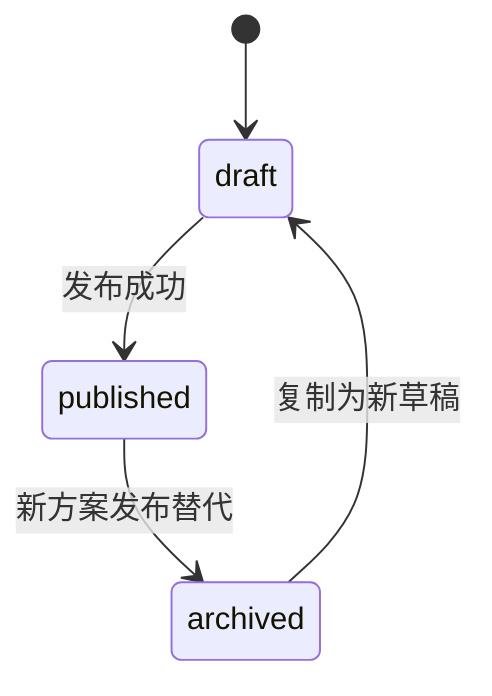
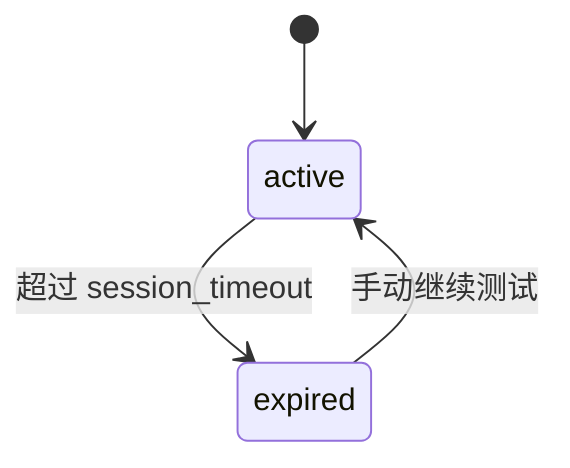

# 对话方案模块详细设计

## 1. 模块实体详设

### 1.1 实体: `dialog_profile`

| 字段 | 类型 | 约束 | 说明 |
|------|------|------|------|
| `id` | `VARCHAR(32)` | PK | 方案主键 |
| `name` | `VARCHAR(80)` | UNIQUE, NOT NULL | 方案名称 |
| `status` | `ENUM('draft','published','archived')` | NOT NULL | 当前状态 |
| `llm_model` | `VARCHAR(50)` | NOT NULL | 选中的大模型 |
| `routing_strategy` | `VARCHAR(30)` | NOT NULL | 路由策略 |
| `persona_name` | `VARCHAR(50)` | NOT NULL | 人设名称 |
| `persona_prompt` | `TEXT` | NOT NULL | 人设描述 |
| `intent_threshold` | `DECIMAL(4,2)` | NOT NULL | 指令命中阈值 |
| `session_timeout_minutes` | `INT` | NOT NULL | 会话超时时间 |
| `knowledge_base_id` | `VARCHAR(32)` | NULL | 默认知识库 |
| `publish_version` | `INT` | NOT NULL, default `0` | 已发布版本号 |
| `created_at` | `TIMESTAMP` | NOT NULL | 创建时间 |
| `updated_at` | `TIMESTAMP` | NOT NULL | 更新时间 |

### 1.2 实体: `dialog_profile_library_binding`

| 字段 | 类型 | 约束 | 说明 |
|------|------|------|------|
| `id` | `VARCHAR(32)` | PK | 绑定主键 |
| `profile_id` | `VARCHAR(32)` | FK `dialog_profile.id` | 所属方案 |
| `library_id` | `VARCHAR(32)` | NOT NULL | 指令库 ID |
| `library_name` | `VARCHAR(80)` | NOT NULL | 指令库名称快照 |
| `published_model_name` | `VARCHAR(80)` | NULL | 当前 published 模型 |
| `priority` | `INT` | NOT NULL | 调用优先级 |
| `created_at` | `TIMESTAMP` | NOT NULL | 创建时间 |

### 1.3 实体: `test_session`

| 字段 | 类型 | 约束 | 说明 |
|------|------|------|------|
| `id` | `VARCHAR(32)` | PK | 测试会话主键 |
| `profile_id` | `VARCHAR(32)` | FK `dialog_profile.id` | 关联方案 |
| `name` | `VARCHAR(80)` | NOT NULL | 会话名称 |
| `device_context_json` | `TEXT` | NOT NULL | 设备上下文 |
| `message_count` | `INT` | NOT NULL, default `0` | 消息数 |
| `last_message_at` | `TIMESTAMP` | NULL | 最近消息时间 |
| `created_at` | `TIMESTAMP` | NOT NULL | 创建时间 |

### 1.4 实体: `test_session_message`

| 字段 | 类型 | 约束 | 说明 |
|------|------|------|------|
| `id` | `VARCHAR(32)` | PK | 消息主键 |
| `session_id` | `VARCHAR(32)` | FK `test_session.id` | 关联会话 |
| `role` | `ENUM('user','assistant')` | NOT NULL | 消息角色 |
| `text` | `TEXT` | NOT NULL | 消息正文 |
| `debug_trace_json` | `TEXT` | NULL | 调试信息 |
| `response_time_ms` | `INT` | NULL | 响应耗时 |
| `created_at` | `TIMESTAMP` | NOT NULL | 创建时间 |

## 2. 状态机

### 2.1 `dialog_profile.status`



| 从 | 到 | 触发条件 | 前置校验 | 副作用 |
|---|----|---------|---------|--------|
| `draft` | `published` | PM 点击发布 | 至少绑定一个有 published 模型的指令库 | `publish_version + 1`，归档旧 published |
| `published` | `archived` | 其他方案发布成功 | 无 | 保留只读快照 |

### 2.2 `test_session` 生命周期



## 3. 核心算法

### 3.1 算法: `validate_profile_payload`

```text
assert name is not blank
assert 0 <= intent_threshold <= 1
assert 1 <= session_timeout_minutes <= 60
assert llm_model in allowed_models
assert routing_strategy in {'intent_first', 'knowledge_first', 'hybrid'}

for each library_id in bindings:
    load library snapshot
    if library not found:
        raise PROFILE-404-LIBRARY

return normalized payload
```

### 3.2 算法: `build_publish_guard`

```text
guard_items = []
if bindings is empty:
    add "未绑定任何指令库"

for each binding:
    if binding.published_model_name is empty:
        add "指令库缺少已发布模型"

if persona_prompt is blank:
    add "人设描述未配置"

if intent_threshold <= 0:
    add "阈值配置无效"

return guard_items
```

### 3.3 算法: `run_manual_test_message`

```text
load session + profile + bindings
append user message

route = resolve_route(text, routing_strategy, bindings)
intent = best_intent or 'fallback'
slots = simple slot extraction from keywords
response = render_response(persona_name, intent, device_context, slots)
response_time_ms = simulated or measured elapsed time

debug_trace = {
  route,
  intent,
  slots,
  model: profile.llm_model,
  bindings: binding names,
  threshold: intent_threshold
}

append assistant message
update session.message_count and last_message_at
return reply and debug_trace
```

## 4. 模块级错误码

| 错误码 | 触发条件 | 用户提示 |
|--------|---------|---------|
| `PROFILE-404-NOT-FOUND` | 方案不存在 | 目标对话方案不存在 |
| `PROFILE-404-LIBRARY` | 绑定指令库不存在 | 指令库已失效，请重新选择 |
| `PROFILE-409-NAME` | 方案名重复 | 对话方案名称已存在 |
| `PROFILE-409-PUBLISH-GATE` | 发布前校验失败 | 当前方案未满足发布条件 |
| `PROFILE-422-THRESHOLD` | 阈值越界 | 阈值必须在 0 到 1 之间 |
| `PROFILE-422-TIMEOUT` | 会话超时配置非法 | 会话超时必须在 1 到 60 分钟 |
| `SESSION-404-NOT-FOUND` | 会话不存在 | 测试会话不存在 |
| `SESSION-422-MESSAGE` | 测试消息为空 | 请输入测试内容 |

## 5. API 实现映射表

| AD 契约 | 处理器 | 服务方法 | 读写实体 |
|---------|-------|---------|---------|
| `GET /dialog-profiles` | `list_dialog_profiles()` | `query_profile_directory()` | `dialog_profile`, `dialog_profile_library_binding` |
| `POST /dialog-profiles` | `create_dialog_profile()` | `create_profile()` | `dialog_profile`, `dialog_profile_library_binding`, `audit_log` |
| `GET /dialog-profiles/{id}` | `get_dialog_profile_detail()` | `get_profile_detail()` | `dialog_profile`, `published_version`, `dialog_profile_library_binding` |
| `PATCH /dialog-profiles/{id}` | `update_dialog_profile()` | `update_profile()` | `dialog_profile`, `dialog_profile_library_binding`, `audit_log` |
| `POST /dialog-profiles/{id}/publish` | `publish_dialog_profile()` | `publish_profile()` | `dialog_profile`, `published_version`, `audit_log` |
| `POST /dialog-profiles/{id}/test-sessions` | `create_test_session()` | `create_test_session()` | `test_session` |
| `GET /test-sessions/{id}` | `get_test_session()` | `get_test_session_detail()` | `test_session`, `test_session_message` |
| `POST /test-sessions/{id}/messages` | `send_test_message()` | `run_manual_test_message()` | `test_session`, `test_session_message` |

## 6. 前端 UI 规格

### 6.1 页面结构

| 页面 | 核心区域 | 真实成功信号 |
|------|---------|-------------|
| `DialogProfilePage` | 方案列表、状态统计、新建弹窗 | 新建/编辑后列表与详情同步回读 |
| `DialogProfileDetailPage` | 基本配置、人设、绑定库、发布门禁卡片 | 发布门禁结果来自后端 |
| `DialogProfileTestPage` | 会话列表、聊天区、调试面板、设备上下文 | 消息、trace、耗时均来自后端 |

### 6.2 交互约束

| 交互 | 约束 |
|------|------|
| 发布方案 | 按门禁结果阻断，不允许前端绕过 |
| 测试消息发送 | 发送后必须从接口返回真正 assistant 消息 |
| 会话切换 | 切换会话时立即回读对应消息，不拼接其他会话内容 |
| 绑定库配置 | 详情页保存后刷新 published 模型快照 |

### 6.3 浏览器探针映射

| harness probe | 页面动作 | 真实成功信号 |
|---------------|---------|-------------|
| `profile_publish_gate` | 发布未满足门禁的方案 | UI 展示后端返回的 blocker |
| `manual_test_trace` | 发送测试消息 | 页面展示 route / intent / slots / response_time_ms |
| `session_isolation` | 新建第二个会话并发送消息 | 两个会话历史互不混淆 |

## 7. 测试映射

| 设计对象 | 建议测试 |
|---------|---------|
| 方案创建/编辑/重名保护 | 契约测试 |
| 发布门禁与 published 切换 | 契约测试 + 集成测试 |
| 手动测试会话隔离 | 集成测试 |
| 调试信息与设备上下文回读 | 契约测试 + 前端页面测试 |
| 列表/详情/测试页联动 | 前端页面测试 + browser smoke |
