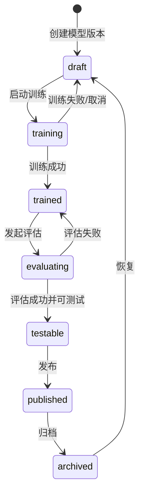

# 指令库管理详细设计

## 1. 模块实体详设

### 1.1 实体: `command_library`

| 字段 | 类型 | 约束 | 说明 |
|------|------|------|------|
| `id` | `UUID` | PK | 指令库主键 |
| `library_key` | `VARCHAR(64)` | UNIQUE, NOT NULL, immutable | 全局唯一标识 |
| `name` | `VARCHAR(100)` | NOT NULL | 指令库名称 |
| `language` | `ENUM('zh','en')` | NOT NULL | 固定语种 |
| `description` | `TEXT` | NULL | 描述 |
| `model_limit` | `INT` | NOT NULL, default `5` | 单库模型上限 |
| `default_thresholds_json` | `JSON` | NOT NULL | 库级默认阈值 |
| `created_by` | `VARCHAR(32)` | NOT NULL | 创建人 |
| `created_at` | `TIMESTAMP` | NOT NULL | 创建时间 |
| `updated_at` | `TIMESTAMP` | NOT NULL | 更新时间 |

### 1.2 实体: `library_model_version`

| 字段 | 类型 | 约束 | 说明 |
|------|------|------|------|
| `id` | `UUID` | PK | 模型版本主键 |
| `library_id` | `UUID` | FK `command_library.id` | 所属指令库 |
| `version_name` | `VARCHAR(50)` | NOT NULL | 版本名 |
| `status` | `ENUM` | NOT NULL | `draft/training/trained/evaluating/testable/published/archived` |
| `training_dataset_id` | `UUID` | FK | 训练集，1:1 |
| `artifact_uri` | `TEXT` | NULL | 模型下载地址 |
| `artifact_format` | `VARCHAR(20)` | NULL | `onnx/tensorrt/zip` |
| `metrics_json` | `JSON` | NULL | 训练/评估指标 |
| `is_testable` | `BOOLEAN` | NOT NULL | testable 标记 |
| `is_published` | `BOOLEAN` | NOT NULL | published 标记 |
| `created_at` | `TIMESTAMP` | NOT NULL | 创建时间 |
| `updated_at` | `TIMESTAMP` | NOT NULL | 更新时间 |

### 1.3 实体: `library_dataset`

| 字段 | 类型 | 约束 | 说明 |
|------|------|------|------|
| `id` | `UUID` | PK | 数据集主键 |
| `library_id` | `UUID` | FK | 所属指令库 |
| `dataset_type` | `ENUM('training','evaluation')` | NOT NULL | 数据集类型 |
| `name` | `VARCHAR(100)` | NOT NULL | 数据集名称 |
| `source` | `ENUM('manual','llm','import')` | NOT NULL | 数据来源 |
| `bound_model_id` | `UUID` | NULL, FK | 训练集绑定模型 |
| `sample_count` | `INT` | NOT NULL | 样本数 |
| `schema_version` | `VARCHAR(20)` | NOT NULL | 导入口径版本 |

### 1.4 实体: `evaluation_run`

| 字段 | 类型 | 约束 | 说明 |
|------|------|------|------|
| `id` | `UUID` | PK | 评估任务主键 |
| `model_id` | `UUID` | FK | 目标模型 |
| `dataset_id` | `UUID` | FK | 评估集 |
| `status` | `ENUM('queued','running','succeeded','failed')` | NOT NULL | 评估状态 |
| `threshold_snapshot_json` | `JSON` | NOT NULL | 任务创建时阈值快照 |
| `accuracy` | `DECIMAL(5,4)` | NULL | 指令准确率 |
| `slot_f1` | `DECIMAL(5,4)` | NULL | 槽位 F1，仅有槽位样本时有效 |
| `response_p95_ms` | `INT` | NULL | 响应延迟 p95 |
| `analysis_json` | `JSON` | NULL | 智能分析结果 |
| `created_at` | `TIMESTAMP` | NOT NULL | 创建时间 |
| `finished_at` | `TIMESTAMP` | NULL | 完成时间 |

## 2. 状态机

### 2.1 `library_model_version.status`



| 从 | 到 | 触发条件 | 前置校验 | 副作用 |
|---|----|---------|---------|--------|
| `draft` | `training` | 点击训练 | 当前库模型数未超限；训练集存在且未冲突 | 写入训练任务，真实异步执行 |
| `trained` | `evaluating` | 点击批量评估 | 评估集存在；快照阈值已生成 | 写入 `evaluation_run` |
| `evaluating` | `testable` | 评估达成可测试结果 | 结果回写成功 | `is_testable=true`，取消同库旧 testable |
| `testable` | `published` | 点击发布 | 操作者具备 `model_publish` | `is_published=true`，取消同库旧 published |

## 3. 核心算法

### 3.1 算法: `create_library`

```text
validate library_key/name/language/default_thresholds
if library_key already exists:
    raise LIB-409-KEY

insert command_library(
  library_key,
  language,
  model_limit=5,
  default_thresholds_json
)
write audit log "library_created"
return library snapshot
```

### 3.2 算法: `start_training`

```text
load library and current model count
if active model count >= 5:
    raise MODEL-409-LIMIT

load training dataset
if dataset.dataset_type != training:
    raise DATASET-422-TYPE
if training dataset already bound to another model:
    raise DATASET-409-TRAINING-BOUND

create model version status=draft
bind training dataset 1:1
switch model status to training
enqueue training worker
return queued/running snapshot
```

### 3.3 算法: `build_threshold_snapshot`

```text
library_defaults = command_library.default_thresholds_json
task_override = request.threshold_override

snapshot = merge(library_defaults, task_override)
snapshot.source = {
  library_defaults_version,
  override_fields
}

return snapshot
```

**说明**:
- 当前只冻结“快照写入”与“覆盖优先级”
- `FR-050` 尚未覆盖“前端展示继承链路”的完整可视化，因此仍为 `Partial`

### 3.4 算法: `finish_evaluation`

```text
load evaluation run + validation set
compute intent_accuracy over 39 validation cases
compute slot_f1 only for 21 required-slot cases
compute response_p95_ms
generate analysis_json

update evaluation_run(status=succeeded, metrics, analysis)
if metrics meet testable baseline:
    set model status=testable
    unset sibling testable flags in same library
else:
    set model status=trained
```

### 3.5 算法: `publish_model`

```text
load target model
require capability model_publish
if model status not in [testable, published]:
    raise MODEL-409-PUBLISH-STATE

unset sibling published flags in same library
set target is_published = true
retain is_testable when same model can hold both flags
write artifact metadata
write audit log "model_published"
return latest state snapshot
```

## 4. 阈值与验证集冻结

### 4.1 冻结门槛

| 指标 | 冻结值 | 适用模块 |
|------|--------|---------|
| `command_intent_accuracy_min` | `0.95` | `pd-intent-library` |
| `slot_f1_min` | `0.90` | `pd-intent-library` |
| `response_p95_ms` | `2000` | `pd-intent-library` |

### 4.2 验证集来源

| 字段 | 值 |
|------|----|
| `validation_set_path` | `.specify/harness/core-validation-set.json` |
| `source_config_path` | `temp_data/config.json` |
| `intent_count` | `39` |
| `required_slot_case_count` | `21` |

## 5. 模块级错误码

| 错误码 | 触发条件 | 用户提示 |
|--------|---------|---------|
| `LIB-409-KEY` | `library_key` 重复 | 指令库 Key 已存在，请更换后重试 |
| `MODEL-409-LIMIT` | 单库模型数超限 | 当前库模型已达上限，请先归档/删除历史模型 |
| `DATASET-409-TRAINING-BOUND` | 训练集已绑定其他模型 | 训练集必须与模型 1:1 绑定 |
| `DATASET-422-TYPE` | 数据集类型与动作不匹配 | 请选择正确的数据集类型 |
| `MODEL-409-PUBLISH-STATE` | 非法状态尝试发布 | 当前模型状态不允许直接发布 |
| `EVAL-422-THRESHOLD` | 阈值覆盖参数非法 | 阈值参数不合法 |

## 6. API 实现映射表

| AD 契约 | 处理器 | 服务方法 | 读写实体 |
|---------|-------|---------|---------|
| `GET /intent-libraries` | `list_libraries()` | `query_library_directory()` | `command_library`, `library_model_version` |
| `POST /intent-libraries` | `create_library()` | `create_library()` | `command_library`, `audit_log` |
| `GET /intent-libraries/{id}` | `get_library_detail()` | `get_library_detail()` | `command_library`, `library_model_version`, `library_dataset` |
| `POST /models/{id}/train` | `train_model()` | `start_training()` | `library_model_version`, `library_dataset` |
| `POST /models/{id}/evaluate` | `evaluate_model()` | `build_threshold_snapshot()` / `start_evaluation()` | `evaluation_run` |
| `POST /models/{id}/publish` | `publish_model()` | `publish_model()` | `library_model_version`, `audit_log` |
| `GET /models/{id}/download` | `download_model()` | `resolve_artifact_metadata()` | `library_model_version` |

## 7. 前端 UI 规格

### 7.1 页面结构

| 页面 | 核心区域 | 真实成功信号 |
|------|---------|-------------|
| `index` | 指令库表格、模型数量占用、创建弹窗 | 列表回读出现新库，`library_key` 不可编辑 |
| `detail` | 模型版本列表、状态流转、下载/发布操作 | 状态回读与唯一 testable/published 一致 |
| `datasets` | 训练集/评估集列表、导入入口、绑定提示 | 样本数、绑定关系、来源标识回读 |
| `dataset-detail` | 意图、槽位、追问、相似问/排除问管理 | 保存后内容可二次查询 |
| `test` | 单条测试对话、批量评估、分析报告 | 消息结果/评估任务来自真实契约回读 |

### 7.2 浏览器探针映射

| harness probe | 页面动作 | 真实成功信号 |
|---------------|---------|-------------|
| `training_state_transition` | 发起训练并轮询 | `draft -> training -> trained` 真正变化 |
| `batch_eval_feedback` | 发起批量评估并查看报告 | 指标快照、低分样本、建议真实返回 |
| `result_readback` | 创建库/改状态/导入数据集 | 列表与详情均从接口回读刷新 |

## 8. 测试映射

| 设计对象 | 建议测试 |
|---------|---------|
| `library_key` 唯一性 | 契约测试 |
| 模型数上限与 1:1 训练集绑定 | 集成测试 |
| 阈值快照覆盖规则 | 单元测试 |
| 状态机与唯一 testable/published | 集成测试 |
| 单条测试与批量评估页面 | 浏览器 smoke + E2E |
