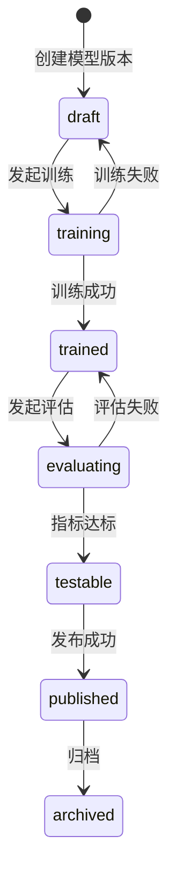

# 指令库管理详细设计

## 1. 设计目标

- 将 `ai-intent-library` 的页面能力、动作契约和关键业务规则落到可实现设计。
- 重新定义 `dataset-detail` 的深交互承接方式，避免其再次退化为只读样本表。
- 把已存在实现中可复用的接口和状态机保留下来，但所有完成性结论都需要重新由测试和 smoke 证明。

## 2. 实体模型

### 2.1 `command_library`

| 字段 | 类型 | 约束 | 说明 |
|------|------|------|------|
| `id` | `UUID` | PK | 指令库主键 |
| `library_key` | `VARCHAR(64)` | UNIQUE, immutable | 人类可识别唯一标识 |
| `name` | `VARCHAR(100)` | NOT NULL | 指令库名称 |
| `language` | `ENUM('zh','en')` | NOT NULL | 固定语种 |
| `description` | `TEXT` | NULL | 描述 |
| `model_limit` | `INT` | default `5` | 单库模型上限 |
| `default_thresholds_json` | `JSON` | NOT NULL | 库级默认阈值 |
| `created_at` | `TIMESTAMP` | NOT NULL | 创建时间 |
| `updated_at` | `TIMESTAMP` | NOT NULL | 更新时间 |

### 2.2 `library_model_version`

| 字段 | 类型 | 约束 | 说明 |
|------|------|------|------|
| `id` | `UUID` | PK | 模型版本主键 |
| `library_id` | `UUID` | FK | 所属指令库 |
| `version_name` | `VARCHAR(50)` | NOT NULL | 版本名 |
| `status` | `ENUM` | NOT NULL | `draft/training/trained/evaluating/testable/published/archived` |
| `training_dataset_id` | `UUID` | NULL, FK | 训练集 1:1 绑定 |
| `artifact_uri` | `TEXT` | NULL | 下载地址 |
| `artifact_format` | `VARCHAR(20)` | NULL | `zip/onnx/tensorrt` |
| `metrics_json` | `JSON` | NULL | 训练或评估指标 |
| `is_testable` | `BOOLEAN` | NOT NULL | 单库唯一 testable |
| `is_published` | `BOOLEAN` | NOT NULL | 单库唯一 published |
| `created_at` | `TIMESTAMP` | NOT NULL | 创建时间 |
| `updated_at` | `TIMESTAMP` | NOT NULL | 更新时间 |

### 2.3 `library_dataset`

| 字段 | 类型 | 约束 | 说明 |
|------|------|------|------|
| `id` | `UUID` | PK | 数据集主键 |
| `library_id` | `UUID` | FK | 所属指令库 |
| `dataset_type` | `ENUM('training','evaluation')` | NOT NULL | 数据集类型 |
| `name` | `VARCHAR(100)` | NOT NULL | 数据集名称 |
| `source` | `ENUM('manual','llm','import')` | NOT NULL | 数据来源 |
| `bound_model_id` | `UUID` | NULL, FK | 训练集绑定模型 |
| `sample_count` | `INT` | NOT NULL | 样本数 |
| `schema_version` | `VARCHAR(20)` | NOT NULL | 导入口径版本 |
| `payload_json` | `JSON` | NOT NULL | 数据详情载荷 |

### 2.4 `evaluation_run`

| 字段 | 类型 | 约束 | 说明 |
|------|------|------|------|
| `id` | `UUID` | PK | 评估任务主键 |
| `model_id` | `UUID` | FK | 目标模型 |
| `dataset_id` | `UUID` | FK | 评估集 |
| `status` | `ENUM('queued','running','succeeded','failed')` | NOT NULL | 评估状态 |
| `threshold_snapshot_json` | `JSON` | NOT NULL | 创建任务时的阈值快照 |
| `accuracy` | `DECIMAL(5,4)` | NULL | 指令准确率 |
| `slot_f1` | `DECIMAL(5,4)` | NULL | 槽位 F1 |
| `response_p95_ms` | `INT` | NULL | p95 响应时间 |
| `analysis_json` | `JSON` | NULL | 分析摘要与建议 |
| `finished_at` | `TIMESTAMP` | NULL | 完成时间 |

## 3. 页面到接口映射

| 页面 | 读取接口 | 写入接口 | 真实成功信号 |
|------|----------|----------|-------------|
| `index` | `GET /api/v1/intent-libraries` | `POST /api/v1/intent-libraries`、`DELETE /api/v1/intent-libraries/{library_id}` | 列表回读新增/移除项 |
| `detail` | `GET /api/v1/intent-libraries/{library_id}` | `POST /api/v1/intent-libraries/{library_id}/models/train`、`POST /api/v1/models/{model_id}/publish`、归档接口 | 模型状态和标记矩阵回读 |
| `datasets` | `GET /api/v1/intent-libraries/{library_id}` | `POST /api/v1/intent-libraries/{library_id}/datasets`、LLM 合成接口、导入接口 | 数据集目录、样本数、绑定状态回读 |
| `dataset-detail` | `GET /api/v1/intent-libraries/{library_id}/datasets/{dataset_id}` | intent/slot/entity/sample 写接口 | Drawer / Modal 保存后详情快照回读 |
| `test` | `GET /api/v1/intent-libraries/{library_id}` | `POST /api/v1/models/{model_id}/single-test`、`POST /api/v1/models/{model_id}/evaluate` | 单条测试结果和评估记录回读 |

## 4. 状态机

### 4.1 模型生命周期



| 从 | 到 | 触发动作 | 前置校验 | UI 必须看到什么 |
|---|----|----------|---------|----------------|
| `draft` | `training` | 发起训练 | 模型数未超限；训练集存在且未冲突 | 详情页状态从 `draft` 变为 `training` |
| `training` | `trained` | 后台任务收敛 | 训练完成并写回产物元数据 | 详情页回读 `trained` |
| `trained` | `evaluating` | 发起评估 | 存在评估集；阈值快照可生成 | 测试页新增评估记录 |
| `evaluating` | `testable` | 指标达标 | `accuracy/slot_f1/p95` 达标 | 当前模型唯一 `testable=true` |
| `testable` | `published` | 发布 | 操作者具备 `model_publish` | 当前模型唯一 `published=true` |

## 5. 关键算法

### 5.1 `create_library`

```text
validate library_key / name / language / default_thresholds
if library_key exists:
    raise LIB-409-KEY
insert command_library
create default training/evaluation datasets
return library snapshot
```

### 5.2 `start_training`

```text
load library detail
if model_count >= model_limit:
    raise MODEL-409-LIMIT
load training dataset
if dataset.dataset_type != training:
    raise DATASET-422-TYPE
if dataset already bound to another model:
    raise DATASET-409-TRAINING-BOUND
create model version
switch status to training
enqueue async settle
return model snapshot
```

### 5.3 `build_threshold_snapshot`

```text
defaults = library.default_thresholds_json
override = request.threshold_override
snapshot = merge(defaults, override)
snapshot.partial_requirement = "FR-050 Partial"
return snapshot
```

说明：
- 本轮冻结“默认值 + 任务级覆盖 + 快照保存”。
- 本轮不冻结“继承链路 UI 可视化”，因此 `FR-050` 仍保持 `Partial`。

### 5.4 `finish_evaluation`

```text
load validation set
compute command_intent_accuracy over 39 cases
compute slot_f1 over required-slot cases
compute response_p95_ms
write evaluation metrics and analysis_json
if metrics meet threshold:
    mark model testable
    unset sibling testable
else:
    revert model to trained
```

### 5.5 `publish_model`

```text
load target model
require status in [testable, published]
unset sibling published flags
set target published
retain testable when target remains current test model
write artifact metadata
return latest detail snapshot
```

## 6. `dataset-detail` 深交互设计

### 6.1 hidden_interactions 承接

| `hidden_interactions` | 旧 gate 兼容口径 | 需要的 UI/数据行为 |
|-----------------------|------------------|--------------------|
| `ui-capability`: 意图配置 Drawer | `functional-hidden-ui` | 编辑 `intent_key`、中文名、描述、命中/未命中话术、追问开关 |
| `ui-capability`: 相似问 / 排除问 Drawer | `functional-hidden-ui` | 新增、删除、回读正负样本 |
| `ui-capability`: 自定义词槽 Drawer | `functional-hidden-ui` | 编辑词槽、必填与实体引用 |
| `ui-capability`: 实体批量导入 Modal | `functional-hidden-ui` | Excel / 文本 / 粘贴三类导入入口和结果回读 |
| `ui-capability`: 新增问法 Modal | `functional-hidden-ui` | 新增训练样本并回读 |
| `instructional`: 数据模型 / 导入说明 / 易错点 | `explanatory-only` | 只承载说明，不计入实现闭环 |

### 6.2 页面最小闭环

| 动作 | 最小成功信号 | 最小失败反馈 |
|------|--------------|-------------|
| 保存意图 | intent 列表回读最新值 | 表单级错误，不允许静默失败 |
| 保存词槽/实体 | 词槽卡片和实体列表同步更新 | inline error 或 alert |
| 新增相似问/排除问 | Drawer 中新增记录可见 | 表单级错误 |
| 批量导入实体 | 实体值与同义词回读更新 | 明确失败原因；未做完必须保留延期声明 |

## 7. 错误码

| 错误码 | 触发条件 | 页面反馈 |
|--------|---------|---------|
| `LIB-409-KEY` | `library_key` 重复 | 创建弹窗字段错误 |
| `LIB-409-PUBLISHED` | 已发布模型所在指令库尝试删除 | 列表页删除动作被阻断 |
| `MODEL-409-LIMIT` | 模型数超限 | 详情页训练入口阻断 |
| `DATASET-409-TRAINING-BOUND` | 训练集已绑定其他模型 | 详情页或数据集页显示绑定冲突 |
| `DATASET-422-TYPE` | 数据集类型不匹配 | 表单错误 |
| `MODEL-409-PUBLISH-STATE` | 非法状态发布 | 详情页发布门禁反馈 |
| `EVAL-422-THRESHOLD` | 阈值覆盖参数非法 | 测试页评估失败反馈 |

## 8. Browser / 性能冻结

| 指标 | 冻结值 | 来源 |
|------|--------|------|
| `command_intent_accuracy_min` | `0.95` | `.specify/harness/module-rollout.json` |
| `slot_f1_min` | `0.90` | `.specify/harness/module-rollout.json` |
| `response_p95_ms` | `2000` | `.specify/harness/module-rollout.json` |
| `validation_case_count_min` | `39` | `.specify/harness/core-validation-set.json` |
| `required_slot_case_count_min` | `21` | `.specify/harness/core-validation-set.json` |

## 9. 测试映射

| 设计对象 | 必需测试 |
|---------|---------|
| `library_key` 唯一性、创建回读 | backend contract + frontend page test |
| 模型状态机和唯一 `testable/published` | backend flow test |
| 评估快照与 `FR-050 Partial` | backend flow test + test page UI test |
| 五页边界和导航链 | frontend routes test + browser smoke |
| `dataset-detail` 的 functional-hidden-ui | frontend page test + browser smoke capability parity |
| 单条测试与批量评估页面 | 浏览器 smoke + E2E |
