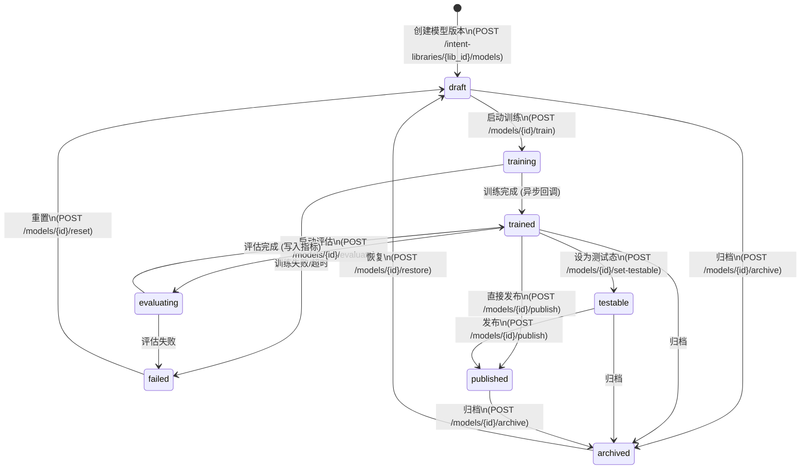
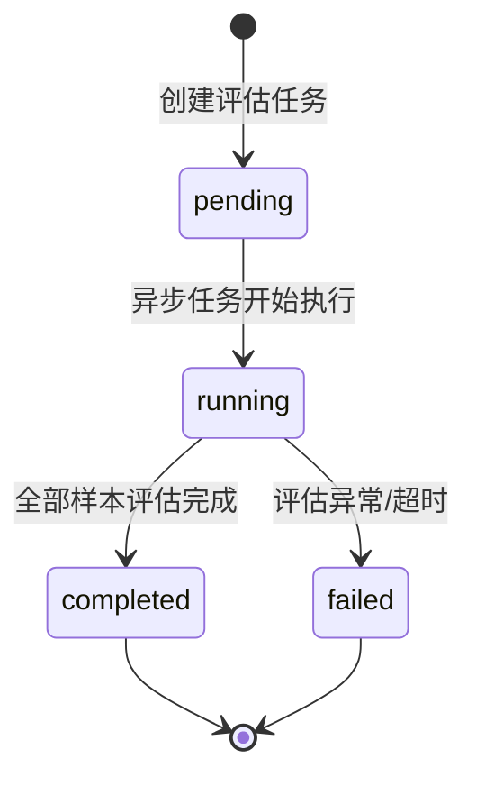

# 详细设计 (DD): 指令库管理模块

## 1. 文档说明

本文档是指令库管理模块的详细设计，覆盖 AD `ad-intent-library.md` 中定义的全部实体、状态机、算法和接口实现映射。

**内容范围**:
- 指令库域全部 12 个实体 (9 主实体 + 3 辅助实体) 的字段级定义
- LibraryModelVersion 七态生命周期状态机 + EvaluationRun 四态状态机
- 5 个核心算法 (意图分类推理、槽位提取、训练流水线、LLM 数据生成、模型评估)
- 模块级错误码 (E50xxx)
- 模块配置项与业务常量
- API 端点到内部实现的完整映射

**前置依赖**: dd-global.md (公共实体 User/Role、全局错误码格式、RBAC 权限模型、系统级配置)

---

## 2. 设计原则

遵循 dd-template.md §2 及 dd-global.md §2 约定:

- **一对一可编码**: 实体 → SQLAlchemy Model; 状态机 → 枚举 + 转移方法; 错误码 → BusinessException 子类
- **约束显式化**: VARCHAR 全标 max_length; 数值全标 range; 枚举全列合法值; 无 "适当/合理" 等模糊词
- **向后兼容**: 字段新增不移除; 枚举新增不删除; Alembic migration 遵循 dd-global.md §3.8 规范
- **证据优先**: 对外接口返回必须能支撑前端展示真实状态; 未完成能力返回明确错误或延期态, 不允许“已提交/演示成功”式假成功

---

## 3. 数据模型详设

### 3.1 实体: IntentLibrary (指令库)

**对应 FR**: FR-039
**对应 AD**: ad-intent-library.md §3.1
**表名**: `intent_libraries`

| 字段 | 类型 | 约束 | 默认值 | 索引 | 说明 |
|------|------|------|--------|------|------|
| id | UUID | PK | gen_random_uuid() | 主键 | 唯一标识 |
| library_key | VARCHAR(64) | NOT NULL, UNIQUE | - | 唯一索引 | 全局唯一标识, 创建后不可修改 (FR-039) |
| name | VARCHAR(100) | NOT NULL | - | - | 显示名称 |
| language | VARCHAR(8) | NOT NULL | - | 普通索引 | 语言, 枚举: zh / en |
| description | VARCHAR(500) | NULL | NULL | - | 描述 |
| default_confidence_threshold | FLOAT | NOT NULL | 0.7 | - | 库级默认置信度阈值, 范围 0.0~1.0 (FR-050) |
| default_intent_f1_threshold | FLOAT | NOT NULL | 0.95 | - | 库级默认意图 F1 评估阈值, 范围 0.0~1.0 |
| default_slot_f1_threshold | FLOAT | NOT NULL | 0.90 | - | 库级默认槽位 F1 评估阈值, 范围 0.0~1.0 |
| created_by | UUID | NULL, FK(users.id) | NULL | - | 创建人 |
| created_at | TIMESTAMP(TZ) | NOT NULL | now() | - | 创建时间 |
| updated_at | TIMESTAMP(TZ) | NOT NULL | now() | - | 更新时间 (触发器自动更新) |

**字段校验规则**:

| 字段 | 正则/规则 | 说明 |
|------|----------|------|
| library_key | `^[a-z][a-z0-9_-]{1,62}[a-z0-9]$` | 小写字母开头, 3~64 位, 允许下划线和连字符 |
| name | 非空, 去首尾空格后 1~100 字符 | - |
| language | `^(zh|en)$` | 仅中文/英文 |
| default_confidence_threshold | 0.0 ≤ x ≤ 1.0 | 两位小数精度 |

#### 索引

| 索引名 | 字段 | 类型 | 用途 |
|--------|------|------|------|
| uq_intent_libraries_library_key | (library_key) | B-Tree, UNIQUE | library_key 全局唯一 |
| idx_intent_libraries_language | (language) | B-Tree | 按语言筛选 |
| idx_intent_libraries_created_at | (created_at DESC) | B-Tree | 列表时间排序 |

#### 关系

| 关系 | 目标实体 | 类型 | 外键 | 级联策略 |
|------|---------|------|------|---------|
| 模型版本 | LibraryModelVersion | 一对多 | library_model_versions.library_id | RESTRICT (有模型时禁止删除库) |
| 训练数据集 | TrainingDataset | 一对多 | training_datasets.library_id | CASCADE DELETE |
| 评估数据集 | EvaluationDataset | 一对多 | evaluation_datasets.library_id | CASCADE DELETE |

#### 业务约束

- `library_key` 创建后不可修改 (UPDATE 语句排除该字段, 应用层拦截)
- 删除指令库前校验: 无非 archived 状态的模型版本, 否则返回 E50120
- 语言字段创建后不可修改 (与训练数据语种绑定)

---

### 3.2 实体: Intent (意图)

**对应 FR**: FR-002, FR-003, FR-049
**对应 AD**: ad-intent-library.md §3.4
**表名**: `intents`

| 字段 | 类型 | 约束 | 默认值 | 索引 | 说明 |
|------|------|------|--------|------|------|
| id | UUID | PK | gen_random_uuid() | 主键 | 唯一标识 |
| dataset_id | UUID | NOT NULL, FK(training_datasets.id) | - | 普通索引 | 所属训练数据集 |
| intent_key | VARCHAR(128) | NOT NULL | - | - | 意图标识, 数据集内唯一 |
| name_zh | VARCHAR(128) | NOT NULL | - | - | 中文名称 |
| description | VARCHAR(500) | NULL | NULL | - | 意图描述 |
| slot_keys | JSONB | NOT NULL | '[]' | - | 引用的词槽 key 列表, 如 ["temperature", "duration"] |
| follow_up_enabled | BOOLEAN | NOT NULL | false | - | 是否启用追问 |
| follow_up_prompt | VARCHAR(500) | NULL | NULL | - | 追问话术模板, follow_up_enabled=true 时条件必填 |
| hit_responses | JSONB | NOT NULL | '[]' | - | 命中话术列表, 支持 {slot} 变量替换, 如 ["已设置{temperature}度"] |
| miss_response | VARCHAR(500) | NULL | NULL | - | 未命中时兜底话术 |
| sort_order | INTEGER | NOT NULL | 0 | - | 排序序号, ≥ 0 |
| created_at | TIMESTAMP(TZ) | NOT NULL | now() | - | 创建时间 |
| updated_at | TIMESTAMP(TZ) | NOT NULL | now() | - | 更新时间 |

**字段校验规则**:

| 字段 | 正则/规则 | 说明 |
|------|----------|------|
| intent_key | `^[a-z][a-z0-9_]{0,126}[a-z0-9]$` | 小写字母开头, 2~128 位 |
| hit_responses | JSON array of string, 每项 max 500 字符 | 最多 10 条 |
| slot_keys | JSON array of string, 每项需在同数据集 Slot 中存在 | 应用层校验 |

#### 索引

| 索引名 | 字段 | 类型 | 用途 |
|--------|------|------|------|
| uq_intents_dataset_key | (dataset_id, intent_key) | B-Tree, UNIQUE | 数据集内意图唯一 |
| idx_intents_dataset_id | (dataset_id) | B-Tree | 按数据集筛选 |

#### 关系

| 关系 | 目标实体 | 类型 | 外键 | 级联策略 |
|------|---------|------|------|---------|
| 所属数据集 | TrainingDataset | 多对一 | dataset_id | CASCADE DELETE |
| 相似问 | SimilarQuestion | 一对多 | similar_questions.(dataset_id, intent_key) | CASCADE DELETE |
| 排除问 | NegativeExample | 一对多 | negative_examples.(dataset_id, intent_key) | CASCADE DELETE |

#### 业务约束

- slot_keys 中的每个 key 须在同数据集的 Slot 表中存在 (应用层校验)
- hit_responses 中的 `{slot_name}` 变量须对应 slot_keys 中已定义的词槽
- follow_up_enabled=true 时, follow_up_prompt 不可为空
- 删除意图级联删除该意图下所有 SimilarQuestion 和 NegativeExample

---

### 3.3 实体: Slot (词槽)

**对应 FR**: FR-002, FR-049
**对应 AD**: ad-intent-library.md §3.6
**表名**: `slots`

| 字段 | 类型 | 约束 | 默认值 | 索引 | 说明 |
|------|------|------|--------|------|------|
| id | UUID | PK | gen_random_uuid() | 主键 | 唯一标识 |
| dataset_id | UUID | NOT NULL, FK(training_datasets.id) | - | 普通索引 | 所属训练数据集 |
| slot_key | VARCHAR(64) | NOT NULL | - | - | 词槽标识, 数据集内唯一 |
| name_zh | VARCHAR(64) | NOT NULL | - | - | 中文名称 |
| description | VARCHAR(500) | NULL | NULL | - | 描述 |
| slot_type | VARCHAR(16) | NOT NULL | 'custom' | - | 类型枚举: system / custom |
| is_required | BOOLEAN | NOT NULL | false | - | 是否必填槽位 |
| prompt_text | VARCHAR(500) | NULL | NULL | - | 槽位缺失时的追问引导语 |
| sort_order | INTEGER | NOT NULL | 0 | - | 排序序号, ≥ 0 |
| created_at | TIMESTAMP(TZ) | NOT NULL | now() | - | 创建时间 |
| updated_at | TIMESTAMP(TZ) | NOT NULL | now() | - | 更新时间 |

#### 索引

| 索引名 | 字段 | 类型 | 用途 |
|--------|------|------|------|
| uq_slots_dataset_key | (dataset_id, slot_key) | B-Tree, UNIQUE | 数据集内词槽唯一 |
| idx_slots_dataset_id | (dataset_id) | B-Tree | 按数据集筛选 |

#### 关系

| 关系 | 目标实体 | 类型 | 外键 | 级联策略 |
|------|---------|------|------|---------|
| 所属数据集 | TrainingDataset | 多对一 | dataset_id | CASCADE DELETE |
| 实体值 | SlotEntity | 一对多 | slot_entities.slot_id | CASCADE DELETE |

#### 业务约束

- system 类型词槽: 随数据集自动创建, 不可删除, 不可修改 slot_key 和 slot_type
- custom 类型词槽: 可 CRUD
- 删除 custom 词槽前校验: 无 Intent 的 slot_keys 引用此 key, 否则返回 E50320

---

### 3.4 实体: LibraryModelVersion (模型版本)

**对应 FR**: FR-043~054
**对应 AD**: ad-intent-library.md §3.2, §4.5
**表名**: `library_model_versions`

| 字段 | 类型 | 约束 | 默认值 | 索引 | 说明 |
|------|------|------|--------|------|------|
| id | UUID | PK | gen_random_uuid() | 主键 | 唯一标识 |
| library_id | UUID | NOT NULL, FK(intent_libraries.id) | - | 普通索引 | 所属指令库 |
| version_name | VARCHAR(128) | NOT NULL | - | - | 版本名称 (用户可读, 如 "v1.0-cooking") |
| status | VARCHAR(24) | NOT NULL | 'draft' | 普通索引 | 生命周期状态, 枚举见 §4.1 |
| train_dataset_id | UUID | NULL, FK(training_datasets.id) | NULL | - | 绑定训练集 (1:1, FR-048) |
| train_config | JSONB | NOT NULL | '{}' | - | 训练超参配置, schema 见下方 |
| metrics | JSONB | NOT NULL | '{}' | GIN 索引 | 训练/评估指标, schema 见下方 |
| artifact_type | VARCHAR(32) | NULL | NULL | - | 产物类型枚举: onnx / tensorrt / zip |
| artifact_uri | TEXT | NULL | NULL | - | 产物文件路径, 格式 models/{library_key}/{model_id}/model.onnx |
| artifact_sha256 | VARCHAR(64) | NULL | NULL | - | 产物 SHA-256 校验码 (64 hex chars) |
| package_uri | TEXT | NULL | NULL | - | 下载包路径, 格式 models/{library_key}/{model_id}/package.zip |
| notes | TEXT | NULL | NULL | - | 版本备注, max 2000 字符 |
| is_testable | BOOLEAN | NOT NULL | false | 条件索引 | 是否为当前测试态 (同库唯一, FR-045) |
| is_published | BOOLEAN | NOT NULL | false | 条件索引 | 是否为当前发布态 (同库唯一, FR-045) |
| progress | INTEGER | NOT NULL | 0 | - | 训练/评估进度百分比, 范围 0~100 |
| published_at | TIMESTAMP(TZ) | NULL | NULL | - | 发布时间 |
| published_by | UUID | NULL, FK(users.id) | NULL | - | 发布人 |
| trained_at | TIMESTAMP(TZ) | NULL | NULL | - | 训练完成时间 |
| created_by | UUID | NULL, FK(users.id) | NULL | - | 创建人 |
| created_at | TIMESTAMP(TZ) | NOT NULL | now() | - | 创建时间 |
| updated_at | TIMESTAMP(TZ) | NOT NULL | now() | - | 更新时间 |

**train_config JSONB schema**:

```json
{
  "base_model": "string, default 'bert-base-chinese', enum: [bert-base-chinese, distilbert-base-chinese]",
  "learning_rate": "number, default 2e-5, range 1e-6 ~ 1e-3",
  "batch_size": "integer, default 32, enum: [8, 16, 32, 64]",
  "max_epochs": "integer, default 20, range 5 ~ 50",
  "early_stopping_patience": "integer, default 3, range 1 ~ 10",
  "max_seq_length": "integer, default 128, enum: [64, 128, 256]",
  "intent_loss_weight": "number, default 0.6, range 0.1 ~ 0.9, 联合训练中意图 loss 权重 α",
  "train_val_split": "number, default 0.8, range 0.5 ~ 0.95, 训练集/验证集拆分比例"
}
```

**metrics JSONB schema**:

```json
{
  "intent_accuracy": "number, 0.0~1.0, 意图分类准确率",
  "intent_f1": "number, 0.0~1.0, 意图 F1 (macro)",
  "slot_f1": "number, 0.0~1.0, 槽位 F1 (严格匹配)",
  "joint_accuracy": "number, 0.0~1.0, Intent+Slot 联合准确率",
  "precision": "number, 0.0~1.0",
  "recall": "number, 0.0~1.0",
  "confusion_matrix": "object, {intent_a: {intent_b: count}}",
  "low_score_samples": "array of {text, expected, predicted, score}",
  "loss_curve": "array of {epoch: int, train_loss: number, val_loss: number}",
  "total_samples": "integer, ≥ 0",
  "training_duration_seconds": "integer, ≥ 0"
}
```

#### 索引

| 索引名 | 字段 | 类型 | 用途 |
|--------|------|------|------|
| idx_lmv_library_id | (library_id) | B-Tree | 按库筛选 |
| idx_lmv_status | (status) | B-Tree | 按状态筛选 |
| uq_lmv_testable | (library_id) WHERE is_testable = true | B-Tree, UNIQUE PARTIAL | 同库 testable 唯一 |
| uq_lmv_published | (library_id) WHERE is_published = true | B-Tree, UNIQUE PARTIAL | 同库 published 唯一 |
| idx_lmv_metrics | (metrics) | GIN | JSONB 指标查询 |

#### 关系

| 关系 | 目标实体 | 类型 | 外键 | 级联策略 |
|------|---------|------|------|---------|
| 所属指令库 | IntentLibrary | 多对一 | library_id | RESTRICT |
| 绑定训练集 | TrainingDataset | 多对一 | train_dataset_id | SET NULL |
| 评估记录 | EvaluationRun | 一对多 | evaluation_runs.model_version_id | CASCADE DELETE |
| 测试会话 | IntentTestSession | 一对多 | intent_test_sessions.model_id | CASCADE DELETE |

#### 业务约束 (核心)

- **版本上限** (FR-043): 同一 library_id 下 status NOT IN ('archived') 的记录 ≤ 5
- **testable 唯一** (FR-045): 同一 library_id 下 is_testable=true 至多 1 条 (由 UNIQUE PARTIAL INDEX 保证)
- **published 唯一** (FR-045): 同一 library_id 下 is_published=true 至多 1 条
- **共存允许** (FR-046): 同一模型可同时 is_testable=true AND is_published=true
- **设为 testable**: 先 UPDATE SET is_testable=false WHERE library_id=? AND id!=?, 再设当前模型 is_testable=true, status='testable'
- **发布**: 先 UPDATE SET is_published=false WHERE library_id=? AND id!=?, 再设当前模型 is_published=true, status='published'; is_testable 保持不变 (FR-046)
- **归档**: is_testable=false, is_published=false, status='archived'
- **恢复** (FR-044): archived → draft, 受 5 个版本上限约束

---

### 3.5 实体: TrainingDataset (训练数据集)

**对应 FR**: FR-048, FR-049
**对应 AD**: ad-intent-library.md §3.3
**表名**: `training_datasets`

| 字段 | 类型 | 约束 | 默认值 | 索引 | 说明 |
|------|------|------|--------|------|------|
| id | UUID | PK | gen_random_uuid() | 主键 | 唯一标识 |
| library_id | UUID | NOT NULL, FK(intent_libraries.id) | - | 普通索引 | 所属指令库 |
| name | VARCHAR(128) | NOT NULL | - | - | 数据集名称 |
| description | VARCHAR(500) | NULL | NULL | - | 描述 |
| source_type | VARCHAR(16) | NOT NULL | 'manual' | - | 来源枚举: manual / llm / import / mixed |
| schema_version | VARCHAR(16) | NOT NULL | 'v1' | - | 数据格式版本 |
| sample_count | INTEGER | NOT NULL | 0 | - | 样本总数 (≥ 0, 由 SimilarQuestion 聚合) |
| intent_count | INTEGER | NOT NULL | 0 | - | 意图数量 (≥ 0, 由 Intent 聚合) |
| config | JSONB | NOT NULL | '{}' | - | 数据集配置 (LLM prompt 模板等) |
| file_uri | TEXT | NULL | NULL | - | 最近导入文件路径 |
| is_active | BOOLEAN | NOT NULL | true | - | 是否激活 (软删除标记) |
| created_by | UUID | NULL, FK(users.id) | NULL | - | 创建人 |
| created_at | TIMESTAMP(TZ) | NOT NULL | now() | - | 创建时间 |
| updated_at | TIMESTAMP(TZ) | NOT NULL | now() | - | 更新时间 |

#### 索引

| 索引名 | 字段 | 类型 | 用途 |
|--------|------|------|------|
| idx_td_library_id | (library_id) | B-Tree | 按库筛选 |
| idx_td_is_active | (is_active) WHERE is_active = true | B-Tree, PARTIAL | 过滤已删除 |

#### 关系

| 关系 | 目标实体 | 类型 | 外键 | 级联策略 |
|------|---------|------|------|---------|
| 所属指令库 | IntentLibrary | 多对一 | library_id | CASCADE DELETE |
| 意图 | Intent | 一对多 | intents.dataset_id | CASCADE DELETE |
| 词槽 | Slot | 一对多 | slots.dataset_id | CASCADE DELETE |
| 绑定模型 | LibraryModelVersion | 一对一 | library_model_versions.train_dataset_id | SET NULL |

#### 业务约束

- 训练集与模型版本 1:1 绑定 (FR-048): 一个训练集只能绑定到一个模型版本的 train_dataset_id
- 删除数据集前校验: 无 LibraryModelVersion.train_dataset_id 引用, 否则返回 E50520
- sample_count 和 intent_count 为反范式字段, 在 Intent/SimilarQuestion CRUD 时同步更新
- `config.sample_target` 为可选展示字段; 仅当其存在时前端才展示进度条, 否则展示真实 `sample_count`

---

### 3.6 实体: EvaluationDataset (评估数据集)

**对应 FR**: FR-048, FR-049
**对应 AD**: ad-intent-library.md §3.3
**表名**: `evaluation_datasets`

| 字段 | 类型 | 约束 | 默认值 | 索引 | 说明 |
|------|------|------|--------|------|------|
| id | UUID | PK | gen_random_uuid() | 主键 | 唯一标识 |
| library_id | UUID | NOT NULL, FK(intent_libraries.id) | - | 普通索引 | 所属指令库 |
| name | VARCHAR(128) | NOT NULL | - | - | 数据集名称 |
| description | VARCHAR(500) | NULL | NULL | - | 描述 |
| source_type | VARCHAR(16) | NOT NULL | 'manual' | - | 来源枚举: manual / llm / import / mixed |
| schema_version | VARCHAR(16) | NOT NULL | 'v1' | - | 数据格式版本 |
| sample_count | INTEGER | NOT NULL | 0 | - | 样本数量, ≥ 0 |
| samples | JSONB | NOT NULL | '[]' | GIN 索引 | 评估样本数组, schema 见下方 |
| config | JSONB | NOT NULL | '{}' | - | 数据集配置 |
| file_uri | TEXT | NULL | NULL | - | 最近导入文件路径 |
| is_active | BOOLEAN | NOT NULL | true | - | 是否激活 (软删除标记) |
| created_by | UUID | NULL, FK(users.id) | NULL | - | 创建人 |
| created_at | TIMESTAMP(TZ) | NOT NULL | now() | - | 创建时间 |
| updated_at | TIMESTAMP(TZ) | NOT NULL | now() | - | 更新时间 |

**samples JSONB schema** (每个元素):

```json
{
  "intent_key": "string, 必填",
  "utterance": "string, 必填, 测试文本",
  "language": "string, enum: zh/en",
  "source": "string, enum: manual/llm",
  "expected_result": "string, 预期意图",
  "expected_slots": "object, 预期槽位 {slot_key: value}",
  "threshold": "number, 0.0~1.0, 样本级阈值 (可选覆盖)",
  "actual_result": "string, nullable, 评估后回填",
  "actual_score": "number, nullable, 评估后回填",
  "is_hit": "boolean, nullable, 评估后回填"
}
```

#### 索引

| 索引名 | 字段 | 类型 | 用途 |
|--------|------|------|------|
| idx_ed_library_id | (library_id) | B-Tree | 按库筛选 |
| idx_ed_is_active | (is_active) WHERE is_active = true | B-Tree, PARTIAL | 过滤已删除 |

#### 关系

| 关系 | 目标实体 | 类型 | 外键 | 级联策略 |
|------|---------|------|------|---------|
| 所属指令库 | IntentLibrary | 多对一 | library_id | CASCADE DELETE |
| 评估记录 | EvaluationRun | 一对多 | evaluation_runs.dataset_id | RESTRICT |

#### 业务约束

- 评估集与模型版本非 1:1 (FR-048): 一个评估集可用于多个模型的评估
- FR-049: actual_result, actual_score, is_hit 导入时允许为空, 评估后自动回填
- sample_count 为反范式字段, 维护 len(samples) 同步

---

### 3.7 实体: EvaluationRun (评估任务)

**对应 FR**: FR-051, FR-052
**对应 AD**: ad-intent-library.md §3.7.4, §2.2
**表名**: `evaluation_runs`

| 字段 | 类型 | 约束 | 默认值 | 索引 | 说明 |
|------|------|------|--------|------|------|
| id | UUID | PK | gen_random_uuid() | 主键 | 唯一标识 |
| library_id | UUID | NOT NULL, FK(intent_libraries.id) | - | 普通索引 | 所属指令库 |
| model_version_id | UUID | NOT NULL, FK(library_model_versions.id) | - | 普通索引 | 被评估的模型 |
| dataset_id | UUID | NOT NULL, FK(evaluation_datasets.id) | - | - | 使用的评估集 |
| status | VARCHAR(24) | NOT NULL | 'pending' | 普通索引 | 状态枚举: pending / running / completed / failed |
| threshold_intent_f1 | FLOAT | NOT NULL | 0.95 | - | 意图 F1 通过阈值, 0.0~1.0 |
| threshold_slot_f1 | FLOAT | NOT NULL | 0.90 | - | 槽位 F1 通过阈值, 0.0~1.0 |
| snapshot | JSONB | NOT NULL | '{}' | - | 运行时配置快照 |
| result_summary | JSONB | NOT NULL | '{}' | - | 评估结果摘要, schema 见下方 |
| analysis | JSONB | NOT NULL | '{}' | - | LLM 智能分析结果, schema 见下方 |
| total_samples | INTEGER | NOT NULL | 0 | - | 评估样本总数 |
| completed_samples | INTEGER | NOT NULL | 0 | - | 已完成样本数 (进度追踪) |
| started_at | TIMESTAMP(TZ) | NULL | NULL | - | 开始执行时间 |
| completed_at | TIMESTAMP(TZ) | NULL | NULL | - | 完成时间 |
| created_by | UUID | NULL, FK(users.id) | NULL | - | 创建人 |
| created_at | TIMESTAMP(TZ) | NOT NULL | now() | - | 创建时间 |
| updated_at | TIMESTAMP(TZ) | NOT NULL | now() | - | 更新时间 |

**snapshot JSONB schema**:

```json
{
  "model_status": "string, 评估时的模型状态",
  "model_version_name": "string",
  "dataset_name": "string",
  "dataset_sample_count": "integer",
  "library_default_threshold": "number, 库级默认阈值"
}
```

**result_summary JSONB schema**:

```json
{
  "intent_accuracy": "number, 意图准确率",
  "intent_f1": "number, 意图 F1 (macro)",
  "intent_precision": "number",
  "intent_recall": "number",
  "slot_f1": "number, 槽位 F1 (严格匹配, 仅有槽位样本)",
  "joint_accuracy": "number, Intent+Slot 联合准确率",
  "pass_intent_threshold": "boolean, 是否通过意图阈值",
  "pass_slot_threshold": "boolean, 是否通过槽位阈值",
  "total_samples": "integer",
  "hit_count": "integer, 命中数",
  "confusion_pairs": "[{from: string, to: string, count: integer}], 混淆对 Top-N",
  "slot_errors": "[{slot: string, error_type: string, count: integer}], 槽位错误",
  "low_score_samples": "[{text, expected, predicted, score}], 低置信度样本"
}
```

**analysis JSONB schema** (FR-052):

```json
{
  "conclusion": "string, 总体结论",
  "confusion_analysis": "string, 混淆意图 TopN 分析",
  "slot_error_analysis": "string, 槽位错误类型分布分析",
  "low_score_analysis": "string, 低分样本分析",
  "suggestions": "[string], 改进建议列表",
  "generated_by": "string, enum: zenmux/manual",
  "generated_at": "datetime ISO8601"
}
```

#### 索引

| 索引名 | 字段 | 类型 | 用途 |
|--------|------|------|------|
| idx_er_library_id | (library_id) | B-Tree | 按库筛选 |
| idx_er_model_version_id | (model_version_id) | B-Tree | 按模型筛选 |
| idx_er_status | (status) | B-Tree | 按状态筛选 |
| idx_er_created_at | (created_at DESC) | B-Tree | 时间排序 |

#### 关系

| 关系 | 目标实体 | 类型 | 外键 | 级联策略 |
|------|---------|------|------|---------|
| 所属指令库 | IntentLibrary | 多对一 | library_id | CASCADE DELETE |
| 被评估模型 | LibraryModelVersion | 多对一 | model_version_id | CASCADE DELETE |
| 使用评估集 | EvaluationDataset | 多对一 | dataset_id | RESTRICT |

---

### 3.8 实体: IntentTestSession (测试会话)

**对应 FR**: FR-051
**对应 AD**: ad-intent-library.md §3.7.1
**表名**: `intent_test_sessions`

| 字段 | 类型 | 约束 | 默认值 | 索引 | 说明 |
|------|------|------|--------|------|------|
| id | UUID | PK | gen_random_uuid() | 主键 | 唯一标识 |
| model_id | UUID | NOT NULL, FK(library_model_versions.id) | - | 普通索引 | 所属模型版本 |
| name | VARCHAR(100) | NOT NULL | - | - | 会话名称, 默认自动生成 "测试会话 N" |
| message_count | INTEGER | NOT NULL | 0 | - | 消息数量 (反范式, ≥ 0) |
| created_by | UUID | NULL, FK(users.id) | NULL | - | 创建人 |
| created_at | TIMESTAMP(TZ) | NOT NULL | now() | - | 创建时间 |
| updated_at | TIMESTAMP(TZ) | NOT NULL | now() | - | 更新时间 (最后消息时间) |

#### 索引

| 索引名 | 字段 | 类型 | 用途 |
|--------|------|------|------|
| idx_its_model_id | (model_id) | B-Tree | 按模型筛选 |
| idx_its_updated_at | (updated_at DESC) | B-Tree | 按最后活跃时间排序 |

#### 关系

| 关系 | 目标实体 | 类型 | 外键 | 级联策略 |
|------|---------|------|------|---------|
| 所属模型 | LibraryModelVersion | 多对一 | model_id | CASCADE DELETE |
| 消息 | IntentTestMessage | 一对多 | intent_test_messages.session_id | CASCADE DELETE |

#### 业务约束

- 会话名称自动生成规则: "测试会话 {N}", N = 同模型下已有会话数 + 1
- 删除会话时级联删除所有 IntentTestMessage
- 列表查询按 updated_at DESC 排序 (最新活跃在前)

---

### 3.9 实体: IntentTestMessage (测试消息)

**对应 FR**: FR-051
**对应 AD**: ad-intent-library.md §3.7.2, §3.7.3
**表名**: `intent_test_messages`

| 字段 | 类型 | 约束 | 默认值 | 索引 | 说明 |
|------|------|------|--------|------|------|
| id | UUID | PK | gen_random_uuid() | 主键 | 唯一标识 |
| session_id | UUID | NOT NULL, FK(intent_test_sessions.id) | - | 普通索引 | 所属测试会话 |
| role | VARCHAR(16) | NOT NULL | - | - | 角色枚举: user / assistant |
| text | VARCHAR(2000) | NOT NULL | - | - | 消息文本 (user 输入 max 500, assistant 回复 max 2000) |
| intent | VARCHAR(128) | NULL | NULL | - | 识别的意图 (仅 role=assistant) |
| confidence | FLOAT | NULL | NULL | - | 置信度 0.0~1.0 (仅 role=assistant) |
| slots | JSONB | NULL | NULL | - | 提取的槽位 [{name, value, type}] (仅 role=assistant) |
| latency_ms | INTEGER | NULL | NULL | - | 推理耗时毫秒 (仅 role=assistant), ≥ 0 |
| debug_info | JSONB | NULL | NULL | - | 调试信息 (仅 role=assistant), schema 见下方 |
| created_at | TIMESTAMP(TZ) | NOT NULL | now() | - | 创建时间 |

**debug_info JSONB schema** (role=assistant):

```json
{
  "all_intents": "[{intent_key: string, score: number}], Top-5 意图排名",
  "tokenized_length": "integer, 分词后 token 数",
  "model_version": "string, 模型版本 ID",
  "threshold": "number, 使用的置信度阈值",
  "above_threshold": "boolean, 是否超过阈值"
}
```

#### 索引

| 索引名 | 字段 | 类型 | 用途 |
|--------|------|------|------|
| idx_itm_session_id | (session_id) | B-Tree | 按会话筛选 |
| idx_itm_created_at | (session_id, created_at DESC) | B-Tree | 页码分页: 按会话+时间倒序取最新消息窗口 |

#### 关系

| 关系 | 目标实体 | 类型 | 外键 | 级联策略 |
|------|---------|------|------|---------|
| 所属会话 | IntentTestSession | 多对一 | session_id | CASCADE DELETE |

#### 业务约束

- user 消息: text 长度 1~500 字符; intent/confidence/slots/latency_ms/debug_info 均为 NULL
- assistant 消息: 由系统自动生成, 与 user 消息成对出现
- 列表查询: 先按 created_at DESC 选取分页窗口, 再按时间正序返回当前页消息
- 分页参数: 使用 `page/page_size`, 默认 `page=1/page_size=10`
- `page_size` 当前上限为 200, 以适配测试页单次拉取最近消息

---

### 3.10 辅助实体: SlotEntity (词槽实体值)

**对应 FR**: FR-049
**对应 AD**: ad-intent-library.md §3.6
**表名**: `slot_entities`

| 字段 | 类型 | 约束 | 默认值 | 索引 | 说明 |
|------|------|------|--------|------|------|
| id | UUID | PK | gen_random_uuid() | 主键 | 唯一标识 |
| slot_id | UUID | NOT NULL, FK(slots.id) | - | 普通索引 | 所属词槽 |
| value | VARCHAR(256) | NOT NULL | - | - | 实体值 |
| synonyms | JSONB | NOT NULL | '[]' | - | 同义词列表, 如 ["一百八十度", "180°"] |
| created_at | TIMESTAMP(TZ) | NOT NULL | now() | - | 创建时间 |

#### 索引

| 索引名 | 字段 | 类型 | 用途 |
|--------|------|------|------|
| uq_slot_entities_value | (slot_id, value) | B-Tree, UNIQUE | 同词槽下实体值唯一 |
| idx_slot_entities_slot_id | (slot_id) | B-Tree | 按词槽筛选 |

#### 业务约束

- 实体数量无上限, 查询时分页 (page_size 默认 50, max 200)
- 批量导入: Excel 两列 `entity_value | synonyms` (逗号分隔); 文本一行一个, 逗号分隔同义词
- 导入模式: append (追加, value 重复则跳过) / overwrite (覆盖全部先清空再导入)

---

### 3.11 辅助实体: SimilarQuestion (相似问 / 正样本)

**对应 FR**: FR-049
**对应 AD**: ad-intent-library.md §3.5
**表名**: `similar_questions`

| 字段 | 类型 | 约束 | 默认值 | 索引 | 说明 |
|------|------|------|--------|------|------|
| id | UUID | PK | gen_random_uuid() | 主键 | 唯一标识 |
| dataset_id | UUID | NOT NULL, FK(training_datasets.id) | - | - | 所属数据集 |
| intent_key | VARCHAR(128) | NOT NULL | - | - | 所属意图 |
| text | VARCHAR(512) | NOT NULL | - | - | 用户表述文本 |
| language | VARCHAR(8) | NOT NULL | 'zh' | - | 语言枚举: zh / en |
| source | VARCHAR(16) | NOT NULL | 'manual' | - | 来源枚举: manual / llm |
| slot_annotations | JSONB | NULL | NULL | - | 槽位标注 [{slot_key, value, start, end}] |
| created_at | TIMESTAMP(TZ) | NOT NULL | now() | - | 创建时间 |

#### 索引

| 索引名 | 字段 | 类型 | 用途 |
|--------|------|------|------|
| idx_sq_dataset_intent | (dataset_id, intent_key) | B-Tree | 按数据集+意图筛选 |
| uq_sq_text | (dataset_id, intent_key, text) | B-Tree, UNIQUE | 同意图下文本去重 |

#### 业务约束

- 批量添加时自动去重: 已存在的 text 跳过, 返回 added_count + skipped_count
- slot_annotations: start/end 为文本字符偏移量, 用于 BIO 标注生成

---

### 3.12 辅助实体: NegativeExample (排除问 / 负样本)

**对应 FR**: FR-049
**对应 AD**: ad-intent-library.md §3.5
**表名**: `negative_examples`

| 字段 | 类型 | 约束 | 默认值 | 索引 | 说明 |
|------|------|------|--------|------|------|
| id | UUID | PK | gen_random_uuid() | 主键 | 唯一标识 |
| dataset_id | UUID | NOT NULL, FK(training_datasets.id) | - | - | 所属数据集 |
| intent_key | VARCHAR(128) | NOT NULL | - | - | 对应意图 (该文本不应匹配此意图) |
| text | VARCHAR(512) | NOT NULL | - | - | 用户表述文本 |
| language | VARCHAR(8) | NOT NULL | 'zh' | - | 语言枚举: zh / en |
| source | VARCHAR(16) | NOT NULL | 'manual' | - | 来源枚举: manual / llm |
| created_at | TIMESTAMP(TZ) | NOT NULL | now() | - | 创建时间 |

#### 索引

| 索引名 | 字段 | 类型 | 用途 |
|--------|------|------|------|
| idx_ne_dataset_intent | (dataset_id, intent_key) | B-Tree | 按数据集+意图筛选 |
| uq_ne_text | (dataset_id, intent_key, text) | B-Tree, UNIQUE | 同意图下文本去重 |

---

### 3.13 ER 关系图 (模块范围)

```
IntentLibrary (1) ──────────────────┬───────────── (*) LibraryModelVersion
      │                             │                        │
      │ (1:N)                       │ (1:N)                  │ (1:N)
      ▼                             ▼                        ▼
TrainingDataset (*)           EvaluationDataset (*)   IntentTestSession (*)
      │                             │                        │
      │ (1:1 绑定)                   │                        │ (1:N)
      │←── train_dataset_id ───     │                        ▼
      │     LibraryModelVersion     │                  IntentTestMessage (*)
      │                             │
      │ (1:N)                       │
      ├──────── Intent (*)          │
      │            │                │
      │            │ (1:N)          │
      │            ├── SimilarQuestion (*)
      │            └── NegativeExample (*)
      │
      │ (1:N)
      └──────── Slot (*)
                   │
                   │ (1:N)
                   └── SlotEntity (*)

EvaluationRun (*) ──(N:1)── LibraryModelVersion
EvaluationRun (*) ──(N:1)── EvaluationDataset
```

**跨域引用** (→ dd-global.md 实体):

```
IntentLibrary.created_by → User.id
LibraryModelVersion.created_by → User.id
LibraryModelVersion.published_by → User.id
TrainingDataset.created_by → User.id
EvaluationDataset.created_by → User.id
EvaluationRun.created_by → User.id
IntentTestSession.created_by → User.id
```

### 3.14 数据迁移规范

遵循 dd-global.md §3.8 迁移规范。本模块新增实体的 Alembic migration 示例:

```python
def upgrade():
    # 主表: intent_libraries
    op.create_table('intent_libraries',
        sa.Column('id', sa.UUID(), primary_key=True, server_default=sa.text('gen_random_uuid()')),
        sa.Column('library_key', sa.String(64), nullable=False, unique=True),
        sa.Column('name', sa.String(100), nullable=False),
        sa.Column('language', sa.String(8), nullable=False),
        sa.Column('description', sa.String(500)),
        sa.Column('default_confidence_threshold', sa.Float(), nullable=False, server_default='0.7'),
        sa.Column('default_intent_f1_threshold', sa.Float(), nullable=False, server_default='0.95'),
        sa.Column('default_slot_f1_threshold', sa.Float(), nullable=False, server_default='0.90'),
        sa.Column('created_by', sa.UUID(), sa.ForeignKey('users.id')),
        sa.Column('created_at', sa.DateTime(timezone=True), nullable=False, server_default=sa.func.now()),
        sa.Column('updated_at', sa.DateTime(timezone=True), nullable=False, server_default=sa.func.now()),
    )
    op.create_index('idx_intent_libraries_language', 'intent_libraries', ['language'])
    op.create_index('idx_intent_libraries_created_at', 'intent_libraries', ['created_at'], postgresql_using='btree')

    # 新增表: intent_test_sessions, intent_test_messages (新实体)
    op.create_table('intent_test_sessions',
        sa.Column('id', sa.UUID(), primary_key=True, server_default=sa.text('gen_random_uuid()')),
        sa.Column('model_id', sa.UUID(), sa.ForeignKey('library_model_versions.id', ondelete='CASCADE'), nullable=False),
        sa.Column('name', sa.String(100), nullable=False),
        sa.Column('message_count', sa.Integer(), nullable=False, server_default='0'),
        sa.Column('created_by', sa.UUID(), sa.ForeignKey('users.id')),
        sa.Column('created_at', sa.DateTime(timezone=True), nullable=False, server_default=sa.func.now()),
        sa.Column('updated_at', sa.DateTime(timezone=True), nullable=False, server_default=sa.func.now()),
    )
    op.create_index('idx_its_model_id', 'intent_test_sessions', ['model_id'])
    op.create_index('idx_its_updated_at', 'intent_test_sessions', [sa.text('updated_at DESC')])

    op.create_table('intent_test_messages',
        sa.Column('id', sa.UUID(), primary_key=True, server_default=sa.text('gen_random_uuid()')),
        sa.Column('session_id', sa.UUID(), sa.ForeignKey('intent_test_sessions.id', ondelete='CASCADE'), nullable=False),
        sa.Column('role', sa.String(16), nullable=False),
        sa.Column('text', sa.String(2000), nullable=False),
        sa.Column('intent', sa.String(128)),
        sa.Column('confidence', sa.Float()),
        sa.Column('slots', sa.JSON()),
        sa.Column('latency_ms', sa.Integer()),
        sa.Column('debug_info', sa.JSON()),
        sa.Column('created_at', sa.DateTime(timezone=True), nullable=False, server_default=sa.func.now()),
    )
    op.create_index('idx_itm_session_id', 'intent_test_messages', ['session_id'])
    op.create_index('idx_itm_created_at', 'intent_test_messages', ['session_id', sa.text('created_at DESC')])
```

---

## 4. 状态机定义

### 4.1 LibraryModelVersion 状态机

**对应 FR**: FR-043~054
**对应 AD**: ad-intent-library.md §2.1



#### 状态枚举

| 状态值 | 显示名 | 含义 | 允许的操作 |
|--------|-------|------|-----------|
| draft | 草稿 | 新建/恢复, 尚未训练 | 编辑、删除、启动训练、归档 |
| training | 训练中 | 异步训练任务执行中 | 查看进度 (只读) |
| trained | 已训练 | 训练完成, 可评估/测试/发布 | 启动评估、设为 testable、直接发布、归档 |
| evaluating | 评估中 | 异步评估任务执行中 | 查看进度 (只读) |
| testable | 可测试 | 已设为测试态 | 发布、归档、单条测试、批量测试 |
| published | 已发布 | 线上生效版本 | 归档、单条测试、批量测试 |
| failed | 失败 | 训练/评估异常终止 | 重置为 draft、删除 |
| archived | 已归档 | 终态 (不计入 5 个上限) | 恢复为 draft |

#### 状态转移规则

| 从 | 到 | 触发条件 | 前置校验 | 副作用 | 对应 API |
|----|------|---------|---------|--------|---------|
| [*] | draft | 用户创建模型 | 同库非 archived 模型数 < 5 (FR-043) | 绑定 train_dataset_id; progress=0 | POST /intent-libraries/{lib_id}/models |
| draft | training | 用户点击"训练" | train_dataset_id 非 NULL; 训练集 sample_count ≥ 10 | 提交异步训练任务; progress=0; status='training' | POST /models/{id}/train |
| training | trained | 训练回调成功 | - | 写入 metrics + artifact_uri + artifact_sha256; progress=100; trained_at=now() | 内部回调 |
| training | failed | 训练回调失败/超时(2h) | - | notes 写入错误信息 (截断 500 字符) | 内部回调 |
| failed | draft | 用户点击"重置" | - | 清空 metrics; progress=0; artifact_uri=NULL | POST /models/{id}/reset |
| trained | evaluating | 用户点击"评估" | eval_dataset_id 有效; eval 样本数 > 0 | 创建 EvaluationRun(status='pending'); 模型 status='evaluating' | POST /models/{id}/evaluate |
| evaluating | trained | 评估回调完成 | - | 写入 EvaluationRun.result_summary; 模型 status='trained' | 内部回调 |
| evaluating | failed | 评估回调失败/超时(1h) | - | EvaluationRun.status='failed'; notes 写入错误 | 内部回调 |
| trained | testable | 用户点击"设为测试" | 权限 model_test_manage (FR-053) | UPDATE 同库旧 is_testable=false; 当前 is_testable=true, status='testable' | POST /models/{id}/set-testable |
| testable | published | 用户点击"发布" | 权限 model_publish (FR-053) | UPDATE 同库旧 is_published=false; 当前 is_published=true, status='published'; published_at=now(); published_by=current_user | POST /models/{id}/publish |
| trained | published | 用户直接发布 (跳过 testable) | 权限 model_publish | 同上 | POST /models/{id}/publish |
| * (非 archived) | archived | 用户点击"归档" | 若 is_published=true, 校验无 DialogProfile 绑定此库且正在使用该模型 | is_testable=false; is_published=false; status='archived' | POST /models/{id}/archive |
| archived | draft | 用户点击"恢复" (FR-044) | 同库非 archived 模型数 < 5 | status='draft'; progress=0; 保留 metrics 和 artifact 以备重用 | POST /models/{id}/restore |

#### 唯一性约束 (FR-045, FR-046)

- **testable 唯一**: 同一 library_id 下 is_testable=true 的记录至多 1 条 — 由 UNIQUE PARTIAL INDEX `uq_lmv_testable` 保证
- **published 唯一**: 同一 library_id 下 is_published=true 的记录至多 1 条 — 由 UNIQUE PARTIAL INDEX `uq_lmv_published` 保证
- **共存允许** (FR-046): 同一模型可同时 is_testable=true AND is_published=true (两个 partial index 不冲突)
- **实现**: 应用层在事务内先执行 `UPDATE SET is_testable=false WHERE library_id=? AND id!=?`, 再设当前模型, 依赖 partial unique index 作为最后防线

### 4.2 EvaluationRun 状态机



| 从 | 到 | 触发条件 | 副作用 |
|----|------|---------|--------|
| [*] | pending | 用户创建评估任务 | total_samples = dataset.sample_count |
| pending | running | 异步任务开始 | started_at = now() |
| running | completed | 全部样本跑完 | completed_at = now(); 写入 result_summary; 触发 LLM 智能分析 (analysis) |
| running | failed | 异常/超时(1h) | completed_at = now(); result_summary.error 记录错误原因 |

---

## 5. 核心算法详设

### 5.1 算法: 意图分类推理 (classify_intent)

**对应 FR**: FR-027, FR-051
**对应 AD**: ad-intent-library.md §4.4

#### 输入输出

| 方向 | 参数 | 类型 | 约束 | 说明 |
|------|------|------|------|------|
| 输入 | text | string | NOT NULL, 1~500 字符 | 用户输入文本 |
| 输入 | model_artifact_uri | string | NOT NULL | ONNX 模型文件路径 |
| 输入 | label_map | dict | NOT NULL | intent_key ↔ label_id 映射 |
| 输入 | max_seq_length | int | 64/128/256 | 最大序列长度 |
| 输出 | intent | string | - | 识别的意图 key |
| 输出 | confidence | float | 0.0~1.0 | 最高置信度 (softmax) |
| 输出 | all_scores | list[dict] | - | 全部意图得分 [{intent_key, score}] |
| 输出 | latency_ms | int | ≥ 0 | 推理耗时 |

#### 伪代码

```python
def classify_intent(text: str, model_uri: str, label_map: dict,
                    max_seq_length: int = 128) -> IntentResult:
    onnx_session = get_or_load_onnx_session(model_uri)
    reverse_label_map = {v: k for k, v in label_map.items()}

    start = time.perf_counter()

    input_ids, attention_mask = tokenize(
        text, max_length=max_seq_length, padding="max_length", truncation=True
    )
    intent_logits = onnx_session.run(
        ["intent_logits"],
        {"input_ids": input_ids, "attention_mask": attention_mask}
    )[0]  # shape: (1, num_intents)

    probabilities = softmax(intent_logits[0])
    predicted_idx = argmax(probabilities)
    confidence = float(probabilities[predicted_idx])
    intent_key = reverse_label_map[predicted_idx]

    all_scores = sorted(
        [{"intent_key": reverse_label_map[i], "score": round(float(p), 4)}
         for i, p in enumerate(probabilities)],
        key=lambda x: x["score"], reverse=True
    )

    latency_ms = int((time.perf_counter() - start) * 1000)

    return IntentResult(
        intent=intent_key, confidence=confidence,
        all_scores=all_scores, latency_ms=latency_ms
    )


def get_or_load_onnx_session(model_uri: str) -> ort.InferenceSession:
    if model_uri in _model_cache:
        return _model_cache[model_uri]
    if len(_model_cache) >= MAX_CACHED_MODELS:
        evict_lru_model()
    session = ort.InferenceSession(model_uri, providers=["CPUExecutionProvider"])
    _model_cache[model_uri] = session
    return session
```

#### 边界条件

| 边界场景 | 处理方式 | 错误码 |
|---------|---------|--------|
| text 为空或超过 500 字符 | 400 参数校验 | E50601 |
| 模型文件不存在 (artifact_uri 无效) | 500 内部错误 | E50480 |
| 推理超时 (> 500ms) | 中断返回降级响应 {intent: "unknown", confidence: 0.0} | E50481 |
| 模型首次加载 (冷启动) | 同步加载, 耗时 2~5s, 后续请求命中缓存 | - |
| ONNX Runtime 异常 | 捕获 RuntimeError, 返回降级响应 | E50482 |

#### 复杂度

- **时间**: O(seq_length² × hidden_size) — BERT self-attention
- **空间**: O(model_params + batch × seq_length × hidden_size) ≈ 440MB (BERT-base)

---

### 5.2 算法: 槽位提取 (extract_slots)

**对应 FR**: FR-002, FR-027
**对应 AD**: ad-intent-library.md §4.2 (BERT + CRF)

#### 输入输出

| 方向 | 参数 | 类型 | 约束 | 说明 |
|------|------|------|------|------|
| 输入 | text | string | NOT NULL, 1~500 字符 | 用户输入文本 |
| 输入 | intent_key | string | NOT NULL | 已识别的意图 (用于限定候选槽位) |
| 输入 | model_artifact_uri | string | NOT NULL | ONNX 模型文件路径 |
| 输入 | slot_map | dict | NOT NULL | slot_tag ↔ tag_id 映射 (BIO 格式) |
| 输出 | slots | list[dict] | - | 提取的槽位 [{name, value, type, start, end}] |
| 输出 | latency_ms | int | ≥ 0 | 推理耗时 |

#### 伪代码

```python
def extract_slots(text: str, intent_key: str, model_uri: str,
                  slot_map: dict, max_seq_length: int = 128) -> SlotResult:
    onnx_session = get_or_load_onnx_session(model_uri)
    reverse_slot_map = {v: k for k, v in slot_map.items()}

    start = time.perf_counter()

    tokens = tokenize(text, max_length=max_seq_length,
                      return_offsets_mapping=True)
    input_ids = tokens["input_ids"]
    attention_mask = tokens["attention_mask"]
    offset_mapping = tokens["offset_mapping"]

    slot_logits = onnx_session.run(
        ["slot_logits"],
        {"input_ids": input_ids, "attention_mask": attention_mask}
    )[0]  # shape: (1, seq_length, num_slot_tags)

    tag_ids = viterbi_decode(slot_logits[0], attention_mask[0])

    bio_tags = [reverse_slot_map.get(tid, "O") for tid in tag_ids]

    slots = []
    current_slot = None
    for idx, (tag, offset) in enumerate(zip(bio_tags, offset_mapping)):
        if tag.startswith("B-"):
            if current_slot:
                slots.append(finalize_slot(current_slot, text))
            slot_name = tag[2:]
            current_slot = {"name": slot_name, "start": offset[0], "end": offset[1]}
        elif tag.startswith("I-") and current_slot and tag[2:] == current_slot["name"]:
            current_slot["end"] = offset[1]
        else:
            if current_slot:
                slots.append(finalize_slot(current_slot, text))
                current_slot = None
    if current_slot:
        slots.append(finalize_slot(current_slot, text))

    latency_ms = int((time.perf_counter() - start) * 1000)
    return SlotResult(slots=slots, latency_ms=latency_ms)


def finalize_slot(slot: dict, text: str) -> dict:
    slot["value"] = text[slot["start"]:slot["end"]].strip()
    return slot


def viterbi_decode(emissions: np.ndarray, mask: np.ndarray) -> list[int]:
    """CRF Viterbi 解码: 从 emission scores 中找到最优 BIO 标注序列."""
    seq_len = int(mask.sum())
    num_tags = emissions.shape[-1]
    dp = emissions[0].copy()
    backpointers = []
    for t in range(1, seq_len):
        bp = np.zeros(num_tags, dtype=int)
        for j in range(num_tags):
            scores = dp + TRANSITION_MATRIX[:, j] + emissions[t][j]
            bp[j] = int(np.argmax(scores))
            dp[j] = scores[bp[j]]
        backpointers.append(bp)
    best_last = int(np.argmax(dp))
    best_path = [best_last]
    for bp in reversed(backpointers):
        best_path.append(bp[best_path[-1]])
    best_path.reverse()
    return best_path
```

#### 边界条件

| 边界场景 | 处理方式 | 错误码 |
|---------|---------|--------|
| 无槽位命中 | 返回空列表 slots=[] | - |
| BIO 标注不连续 (I- 无对应 B-) | 忽略孤立的 I- 标签 | - |
| 槽位值跨越 [CLS]/[SEP] token | 按 offset_mapping 裁剪, 排除特殊 token | - |
| 文本包含中英混合 | WordPiece 分词自动处理, offset_mapping 回溯原文 | - |
| slot_map 中无对应 tag_id | 标记为 "O" (Outside), 不提取 | - |

#### 复杂度

- **时间**: O(seq_length × num_tags²) — Viterbi 解码
- **空间**: O(seq_length × num_tags) — DP 表

---

### 5.3 算法: 训练流水线 (train_model)

**对应 FR**: FR-043~044
**对应 AD**: ad-intent-library.md §4.3

#### 输入输出

| 方向 | 参数 | 类型 | 约束 | 说明 |
|------|------|------|------|------|
| 输入 | model_version_id | UUID | NOT NULL | 模型版本 ID |
| 输入 | train_config | dict | 见 §3.4 schema | 训练超参 |
| 输出 | metrics | dict | 见 §3.4 schema | 训练指标 |
| 输出 | artifact_uri | string | - | ONNX 模型产物路径 |
| 输出 | package_uri | string | - | 下载包路径 |

#### 伪代码

```python
async def train_model(model_version_id: UUID, train_config: dict) -> TrainResult:
    model = await db.get(LibraryModelVersion, model_version_id)
    if model.status != "draft":
        raise BusinessError("E50420", "当前状态不允许训练")

    dataset = await db.get(TrainingDataset, model.train_dataset_id)
    if not dataset or dataset.sample_count < MIN_TRAINING_SAMPLES:
        raise BusinessError("E50501", f"训练集样本不足, 最少需要{MIN_TRAINING_SAMPLES}条")

    await db.update(model, status="training", progress=0)
    background_tasks.add_task(_execute_training, model.id, dataset, train_config)
    return TrainResult(model_id=model.id, status="training")


async def _execute_training(model_id: UUID, dataset: TrainingDataset, config: dict):
    library = await db.get(IntentLibrary, dataset.library_id)
    try:
        # ── 步骤 1: 数据预处理 ──
        raw_samples = await load_similar_questions(dataset.id)
        intents = extract_unique_intents(raw_samples)
        label_map = {intent: idx for idx, intent in enumerate(sorted(intents))}
        slot_tags = extract_bio_tags(raw_samples)
        slot_map = {tag: idx for idx, tag in enumerate(sorted(slot_tags))}

        tokenized = tokenize_samples(raw_samples, max_length=config["max_seq_length"])
        train_set, val_set = stratified_split(
            tokenized, ratio=config["train_val_split"], stratify_by="intent_key"
        )
        await db.update_model_progress(model_id, 10)

        # ── 步骤 1b: 英文库 LLM 翻译 (FR-025) ──
        if library.language == "en":
            train_set = await translate_zh_to_en(train_set)
            val_set = await translate_zh_to_en(val_set)
            await db.update_model_progress(model_id, 20)

        # ── 步骤 2: 模型初始化 ──
        base_model = load_pretrained(config["base_model"])
        classifier = IntentSlotModel(
            base_model,
            num_intents=len(label_map),
            num_slot_tags=len(slot_map)
        )
        optimizer = AdamW(classifier.parameters(), lr=config["learning_rate"])

        # ── 步骤 3: 训练循环 (early stopping) ──
        alpha = config["intent_loss_weight"]
        best_val_f1 = 0.0
        patience_counter = 0
        loss_curve = []

        for epoch in range(config["max_epochs"]):
            intent_loss, slot_loss = train_one_epoch(
                classifier, train_set, optimizer, config["batch_size"]
            )
            total_loss = intent_loss * alpha + slot_loss * (1 - alpha)
            val_metrics = evaluate_on_set(classifier, val_set)

            loss_curve.append({
                "epoch": epoch + 1,
                "train_loss": round(float(total_loss), 4),
                "val_loss": round(float(val_metrics.get("val_loss", 0)), 4)
            })

            progress = 20 + int((epoch + 1) / config["max_epochs"] * 60)
            await db.update_model_progress(model_id, min(progress, 80))

            if val_metrics["intent_f1"] > best_val_f1:
                best_val_f1 = val_metrics["intent_f1"]
                save_checkpoint(classifier, f"models/{model_id}/best.pt")
                patience_counter = 0
            else:
                patience_counter += 1
                if patience_counter >= config["early_stopping_patience"]:
                    break

        # ── 步骤 4: 模型导出 (ONNX) ──
        classifier.load_state_dict(load_checkpoint(f"models/{model_id}/best.pt"))
        onnx_path = f"models/{library.library_key}/{model_id}/model.onnx"
        export_to_onnx(
            classifier, onnx_path,
            opset_version=ONNX_OPSET_VERSION,
            dynamic_axes={"input_ids": {0: "batch"}, "attention_mask": {0: "batch"}}
        )
        await db.update_model_progress(model_id, 90)

        # ── 步骤 5: 打包产物 (FR-054) ──
        package_dir = f"models/{library.library_key}/{model_id}"
        save_json(label_map, f"{package_dir}/label_map.json")
        save_json(slot_map, f"{package_dir}/slot_map.json")
        copy_tokenizer_files(config["base_model"], f"{package_dir}/tokenizer/")
        save_json({
            "model_id": str(model_id), "library_key": library.library_key,
            "language": library.language, "trained_at": utcnow().isoformat(),
            "dataset_id": str(dataset.id), "sample_count": dataset.sample_count,
            "metrics": val_metrics, "config": config
        }, f"{package_dir}/metadata.json")
        package_path = create_zip(package_dir, f"{package_dir}/package.zip")

        # ── 步骤 6: 写入结果 ──
        val_metrics["loss_curve"] = loss_curve
        val_metrics["total_samples"] = dataset.sample_count
        val_metrics["training_duration_seconds"] = int(time.time() - start_time)

        await db.update(model_id,
            status="trained", progress=100, trained_at=utcnow(),
            metrics=val_metrics,
            artifact_type="onnx", artifact_uri=onnx_path,
            artifact_sha256=compute_sha256(onnx_path),
            package_uri=package_path)

    except asyncio.TimeoutError:
        await db.update(model_id, status="failed",
            notes="训练超时 (超过 2 小时上限)")
    except RuntimeError as e:
        if "out of memory" in str(e).lower():
            await db.update(model_id, status="failed",
                notes="GPU 内存不足, 请减小 batch_size 或 max_seq_length")
        else:
            await db.update(model_id, status="failed", notes=str(e)[:500])
    except Exception as e:
        await db.update(model_id, status="failed", notes=str(e)[:500])
```

#### 边界条件

| 边界场景 | 处理方式 | 错误码 |
|---------|---------|--------|
| 训练集样本不足 (< 10) | 拒绝启动训练 | E50501 |
| 训练超时 (> 2h) | asyncio.TimeoutError 捕获, status='failed' | E50480 |
| GPU OOM | RuntimeError 捕获, 提示减小 batch_size | E50481 |
| ONNX 导出失败 | status='failed', 保留 .pt 文件 | E50482 |
| 英文库 LLM 翻译失败 | 使用中文原始数据降级训练, 记录 warning | - (降级) |
| 同库模型数已达上限 | 创建时拒绝 (非训练时) | E50420 |
| 数据集中只有 1 个意图 | 允许训练但 F1 无意义, 添加 warning | - (日志) |

#### 复杂度

- **时间**: O(epochs × samples × seq_length² × hidden_size) — BERT 前向+反向
- **空间**: O(model_params + batch_size × seq_length × hidden_size) ≈ 1.5GB (训练时)

---

### 5.4 算法: LLM 数据生成 (generate_data_with_llm)

**对应 FR**: FR-025, FR-048
**对应 AD**: ad-intent-library.md §3.3 (generate-training, generate-evaluation)

#### 输入输出

| 方向 | 参数 | 类型 | 约束 | 说明 |
|------|------|------|------|------|
| 输入 | dataset_id | UUID | NOT NULL | 目标数据集 ID |
| 输入 | intent_keys | list[str] | ≥ 1 | 要生成数据的意图列表 |
| 输入 | mode | string | enum: training / evaluation / translate | 生成模式 |
| 输入 | count_per_intent | int | 5~100, 默认 20 | 每个意图生成的样本数 |
| 输入 | custom_prompt | string | NULL, max 2000 | 用户自定义 prompt 模板 |
| 输出 | generated_count | int | ≥ 0 | 实际生成的样本数 |
| 输出 | skipped_count | int | ≥ 0 | 重复跳过的样本数 |
| 输出 | failed_intents | list[str] | ≥ 0 | 生成失败的意图 key 列表 |
| 输出 | warnings | list[str] | ≥ 0 | 部分成功时返回的警告信息 |

#### 伪代码

```python
async def generate_data_with_llm(
    dataset_id: UUID, intent_keys: list[str], mode: str,
    count_per_intent: int = 20, custom_prompt: str = None
) -> GenerateResult:
    ensure_llm_configured()
    dataset = await db.get_dataset(dataset_id)
    intents = await db.list_intents(dataset_id, intent_keys)
    if not intents:
        raise BusinessError("E50201", "数据集无可生成意图，请先添加意图")

    generated_count = 0
    skipped_count = 0
    failed_intents = []
    warnings = []

    for intent in intents:
        try:
            existing_texts = await db.get_existing_texts(dataset_id, intent.intent_key)

            if mode == "translate":
                zh_samples = await db.get_similar_questions(
                    dataset_id, intent.intent_key, language="zh"
                )
                prompt = build_translation_prompt(zh_samples, custom_prompt)
            elif mode == "training":
                prompt = build_training_generation_prompt(
                    intent, count_per_intent, custom_prompt
                )
            elif mode == "evaluation":
                slots = await db.get_intent_slots(dataset_id, intent.intent_key)
                prompt = build_evaluation_generation_prompt(
                    intent, slots, count_per_intent, custom_prompt
                )

            llm_response = await zenmux_client.chat_completion(
                model=LLM_GENERATION_MODEL,
                messages=[{"role": "user", "content": prompt}],
                temperature=0.8,
                max_tokens=4096,
                timeout=LLM_TIMEOUT_SECONDS
            )

            samples = parse_llm_output(llm_response.content, mode)

            for sample in samples:
                if sample["text"] in existing_texts:
                    skipped_count += 1
                    continue
                if mode == "training" or mode == "translate":
                    await db.insert_similar_question(
                        dataset_id=dataset_id, intent_key=intent.intent_key,
                        text=sample["text"],
                        language="en" if mode == "translate" else dataset.language,
                        source="llm",
                        slot_annotations=sample.get("slot_annotations")
                    )
                elif mode == "evaluation":
                    await db.insert_eval_sample(
                        dataset_id=dataset_id, intent_key=intent.intent_key,
                        utterance=sample["text"], language=dataset.language,
                        source="llm",
                        expected_result=intent.intent_key,
                        expected_slots=sample.get("expected_slots", {})
                    )
                generated_count += 1
                existing_texts.add(sample["text"])
        except Exception as e:
            failed_intents.append(intent.intent_key)
            warnings.append(f"{intent.intent_key}: {str(e)}")

    if generated_count == 0 and failed_intents:
        raise BusinessError("E50580", "LLM 数据生成失败，请检查配置或外部服务状态")
    await db.update_dataset_counts(dataset_id)
    return GenerateResult(
        generated_count=generated_count,
        skipped_count=skipped_count,
        failed_intents=failed_intents,
        warnings=warnings
    )


def build_training_generation_prompt(intent, count: int, custom: str = None) -> str:
    base = f"""为以下意图生成 {count} 条中文训练样本:
意图: {intent.intent_key} ({intent.name_zh})
描述: {intent.description or '无'}
已有样本示例 (避免重复):
{format_examples(intent.existing_samples[:5])}

要求:
1. 每行一条, 口语化表达, 符合家电烹饪场景
2. 覆盖不同表述方式 (疑问句/祈使句/省略句)
3. 如有槽位, 在文本中自然包含槽位值
4. JSON 格式输出: [{{"text": "...", "slot_annotations": [...]}}]"""
    return custom.replace("{base_prompt}", base) if custom else base
```

#### 边界条件

| 边界场景 | 处理方式 | 错误码 |
|---------|---------|--------|
| LLM 未配置 | 调用前立即失败, 返回明确错误 | - (业务异常) |
| 数据集无意图 | 调用前立即失败, 提示先添加意图 | E50201 |
| LLM 超时 (> 30s) | 当前请求失败; 若已有部分成功结果, 一并返回 warnings + 实际条数 | E50580 |
| LLM 输出格式解析失败 | 跳过无法解析的行, 记录 warning | - (降级) |
| 生成的文本与已有重复 | 跳过, skipped_count++ | - |
| 单个意图生成失败 | 记录 failed_intents, 继续处理其他意图 | - (warning) |
| 全部意图生成失败 | 请求失败, 不返回伪成功 | E50580 |
| custom_prompt 中未包含 {base_prompt} | 整段作为 prompt 使用 | - |

---

### 5.5 算法: 模型评估 (execute_batch_evaluation)

**对应 FR**: FR-050~052
**对应 AD**: ad-intent-library.md §2.2, §3.7.4

#### 输入输出

| 方向 | 参数 | 类型 | 约束 | 说明 |
|------|------|------|------|------|
| 输入 | model_version_id | UUID | NOT NULL | 被测模型 |
| 输入 | eval_dataset_id | UUID | NOT NULL | 评估数据集 |
| 输入 | threshold_intent_f1 | float | 0.0~1.0 | 意图通过阈值 (覆盖库级默认) |
| 输入 | threshold_slot_f1 | float | 0.0~1.0 | 槽位通过阈值 (覆盖库级默认) |
| 输出 | run_id | UUID | - | 评估任务 ID (异步, 202) |

#### 伪代码

```python
async def execute_batch_evaluation(
    model_version_id: UUID, eval_dataset_id: UUID,
    threshold_intent_f1: float, threshold_slot_f1: float
) -> UUID:
    model = await db.get(LibraryModelVersion, model_version_id)
    if model.status not in ("trained", "testable", "published"):
        raise BusinessError("E50420", "当前模型状态不允许评估")

    dataset = await db.get(EvaluationDataset, eval_dataset_id)
    if dataset.sample_count == 0:
        raise BusinessError("E50501", "评估集为空")

    run = EvaluationRun(
        library_id=model.library_id, model_version_id=model.id,
        dataset_id=dataset.id,
        threshold_intent_f1=threshold_intent_f1,
        threshold_slot_f1=threshold_slot_f1,
        total_samples=dataset.sample_count,
        snapshot={
            "model_status": model.status,
            "model_version_name": model.version_name,
            "dataset_name": dataset.name,
            "dataset_sample_count": dataset.sample_count,
            "library_default_threshold": (await db.get(IntentLibrary, model.library_id)).default_confidence_threshold
        }
    )
    await db.insert(run)
    background_tasks.add_task(_run_evaluation, run.id)
    return run.id


async def _run_evaluation(run_id: UUID):
    run = await db.get(EvaluationRun, run_id)
    await db.update(run, status="running", started_at=utcnow())

    try:
        model = await db.get(LibraryModelVersion, run.model_version_id)
        onnx_session = get_or_load_onnx_session(model.artifact_uri)
        label_map = load_json(model.artifact_uri.replace("model.onnx", "label_map.json"))
        slot_map = load_json(model.artifact_uri.replace("model.onnx", "slot_map.json"))
        dataset = await db.get(EvaluationDataset, run.dataset_id)
        samples = dataset.samples

        results = []
        intent_correct = 0
        slot_correct = 0
        has_slots_count = 0

        for i, sample in enumerate(samples):
            prediction = classify_intent(sample["utterance"], model.artifact_uri, label_map)
            slot_result = extract_slots(
                sample["utterance"], prediction.intent, model.artifact_uri, slot_map
            )

            is_intent_hit = prediction.intent == sample["expected_result"]
            expected_slots = sample.get("expected_slots", {})
            is_slot_hit = compare_slots(expected_slots, slot_result.slots) if expected_slots else True

            if is_intent_hit:
                intent_correct += 1
            if expected_slots:
                has_slots_count += 1
                if is_slot_hit:
                    slot_correct += 1

            result = {
                "text": sample["utterance"],
                "expected_intent": sample["expected_result"],
                "predicted_intent": prediction.intent,
                "intent_correct": is_intent_hit,
                "confidence": prediction.confidence,
                "expected_slots": expected_slots,
                "predicted_slots": [s.__dict__ for s in slot_result.slots],
                "slot_correct": is_slot_hit,
            }
            results.append(result)

            if (i + 1) % 10 == 0:
                await db.update(run, completed_samples=i + 1)

        summary = compute_evaluation_summary(
            results, run.threshold_intent_f1, run.threshold_slot_f1, has_slots_count
        )
        await db.update(run, status="completed", completed_at=utcnow(),
            completed_samples=len(samples), result_summary=summary)

        # 触发 LLM 智能分析 (FR-052)
        analysis = await generate_smart_analysis(summary)
        await db.update(run, analysis=analysis)

        # 回写评估结果到模型 metrics
        await db.update(model, metrics={**model.metrics, "latest_eval": summary})

    except Exception as e:
        await db.update(run, status="failed", completed_at=utcnow(),
            result_summary={"error": str(e)[:500]})


def compute_evaluation_summary(results: list, threshold_if1: float,
                                threshold_sf1: float, has_slots_count: int) -> dict:
    total = len(results)
    intent_correct = sum(1 for r in results if r["intent_correct"])
    intent_accuracy = intent_correct / total if total > 0 else 0.0

    per_intent = defaultdict(lambda: {"tp": 0, "fp": 0, "fn": 0})
    for r in results:
        if r["intent_correct"]:
            per_intent[r["expected_intent"]]["tp"] += 1
        else:
            per_intent[r["expected_intent"]]["fn"] += 1
            per_intent[r["predicted_intent"]]["fp"] += 1

    intent_f1_scores = []
    for metrics in per_intent.values():
        p = metrics["tp"] / (metrics["tp"] + metrics["fp"]) if (metrics["tp"] + metrics["fp"]) > 0 else 0
        r = metrics["tp"] / (metrics["tp"] + metrics["fn"]) if (metrics["tp"] + metrics["fn"]) > 0 else 0
        f1 = 2 * p * r / (p + r) if (p + r) > 0 else 0
        intent_f1_scores.append(f1)
    intent_f1 = sum(intent_f1_scores) / len(intent_f1_scores) if intent_f1_scores else 0.0

    slot_correct = sum(1 for r in results if r.get("slot_correct", True) and r.get("expected_slots"))
    slot_f1 = slot_correct / has_slots_count if has_slots_count > 0 else 1.0

    confusion_pairs = compute_confusion_pairs(results, top_n=5)
    slot_errors = compute_slot_errors(results)
    low_score = [r for r in results if r["confidence"] < 0.7][:20]

    return {
        "intent_accuracy": round(intent_accuracy, 4),
        "intent_f1": round(intent_f1, 4),
        "slot_f1": round(slot_f1, 4),
        "pass_intent_threshold": intent_f1 >= threshold_if1,
        "pass_slot_threshold": slot_f1 >= threshold_sf1,
        "total_samples": total,
        "hit_count": intent_correct,
        "confusion_pairs": confusion_pairs,
        "slot_errors": slot_errors,
        "low_score_samples": low_score,
    }


async def generate_smart_analysis(summary: dict) -> dict:
    """FR-052: 批量评估完成后自动生成智能分析."""
    prompt = f"""分析以下模型评估结果并给出改进建议:
- 意图准确率: {summary['intent_accuracy']}
- 意图 F1: {summary['intent_f1']}
- 槽位 F1: {summary['slot_f1']}
- 混淆意图对: {json.dumps(summary['confusion_pairs'][:5], ensure_ascii=False)}
- 槽位错误: {json.dumps(summary['slot_errors'][:5], ensure_ascii=False)}
- 低分样本数: {len(summary['low_score_samples'])}

请输出 JSON 格式: {{
  "conclusion": "总体结论 (1-2句话)",
  "confusion_analysis": "混淆意图分析",
  "slot_error_analysis": "槽位错误分析",
  "low_score_analysis": "低分样本分析",
  "suggestions": ["建议1", "建议2", ...]
}}"""

    response = await zenmux_client.chat_completion(
        model=LLM_ANALYSIS_MODEL, messages=[{"role": "user", "content": prompt}],
        temperature=0.3, max_tokens=2048, timeout=LLM_TIMEOUT_SECONDS
    )
    analysis = parse_json_response(response.content)
    analysis["generated_by"] = "zenmux"
    analysis["generated_at"] = utcnow().isoformat()
    return analysis
```

#### 边界条件

| 边界场景 | 处理方式 | 错误码 |
|---------|---------|--------|
| 评估集为空 | 拒绝启动 | E50501 |
| 评估超时 (> 1h) | status='failed', 保存已完成的部分结果 | E50480 |
| LLM 分析超时 | analysis 字段保留空, 不影响 result_summary | - (降级) |
| 模型推理异常 | 单条标记为 error, 继续下一条 | - |
| slot_f1 无槽位样本 | slot_f1 = 1.0 (无意义, pass_slot_threshold=true) (FR-050) | - |
| 全部样本意图相同 (1个意图) | F1 = accuracy, 混淆矩阵为空 | - |

---

## 6. 错误码

错误码格式遵循 dd-global.md §4: `E{module}{sub}{seq}` — 模块编号 50 (指令库)。

子模块编号: 01=库, 02=意图, 03=词槽, 04=模型, 05=数据集, 06=测试。

HTTP 状态映射: seq 01~19 → 400; seq 20~49 → 409/422; seq 50~59 → 404; seq 80~99 → 500。

### 6.1 库 (sub=01)

| 错误码 | HTTP | 场景 | 用户提示 | 重试 |
|--------|------|------|---------|------|
| E50101 | 400 | library_key 格式不合法 | 指令库标识格式错误 (小写字母开头, 3~64位字母数字下划线连字符) | 否 |
| E50102 | 400 | name 为空或超过 100 字符 | 指令库名称不能为空, 且不超过 100 字符 | 否 |
| E50103 | 400 | language 不是 zh/en | 语言仅支持 zh (中文) 或 en (英文) | 否 |
| E50104 | 400 | description 超过 500 字符 | 描述不能超过 500 字符 | 否 |
| E50105 | 400 | default_confidence_threshold 超出 0.0~1.0 | 置信度阈值必须在 0.0~1.0 之间 | 否 |
| E50120 | 409 | library_key 重复 | 指令库标识已存在, 请使用其他标识 | 否 |
| E50121 | 422 | 更新时尝试修改 library_key | 指令库标识创建后不可修改 | 否 |
| E50122 | 422 | 更新时尝试修改 language | 指令库语言创建后不可修改 | 否 |
| E50123 | 409 | 删除库时有非 archived 模型 | 存在关联模型版本, 请先归档或删除所有模型 | 否 |
| E50150 | 404 | library_id 查无记录 | 指令库不存在或已删除 | 否 |

### 6.2 意图 (sub=02)

| 错误码 | HTTP | 场景 | 用户提示 | 重试 |
|--------|------|------|---------|------|
| E50201 | 400 | intent_key 格式不合法 | 意图标识格式错误 (小写字母开头, 2~128位) | 否 |
| E50202 | 400 | name_zh 为空 | 意图中文名不能为空 | 否 |
| E50203 | 400 | hit_responses 单项超过 500 字符或数组超过 10 条 | 命中话术单条不超过 500 字符, 最多 10 条 | 否 |
| E50220 | 409 | 同数据集内 intent_key 重复 | 意图标识在当前数据集中已存在 | 否 |
| E50221 | 422 | slot_keys 引用了不存在的词槽 | 引用的词槽 "{slot_key}" 不存在, 请先创建 | 否 |
| E50222 | 422 | follow_up_enabled=true 但 follow_up_prompt 为空 | 启用追问时必须填写追问话术 | 否 |
| E50250 | 404 | intent_key 不存在 | 意图不存在 | 否 |

### 6.3 词槽 (sub=03)

| 错误码 | HTTP | 场景 | 用户提示 | 重试 |
|--------|------|------|---------|------|
| E50301 | 400 | slot_key 格式不合法 | 词槽标识格式错误 | 否 |
| E50302 | 400 | name_zh 为空 | 词槽中文名不能为空 | 否 |
| E50320 | 409 | 删除词槽时有意图引用 | 词槽被意图引用, 请先取消关联 | 否 |
| E50321 | 422 | 尝试删除/修改 system 类型词槽 | 系统词槽不可修改或删除 | 否 |
| E50322 | 409 | 同数据集内 slot_key 重复 | 词槽标识在当前数据集中已存在 | 否 |
| E50350 | 404 | slot_key 不存在 | 词槽不存在 | 否 |

### 6.4 模型 (sub=04)

| 错误码 | HTTP | 场景 | 用户提示 | 重试 |
|--------|------|------|---------|------|
| E50401 | 400 | version_name 为空或超过 128 字符 | 版本名称不能为空, 且不超过 128 字符 | 否 |
| E50420 | 422 | 状态不允许当前操作 (非法状态转移) | 当前模型状态不允许此操作 | 否 |
| E50421 | 422 | 同库非 archived 模型已达 5 个 (FR-043) | 模型数量已达上限 (5), 请先归档或删除历史模型 | 否 |
| E50422 | 422 | 恢复归档模型时超过上限 (FR-044) | 活跃模型已达上限, 无法恢复, 请先归档其他模型 | 否 |
| E50423 | 422 | 发布时无 model_publish 权限 (FR-053) | 您没有发布模型的权限 | 否 |
| E50424 | 422 | 归档 published 模型时有方案引用 | 模型被对话方案引用, 请先解绑后归档 | 否 |
| E50425 | 422 | 训练时 train_dataset_id 为空 | 请先绑定训练集 | 否 |
| E50426 | 422 | set-testable 时无 model_test_manage 权限 | 您没有管理测试态的权限 | 否 |
| E50450 | 404 | model_version_id 不存在 | 模型版本不存在 | 否 |
| E50480 | 500 | 训练/评估超时 | 任务超时, 请重试或减小数据集规模 | 是 |
| E50481 | 503 | GPU 资源不足 / OOM | GPU 资源不足, 请稍后重试 | 是 |
| E50482 | 500 | ONNX 导出失败 | 模型导出失败, 请联系管理员 | 是 |
| E50483 | 500 | 模型产物文件缺失 (artifact_uri 无效) | 模型文件丢失, 请重新训练 | 否 |

### 6.5 数据集 (sub=05)

| 错误码 | HTTP | 场景 | 用户提示 | 重试 |
|--------|------|------|---------|------|
| E50501 | 400 | 数据集样本为空或不足 | 数据集样本不足, 最少需要 {min} 条 | 否 |
| E50502 | 400 | 导入文件格式错误 (Excel/JSON 解析失败) | 文件格式错误, 请参考导入模板 | 否 |
| E50503 | 400 | 导入数据校验失败 (必填字段缺失/类型错误) | 第 {row} 行数据校验失败: {detail} | 否 |
| E50504 | 400 | 导出 format 参数不合法 | 导出格式仅支持 excel 或 json | 否 |
| E50520 | 409 | 删除训练集时有模型绑定 | 训练集已绑定模型版本, 无法删除 | 否 |
| E50521 | 409 | 删除评估集时有正在运行的评估任务 | 评估集有进行中的评估任务, 无法删除 | 否 |
| E50550 | 404 | dataset_id 不存在 | 数据集不存在 | 否 |
| E50580 | 502 | LLM 生成服务超时 | AI 生成服务暂不可用, 请稍后重试 | 是 |

### 6.6 测试 (sub=06)

| 错误码 | HTTP | 场景 | 用户提示 | 重试 |
|--------|------|------|---------|------|
| E50601 | 400 | 测试 text 为空或超过 500 字符 | 测试文本不能为空, 且不超过 500 字符 | 否 |
| E50602 | 400 | session name 超过 100 字符 | 会话名称不能超过 100 字符 | 否 |
| E50603 | 400 | page/page_size 参数不合法 | 分页参数格式错误 | 否 |
| E50620 | 422 | 模型非 testable/published 状态进行测试 | 仅可测试和已发布状态的模型可进行测试 | 否 |
| E50621 | 422 | 批量测试 eval_dataset_id 无效 | 请选择有效的评估数据集 | 否 |
| E50650 | 404 | session_id 不存在 | 测试会话不存在 | 否 |
| E50651 | 404 | message_id 不存在 | 测试消息不存在 | 否 |
| E50680 | 500 | 模型推理异常 | 模型推理异常, 请稍后重试 | 是 |

---

## 7. 系统词槽预置清单

系统词槽 (slot_type='system') 随训练数据集创建时自动初始化, 不可删除, 不可修改 slot_key。

| slot_key | name_zh | 识别方式 | 示例 | 说明 |
|----------|---------|---------|------|------|
| sys.temperature | 温度 | 正则: `\d+(\.\d+)?\s*(°C|°|度|℃)` | "180度", "200°C" | 烹饪温度 |
| sys.duration | 时长 | 正则: `\d+\s*(分钟|秒|小时|min|s|h)` | "30分钟", "2小时" | 烹饪时长 |
| sys.number | 数量 | 正则: `\d+(\.\d+)?` | "3", "2.5" | 通用数字 |
| sys.datetime | 日期时间 | NER / Duckling | "明天下午三点" | 时间表达 |
| sys.food_name | 食材名 | 领域词典 (预加载, 约 2000 词) | "鸡胸肉", "西兰花" | 食材/菜品 |
| sys.cooking_mode | 烹饪模式 | 枚举: [蒸, 烤, 煮, 炒, 炖, 微波, 解冻, 发酵, 保温] | "蒸", "烤" | 烹饪方式 (9 个值) |
| sys.device_part | 设备部件 | 枚举: [上管, 下管, 风扇, 转盘, 门, 灯, 屏幕] | "上管", "风扇" | 设备组件 (7 个值) |

---

## 8. 配置项与常量

### 8.1 模块级配置项

| 配置项 | 类型 | 默认值 | 范围 | 说明 | 对应 FR |
|--------|------|--------|------|------|---------|
| TRAINING_TIMEOUT_SECONDS | int | 7200 | 3600~14400 | 训练任务超时保护 (秒) | FR-044 |
| EVALUATION_TIMEOUT_SECONDS | int | 3600 | 1800~7200 | 评估任务超时保护 (秒) | FR-051 |
| SINGLE_INFERENCE_TIMEOUT_MS | int | 500 | 100~2000 | 单条推理超时 (毫秒) | SC-002 |
| MAX_CACHED_MODELS | int | 10 | 1~50 | ONNX 模型内存缓存数量 (LRU) | SC-002 |
| MODEL_ARTIFACT_DIR | string | "models/" | - | 模型产物根目录 | FR-054 |
| ONNX_OPSET_VERSION | int | 14 | 11~17 | ONNX 导出 opset 版本 | FR-054 |
| MIN_TRAINING_SAMPLES | int | 10 | 5~100 | 训练集最少样本数 | FR-048 |
| LLM_GENERATION_MODEL | string | "gpt-4o-mini" | - | LLM 数据生成使用的模型 | FR-048 |
| LLM_ANALYSIS_MODEL | string | "gpt-4o" | - | LLM 智能分析使用的模型 | FR-052 |
| LLM_GENERATION_TIMEOUT_SECONDS | int | 30 | 10~60 | LLM 数据生成超时 (秒) | FR-048 |
| TRAINING_PROGRESS_POLL_SECONDS | int | 5 | 2~30 | 训练进度前端轮询间隔 (秒) | FR-044 |
| GPU_TRAINING_MUTEX_ENABLED | bool | true | - | GPU 训练互斥锁 (串行训练) | FR-044 |

### 8.2 业务常量

| 常量名 | 值 | 类型 | 说明 | 对应 FR |
|--------|----|------|------|---------|
| MAX_MODELS_PER_LIBRARY | 5 | int | 单指令库非归档模型上限 | FR-043 |
| DEFAULT_CONFIDENCE_THRESHOLD | 0.7 | float | 默认置信度阈值 | FR-050 |
| DEFAULT_INTENT_F1_THRESHOLD | 0.95 | float | 默认意图 F1 评估阈值 | FR-050 |
| DEFAULT_SLOT_F1_THRESHOLD | 0.90 | float | 默认槽位 F1 评估阈值 | FR-050 |
| MAX_SEQ_LENGTH | 128 | int | BERT 默认最大序列长度 | FR-027 |
| CONFUSION_TOP_N | 5 | int | 混淆矩阵展示 Top-N 对 | FR-052 |
| LOW_SCORE_THRESHOLD | 0.7 | float | 低置信度样本阈值 | FR-052 |
| LOW_SCORE_MAX_DISPLAY | 20 | int | 低分样本展示上限 | FR-052 |
| DEFAULT_DATASET_PAGE_SIZE | 20 | int | 数据集列表默认分页 | - |
| MAX_DATASET_PAGE_SIZE | 100 | int | 数据集列表最大分页 | - |
| ENTITY_PAGE_SIZE | 50 | int | 实体值列表默认分页 | - |
| MAX_ENTITY_PAGE_SIZE | 200 | int | 实体值列表最大分页 | - |
| TEST_MESSAGE_DEFAULT_LIMIT | 10 | int | 测试消息默认加载条数 | FR-051 |
| TEST_MESSAGE_MAX_LIMIT | 50 | int | 测试消息最大加载条数 | FR-051 |
| MAX_HIT_RESPONSES | 10 | int | 单意图命中话术最大条数 | FR-002 |
| LLM_GENERATE_MIN_PER_INTENT | 5 | int | LLM 单意图最少生成数 | FR-048 |
| LLM_GENERATE_MAX_PER_INTENT | 100 | int | LLM 单意图最多生成数 | FR-048 |
| SYSTEM_SLOT_COUNT | 7 | int | 系统词槽预置数量 | FR-049 |

---

## 9. API 实现映射表

> 不重复 AD 中的 API 契约定义, 仅映射每个端点到 DD 内部的 Schema 类、服务方法和核心逻辑。

### 9.1 指令库 CRUD (→ AD §3.1)

| API 端点 | 服务方法 | 入参 Schema | 出参 Schema | 核心逻辑 (→ DD §x) | 计算/派生字段 |
|----------|---------|-------------|-------------|---------------------|-------------|
| `POST /intent-libraries` | IntentLibraryService.create | IntentLibraryCreate | IntentLibraryDetail | §3.1 业务约束 (key 唯一/不可改) | model_count=0, dataset_count=0 |
| `GET /intent-libraries` | IntentLibraryService.list | Query(page, page_size, keyword, language) | Page[IntentLibrarySummary] | - | model_count: COUNT(非 archived 模型); testable_model/published_model: 聚合查询 |
| `GET /intent-libraries/{id}` | IntentLibraryService.get | - | IntentLibraryDetail | - | model_count, dataset_count 同上 |
| `PUT /intent-libraries/{id}` | IntentLibraryService.update | IntentLibraryUpdate | IntentLibraryDetail | §3.1 约束: library_key 排除, language 排除 | - |
| `DELETE /intent-libraries/{id}` | IntentLibraryService.delete | - | - | §6.1 E50123: 有非 archived 模型时拒绝 | - |

### 9.2 模型版本管理 (→ AD §3.2)

| API 端点 | 服务方法 | 入参 Schema | 出参 Schema | 核心逻辑 (→ DD §x) | 计算/派生字段 |
|----------|---------|-------------|-------------|---------------------|-------------|
| `GET /intent-libraries/{lib_id}/models` | ModelVersionService.list | Query(page, status) | Page[ModelVersionSummary] | - | eval_count: COUNT(EvaluationRun) |
| `POST /intent-libraries/{lib_id}/models` | ModelVersionService.create | CreateModelRequest | ModelVersionDetail | §3.4 约束: 非 archived ≤ 5; §4.1 status=draft | - |
| `POST /models/{id}/train` | ModelVersionService.start_training | TrainRequest | ModelVersionDetail | §5.3 训练流水线; §4.1 draft→training | progress 轮询 (0~100) |
| `POST /models/{id}/evaluate` | ModelVersionService.start_evaluation | EvaluateRequest | EvaluationRunDetail | §5.5 模型评估; §4.1 trained→evaluating | run_id (异步, 202) |
| `POST /models/{id}/set-testable` | ModelVersionService.set_testable | - | ModelVersionDetail | §4.1 同库旧 testable 置 false | - |
| `POST /models/{id}/publish` | ModelVersionService.publish | - | ModelVersionDetail | §4.1 权限校验 + 同库旧 published 置 false | published_at=now() |
| `POST /models/{id}/archive` | ModelVersionService.archive | - | ModelVersionDetail | §4.1 归档校验 + 方案引用校验 | - |
| `POST /models/{id}/restore` | ModelVersionService.restore | - | ModelVersionDetail | §4.1 archived→draft; 受 5 版本上限 | - |
| `POST /models/{id}/reset` | ModelVersionService.reset | - | ModelVersionDetail | §4.1 failed→draft; 清空 metrics | - |
| `GET /models/{id}/download` | ModelVersionService.download_artifact | - | FileResponse (.zip) | §3.4 package_uri; 校验 artifact 存在 | Content-Disposition: package.zip |

### 9.3 数据集管理 (→ AD §3.3)

| API 端点 | 服务方法 | 入参 Schema | 出参 Schema | 核心逻辑 (→ DD §x) | 计算/派生字段 |
|----------|---------|-------------|-------------|---------------------|-------------|
| `GET /intent-libraries/{lib_id}/datasets` | DatasetService.list | Query(page, type) | Page[DatasetSummary] | - | bound_model_id: 反查 LibraryModelVersion.train_dataset_id |
| `POST /intent-libraries/{lib_id}/datasets` | DatasetService.create | DatasetCreate | DatasetDetail | - | sample_count=0 |
| `GET /datasets/{id}` | DatasetService.get | - | DatasetDetail | - | intent_count, sample_count |
| `PUT /datasets/{id}` | DatasetService.update | DatasetUpdate | DatasetDetail | - | - |
| `DELETE /datasets/{id}` | DatasetService.delete | - | - | §6.5 E50520: 训练集被绑定时拒绝 | - |
| `POST /datasets/{id}/import` | DatasetService.import_data | Multipart(file, type, overwrite) | ImportResult | §6.5 E50502/E50503 格式校验 | imported_count, skipped_count |
| `GET /datasets/{id}/export` | DatasetService.export_data | Query(format, scope) | FileResponse | - | - |
| `POST /datasets/{id}/generate-training` | DatasetService.generate_training | LLMGenerateRequest | GenerateResult | §5.4 LLM 数据生成 (mode=training) | generated_count, skipped_count, failed_intents, warnings |
| `POST /datasets/{id}/generate-evaluation` | DatasetService.generate_evaluation | LLMGenerateRequest | GenerateResult | §5.4 LLM 数据生成 (mode=evaluation) | generated_count, skipped_count, failed_intents, warnings |

### 9.4 意图管理 (→ AD §3.4)

| API 端点 | 服务方法 | 入参 Schema | 出参 Schema | 核心逻辑 (→ DD §x) | 计算/派生字段 |
|----------|---------|-------------|-------------|---------------------|-------------|
| `GET /datasets/{id}/intents` | IntentService.list | Query(page, keyword) | Page[IntentSummary] | - | similar_q_count, neg_count: 聚合 COUNT |
| `POST /datasets/{id}/intents` | IntentService.create | IntentCreate | IntentDetail | §3.2 约束: intent_key 唯一, slot_keys 引用校验 | - |
| `GET /datasets/{id}/intents/{intent_key}` | IntentService.get | - | IntentDetail | - | similar_q_count, neg_count |
| `PUT /datasets/{id}/intents/{intent_key}` | IntentService.update | IntentUpdate | IntentDetail | §3.2 slot_keys 引用校验 | - |
| `DELETE /datasets/{id}/intents/{intent_key}` | IntentService.delete | - | - | 级联删除 SimilarQuestion + NegativeExample | - |

### 9.5 相似问与排除问 (→ AD §3.5)

| API 端点 | 服务方法 | 入参 Schema | 出参 Schema | 核心逻辑 (→ DD §x) | 计算/派生字段 |
|----------|---------|-------------|-------------|---------------------|-------------|
| `GET /.../similar-questions` | TrainingDataService.list_similar | Query(page) | Page[SimilarQuestionItem] | - | - |
| `POST /.../similar-questions` | TrainingDataService.add_similar | BatchTextRequest | BatchResult | §3.11 去重 (uq_sq_text 约束) | added_count, skipped_count |
| `DELETE /.../similar-questions` | TrainingDataService.delete_similar | BatchDeleteRequest | BatchResult | - | deleted_count |
| `GET /.../negative-examples` | TrainingDataService.list_negative | Query(page) | Page[NegativeExampleItem] | - | - |
| `POST /.../negative-examples` | TrainingDataService.add_negative | BatchTextRequest | BatchResult | §3.12 去重 (uq_ne_text 约束) | added_count, skipped_count |
| `DELETE /.../negative-examples` | TrainingDataService.delete_negative | BatchDeleteRequest | BatchResult | - | deleted_count |

### 9.6 词槽与实体管理 (→ AD §3.6)

| API 端点 | 服务方法 | 入参 Schema | 出参 Schema | 核心逻辑 (→ DD §x) | 计算/派生字段 |
|----------|---------|-------------|-------------|---------------------|-------------|
| `GET /datasets/{id}/slots` | SlotService.list | - | list[SlotDetail] | 含 system + custom | entity_count: COUNT(SlotEntity) |
| `POST /datasets/{id}/slots` | SlotService.create | SlotCreate | SlotDetail | §3.3 约束: slot_key 唯一 | - |
| `PUT /datasets/{id}/slots/{slot_key}` | SlotService.update | SlotUpdate | SlotDetail | §3.3 约束: system 不可改 | - |
| `DELETE /datasets/{id}/slots/{slot_key}` | SlotService.delete | - | - | §6.3 E50320: 被意图引用时拒绝 | - |
| `GET /.../entities` | SlotEntityService.list | Query(page, page_size) | Page[SlotEntityItem] | page_size 默认 50, max 200 | - |
| `POST /.../entities` | SlotEntityService.add_batch | BatchEntityRequest | BatchResult | §3.10 去重 (uq_slot_entities_value) | added_count, skipped_count |
| `PUT /.../entities/{entity_id}` | SlotEntityService.update | SlotEntityUpdate | SlotEntityItem | - | - |
| `DELETE /.../entities` | SlotEntityService.delete_batch | BatchDeleteRequest | BatchResult | - | deleted_count |
| `POST /.../entities/import` | SlotEntityService.import_entities | Multipart(file, mode) | ImportResult | §3.10 append/overwrite | imported_count |
| `GET /.../entities/export` | SlotEntityService.export_entities | - | FileResponse (.xlsx) | 两列: entity_value, synonyms | - |
| `GET /.../entities/template` | SlotEntityService.get_template | - | FileResponse (.xlsx) | 两列空模板 | - |

### 9.7 测试会话与消息 (→ AD §3.7)

| API 端点 | 服务方法 | 入参 Schema | 出参 Schema | 核心逻辑 (→ DD §x) | 计算/派生字段 |
|----------|---------|-------------|-------------|---------------------|-------------|
| `POST /models/{id}/test-sessions` | TestSessionService.create | CreateSessionRequest | TestSessionDetail | §3.8 自动生成名称 | message_count=0 |
| `GET /models/{id}/test-sessions` | TestSessionService.list | - | list[TestSessionSummary] | 按 updated_at DESC 全量返回 | message_count |
| `PUT /test-sessions/{sid}` | TestSessionService.rename | RenameSessionRequest | TestSessionDetail | - | - |
| `DELETE /test-sessions/{sid}` | TestSessionService.delete | - | - | 级联删除 IntentTestMessage | - |
| `POST /test-sessions/{sid}/messages` | TestSessionService.send_message | SendMessageRequest | list[TestMessageItem] | §3.9 插入 user+assistant 消息对并返回两条记录 | assistant.result(intent/confidence/slots/latency_ms) |
| `GET /test-sessions/{sid}/messages` | TestMessageService.list | Query(page, page_size) | Page[TestMessageItem] | §3.9 页码分页; 查询窗口倒序、返回顺序正序 | total, page, page_size, pages |

### 9.8 批量测试与分析 (→ AD §3.7.4)

| API 端点 | 服务方法 | 入参 Schema | 出参 Schema | 核心逻辑 (→ DD §x) | 计算/派生字段 |
|----------|---------|-------------|-------------|---------------------|-------------|
| `POST /batch-tests` | BatchService.create_batch | BatchTestCreate(`model_id` required for intent-library entry) | BatchTestOut | 创建标准批量评估任务; `model_id/profile_id` 二选一且互斥 | 初始 `status=draft` |
| `POST /batch-tests/{id}/import-cases` | CaseService.create_cases_bulk | ImportCasesRequest | CountResponse | 导入测试行, 保留 `expected_intent/expected_domain/expected_slots` | 自动写入 `sort_order` |
| `POST /batch-tests/{id}/execute` | BatchExecutor.execute_batch | - | BatchTestOut | 触发真实执行; 若为 `model_id` 任务则直接加载模型产物推理 | 更新 `completed_cases/accuracy/p99_latency_ms` |
| `GET /batch-tests/{id}/runs` | BatchRunService.list_runs | Query(page, page_size) | Page[TestRunOut] | 读取逐条执行结果, 供 `/batch-test/{id}` 详情页展示 | 失败样本保留 `error_message` |
| `GET /batch-tests/{id}/analysis` | BatchAnalysisService.get_analysis | - | TestRunAnalysisOut | 读取批量分析结果 | 空态允许, 不得伪造已生成 |

---

## 10. 需求追溯矩阵

### 10.1 FR → DD 追溯

| FR 编号 | 需求摘要 | DD 章节 | 覆盖状态 |
|---------|---------|---------|---------|
| FR-002 | 指令增删改查, 意图/槽位定义 | §3.2 Intent + §3.3 Slot + §3.10 SlotEntity + §9.4 + §9.6 | ✅ 完整 |
| FR-003 | 指令提示词和训练数据编辑 | §3.2 hit_responses/follow_up_prompt + §3.11 SimilarQuestion + §3.12 NegativeExample + §9.5 | ✅ 完整 |
| FR-025 | 英文训练数据基于中文翻译生成 | §5.3 步骤 1b (translate_zh_to_en) + §5.4 (mode=translate) | ✅ 完整 |
| FR-039 | 指令库 CRUD, library_key 全局唯一不可改 | §3.1 IntentLibrary + §6.1 E50120/E50121 + §9.1 | ✅ 完整 |
| FR-043 | 单库模型上限 5 | §3.4 业务约束 + §4.1 转移规则 + §6.4 E50421 + §8.2 MAX_MODELS_PER_LIBRARY | ✅ 完整 |
| FR-044 | 模型状态机, 归档后恢复 | §4.1 完整状态机 (8 态 + 恢复) + §4.1 转移规则表 + §6.4 E50420/E50422 | ✅ 完整 |
| FR-045 | testable/published 各库唯一 | §3.4 UNIQUE PARTIAL INDEX + §4.1 唯一性约束 | ✅ 完整 |
| FR-046 | 允许 testable + published 共存 | §3.4 业务约束 + §4.1 唯一性约束说明 | ✅ 完整 |
| FR-047 | 方案发布需 published 模型 | §4.1 归档校验 (published 且有方案引用时拦截) + §6.4 E50424 | ✅ 完整 |
| FR-048 | 训练集 1:1, 评估集非 1:1, LLM 合成 | §3.5/§3.6 + §5.4 LLM 数据生成 + §9.3 generate-* | ✅ 完整 |
| FR-049 | 数据管理 (意图/词槽/实体/相似问/排除问/导入导出) | §3.2~§3.12 全部数据模型 + §9.4~§9.6 + §7 系统词槽 | ✅ 完整 |
| FR-050 | 质量阈值: 库级默认 + 任务级覆盖 | §3.1 default_*_threshold + §3.7 threshold_* + §5.5 compute_evaluation_summary | ✅ 完整 |
| FR-051 | 单条对话式测试 + 批量测试 | §3.8 IntentTestSession + §3.9 IntentTestMessage + §5.1 + §5.5 + §9.7 + §9.8 | ✅ 完整 |
| FR-052 | 智能分析报告 | §3.7 analysis JSONB + §5.5 generate_smart_analysis + §8.2 CONFUSION_TOP_N | ✅ 完整 |
| FR-053 | 权限控制 (model_publish, model_test_manage) | §6.4 E50423/E50426 + §4.1 前置校验 + dd-global.md §5 | ✅ 完整 |
| FR-054 | 模型产物平台无关下载 | §3.4 artifact_uri/package_uri + §5.3 步骤 5 打包 + §9.2 download | ✅ 完整 |

### 10.2 AD 接口 → DD 覆盖

| AD 章节 | API 数量 | DD §9 覆盖 |
|---------|---------|-----------|
| §3.1 指令库 CRUD | 5 | §9.1 ✅ |
| §3.2 模型版本管理 | 10 | §9.2 ✅ |
| §3.3 数据集管理 | 10 | §9.3 ✅ |
| §3.4 意图管理 | 5 | §9.4 ✅ |
| §3.5 相似问与排除问 | 6 | §9.5 ✅ |
| §3.6 词槽与实体管理 | 11 | §9.6 ✅ |
| §3.7.1 测试会话管理 | 4 | §9.7 ✅ |
| §3.7.2 单条测试 | 1 | §9.7 ✅ |
| §3.7.3 会话消息历史 | 2 | §9.7 ✅ |
| §3.7.4 批量测试 | 3 | §9.8 ✅ |
| **合计** | **57** | **57 ✅** |

### 10.3 产出物合规检查表

| 模板条款 | 状态 | 说明 |
|---------|------|------|
| §2.1 一对一可编码 | ✅ | 12 个实体可直接映射 SQLAlchemy Model; 状态机映射枚举+转移方法; 错误码映射 BusinessException |
| §2.2 约束显式化 | ✅ | VARCHAR 全标 max_length; 数值全标 range; 枚举全列合法值; 无模糊词 |
| §2.3 向后兼容 | ✅ | §3.14 Alembic 迁移规范; 枚举只增不删 |
| §2.4 测试可驱动 | ✅ | 状态转移矩阵→转移测试; 错误码→异常测试; 权限→校验测试 |
| §3 字段有类型+约束+索引 | ✅ | 12 个实体, 120+ 字段, 全部有类型、约束、索引定义 |
| §3.3 ER 关系总图 | ✅ | §3.13 覆盖模块全部实体关系 |
| §4 状态机有 Mermaid 图 | ✅ | 2 个状态机 (LibraryModelVersion 8 态, EvaluationRun 4 态) |
| §5 核心算法有伪代码 | ✅ | 5 个核心算法, 全部有伪代码和边界条件 |
| §6 错误码分类完整 | ✅ | 6 子模块, 共 41 个错误码, 全部有用户提示和重试标注 |
| §8 配置项与常量 | ✅ | 12 个配置项, 18 个业务常量, 7 个系统词槽 |
| §9 API 实现映射 | ✅ | 8 组映射, 覆盖 57 个端点, 含 Schema 类名/服务方法/计算字段 |
| §10 需求追溯 | ✅ | 16 个 FR 全部追溯到 DD 章节 |

---

## 11. 前端 UI 组件清单

> 来源: PD 交互稿 `pd-intent-library/`，按 dd-template §9.5 规范补充。

> **排除项**：「说明」按钮及其 Drawer 属于 AD/DD 逻辑参考文档，不纳入 PD 覆盖率。

### 11.1 统计卡片清单

| PD 页面 | 卡片标签 | 数据来源 (API / 字段) | 计算方式 | 备注 |
|---------|---------|---------------------|---------|------|
| index.html 指令库列表 | 总库数量 | GET /intent-libraries → total | COUNT(*) 服务端分页 total | Statistic 组件 |
| index.html 指令库列表 | 已发布 | GET /intent-libraries | COUNT(status='published') 前端聚合或后端统计接口 | valueStyle color=#52c41a |
| index.html 指令库列表 | 训练中 | GET /intent-libraries | 遍历各库, 检查是否有 model.status='training' | valueStyle color=#1890ff |
| index.html 指令库列表 | 即将满额 | GET /intent-libraries | COUNT(model_count >= 4), 阈值 4/5 | valueStyle color=#faad14 |
| dataset-detail.html 管理数据 | 意图总数 | GET /datasets/{id} → intent_count | intent_count 反范式字段 | 蓝色 stat-card |
| dataset-detail.html 管理数据 | 词槽总数 | GET /datasets/{id}/slots | COUNT(system) + COUNT(custom) | 紫色 stat-card |
| dataset-detail.html 管理数据 | 实体值总数 | GET /datasets/{id}/slots → entity_count | SUM(slot.entity_count) | 青色 stat-card |
| dataset-detail.html 管理数据 | 相似问总数 | GET /datasets/{id}/intents → similar_q_count | SUM(intent.similar_q_count) | 绿色 stat-card |
| dataset-detail.html 管理数据 | 排除问总数 | GET /datasets/{id}/intents → neg_count | SUM(intent.neg_count) | 橙色 stat-card |

### 11.2 表格列映射

**index.html — 指令库列表表格**

| PD 页面 | 列名 | dataIndex | 数据来源 | 渲染方式 | 备注 |
|---------|------|-----------|---------|---------|------|
| index 指令库列表 | 名称 / ID | name, id | IntentLibrarySummary | `<a>` 链接 + monospace `<div>` id | 点击名称跳转详情页 |
| index 指令库列表 | Library Key | key | library_key | `Tag color="blue"` | — |
| index 指令库列表 | 语种 | language | language | zh → "中文", en → "英文" | — |
| index 指令库列表 | 模型数量 | models | model_count, model_limit(=5) | `Progress` 组件, `format={() => count/limit}` | modelCount ≥ 4 时 status="exception" |
| index 指令库列表 | 意图数 | intentCount | intent_count | 纯数字 | — |
| index 指令库列表 | 状态 | status | status | `Tag + Icon`: published → color="success" + CheckCircleOutlined; draft → color="default" + InfoCircleOutlined | — |
| index 指令库列表 | 更新时间 | updatedAt | updated_at | 时间字符串 | — |
| index 指令库列表 | 操作 | action | — | `Space(查看 / 编辑 / 删除)` | 编辑受权限控制; 删除受权限 + published 状态禁用 |

**detail.html — 模型版本列表表格**

| PD 页面 | 列名 | dataIndex | 数据来源 | 渲染方式 | 备注 |
|---------|------|-----------|---------|---------|------|
| detail 模型版本 | 版本 | version | version_name | font-weight:600; is_published → `Tag color="purple"` "当前" | isCurrent 标记 |
| detail 模型版本 | 状态 | status | status | `Badge` 7 态颜色: draft=default, training=processing, trained=success, evaluating=warning, testable=success, published=success, archived=error | statusMap 配置 |
| detail 模型版本 | F1-Score | f1 | metrics.intent_f1, metrics.slot_f1 | 主值: f1 百分比, ≥0.9 绿 / <0.9 黄; 副行: "intent:XX% slot:XX%" 灰色小字 | 未训练时显示 "-" |
| detail 模型版本 | 训练数据集 | datasetName | train_dataset_id → dataset.name | `Tag color="blue"` | — |
| detail 模型版本 | 创建时间 | createdAt | created_at | 时间字符串 | — |
| detail 模型版本 | 操作 | action | — | `Space`: 发布 (仅 testable)、测试 (testable/published, 跳转 test.html)、归档 (danger link) | 按模型状态条件渲染 |

**detail.html — 关联数据集表格**

| PD 页面 | 列名 | dataIndex | 数据来源 | 渲染方式 | 备注 |
|---------|------|-----------|---------|---------|------|
| detail 关联数据集 | 数据集ID | id | id | 文本 | — |
| detail 关联数据集 | 名称 | name | name | 文本 | — |
| detail 关联数据集 | 类型 | type | type (train/eval) | `Tag`: 训练集=blue, 评估集=green | — |
| detail 关联数据集 | 样本数 | sampleCount | sample_count | 数字 | — |
| detail 关联数据集 | 绑定模型 | model | bound_model_id → version_name | `Tag color="blue"` 或 "-" | — |
| detail 关联数据集 | 操作 | action | — | `Space(查看 / 删除)` | 已绑定模型时删除按钮 disabled |

**datasets.html — 数据集列表表格**

| PD 页面 | 列名 | dataIndex | 数据来源 | 渲染方式 | 备注 |
|---------|------|-----------|---------|---------|------|
| datasets 数据集列表 | 名称 / ID | name, id | DatasetSummary | font-weight:500 + monospace id; sourceStats.llm > 0 时追加 `Tag color="purple"` + RobotFilled | LLM 来源标记 |
| datasets 数据集列表 | 类型 | type | type (train/eval) | `Tag`: 训练集=blue, 评估集=green | — |
| datasets 数据集列表 | 样本数 | samples | sample_count | `Progress` 组件, `format={() => sampleCount}` | — |
| datasets 数据集列表 | 意图数 | intentCount | intent_count | 数字 | — |
| datasets 数据集列表 | 绑定模型 | bound | bound_model_id → version_name | `Tag color="blue"` "已绑定: vX.X" 或 "-" | — |
| datasets 数据集列表 | 创建时间 | createdAt | created_at | 时间字符串 | — |
| datasets 数据集列表 | 操作 | action | — | `Space`: 管理数据 (primary, 跳转 dataset-detail)、下载 (link + DownloadOutlined)、删除 (link danger, 绑定时 disabled) | — |

**dataset-detail.html — 意图列表表格**

| PD 页面 | 列名 | dataIndex | 数据来源 | 渲染方式 | 备注 |
|---------|------|-----------|---------|---------|------|
| dataset-detail 意图列表 | 英文标识 | intent_key | intent_key | monospace + color=#1890ff + sorter | — |
| dataset-detail 意图列表 | 中文名 | name_zh | name_zh | 文本 | — |
| dataset-detail 意图列表 | 描述 | description | description | ellipsis + `Tooltip` | — |
| dataset-detail 意图列表 | 词槽 | slots | slot_keys → Slot | `Tag` 列表: `@{slot_key}` + required 标 `*`; system=blue, custom=orange | — |
| dataset-detail 意图列表 | 追问 | fu | has_followup | followup-badge: 是=黄底, 否=绿底 | — |
| dataset-detail 意图列表 | 相似问 | sim | similar_q_count | `Tag color="success"` 数字 | — |
| dataset-detail 意图列表 | 排除问 | neg | neg_count | `Tag color="warning"` 数字 | — |
| dataset-detail 意图列表 | 操作 | action | — | `Space`: 配置 (EditOutlined)、相似问 (MessageOutlined)、复制 (CopyOutlined)、删除 (Popconfirm + DeleteOutlined) | — |

**test.html — 批量测试任务表格**

| PD 页面 | 列名 | dataIndex | 数据来源 | 渲染方式 | 备注 |
|---------|------|-----------|---------|---------|------|
| test 批量测试 | 任务名称 | name, id | EvaluationRunSummary | font-weight:500 + monospace id | — |
| test 批量测试 | 模型版本 | modelVersion | snapshot.model_version_name | `Tag color="blue"` | — |
| test 批量测试 | 评估数据集 | datasetName | snapshot.dataset_name | 文本 | — |
| test 批量测试 | 状态 | status | status | running → `Progress` 百分比; completed → `Badge status="success"`; failed → `Badge status="error"` | — |
| test 批量测试 | 结果对比 | result | result_summary.intent_f1, threshold_intent_f1 | threshold-badge: pass (绿底 + CheckCircleOutlined) / fail (红底 + CloseCircleOutlined); 显示 "F1% / 阈值%" | 仅 completed 显示 |
| test 批量测试 | 样本进度 | progress | completed_samples / total_samples | "correct / total" | 仅 completed 显示 |
| test 批量测试 | 创建时间 | createdAt | created_at | 时间字符串 | — |
| test 批量测试 | 操作 | action | — | `Space`: 智能分析 (primary + ThunderboltFilled, 需 hasAnalysis)、查看 (EyeOutlined) | — |

### 11.3 筛选器 / 搜索条件

| PD 页面 | 筛选维度 | 组件类型 | 后端参数 | 选项来源 | 备注 |
|---------|---------|---------|---------|---------|------|
| index 指令库列表 | 名称 / Key 搜索 | `Input` + SearchOutlined, allowClear | keyword | 用户输入 | 模糊匹配 name 和 library_key |
| index 指令库列表 | 语种 | `Select`, allowClear | language | 硬编码: zh=中文, en=英文 | — |
| index 指令库列表 | 状态 | `Select`, allowClear | status | 硬编码: published=已发布, draft=草稿 | — |
| datasets 数据集列表 | 名称 / ID 搜索 | `Input` + SearchOutlined, allowClear | keyword | 用户输入 | 模糊匹配 name 和 id |
| datasets 数据集列表 | 类型 | `Select`, allowClear | type | 硬编码: train=训练集, eval=评估集 | — |
| datasets 数据集列表 | 绑定状态 | `Select`, allowClear | bound | 硬编码: bound=已绑定, unbound=未绑定 | 前端过滤或后端参数 |
| dataset-detail 意图列表 | 意图标识 / 中文名搜索 | `Input` + SearchOutlined, allowClear | keyword | 用户输入 | 匹配 intent_key 和 name_zh |

### 11.4 操作按钮 / 交互入口

**index.html — 指令库列表页**

| PD 页面 | 按钮/入口 | 触发行为 | 组件类型 | 对应 API | 备注 |
|---------|---------|---------|---------|---------|------|
| index 页面头部 | 新建指令库 | 打开新建弹窗 (Modal) | `Button type="primary"` + PlusOutlined | POST /intent-libraries | 弹窗字段: name, library_key, language, description |
| index 页面头部 | 导入 | 打开导入弹窗 | `Button` + UploadOutlined | POST /datasets/{id}/import | — |
| index 筛选栏 | 查询 | 应用筛选条件 | `Button type="primary"` | GET /intent-libraries?keyword&language&status | — |
| index 筛选栏 | 重置 | 清空筛选条件 | `Button` | — | — |
| index 表格行 | 查看 | 跳转详情页 | `Button type="link"` | — | goTo('detail') |
| index 表格行 | 编辑 | 打开编辑弹窗 (Modal) | `Button type="link"` + Tooltip 权限提示 | PUT /intent-libraries/{id} | library_key 和 language 只读; 权限校验 canEdit |
| index 表格行 | 删除 | 二次确认后删除 | `Button type="link" danger` + Tooltip | DELETE /intent-libraries/{id} | Modal.confirm; published 禁止; 权限校验 canDelete |

**detail.html — 指令库详情页**

| PD 页面 | 按钮/入口 | 触发行为 | 组件类型 | 对应 API | 备注 |
|---------|---------|---------|---------|---------|------|
| detail 页面头部 | 返回 | 返回列表页 | `Button` + ArrowLeftOutlined | — | goTo('index') |
| detail 页面头部 | 数据集 | 跳转数据集页 | `Button` + FileTextOutlined | — | goTo('datasets') |
| detail 页面头部 | 新建训练 | 打开训练弹窗 | `Button type="primary"` + ThunderboltOutlined | POST /intent-libraries/{lib_id}/models | — |
| detail 训练操作卡片 | 新建训练任务 | 打开训练弹窗 | `Button type="primary"` + PlusOutlined | POST /models/{id}/train | 选择训练集 + 参数配置 |
| detail 训练操作卡片 | 导入数据集 | 跳转数据集页 | `Button` + FileTextOutlined | — | — |
| detail 发布操作卡片 | 发布模型 | 打开发布确认弹窗 | `Button type="primary" danger` + RocketOutlined | POST /models/{id}/publish | 仅有 testable 模型时可用 |
| detail 发布操作卡片 | 归档版本 | 归档弹窗 | `Button` + InboxOutlined | POST /models/{id}/archive | — |
| detail 发布操作卡片 | 下载模型 | 下载 ONNX 产物 | `Button` + CloudUploadOutlined | GET /models/{id}/download | — |
| detail 模型版本行 | 发布 | 打开发布弹窗 | `Button type="primary" size="small"` | POST /models/{id}/publish | 仅 testable 状态显示; 权限 model_publish |
| detail 模型版本行 | 测试 | 跳转测试页 | `Button size="small"` + MessageOutlined | — | testable / published 时显示; goTo('test') |
| detail 模型版本行 | 归档 | 二次确认后归档 | `Button type="link" danger` | POST /models/{id}/archive | Modal.confirm |

**datasets.html — 数据集管理页**

| PD 页面 | 按钮/入口 | 触发行为 | 组件类型 | 对应 API | 备注 |
|---------|---------|---------|---------|---------|------|
| datasets 页面头部 | LLM 生成训练集 | 打开 LLM 弹窗 (mode=train) | `Button` + RobotFilled | POST /datasets/{id}/generate-training | — |
| datasets 页面头部 | LLM 生成评估集 | 打开 LLM 弹窗 (mode=eval) | `Button` + RobotFilled | POST /datasets/{id}/generate-evaluation | — |
| datasets 页面头部 | 导入训练集 | 打开上传弹窗 (type=train) | `Button` + UploadOutlined | POST /datasets/{id}/import | — |
| datasets 页面头部 | 导入评估集 | 打开上传弹窗 (type=eval) | `Button` + UploadOutlined | POST /datasets/{id}/import | — |
| datasets 筛选栏 | 查询 | 应用筛选 | `Button type="primary"` | GET /intent-libraries/{lib_id}/datasets?... | — |
| datasets 筛选栏 | 重置 | 清空筛选 | `Button` | — | — |
| datasets 表格行 | 管理数据 | 跳转数据集详情 | `Button type="primary" size="small"` | — | goTo('dataset-detail') |
| datasets 表格行 | 下载 | 下载数据集 | `Button type="link"` + DownloadOutlined | GET /datasets/{id}/export | — |
| datasets 表格行 | 删除 | 二次确认后删除 | `Button type="link" danger` | DELETE /datasets/{id} | 已绑定模型时 disabled |

**dataset-detail.html — 数据集详情页 (管理数据)**

| PD 页面 | 按钮/入口 | 触发行为 | 组件类型 | 对应 API | 备注 |
|---------|---------|---------|---------|---------|------|
| dataset-detail 页面头部 | 返回 | 返回数据集列表 | `Button` + ArrowLeftOutlined | — | goTo('datasets') |
| dataset-detail 页面头部 | 导出数据 | 导出数据集 | `Button` + ExportOutlined | GET /datasets/{id}/export | — |
| dataset-detail 意图 Tab | 新建意图 | 打开意图配置抽屉 (新建) | `Button type="primary"` + PlusOutlined | POST /datasets/{id}/intents | — |
| dataset-detail 意图行 | 配置 | 打开意图配置抽屉 (编辑) | `Button type="link"` + EditOutlined | PUT /datasets/{id}/intents/{key} | — |
| dataset-detail 意图行 | 相似问 | 打开相似问管理抽屉 | `Button type="link"` + MessageOutlined | GET/POST /.../similar-questions | — |
| dataset-detail 意图行 | 复制 | 复制 intent_key 到剪贴板 | `Button type="text"` + CopyOutlined | — | navigator.clipboard |
| dataset-detail 意图行 | 删除 | Popconfirm 后删除 | `Button type="text" danger` + DeleteOutlined | DELETE /datasets/{id}/intents/{key} | Popconfirm 二次确认 |
| dataset-detail 词槽 Tab | 新建自定义词槽 | 打开词槽编辑抽屉 | `Button type="primary" size="small"` + PlusOutlined | POST /datasets/{id}/slots | — |
| dataset-detail 词槽卡片 | 编辑 | 打开词槽编辑抽屉 | `Button type="text"` + EditOutlined | PUT /datasets/{id}/slots/{key} | 仅 custom 词槽 |
| dataset-detail 词槽卡片 | 删除 | Popconfirm 后删除 | `Button type="text" danger` + DeleteOutlined | DELETE /datasets/{id}/slots/{key} | 仅 custom 词槽; 被意图引用时拒绝 |
| dataset-detail 实体管理 | 单个添加 | 打开添加实体弹窗 | `Button` + PlusOutlined | POST /.../entities | — |
| dataset-detail 实体管理 | 批量导入 | 打开实体导入弹窗 | `Button` + UploadOutlined | POST /.../entities/import | — |
| dataset-detail 实体管理 | 下载模板 | 下载 Excel 模板 | `Button` + DownloadOutlined | GET /.../entities/template | — |

**test.html — 模型测试页**

| PD 页面 | 按钮/入口 | 触发行为 | 组件类型 | 对应 API | 备注 |
|---------|---------|---------|---------|---------|------|
| test 页面头部 | 返回 | 返回详情页 | `Button` + ArrowLeftOutlined | — | goTo('detail') |
| test 单条测试 | 新建会话 | 创建新测试会话 | `Button type="primary"` + PlusOutlined | POST /models/{id}/test-sessions | — |
| test 单条测试 | 发送 | 向当前会话发送测试消息 | `Button type="primary"` + SendOutlined | POST /test-sessions/{sid}/messages | Enter 快捷键 |
| test 单条测试 | 清空全部 | 清空所有会话 | `Button type="text" danger` + ClearOutlined | 逐个 DELETE sessions | Modal.confirm 二次确认 |
| test 单条测试 | 删除会话 | 删除单个会话 | `Button type="text" danger` + DeleteOutlined | DELETE /test-sessions/{sid} | Popconfirm; hover 时显示 |
| test 单条测试 | 删除消息 | 未落地 | — | — | 当前实现未提供单条消息删除能力 |
| test 批量测试 | 创建并执行真实批量测试 | 创建 batch → 导入 cases → 触发 execute → 跳转详情页 | `Button type="primary"` + ThunderboltOutlined | POST /batch-tests + POST /batch-tests/{id}/import-cases + POST /batch-tests/{id}/execute | 必须先选择 `model_id`; 无有效输入时阻断 |
| test 批量测试 | 智能分析 | 跳转后在 `/batch-test/{id}` 详情页查看 | 详情页 `TabPane` + `Button` | GET /batch-tests/{id}/analysis | 空态允许; 不得伪装为已生成 |
| test 批量测试 | 查看 | 由创建成功后自动跳转到批量测试详情页 | `navigate('/batch-test/{id}')` | `GET /batch-tests/{id}` / `GET /batch-tests/{id}/runs` | 结果页以真实状态源为准 |

### 11.5 特殊交互组件

| PD 页面 | PD 交互描述 | 推荐组件 | 说明 |
|---------|-----------|---------|------|
| detail.html 指令库详情 | 发布确认弹窗 (版本对比 + 倒计时 + 勾选) | `Modal` + `Checkbox` + countdown (5s) | 危险 Alert; 旧版 vs 新版 F1 对比卡片 (compare-card); "我已确认" 勾选后倒计时结束方可提交 |
| detail.html 指令库详情 | 训练任务创建弹窗 | `Modal` + `Form` + `Select` + `Alert` | 训练集 1:1 绑定 (仅显示未绑定训练集); 模型数量 ≥ 4 时显示上限警告 Alert |
| datasets.html 数据集列表 | LLM 合成弹窗 (模型选择 + 样本数 + 提示词 + 费用) | `Modal` + `Form` + `Slider` + `TextArea` + 费用计算行 | 数据集类型 Radio; LLM 模型 Select; Slider 10~100; 提示词支持 `{{min_samples}}` / `{{intent_list}}` 变量; 实时费用预估 |
| datasets.html 数据集列表 | 文件上传弹窗 (类型切换 + 拖拽上传 + 格式模板) | `Modal` + `Radio.Group` + `Upload.Dragger` + `Tabs` | 训练集 / 评估集 Radio 切换; 支持 .xlsx / .xls / .json; Tabs 展示训练集 / 评估集字段模板 |
| dataset-detail.html 管理数据 | Tabs 切换: 意图列表 / 词槽与实体 | `Tabs type="card" size="large"` | 顶级 Tab, 切换意图管理和词槽管理视图 |
| dataset-detail.html 管理数据 | 意图配置抽屉 (基础信息 + 词槽引用 + 追问 + 话术) | `Drawer width=660` + `Form` + 动态词槽列表 | intent_key 新建可编辑 / 编辑时 disabled; 词槽 Select 含系统 / 自定义分组 + required Switch; 命中话术支持 `{slot_key}` 变量 |
| dataset-detail.html 管理数据 | 相似问管理抽屉 (正样本 / 负样本 Tab) | `Drawer width=720` + `Tabs` (相似问 / 排除问) + 列表 + `Modal` | 每条显示 source Tag (manual/llm) + language Tag; hover 显示删除; 添加弹窗支持单条 / 批量 (Switch 切换) |
| dataset-detail.html 管理数据 | 词槽编辑抽屉 (基础信息 + 实体值列表 + 导入) | `Drawer width=640` + `Form` + 实体列表 + 添加 / 导入 | key 新建可编辑 / 编辑时 disabled; value_type Select (text/enum/number); 实体单个添加 / 批量导入 / 下载模板 |
| dataset-detail.html 管理数据 | 实体批量导入弹窗 (三种方式) | `Modal` + `Tabs` (Excel / 文本) + `Upload.Dragger` + `TextArea` | Excel Tab: 两列模板 entity_value + synonyms; 文本 Tab: 一行一个 + 逗号分隔同义词 + 直接粘贴区 |
| dataset-detail.html 管理数据 | 词槽卡片组 (系统只读 + 自定义可编辑) | 自定义 `slot-card` 组件 | 系统词槽 Card extra="只读"; 自定义词槽 Card 含 EditOutlined / DeleteOutlined; 实体值 inline 展示 (value + synonyms); 超过 20 个显示 "+N 更多" |
| test.html 单条测试 | 对话式聊天 UI (会话列表 + 消息气泡 + Debug 面板) | 自定义 `chat-container` 三栏: session-panel (240px) + chat-main | 左侧会话列表 (title + message count + date); 右侧消息流 (user=蓝色右对齐, bot=白色左对齐); 模型信息栏 (版本 Tag + 状态 + Debug ON Tag) |
| test.html 单条测试 | 每条回复的 Debug 面板 | 自定义 `debug-panel` (意图 / 置信度 / 槽位 / 耗时) | 意图: Tag (unknown=red, 其他=blue); 置信度: 颜色编码 (≥85% 绿, ≥60% 黄, <60% 红); 槽位: key:value Tag 列表; 耗时: Nms 灰色 |
| test.html 单条测试 | 会话管理 (新建 / 删除 / 切换 / 清空) | session-panel + `Popconfirm` + `Modal.confirm` | active 会话蓝色高亮 + 左侧蓝色竖线; 删除按钮 hover 显示; 清空全部需二次确认; 空会话显示引导文案 |
| test.html 批量测试 | 智能分析报告弹窗 | `Modal width=900` + `Collapse` (指标 / 混淆 / 建议) | 顶部: 任务信息 + pass/fail badge; Collapse Panel: F1 指标 Row + TopN 意图混淆 Table |
| test.html 批量测试 | 智能分析示例区 (内联展示) | `Card` + `Row Col` metric-box (5 指标) + `Collapse` (4 Panel) | 5 指标卡: Overall F1 / Intent F1 / Slot F1 / Precision / Recall; Collapse: TopN 意图混淆 / 槽位错误分布 / 低分样本 / 改进建议 |

---

## 12. 输出检查清单

- [x] 每个实体有字段级定义 (类型、约束、默认值、索引) — §3.1~§3.12
- [x] 字符串字段有最大长度 — VARCHAR 全标注
- [x] 枚举字段列出所有合法值 — status, language, role, source_type, slot_type, mode 等
- [x] 关系有外键、级联策略 — 每个实体均有关系表
- [x] JSONB 字段有 schema 说明 — metrics, train_config, result_summary, analysis, samples, slots, debug_info 等
- [x] 有 ER 关系总图 — §3.13
- [x] 预置/种子数据已列出 — §7 系统词槽清单
- [x] 有状态的实体有 Mermaid 状态图 — §4.1, §4.2
- [x] 所有状态转移有触发条件和前置校验 — §4.1 转移规则表 (12 条规则)
- [x] 副作用已标注 — 异步任务、唯一性维护、级联删除、metrics 回写
- [x] 唯一性约束已说明 — testable/published partial unique index
- [x] 核心算法有伪代码和边界条件 — §5.1~§5.5
- [x] 错误码有分类前缀 E50{sub}{seq} — §6
- [x] 每个错误码有用户友好提示 — §6.1~§6.6 全标注
- [x] 重试策略已标注 — seq 80~99 可重试, 其余不可
- [x] FR → DD 追溯矩阵完整 — §10.1 (16 个 FR)
- [x] AD 接口全覆盖 — §10.2 (57 个端点)
- [x] 产出物合规检查表已填写 — §10.3
