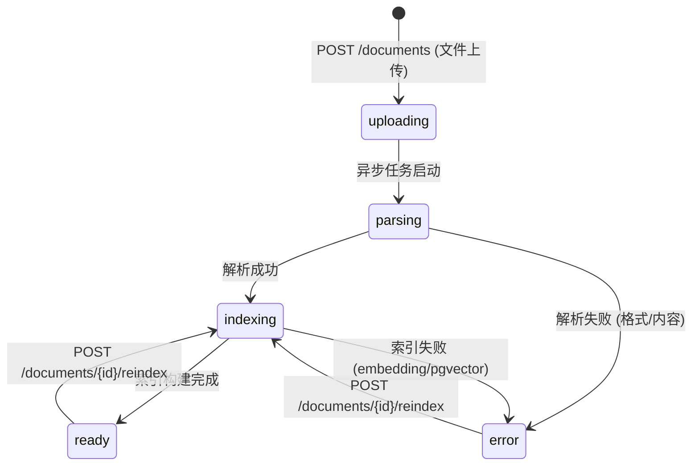

# 详细设计 (DD): 知识库域

## 1. 文档说明

本文档覆盖知识库域的详细设计，包含分类管理、文档上传解析、向量索引构建与语义检索。

**内容范围**:
- 模块实体字段级定义: KnowledgeCategory、KnowledgeDocument、DocumentChunk
- KnowledgeDocument 状态机
- 核心算法: 文档解析、分块策略、向量索引、语义检索
- 模块级错误码 (E30xxx)
- 模块配置项与常量
- API 实现映射表

**前置依赖**: dd-global.md (公共实体、错误码体系、权限模型、系统配置)

---

## 2. 设计原则

遵循 dd-template.md §2 及 dd-global.md §2:

- **一对一可编码**: 每个定义直接映射为 SQLAlchemy Model / 枚举 / pgvector 操作
- **约束显式化**: 字段有 max_length、数值有 range、向量维度固定 768
- **向后兼容**: pgvector 索引参数变更通过重建而非原地修改

---

## 3. 数据模型详设

### 3.1 实体: KnowledgeCategory (知识库分类)

**对应 FR**: FR-006
**对应 AD**: ad-knowledge-base.md §2.3
**表名**: `knowledge_categories`

| 字段 | 类型 | 约束 | 默认值 | 索引 | 说明 |
|------|------|------|--------|------|------|
| id | UUID | PK | gen_random_uuid() | 主键 | 唯一标识 |
| name | VARCHAR(30) | NOT NULL, UNIQUE | - | 唯一索引 | 分类名称, 全局唯一 |
| icon | VARCHAR(8) | NOT NULL | - | - | emoji 字符, 如 🍳💡📖 |
| description | VARCHAR(200) | NULL | NULL | - | 分类描述 |
| doc_count | INT | NOT NULL | 0 | - | 关联文档总数 (应用层计算维护) |
| created_at | TIMESTAMP(TZ) | NOT NULL | now() | - | 创建时间 |
| updated_at | TIMESTAMP(TZ) | NOT NULL | now() | - | 更新时间 |

**字段校验规则**:

| 字段 | 规则 | 说明 |
|------|------|------|
| name | `len(name.strip()) in [1, 30]` | 去除首尾空格后 1~30 字符 |
| icon | 单个 emoji 字符 | 前端预设列表选择, 后端校验非空即可 |
| description | `len <= 200` | 可选字段 |

**doc_count 维护策略**: 非实时聚合查询, 由以下事件触发更新:
- 文档创建成功: `doc_count += 1`
- 文档删除成功: `doc_count -= 1`
- 文档迁移分类: 源分类 `-1`, 目标分类 `+1`

#### 索引

| 索引名 | 字段 | 类型 | 用途 |
|--------|------|------|------|
| uq_kc_name | (name) | B-Tree, UNIQUE | 分类名称唯一 |

#### 关系

| 关系 | 目标实体 | 类型 | 外键 | 级联策略 |
|------|---------|------|------|---------|
| 文档归属 | KnowledgeDocument | 一对多 | knowledge_documents.category_id | RESTRICT (分类下有文档时禁止删除) |

---

### 3.2 实体: KnowledgeDocument (知识库文档)

**对应 FR**: FR-004, FR-005
**对应 AD**: ad-knowledge-base.md §2.1, §3.2
**表名**: `knowledge_documents`

| 字段 | 类型 | 约束 | 默认值 | 索引 | 说明 |
|------|------|------|--------|------|------|
| id | UUID | PK | gen_random_uuid() | 主键 | 唯一标识 |
| category_id | UUID | NOT NULL, FK(knowledge_categories.id) | - | 普通索引 | 所属分类 |
| name | VARCHAR(200) | NOT NULL | - | - | 文档名称 (含扩展名) |
| format | VARCHAR(10) | NOT NULL | - | 普通索引 | 枚举: `json` / `md` |
| size_bytes | BIGINT | NOT NULL | - | - | 原始文件大小 (字节) |
| status | VARCHAR(16) | NOT NULL | 'uploading' | 普通索引 | 文档状态, 见 §4 状态机 |
| chunk_count | INT | NOT NULL | 0 | - | 已生成的分块数量 |
| index_version | INT | NOT NULL | 0 | - | 索引版本号, 每次重新索引 +1 |
| original_content | TEXT | NOT NULL | - | - | 原始文档内容, AES-256-GCM 加密存储 |
| parsed_meta | JSONB | NULL | NULL | - | 解析结果元数据, schema 见下方 |
| error_message | VARCHAR(500) | NULL | NULL | - | 最近一次错误信息 |
| created_at | TIMESTAMP(TZ) | NOT NULL | now() | - | 上传时间 |
| updated_at | TIMESTAMP(TZ) | NOT NULL | now() | - | 最后更新时间 |

**format 枚举**:

| 值 | 文件扩展名 | MIME type |
|----|-----------|----------|
| json | .json | application/json |
| md | .md, .markdown | text/markdown |

**status 枚举**: 见 §4 状态机

**original_content 加密方案**:
- 算法: AES-256-GCM
- 密钥: 环境变量 `AES_ENCRYPTION_KEY` (见 dd-global.md §6.1)
- 格式: `base64(nonce + ciphertext + tag)`, nonce 12 bytes
- 解密时机: 仅重新索引时读取

**parsed_meta JSONB Schema**:

```json
{
  "total_fields": { "type": "int", "description": "原始文档字段总数 (仅 JSON 格式)" },
  "valid_fields_count": { "type": "int", "description": "过滤后有效字段数" },
  "filtered_fields_count": { "type": "int", "description": "被过滤的字段数" },
  "valid_fields": [
    {
      "field": { "type": "string", "description": "字段名" },
      "value": { "type": "any", "description": "字段值摘要 (截断至 200 字符)" },
      "type": { "type": "string", "enum": ["string", "array", "object", "number"] }
    }
  ],
  "filtered_fields": [
    {
      "field": { "type": "string", "description": "被过滤的字段名" },
      "reason": { "type": "string", "description": "过滤原因分类" }
    }
  ]
}
```

#### 索引

| 索引名 | 字段 | 类型 | 用途 |
|--------|------|------|------|
| idx_kd_category_id | (category_id) | B-Tree | 按分类筛选文档列表 |
| idx_kd_status | (status) | B-Tree | 按状态筛选 |
| idx_kd_format | (format) | B-Tree | 按格式筛选 |
| idx_kd_created_at | (created_at DESC) | B-Tree | 时间倒序排列 |
| idx_kd_name_trgm | (name) | GIN (pg_trgm) | 文档名称模糊搜索 |

#### 关系

| 关系 | 目标实体 | 类型 | 外键 | 级联策略 |
|------|---------|------|------|---------|
| 所属分类 | KnowledgeCategory | 多对一 | category_id → knowledge_categories.id | RESTRICT |
| 文档分块 | DocumentChunk | 一对多 | document_chunks.document_id | CASCADE DELETE |

---

### 3.3 实体: DocumentChunk (文档片段)

**对应 FR**: FR-004
**对应 AD**: ad-knowledge-base.md §2.1, §2.2
**表名**: `document_chunks`
**前置**: 需启用 PostgreSQL `pgvector` 扩展 (`CREATE EXTENSION IF NOT EXISTS vector;`)

| 字段 | 类型 | 约束 | 默认值 | 索引 | 说明 |
|------|------|------|--------|------|------|
| id | UUID | PK | gen_random_uuid() | 主键 | 唯一标识 |
| document_id | UUID | NOT NULL, FK(knowledge_documents.id, ON DELETE CASCADE) | - | 普通索引 | 所属文档 |
| chunk_index | INT | NOT NULL | - | - | 分块序号, 从 0 开始 |
| content | TEXT | NOT NULL | - | - | 分块文本内容, 最大 2000 字符 |
| embedding | vector(768) | NOT NULL | - | HNSW 索引 | 768 维向量 (sentence-transformers) |
| metadata | JSONB | NULL | NULL | - | 附加元数据, schema 见下方 |
| created_at | TIMESTAMP(TZ) | NOT NULL | now() | - | 创建时间 |

**embedding 向量说明**:
- 维度: 768 (对应 BERT-base / m3e-base 模型输出)
- 生成: sentence-transformers 编码
- 距离度量: 余弦相似度 (`<=>` 操作符)
- 常量引用: dd-global.md §6.2 `VECTOR_DIMENSION = 768`

**metadata JSONB Schema** (因文档格式不同而异):

JSON 格式文档 (菜谱):
```json
{
  "recipe_name": "string — 菜谱名称",
  "field_source": "string — 来源字段 (ingredients/steps/nutrition 等)",
  "chunk_type": "string — 枚举: recipe_full / recipe_section"
}
```

Markdown 格式文档:
```json
{
  "section_title": "string — 所属标题",
  "heading_level": "int — 标题层级 (1/2/3)",
  "chunk_type": "string — 枚举: md_section"
}
```

**唯一性约束**: UNIQUE (document_id, chunk_index) — 同一文档内分块序号不重复

#### 索引

| 索引名 | 字段 | 类型 | 参数 | 用途 |
|--------|------|------|------|------|
| idx_dc_document_id | (document_id) | B-Tree | - | 按文档查询所有分块 |
| idx_dc_embedding_hnsw | (embedding) | HNSW (vector_cosine_ops) | m=16, ef_construction=200 | 语义相似度检索 |
| uq_dc_doc_chunk | (document_id, chunk_index) | B-Tree, UNIQUE | - | 分块序号唯一 |

**HNSW 索引配置详述**:

| 参数 | 值 | 说明 |
|------|-----|------|
| m | 16 | 每层最大连接数, 平衡检索精度与索引大小 |
| ef_construction | 200 | 构建时探索宽度, 越大精度越高但构建越慢 |
| ef_search | 100 | 查询时探索宽度 (运行时 SET), 越大越精确 |
| 距离函数 | vector_cosine_ops | 余弦相似度 |
| 适用数据量 | ≤ 100 万向量 | 超过后考虑分区索引 (按 category_id 分区) |

**DDL (含 HNSW 索引)**:

```sql
CREATE INDEX idx_dc_embedding_hnsw
ON document_chunks
USING hnsw (embedding vector_cosine_ops)
WITH (m = 16, ef_construction = 200);
```

#### 关系

| 关系 | 目标实体 | 类型 | 外键 | 级联策略 |
|------|---------|------|------|---------|
| 所属文档 | KnowledgeDocument | 多对一 | document_id → knowledge_documents.id | CASCADE DELETE |

---

### 3.4 ER 关系总图

```
知识库域:
  KnowledgeCategory (1) ──(1:N)── KnowledgeDocument (*)
  KnowledgeDocument (1) ──(1:N)── DocumentChunk (*)

跨域引用 (被动):
  DialogProfile.knowledge_enabled → 引用 KnowledgeCategory (逻辑引用, 无外键)
  NLU Pipeline → 调用 KnowledgeRetriever.retrieve() (运行时函数调用)
```

### 3.5 数据迁移

**工具**: Alembic (遵循 dd-global.md §3.8 规范)

**初始迁移** (3 张表 + pgvector 扩展):

```python
def upgrade():
    # 0. pgvector 扩展
    op.execute("CREATE EXTENSION IF NOT EXISTS vector")
    op.execute("CREATE EXTENSION IF NOT EXISTS pg_trgm")

    # 1. knowledge_categories
    op.create_table(
        "knowledge_categories",
        sa.Column("id", sa.dialects.postgresql.UUID, primary_key=True,
                  server_default=sa.text("gen_random_uuid()")),
        sa.Column("name", sa.String(30), nullable=False, unique=True),
        sa.Column("icon", sa.String(8), nullable=False),
        sa.Column("description", sa.String(200), nullable=True),
        sa.Column("doc_count", sa.Integer, nullable=False, server_default="0"),
        sa.Column("created_at", sa.DateTime(timezone=True), nullable=False,
                  server_default=sa.text("now()")),
        sa.Column("updated_at", sa.DateTime(timezone=True), nullable=False,
                  server_default=sa.text("now()")),
    )

    # 2. knowledge_documents
    op.create_table(
        "knowledge_documents",
        sa.Column("id", sa.dialects.postgresql.UUID, primary_key=True,
                  server_default=sa.text("gen_random_uuid()")),
        sa.Column("category_id", sa.dialects.postgresql.UUID,
                  sa.ForeignKey("knowledge_categories.id"), nullable=False),
        sa.Column("name", sa.String(200), nullable=False),
        sa.Column("format", sa.String(10), nullable=False),
        sa.Column("size_bytes", sa.BigInteger, nullable=False),
        sa.Column("status", sa.String(16), nullable=False, server_default="uploading"),
        sa.Column("chunk_count", sa.Integer, nullable=False, server_default="0"),
        sa.Column("index_version", sa.Integer, nullable=False, server_default="0"),
        sa.Column("original_content", sa.Text, nullable=False),
        sa.Column("parsed_meta", sa.dialects.postgresql.JSONB, nullable=True),
        sa.Column("error_message", sa.String(500), nullable=True),
        sa.Column("created_at", sa.DateTime(timezone=True), nullable=False,
                  server_default=sa.text("now()")),
        sa.Column("updated_at", sa.DateTime(timezone=True), nullable=False,
                  server_default=sa.text("now()")),
    )
    op.create_index("idx_kd_category_id", "knowledge_documents", ["category_id"])
    op.create_index("idx_kd_status", "knowledge_documents", ["status"])
    op.create_index("idx_kd_format", "knowledge_documents", ["format"])
    op.create_index("idx_kd_created_at", "knowledge_documents",
                    [sa.text("created_at DESC")])

    # 3. document_chunks (含 pgvector)
    op.create_table(
        "document_chunks",
        sa.Column("id", sa.dialects.postgresql.UUID, primary_key=True,
                  server_default=sa.text("gen_random_uuid()")),
        sa.Column("document_id", sa.dialects.postgresql.UUID,
                  sa.ForeignKey("knowledge_documents.id", ondelete="CASCADE"),
                  nullable=False),
        sa.Column("chunk_index", sa.Integer, nullable=False),
        sa.Column("content", sa.Text, nullable=False),
        sa.Column("embedding", Vector(768), nullable=False),
        sa.Column("metadata", sa.dialects.postgresql.JSONB, nullable=True),
        sa.Column("created_at", sa.DateTime(timezone=True), nullable=False,
                  server_default=sa.text("now()")),
        sa.UniqueConstraint("document_id", "chunk_index", name="uq_dc_doc_chunk"),
    )
    op.create_index("idx_dc_document_id", "document_chunks", ["document_id"])
    op.execute("""
        CREATE INDEX idx_dc_embedding_hnsw
        ON document_chunks
        USING hnsw (embedding vector_cosine_ops)
        WITH (m = 16, ef_construction = 200)
    """)
```

---

## 4. 状态机定义

### 4.1 KnowledgeDocument 状态机



#### 状态枚举

| 状态值 | 显示名 | 含义 | 允许的操作 |
|--------|-------|------|-----------|
| uploading | 上传中 | 文件已接收, 等待异步处理 | 查看、删除 |
| parsing | 解析中 | 正在解析文档内容并过滤字段 | 查看、删除 |
| indexing | 索引中 | 正在生成向量并写入 pgvector | 查看、删除 |
| ready | 就绪 | 文档已就绪, 可参与检索 | 查看、删除、重新索引、编辑元数据 |
| error | 错误 | 解析或索引过程中出错 | 查看、删除、重新索引 |

#### 状态转移规则

| 从 | 到 | 触发条件 | 前置校验 | 副作用 | 对应 API/流程 |
|---|------|---------|---------|--------|-------------|
| (初始) | uploading | 文件上传成功 | 格式校验 (.json/.md), 大小校验 (≤10MB), 分类存在 | INSERT document 记录; 分类 doc_count += 1 | POST /documents |
| uploading | parsing | 异步任务拾取 | - | 更新 status + updated_at | 后台任务 |
| parsing | indexing | 解析成功 (valid_fields_count > 0) | - | 写入 parsed_meta; 更新 status | 后台任务 |
| parsing | error | 解析失败 | - | 写入 error_message; 更新 status | 后台任务 |
| indexing | ready | 所有 chunk embedding 写入成功 | - | 更新 chunk_count; index_version += 1; 更新 status | 后台任务 |
| indexing | error | embedding 生成失败 (重试 3 次后) 或 pgvector 写入失败 | - | 写入 error_message; 清理已写入的部分 chunk; 更新 status | 后台任务 |
| ready | indexing | 用户触发重新索引 | 文档 status == ready | DELETE 旧 chunks; 重置 chunk_count=0; 更新 status | POST /documents/{id}/reindex |
| error | indexing | 用户触发重新索引 | 文档 status == error | 清理残留 chunks; 清空 error_message; 更新 status | POST /documents/{id}/reindex |

#### 重新索引期间的检索行为

当文档处于 `indexing` 状态时:
- 该文档的旧向量已被删除, 不会出现在检索结果中
- 前端应提示: "文档正在重新索引, 索引期间该文档不参与检索"
- 后续优化方向: 蓝绿索引切换 (保留旧 chunk 直到新 chunk 就绪)

---

## 5. 核心算法详设

### 5.1 算法: 文档解析 (Document Parsing)

**对应 FR**: FR-004, FR-005
**对应 AD**: ad-knowledge-base.md §2.1, §3.4

#### 输入输出

| 方向 | 参数 | 类型 | 约束 | 说明 |
|------|------|------|------|------|
| 输入 | file_content | bytes | NOT NULL, ≤ 10MB | 原始文件内容 |
| 输入 | format | str | `json` \| `md` | 文件格式 |
| 输出 | ParseResult | object | - | 解析结果含 chunks 列表和过滤元数据 |

#### 字段过滤黑名单 (FR-005)

| 过滤类别 | 字段名匹配模式 (不区分大小写) | 值匹配模式 | 过滤原因标签 |
|---------|--------------------------|----------|------------|
| 图片 URL | `image`, `photo`, `avatar`, `thumbnail`, `pic`, `cover` | `https?://.*\.(jpg\|png\|gif\|webp)` | 图片URL |
| OSS 链接 | `oss_link`, `file_url` | `^(oss\|s3\|cos)://` | OSS存储链接 |
| 社交互动 | `like_count`, `view_count`, `share_count`, `comment_count`, `favorite_count` | - | 社交互动数据 |
| 审核状态 | `review_status`, `audit_status`, `approval` | - | 审核状态 |
| 操作人信息 | `created_by`, `updated_by`, `creator_id` | - | 用户隐私 |
| 广告字段 | `ad_banner`, `promotion`, `sponsored` | - | 广告内容 |

#### 伪代码

```python
FIELD_NAME_BLACKLIST = {
    "图片URL": ["image", "photo", "avatar", "thumbnail", "pic", "cover"],
    "OSS存储链接": ["oss_link", "file_url"],
    "社交互动数据": ["like_count", "view_count", "share_count",
                    "comment_count", "favorite_count"],
    "审核状态": ["review_status", "audit_status", "approval"],
    "用户隐私": ["created_by", "updated_by", "creator_id"],
    "广告内容": ["ad_banner", "promotion", "sponsored"],
}

VALUE_PATTERNS = [
    (re.compile(r"https?://.*\.(jpg|png|gif|webp)", re.I), "图片URL"),
    (re.compile(r"^(oss|s3|cos)://", re.I), "OSS存储链接"),
]

@dataclass
class ParseResult:
    chunks: list[str]
    valid_fields: list[dict]
    filtered_fields: list[dict]
    total_fields: int


def parse_document(file_content: bytes, format: str) -> ParseResult:
    """FR-004 + FR-005: 解析文档并过滤无效字段"""
    text = file_content.decode("utf-8")

    if format == "json":
        return _parse_json(text)
    elif format == "md":
        return _parse_markdown(text)
    else:
        raise BusinessException("E30201", "仅支持 JSON/Markdown 格式")


def _parse_json(text: str) -> ParseResult:
    try:
        data = json.loads(text)
    except json.JSONDecodeError as e:
        raise BusinessException("E30203", f"JSON 格式错误: {str(e)[:200]}")

    records = data if isinstance(data, list) else [data]
    all_valid_fields = []
    all_filtered_fields = []
    chunks = []
    total_fields = 0

    for record in records:
        if not isinstance(record, dict):
            continue
        valid, filtered = _filter_fields(record)
        total_fields += len(record)
        all_valid_fields.extend(valid)
        all_filtered_fields.extend(filtered)

        if valid:
            chunk_text = _build_chunk_from_fields(valid)
            if len(chunk_text.strip()) > 0:
                chunks.append(chunk_text)

    if not chunks:
        raise BusinessException("E30204", "文档过滤后无有效内容")

    return ParseResult(
        chunks=chunks,
        valid_fields=all_valid_fields,
        filtered_fields=all_filtered_fields,
        total_fields=total_fields,
    )


def _filter_fields(record: dict) -> tuple[list[dict], list[dict]]:
    valid = []
    filtered = []

    for key, value in record.items():
        reason = _match_blacklist(key, value)
        if reason:
            filtered.append({"field": key, "reason": reason})
        else:
            field_type = _detect_type(value)
            value_summary = str(value)[:200]
            valid.append({"field": key, "value": value_summary, "type": field_type})

    return valid, filtered


def _match_blacklist(field_name: str, value: Any) -> str | None:
    lower_name = field_name.lower()

    for reason, patterns in FIELD_NAME_BLACKLIST.items():
        for pattern in patterns:
            if pattern in lower_name:
                return reason

    if isinstance(value, str):
        for regex, reason in VALUE_PATTERNS:
            if regex.search(value):
                return reason

    return None


def _parse_markdown(text: str) -> ParseResult:
    """按 h1/h2/h3 标题层级分段, 每段作为独立 chunk"""
    sections = re.split(r"(?=^#{1,3}\s)", text, flags=re.MULTILINE)
    chunks = []

    for section in sections:
        content = section.strip()
        if len(content) < 10:  # 过短的段落跳过 (标题本身或空段)
            continue
        if len(content) > CHUNK_MAX_CHARS:
            sub_chunks = _split_long_section(content, CHUNK_MAX_CHARS)
            chunks.extend(sub_chunks)
        else:
            chunks.append(content)

    if not chunks:
        raise BusinessException("E30204", "文档过滤后无有效内容")

    return ParseResult(
        chunks=chunks,
        valid_fields=[],
        filtered_fields=[],
        total_fields=0,
    )
```

#### 边界条件

| 边界场景 | 处理方式 | 错误码 |
|---------|---------|--------|
| JSON 非法 (语法错误) | 抛出 BusinessException | E30203 |
| JSON 顶层为数组 | 遍历数组中每个 dict 元素 | - |
| JSON 中嵌套对象 | 递归提取, 将嵌套 key 用 `.` 拼接 (如 `nutrition.calories`) | - |
| 过滤后无有效字段 | 抛出 BusinessException | E30204 |
| Markdown 无标题分隔 | 全文作为单个 chunk | - |
| 单个 chunk 超过 2000 字符 | 按段落边界二次切分 | - |
| 文件编码非 UTF-8 | 尝试 chardet 检测, 失败则报错 | E30203 |
| 空文件 (0 bytes) | 拒绝, 返回解析失败 | E30204 |

---

### 5.2 算法: 分块策略 (Chunking Strategy)

**对应 FR**: FR-004
**对应 AD**: ad-knowledge-base.md §2.1

#### 输入输出

| 方向 | 参数 | 类型 | 约束 | 说明 |
|------|------|------|------|------|
| 输入 | parse_result | ParseResult | NOT NULL | 解析结果 |
| 输入 | format | str | `json` \| `md` | 文档格式 |
| 输出 | chunks | list[ChunkData] | 1 ≤ len ≤ 500 | 分块列表 |

#### 分块规则

| 文档格式 | 分块粒度 | 单块大小限制 | 说明 |
|---------|---------|------------|------|
| json (菜谱) | 每条记录 (recipe) 为一个 chunk | 50 ~ 2000 字符 | 将有效字段拼接为自然语言描述 |
| json (非菜谱) | 每条记录为一个 chunk | 50 ~ 2000 字符 | 键值对拼接 |
| md | 每个 h1/h2/h3 段落为一个 chunk | 50 ~ 2000 字符 | 超长段落二次切分 |

#### 伪代码

```python
CHUNK_MIN_CHARS = 50
CHUNK_MAX_CHARS = 2000
MAX_CHUNKS_PER_DOC = 500


@dataclass
class ChunkData:
    chunk_index: int
    content: str
    metadata: dict


def build_chunks(parse_result: ParseResult, format: str,
                 document_id: str) -> list[ChunkData]:
    raw_chunks = parse_result.chunks
    chunks = []

    for i, text in enumerate(raw_chunks):
        if i >= MAX_CHUNKS_PER_DOC:
            logger.warning(f"doc={document_id} truncated at {MAX_CHUNKS_PER_DOC} chunks")
            break

        if len(text) < CHUNK_MIN_CHARS:
            continue  # 过短 chunk 可能无检索价值

        if len(text) > CHUNK_MAX_CHARS:
            sub_parts = _split_long_section(text, CHUNK_MAX_CHARS)
            for part in sub_parts:
                if len(chunks) >= MAX_CHUNKS_PER_DOC:
                    break
                chunks.append(ChunkData(
                    chunk_index=len(chunks),
                    content=part,
                    metadata=_build_metadata(format, part, i),
                ))
        else:
            chunks.append(ChunkData(
                chunk_index=len(chunks),
                content=text,
                metadata=_build_metadata(format, text, i),
            ))

    return chunks


def _build_chunk_from_fields(valid_fields: list[dict]) -> str:
    """将 JSON 有效字段拼接为自然语言描述 (便于 embedding 捕获语义)"""
    parts = []
    for f in valid_fields:
        name = f["field"]
        value = f["value"]
        if isinstance(value, list):
            value = "、".join(str(v) for v in value)
        parts.append(f"{name}: {value}")
    return "\n".join(parts)


def _split_long_section(text: str, max_chars: int) -> list[str]:
    """在段落边界处切分超长文本, 保持语义完整性"""
    paragraphs = text.split("\n\n")
    result = []
    buffer = ""

    for para in paragraphs:
        if len(buffer) + len(para) + 2 > max_chars:
            if buffer:
                result.append(buffer.strip())
            buffer = para
        else:
            buffer = buffer + "\n\n" + para if buffer else para

    if buffer.strip():
        result.append(buffer.strip())

    return result if result else [text[:max_chars]]
```

#### 边界条件

| 边界场景 | 处理方式 | 错误码 |
|---------|---------|--------|
| 单文档 > 500 chunks | 截断至 500, 记录 warning 日志 | - |
| chunk < 50 字符 | 跳过, 不生成 embedding | - |
| chunk > 2000 字符 | 按段落边界二次切分 | - |
| 所有 chunk 被过滤 | 上游 parse 阶段已拦截 (E30204) | E30204 |

---

### 5.3 算法: 向量索引构建 (Vector Indexing)

**对应 FR**: FR-004
**对应 AD**: ad-knowledge-base.md §2.1

#### 输入输出

| 方向 | 参数 | 类型 | 约束 | 说明 |
|------|------|------|------|------|
| 输入 | chunks | list[ChunkData] | 1 ≤ len ≤ 500 | 分块数据 |
| 输入 | document_id | UUID | NOT NULL | 文档 ID |
| 输出 | IndexResult | object | - | 索引结果 (成功数/失败数) |

#### 伪代码

```python
EMBEDDING_MODEL = "sentence-transformers/paraphrase-multilingual-MiniLM-L12-v2"
EMBEDDING_DIMENSION = 768     # dd-global.md VECTOR_DIMENSION
EMBEDDING_BATCH_SIZE = 32     # 批量编码大小
EMBEDDING_RETRY_MAX = 3       # 失败重试次数
EMBEDDING_RETRY_DELAY = 2.0   # 重试间隔 (秒), 指数退避


@dataclass
class IndexResult:
    indexed_count: int
    failed_count: int


async def build_vector_index(chunks: list[ChunkData],
                             document_id: str,
                             db: AsyncSession) -> IndexResult:
    """生成 embedding 并批量写入 pgvector"""
    indexed = 0
    failed = 0

    for batch_start in range(0, len(chunks), EMBEDDING_BATCH_SIZE):
        batch = chunks[batch_start:batch_start + EMBEDDING_BATCH_SIZE]
        texts = [c.content for c in batch]

        embeddings = await _generate_embeddings_with_retry(texts)
        if embeddings is None:
            failed += len(batch)
            continue

        for chunk, emb in zip(batch, embeddings):
            assert len(emb) == EMBEDDING_DIMENSION
            db_chunk = DocumentChunk(
                document_id=document_id,
                chunk_index=chunk.chunk_index,
                content=chunk.content,
                embedding=emb,
                metadata=chunk.metadata,
            )
            db.add(db_chunk)
            indexed += 1

    await db.flush()
    return IndexResult(indexed_count=indexed, failed_count=failed)


async def _generate_embeddings_with_retry(texts: list[str]) -> list[list[float]] | None:
    for attempt in range(EMBEDDING_RETRY_MAX):
        try:
            embeddings = embedding_model.encode(
                texts,
                normalize_embeddings=True,
                show_progress_bar=False,
            )
            return embeddings.tolist()
        except Exception as e:
            delay = EMBEDDING_RETRY_DELAY * (2 ** attempt)
            logger.warning(f"Embedding attempt {attempt+1} failed: {e}, "
                          f"retrying in {delay}s")
            await asyncio.sleep(delay)

    return None  # 重试耗尽


async def reindex_document(document_id: str, db: AsyncSession):
    """重新索引: 删除旧 chunk → 重新解析 → 重新索引"""
    doc = await db.get(KnowledgeDocument, document_id)
    if doc is None:
        raise BusinessException("E30206", "指定的文档不存在")
    if doc.status not in ("ready", "error"):
        raise BusinessException("E30208", "当前状态不允许重新索引")

    doc.status = "indexing"
    doc.error_message = None

    # 清除旧 chunks
    await db.execute(
        delete(DocumentChunk).where(DocumentChunk.document_id == document_id)
    )
    doc.chunk_count = 0

    try:
        content = decrypt_aes256(doc.original_content)
        parse_result = parse_document(content, doc.format)
        chunks = build_chunks(parse_result, doc.format, document_id)
        result = await build_vector_index(chunks, document_id, db)

        if result.failed_count > 0 and result.indexed_count == 0:
            raise Exception("All chunks failed to index")

        doc.status = "ready"
        doc.chunk_count = result.indexed_count
        doc.index_version += 1
        doc.parsed_meta = {
            "total_fields": parse_result.total_fields,
            "valid_fields_count": len(parse_result.valid_fields),
            "filtered_fields_count": len(parse_result.filtered_fields),
            "valid_fields": parse_result.valid_fields,
            "filtered_fields": parse_result.filtered_fields,
        }
    except BusinessException:
        doc.status = "error"
        doc.error_message = str(e)
        raise
    except Exception as e:
        doc.status = "error"
        doc.error_message = f"索引构建失败: {str(e)[:400]}"
        logger.error(f"Reindex failed for doc={document_id}: {e}")

    await db.commit()
```

#### 边界条件

| 边界场景 | 处理方式 | 错误码 |
|---------|---------|--------|
| embedding 模型不可用 | 重试 3 次 (指数退避 2s/4s/8s), 全部失败标记 error | E30205 |
| 部分 chunk embedding 失败 | 成功的写入, 记录 failed_count, 若全部失败则标记 error | E30205 |
| pgvector 写入失败 | 事务回滚, 标记 error | E30205 |
| 重新索引期间进程崩溃 | 文档留在 indexing 状态, 需手动重试或定时任务清理 | - |
| 并发重新索引同一文档 | 乐观锁 (检查 status) 防止并发, 第二个请求返回 E30208 | E30208 |

#### 复杂度

- **时间**: O(N × D) — N = chunk 数, D = embedding 维度 (768); 实际瓶颈在 embedding 模型推理
- **空间**: O(N × D) — N 个 768 维向量在内存中

---

### 5.4 算法: 语义检索 (Semantic Retrieval)

**对应 FR**: FR-004, FR-021
**对应 AD**: ad-knowledge-base.md §2.2, §3.3

#### 输入输出

| 方向 | 参数 | 类型 | 约束 | 说明 |
|------|------|------|------|------|
| 输入 | query | str | NOT NULL, 1~200 字符 | 检索查询文本 |
| 输入 | top_k | int | 1~20, 默认 5 | 返回结果数量 |
| 输入 | category_id | UUID \| None | 可选 | 限定分类范围 |
| 输入 | score_threshold | float | 0.0~1.0, 默认 0.3 | API 检索最低分数 |
| 输出 | results | list[KnowledgeResult] | 0 ≤ len ≤ top_k | 检索结果 (按 score 降序) |

**阈值说明**:
- API 检索测试 (`POST /knowledge/search`): 默认 `score_threshold = 0.3`, 允许用户调整
- NLU Pipeline 内部调用 (`KnowledgeRetriever.retrieve()`): 固定使用 `KNOWLEDGE_SIMILARITY_THRESHOLD = 0.7` (dd-global.md §6.2), 低于此值视为未命中, 降级到闲聊域

#### 伪代码

```python
KNOWLEDGE_TOP_K = 5                      # dd-global.md §6.2
KNOWLEDGE_SIMILARITY_THRESHOLD = 0.7     # NLU Pipeline 命中阈值
DEFAULT_API_THRESHOLD = 0.3              # API 检索测试默认阈值
HNSW_EF_SEARCH = 100                     # 查询时探索宽度


@dataclass
class KnowledgeResult:
    chunk_text: str
    score: float
    document_id: str
    document_name: str
    category_id: str
    category_name: str


async def retrieve(query: str,
                   top_k: int = KNOWLEDGE_TOP_K,
                   category_id: str | None = None,
                   score_threshold: float = DEFAULT_API_THRESHOLD,
                   db: AsyncSession = None) -> list[KnowledgeResult]:
    """语义检索: 查询文本 → embedding → pgvector 余弦相似度搜索"""
    if not query or not query.strip():
        raise BusinessException("E30301", "请输入检索内容")

    query = query.strip()[:200]

    # 1. 设置 HNSW 查询参数
    await db.execute(text(f"SET hnsw.ef_search = {HNSW_EF_SEARCH}"))

    # 2. 查询文本向量化
    try:
        query_vector = embedding_model.encode(
            query, normalize_embeddings=True
        ).tolist()
    except Exception as e:
        logger.error(f"Embedding model unavailable: {e}")
        raise BusinessException("E30302", "检索服务暂时不可用，请稍后重试")

    assert len(query_vector) == EMBEDDING_DIMENSION

    # 3. pgvector 相似度搜索 (余弦距离 = 1 - 余弦相似度)
    base_query = (
        select(
            DocumentChunk.content,
            (1 - DocumentChunk.embedding.cosine_distance(query_vector)).label("score"),
            DocumentChunk.document_id,
            KnowledgeDocument.name.label("document_name"),
            KnowledgeDocument.category_id,
            KnowledgeCategory.name.label("category_name"),
        )
        .join(KnowledgeDocument,
              DocumentChunk.document_id == KnowledgeDocument.id)
        .join(KnowledgeCategory,
              KnowledgeDocument.category_id == KnowledgeCategory.id)
        .where(KnowledgeDocument.status == "ready")
    )

    if category_id:
        base_query = base_query.where(
            KnowledgeDocument.category_id == category_id
        )

    base_query = (
        base_query
        .order_by(text("score DESC"))
        .limit(top_k)
    )

    rows = (await db.execute(base_query)).all()

    # 4. 按阈值过滤
    results = []
    for row in rows:
        if row.score < score_threshold:
            continue
        results.append(KnowledgeResult(
            chunk_text=row.content,
            score=round(row.score, 4),
            document_id=str(row.document_id),
            document_name=row.document_name,
            category_id=str(row.category_id),
            category_name=row.category_name,
        ))

    return results


async def retrieve_for_nlu(query: str,
                           category_id: str | None = None,
                           db: AsyncSession = None) -> list[KnowledgeResult]:
    """NLU Pipeline 专用入口: 使用固定高阈值 0.7"""
    return await retrieve(
        query=query,
        top_k=KNOWLEDGE_TOP_K,
        category_id=category_id,
        score_threshold=KNOWLEDGE_SIMILARITY_THRESHOLD,
        db=db,
    )
```

#### 边界条件

| 边界场景 | 处理方式 | 错误码 |
|---------|---------|--------|
| 查询文本为空 | 返回 400 | E30301 |
| 查询文本超过 200 字符 | 截断至 200 字符 | - |
| embedding 模型不可用 | 返回 500 | E30302 |
| 无任何匹配结果 (score 均低于阈值) | 返回空列表 `[]` (NLU 链路降级到闲聊域) | - |
| 指定 category_id 不存在或无文档 | 返回空列表 `[]` | - |
| top_k 超出范围 [1, 20] | 参数校验拒绝 | E00003 |
| pgvector 无数据 (冷启动) | 返回空列表 `[]` | - |

#### 复杂度

- **时间**: O(log N) — HNSW 近似最近邻, N = 总 chunk 数
- **空间**: O(top_k) — 返回结果集

---

## 6. 错误码

### 6.1 编码规则

遵循 dd-global.md §4.1 格式: `E30{sub}{seq}`

- `30` = 知识库模块
- `{sub}` (1 位) = 子模块: 1=分类, 2=文档, 3=检索
- `{seq}` (2 位) = 序号

### 6.2 分类子模块 (E301xx)

| 错误码 | HTTP | 场景 | 触发条件 | 用户提示 | 重试 |
|--------|------|------|---------|---------|------|
| E30101 | 409 | 分类名称重复 | INSERT/UPDATE 时 UNIQUE 约束冲突 | 分类名称已存在 | 否 |
| E30102 | 422 | 删除分类时存在文档 | `doc_count > 0` 或 JOIN 查文档存在 | 该分类下存在文档，请先删除或迁移文档 | 否 |
| E30103 | 404 | 分类不存在 | DB 查询为空 | 指定的分类不存在 | 否 |

### 6.3 文档子模块 (E302xx)

| 错误码 | HTTP | 场景 | 触发条件 | 用户提示 | 重试 |
|--------|------|------|---------|---------|------|
| E30201 | 400 | 不支持的文件格式 | 扩展名非 .json/.md/.markdown 或 MIME type 不匹配 | 仅支持 JSON/Markdown 格式 | 否 |
| E30202 | 400 | 文件大小超限 | `size_bytes > 10 * 1024 * 1024` | 文件大小不能超过 10MB | 否 |
| E30203 | 422 | JSON 格式非法 | json.loads 抛出 JSONDecodeError | JSON 格式错误，请检查文件内容 | 否 |
| E30204 | 422 | 过滤后无有效内容 | 解析后 valid_fields_count == 0 且 chunks 为空 | 文档过滤后无有效内容，请检查文档结构 | 否 |
| E30205 | 500 | 索引构建失败 | embedding 重试耗尽或 pgvector 写入异常 | 索引构建失败，请重试 | 是 |
| E30206 | 404 | 文档不存在 | DB 查询为空 | 指定的文档不存在 | 否 |
| E30207 | 400 | 文档名称过长 | `len(name) > 200` | 文档名称不能超过 200 字符 | 否 |
| E30208 | 422 | 文档状态不允许操作 | reindex 时 status 非 ready/error | 当前状态不允许此操作，请等待处理完成 | 否 |
| E30209 | 400 | 文件内容为空 | `size_bytes == 0` | 文件内容不能为空 | 否 |

### 6.4 检索子模块 (E303xx)

| 错误码 | HTTP | 场景 | 触发条件 | 用户提示 | 重试 |
|--------|------|------|---------|---------|------|
| E30301 | 400 | 检索文本为空 | `query` 参数为空或全空格 | 请输入检索内容 | 否 |
| E30302 | 500 | embedding 模型不可用 | 模型加载失败或推理超时 | 检索服务暂时不可用，请稍后重试 | 是 |
| E30303 | 504 | 检索超时 | pgvector 查询超过 5s | 检索超时，请缩小检索范围后重试 | 是 |

---

## 7. 权限模型

知识库域使用 dd-global.md §5 定义的权限体系, 相关能力点:

| 能力点 Key | 说明 | 守护 API 路径 | admin | pm | tester |
|-----------|------|-------------|-------|----|--------|
| knowledge_read | 查看知识库 | GET /api/v1/knowledge/* | ✅ | ✅ | ✅ |
| knowledge_manage | 管理知识库 | POST/PUT/DELETE /api/v1/knowledge/* | ✅ | ✅ | ❌ |

**权限校验实现**:

```python
@router.get("/categories")
@require_capability("knowledge_read")
async def list_categories(...): ...

@router.post("/documents")
@require_capability("knowledge_manage")
async def upload_document(...): ...

@router.post("/search")
@require_capability("knowledge_read")
async def search_knowledge(...): ...

@router.post("/documents/{id}/reindex")
@require_capability("knowledge_manage")
async def reindex_document(...): ...
```

---

## 8. 配置项与常量

### 8.1 模块级配置

| 配置项 | 类型 | 默认值 | 范围 | 说明 | 来源 |
|--------|------|--------|------|------|------|
| EMBEDDING_MODEL_NAME | string | `paraphrase-multilingual-MiniLM-L12-v2` | - | sentence-transformers 模型名 | 环境变量 |
| EMBEDDING_BATCH_SIZE | int | 32 | 8~128 | 批量编码 batch 大小 | 环境变量 |
| EMBEDDING_RETRY_MAX | int | 3 | 1~5 | embedding 生成失败重试次数 | 硬编码 |
| EMBEDDING_RETRY_DELAY | float | 2.0 | 1.0~10.0 | 重试初始间隔 (秒, 指数退避) | 硬编码 |
| HNSW_EF_SEARCH | int | 100 | 50~500 | HNSW 查询时探索宽度 | 环境变量 |
| KNOWLEDGE_SEARCH_TIMEOUT | int | 5 | 2~30 | 检索查询超时 (秒) | 环境变量 |

### 8.2 业务常量

| 常量名 | 值 | 类型 | 说明 | 对应 FR |
|--------|----|------|------|---------|
| VECTOR_DIMENSION | 768 | int | pgvector 向量维度 | FR-004 |
| KNOWLEDGE_TOP_K | 5 | int | 默认检索返回条数 | FR-004 |
| KNOWLEDGE_SIMILARITY_THRESHOLD | 0.7 | float | NLU Pipeline 知识命中最低相似度 | FR-021 |
| DEFAULT_API_THRESHOLD | 0.3 | float | API 检索测试默认最低分数 | FR-004 |
| MAX_FILE_SIZE_BYTES | 10_485_760 | int | 文档最大文件大小 (10MB) | FR-004 |
| ALLOWED_FORMATS | `["json", "md", "markdown"]` | list | 允许的文件扩展名 | FR-004 |
| CHUNK_MIN_CHARS | 50 | int | chunk 最小有效字符数 | FR-004 |
| CHUNK_MAX_CHARS | 2000 | int | chunk 最大字符数 | FR-004 |
| MAX_CHUNKS_PER_DOC | 500 | int | 单文档最大 chunk 数 | FR-004 |
| CATEGORY_NAME_MAX_LEN | 30 | int | 分类名称最大长度 | FR-006 |
| DOC_NAME_MAX_LEN | 200 | int | 文档名称最大长度 | FR-004 |
| SEARCH_QUERY_MAX_LEN | 200 | int | 检索查询文本最大长度 | FR-004 |
| SEARCH_TOP_K_MAX | 20 | int | top_k 参数上限 | FR-004 |
| HNSW_M | 16 | int | HNSW 每层最大连接数 | FR-004 |
| HNSW_EF_CONSTRUCTION | 200 | int | HNSW 构建时探索宽度 | FR-004 |

---

## 9. API 实现映射表

> 本节不重复 AD 中的 API 契约 (请求/响应 JSON), 仅提供从 API 端点到 DD 内部实现的桥接映射。
> AD 接口契约定义见: ad-knowledge-base.md §3。

### 9.1 分类 API

| API 端点 (→ AD §3.1) | 服务方法 | 入参 Schema | 出参 Schema | 核心逻辑 (→ DD §x) | 计算/派生字段 |
|----------------------|---------|-------------|-------------|---------------------|-------------|
| `GET /api/v1/knowledge/categories` | KnowledgeService.list_categories() | - | CategoryListResponse | §3.1 字段约束 | doc_count (应用层维护), indexed_count (聚合查询 status=ready 的文档数) |
| `POST /api/v1/knowledge/categories` | KnowledgeService.create_category(data) | CategoryCreate | CategoryInfo | §3.1 唯一性校验 → INSERT | doc_count 固定 0 |
| `GET /api/v1/knowledge/categories/{id}` | KnowledgeService.get_category(id) | - | CategoryInfo | §3.1 查询 → E30103 if null | doc_count, indexed_count |
| `PUT /api/v1/knowledge/categories/{id}` | KnowledgeService.update_category(id, data) | CategoryUpdate | CategoryInfo | §3.1 唯一性校验 (排除自身) → UPDATE | - |
| `DELETE /api/v1/knowledge/categories/{id}` | KnowledgeService.delete_category(id) | - | null | §3.1 关联检查 → E30102 if docs exist → DELETE | - |

**Schema 定义**:

```python
class CategoryCreate(BaseModel):
    name: str = Field(..., min_length=1, max_length=30)
    icon: str = Field(..., min_length=1, max_length=8)
    description: str | None = Field(None, max_length=200)

class CategoryUpdate(BaseModel):
    name: str | None = Field(None, min_length=1, max_length=30)
    icon: str | None = Field(None, min_length=1, max_length=8)
    description: str | None = Field(None, max_length=200)

class CategoryInfo(BaseModel):
    id: str
    name: str
    icon: str
    description: str | None
    doc_count: int
    indexed_count: int
    status: str        # "ready" 固定值 (分类本身无状态机)
    created_at: datetime
    updated_at: datetime

class CategoryListResponse(BaseModel):
    items: list[CategoryInfo]
    total: int
```

### 9.2 文档 API

| API 端点 (→ AD §3.2) | 服务方法 | 入参 Schema | 出参 Schema | 核心逻辑 (→ DD §x) | 计算/派生字段 |
|----------------------|---------|-------------|-------------|---------------------|-------------|
| `GET /api/v1/knowledge/documents` | KnowledgeService.list_documents(filters) | DocumentListQuery | DocumentListResponse | §3.2 分页+筛选+排序 | category_name (JOIN), size 格式化 (bytes→KB/MB) |
| `POST /api/v1/knowledge/documents` | KnowledgeService.upload_document(file, category_id) | multipart(file, category_id) | DocumentInfo (202) | §4 uploading → §5.1 解析 → §5.2 分块 → §5.3 索引 (异步) | - |
| `GET /api/v1/knowledge/documents/{id}` | KnowledgeService.get_document(id) | - | DocumentDetailInfo | §3.2 查询 → E30206 if null | parsed_result (from parsed_meta), category_name |
| `PUT /api/v1/knowledge/documents/{id}` | KnowledgeService.update_document_meta(id, data) | DocumentMetaUpdate | DocumentInfo | §3.2 校验 → UPDATE name/category_id; 分类迁移时更新双方 doc_count | - |
| `DELETE /api/v1/knowledge/documents/{id}` | KnowledgeService.delete_document(id) | - | null | §3.2 查询 → DELETE document + CASCADE chunks; 分类 doc_count -= 1 | - |
| `POST /api/v1/knowledge/documents/{id}/reindex` | KnowledgeService.reindex_document(id) | - | DocumentInfo | §4 状态校验 → §5.3 reindex_document() | - |

**Schema 定义**:

```python
class DocumentListQuery(BaseModel):
    page: int = Field(1, ge=1)
    page_size: int = Field(20, ge=1, le=100)
    sort_by: str = Field("created_at", pattern="^(created_at|name|size_bytes|status)$")
    sort_order: str = Field("desc", pattern="^(asc|desc)$")
    category_id: str | None = None
    format: str | None = Field(None, pattern="^(json|markdown)$")
    status: str | None = Field(None, pattern="^(uploading|parsing|indexing|ready|error)$")
    keyword: str | None = Field(None, max_length=100)

class DocumentMetaUpdate(BaseModel):
    name: str | None = Field(None, min_length=1, max_length=200)
    category_id: str | None = None

class DocumentInfo(BaseModel):
    id: str
    name: str
    category_id: str
    format: str
    size: str           # 格式化后的大小 (如 "3.2 KB")
    status: str
    created_at: datetime
    updated_at: datetime

class DocumentDetailInfo(DocumentInfo):
    category_name: str
    index_version: int
    parsed_result: dict | None      # parsed_meta 内容
    chunks_count: int
    error_message: str | None
```

**`PUT /documents/{id}` 实现逻辑**:

```python
async def update_document_meta(document_id: str,
                               data: DocumentMetaUpdate,
                               db: AsyncSession) -> DocumentInfo:
    doc = await db.get(KnowledgeDocument, document_id)
    if doc is None:
        raise BusinessException("E30206", "指定的文档不存在")

    if data.name is not None:
        doc.name = data.name

    if data.category_id is not None and data.category_id != str(doc.category_id):
        target_category = await db.get(KnowledgeCategory, data.category_id)
        if target_category is None:
            raise BusinessException("E30103", "指定的分类不存在")

        old_category = await db.get(KnowledgeCategory, doc.category_id)
        old_category.doc_count = max(0, old_category.doc_count - 1)
        target_category.doc_count += 1
        doc.category_id = data.category_id

    doc.updated_at = datetime.now(timezone.utc)
    await db.commit()
    return _to_document_info(doc)
```

### 9.3 检索 API

| API 端点 (→ AD §3.3) | 服务方法 | 入参 Schema | 出参 Schema | 核心逻辑 (→ DD §x) | 计算/派生字段 |
|----------------------|---------|-------------|-------------|---------------------|-------------|
| `POST /api/v1/knowledge/search` | KnowledgeRetriever.retrieve(query, top_k, category_id, score_threshold) | SearchRequest | SearchResponse | §5.4 语义检索 | latency_ms (计时), total_results (len) |

**Schema 定义**:

```python
class SearchRequest(BaseModel):
    query: str = Field(..., min_length=1, max_length=200)
    top_k: int = Field(5, ge=1, le=20)
    category_id: str | None = None
    score_threshold: float = Field(0.3, ge=0.0, le=1.0)

class SearchResultItem(BaseModel):
    chunk_text: str
    score: float
    document_id: str
    document_name: str
    category_id: str
    category_name: str

class SearchResponse(BaseModel):
    query: str
    results: list[SearchResultItem]
    total_results: int
    latency_ms: int
```

### 9.4 NLU 内部调用接口

| 调用方 | 方法签名 | 核心逻辑 | 说明 |
|--------|---------|---------|------|
| NLU Pipeline (router.py) | `KnowledgeRetriever.retrieve_for_nlu(query, category_id)` | §5.4 使用 threshold=0.7 | 命中返回知识结果, 未命中返回空列表 (NLU 降级到闲聊域) |

---

## 10. 前端 UI 组件清单

> 基于 PD 交互原型 (pd-all/pd-knowledge-base/) 提取，覆盖列表页 (index.html) 和详情页 (detail.html)。

> **排除项**：「说明」按钮及其 Drawer 属于 AD/DD 逻辑参考文档，不纳入 PD 覆盖率。

### 10.1 统计卡片清单

| 卡片标题 | 数据来源 (API → 字段) | 格式 / 样式 | 所属页面 |
|---------|---------------------|------------|---------|
| 分类总数 | GET /categories → items.length | 整数, 前缀 FolderOutlined 图标 | 列表页 |
| 文档总数 | Σ categories[].doc_count | 整数, 千分位格式 (toLocaleString) | 列表页 |
| 已索引 | Σ categories[].indexed_count | 整数, 千分位格式, 绿色 valueStyle (#52c41a) | 列表页 |
| 索引中 | 文档总数 − 已索引 (前端计算) | 整数, 蓝色 valueStyle (#1890ff) | 列表页 |

### 10.2 表格列映射

**列表页 — 文档列表 Table** (pd-knowledge-base/index.html)

| 列标题 | key / dataIndex | 宽度 | 渲染方式 | 说明 |
|--------|----------------|------|---------|------|
| 文档名称 | name | 220px | `<a>` 链接跳转详情页, fontWeight 500 | 点击进入 detail.html |
| 格式 | format | 90px | `<Tag>` 颜色映射: json→blue, markdown→green, txt→orange; 值 toUpperCase() | — |
| 大小 | size | 90px | 纯文本 | 格式化后字符串 (如 "3.2 KB") |
| 有效字段 / 总字段 | fields (计算列) | 140px | monospace `validFields/totalFields`; 颜色按比率: ≥0.8 #52c41a / ≥0.5 #faad14 / <0.5 #ff4d4f; Tooltip 悬浮显示被过滤字段名列表; 尾部灰色 `(-N)` 过滤数标注 | JSON 文档特有 |
| 状态 | status | 90px | `<Tag>` + 图标: indexed→green + CheckCircleOutlined, indexing→blue + SyncOutlined(spin), failed→red | 状态枚举映射 |
| 上传时间 | uploadedAt | 150px | 纯文本 | 日期时间格式 |
| 操作 | action | 200px | `<Space>` 按钮组: 查看 (EyeOutlined, link) / 重新索引 (ReloadOutlined, link, Tooltip) / 删除 (DeleteOutlined, link, danger) | 见 §10.4 |

**分页配置**: showSizeChanger + showQuickJumper + showTotal ("共 N 条"), scroll.x = 1000

**详情页 — 有效字段 Table** (pd-knowledge-base/detail.html)

| 列标题 | dataIndex | 宽度 | 渲染方式 |
|--------|----------|------|---------|
| 字段 | field | 160px | `<code>` 绿色背景 #f6ffed, 字体色 #389e0d, 圆角 4px |
| 值 | value | 自适应 | 文本, ellipsis 溢出省略 |
| 类型 | type | 100px | `<Tag color="green">` |

**详情页 — 无效字段 Table** (pd-knowledge-base/detail.html)

| 列标题 | dataIndex | 宽度 | 渲染方式 |
|--------|----------|------|---------|
| 字段 | field | 160px | `<code>` 灰色背景 #f5f5f5, 字体色 #8c8c8c, text-decoration: line-through |
| 原值 | value | 自适应 | 灰色 #8c8c8c + 删除线, ellipsis |
| 过滤原因 | reason | 140px | `<Tag color="default">` |

### 10.3 筛选器 / 搜索条件

| 筛选项 | 组件类型 | 选项 / 约束 | 默认值 | 所属页面 |
|--------|---------|------------|--------|---------|
| 搜索文档名称 | Input (prefix: SearchOutlined, allowClear) | 自由文本, 按文档 name 模糊过滤 | 空 | 列表页 — 筛选栏 |
| 格式筛选 | Select (allowClear) | JSON / Markdown / TXT | 全部格式 (undefined) | 列表页 — 筛选栏 |
| 状态筛选 | Select (allowClear) | 已索引 (indexed) / 索引中 (indexing) / 失败 (failed) | 全部状态 (undefined) | 列表页 — 筛选栏 |
| 重置 | Button | 点击清空以上全部筛选条件 | — | 列表页 — 筛选栏 |
| 检索关键词 | Space.Compact (Input + Button primary "搜索") | 自由文本, allowClear, onPressEnter | 空 | 列表页 — 检索测试 Modal |
| 检索语句 | Input.Search (size: large, maxWidth: 600) | 自由文本, enterButton 触发; 下方快速测试按钮预填 | 空 | 详情页 — 检索测试面板 |

### 10.4 操作按钮 / 交互入口

**列表页 (index.html)**

| 按钮文案 | 图标 | 类型 / 样式 | 位置 | 触发交互 | 权限 |
|---------|------|------------|------|---------|------|
| 新建分类 | PlusOutlined | primary | 页面头部右侧 | 打开分类创建 Modal | knowledge_manage |
| 编辑分类 | EditOutlined | text, small | 分类卡片行内右侧 | 打开分类编辑 Modal (回填数据) | knowledge_manage |
| 删除分类 | DeleteOutlined | text, small, danger | 分类卡片行内右侧 | 打开删除确认 Modal (级联警告) | knowledge_manage |
| 新建分类 | PlusOutlined | dashed, block | 分类列表底部 | 打开分类创建 Modal | knowledge_manage |
| 上传文档 | UploadOutlined | primary | 选中分类 — 头部右侧 | 打开上传文档 Modal | knowledge_manage |
| 检索测试 | FileSearchOutlined | default | 选中分类 — 头部右侧 | 打开检索测试 Modal | knowledge_read |
| 查看 | EyeOutlined | link, small | 文档表格操作列 | 跳转详情页 (detail.html) | knowledge_read |
| 重新索引 | ReloadOutlined | link, small + Tooltip | 文档表格操作列 | message.info 提示已提交 | knowledge_manage |
| 删除 | DeleteOutlined | link, small, danger | 文档表格操作列 | 打开删除确认 Modal | knowledge_manage |

**详情页 (detail.html)**

| 按钮文案 | 图标 | 类型 / 样式 | 位置 | 触发交互 | 权限 |
|---------|------|------------|------|---------|------|
| 返回 | ArrowLeftOutlined | default | 页面头部左侧 | 返回列表页 (index.html) | 全部角色 |
| 重新索引 | ReloadOutlined | default | 页面头部右侧 | Modal.confirm 二次确认 → 提交重新索引 | knowledge_manage |
| 删除文档 | DeleteOutlined | danger | 页面头部右侧 | 打开删除确认 Modal (影响范围列表) | knowledge_manage |
| 检索测试 | SearchOutlined | primary (enterButton) | 检索测试卡片 | 执行语义检索查询 | knowledge_read |
| 快速测试 (N 个) | — | link, small | 检索测试卡片下方 | 预填检索词并自动执行搜索 | knowledge_read |

### 10.5 特殊交互组件

| 组件 | 所属页面 | Ant Design 基础组件 | 交互描述 |
|------|---------|-------------------|---------|
| 分类选择面板 | 列表页 (左侧 320px) | 自定义卡片列表 | 点击选中分类, active 蓝色边框 (#1890ff) + 浅蓝背景 (#e6f4ff); 每项: emoji 图标 + 名称 + Badge(docCount) + 描述; 行内编辑/删除按钮; 底部虚线新建分类按钮; 未选中时右侧 Empty "请从左侧选择知识库分类" |
| 上传文档 Modal | 列表页 | Modal (640px) + Upload.Dragger | 标题含当前分类名; Dragger 拖拽区 accept=".json,.md,.markdown,.txt", multiple 批量; 上传中 Progress (active); 字段过滤预览区 (有效字段 green Tag + 无效字段 red 删除线 Tag); footer: 关闭 + 模拟上传 |
| 分类创建/编辑 Modal | 列表页 | Modal (480px) + Form (vertical) | 字段: 名称 (Input, required, maxLength=30)、图标 (Select, required, emoji 预设 5 项)、描述 (TextArea, optional, maxLength=200, showCount); 编辑回填; okText "创建"/"保存" |
| 检索测试 Modal | 列表页 | Modal (700px, footer=null) | Space.Compact 搜索框; 结果 List: 文档名 + 匹配度 Tag (≥80 green / ≥50 orange / 其他 default) + Progress 条 + snippet HTML 高亮 `<em>`; 无结果 Empty |
| 删除确认 Modal | 列表页 / 详情页 | Modal (okType: danger, maskClosable: false) | 区分分类/文档删除文案; Alert (warning) 不可恢复警告; 分类删除提示级联删除所有文档; 详情页删除展示影响范围 (索引删除 + 知识问答失效) |
| 分类状态 Tag | 列表页 | Tag | ready→green "就绪"; indexing→blue "索引中" + SyncOutlined(spin) |
| 文档基本信息 | 详情页 | Descriptions (bordered, column=3) | 8 字段: 文档名称 (FileJsonOutlined)、所属分类 (emoji)、格式 (Tag blue)、大小、状态 (Tag green)、上传时间、索引时间、索引版本 (Tag) |
| 字段解析结果面板 | 详情页 | Row(gutter=24) + Col(13/11) + Card(inner) + Table | 左: 绿色边框卡片 "有效字段(已保留)" CheckCircleOutlined; 右: 灰色边框卡片 "无效字段(已过滤)" CloseCircleOutlined; 底部 Alert 统计保留率 (如 "保留 8/15 个字段, 过滤率 46.7%") |
| 索引内容预览 | 详情页 | Card + 自定义 recipe-preview | 菜谱可视化: emoji 菜名 h2 + 描述 + Divider + 主料 ul + 辅料 ul + 步骤 ol + 营养 Tag 组 (volcano/orange/gold/lime) + 标签 Tag 组 (magenta/green/blue) |
| 检索测试面板 | 详情页 | Card + Input.Search (large, maxWidth=600) | Alert 提示; 快速测试按钮组 (多个 link Button 预填检索词); 命中结果卡片 (绿色边框 #b7eb8f): CheckCircleOutlined + "检索命中" Tag + 得分 Progress (#52c41a) + 匹配内容 (highlight 黄底 #ffe58f) + 响应预览 (蓝底 #e6f7ff) |

---

## 11. 需求追溯与合规

### 11.1 需求追溯矩阵

| FR 编号 | 需求摘要 | DD 章节 | 覆盖状态 |
|---------|---------|---------|---------|
| FR-004 | 知识库文档上传、解析、索引、检索 | §3.2 KnowledgeDocument + §3.3 DocumentChunk + §4 状态机 + §5.1~5.4 算法 + §9.2~9.3 API 映射 | ✅ 完整 |
| FR-005 | 自动过滤无效字段 | §5.1 字段过滤黑名单 + 伪代码 | ✅ 完整 |
| FR-006 | 分类管理 | §3.1 KnowledgeCategory + §9.1 分类 API 映射 | ✅ 完整 |
| FR-021 | 知识域检索命中/降级到闲聊 | §5.4 retrieve_for_nlu (threshold=0.7) + §9.4 NLU 内部接口 | ✅ 完整 |

### 11.2 产出物合规检查表

| 模板条款 | 状态 | 说明 |
|---------|------|------|
| §2.1 一对一可编码 | ✅ | 每个实体可直接映射 SQLAlchemy Model; 算法有 Python 伪代码 |
| §2.2 约束显式化 | ✅ | 所有字段有类型/约束/默认值; 无模糊词; 常量均为具体数值 |
| §3 字段有类型+约束+索引 | ✅ | 3 个实体 (KnowledgeCategory 7 字段, KnowledgeDocument 12 字段, DocumentChunk 7 字段) |
| §3.3 ER 关系总图 | ✅ | §3.4 覆盖知识库域全部实体关系 + 跨域引用 |
| §4 状态机有 Mermaid 图 | ✅ | 1 个状态机 (KnowledgeDocument: 5 状态, 8 条转移) |
| §5 核心算法有伪代码+边界 | ✅ | 4 个算法均有伪代码、边界条件表、复杂度 |
| §6 错误码分类完整 | ✅ | 3 个子模块, 共 15 个错误码 (E30101~E30303) |
| §7 权限点对应 API | ✅ | 2 个能力点映射到所有知识库 API |
| §8 配置项+常量 | ✅ | 6 个配置项 + 15 个业务常量 |
| §9 API 实现映射 | ✅ | 12 个 API 端点 + 1 个内部接口全部映射 |
| §10 前端 UI 组件清单 | ✅ | 5 个子节 (统计卡片 / 表格列 / 筛选器 / 操作按钮 / 特殊交互) 覆盖 2 页 PD 全部组件 |
| §11 追溯矩阵 | ✅ | FR-004~006, FR-021 全部映射 |
| pgvector 索引配置 | ✅ | HNSW m=16, ef_construction=200, ef_search=100, vector_cosine_ops |
