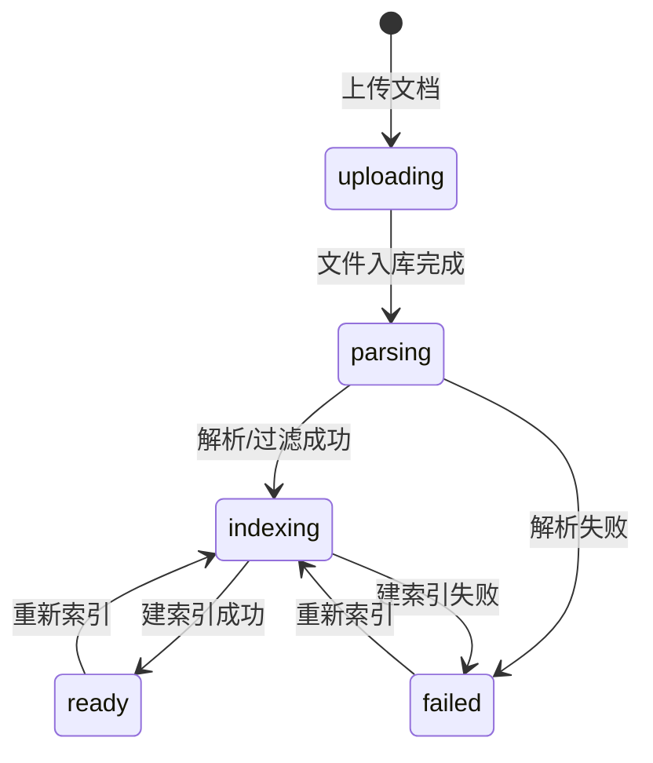
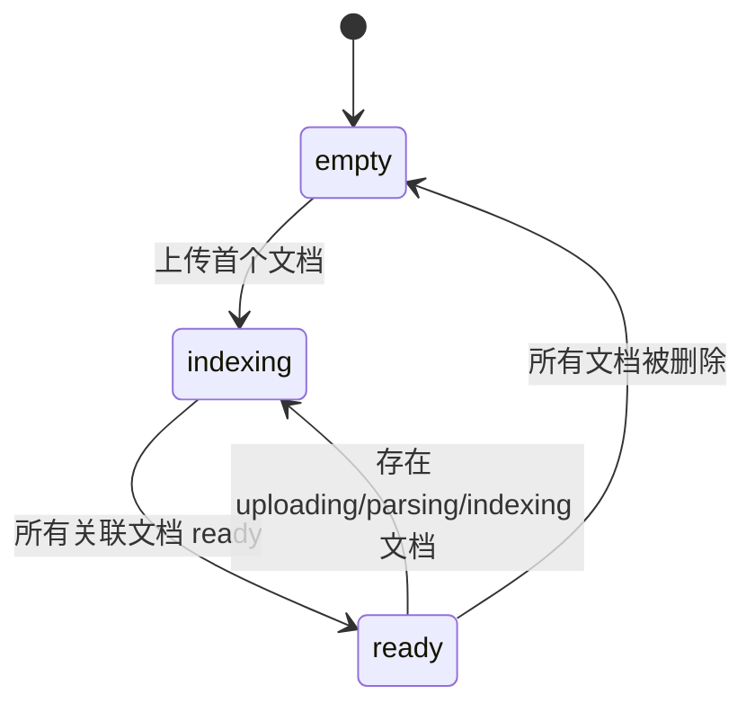

# 知识库管理详细设计

## 1. 模块实体详设

### 1.1 实体: `knowledge_category`

| 字段 | 类型 | 约束 | 说明 |
|------|------|------|------|
| `id` | `VARCHAR(32)` | PK | 分类主键 |
| `name` | `VARCHAR(50)` | UNIQUE, NOT NULL | 分类名称 |
| `icon` | `VARCHAR(8)` | NOT NULL | Emoji 图标 |
| `description` | `TEXT` | NULL | 分类描述 |
| `document_count` | `INT` | NOT NULL, default `0` | 文档总数 |
| `ready_document_count` | `INT` | NOT NULL, default `0` | 已索引完成文档数 |
| `status` | `ENUM('empty','indexing','ready')` | NOT NULL | 分类整体状态 |
| `created_at` | `TIMESTAMP` | NOT NULL | 创建时间 |
| `updated_at` | `TIMESTAMP` | NOT NULL | 更新时间 |

### 1.2 实体: `knowledge_document`

| 字段 | 类型 | 约束 | 说明 |
|------|------|------|------|
| `id` | `VARCHAR(32)` | PK | 文档主键 |
| `category_id` | `VARCHAR(32)` | FK `knowledge_category.id` | 所属分类 |
| `name` | `VARCHAR(120)` | NOT NULL | 文件名 |
| `format` | `ENUM('json','markdown')` | NOT NULL | 文件格式 |
| `size_bytes` | `INT` | NOT NULL | 原始大小 |
| `status` | `ENUM('uploading','parsing','indexing','ready','failed')` | NOT NULL | 处理状态 |
| `source_text` | `TEXT` | NOT NULL | 原始内容 |
| `valid_content_json` | `TEXT` | NULL | 保留字段/分段结果 |
| `filtered_fields_json` | `TEXT` | NULL | 被过滤字段列表 |
| `error_summary` | `TEXT` | NULL | 失败摘要 |
| `index_version` | `INT` | NOT NULL, default `0` | 索引版本 |
| `created_at` | `TIMESTAMP` | NOT NULL | 上传时间 |
| `updated_at` | `TIMESTAMP` | NOT NULL | 更新时间 |

### 1.3 实体: `knowledge_retrieval_probe`

| 字段 | 类型 | 约束 | 说明 |
|------|------|------|------|
| `id` | `VARCHAR(32)` | PK | 检索验证记录 |
| `document_id` | `VARCHAR(32)` | FK `knowledge_document.id` | 目标文档 |
| `query` | `VARCHAR(300)` | NOT NULL | 检索语句 |
| `hit` | `BOOLEAN` | NOT NULL | 是否命中 |
| `score` | `DECIMAL(5,4)` | NULL | 命中分数 |
| `snippet` | `TEXT` | NULL | 片段 |
| `response_preview` | `TEXT` | NULL | 响应用预览 |
| `created_at` | `TIMESTAMP` | NOT NULL | 创建时间 |

## 2. 状态机

### 2.1 `knowledge_document.status`



| 从 | 到 | 触发条件 | 前置校验 | 副作用 |
|---|----|---------|---------|--------|
| `uploading` | `parsing` | 上传文件写入完成 | 格式合法 | 开始解析原始内容 |
| `parsing` | `indexing` | 过滤与结构化成功 | 内容非空 | 写入 `valid_content_json` 与 `filtered_fields_json` |
| `parsing/indexing` | `failed` | 任一阶段异常 | 无 | 写入 `error_summary` |
| `ready/failed` | `indexing` | PM 点击重新索引 | 文档存在 | `index_version + 1`，清空旧错误 |

### 2.2 `knowledge_category.status`



## 3. 核心算法

### 3.1 算法: `filter_json_fields`

```text
valid_keys = {
  recipe_name,
  description,
  main_ingredients,
  sub_ingredients,
  ingredients,
  steps,
  nutrition,
  cooking_tools,
  tags,
  cooking_time
}

invalid_patterns = [
  image, photo, thumbnail, avatar,
  oss_link, s3, cos,
  like_count, share_count, comment_count, view_count,
  review_status, audit_status, approval
]

for each field in payload:
    if field in valid_keys:
        keep
    elif field name matches invalid_patterns:
        move to filtered_fields
    else:
        drop into filtered_fields as non_qa_field

return valid_content, filtered_fields
```

### 3.2 算法: `parse_markdown_sections`

```text
split source_text by h1/h2 headings
for each section:
    build chunk {
      heading,
      content,
      order
    }
if no headings:
    create one fallback chunk using full text
return chunks
```

### 3.3 算法: `build_document_index`

```text
if format == json:
    parsed = filter_json_fields(json_payload)
    normalized_text = join(valid field values)
else:
    parsed = parse_markdown_sections(markdown_text)
    normalized_text = join(section contents)

write valid_content_json
write filtered_fields_json
set status = indexing

build simple chunks for retrieval matching
set index_version += 1
set status = ready
```

### 3.4 算法: `retrieve_test`

```text
load document and valid_content_json
tokenize query
score every chunk by substring/keyword overlap
pick top chunk
if score <= 0:
    return hit = false

snippet = render_highlight(top chunk)
response_preview = summarize(top chunk)
write knowledge_retrieval_probe
return hit, score, snippet, response_preview
```

## 4. 模块级错误码

| 错误码 | 触发条件 | 用户提示 |
|--------|---------|---------|
| `KB-CAT-409-NAME` | 分类名重复 | 分类名称已存在，请更换后重试 |
| `KB-DOC-404-NOT-FOUND` | 文档不存在 | 目标文档不存在 |
| `KB-DOC-422-FORMAT` | 不支持的文档格式 | 仅支持 JSON / Markdown 文档 |
| `KB-DOC-422-EMPTY` | 文档内容为空 | 文档内容为空，无法建立索引 |
| `KB-DOC-409-REINDEX` | 文档已在处理中 | 当前文档正在处理，请稍后再试 |
| `KB-RETRIEVE-422-QUERY` | 检索词为空 | 请输入检索内容 |

## 5. API 实现映射表

| AD 契约 | 处理器 | 服务方法 | 读写实体 |
|---------|-------|---------|---------|
| `GET /knowledge-bases` | `list_knowledge_bases()` | `query_knowledge_directory()` | `knowledge_category`, `knowledge_document` |
| `POST /knowledge-bases/categories` | `create_category()` | `create_category()` | `knowledge_category`, `audit_log` |
| `PATCH /knowledge-bases/categories/{id}` | `update_category()` | `update_category()` | `knowledge_category`, `audit_log` |
| `POST /knowledge-bases/{id}/documents/upload` | `upload_document()` | `create_document()` / `start_index_job()` | `knowledge_document`, `audit_log` |
| `GET /knowledge-documents/{id}` | `get_document_detail()` | `get_document_detail()` | `knowledge_document`, `knowledge_retrieval_probe` |
| `POST /knowledge-documents/{id}/reindex` | `reindex_document()` | `reindex_document()` | `knowledge_document`, `audit_log` |
| `POST /knowledge-documents/{id}/retrieve-test` | `retrieve_test()` | `retrieve_test()` | `knowledge_document`, `knowledge_retrieval_probe` |
| `DELETE /knowledge-documents/{id}` | `delete_document()` | `delete_document()` | `knowledge_document`, `knowledge_category`, `audit_log` |

## 6. 前端 UI 规格

### 6.1 页面结构

| 页面 | 核心区域 | 真实成功信号 |
|------|---------|-------------|
| `KnowledgeBasePage` | 分类列表、文档表格、上传弹窗、检索测试弹窗 | 新文档/分类创建后列表回读刷新 |
| `KnowledgeDocumentDetailPage` | 文档元信息、有效字段、过滤字段、检索测试结果 | 详情字段与过滤结果来自后端 |

### 6.2 交互约束

| 交互 | 约束 |
|------|------|
| 上传文档成功 | 先展示处理中状态，后续必须通过列表/详情回读转为 `ready` |
| 重新索引 | 若文档处理中则禁止重复提交 |
| 删除文档 | 删除后刷新分类统计并返回空态/列表 |
| 检索测试 | 未命中也必须返回明确结果，不允许前端自造回答 |

### 6.3 浏览器探针映射

| harness probe | 页面动作 | 真实成功信号 |
|---------------|---------|-------------|
| `upload_feedback` | 上传文档 | 列表新增文档并经历完整状态流转 |
| `indexing_result_readback` | 查看详情 | 过滤字段、有效字段和索引版本回读一致 |
| `empty_state` | 切到空分类/删空文档 | 页面显示明确空态且无残留旧数据 |

## 7. 测试映射

| 设计对象 | 建议测试 |
|---------|---------|
| 分类唯一名 | 契约测试 |
| 文档上传格式与状态流转 | 契约测试 + 集成测试 |
| JSON 字段过滤 | 单元测试 + 详情契约测试 |
| 重新索引版本递增 | 集成测试 |
| 检索测试命中/未命中 | 契约测试 + 前端页面测试 |
