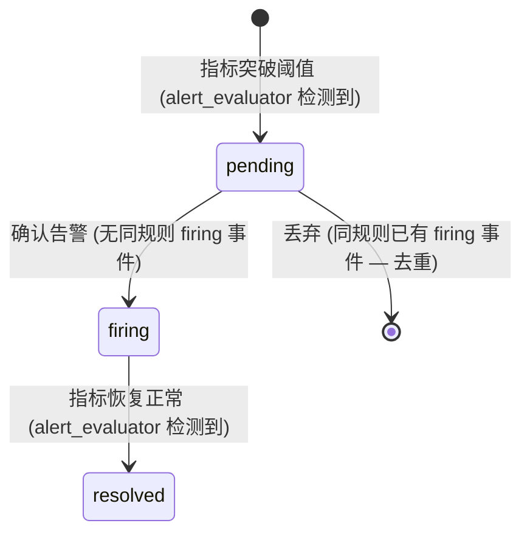

# 详细设计 (DD): 监控域

## 1. 文档说明

本文档覆盖监控域的详细设计，包含请求日志异步写入、实时指标聚合、设备日志查询、会话链路追踪、多维日志查询与告警规则管理。

**内容范围**:
- 模块实体字段级定义: RequestLog、AlertRule、AlertEvent
- AlertEvent 状态机
- 核心算法: 异步日志写入器、指标聚合、告警评估、多维日志查询
- 模块级错误码 (E60xxx)
- 模块配置项与常量
- API 实现映射表

**前置依赖**: dd-global.md (公共实体、错误码体系、权限模型、系统配置)

---

## 2. 设计原则

遵循 dd-template.md §2 及 dd-global.md §2:

- **一对一可编码**: 每个定义直接映射为 SQLAlchemy Model / 枚举 / 后台任务
- **约束显式化**: 字段有 max_length、数值有 range、JSONB 有 schema
- **向后兼容**: 分区表按月新增, 历史分区不变; 枚举新增不删除

---

## 3. 数据模型详设

### 3.1 实体: RequestLog (请求日志)

**对应 FR**: FR-033
**对应 AD**: ad-monitoring.md §1.2, §2.1
**表名**: `request_logs`
**分区策略**: PARTITION BY RANGE (`timestamp`), 按月分区 (见 §3.4)

| 字段 | 类型 | 约束 | 默认值 | 索引 | 说明 |
|------|------|------|--------|------|------|
| request_id | UUID | PK | gen_random_uuid() | 主键 | 请求唯一标识 |
| device_id | VARCHAR(64) | NOT NULL | - | 复合索引 ① | 设备标识 |
| session_id | VARCHAR(128) | NOT NULL | - | 普通索引 | 会话标识 |
| input_text | TEXT | NOT NULL | - | - | 用户原始输入 |
| route_result | VARCHAR(16) | NOT NULL | - | 复合索引 ① | 路由结果, 枚举: command / knowledge / chitchat / error |
| route_confidence | FLOAT | NOT NULL | 0.0 | - | 路由置信度, 范围 0.0~1.0 |
| intent | VARCHAR(100) | NULL | NULL | 普通索引 | 意图名称, 仅 route_result=command 时非空 |
| intent_confidence | FLOAT | NULL | NULL | - | 意图置信度, 范围 0.0~1.0 |
| slots | JSONB | NULL | NULL | - | 槽位提取结果, schema 见下方 |
| knowledge_hit | JSONB | NULL | NULL | - | 知识命中信息, schema 见下方 |
| reference_resolution | JSONB | NULL | NULL | - | 指代消解信息, schema 见下方 |
| response_text | TEXT | NOT NULL | - | - | 系统响应文本 |
| latency_ms | INT | NOT NULL | - | - | 端到端响应耗时 (毫秒), 范围 0~30000 |
| timestamp | TIMESTAMP(TZ) | NOT NULL | now() | 复合索引 ① | 请求到达时间, UTC+8; 分区键 |
| status | VARCHAR(16) | NOT NULL | 'normal' | 普通索引 | 请求状态, 枚举: normal / timeout / error |
| device_context_snapshot | JSONB | NULL | NULL | - | 请求时刻设备上下文快照, schema 见下方 |
| error_message | VARCHAR(500) | NULL | NULL | - | 异常时的错误信息 |

**route_result 枚举**:

| 值 | 含义 |
|----|------|
| command | 指令域 |
| knowledge | 知识域 |
| chitchat | 闲聊域 |
| error | 处理异常 |

**status 枚举**:

| 值 | 含义 |
|----|------|
| normal | 正常响应 |
| timeout | 处理超时 |
| error | 处理异常 |

**slots JSONB Schema**:

```json
[
  {
    "name": "string — 槽位名",
    "value": "string — 槽位值",
    "type": "string — 槽位类型",
    "required": "boolean — 是否必填",
    "filled": "boolean — 是否已填充"
  }
]
```

**knowledge_hit JSONB Schema**:

```json
{
  "doc_name": "string | null — 命中文档名",
  "category": "string | null — 文档分类",
  "score": "float | null — 匹配得分, 0.0~1.0"
}
```

**reference_resolution JSONB Schema**:

```json
{
  "pronoun": "string | null — 指代词 (如 '它'、'这个')",
  "resolved": "string | null — 消解后的实体名称"
}
```

**device_context_snapshot JSONB Schema**:

```json
{
  "cooking_status": "string — enum: idle/cooking/paused/done",
  "door_status": "string — enum: open/closed/unknown",
  "current_temp": "int — 当前温度(℃)",
  "current_page": "string — 设备当前页面"
}
```

#### 索引

| 索引名 | 字段 | 类型 | 用途 |
|--------|------|------|------|
| idx_rl_ts_dev_route | (timestamp DESC, device_id, route_result) | B-Tree, 复合 | 多维查询主索引: 按时间 + 设备 + 路由类型 (覆盖仪表盘聚合、设备日志、多维筛选) |
| idx_rl_session_id | (session_id) | B-Tree | 会话链路追踪: 按 session_id 查全部请求 |
| idx_rl_intent | (intent) | B-Tree | 按意图名称筛选 |
| idx_rl_status | (status) | B-Tree | 按状态筛选 (异常日志查询) |
| idx_rl_device_id | (device_id) | B-Tree | 设备日志列表: 按 device_id 聚合会话 |

#### 关系

| 关系 | 目标实体 | 类型 | 说明 |
|------|---------|------|------|
| (无外键) | DeviceSession (Redis) | 逻辑引用 | device_id + session_id 为运行时逻辑关联, 无数据库外键 |

---

### 3.2 实体: AlertRule (告警规则)

**对应 FR**: FR-035
**对应 AD**: ad-monitoring.md §1.2, §2.4
**表名**: `alert_rules`

| 字段 | 类型 | 约束 | 默认值 | 索引 | 说明 |
|------|------|------|--------|------|------|
| id | UUID | PK | gen_random_uuid() | 主键 | 唯一标识 |
| name | VARCHAR(100) | NOT NULL, UNIQUE | - | 唯一索引 | 规则名称, 全局唯一 |
| metric_name | VARCHAR(30) | NOT NULL | - | - | 监控指标, 枚举见下方 |
| operator | VARCHAR(4) | NOT NULL | - | - | 比较运算符, 枚举: lt / gt |
| threshold | FLOAT | NOT NULL | - | - | 告警阈值 |
| duration_seconds | INT | NOT NULL | - | - | 持续时间窗口 (秒), 范围 60~3600 |
| severity | VARCHAR(16) | NOT NULL | 'warning' | - | 严重级别, 枚举: info / warning / critical |
| is_enabled | BOOLEAN | NOT NULL | true | 普通索引 | 是否启用 |
| notification_config | JSONB | NOT NULL | '["in_app"]' | - | 通知渠道配置, schema 见下方 |
| created_by | UUID | NOT NULL, FK(users.id) | - | - | 创建人 ID |
| created_at | TIMESTAMP(TZ) | NOT NULL | now() | - | 创建时间 |
| updated_at | TIMESTAMP(TZ) | NOT NULL | now() | - | 更新时间 |

**metric_name 枚举**:

| 值 | 含义 | 典型操作符 | 典型阈值 |
|----|------|-----------|---------|
| accuracy_rate | 意图识别准确率 | lt | 0.90 |
| p95_latency | P95 延迟 (ms) | gt | 500 |
| p99_latency | P99 延迟 (ms) | gt | 1000 |
| avg_latency | 平均延迟 (ms) | gt | 300 |
| error_rate | 错误率 | gt | 0.05 |
| qps | 每秒请求量 | gt | 100 |

**operator 枚举**:

| 值 | 含义 | SQL 等价 |
|----|------|---------|
| lt | 小于 (低于阈值告警) | `<` |
| gt | 大于 (超过阈值告警) | `>` |

**notification_config JSONB Schema**:

```json
["in_app", "email", "webhook"]
```

允许值: `in_app` (站内通知, 默认), `email`, `webhook`。数组形式, 支持多渠道组合。

**operator 与 metric_name 合法性校验**:

| metric_name | 合法 operator | 说明 |
|-------------|--------------|------|
| accuracy_rate | lt | 准确率低于阈值才告警 |
| p95_latency | gt | 延迟超过阈值才告警 |
| p99_latency | gt | 延迟超过阈值才告警 |
| avg_latency | gt | 延迟超过阈值才告警 |
| error_rate | gt | 错误率超过阈值才告警 |
| qps | gt | QPS 超过阈值才告警 |

#### 索引

| 索引名 | 字段 | 类型 | 用途 |
|--------|------|------|------|
| uq_ar_name | (name) | B-Tree, UNIQUE | 规则名称唯一 |
| idx_ar_is_enabled | (is_enabled) | B-Tree | 定时任务筛选启用的规则 |

#### 关系

| 关系 | 目标实体 | 类型 | 外键 | 级联策略 |
|------|---------|------|------|---------|
| 创建人 | User | 多对一 | created_by → users.id | RESTRICT |
| 告警事件 | AlertEvent | 一对多 | alert_events.rule_id | CASCADE DELETE |

---

### 3.3 实体: AlertEvent (告警事件)

**对应 FR**: FR-035
**对应 AD**: ad-monitoring.md §1.2, §2.4
**表名**: `alert_events`

| 字段 | 类型 | 约束 | 默认值 | 索引 | 说明 |
|------|------|------|--------|------|------|
| id | UUID | PK | gen_random_uuid() | 主键 | 唯一标识 |
| rule_id | UUID | NOT NULL, FK(alert_rules.id, ON DELETE CASCADE) | - | 普通索引 | 关联的告警规则 |
| status | VARCHAR(16) | NOT NULL | 'pending' | 复合索引 | 事件状态, 枚举见 §4 状态机 |
| fired_at | TIMESTAMP(TZ) | NOT NULL | now() | - | 触发时间 |
| resolved_at | TIMESTAMP(TZ) | NULL | NULL | - | 恢复时间 |
| metric_value | FLOAT | NOT NULL | - | - | 触发时的指标实际值 |
| message | VARCHAR(500) | NOT NULL | - | - | 告警消息文本 |

#### 索引

| 索引名 | 字段 | 类型 | 用途 |
|--------|------|------|------|
| idx_ae_rule_id | (rule_id) | B-Tree | 按规则查事件列表 |
| idx_ae_rule_status | (rule_id, status) | B-Tree, 复合 | 去重查询: 查找同规则下 firing 状态的事件 |
| idx_ae_fired_at | (fired_at DESC) | B-Tree | 事件时间排序 |

#### 关系

| 关系 | 目标实体 | 类型 | 外键 | 级联策略 |
|------|---------|------|------|---------|
| 所属规则 | AlertRule | 多对一 | rule_id → alert_rules.id | CASCADE DELETE |

---

### 3.4 ER 关系总图与分区策略

#### ER 关系

```
监控域:
  RequestLog (独立, 无外键依赖, 分区表)
  AlertRule (1) ──(1:N)── AlertEvent (*)

跨域引用:
  AlertRule.created_by → User.id  (dd-global.md §3.1)
  RequestLog.device_id / session_id → DeviceSession (Redis, 逻辑引用)
```

#### request_logs 分区策略

**分区方式**: PostgreSQL 声明式分区 (Declarative Partitioning), `PARTITION BY RANGE (timestamp)`

**分区粒度**: 按自然月, 每月一个子表

**命名规范**: `request_logs_YYYYMM` (如 `request_logs_202603`)

**DDL (父表 + 示例分区)**:

```sql
CREATE TABLE request_logs (
    request_id     UUID        DEFAULT gen_random_uuid(),
    device_id      VARCHAR(64) NOT NULL,
    session_id     VARCHAR(128) NOT NULL,
    input_text     TEXT        NOT NULL,
    route_result   VARCHAR(16) NOT NULL,
    route_confidence FLOAT     NOT NULL DEFAULT 0.0,
    intent         VARCHAR(100),
    intent_confidence FLOAT,
    slots          JSONB,
    knowledge_hit  JSONB,
    reference_resolution JSONB,
    response_text  TEXT        NOT NULL,
    latency_ms     INT         NOT NULL,
    timestamp      TIMESTAMPTZ NOT NULL DEFAULT now(),
    status         VARCHAR(16) NOT NULL DEFAULT 'normal',
    device_context_snapshot JSONB,
    error_message  VARCHAR(500),
    PRIMARY KEY (request_id, timestamp)
) PARTITION BY RANGE (timestamp);

-- 2026-03 分区
CREATE TABLE request_logs_202603 PARTITION OF request_logs
    FOR VALUES FROM ('2026-03-01') TO ('2026-04-01');

-- 2026-04 分区 (提前创建)
CREATE TABLE request_logs_202604 PARTITION OF request_logs
    FOR VALUES FROM ('2026-04-01') TO ('2026-05-01');
```

**分区自动创建**: 通过 cron job 或 pg_partman 扩展, 每月 25 日自动创建下月分区。

**数据保留策略**:

| 策略 | 值 | 说明 |
|------|----|------|
| 在线保留期 | 6 个月 | 最近 6 个月数据保持在线, 支持实时查询 |
| 归档策略 | 6~12 个月 | 导出至对象存储 (JSON 格式) 后 DROP 分区 |
| 硬删除 | > 12 个月 | 归档数据到期后永久删除 |
| 定时任务 | 每月 1 日 02:00 | 检查并执行过期分区的归档/删除 |

**索引在分区表上的行为**: 父表上 CREATE INDEX 会自动在所有子分区上创建对应的局部索引。

**分区主键说明**: PostgreSQL 分区表要求主键必须包含分区键, 因此 PK 为 `(request_id, timestamp)` 的复合主键。

---

### 3.5 数据迁移

**工具**: Alembic (遵循 dd-global.md §3.8 规范)

**初始迁移** (3 张表 + 分区):

```python
def upgrade():
    # 1. request_logs (分区父表 — Alembic 不直接支持分区, 使用 raw SQL)
    op.execute("""
        CREATE TABLE request_logs (
            request_id     UUID        DEFAULT gen_random_uuid(),
            device_id      VARCHAR(64) NOT NULL,
            session_id     VARCHAR(128) NOT NULL,
            input_text     TEXT        NOT NULL,
            route_result   VARCHAR(16) NOT NULL,
            route_confidence FLOAT     NOT NULL DEFAULT 0.0,
            intent         VARCHAR(100),
            intent_confidence FLOAT,
            slots          JSONB,
            knowledge_hit  JSONB,
            reference_resolution JSONB,
            response_text  TEXT        NOT NULL,
            latency_ms     INT         NOT NULL,
            timestamp      TIMESTAMPTZ NOT NULL DEFAULT now(),
            status         VARCHAR(16) NOT NULL DEFAULT 'normal',
            device_context_snapshot JSONB,
            error_message  VARCHAR(500),
            PRIMARY KEY (request_id, timestamp)
        ) PARTITION BY RANGE (timestamp)
    """)

    # 初始分区 (当月 + 下月)
    op.execute("""
        CREATE TABLE request_logs_202603 PARTITION OF request_logs
        FOR VALUES FROM ('2026-03-01') TO ('2026-04-01')
    """)
    op.execute("""
        CREATE TABLE request_logs_202604 PARTITION OF request_logs
        FOR VALUES FROM ('2026-04-01') TO ('2026-05-01')
    """)

    # 索引 (自动传播到子分区)
    op.execute("""
        CREATE INDEX idx_rl_ts_dev_route
        ON request_logs (timestamp DESC, device_id, route_result)
    """)
    op.execute("CREATE INDEX idx_rl_session_id ON request_logs (session_id)")
    op.execute("CREATE INDEX idx_rl_intent ON request_logs (intent)")
    op.execute("CREATE INDEX idx_rl_status ON request_logs (status)")
    op.execute("CREATE INDEX idx_rl_device_id ON request_logs (device_id)")

    # 2. alert_rules
    op.create_table(
        "alert_rules",
        sa.Column("id", sa.dialects.postgresql.UUID, primary_key=True,
                  server_default=sa.text("gen_random_uuid()")),
        sa.Column("name", sa.String(100), nullable=False, unique=True),
        sa.Column("metric_name", sa.String(30), nullable=False),
        sa.Column("operator", sa.String(4), nullable=False),
        sa.Column("threshold", sa.Float, nullable=False),
        sa.Column("duration_seconds", sa.Integer, nullable=False),
        sa.Column("severity", sa.String(16), nullable=False,
                  server_default="warning"),
        sa.Column("is_enabled", sa.Boolean, nullable=False,
                  server_default=sa.text("true")),
        sa.Column("notification_config", sa.dialects.postgresql.JSONB,
                  nullable=False, server_default='["in_app"]'),
        sa.Column("created_by", sa.dialects.postgresql.UUID,
                  sa.ForeignKey("users.id"), nullable=False),
        sa.Column("created_at", sa.DateTime(timezone=True), nullable=False,
                  server_default=sa.text("now()")),
        sa.Column("updated_at", sa.DateTime(timezone=True), nullable=False,
                  server_default=sa.text("now()")),
    )
    op.create_index("idx_ar_is_enabled", "alert_rules", ["is_enabled"])

    # 3. alert_events
    op.create_table(
        "alert_events",
        sa.Column("id", sa.dialects.postgresql.UUID, primary_key=True,
                  server_default=sa.text("gen_random_uuid()")),
        sa.Column("rule_id", sa.dialects.postgresql.UUID,
                  sa.ForeignKey("alert_rules.id", ondelete="CASCADE"),
                  nullable=False),
        sa.Column("status", sa.String(16), nullable=False,
                  server_default="pending"),
        sa.Column("fired_at", sa.DateTime(timezone=True), nullable=False,
                  server_default=sa.text("now()")),
        sa.Column("resolved_at", sa.DateTime(timezone=True), nullable=True),
        sa.Column("metric_value", sa.Float, nullable=False),
        sa.Column("message", sa.String(500), nullable=False),
    )
    op.create_index("idx_ae_rule_id", "alert_events", ["rule_id"])
    op.create_index("idx_ae_rule_status", "alert_events",
                    ["rule_id", "status"])
    op.create_index("idx_ae_fired_at", "alert_events",
                    [sa.text("fired_at DESC")])
```

---

## 4. 状态机定义

### 4.1 AlertEvent 状态机



#### 状态枚举

| 状态值 | 显示名 | 含义 | 允许的操作 |
|--------|-------|------|-----------|
| pending | 待确认 | 指标突破阈值, 等待去重判断 | 查看 |
| firing | 告警中 | 已确认告警, 已发送通知 | 查看 |
| resolved | 已恢复 | 指标恢复到安全范围 | 查看 |

#### 状态转移规则

| 从 | 到 | 触发条件 | 前置校验 | 副作用 | 触发方 |
|---|------|---------|---------|--------|--------|
| (初始) | pending | alert_evaluator 检测到指标突破阈值 | rule.is_enabled == true | 创建临时事件对象 | 后台定时任务 (30s) |
| pending | firing | 同规则无其他 firing 状态事件 | `SELECT COUNT(*) FROM alert_events WHERE rule_id=? AND status='firing'` == 0 | INSERT alert_event; 发送通知 (notification_config) | 后台定时任务 |
| pending | (丢弃) | 同规则已有 firing 状态事件 | `COUNT(*) > 0` | 不创建新事件, 记录 DEBUG 日志 | 后台定时任务 |
| firing | resolved | 当前指标值不再突破阈值 | status == 'firing' | UPDATE status='resolved', resolved_at=now() | 后台定时任务 |

#### 去重策略

同一 `rule_id` 在同一时刻最多存在 1 个 `firing` 状态的事件。当告警评估器检测到阈值突破时:
1. 先查询该规则是否已有 `status='firing'` 的事件
2. 若有则跳过 (避免重复告警轰炸)
3. 若无则创建新事件并发送通知

---

## 5. 核心算法详设

### 5.1 算法: 异步日志写入器 (Async Log Writer)

**对应 FR**: FR-033
**对应 AD**: ad-monitoring.md §2.1

#### 输入输出

| 方向 | 参数 | 类型 | 约束 | 说明 |
|------|------|------|------|------|
| 输入 | log_entry | RequestLogEntry | NOT NULL | 单条请求日志数据 |
| 输出 | (无) | - | - | 异步写入, 无同步返回 |

#### 设计要点

- **非阻塞**: enqueue 操作不影响 API 响应延迟
- **内存队列**: asyncio.Queue, 上限 10000 条 (dd-global.md §6.1 `LOG_QUEUE_MAX_SIZE`)
- **批量写入**: 每批最多 100 条 (dd-global.md §6.1 `LOG_BATCH_SIZE`)
- **触发条件**: 队列积满 100 条 或 距上次 flush ≥ 1 秒 (取先到者)
- **故障降级**: 重试 3 次指数退避 → fallback 本地文件

#### 伪代码

```python
LOG_QUEUE_MAX_SIZE = 10000    # dd-global.md §6.1
LOG_BATCH_SIZE = 100          # dd-global.md §6.1
LOG_FLUSH_INTERVAL = 1.0      # 秒
LOG_RETRY_MAX = 3
LOG_RETRY_BASE_DELAY = 1.0    # 秒, 指数退避
FALLBACK_LOG_PATH = "/var/log/smartchef/request_logs_fallback.jsonl"


class AsyncLogWriter:
    def __init__(self):
        self._queue: asyncio.Queue = asyncio.Queue(maxsize=LOG_QUEUE_MAX_SIZE)
        self._running = False

    async def enqueue(self, log_entry: dict) -> None:
        """非阻塞入队, 队列满时丢弃最旧条目"""
        if self._queue.full():
            try:
                self._queue.get_nowait()  # 丢弃最旧
                logger.warning("Log queue full, discarding oldest entry")
            except asyncio.QueueEmpty:
                pass
        try:
            self._queue.put_nowait(log_entry)
        except asyncio.QueueFull:
            logger.warning("Log queue overflow, entry discarded")

    async def start(self) -> None:
        """启动后台 flush 循环 (应用启动时调用)"""
        self._running = True
        while self._running:
            batch = await self._drain_batch()
            if batch:
                await self._flush_with_retry(batch)
            else:
                await asyncio.sleep(LOG_FLUSH_INTERVAL)

    async def stop(self) -> None:
        """优雅关闭: flush 残余数据"""
        self._running = False
        while not self._queue.empty():
            batch = await self._drain_batch()
            if batch:
                await self._flush_with_retry(batch)

    async def _drain_batch(self) -> list[dict]:
        """从队列取出最多 LOG_BATCH_SIZE 条"""
        batch = []
        try:
            while len(batch) < LOG_BATCH_SIZE:
                entry = self._queue.get_nowait()
                batch.append(entry)
        except asyncio.QueueEmpty:
            pass
        return batch

    async def _flush_with_retry(self, batch: list[dict]) -> None:
        """批量写入 DB, 带指数退避重试"""
        for attempt in range(LOG_RETRY_MAX):
            try:
                async with db_session() as db:
                    await db.execute(
                        insert(RequestLog),
                        batch
                    )
                    await db.commit()
                return
            except Exception as e:
                delay = LOG_RETRY_BASE_DELAY * (2 ** attempt)
                logger.error(f"Log flush attempt {attempt+1} failed: {e}, "
                             f"retrying in {delay}s")
                await asyncio.sleep(delay)

        # 重试耗尽 → fallback 本地文件
        await self._write_fallback(batch)

    async def _write_fallback(self, batch: list[dict]) -> None:
        """写入本地 fallback 文件 (JSONL 格式)"""
        try:
            async with aiofiles.open(FALLBACK_LOG_PATH, "a") as f:
                for entry in batch:
                    await f.write(json.dumps(entry, default=str) + "\n")
            logger.error(f"Flushed {len(batch)} entries to fallback file")
        except Exception as e:
            logger.critical(f"Fallback write also failed: {e}, "
                            f"lost {len(batch)} log entries")
```

#### 调用集成点

```python
# device.py — POST /api/v1/dialog 响应后
async def dialog_endpoint(request: DialogRequest):
    response = await nlu_pipeline.process(request)

    # 非阻塞: fire-and-forget
    asyncio.create_task(log_writer.enqueue({
        "request_id": str(uuid4()),
        "device_id": request.device_id,
        "session_id": session.session_id,
        "input_text": request.text,
        "route_result": response.route_result,
        "route_confidence": response.route_confidence,
        "intent": response.intent,
        "intent_confidence": response.intent_confidence,
        "slots": response.slots,
        "knowledge_hit": response.knowledge_hit,
        "reference_resolution": response.reference_resolution,
        "response_text": response.text,
        "latency_ms": elapsed_ms,
        "timestamp": datetime.now(tz=timezone(timedelta(hours=8))),
        "status": response.status,
        "device_context_snapshot": request.device_context,
        "error_message": response.error_message,
    }))

    return response
```

#### 边界条件

| 边界场景 | 处理方式 | 影响 |
|---------|---------|------|
| 内存队列满 (10000 条) | `get_nowait()` 丢弃最旧条目后入队; 记录 WARN 日志 | 少量日志丢失, 不影响 API 响应 |
| DB 写入失败 (连接池耗尽等) | 指数退避重试 3 次 (1s, 2s, 4s) | 最多延迟 7s 后降级 |
| 重试耗尽后仍失败 | 写入本地 JSONL fallback 文件; 记录 ERROR | 仪表盘数据短暂延迟 |
| fallback 文件写入也失败 | 记录 CRITICAL 日志; 丢失该批次数据 | 数据丢失 (极端情况) |
| 日志字段格式异常 (Pydantic 校验失败) | enqueue 前校验, 跳过该条; 记录 ERROR | 单条日志丢失 |
| 应用关闭 | `stop()` flush 残余队列数据 | 尽量不丢数据 |
| 日志写入量持续 > DB 吞吐 | 队列持续积压 → 丢弃最旧; 需扩容 DB 或降低采样率 | 需运维介入 |

---

### 5.2 算法: 指标聚合 (Metrics Aggregation)

**对应 FR**: FR-030, FR-038
**对应 AD**: ad-monitoring.md §2.2

#### 输入输出

| 方向 | 参数 | 类型 | 约束 | 说明 |
|------|------|------|------|------|
| 输入 | time_range | str | `1h` / `6h` / `24h` / `7d` | 统计时间范围 |
| 输出 | DashboardMetrics | object | - | 仪表盘指标结构 |

#### 设计要点

- **Redis 缓存**: key = `dashboard:{time_range}`, TTL = 30s
- **并发安全**: 缓存未命中时使用 Redis SETNX 作为分布式锁, 防止缓存击穿
- **前端轮询**: 30s 间隔自动刷新 (FR-038), 与缓存 TTL 对齐

#### 伪代码

```python
DASHBOARD_CACHE_TTL = 30          # 秒
DASHBOARD_QUERY_TIMEOUT = 5       # 秒
TIME_RANGE_MAP = {
    "1h": timedelta(hours=1),
    "6h": timedelta(hours=6),
    "24h": timedelta(hours=24),
    "7d": timedelta(days=7),
}

@dataclass
class DashboardMetrics:
    time_range: str
    total_requests: int
    qps: float
    avg_latency_ms: int
    p95_latency_ms: int
    p99_latency_ms: int
    accuracy_rate: float
    error_rate: float
    avg_dialog_turns: float
    route_distribution: dict       # {command: {count, percentage}, ...}
    updated_at: datetime


async def aggregate_metrics(time_range: str,
                            redis: Redis,
                            db: AsyncSession) -> DashboardMetrics:
    if time_range not in TIME_RANGE_MAP:
        raise BusinessException("E60101", "时间范围参数无效，支持: 1h/6h/24h/7d")

    # 1. 尝试读取 Redis 缓存
    cache_key = f"dashboard:{time_range}"
    cached = await redis.get(cache_key)
    if cached:
        return DashboardMetrics(**json.loads(cached))

    # 2. 缓存未命中 → 聚合查询
    delta = TIME_RANGE_MAP[time_range]
    since = datetime.now(tz=timezone.utc) - delta

    # 2.1 总请求量
    total = await db.scalar(
        select(func.count()).select_from(RequestLog)
        .where(RequestLog.timestamp >= since)
    )

    # 2.2 QPS (最近 60s 请求数 / 60)
    qps_since = datetime.now(tz=timezone.utc) - timedelta(seconds=60)
    recent_count = await db.scalar(
        select(func.count()).select_from(RequestLog)
        .where(RequestLog.timestamp >= qps_since)
    )
    qps = round(recent_count / 60.0, 2)

    # 2.3 延迟分位数
    latency_row = await db.execute(
        select(
            func.avg(RequestLog.latency_ms).label("avg"),
            func.percentile_cont(0.95).within_group(
                RequestLog.latency_ms.asc()
            ).label("p95"),
            func.percentile_cont(0.99).within_group(
                RequestLog.latency_ms.asc()
            ).label("p99"),
        ).where(RequestLog.timestamp >= since)
    )
    lat = latency_row.one()

    # 2.4 路由分布
    route_rows = await db.execute(
        select(
            RequestLog.route_result,
            func.count().label("cnt"),
        )
        .where(RequestLog.timestamp >= since)
        .group_by(RequestLog.route_result)
    )
    route_dist = {}
    for row in route_rows:
        pct = round(row.cnt / total, 4) if total > 0 else 0.0
        route_dist[row.route_result] = {"count": row.cnt, "percentage": pct}

    # 2.5 准确率 (command 路由中 status=normal 且 intent_confidence >= threshold 的比例)
    cmd_total = await db.scalar(
        select(func.count()).select_from(RequestLog)
        .where(RequestLog.timestamp >= since,
               RequestLog.route_result == "command")
    )
    cmd_accurate = await db.scalar(
        select(func.count()).select_from(RequestLog)
        .where(RequestLog.timestamp >= since,
               RequestLog.route_result == "command",
               RequestLog.status == "normal",
               RequestLog.intent_confidence >= ACCURACY_THRESHOLD)
    )
    accuracy = round(cmd_accurate / cmd_total, 4) if cmd_total > 0 else 0.0

    # 2.6 错误率
    error_count = await db.scalar(
        select(func.count()).select_from(RequestLog)
        .where(RequestLog.timestamp >= since,
               RequestLog.status == "error")
    )
    error_rate = round(error_count / total, 4) if total > 0 else 0.0

    # 2.7 平均对话轮次
    avg_turns_row = await db.execute(
        select(func.avg(text("turn_count"))).select_from(
            select(
                RequestLog.session_id,
                func.count().label("turn_count"),
            )
            .where(RequestLog.timestamp >= since)
            .group_by(RequestLog.session_id)
            .subquery()
        )
    )
    avg_turns = round(avg_turns_row.scalar() or 0.0, 1)

    metrics = DashboardMetrics(
        time_range=time_range,
        total_requests=total,
        qps=qps,
        avg_latency_ms=int(lat.avg or 0),
        p95_latency_ms=int(lat.p95 or 0),
        p99_latency_ms=int(lat.p99 or 0),
        accuracy_rate=accuracy,
        error_rate=error_rate,
        avg_dialog_turns=avg_turns,
        route_distribution=route_dist,
        updated_at=datetime.now(tz=timezone(timedelta(hours=8))),
    )

    # 3. 写入 Redis 缓存
    await redis.setex(
        cache_key,
        DASHBOARD_CACHE_TTL,
        json.dumps(asdict(metrics), default=str),
    )

    return metrics
```

#### 边界条件

| 边界场景 | 处理方式 | 错误码 |
|---------|---------|--------|
| time_range 不在合法枚举内 | 返回 400 | E60101 |
| 无任何请求日志 (冷启动) | 所有指标返回 0 / 0.0, route_distribution 为空 dict | - |
| 聚合查询超时 (> 5s) | 中断查询, 返回 500 | E60180 |
| Redis 不可用 | 跳过缓存, 直接查询 DB; 记录 WARN | - |
| 缓存击穿 (大量并发请求同时 miss) | Redis SETNX 分布式锁, 仅一个请求回源 DB, 其余等待缓存 | - |
| command 路由为 0 条 | accuracy_rate 返回 0.0 (避免除零) | - |
| total == 0 | error_rate 和 route_distribution.percentage 均返回 0.0 | - |

---

### 5.3 算法: 告警评估 (Alert Evaluation)

**对应 FR**: FR-035
**对应 AD**: ad-monitoring.md §2.4

#### 输入输出

| 方向 | 参数 | 类型 | 约束 | 说明 |
|------|------|------|------|------|
| 输入 | (无) | - | - | 定时任务, 自动读取所有启用的规则 |
| 输出 | (无) | - | - | 副作用: 创建/恢复 AlertEvent |

#### 设计要点

- **执行间隔**: 30 秒 (配置项 `ALERT_EVAL_INTERVAL`)
- **窗口聚合**: 根据规则的 `duration_seconds` 在窗口内计算指标值
- **去重**: 同规则已有 firing 事件时跳过
- **自动恢复**: 指标恢复正常时自动将 firing 事件标记为 resolved

#### 伪代码

```python
ALERT_EVAL_INTERVAL = 30       # 秒


async def alert_evaluation_loop():
    """后台定时任务: 每 ALERT_EVAL_INTERVAL 秒执行一次"""
    while True:
        try:
            async with db_session() as db:
                rules = await db.execute(
                    select(AlertRule).where(AlertRule.is_enabled == True)
                )
                for rule in rules.scalars():
                    await _evaluate_rule(rule, db)
                await db.commit()
        except Exception as e:
            logger.error(f"Alert evaluation cycle failed: {e}")

        await asyncio.sleep(ALERT_EVAL_INTERVAL)


async def _evaluate_rule(rule: AlertRule, db: AsyncSession) -> None:
    """评估单条规则"""
    window_start = datetime.now(tz=timezone.utc) - timedelta(
        seconds=rule.duration_seconds
    )

    # 1. 在时间窗口内计算指标值
    current_value = await _compute_metric(rule.metric_name, window_start, db)
    if current_value is None:
        return  # 窗口内无数据, 跳过

    # 2. 判断是否突破阈值
    is_breaching = _check_threshold(current_value, rule.operator, rule.threshold)

    # 3. 查找该规则当前 firing 事件
    existing_firing = await db.scalar(
        select(func.count()).select_from(AlertEvent)
        .where(AlertEvent.rule_id == rule.id,
               AlertEvent.status == "firing")
    )

    if is_breaching:
        if existing_firing > 0:
            # 已有 firing 事件 → 去重, 跳过
            return
        # 新建 firing 事件
        event = AlertEvent(
            rule_id=rule.id,
            status="firing",
            fired_at=datetime.now(tz=timezone.utc),
            metric_value=current_value,
            message=_build_alert_message(rule, current_value),
        )
        db.add(event)
        await _send_notification(rule.notification_config, event)
    else:
        if existing_firing > 0:
            # 指标恢复 → 自动 resolve
            await db.execute(
                update(AlertEvent)
                .where(AlertEvent.rule_id == rule.id,
                       AlertEvent.status == "firing")
                .values(status="resolved",
                        resolved_at=datetime.now(tz=timezone.utc))
            )


def _check_threshold(value: float, operator: str, threshold: float) -> bool:
    if operator == "lt":
        return value < threshold
    elif operator == "gt":
        return value > threshold
    return False


async def _compute_metric(metric_name: str,
                          window_start: datetime,
                          db: AsyncSession) -> float | None:
    """根据 metric_name 在窗口内聚合计算指标值"""
    base_filter = RequestLog.timestamp >= window_start

    if metric_name == "accuracy_rate":
        total = await db.scalar(
            select(func.count()).select_from(RequestLog)
            .where(base_filter, RequestLog.route_result == "command")
        )
        if total == 0:
            return None
        accurate = await db.scalar(
            select(func.count()).select_from(RequestLog)
            .where(base_filter,
                   RequestLog.route_result == "command",
                   RequestLog.status == "normal",
                   RequestLog.intent_confidence >= ACCURACY_THRESHOLD)
        )
        return round(accurate / total, 4)

    elif metric_name == "p95_latency":
        return await db.scalar(
            select(func.percentile_cont(0.95).within_group(
                RequestLog.latency_ms.asc()
            )).where(base_filter)
        )

    elif metric_name == "p99_latency":
        return await db.scalar(
            select(func.percentile_cont(0.99).within_group(
                RequestLog.latency_ms.asc()
            )).where(base_filter)
        )

    elif metric_name == "avg_latency":
        return await db.scalar(
            select(func.avg(RequestLog.latency_ms)).where(base_filter)
        )

    elif metric_name == "error_rate":
        total = await db.scalar(
            select(func.count()).select_from(RequestLog).where(base_filter)
        )
        if total == 0:
            return None
        errors = await db.scalar(
            select(func.count()).select_from(RequestLog)
            .where(base_filter, RequestLog.status == "error")
        )
        return round(errors / total, 4)

    elif metric_name == "qps":
        total = await db.scalar(
            select(func.count()).select_from(RequestLog).where(base_filter)
        )
        window_seconds = (datetime.now(tz=timezone.utc) - window_start).total_seconds()
        return round(total / max(window_seconds, 1), 2)

    return None


def _build_alert_message(rule: AlertRule, value: float) -> str:
    op_text = "低于" if rule.operator == "lt" else "超过"
    return (f"[{rule.severity.upper()}] {rule.name}: "
            f"{rule.metric_name} 当前值 {value} {op_text}阈值 {rule.threshold}")


async def _send_notification(config: list[str], event: AlertEvent) -> None:
    """发送告警通知 (异步, 失败不阻塞告警创建)"""
    for channel in config:
        try:
            if channel == "in_app":
                await notification_service.send_in_app(event.message)
            elif channel == "email":
                await notification_service.send_email(event.message)
            elif channel == "webhook":
                await notification_service.send_webhook(event.message)
        except Exception as e:
            logger.error(f"Notification via {channel} failed: {e}")
```

#### 边界条件

| 边界场景 | 处理方式 | 影响 |
|---------|---------|------|
| 窗口内无数据 (冷启动) | `_compute_metric` 返回 None, 跳过该规则 | 不触发告警 |
| 同规则已有 firing 事件 | 跳过新建 (去重) | 避免重复告警 |
| 所有规则均被禁用 | 查询返回空集, 循环体不执行 | 无计算开销 |
| 通知发送失败 | 记录 ERROR 日志, 不阻塞 AlertEvent 创建 | 告警已记录, 但通知未送达 |
| 指标恢复时无 firing 事件 | UPDATE 影响 0 行, 无副作用 | 安全忽略 |
| 评估周期内 DB 查询超时 | 外层 try-catch 记录错误, 等待下次周期重试 | 单次评估跳过 |
| 除零: command 总数或 total 为 0 | 返回 None (跳过) 或 0.0 | 不触发告警 |

---

### 5.4 算法: 多维日志查询 (Multi-dimensional Log Query)

**对应 FR**: FR-034
**对应 AD**: ad-monitoring.md §2.3

#### 输入输出

| 方向 | 参数 | 类型 | 约束 | 说明 |
|------|------|------|------|------|
| 输入 | filters | LogQueryFilters | 见下方 | 多维筛选条件 |
| 输入 | page | int | ≥ 1, 默认 1 | 页码 |
| 输入 | page_size | int | 1~100, 默认 20 | 每页条数 |
| 输出 | PaginatedResult | object | - | 分页日志列表 |

#### 设计要点

- **动态 SQL**: 根据非空筛选条件逐步拼接 WHERE 子句, 避免全表扫描
- **索引命中**: 必须包含 timestamp 范围条件, 确保走分区裁剪 + 复合索引
- **查询超时**: statement_timeout = 5s, 防止慢查询

#### 伪代码

```python
LOG_QUERY_TIMEOUT_SECONDS = 5
MAX_TIME_RANGE_DAYS = 30       # 最大查询时间跨度


@dataclass
class LogQueryFilters:
    time_start: datetime | None = None     # 默认 now()-24h
    time_end: datetime | None = None       # 默认 now()
    device_id: str | None = None           # 模糊匹配 (LIKE)
    route_type: str | None = None          # 精确匹配: command/knowledge/chitchat
    intent_name: str | None = None         # 模糊匹配 (LIKE)
    latency_min: int | None = None         # 最低耗时 (ms)
    latency_max: int | None = None         # 最高耗时 (ms)
    is_error: bool | None = None           # True → status='error'
    sort_by: str = "timestamp"             # timestamp / latency_ms
    sort_order: str = "desc"               # asc / desc


async def query_logs(filters: LogQueryFilters,
                     page: int,
                     page_size: int,
                     db: AsyncSession) -> dict:
    """多维日志查询: 动态构建 SQL WHERE 子句"""

    # 0. 默认时间范围
    now = datetime.now(tz=timezone.utc)
    time_start = filters.time_start or (now - timedelta(hours=24))
    time_end = filters.time_end or now

    # 0.1 校验时间跨度
    if (time_end - time_start).days > MAX_TIME_RANGE_DAYS:
        raise BusinessException("E60202", "查询时间跨度不能超过 30 天")

    # 1. 基础查询 (必含时间范围 → 分区裁剪)
    conditions = [
        RequestLog.timestamp >= time_start,
        RequestLog.timestamp <= time_end,
    ]

    # 2. 动态追加筛选条件
    if filters.device_id:
        conditions.append(
            RequestLog.device_id.ilike(f"%{filters.device_id}%")
        )

    if filters.route_type:
        if filters.route_type not in ("command", "knowledge", "chitchat", "error"):
            raise BusinessException("E60203", "不支持的路由类型")
        conditions.append(RequestLog.route_result == filters.route_type)

    if filters.intent_name:
        conditions.append(
            RequestLog.intent.ilike(f"%{filters.intent_name}%")
        )

    if filters.latency_min is not None:
        conditions.append(RequestLog.latency_ms >= filters.latency_min)

    if filters.latency_max is not None:
        conditions.append(RequestLog.latency_ms <= filters.latency_max)

    if filters.is_error is True:
        conditions.append(RequestLog.status == "error")

    # 3. 排序
    sort_column = {
        "timestamp": RequestLog.timestamp,
        "latency_ms": RequestLog.latency_ms,
    }.get(filters.sort_by, RequestLog.timestamp)

    order = sort_column.desc() if filters.sort_order == "desc" else sort_column.asc()

    # 4. 设置查询超时
    await db.execute(
        text(f"SET LOCAL statement_timeout = '{LOG_QUERY_TIMEOUT_SECONDS}s'")
    )

    # 5. COUNT (总数)
    count_query = select(func.count()).select_from(RequestLog).where(*conditions)
    total = await db.scalar(count_query)

    # 6. 分页数据
    offset = (page - 1) * page_size
    data_query = (
        select(RequestLog)
        .where(*conditions)
        .order_by(order)
        .limit(page_size)
        .offset(offset)
    )
    rows = (await db.execute(data_query)).scalars().all()

    return {
        "items": [_to_log_summary(r) for r in rows],
        "total": total,
        "page": page,
        "page_size": page_size,
    }


def _to_log_summary(log: RequestLog) -> dict:
    return {
        "request_id": str(log.request_id),
        "timestamp": log.timestamp.isoformat(),
        "device_id": log.device_id,
        "input_text": log.input_text,
        "route_result": log.route_result,
        "intent": log.intent,
        "confidence": log.intent_confidence or log.route_confidence,
        "latency_ms": log.latency_ms,
        "status": log.status,
    }
```

#### 边界条件

| 边界场景 | 处理方式 | 错误码 |
|---------|---------|--------|
| 所有筛选条件均为空 | 仅按默认 24h 时间范围查询 (走分区裁剪) | - |
| 时间跨度 > 30 天 | 拒绝查询, 返回 400 | E60202 |
| route_type 不在合法枚举内 | 返回 400 | E60203 |
| latency_min > latency_max | 返回空结果集 (SQL 自然处理: 无匹配行) | - |
| 查询超时 (> 5s) | PostgreSQL statement_timeout 中断; 返回 500 | E60280 |
| 模糊匹配注入风险 | SQLAlchemy 参数化绑定, 无 SQL 注入 | - |
| 分页 offset 超过 total | 返回空 items 列表, total 不变 | - |
| 结果集过大 (page_size 上限 100) | Schema 层 `le=100` 校验 | E00003 |

---

## 6. 错误码

### 6.1 编码规则

遵循 dd-global.md §4.1 格式: `E60{sub}{seq}`

- `60` = 监控模块
- `{sub}` (1 位) = 子模块: 1=仪表盘, 2=日志, 3=告警
- `{seq}` (2 位) = 序号

### 6.2 仪表盘子模块 (E601xx)

| 错误码 | HTTP | 场景 | 触发条件 | 用户提示 | 重试 |
|--------|------|------|---------|---------|------|
| E60101 | 400 | 时间范围参数无效 | time_range 不在 `1h/6h/24h/7d` 枚举内 | 时间范围参数无效，支持: 1h/6h/24h/7d | 否 |
| E60180 | 500 | 指标聚合查询超时 | DB 查询耗时 > 5s (statement_timeout) | 指标查询超时，请稍后重试 | 是 |

### 6.3 日志子模块 (E602xx)

| 错误码 | HTTP | 场景 | 触发条件 | 用户提示 | 重试 |
|--------|------|------|---------|---------|------|
| E60201 | 400 | 设备 ID 为空 | device-logs 接口 device_id 参数为空或缺失 | 设备 ID 不能为空 | 否 |
| E60202 | 400 | 查询时间跨度超限 | time_end - time_start > 30 天 | 查询时间跨度不能超过 30 天 | 否 |
| E60203 | 400 | 日志查询参数无效 | route_type 不在合法枚举内; sort_by 非法 | 查询参数格式错误: {detail} | 否 |
| E60250 | 404 | 会话不存在 | session_id 查询结果为空 | 会话 {session_id} 不存在 | 否 |
| E60280 | 500 | 日志查询超时 | 多维查询耗时 > 5s (statement_timeout) | 日志查询超时，请缩小查询范围后重试 | 是 |
| E60281 | 500 | 日志写入失败 | 异步写入重试耗尽 + fallback 失败 | (无用户可见影响, 内部监控告警) | 是 |

### 6.4 告警子模块 (E603xx)

| 错误码 | HTTP | 场景 | 触发条件 | 用户提示 | 重试 |
|--------|------|------|---------|---------|------|
| E60301 | 400 | 告警规则参数无效 | name/metric/operator/threshold/duration 校验失败 | 告警规则参数无效: {detail} | 否 |
| E60302 | 400 | 告警指标不支持 | metric_name 不在合法枚举内 | 不支持的监控指标: {metric} | 否 |
| E60303 | 400 | 阈值与操作符不匹配 | accuracy_rate 使用 gt; latency 使用 lt 等 | 准确率指标应使用 lt 操作符 | 否 |
| E60320 | 409 | 同名告警规则已存在 | INSERT/UPDATE 时 UNIQUE 约束冲突 | 同名告警规则已存在 | 否 |
| E60350 | 404 | 告警规则不存在 | DB 查询为空 | 告警规则 {id} 不存在 | 否 |
| E60380 | 500 | 告警评估异常 | 定时任务执行周期内 DB 查询失败 | (无用户可见影响, 下次周期重试) | 是 |

---

## 7. 权限模型

监控域使用 dd-global.md §5 定义的权限体系, 相关能力点:

| 能力点 Key | 说明 | 守护 API 路径 | admin | pm | tester |
|-----------|------|-------------|-------|----|--------|
| monitoring_read | 查看监控 | GET /api/v1/monitoring/* | ✅ | ✅ | ✅ |
| monitoring_alert_manage | 管理告警规则 | POST/PUT/DELETE .../alert-rules/* | ✅ | ❌ | ❌ |

**权限校验实现**:

```python
@router.get("/dashboard")
@require_capability("monitoring_read")
async def get_dashboard(...): ...

@router.get("/device-logs")
@require_capability("monitoring_read")
async def get_device_logs(...): ...

@router.get("/sessions/{session_id}/traces")
@require_capability("monitoring_read")
async def get_session_traces(...): ...

@router.get("/logs")
@require_capability("monitoring_read")
async def query_logs(...): ...

@router.get("/alert-rules")
@require_capability("monitoring_read")
async def list_alert_rules(...): ...

@router.post("/alert-rules")
@require_capability("monitoring_alert_manage")
async def create_alert_rule(...): ...

@router.put("/alert-rules/{id}")
@require_capability("monitoring_alert_manage")
async def update_alert_rule(...): ...

@router.delete("/alert-rules/{id}")
@require_capability("monitoring_alert_manage")
async def delete_alert_rule(...): ...

@router.put("/alert-rules/{id}/toggle")
@require_capability("monitoring_alert_manage")
async def toggle_alert_rule(...): ...

@router.get("/alert-events")
@require_capability("monitoring_read")
async def list_alert_events(...): ...
```

---

## 8. 配置项与常量

### 8.1 模块级配置

| 配置项 | 类型 | 默认值 | 范围 | 说明 | 来源 |
|--------|------|--------|------|------|------|
| LOG_QUEUE_MAX_SIZE | int | 10000 | 1000~50000 | 异步日志队列上限 | dd-global.md §6.1 |
| LOG_BATCH_SIZE | int | 100 | 10~500 | 日志批量写入大小 | dd-global.md §6.1 |
| LOG_FLUSH_INTERVAL | float | 1.0 | 0.5~5.0 | 队列 flush 间隔 (秒) | 硬编码 |
| LOG_RETRY_MAX | int | 3 | 1~5 | 日志写入失败重试次数 | 硬编码 |
| LOG_RETRY_BASE_DELAY | float | 1.0 | 0.5~5.0 | 重试初始间隔 (秒, 指数退避) | 硬编码 |
| DASHBOARD_CACHE_TTL | int | 30 | 10~120 | 仪表盘 Redis 缓存 TTL (秒) | 环境变量 |
| DASHBOARD_QUERY_TIMEOUT | int | 5 | 2~30 | 仪表盘聚合查询超时 (秒) | 环境变量 |
| ALERT_EVAL_INTERVAL | int | 30 | 10~120 | 告警评估定时任务间隔 (秒) | 环境变量 |
| LOG_QUERY_TIMEOUT_SECONDS | int | 5 | 2~30 | 多维日志查询超时 (秒) | 环境变量 |
| FALLBACK_LOG_PATH | string | `/var/log/smartchef/request_logs_fallback.jsonl` | - | 日志写入降级文件路径 | 环境变量 |

### 8.2 业务常量

| 常量名 | 值 | 类型 | 说明 | 对应 FR |
|--------|----|------|------|---------|
| PARTITION_RETENTION_MONTHS | 6 | int | 在线分区保留月数 | FR-033 |
| PARTITION_ARCHIVE_MONTHS | 12 | int | 归档保留月数 (超过后删除) | FR-033 |
| MAX_TIME_RANGE_DAYS | 30 | int | 多维查询最大时间跨度 (天) | FR-034 |
| ACCURACY_THRESHOLD | 0.5 | float | 准确率统计中视为 "准确" 的 intent_confidence 最低值 | FR-030 |
| ALLOWED_TIME_RANGES | `["1h","6h","24h","7d"]` | list | 仪表盘合法时间范围枚举 | FR-030 |
| ALLOWED_METRICS | `["accuracy_rate","p95_latency","p99_latency","avg_latency","error_rate","qps"]` | list | 告警支持的指标枚举 | FR-035 |
| ALLOWED_OPERATORS | `["lt","gt"]` | list | 告警支持的操作符枚举 | FR-035 |
| ALLOWED_SEVERITIES | `["info","warning","critical"]` | list | 告警严重级别枚举 | FR-035 |
| ALLOWED_NOTIFY_CHANNELS | `["in_app","email","webhook"]` | list | 告警通知渠道枚举 | FR-035 |
| ALERT_DURATION_MIN | 60 | int | 告警持续时间窗口最小值 (秒) | FR-035 |
| ALERT_DURATION_MAX | 3600 | int | 告警持续时间窗口最大值 (秒) | FR-035 |
| RULE_NAME_MAX_LEN | 100 | int | 告警规则名称最大长度 | FR-035 |
| ALERT_MESSAGE_MAX_LEN | 500 | int | 告警消息最大长度 | FR-035 |
| DEFAULT_PAGE_SIZE | 20 | int | 默认分页大小 | dd-global.md §6.1 |
| MAX_PAGE_SIZE | 100 | int | 最大分页大小 | dd-global.md §6.1 |

---

## 9. API 实现映射表

> 本节不重复 AD 中的 API 契约 (请求/响应 JSON), 仅提供从 API 端点到 DD 内部实现的桥接映射。
> AD 接口契约定义见: ad-monitoring.md §3。

### 9.1 仪表盘 API

| API 端点 (→ AD §3.1) | 服务方法 | 入参 Schema | 出参 Schema | 核心逻辑 (→ DD §x) | 计算/派生字段 |
|----------------------|---------|-------------|-------------|---------------------|-------------|
| `GET /api/v1/monitoring/dashboard` | MetricsService.aggregate_metrics(time_range) | DashboardQuery | DashboardResponse | §5.2 指标聚合 (Redis 缓存 + SQL 聚合) | qps, p95, p99, accuracy_rate, error_rate, avg_dialog_turns, route_distribution, updated_at |

**Schema 定义**:

```python
class DashboardQuery(BaseModel):
    time_range: str = Field("24h", pattern="^(1h|6h|24h|7d)$")

class RouteDistItem(BaseModel):
    count: int
    percentage: float

class DashboardResponse(BaseModel):
    time_range: str
    total_requests: int
    qps: float
    avg_latency_ms: int
    p95_latency_ms: int
    p99_latency_ms: int
    accuracy_rate: float
    error_rate: float
    avg_dialog_turns: float
    route_distribution: dict[str, RouteDistItem]
    updated_at: datetime
```

### 9.2 设备日志 API

| API 端点 (→ AD §3.2.1) | 服务方法 | 入参 Schema | 出参 Schema | 核心逻辑 (→ DD §x) | 计算/派生字段 |
|------------------------|---------|-------------|-------------|---------------------|-------------|
| `GET /api/v1/monitoring/device-logs` | LogQuery.get_device_sessions(device_id, page, page_size) | DeviceLogQuery | DeviceSessionListResponse | §3.1 按 device_id 聚合 session_id (GROUP BY) | start_time (MIN), end_time (MAX), turns (COUNT), route_distribution (条件聚合) |

**Schema 定义**:

```python
class DeviceLogQuery(BaseModel):
    device_id: str = Field(..., min_length=1, max_length=64)
    page: int = Field(1, ge=1)
    page_size: int = Field(20, ge=1, le=100)

class DeviceSessionItem(BaseModel):
    session_id: str
    start_time: datetime
    end_time: datetime | None
    turns: int
    version: str | None
    route_distribution: dict[str, int]

class DeviceSessionListResponse(BaseModel):
    items: list[DeviceSessionItem]
    total: int
    page: int
    page_size: int
```

**核心 SQL**:

```python
async def get_device_sessions(device_id: str, page: int,
                              page_size: int, db: AsyncSession) -> dict:
    if not device_id or not device_id.strip():
        raise BusinessException("E60201", "设备 ID 不能为空")

    offset = (page - 1) * page_size

    sessions = await db.execute(
        select(
            RequestLog.session_id,
            func.min(RequestLog.timestamp).label("start_time"),
            func.max(RequestLog.timestamp).label("end_time"),
            func.count().label("turns"),
            func.count().filter(
                RequestLog.route_result == "command"
            ).label("command_count"),
            func.count().filter(
                RequestLog.route_result == "knowledge"
            ).label("knowledge_count"),
            func.count().filter(
                RequestLog.route_result == "chitchat"
            ).label("chitchat_count"),
        )
        .where(RequestLog.device_id == device_id)
        .group_by(RequestLog.session_id)
        .order_by(text("start_time DESC"))
        .limit(page_size)
        .offset(offset)
    )

    total = await db.scalar(
        select(func.count(func.distinct(RequestLog.session_id)))
        .where(RequestLog.device_id == device_id)
    )

    return {"items": sessions.all(), "total": total,
            "page": page, "page_size": page_size}
```

### 9.3 会话链路 API

| API 端点 (→ AD §3.2.2) | 服务方法 | 入参 Schema | 出参 Schema | 核心逻辑 (→ DD §x) | 计算/派生字段 |
|------------------------|---------|-------------|-------------|---------------------|-------------|
| `GET /api/v1/monitoring/sessions/{session_id}/traces` | LogQuery.get_session_traces(session_id) | path: session_id | SessionTraceResponse | §3.1 按 session_id 查全部请求 (ORDER BY timestamp ASC) | 全部 RequestLog 字段展开 |

**Schema 定义**:

```python
class TraceItem(BaseModel):
    request_id: str
    input_text: str
    route_result: str
    route_confidence: float
    intent: str | None
    intent_confidence: float | None
    slots: list[dict] | None
    knowledge_hit: dict | None
    reference_resolution: dict | None
    response_text: str
    latency_ms: int
    device_context_snapshot: dict | None
    timestamp: datetime

class SessionTraceResponse(BaseModel):
    session_id: str
    device_id: str
    start_time: datetime
    end_time: datetime | None
    version: str | None
    traces: list[TraceItem]
```

**核心逻辑**:

```python
async def get_session_traces(session_id: str, db: AsyncSession) -> dict:
    traces = await db.execute(
        select(RequestLog)
        .where(RequestLog.session_id == session_id)
        .order_by(RequestLog.timestamp.asc())
    )
    rows = traces.scalars().all()

    if not rows:
        return {
            "session_id": session_id,
            "device_id": "",
            "start_time": None,
            "end_time": None,
            "version": None,
            "traces": [],
        }

    return {
        "session_id": session_id,
        "device_id": rows[0].device_id,
        "start_time": rows[0].timestamp,
        "end_time": rows[-1].timestamp,
        "version": None,  # 从 config_snapshot 或 device_context 提取
        "traces": [_to_trace_item(r) for r in rows],
    }
```

### 9.4 多维日志查询 API

| API 端点 (→ AD §3.2.3) | 服务方法 | 入参 Schema | 出参 Schema | 核心逻辑 (→ DD §x) | 计算/派生字段 |
|------------------------|---------|-------------|-------------|---------------------|-------------|
| `GET /api/v1/monitoring/logs` | LogQuery.query_logs(filters, page, page_size) | LogQueryParams | LogQueryResponse | §5.4 多维日志查询 (动态 SQL) | confidence (取 intent_confidence 或 route_confidence) |

**Schema 定义**:

```python
class LogQueryParams(BaseModel):
    time_start: datetime | None = None
    time_end: datetime | None = None
    device_id: str | None = Field(None, max_length=64)
    route_type: str | None = Field(None, pattern="^(command|knowledge|chitchat|error)$")
    intent_name: str | None = Field(None, max_length=100)
    latency_min: int | None = Field(None, ge=0)
    latency_max: int | None = Field(None, ge=0)
    is_error: bool | None = None
    page: int = Field(1, ge=1)
    page_size: int = Field(20, ge=1, le=100)
    sort_by: str = Field("timestamp", pattern="^(timestamp|latency_ms)$")
    sort_order: str = Field("desc", pattern="^(asc|desc)$")

class LogSummaryItem(BaseModel):
    request_id: str
    timestamp: datetime
    device_id: str
    input_text: str
    route_result: str
    intent: str | None
    confidence: float | None
    latency_ms: int
    status: str

class LogQueryResponse(BaseModel):
    items: list[LogSummaryItem]
    total: int
    page: int
    page_size: int
```

### 9.5 告警规则 API

| API 端点 (→ AD §3.3) | 服务方法 | 入参 Schema | 出参 Schema | 核心逻辑 (→ DD §x) | 计算/派生字段 |
|----------------------|---------|-------------|-------------|---------------------|-------------|
| `GET /api/v1/monitoring/alert-rules` | AlertService.list_rules() | - | AlertRuleListResponse | §3.2 全量查询 (分页可选) | - |
| `POST /api/v1/monitoring/alert-rules` | AlertService.create_rule(data) | AlertRuleCreate | AlertRuleInfo (201) | §3.2 唯一性校验 + operator/metric 合法性 → INSERT | - |
| `PUT /api/v1/monitoring/alert-rules/{id}` | AlertService.update_rule(id, data) | AlertRuleUpdate | AlertRuleInfo | §3.2 存在性校验 → UPDATE | - |
| `DELETE /api/v1/monitoring/alert-rules/{id}` | AlertService.delete_rule(id) | path: id | null | §3.2 存在性校验 → CASCADE DELETE (含关联事件) | - |
| `PUT /api/v1/monitoring/alert-rules/{id}/toggle` | AlertService.toggle_rule(id, is_enabled) | AlertRuleToggle | AlertRuleToggleResponse | §3.2 存在性校验 → UPDATE is_enabled | - |

**Schema 定义**:

```python
class AlertRuleCreate(BaseModel):
    name: str = Field(..., min_length=1, max_length=100)
    metric_name: str = Field(
        ..., pattern="^(accuracy_rate|p95_latency|p99_latency|avg_latency|error_rate|qps)$"
    )
    operator: str = Field(..., pattern="^(lt|gt)$")
    threshold: float = Field(..., gt=0)
    duration_seconds: int = Field(..., ge=60, le=3600)
    severity: str = Field("warning", pattern="^(info|warning|critical)$")
    is_enabled: bool = Field(True)
    notification_config: list[str] = Field(
        default=["in_app"],
        min_length=1,
    )

    @validator("notification_config", each_item=True)
    def validate_channel(cls, v):
        if v not in ("in_app", "email", "webhook"):
            raise ValueError(f"不支持的通知渠道: {v}")
        return v

    @validator("operator")
    def validate_operator_metric_match(cls, v, values):
        metric = values.get("metric_name")
        if metric == "accuracy_rate" and v != "lt":
            raise ValueError("准确率指标应使用 lt 操作符")
        if metric in ("p95_latency", "p99_latency", "avg_latency",
                       "error_rate", "qps") and v != "gt":
            raise ValueError(f"{metric} 指标应使用 gt 操作符")
        return v


class AlertRuleUpdate(BaseModel):
    name: str | None = Field(None, min_length=1, max_length=100)
    metric_name: str | None = Field(
        None,
        pattern="^(accuracy_rate|p95_latency|p99_latency|avg_latency|error_rate|qps)$"
    )
    operator: str | None = Field(None, pattern="^(lt|gt)$")
    threshold: float | None = Field(None, gt=0)
    duration_seconds: int | None = Field(None, ge=60, le=3600)
    severity: str | None = Field(None, pattern="^(info|warning|critical)$")
    notification_config: list[str] | None = None


class AlertRuleToggle(BaseModel):
    is_enabled: bool


class AlertRuleInfo(BaseModel):
    id: str
    name: str
    metric_name: str
    operator: str
    threshold: float
    duration_seconds: int
    severity: str
    is_enabled: bool
    notification_config: list[str]
    created_by: str
    created_at: datetime
    updated_at: datetime


class AlertRuleToggleResponse(BaseModel):
    id: str
    is_enabled: bool
    updated_at: datetime
```

### 9.6 告警事件 API

| API 端点 (→ AD §3.3.3) | 服务方法 | 入参 Schema | 出参 Schema | 核心逻辑 (→ DD §x) | 计算/派生字段 |
|------------------------|---------|-------------|-------------|---------------------|-------------|
| `GET /api/v1/monitoring/alert-events` | AlertService.list_events(filters) | AlertEventQuery | AlertEventListResponse | §3.3 分页查询 + JOIN alert_rules | rule_name, metric, operator, duration_seconds (from AlertRule JOIN) |

**Schema 定义**:

```python
class AlertEventQuery(BaseModel):
    rule_id: str | None = None
    status: str | None = Field(None, pattern="^(firing|resolved)$")
    page: int = Field(1, ge=1)
    page_size: int = Field(20, ge=1, le=100)

class AlertEventItem(BaseModel):
    id: str
    rule_id: str
    rule_name: str
    metric: str
    metric_value: float
    threshold_value: float
    operator: str
    fired_at: datetime
    resolved_at: datetime | None
    status: str
    duration_seconds: int

class AlertEventListResponse(BaseModel):
    items: list[AlertEventItem]
    total: int
    page: int
    page_size: int
```

**核心查询**:

```python
async def list_events(filters: AlertEventQuery, db: AsyncSession) -> dict:
    conditions = []
    if filters.rule_id:
        conditions.append(AlertEvent.rule_id == filters.rule_id)
    if filters.status:
        conditions.append(AlertEvent.status == filters.status)

    base_query = (
        select(
            AlertEvent,
            AlertRule.name.label("rule_name"),
            AlertRule.metric_name,
            AlertRule.threshold,
            AlertRule.operator,
            AlertRule.duration_seconds,
        )
        .join(AlertRule, AlertEvent.rule_id == AlertRule.id)
        .where(*conditions) if conditions else
        select(
            AlertEvent,
            AlertRule.name.label("rule_name"),
            AlertRule.metric_name,
            AlertRule.threshold,
            AlertRule.operator,
            AlertRule.duration_seconds,
        )
        .join(AlertRule, AlertEvent.rule_id == AlertRule.id)
    )

    total = await db.scalar(
        select(func.count()).select_from(AlertEvent)
        .where(*conditions) if conditions else
        select(func.count()).select_from(AlertEvent)
    )

    offset = (filters.page - 1) * filters.page_size
    rows = (await db.execute(
        base_query
        .order_by(AlertEvent.fired_at.desc())
        .limit(filters.page_size)
        .offset(offset)
    )).all()

    return {
        "items": [_to_event_item(r) for r in rows],
        "total": total,
        "page": filters.page,
        "page_size": filters.page_size,
    }
```

---

## 10. 前端 UI 组件清单

> 本节从 PD 交互原型 (pd-all/pd-monitoring/) 提取全部前端 UI 元素，供前端开发逐项对照实现。

> **排除项**：「说明」按钮及其 Drawer 属于 AD/DD 逻辑参考文档，不纳入 PD 覆盖率。
> 覆盖三个子页面: **仪表盘** (index.html)、**设备日志** (device-logs.html)、**告警规则** (alert-rules.html)。

### 10.1 统计卡片清单

| 子页面 | 卡片名称 | 主值 | 副信息 | 数据来源 (API → DD) | 布局 |
|--------|---------|------|--------|---------------------|------|
| 仪表盘 | 总请求量 (24h) | `total_requests` 数值 | 较昨日涨跌百分比 Tag (绿↑ / 红↓) | GET /dashboard → §5.2 | Row1 Col1 (span=6) |
| 仪表盘 | 实时 QPS | `qps` 数值 | 容量状态 Tag (<10 绿 / ≥10 橙) | GET /dashboard → §5.2 | Row1 Col2 (span=6) |
| 仪表盘 | 平均延迟 | `avg_latency_ms` + "ms" | 阈值状态 Tag (<200ms 绿) | GET /dashboard → §5.2 | Row1 Col3 (span=6) |
| 仪表盘 | P95 / P99 延迟 | `p95_latency_ms` / `p99_latency_ms` 双值, Divider 分隔 | P95 状态 Tag + P99 状态 Tag | GET /dashboard → §5.2 | Row1 Col4 (span=6) |
| 仪表盘 | 意图识别准确率 | `accuracy_rate` 百分比 | 目标 Tag (≥95% 绿) | GET /dashboard → §5.2 | Row2 Col1 (span=6) |
| 仪表盘 | 错误率 | `error_rate` 百分比 | 阈值状态 Tag (<1% 绿) | GET /dashboard → §5.2 | Row2 Col2 (span=6) |
| 仪表盘 | 平均对话轮次 | `avg_dialog_turns` 数值 | "轮 / 会话" 文本 | GET /dashboard → §5.2 | Row2 Col3 (span=6) |
| 仪表盘 | 路由分布 (迷你) | 三行 Progress (small): 指令 / 知识 / 闲聊 | 各域百分比 | GET /dashboard → §5.2 route_distribution | Row2 Col4 (span=6) |
| 设备日志 | 设备信息网格 (6 格) | 首次接入 / 最后活跃 / 总会话数 / 总请求数 / 使用版本 / 设备状态 | — | GET /device-logs (聚合) | 3×2 grid, 搜索后显示 |
| 设备日志 | 会话摘要卡片 | 会话 ID / 持续时间 / 对话轮次 / 使用版本 / 路由分布 | — | GET /sessions/{id}/traces | 链路展开时顶部 inner Card |
| 告警规则 | 活跃告警 | 数值 (红色 #ff4d4f) | pulse 动画圆点 (CSS @keyframes) | GET /alert-events?status=firing COUNT | Row Col1 (span=8) |
| 告警规则 | 规则总数 | 数值 | — | GET /alert-rules COUNT | Row Col2 (span=8) |
| 告警规则 | 已启用 / 已禁用 | 启用数 (绿色 #52c41a) + "/ 已禁用: N" | — | GET /alert-rules (聚合) | Row Col3 (span=8) |

### 10.2 表格列映射

#### 10.2.1 请求日志表 (仪表盘 index.html)

| # | 列标题 | dataIndex | 宽度 | 渲染方式 | 排序 | 对应字段 (§3.1 / §9.4) |
|---|--------|-----------|------|---------|------|------------------------|
| 1 | 请求 ID | id | 110px | monospace 字体 | — | request_id |
| 2 | 时间 | time | 170px | 纯文本 | — | timestamp |
| 3 | 设备 ID | deviceId | 120px | 超链接 → device-logs.html?device={id} | — | device_id |
| 4 | 输入文本 | input | 200px | ellipsis + Tooltip (max-width 200px) | — | input_text |
| 5 | 路由 | route | 80px | Tag (蓝=指令, 绿=知识, 紫=闲聊, 红=异常) | — | route_result |
| 6 | 意图 | intent | 180px | monospace (仅 command 有值, 否则 "-") | — | intent |
| 7 | 置信度 | confidence | 130px | Progress 条 + 百分比; 色阶: ≥90% 绿, ≥70% 蓝, ≥50% 橙, <50% 红 | — | intent_confidence / route_confidence |
| 8 | 响应耗时 | latency | 100px | 色阶 Tag (<200ms 绿, <2s 蓝, <4s 橙, ≥4s 红) | ✅ sorter | latency_ms |
| 9 | 状态 | status | 80px | Tag (绿=正常, 橙=超时, 红=异常) | — | status |

#### 10.2.2 会话列表表 (设备日志 device-logs.html)

| # | 列标题 | dataIndex | 宽度 | 渲染方式 | 对应字段 (§9.2) |
|---|--------|-----------|------|---------|-----------------|
| 1 | 会话 ID | id | 180px | monospace 字体 | session_id |
| 2 | 开始时间 | startTime | 170px | 纯文本 | start_time (MIN) |
| 3 | 结束时间 | endTime | 170px | 纯文本 / Tag "进行中" (processing) | end_time (MAX) |
| 4 | 对话轮次 | turns | 90px | Badge (蓝色 #1890ff) | turns (COUNT) |
| 5 | 使用版本 | version | 100px | Tag (cyan) | version |
| 6 | 路由分布 | routeDist | 220px | 多 Tag: "指令N" 蓝 / "知识N" 绿 / "闲聊N" 橙 | route_distribution |
| 7 | 操作 | — | 120px | Button "查看链路" (default) / "收起链路" (primary) | — |

#### 10.2.3 告警规则表 (告警规则 alert-rules.html)

| # | 列标题 | dataIndex | 宽度 | 渲染方式 | 对应字段 (§3.2 / §9.5) |
|---|--------|-----------|------|---------|------------------------|
| 1 | 规则名称 | name | 180px | 纯文本 | name |
| 2 | 监控指标 | metric | 100px | Tag (蓝=准确率, 橙=延迟, 红=错误率, 青=QPS) | metric_name |
| 3 | 条件 | condition | 120px | 纯文本 (如 "> 500ms") | operator + threshold |
| 4 | 持续时间 | duration | 90px | 纯文本 (如 "5分钟") | duration_seconds |
| 5 | 通知方式 | notify | 180px | 多 Tag wrap (蓝=站内通知, 绿=邮件, 紫=Webhook) | notification_config |
| 6 | 状态 | enabled | 90px | Switch (checkedChildren="启用", unCheckedChildren="禁用") | is_enabled |
| 7 | 上次触发 | lastTriggered | 140px | 时间文本 / "-" | AlertEvent.fired_at (最新) |
| 8 | 操作 | — | 120px | "编辑" link + "删除" danger link | — |

#### 10.2.4 告警事件表 (告警规则 alert-rules.html, Collapse 内)

| # | 列标题 | dataIndex | 宽度 | 渲染方式 | 对应字段 (§3.3 / §9.6) |
|---|--------|-----------|------|---------|------------------------|
| 1 | 告警时间 | time | 180px | 纯文本 | fired_at |
| 2 | 规则名称 | ruleName | 180px | 纯文本 | rule_name (JOIN AlertRule) |
| 3 | 指标 | metric | 100px | Tag (同规则表色阶) | metric_name (JOIN AlertRule) |
| 4 | 触发值 | value | 90px | 纯文本 | metric_value |
| 5 | 阈值 | threshold | 90px | 纯文本 | threshold (JOIN AlertRule) |
| 6 | 持续时间 | duration | 90px | 纯文本 | duration_seconds (JOIN AlertRule) |
| 7 | 状态 | status | 90px | Tag (红=触发中 firing / 绿=已恢复 resolved) | status |

#### 10.2.5 槽位提取表 (设备日志链路详情内)

| # | 列标题 | dataIndex | 宽度 | 渲染方式 | 对应字段 (§3.1 slots JSONB) |
|---|--------|-----------|------|---------|----------------------------|
| 1 | 槽位名 | name | 120px | Text code 样式 | slots[].name |
| 2 | 值 | value | 160px | 加粗文本 | slots[].value |
| 3 | 类型 | type | 120px | Tag (默认色) | slots[].type |
| 4 | 必填 | required | 80px | Tag (红=是 / 默认=否) | slots[].required |
| 5 | 已填充 | filled | 80px | Tag (绿=是 / 默认=否) | slots[].filled |

### 10.3 筛选器 / 搜索条件

#### 10.3.1 仪表盘请求日志筛选 (index.html)

| # | 筛选项 | 组件类型 | 占位 / 选项 | 对应 API 参数 (§9.4 LogQueryParams) | 布局 |
|---|--------|---------|------------|-------------------------------------|------|
| 1 | 时间范围 | RangePicker (showTime) | "开始时间" / "结束时间" | time_start / time_end | Col span=6 |
| 2 | 设备 ID | Input (allowClear) | "设备 ID" | device_id (模糊 LIKE) | Col span=3 |
| 3 | 路由类型 | Select (allowClear) | 指令 / 知识 / 闲聊 | route_type | Col span=3 |
| 4 | 意图名称 | Input (allowClear) | "意图名称" | intent_name (模糊 LIKE) | Col span=3 |
| 5 | 响应耗时 | Select (allowClear) | <200ms / 200-500ms / 500ms-2s / 2-4s / >4s | latency_min + latency_max | Col span=3 |
| 6 | 是否异常 | Select (allowClear) | 正常 / 异常 | is_error | Col span=3 |

**操作按钮**: 查询 (primary, SearchOutlined) + 重置 (default), Col span=3

#### 10.3.2 设备日志搜索 (device-logs.html)

| # | 筛选项 | 组件类型 | 占位 / 选项 | 对应 API 参数 (§9.2 DeviceLogQuery) | 说明 |
|---|--------|---------|------------|-------------------------------------|------|
| 1 | 设备 ID | Input (prefix=SearchOutlined / DesktopOutlined, allowClear, size=large) + Button "查询" | "输入设备 ID 查询" | device_id (精确匹配) | Enter 或点击查询触发; 空值时 message.warning 提示 |

### 10.4 操作按钮 / 交互入口

#### 10.4.1 仪表盘 (index.html)

| # | 按钮文本 | 图标 | 类型 | 触发行为 | 权限 (§7) |
|---|---------|------|------|---------|-----------|
| 1 | 手动刷新 | ReloadOutlined (spin=refreshing) | default | 重置 30s 倒计时 + 立即拉取最新数据 + Spin 覆盖 | monitoring_read |
| 2 | 设备日志 | FundOutlined | default | 导航到 device-logs.html | monitoring_read |
| 4 | 告警规则 | AlertOutlined | default | 导航到 alert-rules.html | monitoring_read |
| 5 | 查询 | SearchOutlined | primary | 应用筛选条件, 刷新日志表 | monitoring_read |
| 6 | 重置 | — | default | 清空全部筛选条件 | — |
| 7 | (设备 ID 列超链接) | — | link | 点击跳转 device-logs.html?device={id} | monitoring_read |

#### 10.4.2 设备日志 (device-logs.html)

| # | 按钮文本 | 图标 | 类型 | 触发行为 | 权限 (§7) |
|---|---------|------|------|---------|-----------|
| 1 | 返回 | ArrowLeftOutlined | default | 导航回仪表盘 index.html | — |
| 2 | 查询 | SearchOutlined | primary (size=large) | 精确查询设备 ID → 加载设备信息 + 会话列表 | monitoring_read |
| 4 | 查看链路 / 收起链路 | NodeIndexOutlined | default / primary (toggle) | 展开/收起该会话链路详情 (Timeline + Collapse) | monitoring_read |

#### 10.4.3 告警规则 (alert-rules.html)

| # | 按钮文本 | 图标 | 类型 | 触发行为 | 权限 (§7) |
|---|---------|------|------|---------|-----------|
| 1 | 返回 | ArrowLeftOutlined | text | 导航回仪表盘 index.html | — |
| 2 | 新建规则 | PlusOutlined | primary | 打开新建规则 Modal (表单清空) | monitoring_alert_manage |
| 4 | 编辑 | EditOutlined | link (行内) | 打开编辑规则 Modal (回填当前值) | monitoring_alert_manage |
| 5 | 删除 | DeleteOutlined | link danger (行内) | Modal.confirm 确认 → CASCADE 删除规则及关联事件 | monitoring_alert_manage |
| 6 | 启用/禁用 | — | Switch (行内) | 切换 is_enabled, 即时生效; toast 提示 | monitoring_alert_manage |

### 10.5 特殊交互组件

| # | 组件 | 所在子页面 | 描述 | 关键行为 | 对应 FR |
|---|------|-----------|------|---------|---------|
| 1 | 30s 自动刷新倒计时 Badge | 仪表盘 | countdown-badge 显示 "下次刷新: Ns"; ≤5s 时样式切换为橙色 (paused 类) | 每秒递减; 归零触发 doRefresh(); 手动刷新重置; Spin 覆盖全页数据区 | FR-038 |
| 2 | 路由分布水平条形图 | 仪表盘 | 三行水平渐变色条: 指令域 (蓝 #1890ff→#69c0ff) / 知识域 (绿 #52c41a→#95de64) / 闲聊域 (紫 #722ed1→#b37feb) | 每行: bar-label + bar-track + bar-fill (width=百分比, 0.6s transition) + bar-info (请求数 + 涨跌 Tag) | FR-030 |
| 3 | 路由分布迷你 Progress | 仪表盘 (卡片内) | 三行 Ant Progress (small) + 域 Tag + 百分比; 嵌入第 8 个指标卡片 | 与条形图数据同源; 紧凑展示 | FR-030 |
| 4 | 置信度 Progress + 色阶 | 仪表盘日志表列 | 行内 Progress 条 (small, showInfo=false) + monospace 百分比; strokeColor 按阈值: ≥90% #52c41a, ≥70% #1890ff, ≥50% #faad14, <50% #ff4d4f | 值 ≤ 0 时显示 "-" | FR-034 |
| 5 | 耗时色阶 Tag | 仪表盘日志表列 | <200ms 绿, <2000ms 蓝, <4000ms 橙, ≥4000ms 红; 值 + "ms" 后缀 | 可排序列 (sorter: a.latency - b.latency) | FR-034 |
| 6 | 设备信息网格卡片 | 设备日志 | 搜索后展示 3×2 CSS grid: 首次接入 / 最后活跃 / 总会话数 / 总请求数 / 使用版本 (Tag cyan) / 设备状态 (Tag green) | 初始隐藏 (deviceSearched=false); 搜索后渲染; Divider 分隔 | FR-031 |
| 7 | 会话链路 Timeline | 设备日志 | Ant Timeline, 每轮请求一个 item; dot 颜色按路由域: 蓝 (#1890ff)=指令, 绿 (#52c41a)=知识, 橙 (#fa8c16)=闲聊; 标题: "第 N 轮" Tag + request_id | 时序正排 (timestamp ASC); 内嵌 RequestChainDetail Collapse | FR-032 |
| 8 | 请求链路 Collapse 详情 | 设备日志 | Collapse label: [域 Tag] + 输入文本 + 耗时; 展开后 Descriptions (column=1) 含多段: 输入文本 → 路由结果 (域 Tag + confidence Progress) → 意图分类 (仅 command) → 槽位提取表 (仅 command 且有 slots) → 知识库命中 (仅 knowledge, Descriptions bordered) → 指代消解 (条件显示: pronoun → resolved Tag) → 闲聊人设 (仅 chitchat) → 对话状态 (条件显示) → 响应文本 (蓝色左边框) → 处理耗时 (Statistic + 色阶) → 设备上下文快照 (JSON) | 各段根据路由域条件渲染 | FR-032 |
| 9 | 设备上下文 JSON 查看器 | 设备日志 (链路内) | context-json 类: monospace, #f6f8fa 背景, 边框, pre-wrap; JSON.stringify(deviceContext, null, 2) | 只读展示; 字段: cooking_status / door_closed / current_temp / current_page | FR-032 |
| 10 | 新建/编辑规则 Modal | 告警规则 | width=560, maskClosable=false; 表单: 规则名称 (Input) → 监控指标 (Select: 6 指标) → 条件 (动态 InputNumber, 根据指标类型切换 addonBefore/addonAfter) → 持续时间 (InputNumber) + 单位 (Select: 秒/分钟/小时) → 通知方式 (Checkbox.Group: 站内通知/邮件/Webhook) → Webhook URL (条件显示: 选中 webhook 时出现, required) | 编辑时回填; 创建时 notify 默认 ["in-app"]; 指标类型→条件联动: accuracy → "下降超过 N%", latency → "超过 Nms", error_rate → "超过 N%", qps → "低于 N" | FR-035 |
| 11 | 删除确认 Modal | 告警规则 | Modal.confirm, title="删除确认", content 含规则名称, okType="danger" | 确认后删除规则 + CASCADE 关联事件 | FR-035 |
| 12 | 告警事件 Collapse | 告警规则 | Collapse defaultActiveKey=["alerts"]; label: "最近告警记录" + 事件数 Tag; 内嵌告警事件表 (size=small, 无分页) | 默认展开 | FR-035 |
| 13 | 空状态引导 | 设备日志 | 未搜索时显示 Ant Empty: DesktopOutlined 64px 灰色图标 + "输入设备 ID 开始查询" + 说明副文本 | deviceSearched=false 时渲染 | FR-031 |

---

## 11. 需求追溯与合规

### 11.1 需求追溯矩阵

| FR 编号 | 需求摘要 | DD 章节 | 覆盖状态 |
|---------|---------|---------|---------|
| FR-030 | 实时监控仪表盘核心指标 (QPS/延迟/准确率/分布/错误率/轮次) | §3.1 RequestLog 字段 + §5.2 指标聚合算法 + §9.1 Dashboard API 映射 + §10.1 指标卡片 + §10.5 #2~3 路由分布 | ✅ 完整 |
| FR-031 | 按设备 ID 查看历史会话列表 | §3.1 device_id 索引 + §9.2 设备日志 API 映射 + §10.2.2 会话列表表 + §10.3.2 设备搜索 + §10.5 #6 设备信息网格 | ✅ 完整 |
| FR-032 | 单会话每轮请求完整处理链路 | §3.1 全字段 + §9.3 会话链路 API 映射 + §10.5 #7~9 Timeline + Collapse + JSON 查看器 | ✅ 完整 |
| FR-033 | 每次 API 请求记录结构化日志 | §3.1 RequestLog 实体 (17 字段) + §5.1 异步日志写入器 | ✅ 完整 |
| FR-034 | 请求日志多维筛选 | §5.4 多维日志查询算法 + §9.4 日志查询 API 映射 + §10.2.1 日志表 + §10.3.1 筛选器 + §10.5 #4~5 色阶组件 | ✅ 完整 |
| FR-035 | 告警规则配置与自动告警 | §3.2 AlertRule + §3.3 AlertEvent + §4.1 状态机 + §5.3 告警评估算法 + §9.5~9.6 告警 API 映射 + §10.2.3~4 规则/事件表 + §10.5 #10~12 Modal + Collapse | ✅ 完整 |
| FR-038 | 仪表盘 30s 自动刷新 | §5.2 Redis 缓存 TTL=30s + §8 DASHBOARD_CACHE_TTL + §10.5 #1 倒计时 Badge | ✅ 完整 |

### 11.2 产出物合规检查表

| 模板条款 | 状态 | 说明 |
|---------|------|------|
| §2.1 一对一可编码 | ✅ | 每个实体可直接映射 SQLAlchemy Model; 算法有 Python 伪代码; 分区表有 DDL |
| §2.2 约束显式化 | ✅ | 所有字段有类型/约束/默认值; 无模糊词; 常量均为具体数值 |
| §3 字段有类型+约束+索引 | ✅ | 3 个实体 (RequestLog 17 字段, AlertRule 12 字段, AlertEvent 7 字段) |
| §3.3 ER 关系总图 | ✅ | §3.4 覆盖监控域全部实体关系 + 跨域引用 + 分区策略 |
| §3 分区配置 | ✅ | PARTITION BY RANGE(timestamp), 按月分区, 6 月保留, DDL 示例 |
| §4 状态机有 Mermaid 图 | ✅ | 1 个状态机 (AlertEvent: 3 状态, 含去重分支) |
| §5 核心算法有伪代码+边界 | ✅ | 4 个算法均有伪代码、边界条件表 |
| §6 错误码分类完整 | ✅ | 3 个子模块, 共 11 个错误码 (E60101~E60380) |
| §7 权限点对应 API | ✅ | 2 个能力点映射到所有监控 API (10 个端点) |
| §8 配置项+常量 | ✅ | 10 个配置项 + 16 个业务常量 |
| §9 API 实现映射 | ✅ | 10 个 API 端点全部映射 (含 Schema 定义和核心查询) |
| §9.5 前端 UI 组件清单 | ✅ | §10 覆盖 3 个子页面: 14 张统计卡片, 5 张表格, 2 组筛选器, 17 个操作按钮, 14 个特殊交互组件 |
| §10 追溯矩阵 | ✅ | FR-030~035, FR-038 全部映射 (含 §10 前端 UI 组件引用) |
| 缓存策略 | ✅ | Redis cache key=dashboard:{time_range}, TTL=30s, SETNX 防击穿 |
| 数据保留策略 | ✅ | 在线 6 月, 归档 12 月, 定时清理, 见 §3.4 |
