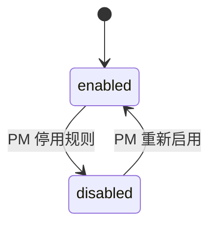
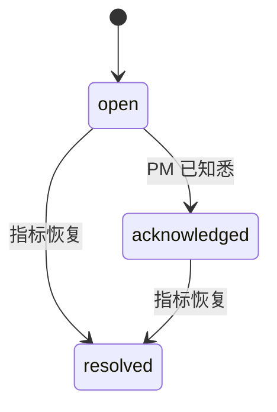

# 监控仪表盘模块详细设计

## 1. 模块实体详设

### 1.1 实体: `request_log`

| 字段 | 类型 | 约束 | 说明 |
|------|------|------|------|
| `id` | `VARCHAR(32)` | PK | 请求日志主键 |
| `request_id` | `VARCHAR(64)` | NOT NULL, UNIQUE | 请求链路标识 |
| `device_id` | `VARCHAR(64)` | NOT NULL, index | 设备 ID |
| `session_id` | `VARCHAR(64)` | NOT NULL, index | 会话 ID |
| `profile_id` | `VARCHAR(32)` | NULL | 运行时对话方案 |
| `route_type` | `VARCHAR(30)` | NOT NULL, index | `intent/knowledge/chitchat` |
| `intent_name` | `VARCHAR(80)` | NULL, index | 意图名称 |
| `latency_ms` | `INT` | NOT NULL, index | 请求耗时 |
| `is_error` | `BOOLEAN` | NOT NULL, default `false` | 是否异常 |
| `accuracy_hit` | `BOOLEAN` | NULL | 是否命中线上标注/回传准确性 |
| `request_json` | `TEXT` | NOT NULL | 输入与上下文快照 |
| `response_json` | `TEXT` | NOT NULL | 路由、意图、槽位、响应详情 |
| `created_at` | `TIMESTAMP` | NOT NULL, index | 记录时间 |

### 1.2 实体: `monitoring_alert_rule`

| 字段 | 类型 | 约束 | 说明 |
|------|------|------|------|
| `id` | `VARCHAR(32)` | PK | 规则主键 |
| `name` | `VARCHAR(80)` | NOT NULL, UNIQUE | 规则名称 |
| `metric_key` | `VARCHAR(40)` | NOT NULL | `accuracy_drop/latency_p99_ms/error_rate_spike` |
| `comparator` | `VARCHAR(10)` | NOT NULL | `gt/gte/lt/lte` |
| `threshold` | `DECIMAL(8,4)` | NOT NULL | 阈值 |
| `window_minutes` | `INT` | NOT NULL | 持续窗口 |
| `severity` | `VARCHAR(20)` | NOT NULL | `info/warn/critical` |
| `enabled` | `BOOLEAN` | NOT NULL, default `true` | 是否启用 |
| `created_by` | `VARCHAR(32)` | NOT NULL | 创建人 |
| `created_at` | `TIMESTAMP` | NOT NULL | 创建时间 |
| `updated_at` | `TIMESTAMP` | NOT NULL | 更新时间 |

### 1.3 实体: `monitoring_alert_event`

| 字段 | 类型 | 约束 | 说明 |
|------|------|------|------|
| `id` | `VARCHAR(32)` | PK | 告警事件主键 |
| `rule_id` | `VARCHAR(32)` | FK `monitoring_alert_rule.id` | 来源规则 |
| `metric_value` | `DECIMAL(8,4)` | NOT NULL | 命中时指标值 |
| `status` | `VARCHAR(20)` | NOT NULL | `open/acknowledged/resolved` |
| `triggered_at` | `TIMESTAMP` | NOT NULL | 触发时间 |
| `resolved_at` | `TIMESTAMP` | NULL | 恢复时间 |
| `payload_json` | `TEXT` | NOT NULL | 触发窗口、样本数、摘要 |

### 1.4 实体: `monitoring_metric_snapshot`

| 字段 | 类型 | 约束 | 说明 |
|------|------|------|------|
| `id` | `VARCHAR(32)` | PK | 快照主键 |
| `window_key` | `VARCHAR(20)` | NOT NULL, index | `5m/15m/60m` |
| `request_count` | `INT` | NOT NULL | 总请求量 |
| `qps` | `DECIMAL(8,4)` | NOT NULL | 每秒请求数 |
| `avg_latency_ms` | `INT` | NOT NULL | 平均延迟 |
| `p95_latency_ms` | `INT` | NOT NULL | p95 延迟 |
| `p99_latency_ms` | `INT` | NOT NULL | p99 延迟 |
| `accuracy_rate` | `DECIMAL(5,4)` | NULL | 线上准确率 |
| `error_rate` | `DECIMAL(5,4)` | NOT NULL | 错误率 |
| `route_distribution_json` | `TEXT` | NOT NULL | 路由分布 |
| `captured_at` | `TIMESTAMP` | NOT NULL, index | 生成时间 |

## 2. 状态机

### 2.1 `monitoring_alert_rule.enabled`



| 从 | 到 | 触发条件 | 前置校验 | 副作用 |
|---|----|---------|---------|--------|
| `enabled` | `disabled` | PM 手动停用 | 规则存在 | 停止继续生成新告警 |
| `disabled` | `enabled` | PM 重新启用 | 规则存在 | 下个评估周期重新参与判断 |

### 2.2 `monitoring_alert_event.status`



## 3. 核心算法

### 3.1 算法: `build_overview_metrics`

```text
load request_log in target window
aggregate request_count / qps / avg / p95 / p99
count route_type distribution
count error_rate from is_error
calculate accuracy_rate from accuracy_hit when available
load latest open alerts
return overview payload
```

### 3.2 算法: `query_request_logs`

```text
start from request_log ordered by created_at desc
apply filters:
  - time range
  - device_id
  - route_type
  - intent_name
  - latency band
  - is_error
paginate result
return items + pagination summary
```

### 3.3 算法: `evaluate_alert_rules`

```text
for each enabled rule:
    read current metric window
    compare against threshold
    if triggered and no open event:
        create monitoring_alert_event(status=open)
    if recovered and open event exists:
        mark event resolved
```

## 4. 模块级错误码

| 错误码 | 触发条件 | 用户提示 |
|--------|---------|---------|
| `MON-404-SESSION` | 会话不存在 | 目标会话不存在或已过期 |
| `MON-404-RULE` | 规则不存在 | 目标告警规则不存在 |
| `MON-409-RULE-NAME` | 规则名重复 | 告警规则名称已存在 |
| `MON-422-METRIC` | metric_key 非法 | 指标类型不合法 |
| `MON-422-WINDOW` | window/page 参数非法 | 时间窗口或分页参数不合法 |
| `MON-422-THRESHOLD` | 阈值与比较器不合法 | 请检查阈值和比较器 |

## 5. API 实现映射表

| AD 契约 | 处理器 | 服务方法 | 读写实体 |
|---------|-------|---------|---------|
| `GET /monitoring/overview` | `get_monitoring_overview()` | `build_overview_metrics()` | `request_log`, `monitoring_metric_snapshot`, `monitoring_alert_event` |
| `GET /monitoring/request-logs` | `list_request_logs()` | `query_request_logs()` | `request_log` |
| `GET /monitoring/device-sessions` | `list_device_sessions()` | `group_device_sessions()` | `request_log` |
| `GET /monitoring/sessions/{id}` | `get_session_trace()` | `build_session_trace()` | `request_log` |
| `GET /monitoring/alert-rules` | `list_alert_rules()` | `query_alert_rules()` | `monitoring_alert_rule`, `monitoring_alert_event` |
| `POST /monitoring/alert-rules` | `create_alert_rule()` | `save_alert_rule()` | `monitoring_alert_rule`, `audit_log` |
| `PATCH /monitoring/alert-rules/{id}` | `update_alert_rule()` | `update_alert_rule()` | `monitoring_alert_rule`, `audit_log` |

## 6. 前端 UI 规格

### 6.1 页面结构

| 页面 | 核心区域 | 真实成功信号 |
|------|---------|-------------|
| `MonitoringDashboardPage` | 指标卡、路由分布、请求日志筛选、最新告警 | 指标和最新告警来自后端 overview |
| `MonitoringDeviceLogsPage` | 设备搜索、会话列表、逐轮 trace | session list 和 trace 来自后端回读 |
| `MonitoringAlertRulesPage` | 规则表、新建/编辑弹窗、最近触发记录 | 规则与事件来自后端回读 |

### 6.2 交互约束

| 交互 | 约束 |
|------|------|
| 自动刷新 | 仅可复用最近真实 overview，不得本地虚构刷新成功 |
| 请求日志筛选 | 每次变更筛选必须重新请求接口，不能只过滤本地当前页 |
| 告警规则编辑 | 成功提示前必须回读最新规则列表 |

### 6.3 浏览器探针映射

| harness probe | 页面动作 | 真实成功信号 |
|---------------|---------|-------------|
| `overview_real_metrics` | 进入仪表盘并刷新 | 卡片数值、路由分布、告警列表来自后端 |
| `device_trace_drilldown` | 搜索设备并进入会话 | 看到逐轮请求链路 |
| `alert_rule_feedback` | 新建/停用规则 | 列表与最近事件真实更新 |

## 7. 测试映射

| 设计对象 | 建议测试 |
|---------|---------|
| overview 指标聚合 | 契约测试 + 集成测试 |
| 请求日志多维筛选与分页 | 契约测试 |
| 设备会话与 trace 详情 | 契约测试 + 前端页面测试 |
| 告警规则与事件收敛 | 集成测试 + browser smoke |
