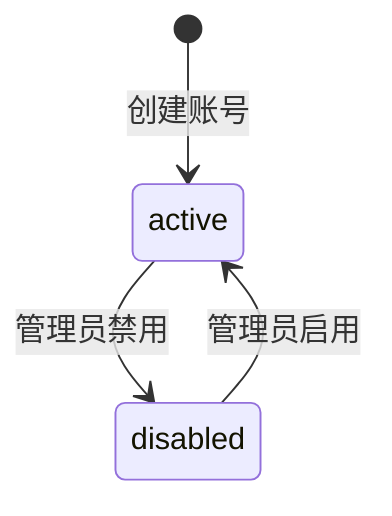

# 用户管理详细设计

## 1. 模块实体详设

### 1.1 视图模型: `UserRow`

| 字段 | 类型 | 约束 | 默认值 | 说明 |
|------|------|------|--------|------|
| `id` | `string` | 必填 | - | 表格主键 |
| `username` | `string` | 3-20 位字母/数字/下划线 | - | 登录用户名 |
| `name` | `string` | 必填，最大 50 | - | 展示姓名 |
| `role` | `enum` | `admin/pm/tester` | - | 角色 |
| `status` | `enum` | `active/disabled` | `active` | 状态 |
| `created_at` | `date` | 必填 | - | 创建日期 |
| `last_login_at` | `datetime/null` | 可空 | `null` | 最近登录时间 |

### 1.2 命令对象: `CreateUserCommand`

| 字段 | 类型 | 约束 | 说明 |
|------|------|------|------|
| `username` | `string` | regex `^[A-Za-z0-9_]{3,20}$` | 与 PD 表单一致 |
| `name` | `string` | 1-50 | 用户姓名 |
| `password` | `string` | min 8, max 64 | 初始密码 |
| `role` | `enum` | `admin/pm/tester` | 初始角色 |

### 1.3 命令对象: `ChangeRoleCommand`

| 字段 | 类型 | 约束 | 说明 |
|------|------|------|------|
| `user_id` | `string` | 必填 | 目标用户 |
| `role` | `enum` | `admin/pm/tester` | 新角色 |

### 1.4 命令对象: `SetUserStatusCommand`

| 字段 | 类型 | 约束 | 说明 |
|------|------|------|------|
| `user_id` | `string` | 必填 | 目标用户 |
| `status` | `enum` | `active/disabled` | 新状态 |

## 2. 状态机

### 2.1 `user_account.status`



| 状态 | 含义 | 允许操作 |
|------|------|---------|
| `active` | 可登录、可访问授权菜单 | 改角色、重置密码、禁用 |
| `disabled` | 不可登录，旧会话失效 | 改角色、重置密码、启用 |

| 从 | 到 | 触发条件 | 前置校验 | 副作用 | 对应 API |
|---|----|---------|---------|--------|---------|
| `active` | `disabled` | 管理员关闭开关 | 不是内置 admin；不是最后一个启用 admin | `token_version + 1`，写审计日志 | `POST /api/v1/admin/users/{id}/status` |
| `disabled` | `active` | 管理员重新启用 | 用户存在 | `token_version + 1`，写审计日志 | `POST /api/v1/admin/users/{id}/status` |

## 3. 核心算法

### 3.1 算法: `create_user`

**对应 FR**: FR-001  
**对应 AD 数据流**: `ad-user-mgmt.md` §3.1

#### 伪代码

```text
validate username/name/password/role
if username already exists:
    raise USER-409-USERNAME

next_id = allocate_user_code()
password_hash = hash_password(password)
insert user_account(
    id=next_id,
    username,
    display_name=name,
    password_hash,
    role_key=role,
    status='active',
    token_version=1,
    is_builtin_admin=false
)
write_audit('user_created')
return fresh_user_snapshot()
```

### 3.2 算法: `change_role`

```text
load target user
if target user missing:
    raise USER-404-NOT-FOUND

if target user is builtin admin and new role != 'admin':
    raise USER-409-BUILTIN-ADMIN

if target role != 'admin' and target user is last enabled admin:
    raise USER-409-LAST-ADMIN

update role_key = new_role
increment token_version
write_audit('role_changed', before_role, after_role)
return user_snapshot + capability_preview(new_role)
```

### 3.3 算法: `set_user_status`

```text
load target user
if target user missing:
    raise USER-404-NOT-FOUND

if target user.username == 'admin' or target user.is_builtin_admin:
    raise USER-409-BUILTIN-ADMIN

if target status == 'disabled' and target user is last enabled admin:
    raise USER-409-LAST-ADMIN

update status
increment token_version
write_audit('status_changed', before_status, after_status)
return user_snapshot
```

### 3.4 算法: `resolve_capabilities`

```text
role = load role_definition by role_key
capabilities = load bindings by role_key
return {
  role_key,
  role_label,
  capabilities: [
    { capability_key, description, condition_note }
  ]
}
```

## 4. 模块级错误码

| 错误码 | 触发条件 | 用户提示 |
|--------|---------|---------|
| `USER-409-USERNAME` | 用户名已存在 | 用户名已存在，请更换后重试 |
| `USER-409-BUILTIN-ADMIN` | 修改/禁用内置 admin | 内置管理员账号受保护，不能执行该操作 |
| `USER-409-LAST-ADMIN` | 最后一个启用管理员保护 | 系统至少保留一个启用中的管理员账号 |
| `USER-422-ROLE` | 非法角色值 | 角色值不合法 |
| `USER-422-FORM` | 表单字段校验失败 | 请检查用户名、姓名和密码格式 |

## 5. API 实现映射表

| AD 契约 | 处理器 | 服务方法 | 读写实体 |
|---------|-------|---------|---------|
| `GET /api/v1/admin/users` | `list_users()` | `query_user_directory()` | `user_account` |
| `POST /api/v1/admin/users` | `create_user()` | `create_user()` | `user_account`, `audit_log` |
| `PATCH /api/v1/admin/users/{id}/role` | `update_user_role()` | `change_role()` | `user_account`, `role_capability_binding`, `audit_log` |
| `POST /api/v1/admin/users/{id}/reset-password` | `reset_password()` | `reset_password()` | `user_account`, `audit_log` |
| `POST /api/v1/admin/users/{id}/status` | `set_user_status()` | `set_user_status()` | `user_account`, `audit_log` |
| `GET /api/v1/admin/permission-matrix` | `get_permission_matrix()` | `resolve_permission_matrix()` | `role_definition`, `capability_definition`, `role_capability_binding` |

## 6. 前端 UI 规格

### 6.1 页面结构

| 区域 | 组件 | 规格 |
|------|------|------|
| 顶部统计区 | 4 张统计卡 | 总账号数、管理员数、PM 数、测试人员数 |
| 主表格 | 用户列表 | 列：用户名、姓名、角色、状态、创建日期、最后登录、操作 |
| 操作列 | 行内按钮/开关 | 编辑角色、重置密码、启停用 |
| 弹窗 A | 创建账号 | 字段：用户名、姓名、初始密码、角色 |
| 弹窗 B | 编辑角色 | 字段：新角色 + 权限预览 |
| Tab | 权限矩阵 | 按能力点展示 admin / pm / tester 三列 |

### 6.2 前端交互约束

| 交互 | 约束 |
|------|------|
| 创建账号成功 | 关闭弹窗、重置表单、回读列表与统计卡 |
| 创建账号取消 | 关闭弹窗且清空表单 |
| 角色修改成功 | 关闭弹窗、清空 `editingUser`、回读列表 |
| 角色预览 | 切换角色即回显新角色能力点，不依赖保存后才可见 |
| 禁用内置 admin | 开关立即回弹并展示错误提示 |

### 6.3 浏览器验证探针映射

| harness probe | 页面动作 | 真实成功信号 |
|---------------|---------|-------------|
| `permission_visibility` | 用不同角色重新登录 | 侧边栏菜单项按 capability 隐藏/显示 |
| `form_reset` | 打开创建弹窗后取消 | 再次打开时字段为空、角色回到默认值 |
| `result_readback` | 创建账号/改角色/改状态 | 成功后列表与统计卡来自接口回读而非本地硬编码 |

## 7. 测试映射

| 设计对象 | 建议测试 |
|---------|---------|
| `create_user` 校验 | 契约测试 + 单元测试 |
| `change_role` 最少管理员保护 | 集成测试 |
| `set_user_status` token 失效 | 集成测试 |
| 统计卡回读 | 前端消费契约测试 |
| 创建账号/编辑角色/权限矩阵 | E2E + browser smoke |
